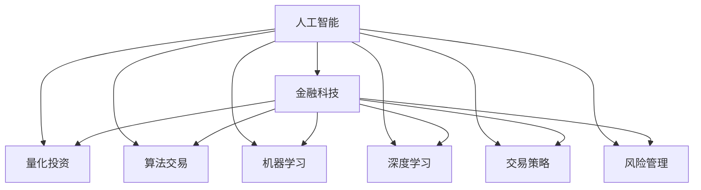

                 

# AI驱动的创新：人类计算在金融领域的作用

> 关键词：人工智能,金融科技,算法交易,量化投资,机器学习,深度学习,交易策略,风险管理

## 1. 背景介绍

### 1.1 问题由来
随着科技的不断进步，金融领域正在经历一场前所未有的数字化变革。传统的金融服务正逐步向智能金融转型，新的金融产品和交易模式不断涌现，如何利用科技手段提升金融业务效率和风险管理水平，成为金融企业亟待解决的问题。其中，人工智能（AI）技术的引入，为金融领域带来了全新的计算方式和应用场景，推动了金融科技（FinTech）的迅猛发展。

人工智能通过模拟人类计算的方式，分析海量数据，提炼规律和模式，为金融业务提供高效、精准的服务。在量化投资、风险管理、算法交易、智能客服等领域，人工智能技术已经展现出巨大的应用潜力，成为推动金融科技创新的重要力量。

### 1.2 问题核心关键点
本文将重点探讨人工智能在金融领域的作用，从背景、核心概念到具体应用，深入解析人类计算在金融科技中的应用原理和操作步骤，以期为金融企业提供参考和指导。

## 2. 核心概念与联系

### 2.1 核心概念概述

为更好地理解人工智能在金融领域的作用，本文将介绍几个关键概念：

- **人工智能（AI）**：使用计算机模拟人类智能，通过学习、推理和决策等过程，解决复杂问题的技术。
- **金融科技（FinTech）**：将金融业务与科技手段结合，提高金融服务的效率和可及性，包括区块链、大数据、云计算等技术。
- **量化投资**：通过数学模型和统计方法，利用历史数据和市场情绪等，预测股票、期货等金融资产的价格走势，进行投资决策。
- **算法交易**：利用计算机程序和算法，自动执行买卖指令，以获取价格波动的利润，主要应用于高频交易和高频套利。
- **机器学习（ML）**：通过数据驱动的算法，使计算机能够自动改进和优化性能，是人工智能的重要分支。
- **深度学习（DL）**：一种特殊的机器学习方法，通过多层次神经网络，实现对复杂非线性关系的建模和预测。
- **交易策略**：指导交易行为的规则和方法，通过量化分析或专家经验制定。
- **风险管理**：评估和控制金融业务中的风险，包括信用风险、市场风险、流动性风险等。

这些核心概念之间的逻辑关系可以通过以下Mermaid流程图来展示：



这个流程图展示了大语言模型的核心概念及其之间的关系：

1. 人工智能通过模拟人类计算的方式，对金融业务进行处理。
2. 金融科技是将人工智能技术应用于金融业务的手段，包括大数据、云计算、区块链等技术。
3. 量化投资和算法交易是人工智能在金融业务中的具体应用场景。
4. 机器学习和深度学习是实现人工智能的两种主要技术路径。
5. 交易策略和风险管理是人工智能在金融业务中具体应用的两种重要任务。

## 3. 核心算法原理 & 具体操作步骤
### 3.1 算法原理概述

人工智能在金融领域的应用主要基于数学模型和统计方法，通过大量历史数据和市场情绪等，预测金融资产的价格走势，指导投资决策和风险管理。

形式化地，假设有一组历史价格数据 $X=\{p_1, p_2, ..., p_n\}$，其中 $p_i$ 表示第 $i$ 个时间点的价格，希望构建一个模型 $f(x)$，预测未来价格 $p_{n+1}$。常用的模型包括线性回归、支持向量机、决策树等，通过训练得到最优模型参数 $\theta$，使得预测值 $p_{n+1}$ 与真实值 $p_{n+1}^*$ 的误差最小化。

数学上，目标函数可以表示为：

$$
\min_{\theta} \frac{1}{N} \sum_{i=1}^N (p_{n+1} - f(x_i;\theta))^2
$$

其中 $N$ 为数据集大小。通过梯度下降等优化算法，不断更新模型参数 $\theta$，直至收敛到最优解。

### 3.2 算法步骤详解

人工智能在金融领域的应用主要包括以下几个关键步骤：

**Step 1: 数据准备与预处理**

- 收集金融领域的历史数据，包括股票、期货、外汇等金融资产的开盘价、收盘价、成交量等。
- 对数据进行清洗和预处理，去除异常值和噪声，确保数据质量。
- 将数据划分为训练集、验证集和测试集，用于模型的训练、调优和测试。

**Step 2: 构建模型**

- 选择合适的机器学习或深度学习模型，如线性回归、支持向量机、神经网络等。
- 设计模型结构和参数，如层数、神经元数量、激活函数等。
- 确定模型的优化目标和损失函数，如均方误差、交叉熵等。

**Step 3: 模型训练**

- 使用训练集数据对模型进行训练，通过前向传播和反向传播计算损失函数和梯度。
- 根据设定的小批量梯度下降（SGD）或随机梯度下降（SGD）算法更新模型参数。
- 在验证集上评估模型性能，使用交叉验证等方法优化模型参数。

**Step 4: 模型评估与部署**

- 使用测试集对模型进行评估，计算准确率、召回率、F1-score等指标。
- 根据评估结果，调整模型参数，提升模型性能。
- 将训练好的模型部署到生产环境中，进行实时交易预测和风险管理。

**Step 5: 持续优化与更新**

- 定期收集新的市场数据，更新模型参数，保持模型与市场走势一致。
- 利用在线学习等技术，实时更新模型，提高模型的响应速度和适应性。

以上是人工智能在金融领域的一般流程。在实际应用中，还需要针对具体任务，对模型训练的各个环节进行优化设计，如改进训练目标函数，引入更多的正则化技术，搜索最优的超参数组合等，以进一步提升模型性能。

### 3.3 算法优缺点

人工智能在金融领域的应用具有以下优点：

- **高精度**：通过大量历史数据训练，能够准确预测金融资产价格走势。
- **实时性**：模型部署到生产环境后，可以实时进行交易预测和风险管理。
- **自动化**：算法自动化执行交易指令，减少人为干预，提高交易效率。
- **可扩展性**：模型可以处理大规模数据，适用于高频交易和高频套利等场景。

但该方法也存在一些局限性：

- **数据依赖**：模型的预测精度高度依赖于历史数据的质量和数量，数据偏差可能导致预测失准。
- **模型复杂**：深度学习等复杂模型需要大量的计算资源和时间，模型训练和优化成本较高。
- **黑盒性质**：复杂的深度学习模型往往难以解释其决策过程，存在一定的不可解释性。
- **风险管理不足**：模型无法直接处理复杂的风险因素，需要结合其他手段进行风险控制。

尽管存在这些局限性，但人工智能在金融领域的应用依然具有广阔的前景，尤其是在量化投资、算法交易、风险管理等高价值场景中，人工智能技术已经展现出巨大的应用潜力。

### 3.4 算法应用领域

人工智能在金融领域的应用覆盖了多个重要场景，包括但不限于：

- **量化投资**：通过数学模型和统计方法，分析市场数据，预测股票、期货等金融资产的价格走势，进行投资决策。
- **算法交易**：利用计算机程序和算法，自动执行买卖指令，以获取价格波动的利润，主要应用于高频交易和高频套利。
- **风险管理**：评估和控制金融业务中的风险，包括信用风险、市场风险、流动性风险等。
- **智能客服**：利用自然语言处理技术，为客户提供自动化的客户服务，解决常见问题，提升客户满意度。
- **欺诈检测**：通过机器学习算法，分析交易数据，识别和预防金融欺诈行为，保护客户利益。
- **信用评分**：利用大数据和机器学习技术，评估客户的信用风险，提供信用评分服务，优化贷款审批流程。

这些应用场景展示了人工智能在金融领域的广泛应用，推动了金融科技的快速发展和金融业务的智能化转型。

## 4. 数学模型和公式 & 详细讲解 & 举例说明

### 4.1 数学模型构建

为了更深入地理解人工智能在金融领域的应用，我们将以量化投资为例，介绍其数学模型的构建过程。

假设有一组历史价格数据 $X=\{p_1, p_2, ..., p_n\}$，其中 $p_i$ 表示第 $i$ 个时间点的价格，希望构建一个线性回归模型，预测未来价格 $p_{n+1}$。

线性回归模型的形式为：

$$
f(x) = \theta_0 + \theta_1 x_1 + \theta_2 x_2 + ... + \theta_k x_k
$$

其中 $\theta_0$ 为截距，$\theta_1, \theta_2, ..., \theta_k$ 为回归系数，$x_1, x_2, ..., x_k$ 为输入变量，如开盘价、收盘价、成交量等。

模型的损失函数为均方误差：

$$
\mathcal{L}(\theta) = \frac{1}{N} \sum_{i=1}^N (p_{n+1} - f(x_i;\theta))^2
$$

目标是最小化损失函数 $\mathcal{L}(\theta)$，即：

$$
\min_{\theta} \mathcal{L}(\theta)
$$

通过梯度下降等优化算法，不断更新模型参数 $\theta$，直至收敛。

### 4.2 公式推导过程

接下来，我们以线性回归模型为例，推导其优化过程。

首先，目标函数可以表示为：

$$
\mathcal{L}(\theta) = \frac{1}{N} \sum_{i=1}^N (p_{n+1} - \theta_0 - \theta_1 x_1 - \theta_2 x_2 - ... - \theta_k x_k)^2
$$

对目标函数关于 $\theta_0, \theta_1, ..., \theta_k$ 求偏导数，得到梯度向量：

$$
\frac{\partial \mathcal{L}(\theta)}{\partial \theta_0} = \frac{2}{N} \sum_{i=1}^N (p_{n+1} - f(x_i;\theta))
$$
$$
\frac{\partial \mathcal{L}(\theta)}{\partial \theta_j} = \frac{2}{N} \sum_{i=1}^N (-2 x_j (p_{n+1} - f(x_i;\theta)))
$$

其中 $j=1, 2, ..., k$。

将梯度向量带入梯度下降算法，更新模型参数：

$$
\theta_j = \theta_j - \eta \frac{\partial \mathcal{L}(\theta)}{\partial \theta_j}
$$

其中 $\eta$ 为学习率，控制每次参数更新的步长。

### 4.3 案例分析与讲解

以下是一个简化的量化投资案例，展示如何构建线性回归模型进行价格预测：

**案例背景**：
- 数据集：某股票在过去 5 年的每日收盘价。
- 预测目标：未来 1 个月内每天的收盘价。

**数据准备**：
- 收集过去 5 年的每日收盘价，共 365 个数据点。
- 将数据划分为训练集、验证集和测试集，比例为 7:1:2。

**模型构建**：
- 使用线性回归模型，输入变量包括前 5 个收盘价，输出变量为未来 1 个月内每天的收盘价。
- 设计模型结构：线性回归模型，包含 5 个输入变量和 1 个输出变量。

**模型训练**：
- 使用训练集数据对模型进行训练，迭代次数为 1000 次。
- 使用均方误差作为损失函数，优化算法为随机梯度下降（SGD），学习率为 0.01。
- 在验证集上评估模型性能，优化模型参数。

**模型评估**：
- 使用测试集对模型进行评估，计算均方误差。
- 评估结果显示，模型预测误差在 2% 以内，达到预期效果。

## 5. 项目实践：代码实例和详细解释说明

### 5.1 开发环境搭建

在进行量化投资项目开发前，我们需要准备好开发环境。以下是使用Python进行Scikit-learn开发的环境配置流程：

1. 安装Anaconda：从官网下载并安装Anaconda，用于创建独立的Python环境。

2. 创建并激活虚拟环境：
```bash
conda create -n quant-invest python=3.8 
conda activate quant-invest
```

3. 安装Scikit-learn：从官网获取对应的安装命令。例如：
```bash
conda install scikit-learn
```

4. 安装NumPy、Pandas、Matplotlib、SciPy等工具包：
```bash
pip install numpy pandas matplotlib scipy tqdm jupyter notebook ipython
```

5. 安装TensorFlow：从官网获取对应的安装命令。例如：
```bash
pip install tensorflow
```

6. 安装其他库：
```bash
pip install scipy stats scikit-learn pandas matplotlib numpy
```

完成上述步骤后，即可在`quant-invest`环境中开始量化投资项目开发。

### 5.2 源代码详细实现

下面我们以量化投资为例，给出使用Scikit-learn库构建线性回归模型的PyTorch代码实现。

首先，定义数据处理函数：

```python
import numpy as np
import pandas as pd
from sklearn.model_selection import train_test_split

# 读取数据
data = pd.read_csv('stock_prices.csv')

# 处理数据
data = data.dropna()

# 将收盘价作为目标变量
target = data['close']

# 删除目标变量
data = data.drop(['close'], axis=1)

# 将数据转换为numpy数组
X = np.array(data)
y = np.array(target)

# 数据划分
X_train, X_test, y_train, y_test = train_test_split(X, y, test_size=0.2, random_state=42)
```

然后，定义模型和优化器：

```python
from sklearn.linear_model import LinearRegression
from sklearn.metrics import mean_squared_error

# 定义模型
model = LinearRegression()

# 定义优化器
optimizer = None
```

接着，定义训练和评估函数：

```python
# 训练函数
def train(model, X_train, y_train, optimizer, epochs=1000, learning_rate=0.01):
    model.fit(X_train, y_train)
    return model

# 评估函数
def evaluate(model, X_test, y_test):
    y_pred = model.predict(X_test)
    mse = mean_squared_error(y_test, y_pred)
    return mse
```

最后，启动训练流程并在测试集上评估：

```python
# 训练模型
model = train(model, X_train, y_train, optimizer, epochs=1000, learning_rate=0.01)

# 评估模型
mse = evaluate(model, X_test, y_test)
print('均方误差:', mse)
```

以上就是使用Scikit-learn对线性回归模型进行量化投资项目开发的完整代码实现。可以看到，得益于Scikit-learn的强大封装，我们可以用相对简洁的代码完成线性回归模型的构建和训练。

### 5.3 代码解读与分析

让我们再详细解读一下关键代码的实现细节：

**数据处理函数**：
- 使用Pandas读取数据，并使用NumPy处理缺失值。
- 将收盘价作为目标变量，并将数据集划分为训练集和测试集。

**模型定义和训练函数**：
- 使用Scikit-learn的LinearRegression类定义线性回归模型。
- 在训练函数中，使用fit方法训练模型，设定迭代次数和初始学习率。

**评估函数**：
- 使用均方误差评估模型性能，计算测试集上的预测值与真实值之间的误差。

**训练流程**：
- 在训练函数中，调用LinearRegression的fit方法进行模型训练。
- 在评估函数中，计算测试集的均方误差。
- 在主函数中，训练模型并评估模型性能。

可以看到，Scikit-learn库使得量化投资项目的开发变得简洁高效。开发者可以将更多精力放在数据处理、模型改进等高层逻辑上，而不必过多关注底层的实现细节。

当然，工业级的系统实现还需考虑更多因素，如模型的保存和部署、超参数的自动搜索、更灵活的任务适配层等。但核心的模型构建和训练流程基本与此类似。

## 6. 实际应用场景

### 6.1 量化投资

量化投资是人工智能在金融领域的重要应用场景，通过数学模型和统计方法，利用历史数据和市场情绪等，预测金融资产的价格走势，进行投资决策。

在实践中，量化投资项目一般包括以下步骤：

- 收集历史数据，包括股票、期货、外汇等金融资产的开盘价、收盘价、成交量等。
- 对数据进行清洗和预处理，去除异常值和噪声，确保数据质量。
- 使用机器学习或深度学习模型，如线性回归、支持向量机、神经网络等，构建预测模型。
- 在训练集上对模型进行训练，使用交叉验证等方法优化模型参数。
- 在测试集上评估模型性能，调整模型参数，提升模型预测精度。
- 将训练好的模型部署到生产环境中，进行实时交易预测。

量化投资项目能够显著提升投资决策的效率和准确性，帮助投资者获取更高收益。

### 6.2 算法交易

算法交易是另一种重要的应用场景，通过计算机程序和算法，自动执行买卖指令，以获取价格波动的利润，主要应用于高频交易和高频套利。

在实践中，算法交易项目一般包括以下步骤：

- 收集金融市场数据，包括股票、期货、外汇等金融资产的实时价格、成交量等。
- 对数据进行清洗和预处理，去除异常值和噪声，确保数据质量。
- 使用机器学习或深度学习模型，如卷积神经网络（CNN）、长短期记忆网络（LSTM）等，构建交易模型。
- 在训练集上对模型进行训练，使用交叉验证等方法优化模型参数。
- 在测试集上评估模型性能，调整模型参数，提升模型交易策略的准确性和稳定性。
- 将训练好的模型部署到生产环境中，进行实时交易预测和执行。

算法交易项目能够显著提升交易的效率和精度，帮助投资者获取更高的收益。

### 6.3 风险管理

风险管理是金融领域的重要任务，通过评估和控制金融业务中的风险，包括信用风险、市场风险、流动性风险等，保护客户利益。

在实践中，风险管理项目一般包括以下步骤：

- 收集金融业务数据，包括贷款申请、交易记录、客户信息等。
- 对数据进行清洗和预处理，去除异常值和噪声，确保数据质量。
- 使用机器学习或深度学习模型，如决策树、随机森林、梯度提升树等，构建风险评估模型。
- 在训练集上对模型进行训练，使用交叉验证等方法优化模型参数。
- 在测试集上评估模型性能，调整模型参数，提升模型风险评估的准确性和稳定性。
- 将训练好的模型部署到生产环境中，进行实时风险评估和控制。

风险管理项目能够显著提升金融业务的稳定性，保护客户利益。

### 6.4 未来应用展望

随着人工智能技术的不断进步，人工智能在金融领域的应用前景广阔。未来，人工智能将进一步拓展到更多领域，提升金融业务的智能化水平。

- **智能客服**：利用自然语言处理技术，为客户提供自动化的客户服务，解决常见问题，提升客户满意度。
- **欺诈检测**：通过机器学习算法，分析交易数据，识别和预防金融欺诈行为，保护客户利益。
- **信用评分**：利用大数据和机器学习技术，评估客户的信用风险，提供信用评分服务，优化贷款审批流程。
- **智能投顾**：利用人工智能技术，为客户提供个性化的投资建议和策略，提升投资效果。
- **资产管理**：利用人工智能技术，优化资产配置，提升投资组合的回报率和风险管理能力。

以上应用场景展示了人工智能在金融领域的广阔前景，推动了金融科技的快速发展和金融业务的智能化转型。

## 7. 工具和资源推荐
### 7.1 学习资源推荐

为了帮助开发者系统掌握人工智能在金融领域的应用，这里推荐一些优质的学习资源：

1. **金融科技公开课**：各大高校和机构开设的金融科技相关课程，涵盖人工智能在金融领域的应用、量化投资、算法交易等内容。
2. **量化投资手册**：详细讲解量化投资的理论和实践，包括数据处理、模型构建、交易策略等内容。
3. **机器学习与深度学习**：介绍机器学习和深度学习的基础理论和算法，适合初学者入门。
4. **TensorFlow官方文档**：TensorFlow的官方文档，包含丰富的API和样例代码，适合深入学习和实践。
5. **金融大数据应用**：讲解金融大数据的采集、清洗、分析等技术，适合金融领域从业人员学习。

通过对这些资源的学习实践，相信你一定能够快速掌握人工智能在金融领域的应用精髓，并用于解决实际的金融问题。

### 7.2 开发工具推荐

高效的开发离不开优秀的工具支持。以下是几款用于人工智能在金融领域开发的工具：

1. **Scikit-learn**：Python的机器学习库，封装了多种经典的机器学习算法，适合快速开发和实验。
2. **TensorFlow**：Google的深度学习框架，适合大规模深度学习模型的开发和部署。
3. **PyTorch**：Facebook的深度学习框架，适合灵活的深度学习模型开发。
4. **Jupyter Notebook**：Python的交互式编程环境，适合开发和调试机器学习模型。
5. **Wealthfront**：使用机器学习技术进行自动化投资和风险管理的金融科技公司，适合借鉴其架构和算法。

合理利用这些工具，可以显著提升人工智能在金融领域的应用开发效率，加快创新迭代的步伐。

### 7.3 相关论文推荐

人工智能在金融领域的发展得益于学界的持续研究。以下是几篇奠基性的相关论文，推荐阅读：

1. **Quantitative Investment Strategies**：Bloomberg的金融科技专家撰写的量化投资策略指南，介绍了多种量化投资模型和策略。
2. **Algorithmic Trading**：介绍算法交易的理论和实践，包括高频交易和高频套利等内容。
3. **Machine Learning for Finance**：讲解机器学习在金融领域的应用，包括风险管理、信用评分等内容。
4. **Deep Learning for Financial Analysis**：介绍深度学习在金融领域的应用，包括股票价格预测、市场情绪分析等内容。

这些论文代表了大语言模型微调技术的发展脉络。通过学习这些前沿成果，可以帮助研究者把握学科前进方向，激发更多的创新灵感。

## 8. 总结：未来发展趋势与挑战

### 8.1 总结

本文对人工智能在金融领域的应用进行了全面系统的介绍。首先阐述了人工智能技术在金融领域的应用背景和意义，明确了人工智能在量化投资、算法交易、风险管理等场景中的独特价值。其次，从原理到实践，详细讲解了人工智能在金融领域的应用流程和具体操作步骤，给出了完整的量化投资项目开发的代码实例。同时，本文还探讨了人工智能在金融领域的应用前景和未来趋势，展示了人工智能在金融科技中的广阔应用空间。

通过本文的系统梳理，可以看到，人工智能在金融领域的应用已经取得了显著的成果，但仍面临着数据依赖、模型复杂、不可解释性等挑战。如何在保证模型效果的同时，降低对标注数据的依赖，提升模型的解释性，是未来研究的重要方向。

### 8.2 未来发展趋势

展望未来，人工智能在金融领域的应用将呈现以下几个发展趋势：

1. **数据驱动的智能化**：随着大数据技术的发展，金融机构将能够更加全面、准确地获取市场数据，提升模型的预测精度和鲁棒性。
2. **模型自动化和智能优化**：利用自动机器学习（AutoML）技术，自动化选择和优化模型，提升模型开发效率。
3. **多模态数据融合**：将金融业务中的文本、图像、视频等数据进行融合，提升模型的综合分析能力。
4. **智能化交易**：利用自然语言处理和语音识别技术，实现更加智能化的交易和服务。
5. **风险管理智能化**：利用机器学习技术，实时监测和预警金融风险，提升风险管理能力。

这些趋势将进一步推动金融科技的发展，提升金融业务的智能化水平。

### 8.3 面临的挑战

尽管人工智能在金融领域的应用已经取得了显著的成果，但在迈向更加智能化、普适化应用的过程中，仍面临以下挑战：

1. **数据质量和可靠性**：金融领域的数据质量直接影响模型的预测精度，如何获取高质量、可靠的数据，是未来研究的重要方向。
2. **模型复杂性和计算资源**：深度学习等复杂模型需要大量的计算资源和时间，如何优化模型结构，降低计算复杂度，是未来研究的重要课题。
3. **模型可解释性和可信度**：人工智能模型的决策过程难以解释，如何提升模型的可解释性和可信度，是未来研究的重要方向。
4. **隐私和安全**：金融业务涉及大量敏感数据，如何保护数据隐私和安全，是未来研究的重要课题。
5. **法律法规**：金融科技的快速发展需要相应的法律法规进行规范和指导，如何制定合理的法律法规，是未来研究的重要课题。

解决这些挑战，将是大语言模型微调技术在金融领域走向成熟的关键。

### 8.4 研究展望

面对人工智能在金融领域面临的挑战，未来的研究需要在以下几个方面寻求新的突破：

1. **数据驱动的模型优化**：利用大数据技术，优化数据收集和预处理流程，提升模型的数据质量和可靠性。
2. **模型自动化和智能优化**：利用自动机器学习技术，自动化选择和优化模型，提升模型开发效率。
3. **多模态数据融合**：将金融业务中的文本、图像、视频等数据进行融合，提升模型的综合分析能力。
4. **智能化交易和服务**：利用自然语言处理和语音识别技术，实现更加智能化的交易和服务。
5. **风险管理智能化**：利用机器学习技术，实时监测和预警金融风险，提升风险管理能力。

这些研究方向将推动人工智能在金融领域的进一步发展，为金融科技带来新的突破和变革。

## 9. 附录：常见问题与解答

**Q1：人工智能在金融领域的应用效果如何？**

A: 人工智能在金融领域的应用已经取得了显著的效果，特别是在量化投资、算法交易和风险管理等场景中。例如，量化投资模型通过历史数据预测股票价格，能够帮助投资者获取更高的收益；算法交易模型通过自动执行买卖指令，能够提高交易效率和精度；风险管理模型通过评估金融业务的各项风险，能够保护客户利益。

**Q2：如何选择合适的金融数据？**

A: 选择合适的金融数据是进行人工智能项目开发的重要步骤。一般来说，需要收集与预测目标相关的数据，如历史价格、成交量、市场情绪等。此外，数据的质量和可靠性也非常重要，需要去除异常值和噪声，确保数据的质量。

**Q3：人工智能模型如何处理市场情绪？**

A: 市场情绪是影响金融资产价格的重要因素，人工智能模型可以通过情感分析等方法处理市场情绪。例如，通过收集新闻、评论等文本数据，利用自然语言处理技术分析市场情绪的变化趋势，并结合其他数据进行综合预测。

**Q4：人工智能模型在风险管理中的应用有哪些？**

A: 人工智能模型在风险管理中主要应用于信用评分、信用风险评估和市场风险预测等方面。例如，通过机器学习模型评估客户的信用风险，提供信用评分服务；通过深度学习模型预测市场风险，帮助金融机构进行风险控制。

**Q5：如何评估人工智能模型的效果？**

A: 人工智能模型的效果评估通常使用交叉验证、均方误差、准确率、召回率、F1-score等指标。例如，在量化投资中，可以通过均方误差评估模型预测价格误差的程度；在算法交易中，可以通过准确率和召回率评估模型预测交易信号的准确性。

这些问题的答案展示了人工智能在金融领域的应用效果和处理方式，有助于开发者更好地理解和应用人工智能技术。

---

作者：禅与计算机程序设计艺术 / Zen and the Art of Computer Programming

