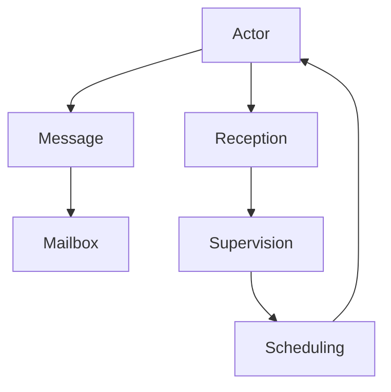
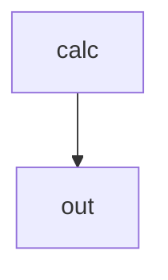

                 

# Actor Model原理与代码实例讲解

> 关键词：Actor Model, Actor, Message Passing, Concurrent Programming, Scalability, Fault Tolerance, Distributed Systems, Akka

## 1. 背景介绍

### 1.1 问题由来

在分布式系统中，传统基于共享状态的全局方法往往会导致锁竞争、阻塞、性能瓶颈等问题。这些问题在可扩展性、可靠性等方面存在固有缺陷，无法满足现代大规模分布式系统的发展需求。为此，需要一种新型的编程模型，能够更灵活地管理系统中的并发状态，实现高可用、高性能、可扩展的分布式计算。

Actor Model（行为模型）是一种基于消息传递的并发编程模型，由Erlang语言创始人Johan Wittbrant于1976年提出。它借鉴了并发理论中的Actor理论，通过抽象和约束实现状态并发，强调并发任务之间的松耦合关系，能够有效解决上述问题。

### 1.2 问题核心关键点

Actor Model的核心理念是将程序抽象成一系列Actor（行为），每个Actor独立执行，通过异步消息传递实现行为之间的协作。Actor Model通过一系列的原则和约束，实现了状态并发和消息传递，其核心特性包括：

- 松耦合：Actor之间仅通过消息传递进行通信，相互之间完全独立，不存在共享状态。
- 单线程：每个Actor在一个线程上执行，内部逻辑完全单线程，不会并发。
- 同步阻塞：Actor之间消息传递采用同步阻塞机制，即接收方在收到消息后立即处理，响应速度较快。
- 持续接收：Actor通过一个不断接收消息的循环，实现异步消息传递。
- 持久化状态：Actor的状态可以持久化存储，避免数据丢失。
- 可靠传递：Actor模型内置了消息可靠性传递机制，确保消息传递不会丢失。

这些特性使得Actor Model在构建高性能、高可用性、可扩展的分布式系统中具有重要价值。

## 2. 核心概念与联系

### 2.1 核心概念概述

Actor Model包含多个核心概念，这些概念相互关联，共同构成了Actor模型的编程范式：

- Actor：程序中的最小执行单元，负责处理特定类型的事务，并通过消息传递与其它Actor协作。
- Message：Actor间传递的数据单元，包含请求和响应，用于实现异步通信。
- Mailbox：Actor内部用于缓存未处理消息的队列，每个Actor拥有一个Mailbox。
- Reception：Actor的接收机制，用于处理传入的消息。
- Supervision：Actor的监督机制，用于管理和恢复失败Actor。
- Scheduling：Actor的调度机制，用于指定Actor的启动、执行和终止。

这些概念通过一系列的原则和约束，实现了一种松耦合、高并发的编程范式。

### 2.2 核心概念原理和架构的 Mermaid 流程图



这个Mermaid流程图展示了Actor Model的基本架构和消息传递关系。每个Actor通过异步消息传递与其它Actor协作，内部逻辑独立执行，确保状态并发和消息传递的可靠性。

## 3. 核心算法原理 & 具体操作步骤

### 3.1 算法原理概述

Actor Model的算法原理主要包括以下几个方面：

1. Actor模型：将程序抽象成一系列Actor，每个Actor独立执行，并通过异步消息传递与其它Actor协作。
2. Message传递：Actor之间通过消息传递进行通信，消息包含请求和响应，用于实现异步通信。
3. Mailbox机制：每个Actor拥有一个Mailbox，用于缓存未处理消息。
4. Reception处理：Actor的接收机制，用于处理传入的消息。
5. Supervision策略：Actor的监督机制，用于管理和恢复失败Actor。
6. Scheduling调度：Actor的调度机制，用于指定Actor的启动、执行和终止。

### 3.2 算法步骤详解

Actor Model的实现步骤如下：

1. 定义Actor：使用继承或组合方式定义Actor类，实现Actor的基本行为和消息处理逻辑。
2. 创建Actor：在应用程序中创建Actor实例，通过Actor的构造函数指定Actor的初始状态和行为。
3. 发送消息：通过Actor类提供的send方法向其它Actor发送消息，消息包含请求和响应，实现异步通信。
4. 接收消息：使用Actor的reception机制处理传入的消息，将消息传递给对应的处理函数进行处理。
5. 监督Actor：通过Supervision机制管理和恢复失败Actor，确保系统的高可用性和可靠性。
6. 调度Actor：通过Scheduling机制指定Actor的启动、执行和终止，实现Actor的生命周期管理。

### 3.3 算法优缺点

Actor Model的优点包括：

1. 高并行性：Actor之间独立执行，消息传递异步进行，实现高并发和高并行性。
2. 高可靠性：Actor内置了消息可靠性传递机制，确保消息传递不会丢失。
3. 高扩展性：Actor可以独立部署和扩展，提高系统的可扩展性和灵活性。
4. 高可维护性：Actor的代码模块化程度高，易于维护和调试。

Actor Model的缺点包括：

1. 消息传递开销：Actor之间的消息传递存在一定的开销，可能会影响性能。
2. 消息丢失风险：尽管Actor内置了消息可靠性传递机制，但消息丢失的风险仍然存在。
3. 状态持久化复杂：Actor的状态持久化机制较为复杂，需要特殊的设计和处理。
4. 通信模型限制：Actor之间的通信模型较为简单，无法满足复杂的多层次通信需求。

### 3.4 算法应用领域

Actor Model广泛应用于高并发、高可用、高可扩展的分布式系统中，包括：

- 互联网应用：如社交网络、电子商务、即时通讯等，通过Actor模型实现高并发和高并行性。
- 实时系统：如实时监控、传感器数据处理等，通过Actor模型实现高效、低延迟的实时处理。
- 云计算平台：如Hadoop、Spark等，通过Actor模型实现任务调度、数据处理和故障恢复。
- 物联网应用：如智能家居、智能交通等，通过Actor模型实现分布式计算和数据管理。

## 4. 数学模型和公式 & 详细讲解 & 举例说明

### 4.1 数学模型构建

Actor Model的数学模型可以抽象为Actor之间的消息传递关系，每个Actor的状态和行为都可以用数学函数表示。

设一个Actor的状态为$S$，行为为$B$，消息为$M$，则Actor之间的消息传递关系可以表示为：

$$
S_{next} = f(S_{cur}, M)
$$

其中$f$表示Actor的状态更新函数，$S_{cur}$表示当前状态，$S_{next}$表示下一个状态，$M$表示传入的消息。

Actor的行为$B$可以表示为：

$$
B = \lambda M
$$

其中$\lambda$表示Actor的行为映射函数，将传入的消息映射为具体的行为。

### 4.2 公式推导过程

Actor Model的消息传递关系可以用消息传递图表示，每个Actor作为一个节点，消息传递关系用边表示。Actor的状态和行为可以通过状态转移图表示，每个状态作为一个节点，行为通过边表示。

Actor的状态转移图可以表示为：

$$
G(S) = (S, P, R)
$$

其中$S$表示状态集合，$P$表示状态转移函数，$R$表示行为映射函数。

Actor的行为映射函数可以表示为：

$$
B = \lambda M = \{ (M_i, B_i) \mid i \in I \}
$$

其中$I$表示消息集合，$B_i$表示传入消息$M_i$对应的行为。

### 4.3 案例分析与讲解

以一个简单的Actor模型为例，假设有两个Actor，分别负责计算和输出结果。计算Actor接收输入数据，通过计算得到结果后，将结果消息传递给输出Actor，输出Actor将结果输出到终端。

Actor的数学模型可以表示为：

$$
S_{calc} = calc(S_{calc}, M_{in})
$$

$$
S_{out} = out(S_{out}, M_{calc})
$$

其中$S_{calc}$表示计算Actor的状态，$S_{out}$表示输出Actor的状态，$M_{in}$表示输入数据消息，$M_{calc}$表示计算结果消息。

Actor的状态转移图可以表示为：



其中$A$表示计算Actor，$B$表示输出Actor。

Actor的行为映射函数可以表示为：

$$
B_{calc} = \lambda M_{in} = \{ (M_{in}, calc_result) \mid M_{in} \in input_data \}
$$

$$
B_{out} = \lambda M_{calc} = \{ (M_{calc}, output) \mid M_{calc} \in calc_result \}
$$

其中$input_data$表示输入数据消息集合，$calc_result$表示计算结果消息集合，$output$表示输出结果消息。

Actor的数学模型和状态转移图可以帮助开发者更好地理解和设计Actor系统，实现高并发和高并行性。

## 5. 项目实践：代码实例和详细解释说明

### 5.1 开发环境搭建

Actor Model的实现需要依赖一个支持Actor模型的编程语言和框架，如Erlang、Scala、Java等。这里以Scala为例，介绍Actor Model的实现步骤。

### 5.2 源代码详细实现

Actor Model的Scala代码实现步骤如下：

1. 定义Actor类，实现Actor的行为和消息处理逻辑。

```scala
class CalcActor extends Actor {
  var result: Int = 0
  
  override def receive: Receive = {
    case in => {
      result = in
      println(s"CalcActor receive in: $in")
      out ! result
    }
  }
}
```

2. 创建Actor实例，通过Actor的构造函数指定Actor的初始状态和行为。

```scala
val calcActor = new CalcActor()
```

3. 发送消息，通过Actor类提供的send方法向其它Actor发送消息。

```scala
calcActor ! in
```

4. 接收消息，使用Actor的reception机制处理传入的消息，将消息传递给对应的处理函数进行处理。

```scala
def receive: Receive = {
  case out: Result => {
    out ! result
  }
}
```

5. 监督Actor，通过Supervision机制管理和恢复失败Actor，确保系统的高可用性和可靠性。

```scala
case Supervision supervision => supervision supervisor
```

6. 调度Actor，通过Scheduling机制指定Actor的启动、执行和终止，实现Actor的生命周期管理。

```scala
def start = supervisor ! Start
```

### 5.3 代码解读与分析

Actor Model的Scala代码实现比较简洁，主要包含Actor类的定义和接收消息的处理逻辑。

Actor类通过继承自Actor对象的抽象类Actor实现Actor的行为和消息处理逻辑。Actor的行为通过接收函数receive实现，接收函数可以处理多种类型的消息。Actor的状态在接收消息后更新，并异步传递消息给其它Actor。

Actor Model的Scala代码实现具有以下特点：

1. 类继承：Actor类继承自Actor对象的抽象类Actor，实现Actor的行为和消息处理逻辑。
2. 消息传递：Actor通过send方法向其它Actor发送消息，接收消息通过receive函数处理，异步传递消息。
3. 状态更新：Actor的状态在接收消息后更新，通过状态的更新实现行为的变化。
4. 监督管理：Actor通过Supervision机制管理和恢复失败Actor，确保系统的高可用性和可靠性。
5. 调度执行：Actor通过Scheduling机制指定Actor的启动、执行和终止，实现Actor的生命周期管理。

## 6. 实际应用场景

### 6.1 分布式任务调度

Actor Model可以用于分布式任务调度，通过Actor模型实现任务的自动调度和管理。例如，假设有一个需要执行多个任务的分布式系统，可以定义多个Actor，每个Actor负责一个具体的任务，通过消息传递协调任务的执行顺序。

### 6.2 数据流处理

Actor Model可以用于数据流处理，通过Actor模型实现数据的同步和异步处理。例如，假设有一个需要处理大量数据的系统，可以定义多个Actor，每个Actor负责处理一部分数据，通过消息传递协调数据处理流程。

### 6.3 实时系统

Actor Model可以用于实时系统，通过Actor模型实现实时数据的处理和响应。例如，假设有一个需要实时监控和处理的系统，可以定义多个Actor，每个Actor负责监控和处理特定的数据，通过消息传递协调数据的处理和响应。

### 6.4 未来应用展望

Actor Model具有高并发、高可用、高可扩展的特点，未来将在更多的分布式系统中得到应用。例如，未来 Actor Model可以应用于智能家居、智能交通、物联网等新兴领域，实现分布式计算和数据管理。

## 7. 工具和资源推荐

### 7.1 学习资源推荐

为了帮助开发者系统掌握Actor Model的原理和应用，这里推荐一些优质的学习资源：

1.《Erlang for Java Developers》一书：由Erlang语言创始人Johan Wittbrant撰写，全面介绍了Erlang语言和Actor Model的概念和实现方法。
2.《Actor Model》一书：由Udo van Lieshout撰写，深入讲解了Actor Model的基本原理和应用场景。
3.《Scala并发编程》一书：由Christian Marthaler撰写，介绍了Scala语言中Actor Model的实现方法和案例。
4.《 Akka官方文档》：提供了 Akka框架的详细文档和示例代码，是学习和使用Actor Model的必备资源。
5.《 Erlang官方文档》：提供了Erlang语言和Actor Model的详细文档和示例代码，是学习和使用Actor Model的必备资源。

通过对这些资源的学习实践，相信你一定能够快速掌握Actor Model的精髓，并用于解决实际的分布式系统问题。

### 7.2 开发工具推荐

Actor Model的实现需要依赖一个支持Actor模型的编程语言和框架，如Erlang、Scala、Java等。以下是几款常用的Actor Model实现工具：

1. Akka：由Lightbend公司开发的Actor模型实现框架，支持Scala和Java语言，提供丰富的Actor模型功能和工具。
2. Erlang：由Erlang语言提供的Actor模型实现框架，提供高性能和可扩展的Actor模型功能。
3. Scala：一种支持Actor模型的多范式编程语言，提供丰富的Actor模型功能和库。
4. Java：一种支持Actor模型的多范式编程语言，提供丰富的Actor模型功能和库。
5. Akka Streams：Akka框架的一部分，提供流式数据处理的Actor模型功能。

合理利用这些工具，可以显著提升Actor Model的开发效率，加快创新迭代的步伐。

### 7.3 相关论文推荐

Actor Model的研究源于学界的持续研究，以下是几篇奠基性的相关论文，推荐阅读：

1. "Erlang: The Functional Programming Language for Concurrency"，作者：Joe Armstrong。
2. "Erlang/OTP: A Functional Tool for Concurrent and Distributed Programming"，作者：Joe Armstrong。
3. "The Actor Model: Concepts, Implementation, and Lessons Learned"，作者：Udo van Lieshout。
4. "Scalable Concurrent Erlang: Using Erlang's Functional Programming Capabilities to Deliver Good Software"，作者：Joakim Sandberg。
5. "Towards Efficient Actor-based Scalable Programming"，作者：Christian Marthaler。

这些论文代表ened Actor Model的发展脉络，通过学习这些前沿成果，可以帮助研究者把握学科前进方向，激发更多的创新灵感。

## 8. 总结：未来发展趋势与挑战

### 8.1 总结

本文对Actor Model的原理和代码实现进行了全面系统的介绍。首先阐述了Actor Model的核心理念和应用场景，明确了Actor Model在分布式系统中的独特价值。其次，从原理到实践，详细讲解了Actor Model的数学模型和代码实现，给出了Actor Model任务的完整代码实例。同时，本文还探讨了Actor Model在多个行业领域的应用前景，展示了Actor Model范式的巨大潜力。此外，本文精选了Actor Model的相关学习资源，力求为读者提供全方位的技术指引。

通过本文的系统梳理，可以看到，Actor Model在构建高性能、高可用性、可扩展的分布式系统中具有重要价值。Actor Model的高并发、高可用、高可扩展的特点，使其在分布式系统中得到了广泛应用，能够有效解决传统分布式系统中的锁竞争、阻塞、性能瓶颈等问题，提升系统的可扩展性和灵活性。

### 8.2 未来发展趋势

展望未来，Actor Model将在以下几个方向上不断发展：

1. 异步通信优化：Actor Model的消息传递机制需要进行优化，以提升通信效率和降低消息传递的开销。未来Actor Model可能会引入更加高效的消息传递机制，如基于数据流图的消息传递机制、基于消息队列的消息传递机制等。
2. 状态管理优化：Actor Model的状态管理机制需要进行优化，以提升状态的并发性和持久化性能。未来Actor Model可能会引入更加高效的状态管理机制，如基于数据库的状态管理机制、基于内存的状态管理机制等。
3. 分布式计算优化：Actor Model需要进行优化，以提升分布式计算的性能和可扩展性。未来Actor Model可能会引入更加高效的分布式计算机制，如基于分布式内存的计算机制、基于分布式集群的计算机制等。
4. 机器学习集成：Actor Model需要进行优化，以提升分布式机器学习的性能和可扩展性。未来Actor Model可能会引入更加高效的分布式机器学习机制，如基于分布式训练的机器学习机制、基于分布式推理的机器学习机制等。
5. 跨平台支持：Actor Model需要进行优化，以支持更多的编程语言和平台。未来Actor Model可能会引入跨平台的实现机制，如基于Java、Scala等语言的支持机制。

这些趋势凸显了Actor Model的广阔前景，未来Actor Model必将在构建高性能、高可用性、可扩展的分布式系统中发挥更大的作用。

### 8.3 面临的挑战

尽管Actor Model已经取得了一定成就，但在迈向更加智能化、普适化应用的过程中，它仍面临以下挑战：

1. 消息传递开销：Actor Model的消息传递机制存在一定的开销，可能会影响性能。未来Actor Model需要引入更加高效的消息传递机制，降低消息传递的开销。
2. 状态持久化复杂：Actor Model的状态持久化机制较为复杂，需要特殊的设计和处理。未来Actor Model需要引入更加高效的状态管理机制，提升状态的并发性和持久化性能。
3. 通信模型限制：Actor Model的通信模型较为简单，无法满足复杂的多层次通信需求。未来Actor Model需要引入更加灵活的通信模型，支持复杂的多层次通信需求。
4. 应用场景限制：Actor Model的适用场景较为有限，难以满足所有分布式系统的需求。未来Actor Model需要引入更加灵活的应用场景支持机制，提升系统的灵活性和可扩展性。
5. 开发难度大：Actor Model的开发难度较大，需要较高的技术门槛。未来Actor Model需要引入更加易用的开发工具和框架，降低开发难度。

这些挑战需要开发者和研究者共同努力，积极应对并寻求突破，才能推动Actor Model技术的进一步发展。

### 8.4 研究展望

面对Actor Model面临的挑战，未来的研究需要在以下几个方面寻求新的突破：

1. 引入高效的消息传递机制：引入更加高效的消息传递机制，如基于数据流图的消息传递机制、基于消息队列的消息传递机制等，以降低消息传递的开销，提升通信效率。
2. 引入高效的状态管理机制：引入更加高效的状态管理机制，如基于数据库的状态管理机制、基于内存的状态管理机制等，以提升状态的并发性和持久化性能。
3. 引入灵活的通信模型：引入更加灵活的通信模型，支持复杂的多层次通信需求，如基于分布式内存的计算机制、基于分布式集群的计算机制等。
4. 引入易用的开发工具：引入更加易用的开发工具和框架，降低开发难度，提升开发效率，如Akka、Erlang等框架。
5. 引入灵活的应用场景支持：引入更加灵活的应用场景支持机制，提升系统的灵活性和可扩展性，如Scala、Java等语言的支持机制。

这些研究方向的探索，必将引领Actor Model技术迈向更高的台阶，为构建高性能、高可用性、可扩展的分布式系统提供新的思路和方法。面向未来，Actor Model需要与其他分布式计算技术进行更深入的融合，多路径协同发力，共同推动分布式系统的进步。

## 9. 附录：常见问题与解答

**Q1：Actor Model是否适用于所有分布式系统？**

A: Actor Model适用于具有高并发、高可用、高可扩展特点的分布式系统，如互联网应用、实时系统、数据流处理系统等。但对于一些具有全局状态共享、复杂数据结构等需求的分布式系统，Actor Model可能不适用。需要根据具体需求选择适合的分布式计算模型。

**Q2：Actor Model在开发过程中需要注意哪些问题？**

A: 在Actor Model的开发过程中，需要注意以下问题：

1. 消息传递开销：Actor Model的消息传递机制存在一定的开销，可能会影响性能。需要对消息传递机制进行优化，以降低消息传递的开销，提升通信效率。

2. 状态持久化复杂：Actor Model的状态持久化机制较为复杂，需要特殊的设计和处理。需要对状态持久化机制进行优化，以提升状态的并发性和持久化性能。

3. 通信模型限制：Actor Model的通信模型较为简单，无法满足复杂的多层次通信需求。需要引入更加灵活的通信模型，支持复杂的多层次通信需求。

4. 开发难度大：Actor Model的开发难度较大，需要较高的技术门槛。需要引入更加易用的开发工具和框架，降低开发难度，提升开发效率。

5. 应用场景限制：Actor Model的适用场景较为有限，难以满足所有分布式系统的需求。需要引入更加灵活的应用场景支持机制，提升系统的灵活性和可扩展性。

**Q3：Actor Model如何实现高效的消息传递？**

A: Actor Model可以通过以下方法实现高效的消息传递：

1. 基于数据流图的消息传递机制：通过将Actor之间的消息传递关系表示为数据流图，优化消息传递路径和缓存，以提升消息传递的效率。

2. 基于消息队列的消息传递机制：通过将Actor之间的消息传递关系表示为消息队列，优化消息传递路径和缓存，以提升消息传递的效率。

3. 基于分布式内存的计算机制：通过将Actor之间的消息传递关系表示为分布式内存，优化消息传递路径和缓存，以提升消息传递的效率。

4. 基于分布式集群的计算机制：通过将Actor之间的消息传递关系表示为分布式集群，优化消息传递路径和缓存，以提升消息传递的效率。

这些方法可以显著降低Actor Model的消息传递开销，提升通信效率和系统性能。

**Q4：Actor Model的状态管理机制如何进行优化？**

A: Actor Model的状态管理机制可以通过以下方法进行优化：

1. 基于数据库的状态管理机制：通过将Actor的状态管理关系表示为数据库，优化状态管理路径和缓存，以提升状态的并发性和持久化性能。

2. 基于内存的状态管理机制：通过将Actor的状态管理关系表示为内存，优化状态管理路径和缓存，以提升状态的并发性和持久化性能。

3. 基于分布式内存的状态管理机制：通过将Actor的状态管理关系表示为分布式内存，优化状态管理路径和缓存，以提升状态的并发性和持久化性能。

4. 基于分布式集群的state管理机制：通过将Actor的状态管理关系表示为分布式集群，优化状态管理路径和缓存，以提升状态的并发性和持久化性能。

这些方法可以显著提升Actor Model的状态管理性能，提高系统的可靠性和可用性。

**Q5：Actor Model的适用场景有哪些？**

A: Actor Model适用于具有高并发、高可用、高可扩展特点的分布式系统，如互联网应用、实时系统、数据流处理系统等。具体适用场景包括：

1. 分布式任务调度：用于分布式任务调度和任务管理，通过Actor模型实现任务的自动调度和管理。

2. 数据流处理：用于数据流处理和实时数据处理，通过Actor模型实现数据的同步和异步处理。

3. 实时系统：用于实时监控和实时数据处理，通过Actor模型实现实时数据的处理和响应。

4. 智能家居、智能交通、物联网等新兴领域：用于分布式计算和数据管理，通过Actor模型实现分布式计算和数据管理。

这些场景可以充分发挥Actor Model的高并发、高可用、高可扩展的特点，提升系统的性能和可靠性。

---

作者：禅与计算机程序设计艺术 / Zen and the Art of Computer Programming

