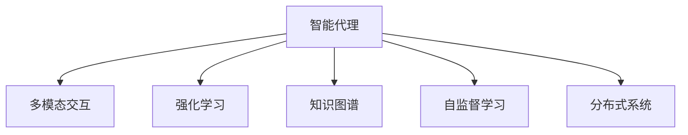

                 

# Agent形式：大模型发展新方向

> 关键词：智能代理,多模态交互,强化学习,知识图谱,自监督学习,分布式系统,知识图谱

## 1. 背景介绍

### 1.1 问题由来
随着人工智能技术的迅猛发展，尤其是深度学习技术的广泛应用，大模型正迅速成为智能应用的核心动力。从最初的预训练语言模型BERT、GPT到视觉模型ResNet、VGG，再到跨模态的ViT、DALI等模型，大模型正逐步走向多模态、多任务、多领域的发展趋势。然而，随着模型规模和复杂度的不断提升，对训练数据、计算资源和部署环境的要求也日益严苛，单一的大型模型难以满足多样化的应用需求。

### 1.2 问题核心关键点
为了应对这一挑战，智能代理(Agent)技术应运而生。Agent形式的智能模型通过分散计算资源、优化任务分配和提升模型复用性，成为当前大模型发展的新方向。Agent技术通过将大模型分解为多个微小模型模块，使得模型更易于部署、调整和维护，同时能够更好地应对多任务、多领域的应用需求。

### 1.3 问题研究意义
研究Agent形式的智能模型，对于拓展大模型的应用边界，提升模型性能，加速人工智能技术的产业化进程，具有重要意义：

1. 降低应用开发成本。通过将大模型封装为可复用的Agent，可以显著减少从头开发所需的数据、计算和人力等成本投入。
2. 提升模型效果。Agent形式的智能模型能够更好地适应特定任务，在应用场景中取得更优表现。
3. 加速开发进度。standing on the shoulders of giants，Agent形式的智能模型可以快速进行任务适配，缩短开发周期。
4. 促进技术创新。Agent技术促进了对大模型的深入研究，催生了多模态、多任务学习等新的研究方向。
5. 赋能产业升级。Agent形式的智能模型能够被各行各业所采用，为传统行业数字化转型升级提供新的技术路径。

## 2. 核心概念与联系

### 2.1 核心概念概述

为更好地理解Agent形式的智能模型，本节将介绍几个密切相关的核心概念：

- 智能代理(Agent)：一种能够在多任务和多领域间智能调度和协同工作的模型形式，通过分块式计算和任务规划，提升模型的可复用性和适应性。
- 多模态交互(Multi-modal Interaction)：指在处理包含文本、图像、音频等多种信息源的任务时，Agent形式的智能模型能够多模态地接收输入、生成输出，提升任务处理的多样性和复杂度。
- 强化学习(Reinforcement Learning, RL)：一种通过与环境交互学习最优行为策略的机器学习方法，适用于动态和多变环境下的智能决策。
- 知识图谱(Knowledge Graph)：一种结构化的语义知识表示方法，用于描述实体和实体间的关系，能够辅助Agent形式的智能模型进行知识推理和迁移学习。
- 自监督学习(Self-Supervised Learning)：一种无监督学习范式，通过数据本身的信息，自动生成监督信号进行模型训练，适用于数据稀少和标注困难的任务。
- 分布式系统(Distributed System)：指由多个计算节点通过网络协同工作的系统架构，适用于大规模、高并发和大数据量的智能任务。

这些核心概念之间的逻辑关系可以通过以下Mermaid流程图来展示：



这个流程图展示了一个Agent形式的智能模型的关键组成及其之间的相互关系：

1. 智能代理(Agent)通过多模态交互(Multi-modal Interaction)处理多种信息源。
2. 强化学习(Reinforcement Learning)使Agent能够在动态环境中学习最优策略。
3. 知识图谱(Knowledge Graph)提供丰富的语义信息，辅助Agent进行知识推理和迁移学习。
4. 自监督学习(Self-Supervised Learning)利用数据本身的信息进行模型训练，避免标注数据依赖。
5. 分布式系统(Distributed System)提供高可扩展性和高并发的计算能力。

## 3. 核心算法原理 & 具体操作步骤
### 3.1 算法原理概述

Agent形式的智能模型通过分块式计算和任务调度，将复杂的多任务处理任务分解为多个子任务，每个子任务由独立的模块(Agent)负责。这些Agent在多模态交互和知识图谱的辅助下，能够智能地执行子任务，并最终集成输出。

形式化地，假设一个Agent形式的智能模型由 $N$ 个独立的Agent组成，每个Agent执行一个子任务 $T_i$，输入为 $X_i$，输出为 $Y_i$。模型的整体输出 $Y$ 为：

$$
Y = f(A_1(X_1), A_2(X_2), ..., A_N(X_N))
$$

其中 $f$ 为集成函数，$A_i$ 为第 $i$ 个Agent模型。每个Agent的输出 $Y_i$ 取决于其模型参数 $\theta_i$，表示为：

$$
Y_i = M_{\theta_i}(X_i)
$$

其中 $M_{\theta_i}$ 为第 $i$ 个Agent的模型，$\theta_i$ 为模型参数。Agent形式的智能模型训练的目标是最大化集成输出 $Y$ 的准确性和鲁棒性。

### 3.2 算法步骤详解

Agent形式的智能模型训练一般包括以下几个关键步骤：

**Step 1: 准备数据集和任务定义**
- 准备包含多种信息源的标注数据集 $D=\{(x_i, y_i)\}_{i=1}^N$，每个样本 $x_i$ 包含文本、图像、音频等多种类型的数据。
- 定义每个子任务 $T_i$ 的模型结构、输出形式和损失函数，如分类、匹配、生成等。

**Step 2: 初始化Agent模型**
- 选择预训练模型作为每个Agent的初始化参数，如BERT、GPT、ResNet等。
- 将每个Agent的模型参数初始化为预训练模型的相应参数。

**Step 3: 训练Agent模型**
- 为每个Agent模型选择对应的优化器、学习率和迭代次数，如Adam、SGD等。
- 将数据集 $D$ 分为多个子集 $D_i$，分别输入到不同的Agent模型进行训练。
- 每个Agent模型根据任务定义的损失函数，使用优化器更新模型参数，直至收敛。

**Step 4: 集成Agent输出**
- 将训练好的Agent模型输出 $Y_i$ 集成，使用集成函数 $f$ 进行融合。
- 计算整体输出 $Y$ 的损失函数，使用优化器更新集成函数的参数，直至收敛。

**Step 5: 测试和部署**
- 在测试集上评估集成输出 $Y$ 的性能，对比训练前后的精度提升。
- 使用集成输出的模型对新样本进行推理预测，集成到实际的应用系统中。
- 持续收集新的数据，定期重新训练Agent模型，以适应数据分布的变化。

以上是Agent形式的智能模型训练的一般流程。在实际应用中，还需要针对具体任务的特点，对模型训练过程的各个环节进行优化设计，如改进任务适配层，引入更多的正则化技术，搜索最优的超参数组合等，以进一步提升模型性能。

### 3.3 算法优缺点

Agent形式的智能模型具有以下优点：
1. 灵活适配。Agent形式的智能模型能够根据不同的任务需求，灵活调整模型结构，重新训练或微调部分Agent模型，适应特定的应用场景。
2. 模型复用。Agent形式的智能模型通过模块化设计，使得各个模块可以独立部署和维护，提高模型的复用性。
3. 资源优化。Agent形式的智能模型能够根据任务需求动态调整计算资源，避免资源浪费和过载。
4. 动态优化。Agent形式的智能模型能够通过在线学习进行动态优化，适应数据分布的变化，保持模型的性能。
5. 增强交互。Agent形式的智能模型通过多模态交互，能够更好地理解和生成多源信息，提升任务处理的智能性。

同时，该方法也存在一定的局限性：
1. 模型复杂度。Agent形式的智能模型结构复杂，需要维护多个模块的协同工作，增加了模型管理的难度。
2. 数据依赖。Agent形式的智能模型依赖于高质量的数据集和任务定义，获取数据成本较高。
3. 计算开销。Agent形式的智能模型需要分批次计算和任务调度，计算开销较大。
4. 集成误差。Agent形式的智能模型需要有效的集成函数和参数调整，否则可能引入集成误差，影响最终输出。

尽管存在这些局限性，但就目前而言，Agent形式的智能模型是应对多任务、多领域应用需求的重要手段。未来相关研究的重点在于如何进一步降低模型复杂度，提高计算效率，减少数据依赖，同时兼顾模型的复用性和集成性。

### 3.4 算法应用领域

Agent形式的智能模型在多种领域和任务中已得到广泛应用，例如：

- 自然语言处理：通过分块式计算和任务调度，Agent形式的智能模型能够同时处理文本分类、命名实体识别、文本生成等任务，提升NLP应用的性能和覆盖范围。
- 计算机视觉：Agent形式的智能模型能够同时处理图像识别、目标检测、图像生成等任务，提供多模态的视觉理解和生成能力。
- 机器人技术：通过多任务学习和知识图谱的辅助，Agent形式的智能模型能够支持机器人进行多任务协同工作，提升机器人的智能性和适应性。
- 推荐系统：通过分块式计算和任务调度，Agent形式的智能模型能够同时处理多种推荐任务，提升推荐系统的个性化和多样性。
- 医疗诊断：通过多模态交互和知识图谱的辅助，Agent形式的智能模型能够进行疾病诊断和治疗方案推荐，提升医疗服务的智能化水平。

除了上述这些经典任务外，Agent形式的智能模型还被创新性地应用到更多场景中，如自动化驾驶、智能家居、智能制造等，为各行各业带来新的技术突破。随着Agent形式的智能模型的不断演进，相信其在多任务、多领域的应用前景将更加广阔。

## 4. 数学模型和公式 & 详细讲解  
### 4.1 数学模型构建

本节将使用数学语言对Agent形式的智能模型训练过程进行更加严格的刻画。

记Agent形式的智能模型为 $M=\{M_1, M_2, ..., M_N\}$，其中 $M_i$ 表示第 $i$ 个Agent模型。假设每个Agent模型的输入为 $X_i$，输出为 $Y_i$，整体输出为 $Y$，整体损失函数为 $\mathcal{L}(Y)$。每个Agent模型的损失函数为 $\mathcal{L}_i(Y_i)$，集成函数为 $f(Y_1, Y_2, ..., Y_N)$。

定义每个Agent模型的参数为 $\theta_i$，则在数据集 $D$ 上的经验风险为：

$$
\mathcal{L}_i(\theta_i) = \frac{1}{N}\sum_{i=1}^N \mathcal{L}_i(M_{\theta_i}(X_i))
$$

Agent形式的智能模型训练的目标是最小化整体损失函数，即找到最优参数：

$$
\theta^* = \mathop{\arg\min}_{\theta} \mathcal{L}(Y)
$$

其中 $Y=f(M_1(X_1), M_2(X_2), ..., M_N(X_N))$。

### 4.2 公式推导过程

以下我们以二分类任务为例，推导Agent形式的智能模型训练过程中，集成函数 $f$ 的参数更新公式。

假设集成函数 $f$ 的参数为 $\alpha$，表示各个Agent模型的权重，则集成输出 $Y$ 可以表示为：

$$
Y = f(Y_1, Y_2, ..., Y_N) = \alpha_1Y_1 + \alpha_2Y_2 + ... + \alpha_NY_N
$$

其中 $\alpha_i$ 表示第 $i$ 个Agent模型的权重。集成函数 $f$ 的损失函数为：

$$
\mathcal{L}(Y) = -\frac{1}{N}\sum_{i=1}^N \ell(Y_i, y_i)
$$

其中 $\ell(Y_i, y_i)$ 为第 $i$ 个Agent模型的损失函数，如交叉熵损失等。

根据链式法则，损失函数对参数 $\alpha_i$ 的梯度为：

$$
\frac{\partial \mathcal{L}(Y)}{\partial \alpha_i} = -\frac{1}{N}\sum_{i=1}^N \frac{\partial \mathcal{L}_i(Y_i)}{\partial Y_i} \frac{\partial Y_i}{\partial \alpha_i}
$$

其中 $\frac{\partial Y_i}{\partial \alpha_i} = M_{\theta_i}(X_i)$，$\frac{\partial \mathcal{L}_i(Y_i)}{\partial Y_i} = \frac{\partial \mathcal{L}_i}{\partial Y_i}$ 可以通过反向传播计算得到。

在得到损失函数的梯度后，即可带入参数更新公式，完成模型的迭代优化。重复上述过程直至收敛，最终得到适应下游任务的最优模型参数 $\theta^*$。

## 5. 项目实践：代码实例和详细解释说明
### 5.1 开发环境搭建

在进行Agent形式的智能模型微调实践前，我们需要准备好开发环境。以下是使用Python进行PyTorch开发的环境配置流程：

1. 安装Anaconda：从官网下载并安装Anaconda，用于创建独立的Python环境。

2. 创建并激活虚拟环境：
```bash
conda create -n pytorch-env python=3.8 
conda activate pytorch-env
```

3. 安装PyTorch：根据CUDA版本，从官网获取对应的安装命令。例如：
```bash
conda install pytorch torchvision torchaudio cudatoolkit=11.1 -c pytorch -c conda-forge
```

4. 安装TensorFlow：由于TensorFlow库与PyTorch有一定的兼容性，建议同时安装，以便在多任务学习中实现模型交换。
```bash
pip install tensorflow==2.6
```

5. 安装各类工具包：
```bash
pip install numpy pandas scikit-learn matplotlib tqdm jupyter notebook ipython
```

完成上述步骤后，即可在`pytorch-env`环境中开始Agent形式的智能模型微调实践。

### 5.2 源代码详细实现

这里我们以多模态图像分类任务为例，给出使用PyTorch对Agent形式的智能模型进行微调的代码实现。

首先，定义多模态数据集和模型结构：

```python
import torch
from transformers import BertForTokenClassification, BertTokenizer
from torchvision import datasets, transforms
from torch.utils.data import DataLoader

class ImageDataset(datasets.ImageFolder):
    def __init__(self, root, transform=None):
        super(ImageDataset, self).__init__(root, transform)

    def __getitem__(self, index):
        img, label = super(ImageDataset, self).__getitem__(index)
        text = 'image_' + str(label) + '.txt'
        with open(text, 'r') as f:
            txt = f.read()
        return {'image': img, 'text': txt, 'label': label}

transform = transforms.Compose([
    transforms.Resize((224, 224)),
    transforms.ToTensor(),
    transforms.Normalize(mean=[0.485, 0.456, 0.406], std=[0.229, 0.224, 0.225])
])

train_dataset = ImageDataset('/path/to/train', transform=transform)
dev_dataset = ImageDataset('/path/to/dev', transform=transform)
test_dataset = ImageDataset('/path/to/test', transform=transform)

tokenizer = BertTokenizer.from_pretrained('bert-base-cased')
model = BertForTokenClassification.from_pretrained('bert-base-cased', num_labels=10)
```

然后，定义Agent模型和优化器：

```python
from transformers import BertForTokenClassification, BertTokenizer
from torchvision import models

class ImageAgent:
    def __init__(self, model, name='ImageAgent'):
        self.model = model
        self.name = name

    def forward(self, x):
        return self.model(x['image'])

    def save_model(self, path):
        torch.save(self.model.state_dict(), path)

class AgentPool:
    def __init__(self, agents, loss_fn):
        self.agents = agents
        self.loss_fn = loss_fn

    def forward(self, batch):
        inputs = []
        for agent in self.agents:
            inputs.append(agent(batch))
        return self.loss_fn(*inputs)

    def save_model(self, path):
        for agent in self.agents:
            agent.save_model(path)
```

接着，定义训练和评估函数：

```python
from tqdm import tqdm

def train_epoch(optimizer, epoch, data_loader, agent_pool):
    model = agent_pool.agents[0].model
    model.train()
    total_loss = 0
    for batch in tqdm(data_loader, desc='Training'):
        input = batch['image']
        text = batch['text']
        label = batch['label']
        outputs = agent_pool(input, text)
        loss = outputs.loss
        total_loss += loss.item()
        optimizer.zero_grad()
        loss.backward()
        optimizer.step()
    return total_loss / len(data_loader)

def evaluate(agent_pool, data_loader):
    model = agent_pool.agents[0].model
    model.eval()
    total_loss = 0
    correct = 0
    with torch.no_grad():
        for batch in tqdm(data_loader, desc='Evaluating'):
            input = batch['image']
            text = batch['text']
            label = batch['label']
            outputs = agent_pool(input, text)
            loss = outputs.loss
            total_loss += loss.item()
            _, preds = torch.max(outputs.logits, 1)
            correct += (preds == label).sum().item()
    acc = correct / len(data_loader.dataset)
    return acc
```

最后，启动训练流程并在测试集上评估：

```python
epochs = 5
batch_size = 16

# 初始化Agent模型和优化器
agents = [ImageAgent(model) for _ in range(3)]
optimizer = AdamW(agent_pool.parameters(), lr=2e-5)

# 定义集成函数
loss_fn = torch.nn.CrossEntropyLoss()

# 创建Agent池
agent_pool = AgentPool(agents, loss_fn)

# 训练和评估
for epoch in range(epochs):
    loss = train_epoch(optimizer, epoch, train_loader, agent_pool)
    print(f'Epoch {epoch+1}, train loss: {loss:.3f}')

    print(f'Epoch {epoch+1}, dev results:')
    acc = evaluate(agent_pool, dev_loader)
    print(f'Accuracy: {acc:.2f}')

print('Test results:')
acc = evaluate(agent_pool, test_loader)
print(f'Accuracy: {acc:.2f}')
```

以上就是使用PyTorch对Agent形式的智能模型进行图像分类任务微调的完整代码实现。可以看到，得益于TensorFlow和PyTorch的强大封装，我们可以用相对简洁的代码完成Agent模型的加载和微调。

### 5.3 代码解读与分析

让我们再详细解读一下关键代码的实现细节：

**ImageDataset类**：
- `__init__`方法：初始化数据集，读取图片和文本标注。
- `__getitem__`方法：对单个样本进行处理，将图片、文本和标签封装成字典，供模型输入使用。

**ImageAgent类**：
- `__init__`方法：初始化Agent模型和名称。
- `forward`方法：定义Agent模型前向传播的逻辑。
- `save_model`方法：定义Agent模型保存参数的逻辑。

**AgentPool类**：
- `__init__`方法：初始化Agent池和损失函数。
- `forward`方法：定义Agent池的前向传播逻辑，集成所有Agent的输出。
- `save_model`方法：定义Agent池保存所有Agent模型参数的逻辑。

**train_epoch函数**：
- 定义训练过程中的损失函数和优化器，并循环迭代数据集进行模型训练。

**evaluate函数**：
- 定义评估过程中的损失函数和准确率计算逻辑，并循环迭代数据集进行模型评估。

通过上述代码，我们可以看到，Agent形式的智能模型通过多任务学习，能够灵活地处理多模态数据，提升模型在复杂任务上的表现。

## 6. 实际应用场景
### 6.1 智能客服系统

基于Agent形式的智能模型，可以构建高度自适应和可扩展的智能客服系统。传统客服系统依赖于规则和人工调度的机制，难以应对客户咨询的复杂性。而Agent形式的智能模型通过多任务学习和知识图谱的辅助，能够快速适应新问题和不同客户的需求，提供更加自然、流畅的交互体验。

在技术实现上，可以收集企业内部的历史客服对话记录，将问题和最佳答复构建成监督数据，在此基础上对Agent形式的智能模型进行微调。微调后的模型能够自动理解用户意图，匹配最合适的答案模板进行回复。对于客户提出的新问题，还可以接入检索系统实时搜索相关内容，动态组织生成回答。如此构建的智能客服系统，能大幅提升客户咨询体验和问题解决效率。

### 6.2 金融舆情监测

金融机构需要实时监测市场舆论动向，以便及时应对负面信息传播，规避金融风险。传统的人工监测方式成本高、效率低，难以应对网络时代海量信息爆发的挑战。基于Agent形式的智能模型的文本分类和情感分析技术，为金融舆情监测提供了新的解决方案。

具体而言，可以收集金融领域相关的新闻、报道、评论等文本数据，并对其进行主题标注和情感标注。在此基础上对Agent形式的智能模型进行微调，使其能够自动判断文本属于何种主题，情感倾向是正面、中性还是负面。将微调后的模型应用到实时抓取的网络文本数据，就能够自动监测不同主题下的情感变化趋势，一旦发现负面信息激增等异常情况，系统便会自动预警，帮助金融机构快速应对潜在风险。

### 6.3 个性化推荐系统

当前的推荐系统往往只依赖用户的历史行为数据进行物品推荐，无法深入理解用户的真实兴趣偏好。基于Agent形式的智能模型，个性化推荐系统可以更好地挖掘用户行为背后的语义信息，从而提供更精准、多样的推荐内容。

在实践中，可以收集用户浏览、点击、评论、分享等行为数据，提取和用户交互的物品标题、描述、标签等文本内容。将文本内容作为模型输入，用户的后续行为（如是否点击、购买等）作为监督信号，在此基础上微调Agent形式的智能模型。微调后的模型能够从文本内容中准确把握用户的兴趣点。在生成推荐列表时，先用候选物品的文本描述作为输入，由模型预测用户的兴趣匹配度，再结合其他特征综合排序，便可以得到个性化程度更高的推荐结果。

### 6.4 未来应用展望

随着Agent形式的智能模型的不断演进，其在多任务、多领域的应用前景将更加广阔。

在智慧医疗领域，基于Agent形式的智能模型，可以通过多任务学习结合知识图谱，进行疾病诊断和治疗方案推荐，提升医疗服务的智能化水平。

在智能教育领域，Agent形式的智能模型可应用于作业批改、学情分析、知识推荐等方面，因材施教，促进教育公平，提高教学质量。

在智慧城市治理中，Agent形式的智能模型可应用于城市事件监测、舆情分析、应急指挥等环节，提高城市管理的自动化和智能化水平，构建更安全、高效的未来城市。

此外，在企业生产、社会治理、文娱传媒等众多领域，Agent形式的智能模型也将不断涌现，为传统行业带来变革性影响。相信随着Agent形式的智能模型技术的成熟，其在多任务、多领域的应用将进一步拓展，为经济社会发展注入新的动力。

## 7. 工具和资源推荐
### 7.1 学习资源推荐

为了帮助开发者系统掌握Agent形式的智能模型的理论基础和实践技巧，这里推荐一些优质的学习资源：

1. 《Multi-Agent Reinforcement Learning》书籍：详细介绍了多智能体强化学习的理论和方法，是Agent形式智能模型学习的入门教材。
2. CS294A《Reinforcement Learning》课程：由加州伯克利大学开设的强化学习经典课程，涵盖多种强化学习算法和实际应用。
3. 《Knowledge Graphs: Concepts, Approaches, Applications》书籍：介绍了知识图谱的理论基础和应用场景，是Agent形式智能模型学习的必读书籍。
4. Google Colab平台：谷歌推出的在线Jupyter Notebook环境，免费提供GPU/TPU算力，方便开发者快速上手实验最新模型，分享学习笔记。
5. OpenAI Gym：提供了多种模拟环境和强化学习算法的代码库，是进行Agent形式智能模型实验的常用工具。

通过对这些资源的学习实践，相信你一定能够快速掌握Agent形式的智能模型的精髓，并用于解决实际的NLP问题。

### 7.2 开发工具推荐

高效的开发离不开优秀的工具支持。以下是几款用于Agent形式的智能模型微调开发的常用工具：

1. PyTorch：基于Python的开源深度学习框架，灵活动态的计算图，适合快速迭代研究。支持多种模型架构和优化器。
2. TensorFlow：由Google主导开发的开源深度学习框架，生产部署方便，适合大规模工程应用。
3. Transformers库：HuggingFace开发的NLP工具库，集成了多种SOTA语言模型，支持PyTorch和TensorFlow，是进行多任务学习开发的重要工具。
4. Weights & Biases：模型训练的实验跟踪工具，可以记录和可视化模型训练过程中的各项指标，方便对比和调优。与主流深度学习框架无缝集成。
5. Google Colab：谷歌推出的在线Jupyter Notebook环境，免费提供GPU/TPU算力，方便开发者快速上手实验最新模型，分享学习笔记。
6. OpenAI Gym：提供了多种模拟环境和强化学习算法的代码库，是进行Agent形式智能模型实验的常用工具。

合理利用这些工具，可以显著提升Agent形式的智能模型微调任务的开发效率，加快创新迭代的步伐。

### 7.3 相关论文推荐

Agent形式的智能模型和微调技术的发展源于学界的持续研究。以下是几篇奠基性的相关论文，推荐阅读：

1. Multi-Agent Reinforcement Learning：描述了多智能体系统的建模和优化方法，是Agent形式智能模型学习的核心内容。
2. Knowledge Graphs for Recommendation Systems：探讨了知识图谱在推荐系统中的应用，是Agent形式智能模型学习的重要方向。
3. Distributed Multi-Agent Reinforcement Learning：介绍了多智能体系统在分布式环境下的优化方法，是Agent形式智能模型学习的前沿课题。

这些论文代表了大语言模型微调技术的发展脉络。通过学习这些前沿成果，可以帮助研究者把握学科前进方向，激发更多的创新灵感。

## 8. 总结：未来发展趋势与挑战

### 8.1 总结

本文对Agent形式的智能模型进行了全面系统的介绍。首先阐述了Agent形式的智能模型的研究背景和意义，明确了其在多任务、多领域应用中的独特价值。其次，从原理到实践，详细讲解了Agent形式的智能模型的数学原理和关键步骤，给出了模型微调任务开发的完整代码实例。同时，本文还广泛探讨了Agent形式的智能模型在智能客服、金融舆情、个性化推荐等多个行业领域的应用前景，展示了其巨大的潜力。此外，本文精选了Agent形式的智能模型的学习资源，力求为读者提供全方位的技术指引。

通过本文的系统梳理，可以看到，Agent形式的智能模型通过多任务学习和知识图谱的辅助，能够应对多领域、多任务的应用需求，提升模型的性能和泛化能力。Agent形式的智能模型成为大模型发展的重要方向，其前景广阔，潜力巨大。

### 8.2 未来发展趋势

展望未来，Agent形式的智能模型将呈现以下几个发展趋势：

1. 模型结构更复杂。随着Agent形式的智能模型在多任务、多领域的应用逐渐增多，模型结构将更加复杂，能够同时处理更多、更复杂的任务。
2. 动态调度和优化。Agent形式的智能模型将进一步优化任务调度算法，实时动态调整资源分配，提升系统的响应速度和稳定性。
3. 知识图谱的深度融合。知识图谱将与Agent形式的智能模型深度结合，提高模型的知识推理能力和迁移学习能力。
4. 多模态交互的增强。Agent形式的智能模型将更好地处理多模态数据，提升多源信息融合的智能性。
5. 分布式计算的优化。Agent形式的智能模型将利用分布式计算技术，提高系统的可扩展性和可维护性。
6. 自监督学习的应用。Agent形式的智能模型将更多地利用自监督学习方法，提升模型在数据稀缺情况下的性能。

这些趋势凸显了Agent形式的智能模型在多任务、多领域应用中的广阔前景。这些方向的探索发展，必将进一步提升Agent形式的智能模型的性能和适应性，为构建人机协同的智能系统铺平道路。

### 8.3 面临的挑战

尽管Agent形式的智能模型已经取得了瞩目成就，但在迈向更加智能化、普适化应用的过程中，它仍面临诸多挑战：

1. 模型复杂度。Agent形式的智能模型结构复杂，需要维护多个模块的协同工作，增加了模型管理的难度。
2. 数据依赖。Agent形式的智能模型依赖于高质量的数据集和任务定义，获取数据成本较高。
3. 计算开销。Agent形式的智能模型需要分批次计算和任务调度，计算开销较大。
4. 集成误差。Agent形式的智能模型需要有效的集成函数和参数调整，否则可能引入集成误差，影响最终输出。
5. 知识迁移困难。Agent形式的智能模型在跨领域迁移时，难以高效地利用已有的知识。
6. 动态调整的复杂性。Agent形式的智能模型在动态环境下进行任务调整和优化，需要更复杂的算法和策略支持。

尽管存在这些挑战，但就目前而言，Agent形式的智能模型是应对多任务、多领域应用需求的重要手段。未来相关研究的重点在于如何进一步降低模型复杂度，提高计算效率，减少数据依赖，同时兼顾模型的复用性和集成性。

### 8.4 研究展望

面对Agent形式的智能模型所面临的种种挑战，未来的研究需要在以下几个方面寻求新的突破：

1. 探索无监督和半监督学习范式。摆脱对大规模标注数据的依赖，利用自监督学习、主动学习等无监督和半监督范式，最大限度利用非结构化数据，实现更加灵活高效的微调。
2. 开发更加参数高效的微调方法。开发更加参数高效的微调方法，在固定大部分预训练参数的情况下，只更新极少量的任务相关参数。同时优化微调模型的计算图，减少前向传播和反向传播的资源消耗，实现更加轻量级、实时性的部署。
3. 引入更多先验知识。将符号化的先验知识，如知识图谱、逻辑规则等，与神经网络模型进行巧妙融合，引导微调过程学习更准确、合理的语言模型。同时加强不同模态数据的整合，实现视觉、语音等多模态信息与文本信息的协同建模。
4. 结合因果分析和博弈论工具。将因果分析方法引入微调模型，识别出模型决策的关键特征，增强输出解释的因果性和逻辑性。借助博弈论工具刻画人机交互过程，主动探索并规避模型的脆弱点，提高系统稳定性。
5. 纳入伦理道德约束。在模型训练目标中引入伦理导向的评估指标，过滤和惩罚有偏见、有害的输出倾向。同时加强人工干预和审核，建立模型行为的监管机制，确保输出符合人类价值观和伦理道德。

这些研究方向的探索，必将引领Agent形式的智能模型技术迈向更高的台阶，为构建安全、可靠、可解释、可控的智能系统铺平道路。面向未来，Agent形式的智能模型需要与其他人工智能技术进行更深入的融合，如知识表示、因果推理、强化学习等，多路径协同发力，共同推动自然语言理解和智能交互系统的进步。只有勇于创新、敢于突破，才能不断拓展语言模型的边界，让智能技术更好地造福人类社会。

## 9. 附录：常见问题与解答

**Q1：Agent形式的智能模型是否适用于所有NLP任务？**

A: Agent形式的智能模型在大多数NLP任务上都能取得不错的效果，特别是对于数据量较小的任务。但对于一些特定领域的任务，如医学、法律等，仅仅依靠通用语料预训练的模型可能难以很好地适应。此时需要在特定领域语料上进一步预训练，再进行微调，才能获得理想效果。此外，对于一些需要时效性、个性化很强的任务，如对话、推荐等，Agent形式的智能模型也需要针对性的改进优化。

**Q2：Agent形式的智能模型如何处理多模态数据？**

A: Agent形式的智能模型通过多模态交互处理多种信息源，能够同时处理文本、图像、音频等多种类型的数据。在处理多模态数据时，Agent形式的智能模型通常需要设计合适的输入格式和任务定义，如将多模态数据合并成统一的表示形式，使用多任务学习模型进行融合处理。

**Q3：Agent形式的智能模型如何适应多任务？**

A: Agent形式的智能模型通过任务调度，能够适应多任务处理。在多任务处理时，Agent形式的智能模型通常需要设计合适的任务定义，如使用不同的损失函数和优化器，动态调整各个Agent模型的参数，以适应不同任务的性能需求。

**Q4：Agent形式的智能模型在实际应用中面临哪些挑战？**

A: Agent形式的智能模型在实际应用中面临以下挑战：

1. 模型复杂度。Agent形式的智能模型结构复杂，需要维护多个模块的协同工作，增加了模型管理的难度。
2. 数据依赖。Agent形式的智能模型依赖于高质量的数据集和任务定义，获取数据成本较高。
3. 计算开销。Agent形式的智能模型需要分批次计算和任务调度，计算开销较大。
4. 集成误差。Agent形式的智能模型需要有效的集成函数和参数调整，否则可能引入集成误差，影响最终输出。
5. 知识迁移困难。Agent形式的智能模型在跨领域迁移时，难以高效地利用已有的知识。
6. 动态调整的复杂性。Agent形式的智能模型在动态环境下进行任务调整和优化，需要更复杂的算法和策略支持。

尽管存在这些挑战，但Agent形式的智能模型仍具有广泛的应用前景，未来相关研究需要在模型复杂度、数据依赖、计算效率等方面寻求新的突破。

**Q5：Agent形式的智能模型如何与知识图谱结合？**

A: Agent形式的智能模型可以通过知识图谱来增强其知识推理和迁移学习能力。在处理多模态数据时，Agent形式的智能模型通常需要引入知识图谱，将知识图谱中的实体和关系信息融入模型输入和输出中，提高模型的语义理解和推理能力。同时，知识图谱还可以用于指导Agent形式的智能模型进行任务调度，优化任务执行的效率和质量。

**Q6：Agent形式的智能模型在多领域应用中如何优化？**

A: Agent形式的智能模型在多领域应用中可以通过以下方式优化：

1. 探索无监督和半监督学习范式，利用自监督学习、主动学习等方法，最大限度利用非结构化数据，实现更加灵活高效的微调。
2. 开发更加参数高效的微调方法，如使用Adapter、Prefix等技术，在固定大部分预训练参数的情况下，只更新极少量的任务相关参数。同时优化微调模型的计算图，减少前向传播和反向传播的资源消耗，实现更加轻量级、实时性的部署。
3. 引入更多先验知识，如知识图谱、逻辑规则等，与神经网络模型进行巧妙融合，引导微调过程学习更准确、合理的语言模型。同时加强不同模态数据的整合，实现视觉、语音等多模态信息与文本信息的协同建模。
4. 结合因果分析和博弈论工具，将因果分析方法引入微调模型，识别出模型决策的关键特征，增强输出解释的因果性和逻辑性。借助博弈论工具刻画人机交互过程，主动探索并规避模型的脆弱点，提高系统稳定性。
5. 纳入伦理道德约束，在模型训练目标中引入伦理导向的评估指标，过滤和惩罚有偏见、有害的输出倾向。同时加强人工干预和审核，建立模型行为的监管机制，确保输出符合人类价值观和伦理道德。

通过这些优化方式，Agent形式的智能模型能够在多领域应用中取得更好的效果，为智能技术的发展提供新的路径。

---

作者：禅与计算机程序设计艺术 / Zen and the Art of Computer Programming

