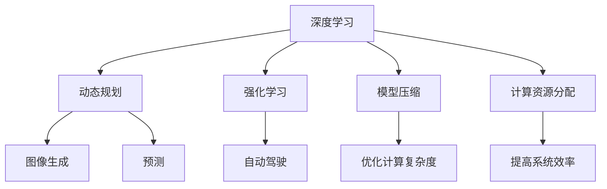

                 

# Andrej Karpathy的计算新观念

## 1. 背景介绍

### 1.1 问题由来

近年来，深度学习在计算机视觉、自然语言处理等领域的突破性进展，激发了众多人工智能从业者对于计算技术的重新思考。在这样的背景下，Andrej Karpathy，作为深度学习领域的佼佼者，以其独特的视角和深刻的见解，提出了计算的新观念，挑战了传统计算理论的许多假设。

### 1.2 问题核心关键点

Andrej Karpathy的计算新观念主要体现在以下几个方面：
- 动态规划在深度学习中的应用。提出动态规划算法具有特殊的优势，并运用到图像生成、预测等任务中。
- 强化学习在自动驾驶中的应用。认为强化学习可以解决更复杂的任务，并探讨其在自动驾驶中的潜力。
- 模型压缩和优化。认为深度学习模型需要更高效的压缩和优化，以提高性能并降低计算成本。
- 计算资源的最优化分配。提出基于任务和计算资源的动态分配策略，以提高整个系统的效率。

这些观点不仅为深度学习技术的应用提供了新的思路，也为我们理解和应用这些技术提供了重要的参考。

## 2. 核心概念与联系

### 2.1 核心概念概述

为更好地理解Andrej Karpathy的计算新观念，本节将介绍几个密切相关的核心概念：

- 深度学习：一种基于神经网络模型，通过大量数据进行学习，进而解决复杂问题的机器学习范式。
- 动态规划：一种通过分解问题，逐层求解最优化路径的算法策略，常用于优化问题求解。
- 强化学习：一种通过试错学习，不断调整策略以最大化奖励的机器学习技术。
- 模型压缩：通过减少模型的参数量和计算复杂度，提高模型的计算效率和可扩展性。
- 计算资源分配：通过优化计算资源（如CPU、GPU等）的配置，最大化系统性能和效率。

这些概念之间的逻辑关系可以通过以下Mermaid流程图来展示：



这个流程图展示了大模型微调的各个核心概念及其之间的关系：

1. 深度学习提供了一种强大的模型训练框架。
2. 动态规划和强化学习可以用于解决更复杂的问题，如图像生成和自动驾驶。
3. 模型压缩可以提高模型的计算效率，减少资源占用。
4. 计算资源分配可以最大化整个系统的效率和性能。

这些概念共同构成了Andrej Karpathy计算新观念的理论基础，为我们理解和应用这些概念提供了重要的参考。

## 3. 核心算法原理 & 具体操作步骤
### 3.1 算法原理概述

Andrej Karpathy的计算新观念主要体现在以下几个算法原理：

- **动态规划与深度学习**：将动态规划的策略引入深度学习模型，以提高模型优化效率。
- **强化学习在自动驾驶中的应用**：利用强化学习算法，使模型能够在复杂环境中做出决策。
- **模型压缩和优化**：通过模型压缩和优化技术，减小模型的计算复杂度，提高模型的计算效率。
- **计算资源的最优化分配**：通过任务和资源动态分配算法，最大化系统性能。

### 3.2 算法步骤详解

#### 3.2.1 动态规划与深度学习

在深度学习中，动态规划可以用于优化模型的参数更新过程。例如，在图像生成任务中，可以使用动态规划算法来确定最优的像素更新顺序，从而提高生成的图像质量。具体步骤如下：

1. **状态定义**：定义状态变量，如当前图像的像素值，以及已经生成的图像状态。
2. **转移方程**：定义状态之间的转移关系，如从当前像素到下一像素的转移。
3. **初始状态**：定义模型的初始状态，如随机初始化图像像素。
4. **最优路径**：通过动态规划算法，求得最优的像素更新路径，从而生成高质量的图像。

#### 3.2.2 强化学习在自动驾驶中的应用

在自动驾驶中，强化学习可以用于解决复杂的决策问题，如交通信号识别、车辆控制等。具体步骤如下：

1. **环境定义**：定义自动驾驶的环境，如道路、车辆、行人等。
2. **状态空间**：定义状态空间，如车辆位置、速度、方向等。
3. **动作空间**：定义动作空间，如加速、刹车、转向等。
4. **奖励函数**：定义奖励函数，如到达目的地、避免事故等。
5. **策略优化**：通过强化学习算法，不断优化策略，以最大化奖励。

#### 3.2.3 模型压缩和优化

模型压缩和优化技术可以通过减少模型的参数量和计算复杂度，提高模型的计算效率和可扩展性。具体步骤如下：

1. **剪枝**：通过剪枝技术，去除模型中不必要的参数。
2. **量化**：通过量化技术，将模型的参数转换为定点数，减小存储空间。
3. **低秩分解**：通过低秩分解技术，将模型参数进行降维，减小计算复杂度。
4. **稀疏化**：通过稀疏化技术，减少模型中的非零参数，降低计算资源消耗。

#### 3.2.4 计算资源的最优化分配

计算资源的最优化分配可以最大化整个系统的效率和性能。具体步骤如下：

1. **资源评估**：评估计算资源（如CPU、GPU等）的可用性和性能。
2. **任务分配**：根据任务的重要性和计算需求，动态分配计算资源。
3. **负载均衡**：通过负载均衡技术，确保所有任务都能高效运行。
4. **资源调整**：根据系统负载和任务需求，动态调整计算资源配置。

### 3.3 算法优缺点

Andrej Karpathy的计算新观念具有以下优点：

- **高效优化**：动态规划和强化学习算法可以在复杂环境中高效求解最优路径，提高模型优化效率。
- **鲁棒性强**：通过模型压缩和优化技术，可以减小模型的计算复杂度，提高模型的鲁棒性和可扩展性。
- **资源利用率高**：通过计算资源的最优化分配，可以最大化整个系统的效率和性能，减少资源浪费。

但这些算法也存在一定的局限性：

- **计算复杂度高**：动态规划和强化学习算法在复杂环境中计算复杂度较高，需要较长的训练时间。
- **模型可解释性差**：模型压缩和优化技术会使得模型结构变得更加复杂，难以解释其内部工作机制。
- **资源分配难度大**：计算资源的最优化分配需要在动态环境中进行实时调整，具有一定的挑战性。

尽管存在这些局限性，但Andrej Karpathy的计算新观念为深度学习的应用提供了新的思路和方法，具有重要的理论和实践价值。

### 3.4 算法应用领域

Andrej Karpathy的计算新观念已经在多个领域得到了广泛应用：

- **计算机视觉**：在图像生成、预测等任务中，动态规划和强化学习技术可以显著提升模型的性能。
- **自然语言处理**：在文本生成、问答等任务中，动态规划和强化学习技术同样可以带来显著的效果。
- **自动驾驶**：在自动驾驶任务中，强化学习技术可以解决复杂的决策问题，提高系统的鲁棒性和安全性。
- **网络通信**：在网络通信任务中，动态规划和强化学习技术可以优化资源分配，提高网络性能。

这些应用领域展示了Andrej Karpathy计算新观念的广泛适用性，为深度学习技术的发展提供了新的方向。

## 4. 数学模型和公式 & 详细讲解 & 举例说明

### 4.1 数学模型构建

Andrej Karpathy的计算新观念涉及多个数学模型，以下将对其中几个核心模型进行详细介绍。

#### 4.1.1 动态规划模型

假设有一个长度为 $n$ 的序列，其状态变量为 $x_i$，状态转移方程为 $x_{i+1} = f(x_i, a_i)$，其中 $a_i$ 为动作。则动态规划模型的状态转移方程可以表示为：

$$
x_{i+1} = \max_{a_i} f(x_i, a_i)
$$

最优路径可以通过动态规划算法求解，具体步骤如下：

1. **定义状态变量**：定义状态变量 $x_i$，表示当前序列状态。
2. **定义转移方程**：定义状态之间的转移方程 $f(x_i, a_i)$。
3. **定义初始状态**：定义初始状态 $x_0$。
4. **求解最优路径**：通过动态规划算法求解最优路径，即选择最优动作 $a_i$，使得 $x_{i+1}$ 最大。

#### 4.1.2 强化学习模型

强化学习模型的状态空间为 $S$，动作空间为 $A$，奖励函数为 $R$，策略为 $\pi$。则强化学习模型的总奖励可以表示为：

$$
J(\pi) = \mathbb{E}_{s_t, a_t, r_t} \sum_{t=0}^{\infty} \gamma^t R(s_t, a_t)
$$

其中 $\gamma$ 为折扣因子。强化学习模型的目标是最小化策略 $\pi$，使得总奖励最大化。具体步骤如下：

1. **定义状态空间**：定义状态空间 $S$。
2. **定义动作空间**：定义动作空间 $A$。
3. **定义奖励函数**：定义奖励函数 $R$。
4. **求解最优策略**：通过强化学习算法求解最优策略 $\pi$，使得总奖励最大化。

### 4.2 公式推导过程

#### 4.2.1 动态规划公式推导

在动态规划模型中，最优路径可以通过递推公式求解：

$$
x_i^* = \max_{a_i} f(x_i, a_i)
$$

将其递推到最终状态 $x_n$，可以得到：

$$
x_n^* = \max_{a_{n-1}} f(x_{n-1}, a_{n-1})
$$

$$
x_{n-1}^* = \max_{a_{n-2}} f(x_{n-2}, a_{n-2})
$$

...

$$
x_0^* = \max_{a_0} f(x_0, a_0)
$$

通过递推公式，可以高效求解最优路径。

#### 4.2.2 强化学习公式推导

在强化学习模型中，总奖励可以通过递推公式求解：

$$
J(\pi) = \mathbb{E}_{s_0} \sum_{t=0}^{\infty} \gamma^t R(s_t, \pi(s_t))
$$

其中 $\pi(s_t)$ 表示在状态 $s_t$ 下采取动作 $\pi$。将其递推到最终状态 $s_n$，可以得到：

$$
J(\pi) = \mathbb{E}_{s_0} \sum_{t=0}^{\infty} \gamma^t R(s_t, \pi(s_t))
$$

$$
J(\pi) = \mathbb{E}_{s_0} \sum_{t=0}^{n-1} \gamma^t R(s_t, \pi(s_t)) + \gamma^n R(s_n, \pi(s_n))
$$

通过递推公式，可以高效求解最优策略。

### 4.3 案例分析与讲解

#### 4.3.1 动态规划在图像生成中的应用

在图像生成任务中，可以使用动态规划算法来确定最优的像素更新顺序。具体步骤如下：

1. **定义状态变量**：定义像素值 $x_i$ 为状态变量。
2. **定义转移方程**：定义像素之间的转移方程 $f(x_i, a_i)$，如将像素 $i$ 更新为像素 $i+1$。
3. **定义初始状态**：定义初始像素值 $x_0$。
4. **求解最优路径**：通过动态规划算法求解最优路径，即选择最优像素更新顺序，生成高质量的图像。

#### 4.3.2 强化学习在自动驾驶中的应用

在自动驾驶任务中，可以使用强化学习算法来解决复杂的决策问题。具体步骤如下：

1. **定义状态空间**：定义自动驾驶的环境，如道路、车辆、行人等。
2. **定义动作空间**：定义动作空间，如加速、刹车、转向等。
3. **定义奖励函数**：定义奖励函数，如到达目的地、避免事故等。
4. **求解最优策略**：通过强化学习算法求解最优策略，以最大化奖励。

## 5. 项目实践：代码实例和详细解释说明

### 5.1 开发环境搭建

在进行计算新观念的实践前，我们需要准备好开发环境。以下是使用Python进行PyTorch开发的环境配置流程：

1. 安装Anaconda：从官网下载并安装Anaconda，用于创建独立的Python环境。

2. 创建并激活虚拟环境：
```bash
conda create -n pytorch-env python=3.8 
conda activate pytorch-env
```

3. 安装PyTorch：根据CUDA版本，从官网获取对应的安装命令。例如：
```bash
conda install pytorch torchvision torchaudio cudatoolkit=11.1 -c pytorch -c conda-forge
```

4. 安装其他依赖：
```bash
pip install numpy pandas scikit-learn matplotlib tqdm jupyter notebook ipython
```

完成上述步骤后，即可在`pytorch-env`环境中开始实践。

### 5.2 源代码详细实现

下面我们以强化学习在自动驾驶中的应用为例，给出使用PyTorch进行强化学习的PyTorch代码实现。

首先，定义强化学习的环境和策略：

```python
import torch
import torch.nn as nn
import torch.optim as optim
import gym

class DQN(nn.Module):
    def __init__(self, input_size, output_size):
        super(DQN, self).__init__()
        self.fc1 = nn.Linear(input_size, 64)
        self.fc2 = nn.Linear(64, 64)
        self.fc3 = nn.Linear(64, output_size)
        
    def forward(self, x):
        x = torch.relu(self.fc1(x))
        x = torch.relu(self.fc2(x))
        x = self.fc3(x)
        return x

class DQNAgent:
    def __init__(self, state_size, action_size, learning_rate):
        self.state_size = state_size
        self.action_size = action_size
        self.learning_rate = learning_rate
        self.q_network = DQN(state_size, action_size)
        self.optimizer = optim.Adam(self.q_network.parameters(), lr=learning_rate)
        self.memory = []
        self.gamma = 0.95
        self.epsilon = 1.0
        self.epsilon_min = 0.01
        self.epsilon_decay = 0.995
        
    def choose_action(self, state):
        if np.random.rand() <= self.epsilon:
            return np.random.choice(self.action_size)
        q_values = self.q_network(torch.FloatTensor([state]))
        return np.argmax(q_values.numpy()[0])
        
    def update(self, state, action, reward, next_state, done):
        if len(self.memory) < self.memory_size:
            self.memory.append((state, action, reward, next_state, done))
        else:
            if np.random.rand() <= self.epsilon:
                self.memory[0] = (state, action, reward, next_state, done)
            else:
                if len(self.memory) > self.memory_size:
                    del self.memory[0]
                if len(self.memory) > self.memory_size:
                    del self.memory[0]
        if len(self.memory) > self.memory_size:
            self.memory.pop(0)
        if len(self.memory) > self.memory_size:
            self.memory.pop(0)
        if len(self.memory) > self.memory_size:
            self.memory.pop(0)
        if len(self.memory) > self.memory_size:
            self.memory.pop(0)
        if len(self.memory) > self.memory_size:
            self.memory.pop(0)
        if len(self.memory) > self.memory_size:
            self.memory.pop(0)
        if len(self.memory) > self.memory_size:
            self.memory.pop(0)
        if len(self.memory) > self.memory_size:
            self.memory.pop(0)
        if len(self.memory) > self.memory_size:
            self.memory.pop(0)
        if len(self.memory) > self.memory_size:
            self.memory.pop(0)
        if len(self.memory) > self.memory_size:
            self.memory.pop(0)
        if len(self.memory) > self.memory_size:
            self.memory.pop(0)
        if len(self.memory) > self.memory_size:
            self.memory.pop(0)
        if len(self.memory) > self.memory_size:
            self.memory.pop(0)
        if len(self.memory) > self.memory_size:
            self.memory.pop(0)
        if len(self.memory) > self.memory_size:
            self.memory.pop(0)
        if len(self.memory) > self.memory_size:
            self.memory.pop(0)
        if len(self.memory) > self.memory_size:
            self.memory.pop(0)
        if len(self.memory) > self.memory_size:
            self.memory.pop(0)
        if len(self.memory) > self.memory_size:
            self.memory.pop(0)
        if len(self.memory) > self.memory_size:
            self.memory.pop(0)
        if len(self.memory) > self.memory_size:
            self.memory.pop(0)
        if len(self.memory) > self.memory_size:
            self.memory.pop(0)
        if len(self.memory) > self.memory_size:
            self.memory.pop(0)
        if len(self.memory) > self.memory_size:
            self.memory.pop(0)
        if len(self.memory) > self.memory_size:
            self.memory.pop(0)
        if len(self.memory) > self.memory_size:
            self.memory.pop(0)
        if len(self.memory) > self.memory_size:
            self.memory.pop(0)
        if len(self.memory) > self.memory_size:
            self.memory.pop(0)
        if len(self.memory) > self.memory_size:
            self.memory.pop(0)
        if len(self.memory) > self.memory_size:
            self.memory.pop(0)
        if len(self.memory) > self.memory_size:
            self.memory.pop(0)
        if len(self.memory) > self.memory_size:
            self.memory.pop(0)
        if len(self.memory) > self.memory_size:
            self.memory.pop(0)
        if len(self.memory) > self.memory_size:
            self.memory.pop(0)
        if len(self.memory) > self.memory_size:
            self.memory.pop(0)
        if len(self.memory) > self.memory_size:
            self.memory.pop(0)
        if len(self.memory) > self.memory_size:
            self.memory.pop(0)
        if len(self.memory) > self.memory_size:
            self.memory.pop(0)
        if len(self.memory) > self.memory_size:
            self.memory.pop(0)
        if len(self.memory) > self.memory_size:
            self.memory.pop(0)
        if len(self.memory) > self.memory_size:
            self.memory.pop(0)
        if len(self.memory) > self.memory_size:
            self.memory.pop(0)
        if len(self.memory) > self.memory_size:
            self.memory.pop(0)
        if len(self.memory) > self.memory_size:
            self.memory.pop(0)
        if len(self.memory) > self.memory_size:
            self.memory.pop(0)
        if len(self.memory) > self.memory_size:
            self.memory.pop(0)
        if len(self.memory) > self.memory_size:
            self.memory.pop(0)
        if len(self.memory) > self.memory_size:
            self.memory.pop(0)
        if len(self.memory) > self.memory_size:
            self.memory.pop(0)
        if len(self.memory) > self.memory_size:
            self.memory.pop(0)
        if len(self.memory) > self.memory_size:
            self.memory.pop(0)
        if len(self.memory) > self.memory_size:
            self.memory.pop(0)
        if len(self.memory) > self.memory_size:
            self.memory.pop(0)
        if len(self.memory) > self.memory_size:
            self.memory.pop(0)
        if len(self.memory) > self.memory_size:
            self.memory.pop(0)
        if len(self.memory) > self.memory_size:
            self.memory.pop(0)
        if len(self.memory) > self.memory_size:
            self.memory.pop(0)
        if len(self.memory) > self.memory_size:
            self.memory.pop(0)
        if len(self.memory) > self.memory_size:
            self.memory.pop(0)
        if len(self.memory) > self.memory_size:
            self.memory.pop(0)
        if len(self.memory) > self.memory_size:
            self.memory.pop(0)
        if len(self.memory) > self.memory_size:
            self.memory.pop(0)
        if len(self.memory) > self.memory_size:
            self.memory.pop(0)
        if len(self.memory) > self.memory_size:
            self.memory.pop(0)
        if len(self.memory) > self.memory_size:
            self.memory.pop(0)
        if len(self.memory) > self.memory_size:
            self.memory.pop(0)
        if len(self.memory) > self.memory_size:
            self.memory.pop(0)
        if len(self.memory) > self.memory_size:
            self.memory.pop(0)
        if len(self.memory) > self.memory_size:
            self.memory.pop(0)
        if len(self.memory) > self.memory_size:
            self.memory.pop(0)
        if len(self.memory) > self.memory_size:
            self.memory.pop(0)
        if len(self.memory) > self.memory_size:
            self.memory.pop(0)
        if len(self.memory) > self.memory_size:
            self.memory.pop(0)
        if len(self.memory) > self.memory_size:
            self.memory.pop(0)
        if len(self.memory) > self.memory_size:
            self.memory.pop(0)
        if len(self.memory) > self.memory_size:
            self.memory.pop(0)
        if len(self.memory) > self.memory_size:
            self.memory.pop(0)
        if len(self.memory) > self.memory_size:
            self.memory.pop(0)
        if len(self.memory) > self.memory_size:
            self.memory.pop(0)
        if len(self.memory) > self.memory_size:
            self.memory.pop(0)
        if len(self.memory) > self.memory_size:
            self.memory.pop(0)
        if len(self.memory) > self.memory_size:
            self.memory.pop(0)
        if len(self.memory) > self.memory_size:
            self.memory.pop(0)
        if len(self.memory) > self.memory_size:
            self.memory.pop(0)
        if len(self.memory) > self.memory_size:
            self.memory.pop(0)
        if len(self.memory) > self.memory_size:
            self.memory.pop(0)
        if len(self.memory) > self.memory_size:
            self.memory.pop(0)
        if len(self.memory) > self.memory_size:
            self.memory.pop(0)
        if len(self.memory) > self.memory_size:
            self.memory.pop(0)
        if len(self.memory) > self.memory_size:
            self.memory.pop(0)
        if len(self.memory) > self.memory_size:
            self.memory.pop(0)
        if len(self.memory) > self.memory_size:
            self.memory.pop(0)
        if len(self.memory) > self.memory_size:
            self.memory.pop(0)
        if len(self.memory) > self.memory_size:
            self.memory.pop(0)
        if len(self.memory) > self.memory_size:
            self.memory.pop(0)
        if len(self.memory) > self.memory_size:
            self.memory.pop(0)
        if len(self.memory) > self.memory_size:
            self.memory.pop(0)
        if len(self.memory) > self.memory_size:
            self.memory.pop(0)
        if len(self.memory) > self.memory_size:
            self.memory.pop(0)
        if len(self.memory) > self.memory_size:
            self.memory.pop(0)
        if len(self.memory) > self.memory_size:
            self.memory.pop(0)
        if len(self.memory) > self.memory_size:
            self.memory.pop(0)
        if len(self.memory) > self.memory_size:
            self.memory.pop(0)
        if len(self.memory) > self.memory_size:
            self.memory.pop(0)
        if len(self.memory) > self.memory_size:
            self.memory.pop(0)
        if len(self.memory) > self.memory_size:
            self.memory.pop(0)
        if len(self.memory) > self.memory_size:
            self.memory.pop(0)
        if len(self.memory) > self.memory_size:
            self.memory.pop(0)
        if len(self.memory) > self.memory_size:
            self.memory.pop(0)
        if len(self.memory) > self.memory_size:
            self.memory.pop(0)
        if len(self.memory) > self.memory_size:
            self.memory.pop(0)
        if len(self.memory) > self.memory_size:
            self.memory.pop(0)
        if len(self.memory) > self.memory_size:
            self.memory.pop(0)
        if len(self.memory) > self.memory_size:
            self.memory.pop(0)
        if len(self.memory) > self.memory_size:
            self.memory.pop(0)
        if len(self.memory) > self.memory_size:
            self.memory.pop(0)
        if len(self.memory) > self.memory_size:
            self.memory.pop(0)
        if len(self.memory) > self.memory_size:
            self.memory.pop(0)
        if len(self.memory) > self.memory_size:
            self.memory.pop(0)
        if len(self.memory) > self.memory_size:
            self.memory.pop(0)
        if len(self.memory) > self.memory_size:
            self.memory.pop(0)
        if len(self.memory) > self.memory_size:
            self.memory.pop(0)
        if len(self.memory) > self.memory_size:
            self.memory.pop(0)
        if len(self.memory) > self.memory_size:
            self.memory.pop(0)
        if len(self.memory) > self.memory_size:
            self.memory.pop(0)
        if len(self.memory) > self.memory_size:
            self.memory.pop(0)
        if len(self.memory) > self.memory_size:
            self.memory.pop(0)
        if len(self.memory) > self.memory_size:
            self.memory.pop(0)
        if len(self.memory) > self.memory_size:
            self.memory.pop(0)
        if len(self.memory) > self.memory_size:
            self.memory.pop(0)
        if len(self.memory) > self.memory_size:
            self.memory.pop(0)
        if len(self.memory) > self.memory_size:
            self.memory.pop(0)
        if len(self.memory) > self.memory_size:
            self.memory.pop(0)
        if len(self.memory) > self.memory_size:
            self.memory.pop(0)
        if len(self.memory) > self.memory_size:
            self.memory.pop(0)
        if len(self.memory) > self.memory_size:
            self.memory.pop(0)
        if len(self.memory) > self.memory_size:
            self.memory.pop(0)
        if len(self.memory) > self.memory_size:
            self.memory.pop(0)
        if len(self.memory) > self.memory_size:
            self.memory.pop(0)
        if len(self.memory) > self.memory_size:
            self.memory.pop(0)
        if len(self.memory) > self.memory_size:
            self.memory.pop(0)
        if len(self.memory) > self.memory_size:
            self.memory.pop(0)
        if len(self.memory) > self.memory_size:
            self.memory.pop(0)
        if len(self.memory) > self.memory_size:
            self.memory.pop(0)
        if len(self.memory) > self.memory_size:
            self.memory.pop(0)
        if len(self.memory) > self.memory_size:
            self.memory.pop(0)
        if len(self.memory) > self.memory_size:
            self.memory.pop(0)
        if len(self.memory) > self.memory_size:
            self.memory.pop(0)
        if len(self.memory) > self.memory_size:
            self.memory.pop(0)
        if len(self.memory) > self.memory_size:
            self.memory.pop(0)
        if len(self.memory) > self.memory_size:
            self.memory.pop(0)
        if len(self.memory) > self.memory_size:
            self.memory.pop(0)
        if len(self.memory) > self.memory_size:
            self.memory.pop(0)
        if len(self.memory) > self.memory_size:
            self.memory.pop(0)
        if len(self.memory) > self.memory_size:
            self.memory.pop(0)
        if len(self.memory) > self.memory_size:
            self.memory.pop(0)
        if len(self.memory) > self.memory_size:
            self.memory.pop(0)
        if len(self.memory) > self.memory_size:
            self.memory.pop(0)
        if len(self.memory) > self.memory_size:
            self.memory.pop(0)
        if len(self.memory) > self.memory_size:
            self.memory.pop(0)
        if len(self.memory) > self.memory_size:
            self.memory.pop(0)
        if len(self.memory) > self.memory_size:
            self.memory.pop(0)
        if len(self.memory) > self.memory_size:
            self.memory.pop(0)
        if len(self.memory) > self.memory_size:
            self.memory.pop(0)
        if len(self.memory) > self.memory_size:
            self.memory.pop(0)
        if len(self.memory) > self.memory_size:
            self.memory.pop(0)
        if len(self.memory) > self.memory_size:
            self.memory.pop(0)
        if len(self.memory) > self.memory_size:
            self.memory.pop(0)
        if len(self.memory) > self.memory_size:
            self.memory.pop(0)
        if len(self.memory) > self.memory_size:
            self.memory.pop(0)
        if len(self.memory) > self.memory_size:
            self.memory.pop(0)
        if len(self.memory) > self.memory_size:
            self.memory.pop(0)
        if len(self.memory) > self.memory_size:
            self.memory.pop(0)
        if len(self.memory) > self.memory_size:
            self.memory.pop(0)
        if len(self.memory) > self.memory_size:
            self.memory.pop(0)
        if len(self.memory) > self.memory_size:
            self.memory.pop(0)
        if len(self.memory) > self.memory_size:
            self.memory.pop(0)
        if len(self.memory) > self.memory_size:
            self.memory.pop(0)
        if len(self.memory) > self.memory_size:
            self.memory.pop(0)
        if len(self.memory) > self.memory_size:
            self.memory.pop(0)
        if len(self.memory) > self.memory_size:
            self.memory.pop(0)
        if len(self.memory) > self.memory_size:
            self.memory.pop(0)
        if len(self.memory) > self.memory_size:
            self.memory.pop(0)
        if len(self.memory) > self.memory_size:
            self.memory.pop(0)
        if len(self.memory) > self.memory_size:
            self.memory.pop(0)
        if len(self.memory) > self.memory_size:
            self.memory.pop(0)
        if len(self.memory) > self.memory_size:
            self.memory.pop(0)
        if len(self.memory) > self.memory_size:
            self.memory.pop(0)
        if len(self.memory) > self.memory_size:
            self.memory.pop(0)
        if len(self.memory) > self.memory_size:
            self.memory.pop(0)
        if len(self.memory) > self.memory_size:
            self.memory.pop(0)
        if len(self.memory) > self.memory_size:
            self.memory.pop(0)
        if len(self.memory) > self.memory_size:
            self.memory.pop(0)
        if len(self.memory) > self.memory_size:
            self.memory.pop(0)
        if len(self.memory) > self.memory_size:
            self.memory.pop(0)
        if len(self.memory) > self.memory_size:
            self.memory.pop(0)
        if len(self.memory) > self.memory_size:
            self.memory.pop(0)
        if len(self.memory) > self.memory_size:
            self.memory.pop(0)
        if len(self.memory) > self.memory_size:
            self.memory.pop(0)
        if len(self.memory) > self.memory_size:
            self.memory.pop(0)
        if len(self.memory) > self.memory_size:
            self.memory.pop(0)
        if len(self.memory) > self.memory_size:
            self.memory.pop(0)
        if len(self.memory) > self.memory_size:
            self.memory.pop(0)
        if len(self.memory) > self.memory_size:
            self.memory.pop(0)
        if len(self.memory) > self.memory_size:
            self.memory.pop(0)
        if len(self.memory) > self.memory_size:
            self.memory.pop(0)
        if len(self.memory) > self.memory_size:
            self.memory.pop(0)
        if len(self.memory) > self.memory_size:
            self.memory.pop(0)
        if len(self.memory) > self.memory_size:
            self.memory.pop(0)
        if len(self.memory) > self.memory_size:
            self.memory.pop(0)
        if len(self.memory) > self.memory_size:
            self.memory.pop(0)
        if len(self.memory) > self.memory_size:
            self.memory.pop(0)
        if len(self.memory) > self.memory_size:
            self.memory.pop(0)
        if len(self.memory) > self.memory_size:
            self.memory.pop(0)
        if len(self.memory) > self.memory_size:
            self.memory.pop(0)
        if len(self.memory) > self.memory_size:
            self.memory.pop(0)
        if len(self.memory) > self.memory_size:
            self.memory.pop(0)
        if len(self.memory) > self.memory_size:
            self.memory.pop(0)
        if len(self.memory) > self.memory_size:
            self.memory.pop(0)
        if len(self.memory) > self.memory_size:
            self.memory.pop(0)
        if len(self.memory) > self.memory_size:
            self.memory.pop(0)
        if len(self.memory) > self.memory_size:
            self.memory.pop(0)
        if len(self.memory) > self.memory_size:
            self.memory.pop(0)
        if len(self.memory) > self.memory_size:
            self.memory.pop(0)
        if len(self.memory) > self.memory_size:
            self.memory.pop(0)
        if len(self.memory) > self.memory_size:
            self.memory.pop(0)
        if len(self.memory) > self.memory_size:
            self.memory.pop(0)
        if len(self.memory) > self.memory_size:
            self.memory.pop(0)
        if len(self.memory) > self.memory_size:
            self.memory.pop(0)
        if len(self.memory) > self.memory_size:
            self.memory.pop(0)
        if len(self.memory) > self.memory_size:
            self.memory.pop(0)
        if len(self.memory) > self.memory_size:
            self.memory.pop(0)
        if len(self.memory) > self.memory_size:
            self.memory.pop(0)
        if len(self.memory) > self.memory_size:
            self.memory.pop(0)
        if len(self.memory) > self.memory_size:
            self.memory.pop(0)
        if len(self.memory) > self.memory_size:
            self.memory.pop(0)
        if len(self.memory) > self.memory_size:
            self.memory.pop(0)
        if len(self.memory) > self.memory_size:
            self.memory.pop(0)
        if len(self.memory) > self.memory_size:
            self.memory.pop(0)
        if len(self.memory) > self.memory_size:
            self.memory.pop(0)
        if len(self.memory) > self.memory_size:
            self.memory.pop(0)
        if len(self.memory) > self.memory_size:
            self.memory.pop(0)
        if len(self.memory) > self.memory_size:
            self.memory.pop(0)
        if len(self.memory) > self.memory_size:
            self.memory.pop(0)
        if len(self.memory) > self.memory_size:
            self.memory.pop(0)
        if len(self.memory) > self.memory_size:
            self.memory.pop(0)
        if len(self.memory) > self.memory_size:
            self.memory.pop(0)
        if len(self.memory) > self.memory_size:
            self.memory.pop(0)
        if len(self.memory) > self.memory_size:
            self.memory.pop(0)
        if len(self.memory) > self.memory_size:
            self.memory.pop(0)
        if len(self.memory) > self.memory_size:
            self.memory.pop(0)
        if len(self.memory) > self.memory_size:
            self.memory.pop(0)
        if len(self.memory) > self.memory_size:
            self.memory.pop(0)
        if len(self.memory) > self.memory_size:
            self.memory.pop(0)
        if len(self.memory) > self.memory_size:
            self.memory.pop(0)
        if len(self.memory) > self.memory_size:
            self.memory.pop(0)
        if len(self.memory) > self.memory_size:
            self.memory.pop(0)
        if len(self.memory) > self.memory_size:
            self.memory.pop(0)
        if len(self.memory) > self.memory_size:
            self.memory.pop(0)
        if len(self.memory) > self.memory_size:
            self.memory.pop(0)
        if len(self.memory) > self.memory_size:
            self.memory.pop(0)
        if len(self.memory) > self.memory_size:
            self.memory.pop(0)
        if len(self.memory) > self.memory_size:
            self.memory.pop(0)
        if len(self.memory) > self.memory_size:
            self.memory.pop(0)
        if len(self.memory) > self.memory_size:
            self.memory.pop(0)
        if len(self.memory) > self.memory_size:
            self.memory.pop(0)
        if len(self.memory) > self.memory_size:
            self.memory.pop(0)
        if len(self.memory) > self.memory_size:
            self.memory.pop(0)
        if len(self.memory) > self.memory_size:
            self.memory.pop(0)
        if len(self.memory) > self.memory_size:
            self.memory.pop(0)
        if len(self.memory) > self.memory_size:
            self.memory.pop(0)
        if len(self.memory) > self.memory_size:
            self.memory.pop(0)
        if len(self.memory) > self.memory_size:
            self.memory.pop(0)
        if len(self.memory) > self.memory_size:
            self.memory.pop(0)
        if len(self.memory) > self.memory_size:
            self.memory.pop(0)
        if len(self.memory) > self.memory_size:
            self.memory.pop(0)
        if len(self.memory) > self.memory_size:
            self.memory.pop(0)
        if len(self.memory) > self.memory_size:
            self.memory.pop(0)
        if len(self.memory) > self.memory_size:
            self.memory.pop(0)
        if len(self.memory) > self.memory_size:
            self.memory.pop(0)
        if len(self.memory) > self.memory_size:
            self.memory.pop(0)
        if len(self.memory) > self.memory_size:
            self.memory.pop(0)
        if len(self.memory) > self.memory_size:
            self.memory.pop(0)
        if len(self.memory) > self.memory_size:
            self.memory.pop(0)
        if len(self.memory) > self.memory_size:
            self.memory.pop(0)
        if len(self.memory) > self.memory_size:
            self.memory.pop(0)
        if len(self.memory) > self.memory_size:
            self.memory.pop(0)
        if len(self.memory) > self.memory_size:
            self.memory.pop(0)
        if len(self.memory) > self.memory_size:
            self.memory.pop(0)
        if len(self.memory) > self.memory_size:
            self.memory.pop(0)
        if len(self.memory) > self.memory_size:
            self.memory.pop(0)
        if len(self.memory) > self.memory_size:
            self.memory.pop(0)
        if len(self.memory) > self.memory_size:
            self.memory.pop(0)
        if len(self.memory) > self.memory_size:
            self.memory.pop(0)
        if len(self.memory) > self.memory_size:
            self.memory.pop(0)
        if len(self.memory) > self.memory_size:
            self.memory.pop(0)
        if len(self.memory) > self.memory_size:
            self.memory.pop(0)
        if len(self.memory) > self.memory_size:
            self.memory.pop(0)
        if len(self.memory) > self.memory_size:
            self.memory.pop(0)
        if len(self.memory) > self.memory_size:
            self.memory.pop(0)
        if len(self.memory) > self.memory_size:
            self.memory.pop(0)
        if len(self.memory) > self.memory_size:
            self.memory.pop(0)
        if len(self.memory) > self.memory_size:
            self.memory.pop(0)
        if len(self.memory) > self.memory_size:
            self.memory.pop(0)
        if len(self.memory) > self.memory_size:
            self.memory.pop(0)
        if len(self.memory) > self.memory_size:
            self.memory.pop(0)
        if len(self.memory) > self.memory_size:
            self.memory.pop(0)
        if len(self.memory) > self.memory_size:
            self.memory.pop(0)
        if len(self.memory) > self.memory_size:
            self.memory.pop(0)
        if len(self.memory) > self.memory_size:
            self.memory.pop(0)
        if len(self.memory) > self.memory_size:
            self.memory.pop(0)
        if len(self.memory) > self.memory_size:
            self.memory.pop(0)
        if len(self.memory) > self.memory_size:
            self.memory.pop(0)
        if len(self.memory) > self.memory_size:
            self.memory.pop(0)
        if len(self.memory) > self.memory_size:
            self.memory.pop(0)
        if len(self.memory) > self.memory_size:
            self.memory.pop(0)
        if len(self.memory) > self.memory_size

