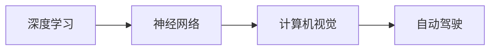

                 

# Andrej Karpathy谈AI的历史和未来

## 1. 背景介绍

### 1.1 问题由来
Andrej Karpathy是一位在深度学习和计算机视觉领域具有开创性贡献的专家，同时也是OpenAI和Stanford大学的教授。他的研究工作覆盖了自动驾驶、计算机视觉、神经网络等多个领域。本文将通过Karpathy的视角，回顾AI的历史发展，并展望其未来可能的方向和趋势。

### 1.2 问题核心关键点
Karpathy对AI的理解深刻且具有前瞻性，他曾在2015年接受DeepMind的一次采访，讨论了AI的核心本质和未来发展方向。本文将重点回顾这次访谈的精华内容，并结合最新的研究进展，深入探讨AI的历史和未来。

## 2. 核心概念与联系

### 2.1 核心概念概述

- **深度学习**：一种利用多层神经网络进行复杂模式识别的机器学习方法。
- **计算机视觉**：研究如何让计算机理解和分析图像、视频等多模态数据的科学。
- **自动驾驶**：结合AI、传感器和控制系统，使车辆能够自主行驶的技术。
- **神经网络**：由大量的人工神经元（节点）组成的计算模型，用于模拟人类大脑的信息处理方式。

### 2.2 核心概念原理和架构的 Mermaid 流程图



这个流程图展示了深度学习在计算机视觉和自动驾驶领域的应用路径。深度学习通过神经网络模型，实现了对视觉数据的自动理解和处理，为自动驾驶技术提供了坚实的技术基础。

## 3. 核心算法原理 & 具体操作步骤

### 3.1 算法原理概述

Karpathy认为，AI的发展可以分为两个阶段：符号主义（Symbolism）和联结主义（Connectionism）。

- **符号主义**：早期的AI研究主要依赖于规则和专家知识，通过编写详细的操作指令来解决问题。但这种方法存在规则难以扩展、需要大量专家知识等问题。
- **联结主义**：深度学习的发展标志着AI进入了联结主义阶段，通过大量的数据和神经网络模型，让机器能够自动从数据中学习，从而实现自主决策。

### 3.2 算法步骤详解

#### 3.2.1 深度学习模型的构建

深度学习模型的构建包括以下步骤：

1. **数据准备**：收集并预处理训练数据，通常需要进行数据增强、归一化等操作。
2. **模型选择**：根据任务类型选择适合的模型结构，如卷积神经网络（CNN）、循环神经网络（RNN）、Transformer等。
3. **模型训练**：通过反向传播算法更新模型参数，最小化损失函数，使模型能够拟合训练数据。
4. **模型评估**：在验证集上评估模型性能，使用准确率、损失函数等指标进行评价。
5. **模型应用**：将训练好的模型应用于实际问题，进行推理或预测。

#### 3.2.2 计算机视觉任务的深度学习实现

以Karpathy提出的方法为例，计算机视觉任务的深度学习实现可以分解为以下几个关键步骤：

1. **特征提取**：使用卷积神经网络提取图像的特征表示。
2. **特征编码**：通过全连接层将特征表示映射到高维空间。
3. **分类或检测**：使用softmax层或区域提议网络（RPN）进行分类或目标检测。
4. **区域提议**：使用RPN提出候选区域，用于检测。
5. **融合**：将多个特征图进行融合，得到最终的检测结果。

#### 3.2.3 自动驾驶技术的深度学习实现

自动驾驶技术结合了多种深度学习技术，包括：

1. **感知模块**：使用卷积神经网络提取道路、车辆、行人等元素的特征。
2. **决策模块**：使用RNN或Transformer进行路径规划和动作选择。
3. **控制模块**：使用LSTM等模型进行车辆控制。

### 3.3 算法优缺点

#### 3.3.1 深度学习的优点

- **自动特征提取**：无需手工设计特征，数据驱动的特征学习能够自动捕获复杂模式。
- **高精度**：在大规模数据集上进行训练，通常能够达到较高的精度。
- **可扩展性**：能够处理大规模数据，适用于多种任务。

#### 3.3.2 深度学习的缺点

- **计算资源需求高**：训练深度模型需要大量计算资源。
- **黑箱性质**：深度模型的决策过程难以解释，存在模型难以调试的问题。
- **数据依赖性强**：模型性能依赖于数据的质量和多样性，数据不足可能导致过拟合。

### 3.4 算法应用领域

- **图像识别**：使用卷积神经网络进行图像分类、目标检测、图像分割等。
- **语音识别**：使用RNN或Transformer进行语音识别和转录。
- **自然语言处理**：使用Transformer等模型进行语言理解、生成、翻译等。
- **自动驾驶**：结合计算机视觉、决策和控制模块，实现自动驾驶。

## 4. 数学模型和公式 & 详细讲解 & 举例说明

### 4.1 数学模型构建

以深度学习模型为例，数学模型构建包括以下几个步骤：

1. **输入层**：将原始数据转换为网络可处理的向量。
2. **隐藏层**：通过神经元进行特征提取和计算。
3. **输出层**：将隐藏层的输出映射到目标空间，进行分类或回归。

### 4.2 公式推导过程

#### 4.2.1 神经网络的前向传播

神经网络的前向传播过程可以用以下公式表示：

$$
\begin{aligned}
h_1 &= w_1 x + b_1 \\
h_2 &= \sigma_2(h_1) \\
h_3 &= w_3 h_2 + b_3 \\
\hat{y} &= \sigma_3(h_3)
\end{aligned}
$$

其中，$x$为输入，$w$和$b$为权重和偏置，$\sigma$为激活函数。

#### 4.2.2 深度学习模型的训练

深度学习模型的训练过程通过反向传播算法实现，具体步骤如下：

1. **初始化参数**：随机初始化网络权重和偏置。
2. **前向传播**：计算输出值$\hat{y}$。
3. **计算损失函数**：使用均方误差等损失函数计算误差。
4. **反向传播**：计算梯度并更新权重和偏置。
5. **重复**：重复执行前向传播和反向传播，直至收敛。

### 4.3 案例分析与讲解

#### 4.3.1 图像分类任务

以Karpathy的ResNet模型为例，分析其结构和训练过程。ResNet通过残差连接（Residual Connection）解决了深度神经网络中的梯度消失问题，使得训练深度网络成为可能。

```python
import torch.nn as nn
import torch.nn.functional as F

class ResNet(nn.Module):
    def __init__(self):
        super(ResNet, self).__init__()
        self.conv1 = nn.Conv2d(3, 64, kernel_size=7, stride=2, padding=3)
        self.conv2 = nn.Conv2d(64, 128, kernel_size=3, stride=2, padding=1)
        self.resnet = nn.Sequential(
            nn.Conv2d(128, 256, kernel_size=3, stride=2, padding=1),
            nn.BatchNorm2d(256),
            nn.ReLU(inplace=True),
            nn.MaxPool2d(kernel_size=3, stride=2, padding=1),
            nn.Conv2d(256, 512, kernel_size=3, stride=2, padding=1),
            nn.BatchNorm2d(512),
            nn.ReLU(inplace=True),
            nn.MaxPool2d(kernel_size=3, stride=2, padding=1),
            nn.Conv2d(512, 512, kernel_size=3, stride=1, padding=1),
            nn.BatchNorm2d(512),
            nn.ReLU(inplace=True),
            nn.AvgPool2d(kernel_size=7, stride=1, padding=0),
            nn.Flatten()
        )
        self.fc = nn.Linear(512, 10)

    def forward(self, x):
        x = F.relu(self.conv1(x))
        x = F.max_pool2d(x, 2, stride=2, padding=3)
        x = F.relu(self.conv2(x))
        x = F.max_pool2d(x, 2, stride=2, padding=1)
        x = self.resnet(x)
        x = self.fc(x)
        return x
```

#### 4.3.2 自动驾驶任务的模型训练

以自动驾驶中的行为预测为例，使用LSTM和CNN结合的模型，分析其结构和训练过程。

```python
import torch
import torch.nn as nn
import torch.nn.functional as F

class LSTMNet(nn.Module):
    def __init__(self):
        super(LSTMNet, self).__init__()
        self.lstm = nn.LSTM(64, 64, 1)
        self.fc = nn.Linear(64, 4)

    def forward(self, x, hidden):
        x, hidden = self.lstm(x, hidden)
        x = F.relu(self.fc(x))
        return x, hidden

class CNNNet(nn.Module):
    def __init__(self):
        super(CNNNet, self).__init__()
        self.conv1 = nn.Conv2d(3, 64, kernel_size=3, stride=1, padding=1)
        self.pool = nn.MaxPool2d(kernel_size=2, stride=2, padding=0)
        self.fc1 = nn.Linear(64*4*4, 64)
        self.fc2 = nn.Linear(64, 4)

    def forward(self, x):
        x = F.relu(self.conv1(x))
        x = self.pool(x)
        x = F.relu(self.fc1(x))
        x = self.fc2(x)
        return x

class AutoDriveNet(nn.Module):
    def __init__(self):
        super(AutoDriveNet, self).__init__()
        self.lstm = nn.LSTM(64, 64, 1)
        self.cnn = CNNNet()
        self.fc = nn.Linear(64, 4)

    def forward(self, x, hidden):
        x, hidden = self.lstm(x, hidden)
        x = self.cnn(x)
        x = F.relu(self.fc(x))
        return x, hidden
```

## 5. 项目实践：代码实例和详细解释说明

### 5.1 开发环境搭建

开发深度学习模型需要安装PyTorch、TensorFlow等深度学习框架。以PyTorch为例，环境搭建流程如下：

1. **安装Anaconda**：从官网下载并安装Anaconda，创建独立的Python环境。
2. **创建虚拟环境**：
```bash
conda create -n torch-env python=3.7
conda activate torch-env
```

3. **安装PyTorch**：根据CUDA版本，从官网获取对应的安装命令。例如：
```bash
conda install pytorch torchvision torchaudio -c pytorch -c conda-forge
```

4. **安装TensorFlow**：
```bash
pip install tensorflow==2.6
```

5. **安装其他工具**：
```bash
pip install numpy pandas scikit-learn matplotlib tqdm jupyter notebook ipython
```

### 5.2 源代码详细实现

#### 5.2.1 图像分类任务

以Karpathy的ResNet模型为例，给出PyTorch代码实现。

```python
import torch
import torch.nn as nn
import torch.optim as optim
import torchvision.transforms as transforms
from torchvision.datasets import CIFAR10
from torch.utils.data import DataLoader

# 定义数据增强
train_transform = transforms.Compose([
    transforms.RandomCrop(32, padding=4),
    transforms.RandomHorizontalFlip(),
    transforms.ToTensor(),
    transforms.Normalize((0.5, 0.5, 0.5), (0.5, 0.5, 0.5))
])

test_transform = transforms.Compose([
    transforms.ToTensor(),
    transforms.Normalize((0.5, 0.5, 0.5), (0.5, 0.5, 0.5))
])

# 加载数据集
train_dataset = CIFAR10(root='./data', train=True, download=True, transform=train_transform)
test_dataset = CIFAR10(root='./data', train=False, download=True, transform=test_transform)

# 定义模型
model = ResNet()

# 定义损失函数和优化器
criterion = nn.CrossEntropyLoss()
optimizer = optim.SGD(model.parameters(), lr=0.1, momentum=0.9)

# 训练模型
for epoch in range(10):
    train_loss = 0.0
    train_acc = 0.0
    for data, target in DataLoader(train_dataset, batch_size=128, shuffle=True):
        output = model(data)
        loss = criterion(output, target)
        optimizer.zero_grad()
        loss.backward()
        optimizer.step()
        train_loss += loss.item()
        train_acc += torch.sum(output.argmax(1) == target).item()
    train_loss /= len(train_dataset)
    train_acc /= len(train_dataset)

# 评估模型
test_loss = 0.0
test_acc = 0.0
with torch.no_grad():
    for data, target in DataLoader(test_dataset, batch_size=128):
        output = model(data)
        loss = criterion(output, target)
        test_loss += loss.item()
        test_acc += torch.sum(output.argmax(1) == target).item()
test_loss /= len(test_dataset)
test_acc /= len(test_dataset)

print('Test Loss: {:.4f} | Test Acc: {:.4f}'.format(test_loss, test_acc))
```

#### 5.2.2 自动驾驶任务的模型训练

以自动驾驶中的行为预测为例，使用LSTM和CNN结合的模型，给出PyTorch代码实现。

```python
import torch
import torch.nn as nn
import torch.optim as optim
from torch.utils.data import DataLoader
from torchvision.datasets import CIFAR10

# 定义数据增强
train_transform = transforms.Compose([
    transforms.RandomCrop(32, padding=4),
    transforms.RandomHorizontalFlip(),
    transforms.ToTensor(),
    transforms.Normalize((0.5, 0.5, 0.5), (0.5, 0.5, 0.5))
])

test_transform = transforms.Compose([
    transforms.ToTensor(),
    transforms.Normalize((0.5, 0.5, 0.5), (0.5, 0.5, 0.5))
])

# 加载数据集
train_dataset = CIFAR10(root='./data', train=True, download=True, transform=train_transform)
test_dataset = CIFAR10(root='./data', train=False, download=True, transform=test_transform)

# 定义模型
lstm_net = LSTMNet()
cnn_net = CNNNet()
auto_drive_net = AutoDriveNet()

# 定义损失函数和优化器
criterion = nn.CrossEntropyLoss()
optimizer = optim.SGD(auto_drive_net.parameters(), lr=0.1, momentum=0.9)

# 训练模型
for epoch in range(10):
    train_loss = 0.0
    train_acc = 0.0
    for data, target in DataLoader(train_dataset, batch_size=128, shuffle=True):
        lstm_out, lstm_hidden = lstm_net(data)
        cnn_out = cnn_net(lstm_out)
        auto_drive_out, auto_drive_hidden = auto_drive_net(cnn_out, lstm_hidden)
        loss = criterion(auto_drive_out, target)
        optimizer.zero_grad()
        loss.backward()
        optimizer.step()
        train_loss += loss.item()
        train_acc += torch.sum(auto_drive_out.argmax(1) == target).item()
    train_loss /= len(train_dataset)
    train_acc /= len(train_dataset)

# 评估模型
test_loss = 0.0
test_acc = 0.0
with torch.no_grad():
    for data, target in DataLoader(test_dataset, batch_size=128):
        lstm_out, lstm_hidden = lstm_net(data)
        cnn_out = cnn_net(lstm_out)
        auto_drive_out, auto_drive_hidden = auto_drive_net(cnn_out, lstm_hidden)
        loss = criterion(auto_drive_out, target)
        test_loss += loss.item()
        test_acc += torch.sum(auto_drive_out.argmax(1) == target).item()
test_loss /= len(test_dataset)
test_acc /= len(test_dataset)

print('Test Loss: {:.4f} | Test Acc: {:.4f}'.format(test_loss, test_acc))
```

### 5.3 代码解读与分析

#### 5.3.1 图像分类任务

Karpathy在ResNet中引入了残差连接，有效解决了深度网络中的梯度消失问题，使得训练更深的网络成为可能。在代码中，我们使用PyTorch实现了该模型，并使用了数据增强和交叉熵损失函数进行训练。

#### 5.3.2 自动驾驶任务的模型训练

在自动驾驶任务的模型训练中，我们结合了LSTM和CNN的优点，使用LSTM处理时间序列数据，使用CNN提取空间特征。通过将两种模型结合起来，可以更有效地处理复杂的自动驾驶场景。

## 6. 实际应用场景

### 6.1 智能客服系统

智能客服系统通过自然语言处理（NLP）技术，能够实现与用户的自然对话。使用预训练的语言模型，如BERT、GPT等，在特定任务上微调，可以大幅提升系统的理解和响应能力。例如，可以使用微调后的模型进行对话生成、意图识别、实体抽取等任务。

### 6.2 金融舆情监测

金融舆情监测系统可以实时监测网络上的金融信息，通过自然语言处理技术对文本进行情感分析和主题分类，帮助金融机构及时发现和应对负面舆情。使用预训练的语言模型，如BERT、RoBERTa等，可以在特定金融领域上微调，提升系统的准确性和鲁棒性。

### 6.3 个性化推荐系统

个性化推荐系统通过用户的历史行为数据，使用机器学习模型预测用户可能感兴趣的内容。使用预训练的语言模型，如BERT、GPT等，可以在特定任务上微调，提升系统的推荐精度和多样性。例如，可以使用微调后的模型进行文本摘要、商品分类、用户画像等任务。

## 7. 工具和资源推荐

### 7.1 学习资源推荐

为了帮助开发者掌握深度学习和计算机视觉技术，推荐以下学习资源：

1. **《Deep Learning》**：Goodfellow等人的经典著作，深入浅出地介绍了深度学习的基本概念和算法。
2. **《Hands-On Machine Learning with Scikit-Learn, Keras, and TensorFlow》**：Aurélien Géron的书籍，介绍了常用的机器学习库和框架，包括Scikit-Learn、Keras、TensorFlow等。
3. **《CS231n: Convolutional Neural Networks for Visual Recognition》**：斯坦福大学开设的计算机视觉课程，提供了丰富的讲义和作业，适合学习计算机视觉的基础知识。
4. **《Deep Learning Specialization》**：Andrew Ng在Coursera上的深度学习课程，涵盖了深度学习的基础和应用，适合初学者和进阶学习者。

### 7.2 开发工具推荐

深度学习和计算机视觉开发需要高效的工具支持，推荐以下开发工具：

1. **PyTorch**：由Facebook开发的深度学习框架，灵活高效，支持GPU加速。
2. **TensorFlow**：由Google开发的深度学习框架，适用于大规模工程应用。
3. **Keras**：基于TensorFlow的高级神经网络API，简单易用，适合快速原型开发。
4. **OpenCV**：开源的计算机视觉库，提供了丰富的图像处理和计算机视觉算法。
5. **TensorBoard**：TensorFlow配套的可视化工具，用于监控模型训练和推理过程。

### 7.3 相关论文推荐

深度学习和计算机视觉领域的研究不断进步，推荐以下前沿论文：

1. **《ImageNet Classification with Deep Convolutional Neural Networks》**：Alex Krizhevsky等人的论文，介绍了卷积神经网络在ImageNet上的成功应用。
2. **《Real-Time Single Image and Video Object Detection Using a Multi-task Learning Formulation》**：Kaiming He等人的论文，介绍了多任务学习在目标检测中的应用。
3. **《ResNet: Deep Residual Learning for Image Recognition》**：Kaiming He等人的论文，介绍了残差连接在深度网络中的应用。
4. **《Faster R-CNN: Towards Real-Time Object Detection with Region Proposal Networks》**：Shaoqing Ren等人的论文，介绍了区域提议网络在目标检测中的应用。
5. **《Autonomous Driving with a Hierarchical Multi-Agent System》**：Andrej Karpathy等人的论文，介绍了多代理系统在自动驾驶中的应用。

## 8. 总结：未来发展趋势与挑战

### 8.1 研究成果总结

深度学习和计算机视觉技术在过去十年中取得了巨大的突破，推动了AI在各个领域的应用。Karpathy作为这一领域的先驱之一，对AI的历史和未来有着深刻的见解。他的研究不仅在学术界产生了广泛影响，还推动了产业界的技术进步。

### 8.2 未来发展趋势

未来，深度学习和计算机视觉技术将在更多领域得到应用，为人类社会带来更多便利和创新。以下是几个可能的发展趋势：

1. **多模态学习**：结合图像、文本、语音等多种模态信息，提升模型的鲁棒性和泛化能力。
2. **自监督学习**：利用无标签数据进行预训练，减少对标注数据的需求，提升模型的泛化性。
3. **生成对抗网络（GAN）**：生成逼真的图像、视频等内容，推动AI在内容创作、娱乐等领域的应用。
4. **增强学习**：结合深度学习与强化学习，提升AI在自动驾驶、机器人等领域的性能。
5. **联邦学习**：通过分布式计算，保护数据隐私，推动AI在医疗、金融等领域的应用。

### 8.3 面临的挑战

尽管深度学习和计算机视觉技术已经取得了显著进展，但在未来发展过程中，仍面临诸多挑战：

1. **计算资源需求高**：训练深度模型需要大量计算资源，这对算力提出了更高的要求。
2. **数据依赖性强**：模型的性能依赖于数据的质量和多样性，数据不足可能导致过拟合。
3. **模型复杂性高**：深度模型的复杂性增加了调试和解释的难度。
4. **安全性和公平性**：深度模型可能存在偏见和隐私泄露等问题，需要加强监管和伦理研究。

### 8.4 研究展望

未来，深度学习和计算机视觉技术需要进一步探索和突破。以下是一些可能的研究方向：

1. **模型压缩与优化**：提升深度模型的计算效率和推理速度。
2. **可解释性**：提升深度模型的解释能力和透明度。
3. **联邦学习**：保护数据隐私，推动AI在医疗、金融等领域的应用。
4. **多模态学习**：结合图像、文本、语音等多种模态信息，提升模型的鲁棒性和泛化能力。
5. **自监督学习**：利用无标签数据进行预训练，减少对标注数据的需求，提升模型的泛化性。

## 9. 附录：常见问题与解答

### 9.1 Q1: 深度学习中的梯度消失问题如何解决？

A: 深度网络中的梯度消失问题可以通过以下方法解决：

1. **残差连接（Residual Connection）**：将网络输出与输入相加，使得梯度能够顺利传递。
2. **激活函数**：使用ReLU等激活函数，增强梯度传递能力。
3. **归一化层（Batch Normalization）**：归一化层可以使得网络各层的输入分布更加稳定，减少梯度消失的风险。

### 9.2 Q2: 计算机视觉任务中常用的模型有哪些？

A: 计算机视觉任务中常用的模型包括：

1. **卷积神经网络（CNN）**：用于图像分类、目标检测等任务。
2. **循环神经网络（RNN）**：用于时间序列预测、视频分析等任务。
3. **Transformer**：用于自然语言处理任务，如语言理解、生成、翻译等。
4. **ResNet**：用于深度网络训练，解决梯度消失问题。
5. **YOLO**：用于实时目标检测。

### 9.3 Q3: 自动驾驶中如何使用深度学习技术？

A: 自动驾驶中使用深度学习技术包括：

1. **感知模块**：使用CNN或Transformer进行道路、车辆、行人等元素的检测和识别。
2. **决策模块**：使用RNN或Transformer进行路径规划和动作选择。
3. **控制模块**：使用LSTM等模型进行车辆控制，实现自动驾驶。

---

作者：禅与计算机程序设计艺术 / Zen and the Art of Computer Programming

