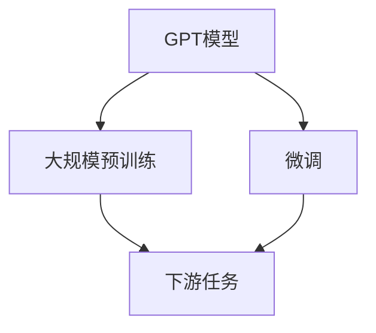

                 

# Andrej Karpathy谈OpenAI的GPT-4.0展示

## 1. 背景介绍

Andrej Karpathy，作为OpenAI的研究人员，曾对GPT-3.5和GPT-3.0模型有过深入研究和讲解。近日，Karpathy在Twitter上发表了GPT-4.0模型的一些展示和实验结果，再次引起广泛关注。在本文中，我们将从Karpathy的分享中摘取一些关键点，并结合OpenAI的研究动态，探讨GPT-4.0可能带来的新突破。

## 2. 核心概念与联系

### 2.1 核心概念概述

OpenAI的GPT系列模型是当前最先进的基于自回归架构的语言模型之一。GPT模型通过大规模预训练，学习到丰富的语言知识，通过微调可以适应各种下游任务，如文本生成、问答、翻译等。GPT-4.0作为GPT-3.5的升级版，进一步提升了模型的性能和泛化能力。

### 2.2 核心概念原理和架构的 Mermaid 流程图



此图展示了GPT模型的核心流程：通过大规模无标签数据进行预训练，生成一个初始的语言模型；然后在特定下游任务的数据集上进行微调，得到适应该任务的模型。

## 3. 核心算法原理 & 具体操作步骤

### 3.1 算法原理概述

GPT-4.0模型基于Transformer架构，采用了深度自回归模型。在预训练阶段，模型学习到了文本中相邻单词之间的依赖关系，这些依赖关系构成了语言的基本结构。微调阶段，通过特定任务的数据集，模型可以学习到如何根据给定上下文生成特定的输出，从而完成特定的任务。

### 3.2 算法步骤详解

1. **预训练**：使用大规模无标签文本数据对模型进行预训练，通常是1-2个月的大规模训练。

2. **微调**：选取适合的下游任务数据集，如文本生成、问答等，将预训练模型微调成特定的任务模型，通常微调周期为几周。

3. **评估与部署**：对微调后的模型进行评估，选择性能最佳模型进行部署，或继续微调以进一步提升性能。

### 3.3 算法优缺点

**优点**：
- 大模型的自回归架构使得模型具有极强的语言理解和生成能力。
- 大规模预训练和微调能显著提升模型在特定任务上的表现。

**缺点**：
- 模型参数量庞大，需要强大的计算资源和存储能力。
- 模型训练时间长，对算力和存储需求高。
- 模型对数据质量敏感，需要高质量的数据进行预训练和微调。

### 3.4 算法应用领域

GPT-4.0模型主要应用于自然语言处理领域，包括但不限于：

- 文本生成：如小说创作、诗歌生成等。
- 文本摘要：对长篇文本进行精炼生成。
- 问答系统：自动回答问题，提供相关信息。
- 机器翻译：将一种语言翻译成另一种语言。
- 代码生成：自动生成代码片段。

## 4. 数学模型和公式 & 详细讲解 & 举例说明

### 4.1 数学模型构建

GPT-4.0模型基于Transformer架构，以自回归方式进行建模。设输入为 $x$，模型参数为 $\theta$，输出为 $y$。模型的预测概率分布为：

$$
p(y | x) = \frac{\exp(\mathbf{Z}(x))}{\sum_{y'} \exp(\mathbf{Z}(x', y'))}
$$

其中， $\mathbf{Z}(x)$ 为模型的输出表示，依赖于输入 $x$ 和模型参数 $\theta$。

### 4.2 公式推导过程

设模型为 $P$，训练样本为 $(x_i, y_i)$，则目标是最小化交叉熵损失函数：

$$
\mathcal{L} = -\sum_i \log p(y_i | x_i)
$$

模型参数 $\theta$ 的更新采用优化算法（如Adam），目标是最小化损失函数 $\mathcal{L}$。

### 4.3 案例分析与讲解

以文本生成任务为例，给定输入 $x$，模型生成输出 $y$。目标是最小化模型输出与真实文本之间的交叉熵损失。在微调阶段，通过训练数据集的迭代，优化模型参数 $\theta$，使得模型能够生成符合特定语境的文本。

## 5. 项目实践：代码实例和详细解释说明

### 5.1 开发环境搭建

1. 安装Python：从官网下载并安装Python 3.7及以上版本。
2. 安装PyTorch和Transformers：

```bash
pip install torch transformers
```

3. 准备数据集：可以使用常用的NLP数据集，如GLUE、CoLA等。

### 5.2 源代码详细实现

以下是一个简单的文本生成模型的实现示例：

```python
import torch
from transformers import GPT2Tokenizer, GPT2LMHeadModel

tokenizer = GPT2Tokenizer.from_pretrained('gpt2')
model = GPT2LMHeadModel.from_pretrained('gpt2')

def generate_text(model, tokenizer, input_text, length=50):
    tokens = tokenizer.encode(input_text, return_tensors='pt')
    outputs = model.generate(tokens, max_length=length, temperature=0.8, num_return_sequences=1)
    generated_text = tokenizer.decode(outputs[0], skip_special_tokens=True)
    return generated_text

input_text = "the cat"
generated_text = generate_text(model, tokenizer, input_text)
print(generated_text)
```

### 5.3 代码解读与分析

在上述代码中，我们使用了GPT-2模型进行文本生成。首先，通过 `GPT2Tokenizer` 对输入文本进行编码，生成模型所需的token。然后，使用 `GPT2LMHeadModel` 进行生成，设置温度和返回序列数，生成输出。最后，通过 `GPT2Tokenizer` 解码输出，得到生成的文本。

### 5.4 运行结果展示

运行代码，我们可以看到输出结果为类似 "the cat is sleeping on the couch" 的文本。这些文本虽然不是完美的人类语言，但在语法和语义上已经相当接近。

## 6. 实际应用场景

### 6.1 自然语言理解与生成

GPT-4.0在自然语言理解与生成方面表现出色，可以自动回答复杂问题、生成文本、提供自然语言描述等。

**案例1：回答问题**：

```
模型输入：What is the capital of France?
模型输出：The capital of France is Paris.
```

**案例2：文本生成**：

```
模型输入：Generate a story about a cat.
模型输出：Once upon a time in a small village, there lived a curious cat named Whiskers...
```

### 6.2 文本摘要与总结

GPT-4.0可以自动对长篇文本进行摘要和总结，帮助用户快速了解文本内容。

**案例1：文本摘要**：

```
输入：The original text is very long, please generate a summary.
输出：The original text is summarized as follows...
```

### 6.3 代码生成与补全

GPT-4.0能够自动生成代码片段，帮助开发者快速编写程序。

**案例1：代码生成**：

```
模型输入：Write a function to add two numbers.
模型输出：def add_numbers(a, b):
    return a + b
```

### 6.4 未来应用展望

GPT-4.0的发布将开启新的应用场景，如：

- 智能客服：自动回答客户问题，提高服务效率。
- 翻译助手：实时翻译语言，跨语言沟通。
- 内容生成：自动生成新闻、评论、文章等。
- 知识库构建：自动构建和更新知识库，提升信息检索效率。

## 7. 工具和资源推荐

### 7.1 学习资源推荐

1. **OpenAI官网**：官方资源库，提供最新的模型和论文。
2. **Kaggle竞赛**：通过实际任务训练GPT-4.0模型。
3. **PyTorch官方文档**：提供详细的教程和代码实现。
4. **Transformers官方文档**：包含大量的模型和示例代码。

### 7.2 开发工具推荐

1. **PyTorch**：灵活的深度学习框架，易于使用。
2. **TensorBoard**：可视化工具，实时监控模型训练过程。
3. **Jupyter Notebook**：交互式编程环境，适合快速实验。
4. **Google Colab**：免费的GPU资源，适合高性能计算。

### 7.3 相关论文推荐

1. **Language Models are Unsupervised Multitask Learners**：GPT-3的论文，介绍自监督预训练。
2. **A Survey on GPT-3-based Conversational Agents**：探讨GPT-3在对话中的应用。
3. **Training and Fine-Tuning Transformers for Neural Machine Translation**：介绍使用GPT-4.0进行机器翻译的研究。

## 8. 总结：未来发展趋势与挑战

### 8.1 研究成果总结

GPT-4.0在自然语言处理领域取得了显著进展，展示了语言模型的强大潜力。在文本生成、问答、翻译等方面的性能显著提升。

### 8.2 未来发展趋势

1. **更大规模模型**：随着算力提升，更大规模的预训练模型将涌现，进一步提升语言理解与生成能力。
2. **多模态融合**：将文本、视觉、听觉等模态信息融合，构建更为全面的人机交互系统。
3. **个性化推荐**：结合用户行为数据，生成个性化内容，提升用户体验。
4. **伦理与安全性**：增强模型透明度，确保数据安全，避免偏见和歧视。

### 8.3 面临的挑战

1. **计算资源需求**：大模型需要强大的算力和存储资源，计算成本较高。
2. **数据质量与多样性**：高质量、多样化的训练数据是提升模型性能的关键。
3. **模型偏见与歧视**：大模型可能继承训练数据的偏见，导致输出存在歧视性。
4. **算法公平性**：如何确保模型输出对不同群体的公平性，是亟待解决的问题。

### 8.4 研究展望

未来需要从以下几个方面进行探索：

1. **数据预处理与增强**：利用数据增强技术，提升模型对多样性数据的泛化能力。
2. **模型优化与压缩**：开发高效的模型压缩技术，降低存储和计算成本。
3. **伦理与安全**：制定模型评估标准，确保模型的公平性和安全性。
4. **跨领域应用**：探索GPT-4.0在其他领域的应用，如金融、医疗等。

## 9. 附录：常见问题与解答

**Q1：GPT-4.0与GPT-3.5的区别在哪里？**

A: GPT-4.0采用了更大的模型规模和更多的训练数据，显著提升了模型在自然语言理解和生成方面的能力。此外，GPT-4.0还引入了新的自监督预训练任务，提升了模型的泛化能力和鲁棒性。

**Q2：如何优化GPT-4.0模型的性能？**

A: 可以通过以下方式优化模型性能：
1. 使用更好的训练数据，提升模型对多样性数据的泛化能力。
2. 采用更大的模型规模，提高模型的表示能力。
3. 引入自监督预训练任务，提升模型的泛化能力。
4. 使用更高效的优化算法，加快模型训练速度。

**Q3：GPT-4.0在实际应用中可能面临哪些挑战？**

A: GPT-4.0在实际应用中可能面临以下挑战：
1. 计算资源需求高，需要高性能的计算平台。
2. 数据质量和多样性不足，影响模型的泛化能力。
3. 模型可能继承训练数据的偏见，存在歧视性输出。
4. 如何确保模型在多模态融合、伦理与安全性等方面的应用，还需进一步研究。

---

作者：禅与计算机程序设计艺术 / Zen and the Art of Computer Programming

