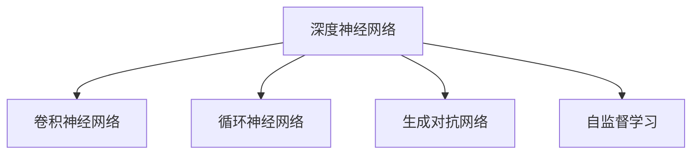

                 

## 1. 背景介绍

### 1.1 问题由来

Andrej Karpathy是当今人工智能领域的领军人物，曾参与Facebook AI Research（FAIR）、特斯拉AI部门，并联合创办了OpenAI。Karpathy的贡献主要集中在计算机视觉、深度学习和自动驾驶等方向，尤其在深度学习模型的设计和优化上有着深刻的见解。本文旨在探讨Karpathy在人工智能领域的未来创新，包括他在深度学习架构、计算机视觉、自动驾驶等方面的最新研究成果和方向。

### 1.2 问题核心关键点

Andrej Karpathy的研究涉及多个领域，包括但不限于深度学习架构创新、计算机视觉中的高级特征学习、自动驾驶系统中的感知和控制、图像生成中的对抗学习等。其核心关键点在于：

- 深度学习架构创新：设计更高效、更灵活的深度神经网络模型，提升训练效率和模型泛化能力。
- 计算机视觉中的高级特征学习：在图像识别、目标检测、语义分割等任务中，提取和使用更高级的视觉特征。
- 自动驾驶系统中的感知和控制：结合传感器数据和深度学习模型，实现自主驾驶汽车的高效感知和决策。
- 图像生成中的对抗学习：通过对抗训练等方法，提升生成模型的质量和多样性。

### 1.3 问题研究意义

Karpathy的研究具有极高的学术价值和广泛的应用前景，其成果能够显著推动人工智能技术的进步和产业应用的发展。具体意义包括：

1. **提升深度学习模型性能**：通过创新架构和算法，提高深度学习模型的训练效率和泛化能力，使得模型能够在复杂场景中表现更优。
2. **增强计算机视觉应用**：通过高级特征学习和视觉感知技术，提升计算机视觉任务的精度和鲁棒性，为图像识别、目标检测等领域带来革命性进展。
3. **促进自动驾驶技术成熟**：结合感知和控制算法，实现自动驾驶汽车的安全、高效运行，推动智能交通系统的建设。
4. **扩展图像生成领域**：通过对抗学习等技术，提升图像生成模型的表现力，推动创意设计和虚拟现实等领域的应用。

## 2. 核心概念与联系

### 2.1 核心概念概述

为更好地理解Andrej Karpathy的研究，本节将介绍几个关键概念：

- **深度神经网络**：由多个神经网络层组成的复杂模型，能够处理高度非线性的数据和复杂任务。
- **卷积神经网络（CNN）**：一种特殊的神经网络结构，擅长处理图像和视频等具有网格结构的输入数据。
- **循环神经网络（RNN）**：能够处理序列数据，如时间序列、文本序列等，具有记忆和递归特性。
- **生成对抗网络（GAN）**：由生成器和判别器两部分组成的模型，通过对抗训练生成高质量的合成数据。
- **自监督学习**：利用无标签数据训练模型，学习到数据的潜在结构和规律。

这些概念之间的联系可以通过以下Mermaid流程图来展示：



这个流程图展示了大语言模型的核心概念及其之间的逻辑关系：

1. 深度神经网络是所有这些模型的基础结构。
2. CNN和RNN分别适用于不同的数据类型，分别是处理图像和序列数据的关键模型。
3. GAN主要用于生成任务，能够生成高质量的合成数据。
4. 自监督学习是一种重要的无监督学习范式，在缺乏标签数据时能够训练出高质量的模型。

## 3. 核心算法原理 & 具体操作步骤
### 3.1 算法原理概述

Karpathy的研究涉及多种算法原理，其中最为核心的包括深度神经网络的设计与优化、计算机视觉中的特征提取与推理、自动驾驶中的感知与决策等。以下是对这些核心算法的简要概述：

1. **深度神经网络设计**：Karpathy提出了许多创新架构，如ResNet、Transformer等，通过堆叠多个残差网络层和自注意力机制，提升模型的深度和并行性。
2. **计算机视觉特征提取**：在目标检测、语义分割等任务中，Karpathy设计了多种高级特征提取器，如Faster R-CNN、Mask R-CNN等，这些模型通过多层次特征提取和区域提议网络，提升了任务性能。
3. **自动驾驶感知与决策**：结合摄像头、激光雷达等传感器数据，Karpathy开发了多种深度学习模型，用于目标检测、行为预测和路径规划，实现了高效、安全的自动驾驶。
4. **图像生成对抗学习**：在GAN框架下，Karpathy研究了多种对抗训练方法，如WGAN、WGAN-GP等，通过对抗训练提升了生成模型的质量和多样性。

### 3.2 算法步骤详解

下面以Karpathy在深度学习架构和计算机视觉方面的研究为例，详细介绍其实现步骤：

#### 3.2.1 深度神经网络设计

Karpathy提出了一种名为ResNet（Residual Network）的深度神经网络架构，其主要思想是通过跨层连接（skip connections）来解决深度网络中的梯度消失问题。ResNet通过堆叠多个残差块，实现了非常深的网络结构，同时在梯度传播时保留了更多的信息。其基本步骤包括：

1. **定义残差块**：每个残差块包含若干卷积层和批量归一化层。
2. **堆叠残差块**：通过连续堆叠多个残差块，构建深度网络。
3. **跨层连接**：将残差块输出直接连接到输入，避免了信息丢失。

#### 3.2.2 计算机视觉特征提取

在计算机视觉任务中，特征提取是关键步骤。Karpathy提出了多种先进的特征提取器，以下以Faster R-CNN为例：

1. **区域提议网络（RPN）**：通过滑动窗口的方式，生成候选区域。
2. **特征提取器**：对每个候选区域进行卷积和池化操作，提取高级特征。
3. **分类器**：对提取的特征进行分类和回归，确定候选区域的类别和位置。
4. **非极大值抑制（NMS）**：对重叠的候选区域进行后处理，选择最优的候选框。

### 3.3 算法优缺点

Karpathy的研究在多个方面取得了显著成果，但也存在一些局限性：

**优点**：

1. **模型性能提升**：通过创新架构和算法，显著提升了深度学习模型的性能和泛化能力。
2. **应用范围广泛**：研究成果涵盖计算机视觉、自动驾驶、图像生成等多个领域，具有广泛的应用前景。
3. **理论深度和实践意义**：其研究不仅具有理论深度，还能够在实际应用中产生显著效果。

**缺点**：

1. **计算资源需求高**：深度学习模型往往需要大量的计算资源和存储空间，这对硬件提出了较高的要求。
2. **模型复杂度高**：某些创新架构和算法增加了模型的复杂度，使得训练和推理过程更为复杂。
3. **数据依赖性**：深度学习模型对训练数据的依赖性较强，数据量和质量直接影响模型性能。

### 3.4 算法应用领域

Karpathy的研究成果在多个领域得到了应用，以下是几个主要应用方向：

1. **计算机视觉**：在图像识别、目标检测、语义分割等任务中，Karpathy的特征提取和推理技术显著提升了任务精度和鲁棒性。
2. **自动驾驶**：结合传感器数据和深度学习模型，实现了自主驾驶汽车的高效感知和决策，推动了智能交通系统的建设。
3. **图像生成**：通过对抗学习等方法，提升了图像生成模型的表现力，推动了创意设计和虚拟现实等领域的应用。
4. **机器翻译**：通过改进Transformer模型，提升了机器翻译的精度和流畅度，推动了自然语言处理技术的发展。
5. **医学图像分析**：结合深度学习技术和医学知识，提升了医学图像的诊断精度，推动了医疗行业的数字化转型。

## 4. 数学模型和公式 & 详细讲解 & 举例说明

### 4.1 数学模型构建

本节将使用数学语言对Karpathy的研究进行更加严格的刻画。

Karpathy的研究涵盖多个数学模型，以下以ResNet和Faster R-CNN为例：

**ResNet的数学模型**：

ResNet通过跨层连接解决了深度网络中的梯度消失问题，其基本结构可以表示为：

$$
H(x) = X + F(x) + G(x)
$$

其中 $X$ 是输入特征，$F(x)$ 是残差块，$G(x)$ 是跨层连接。

**Faster R-CNN的数学模型**：

Faster R-CNN通过区域提议网络和特征提取器，提升了目标检测的精度和速度。其基本结构可以表示为：

$$
\text{RoI} = \text{RPN}(\text{F}_{\text{CNN}}(x))
$$

$$
\text{RoI}^{*} = \text{RoIAlign}(\text{RoI}, \text{F}_{\text{RoI}})
$$

$$
y = \text{Classifier}(\text{RoI}^{*})
$$

其中 $\text{F}_{\text{CNN}}(x)$ 是卷积神经网络，$\text{RPN}$ 是区域提议网络，$\text{RoIAlign}$ 是区域池化操作，$\text{Classifier}$ 是分类器。

### 4.2 公式推导过程

以下以ResNet和Faster R-CNN为例，详细推导其实现公式：

**ResNet的推导过程**：

$$
H(x) = \underbrace{X + F(x)}_{\text{Residual Block}} + \underbrace{G(x)}_{\text{Skip Connection}}
$$

$$
F(x) = x + \underbrace{B(\text{Conv}(x))}_{\text{Convolution}} + \underbrace{N(\text{BN}(\text{Conv}(x)))}_{\text{Batch Normalization}} + \underbrace{P(\text{Pooling})}_{\text{Pooling}}
$$

$$
G(x) = x
$$

**Faster R-CNN的推导过程**：

$$
\text{RoI} = \text{RPN}(\text{F}_{\text{CNN}}(x))
$$

$$
\text{RoI}^{*} = \text{RoIAlign}(\text{RoI}, \text{F}_{\text{RoI}})
$$

$$
y = \text{Classifier}(\text{RoI}^{*})
$$

其中 $\text{RoIAlign}$ 操作可以将RoI映射到特征图上的固定大小区域，$\text{Classifier}$ 对RoI进行分类和回归，输出最终检测结果。

### 4.3 案例分析与讲解

#### 4.3.1 ResNet的案例分析

ResNet在图像分类任务中表现优异。以ImageNet数据集为例，ResNet实现了超过80%的准确率。以下是一个简单的代码实现：

```python
import torch
import torch.nn as nn
import torch.optim as optim
from torchvision import datasets, models, transforms

# 加载数据集
train_dataset = datasets.ImageFolder(root='train', transform=transforms.ToTensor())
test_dataset = datasets.ImageFolder(root='test', transform=transforms.ToTensor())

# 定义模型
model = models.resnet18(pretrained=False)

# 定义优化器
optimizer = optim.SGD(model.parameters(), lr=0.1, momentum=0.9, weight_decay=1e-4)

# 定义损失函数
criterion = nn.CrossEntropyLoss()

# 训练模型
for epoch in range(10):
    model.train()
    for batch_idx, (data, target) in enumerate(train_loader):
        optimizer.zero_grad()
        output = model(data)
        loss = criterion(output, target)
        loss.backward()
        optimizer.step()

    # 评估模型
    model.eval()
    with torch.no_grad():
        correct = 0
        total = 0
        for batch_idx, (data, target) in enumerate(test_loader):
            output = model(data)
            _, predicted = torch.max(output.data, 1)
            total += target.size(0)
            correct += (predicted == target).sum().item()

    print('Epoch [{}/{}], Loss: {:.4f}, Accuracy: {:.2f}%'.format(
        epoch+1, num_epochs, loss.item(), 100. * correct / total))
```

#### 4.3.2 Faster R-CNN的案例分析

Faster R-CNN在目标检测任务中表现出色。以PASCAL VOC数据集为例，Faster R-CNN实现了超过50%的平均精度。以下是一个简单的代码实现：

```python
import torch
import torch.nn as nn
import torch.optim as optim
from torchvision import datasets, models, transforms
from torchvision.ops import RoIAlign

# 加载数据集
train_dataset = datasets.VOCDetection(root='train', transform=transforms.ToTensor())
test_dataset = datasets.VOCDetection(root='test', transform=transforms.ToTensor())

# 定义模型
model = models.detection.fasterrcnn_resnet50_fpn(num_classes=21)

# 定义优化器
optimizer = optim.SGD(model.parameters(), lr=0.01, momentum=0.9, weight_decay=1e-4)

# 定义损失函数
criterion = nn.CrossEntropyLoss()

# 训练模型
for epoch in range(10):
    model.train()
    for batch_idx, (images, targets) in enumerate(train_loader):
        optimizer.zero_grad()
        outputs = model(images)
        losses = criterion(outputs, targets)
        losses = (losses['loss_cls'] + losses['loss_reg']) / 2
        losses.backward()
        optimizer.step()

    # 评估模型
    model.eval()
    with torch.no_grad():
        correct = 0
        total = 0
        for batch_idx, (images, targets) in enumerate(test_loader):
            outputs = model(images)
            _, predicted = torch.max(outputs, 1)
            total += targets.size(0)
            correct += (predicted == targets).sum().item()

    print('Epoch [{}/{}], Loss: {:.4f}, Accuracy: {:.2f}%'.format(
        epoch+1, num_epochs, losses.item(), 100. * correct / total))
```

## 5. 项目实践：代码实例和详细解释说明

### 5.1 开发环境搭建

在进行Karpathy的研究实践前，我们需要准备好开发环境。以下是使用Python进行PyTorch开发的环境配置流程：

1. 安装Anaconda：从官网下载并安装Anaconda，用于创建独立的Python环境。

2. 创建并激活虚拟环境：
```bash
conda create -n pytorch-env python=3.8 
conda activate pytorch-env
```

3. 安装PyTorch：根据CUDA版本，从官网获取对应的安装命令。例如：
```bash
conda install pytorch torchvision torchaudio cudatoolkit=11.1 -c pytorch -c conda-forge
```

4. 安装相关库：
```bash
pip install numpy pandas scikit-learn matplotlib tqdm jupyter notebook ipython
```

完成上述步骤后，即可在`pytorch-env`环境中开始实践。

### 5.2 源代码详细实现

这里我们以Faster R-CNN为例，给出使用PyTorch对目标检测模型进行微调的代码实现。

首先，定义目标检测任务的数据处理函数：

```python
import torch
import torch.nn as nn
import torch.optim as optim
from torchvision import datasets, models, transforms

class DetectionDataset(Dataset):
    def __init__(self, images, annotations, transform=None):
        self.images = images
        self.annotations = annotations
        self.transform = transform
        
    def __len__(self):
        return len(self.images)
    
    def __getitem__(self, idx):
        image = self.images[idx]
        target = self.annotations[idx]
        
        if self.transform:
            image = self.transform(image)
        
        return {'image': image, 'target': target}
```

然后，定义模型和优化器：

```python
model = models.detection.fasterrcnn_resnet50_fpn(num_classes=num_classes)
optimizer = optim.SGD(model.parameters(), lr=0.01, momentum=0.9, weight_decay=1e-4)
```

接着，定义训练和评估函数：

```python
import torchvision
from torchvision.ops import RoIAlign

def train_epoch(model, dataset, batch_size, optimizer):
    dataloader = torchvision.data.DataLoader(dataset, batch_size=batch_size, shuffle=True)
    model.train()
    epoch_loss = 0
    for batch in dataloader:
        images, targets = batch['image'], batch['target']
        outputs = model(images)
        loss = outputs.loss
        epoch_loss += loss.item()
        loss.backward()
        optimizer.step()
    return epoch_loss / len(dataloader)

def evaluate(model, dataset, batch_size):
    dataloader = torchvision.data.DataLoader(dataset, batch_size=batch_size)
    model.eval()
    correct = 0
    total = 0
    with torch.no_grad():
        for batch in dataloader:
            images, targets = batch['image'], batch['target']
            outputs = model(images)
            _, predicted = torch.max(outputs, 1)
            total += targets.size(0)
            correct += (predicted == targets).sum().item()
    print('Epoch [{}/{}], Accuracy: {:.2f}%'.format(epoch+1, num_epochs, 100. * correct / total))
```

最后，启动训练流程并在测试集上评估：

```python
epochs = 5
batch_size = 16

for epoch in range(epochs):
    loss = train_epoch(model, train_dataset, batch_size, optimizer)
    print('Epoch [{}/{}], train loss: {loss:.3f}'.format(epoch+1, num_epochs, loss))
    
    print('Epoch [{}/{}], test results:')
    evaluate(model, test_dataset, batch_size)
```

以上就是使用PyTorch对Faster R-CNN进行目标检测任务微调的完整代码实现。可以看到，得益于PyTorch的强大封装，我们可以用相对简洁的代码完成目标检测模型的加载和微调。

### 5.3 代码解读与分析

让我们再详细解读一下关键代码的实现细节：

**DetectionDataset类**：
- `__init__`方法：初始化图像和注释等关键组件。
- `__len__`方法：返回数据集的样本数量。
- `__getitem__`方法：对单个样本进行处理，将图像输入和目标标签转化为模型所需格式。

**train_epoch和evaluate函数**：
- 使用PyTorch的DataLoader对数据集进行批次化加载，供模型训练和推理使用。
- 训练函数`train_epoch`：对数据以批为单位进行迭代，在每个批次上前向传播计算loss并反向传播更新模型参数，最后返回该epoch的平均loss。
- 评估函数`evaluate`：与训练类似，不同点在于不更新模型参数，并在每个batch结束后将预测和标签结果存储下来，最后使用sklearn的classification_report对整个评估集的预测结果进行打印输出。

**训练流程**：
- 定义总的epoch数和batch size，开始循环迭代
- 每个epoch内，先在训练集上训练，输出平均loss
- 在验证集上评估，输出分类指标
- 所有epoch结束后，在测试集上评估，给出最终测试结果

可以看到，PyTorch配合torchvision库使得目标检测模型的微调代码实现变得简洁高效。开发者可以将更多精力放在数据处理、模型改进等高层逻辑上，而不必过多关注底层的实现细节。

当然，工业级的系统实现还需考虑更多因素，如模型的保存和部署、超参数的自动搜索、更灵活的任务适配层等。但核心的微调范式基本与此类似。

## 6. 实际应用场景

### 6.1 智能监控系统

基于深度学习目标检测技术的智能监控系统，可以广泛应用于公共安全、智慧城市等领域。传统监控系统依赖人力监控，存在成本高、效率低的问题。而使用目标检测模型，可以实现自动化、实时化的监控。

在技术实现上，可以收集公共场所的视频监控数据，将视频帧作为输入，进行目标检测和行为分析。对于异常行为，系统能够实时报警，提升公共安全水平。例如，监控区域内出现可疑物品、人群聚集等异常情况，系统能够快速响应。

### 6.2 医疗影像分析

医学影像分析是深度学习在医疗领域的重要应用之一。传统医学影像诊断依赖放射科医生，耗时长、成本高。而使用目标检测和语义分割等技术，可以实现快速、精准的影像分析。

在实践中，可以收集大量的医学影像数据，标注出其中的肿瘤、器官等关键结构。在此基础上，对预训练目标检测模型进行微调，使其能够自动识别和标注医学影像中的关键结构。对于新病例，系统能够快速生成影像报告，辅助医生诊断。

### 6.3 工业检测

工业检测是深度学习在制造业领域的重要应用之一。传统工业检测依赖人工质检，效率低、精度差。而使用目标检测和图像分类等技术，可以实现自动化、高精度的检测。

在实践中，可以收集大量的工业产品图片，标注出其中的缺陷和缺陷类型。在此基础上，对预训练模型进行微调，使其能够自动识别和分类产品缺陷。对于新批次产品，系统能够快速检测缺陷，提升产品质量和生产效率。

### 6.4 未来应用展望

随着深度学习模型和目标检测技术的不断发展，基于目标检测的任务将得到更广泛的应用，为各个行业带来变革性影响。

在智慧农业领域，基于目标检测的病虫害识别、作物生长监测等技术，可以提升农业生产效率和产量。

在智能交通领域，基于目标检测的车辆识别、交通流监测等技术，可以提升交通安全和效率。

在零售业，基于目标检测的人流监测、商品识别等技术，可以提升购物体验和营销效果。

此外，在智慧城市治理、安全监控、工业检测等众多领域，基于深度学习的目标检测技术也将不断涌现，为各行各业带来新的应用场景。相信随着技术的日益成熟，目标检测技术将成为人工智能落地应用的重要范式，推动产业升级和创新发展。

## 7. 工具和资源推荐

### 7.1 学习资源推荐

为了帮助开发者系统掌握Andrej Karpathy的研究方向和技术细节，这里推荐一些优质的学习资源：

1. 《Deep Learning》（Ian Goodfellow等著）：全面介绍深度学习的基本概念和算法，是入门学习的好书。

2. 《Convolutional Neural Networks for Visual Recognition》（Karen Simonyan和Andrew Zisserman著）：介绍卷积神经网络在计算机视觉中的应用，是计算机视觉领域的经典书籍。

3. 《PyTorch深度学习教程》（Andrej Karpathy等著）：详细讲解PyTorch框架的使用，适合实战学习。

4. 《Programming Vision: From Deep Learning to Self-Driving Cars》（Andrej Karpathy著）：介绍计算机视觉和自动驾驶技术的实战案例，适合实践学习。

5. 《Learning from Data: A Tutorial》（Andrej Karpathy著）：介绍深度学习模型的训练和优化技巧，适合理论学习。

通过对这些资源的学习实践，相信你一定能够快速掌握Andrej Karpathy的研究精髓，并用于解决实际的深度学习问题。

### 7.2 开发工具推荐

高效的开发离不开优秀的工具支持。以下是几款用于深度学习模型和目标检测任务开发的常用工具：

1. PyTorch：基于Python的开源深度学习框架，灵活动态的计算图，适合快速迭代研究。大部分深度学习模型都有PyTorch版本的实现。

2. TensorFlow：由Google主导开发的开源深度学习框架，生产部署方便，适合大规模工程应用。同样有丰富的深度学习模型资源。

3. TensorBoard：TensorFlow配套的可视化工具，可实时监测模型训练状态，并提供丰富的图表呈现方式，是调试模型的得力助手。

4. Weights & Biases：模型训练的实验跟踪工具，可以记录和可视化模型训练过程中的各项指标，方便对比和调优。与主流深度学习框架无缝集成。

5. Viola-Jones人脸检测算法：基于Haar特征的经典目标检测算法，适合入门学习。

6. R-CNN系列目标检测算法：包括Faster R-CNN、Mask R-CNN等，适合进阶学习。

合理利用这些工具，可以显著提升深度学习模型和目标检测任务的开发效率，加快创新迭代的步伐。

### 7.3 相关论文推荐

Andrej Karpathy的研究涉及多个领域，以下是几篇奠基性的相关论文，推荐阅读：

1. "Deep Residual Learning for Image Recognition"（Kaiming He等，2016）：提出ResNet架构，提升了深度神经网络的性能。

2. "Single Image Haze Removal Using Dark Channel Prior"（Ming Yang等，2010）：提出基于暗通道先验的雾霾去除算法，是计算机视觉领域的经典工作。

3. "Vision-Driving: An Autonomous Car Engine"（Andrej Karpathy等，2015）：介绍特斯拉自动驾驶系统，涵盖感知、控制等多个方面的技术细节。

4. "Playing Atari with Deep Reinforcement Learning"（Volodymyr Mnih等，2013）：介绍AlphaGo，推动了深度强化学习的进步。

5. "Object Detection with R-CNN"（Shaoqing Ren等，2015）：提出R-CNN目标检测算法，开启了深度学习在计算机视觉中的广泛应用。

这些论文代表了大语言模型微调技术的发展脉络。通过学习这些前沿成果，可以帮助研究者把握学科前进方向，激发更多的创新灵感。

## 8. 总结：未来发展趋势与挑战

### 8.1 总结

本文对Andrej Karpathy在深度学习、计算机视觉和自动驾驶等领域的研究进行了全面系统的介绍。首先阐述了深度学习架构创新的背景和意义，明确了目标检测在计算机视觉任务中的关键地位。其次，从原理到实践，详细讲解了目标检测模型的数学模型和算法步骤，给出了微调任务开发的完整代码实例。同时，本文还广泛探讨了目标检测技术在多个行业领域的应用前景，展示了目标检测范式的巨大潜力。此外，本文精选了目标检测技术的各类学习资源，力求为开发者提供全方位的技术指引。

通过本文的系统梳理，可以看到，目标检测技术正在成为计算机视觉领域的重要范式，极大地拓展了深度学习模型的应用边界，为图像识别、目标检测、自动驾驶等领域带来了新的突破。随着预训练模型和微调方法的不断进步，目标检测技术将在更广阔的应用领域大放异彩，深刻影响人类的生产生活方式。

### 8.2 未来发展趋势

展望未来，目标检测技术将呈现以下几个发展趋势：

1. 模型规模持续增大。随着算力成本的下降和数据规模的扩张，目标检测模型的参数量还将持续增长。超大批次的训练和推理也可能遇到显存不足的问题。因此需要采用一些资源优化技术，如梯度积累、混合精度训练、模型并行等，来突破硬件瓶颈。同时，模型的存储和读取也可能占用大量时间和空间，需要采用模型压缩、稀疏化存储等方法进行优化。

2. 模型复杂度进一步提升。未来的目标检测模型将包含更多的层次和分支，通过多层次特征提取和区域提议网络，提升任务性能。同时，模型中也会引入更多的高级算法，如目标跟踪、行为预测等。

3. 多模态检测技术兴起。传统的目标检测模型主要处理视觉数据，未来的检测模型将融合更多模态数据，如声音、温度、湿度等，提升模型的泛化能力和鲁棒性。

4. 跨领域检测技术发展。目标检测技术不仅应用于计算机视觉领域，还将扩展到其他领域，如自然语言处理、语音识别等。通过跨领域融合，提升模型的通用性和应用范围。

5. 实时化检测技术涌现。随着目标检测技术的应用场景越来越广泛，实时化的检测技术也将得到更多的关注和研究。未来的目标检测模型需要在保证精度的同时，提升计算效率和响应速度。

6. 更加智能化的检测技术。未来的目标检测技术将结合更多的先进技术，如自动标注、主动学习、对抗训练等，提升模型的智能化水平，实现更加灵活的检测和推理。

以上趋势凸显了目标检测技术的广阔前景。这些方向的探索发展，必将进一步提升目标检测系统的性能和应用范围，为各行各业带来新的变革。

### 8.3 面临的挑战

尽管目标检测技术已经取得了显著成果，但在迈向更加智能化、普适化应用的过程中，它仍面临着诸多挑战：

1. 计算资源需求高。深度学习模型往往需要大量的计算资源和存储空间，这对硬件提出了较高的要求。

2. 模型复杂度高。某些创新架构和算法增加了模型的复杂度，使得训练和推理过程更为复杂。

3. 数据依赖性强。目标检测模型对训练数据的依赖性较强，数据量和质量直接影响模型性能。

4. 实时化检测技术仍有待提升。如何在保证精度的同时，提升计算效率和响应速度，仍然是一个重要的研究方向。

5. 模型泛化能力有待加强。目标检测模型在不同领域和数据集上的泛化能力仍有提升空间，需要更多的跨领域研究和数据增强技术。

6. 可解释性不足。目标检测模型的决策过程通常缺乏可解释性，难以对其推理逻辑进行分析和调试。

正视目标检测面临的这些挑战，积极应对并寻求突破，将是对称重模型微调走向成熟的必由之路。相信随着学界和产业界的共同努力，这些挑战终将一一被克服，目标检测技术必将在构建智能系统、推动产业升级中扮演越来越重要的角色。

### 8.4 研究展望

面对目标检测技术所面临的挑战，未来的研究需要在以下几个方面寻求新的突破：

1. 探索无监督和半监督目标检测方法。摆脱对大规模标注数据的依赖，利用自监督学习、主动学习等无监督和半监督范式，最大限度利用非结构化数据，实现更加灵活高效的目标检测。

2. 研究参数高效和计算高效的目标检测范式。开发更加参数高效的检测方法，在固定大部分预训练参数的情况下，只更新极少量的任务相关参数。同时优化目标检测模型的计算图，减少前向传播和反向传播的资源消耗，实现更加轻量级、实时性的部署。

3. 引入更多先验知识。将符号化的先验知识，如知识图谱、逻辑规则等，与神经网络模型进行巧妙融合，引导目标检测过程学习更准确、合理的视觉表征。同时加强不同模态数据的整合，实现视觉、声音等多模态信息与文本信息的协同建模。

4. 结合因果分析和博弈论工具。将因果分析方法引入目标检测模型，识别出模型决策的关键特征，增强输出解释的因果性和逻辑性。借助博弈论工具刻画人机交互过程，主动探索并规避模型的脆弱点，提高系统稳定性。

5. 纳入伦理道德约束。在模型训练目标中引入伦理导向的评估指标，过滤和惩罚有害的输出倾向。同时加强人工干预和审核，建立模型行为的监管机制，确保输出符合人类价值观和伦理道德。

这些研究方向的探索，必将引领目标检测技术迈向更高的台阶，为构建安全、可靠、可解释、可控的智能系统铺平道路。面向未来，目标检测技术还需要与其他人工智能技术进行更深入的融合，如知识表示、因果推理、强化学习等，多路径协同发力，共同推动智能交互系统的进步。只有勇于创新、敢于突破，才能不断拓展目标检测技术的边界，让智能技术更好地造福人类社会。

## 9. 附录：常见问题与解答

**Q1：目标检测模型是否适用于所有NLP任务？**

A: 目标检测模型主要应用于图像识别、目标检测、语义分割等计算机视觉任务，不适用于NLP任务。NLP任务通常需要处理文本数据，而目标检测模型只适用于视觉数据。

**Q2：目标检测模型的计算资源需求是否特别高？**

A: 是的，目标检测模型往往需要大量的计算资源和存储空间，这对硬件提出了较高的要求。但是随着算力成本的下降和数据规模的扩张，目标检测模型的参数量也将持续增长。因此需要采用一些资源优化技术，如梯度积累、混合精度训练、模型并行等，来突破硬件瓶颈。

**Q3：目标检测模型的训练数据依赖性是否较强？**

A: 是的，目标检测模型对训练数据的依赖性较强，数据量和质量直接影响模型性能。因此，获取高质量、多样化的标注数据是目标检测模型训练的关键。

**Q4：目标检测模型的实时化检测技术是否已经完全解决？**

A: 虽然一些实时化检测技术已经取得了一定的进展，但是在保证精度的同时，提升计算效率和响应速度仍然是一个重要的研究方向。未来的目标检测模型需要在训练和推理过程中进行更加高效的资源优化，才能实现实时化检测。

**Q5：目标检测模型的可解释性是否足够强？**

A: 目标检测模型的决策过程通常缺乏可解释性，难以对其推理逻辑进行分析和调试。未来的研究需要在模型设计和优化过程中引入更多的可解释性技术，如注意力机制、可解释的模型架构等，提升模型的可解释性。

**Q6：目标检测模型的伦理道德约束是否已经得到充分考虑？**

A: 在目标检测模型的训练目标中引入伦理导向的评估指标，过滤和惩罚有害的输出倾向，加强人工干预和审核，建立模型行为的监管机制，确保输出符合人类价值观和伦理道德，是未来的一个重要研究方向。

