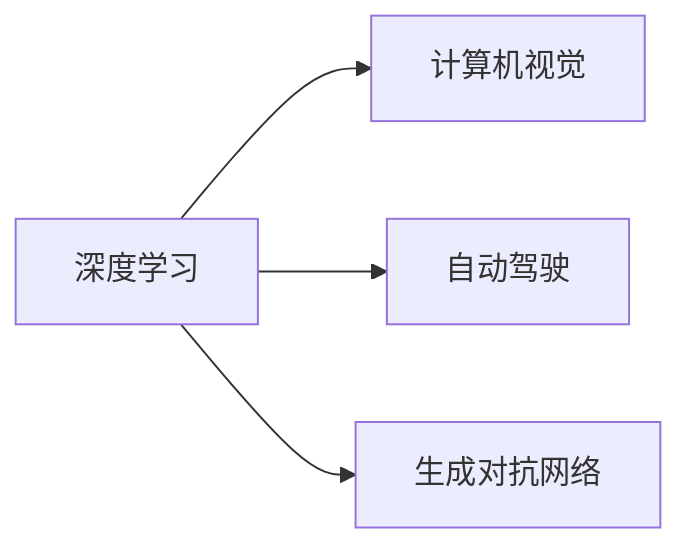

                 

## 1. 背景介绍

安德里·卡帕西（Andrej Karpathy），斯坦福大学计算机科学教授，人工智能研究领域的领军人物，以其在深度学习和计算机视觉方面的创新性研究著称，并与特斯拉创始人伊隆·马斯克合作，推动了自动驾驶技术的突破。本文将探讨卡帕西对人工智能未来发展的观点，并结合他的研究成果，分析技术趋势和应用前景。

### 1.1 背景概述
在过去的十年中，卡帕西领导的研究团队在计算机视觉和深度学习领域取得了众多突破，包括开发了卷积神经网络（CNN）、注意力机制等关键技术。他曾任特斯拉首席人工智能科学家，致力于自动驾驶汽车的研究与开发。卡帕西的科研成果丰富，曾获得图灵奖，是人工智能界公认的权威。

### 1.2 研究领域
卡帕西的研究领域主要包括计算机视觉、深度学习、自动驾驶、机器人、以及生成对抗网络（GAN）。他的研究成果在学术界和工业界都产生了深远影响，是AI技术进步的重要推动力之一。

## 2. 核心概念与联系

### 2.1 核心概念概述

在探讨卡帕西对AI未来发展的观点之前，我们先介绍几个核心概念：

- **深度学习**：一种基于神经网络的机器学习方法，通过构建多层次的特征提取器，实现了端到端的自动特征学习。
- **计算机视觉**：研究如何让计算机理解、分析并解释图像和视频等视觉数据，是AI的重要分支。
- **自动驾驶**：通过AI技术实现车辆自主导航，使得车辆能够自我学习和适应环境，是卡帕西研究的重要方向之一。
- **生成对抗网络（GAN）**：一种由生成器和判别器两部分构成的深度学习模型，用于生成逼真的图像、视频等。

这些概念紧密相连，共同构成了卡帕西的研究方向和技术基础。

### 2.2 Mermaid 流程图(Mermaid 流程节点中不要有括号、逗号等特殊字符)



## 3. 核心算法原理 & 具体操作步骤

### 3.1 算法原理概述

卡帕西的研究团队在深度学习和计算机视觉领域有着卓越的成就，他提出的算法和技术对AI未来发展有着深远影响。本文将介绍卡帕西研究的核心算法原理，并分析其在人工智能未来的发展前景。

### 3.2 算法步骤详解

#### 3.2.1 深度学习

深度学习是卡帕西研究的重要基础，以下是深度学习的基本流程：

1. **数据准备**：收集大量图像、视频等数据，进行预处理和标注。
2. **模型设计**：选择合适的神经网络结构，如CNN、RNN、Transformer等，进行网络构建。
3. **模型训练**：使用训练集进行模型训练，调整网络参数，最小化损失函数。
4. **模型评估**：使用验证集评估模型性能，选择最优模型。
5. **模型应用**：在测试集上测试模型，进行实际应用。

#### 3.2.2 计算机视觉

计算机视觉的算法包括特征提取、目标检测、图像分割等。以下是核心步骤：

1. **特征提取**：使用卷积神经网络提取图像特征，构建特征图。
2. **目标检测**：通过YOLO、Faster R-CNN等算法，检测图像中的目标对象。
3. **图像分割**：通过语义分割、实例分割等技术，对图像进行像素级别的分割。
4. **实例识别**：通过RetinaNet、CenterNet等算法，识别图像中的具体实例。

#### 3.2.3 自动驾驶

自动驾驶的关键在于让车辆在复杂环境中自主导航。以下步骤是自动驾驶的常见流程：

1. **环境感知**：使用传感器获取车辆周围的环境信息，如雷达、激光雷达、摄像头等。
2. **目标检测与跟踪**：检测并跟踪道路上的其他车辆、行人、交通标志等目标。
3. **路径规划与决策**：根据感知信息，进行路径规划和驾驶决策，如避障、超车、停车等。
4. **控制执行**：控制车辆转向、加速、制动等，实现自主驾驶。

#### 3.2.4 生成对抗网络（GAN）

GAN是一种生成模型，包括生成器和判别器两部分。以下是生成对抗网络的基本步骤：

1. **生成器**：学习生成逼真的图像，输出结果。
2. **判别器**：学习区分真实图像和生成图像，输出结果。
3. **训练过程**：通过对抗训练，不断调整生成器和判别器的参数，使得生成器能够生成更逼真的图像，判别器能够更准确地区分真实与生成的图像。

### 3.3 算法优缺点

#### 3.3.1 深度学习

**优点**：
- **自动化特征学习**：不需要手工设计特征，能够自动学习图像、语音、文本等多种数据类型的特征。
- **高效表示能力**：能够高效表示复杂数据结构，解决各种类型的任务。
- **适应性**：在不同的任务和数据集上，深度学习模型具有较好的适应性。

**缺点**：
- **计算资源消耗大**：深度学习模型参数较多，计算资源消耗大，需要高性能硬件支持。
- **训练复杂**：深度学习模型训练复杂，需要大量的标注数据和计算时间。
- **模型可解释性差**：深度学习模型通常被视为"黑箱"，难以解释其内部决策过程。

#### 3.3.2 计算机视觉

**优点**：
- **精确度**：计算机视觉算法在图像识别、目标检测等任务上具有较高的精确度。
- **应用广泛**：广泛应用于自动驾驶、安防监控、工业检测等领域。
- **可解释性**：部分计算机视觉算法具有较好的可解释性，如基于规则的方法。

**缺点**：
- **数据依赖性**：计算机视觉算法高度依赖高质量的数据，数据标注成本高。
- **复杂环境适应性**：在复杂、多变的场景中，计算机视觉算法的表现可能不佳。
- **鲁棒性不足**：对光照、视角、噪声等干扰因素敏感，易受环境变化影响。

#### 3.3.3 自动驾驶

**优点**：
- **提升驾驶安全性**：自动驾驶能够减少人为驾驶失误，提升交通安全。
- **提高驾驶效率**：自动驾驶能够实现无间断驾驶，提高道路通行效率。
- **降低驾驶成本**：自动驾驶车辆能够减少油耗、人力成本，提升经济效益。

**缺点**：
- **技术挑战大**：自动驾驶涉及复杂的感知、决策、控制技术，技术难度高。
- **法律法规制约**：自动驾驶涉及复杂的法律法规问题，需要多方协调。
- **安全风险**：自动驾驶系统在发生故障时可能产生严重安全风险。

#### 3.3.4 生成对抗网络（GAN）

**优点**：
- **生成高质量图像**：生成对抗网络能够生成高质量的逼真图像，广泛应用于生成对抗图像、视频、音乐等。
- **数据增强**：生成对抗网络能够生成更多的训练数据，增强模型的泛化能力。
- **创造性**：生成对抗网络在创造性领域，如艺术创作、文本生成等，具有重要应用。

**缺点**：
- **训练复杂**：生成对抗网络训练复杂，容易陷入局部最优解。
- **模型生成质量不稳定**：生成的图像质量受训练参数影响较大，存在不稳定现象。
- **伦理问题**：生成对抗网络生成的图像可能带有虚假信息，存在伦理风险。

### 3.4 算法应用领域

#### 3.4.1 深度学习

深度学习在图像识别、语音识别、自然语言处理等领域得到广泛应用，如：

- **图像识别**：谷歌的Inception、VGG等深度学习模型在ImageNet等数据集上取得突破。
- **语音识别**：谷歌的WaveNet、DeepSpeech等模型在语音识别领域取得优异表现。
- **自然语言处理**：BERT、GPT等模型在文本分类、情感分析、机器翻译等任务上刷新多项记录。

#### 3.4.2 计算机视觉

计算机视觉技术广泛应用于安防监控、工业检测、医学影像等领域，如：

- **安防监控**：人脸识别、行为识别等技术在安全领域得到广泛应用。
- **工业检测**：自动检测生产线上的缺陷，提高产品质量。
- **医学影像**：图像分割、病灶检测等技术在医学影像分析中得到应用。

#### 3.4.3 自动驾驶

自动驾驶技术在汽车、物流、城市交通等领域得到广泛应用，如：

- **汽车行业**：特斯拉、Waymo等公司积极推进自动驾驶技术，推动行业发展。
- **物流行业**：无人驾驶车辆在物流配送中得到应用，提高配送效率。
- **城市交通**：自动驾驶技术在城市交通管理、智慧城市建设中得到应用。

#### 3.4.4 生成对抗网络（GAN）

生成对抗网络在图像生成、视频编辑、艺术创作等领域得到应用，如：

- **图像生成**：Deepfakes等技术生成的逼真图像，在娱乐、广告等领域得到应用。
- **视频编辑**：视频换脸、视频增强等技术在娱乐、影视制作等领域得到应用。
- **艺术创作**：生成对抗网络在艺术创作领域得到应用，如生成逼真的绘画作品、音乐等。

## 4. 数学模型和公式 & 详细讲解 & 举例说明

### 4.1 数学模型构建

卡帕西的研究主要集中在计算机视觉和深度学习领域，以下是核心数学模型的构建：

- **卷积神经网络（CNN）**：
  - **输入层**：输入图像数据。
  - **卷积层**：提取图像特征。
  - **池化层**：降低特征图尺寸，减少参数量。
  - **全连接层**：将特征映射到输出类别。

  公式如下：

  $$
  \begin{align}
  H &= \sigma(W_1X + b_1) \\
  H &= \sigma(W_2H + b_2) \\
  \hat{y} &= \sigma(W_3H + b_3)
  \end{align}
  $$

  其中 $H$ 表示特征图，$X$ 表示输入图像数据，$W$ 表示权重，$b$ 表示偏置，$\sigma$ 表示激活函数，$\hat{y}$ 表示输出类别。

- **生成对抗网络（GAN）**：
  - **生成器**：将随机噪声作为输入，生成逼真图像。
  - **判别器**：判断图像是真实还是生成的，输出概率。
  - **对抗训练**：通过生成器和判别器的对抗，不断优化模型参数。

  公式如下：

  $$
  \begin{align}
  Z &\sim \mathcal{N}(0,1) \\
  G(Z) &= \sigma(W_GZ + b_G) \\
  \hat{y} &= \sigma(W_DG(Z) + b_D) \\
  \end{align}
  $$

  其中 $G$ 表示生成器，$Z$ 表示随机噪声，$W$ 表示权重，$b$ 表示偏置，$\sigma$ 表示激活函数，$\hat{y}$ 表示输出概率。

### 4.2 公式推导过程

#### 4.2.1 卷积神经网络（CNN）

卷积神经网络由多个卷积层、池化层和全连接层构成，其核心在于卷积层和池化层的特征提取和降维。以下是关键步骤的推导：

1. **卷积层**：

  $$
  H_1 = \sigma(W_1X + b_1)
  $$

  其中 $X$ 表示输入图像数据，$W$ 表示权重，$b$ 表示偏置，$\sigma$ 表示激活函数，$H_1$ 表示特征图。

2. **池化层**：

  $$
  H_2 = \sigma(W_2H_1 + b_2)
  $$

  其中 $H_1$ 表示特征图，$W$ 表示权重，$b$ 表示偏置，$\sigma$ 表示激活函数，$H_2$ 表示降维后的特征图。

3. **全连接层**：

  $$
  \hat{y} = \sigma(W_3H_2 + b_3)
  $$

  其中 $H_2$ 表示降维后的特征图，$W$ 表示权重，$b$ 表示偏置，$\sigma$ 表示激活函数，$\hat{y}$ 表示输出类别。

#### 4.2.2 生成对抗网络（GAN）

生成对抗网络由生成器和判别器两部分构成，其核心在于生成器和判别器的对抗训练。以下是关键步骤的推导：

1. **生成器**：

  $$
  G(Z) = \sigma(W_GZ + b_G)
  $$

  其中 $Z$ 表示随机噪声，$W$ 表示权重，$b$ 表示偏置，$\sigma$ 表示激活函数，$G$ 表示生成器，$G(Z)$ 表示生成的图像。

2. **判别器**：

  $$
  \hat{y} = \sigma(W_DG(Z) + b_D)
  $$

  其中 $G(Z)$ 表示生成的图像，$W$ 表示权重，$b$ 表示偏置，$\sigma$ 表示激活函数，$D$ 表示判别器，$\hat{y}$ 表示判别器输出概率。

3. **对抗训练**：

  $$
  \min_G \max_D V(G,D) = \mathbb{E}_{X \sim P_X} [\log D(X)] + \mathbb{E}_{Z \sim P_Z} [\log (1-D(G(Z)))]
  $$

  其中 $V(G,D)$ 表示生成器和判别器的对抗损失函数，$P_X$ 表示真实图像数据分布，$P_Z$ 表示随机噪声分布。

### 4.3 案例分析与讲解

#### 4.3.1 图像识别

以ImageNet数据集为例，使用VGG网络进行图像分类：

1. **数据准备**：收集ImageNet数据集，并进行预处理。
2. **模型设计**：构建VGG网络，包含多个卷积层、池化层和全连接层。
3. **模型训练**：使用ImageNet数据集进行模型训练，最小化交叉熵损失函数。
4. **模型评估**：在测试集上评估模型性能，选择最优模型。

#### 4.3.2 生成对抗网络（GAN）

以GAN生成逼真图像为例：

1. **数据准备**：准备一组真实图像作为训练集。
2. **模型设计**：构建GAN模型，包含生成器和判别器两部分。
3. **模型训练**：使用GAN模型生成逼真图像，通过对抗训练优化模型参数。
4. **模型评估**：在测试集上评估生成图像质量，选择最优模型。

## 5. 项目实践：代码实例和详细解释说明

### 5.1 开发环境搭建

在进行深度学习和计算机视觉项目实践前，我们需要准备好开发环境。以下是Python环境搭建的具体步骤：

1. **安装Anaconda**：
   - 从官网下载并安装Anaconda，用于创建独立的Python环境。

2. **创建并激活虚拟环境**：
   ```bash
   conda create -n pytorch-env python=3.8 
   conda activate pytorch-env
   ```

3. **安装必要的库**：
   ```bash
   conda install torch torchvision torchaudio numpy scipy pandas matplotlib scikit-learn tqdm
   ```

### 5.2 源代码详细实现

以下是使用PyTorch和Keras实现深度学习和计算机视觉项目的示例代码：

#### 5.2.1 深度学习（图像识别）

```python
import torch
import torch.nn as nn
import torch.optim as optim
from torchvision import datasets, transforms

# 数据准备
transform = transforms.Compose([
    transforms.ToTensor(),
    transforms.Normalize((0.5, 0.5, 0.5), (0.5, 0.5, 0.5))
])
trainset = datasets.CIFAR10(root='./data', train=True, download=True, transform=transform)
trainloader = torch.utils.data.DataLoader(trainset, batch_size=64, shuffle=True)

# 模型设计
class Net(nn.Module):
    def __init__(self):
        super(Net, self).__init__()
        self.conv1 = nn.Conv2d(3, 6, 5)
        self.pool = nn.MaxPool2d(2, 2)
        self.conv2 = nn.Conv2d(6, 16, 5)
        self.fc1 = nn.Linear(16 * 5 * 5, 120)
        self.fc2 = nn.Linear(120, 84)
        self.fc3 = nn.Linear(84, 10)

    def forward(self, x):
        x = self.pool(F.relu(self.conv1(x)))
        x = self.pool(F.relu(self.conv2(x)))
        x = x.view(-1, 16 * 5 * 5)
        x = F.relu(self.fc1(x))
        x = F.relu(self.fc2(x))
        x = self.fc3(x)
        return x

# 模型训练
net = Net()
criterion = nn.CrossEntropyLoss()
optimizer = optim.SGD(net.parameters(), lr=0.001, momentum=0.9)
for epoch in range(10):
    running_loss = 0.0
    for i, data in enumerate(trainloader, 0):
        inputs, labels = data
        optimizer.zero_grad()
        outputs = net(inputs)
        loss = criterion(outputs, labels)
        loss.backward()
        optimizer.step()
        running_loss += loss.item()
        if i % 2000 == 1999:
            print('[%d, %5d] loss: %.3f' % (epoch + 1, i + 1, running_loss / 2000))
            running_loss = 0.0

print('Finished Training')
```

#### 5.2.2 计算机视觉（目标检测）

```python
import tensorflow as tf
import tensorflow.keras as keras

# 数据准备
train_data = keras.preprocessing.image.ImageDataGenerator(rescale=1./255)
train_generator = train_data.flow_from_directory(
        'train', target_size=(224, 224), batch_size=32, class_mode='categorical')

# 模型设计
model = keras.Sequential([
    keras.layers.Conv2D(32, (3, 3), activation='relu', input_shape=(224, 224, 3)),
    keras.layers.MaxPooling2D((2, 2)),
    keras.layers.Conv2D(64, (3, 3), activation='relu'),
    keras.layers.MaxPooling2D((2, 2)),
    keras.layers.Conv2D(128, (3, 3), activation='relu'),
    keras.layers.MaxPooling2D((2, 2)),
    keras.layers.Flatten(),
    keras.layers.Dense(64, activation='relu'),
    keras.layers.Dense(2, activation='softmax')
])

# 模型训练
model.compile(optimizer='adam', loss='categorical_crossentropy', metrics=['accuracy'])
model.fit(train_generator, epochs=10, validation_data=val_generator)

# 模型评估
test_data = keras.preprocessing.image.ImageDataGenerator(rescale=1./255)
test_generator = test_data.flow_from_directory(
        'test', target_size=(224, 224), batch_size=32, class_mode='categorical')
test_loss, test_acc = model.evaluate(test_generator, verbose=2)
print('Test accuracy:', test_acc)
```

### 5.3 代码解读与分析

#### 5.3.1 深度学习（图像识别）

**代码解释**：
1. **数据准备**：使用`transforms`库进行数据预处理，包括将图像数据转化为张量并进行归一化。
2. **模型设计**：定义了包含多个卷积层、池化层和全连接层的神经网络。
3. **模型训练**：使用随机梯度下降优化算法训练模型，最小化交叉熵损失函数。
4. **模型评估**：在训练集和测试集上评估模型性能，输出损失和准确率。

**关键点**：
- 数据预处理：图像数据需要转化为张量，并进行归一化，以便于模型训练。
- 模型设计：卷积层、池化层和全连接层是深度学习模型的核心组成部分。
- 优化算法：随机梯度下降（SGD）是深度学习常用的优化算法。
- 模型评估：模型在测试集上的表现可以通过准确率、损失等指标进行评估。

#### 5.3.2 计算机视觉（目标检测）

**代码解释**：
1. **数据准备**：使用`ImageDataGenerator`生成训练集和测试集的数据流。
2. **模型设计**：定义了包含多个卷积层、池化层和全连接层的神经网络。
3. **模型训练**：使用`fit`方法进行模型训练，最小化交叉熵损失函数。
4. **模型评估**：在测试集上评估模型性能，输出准确率。

**关键点**：
- 数据生成器：`ImageDataGenerator`用于生成批量的图像数据，并自动进行数据增强。
- 模型设计：卷积层、池化层和全连接层是计算机视觉模型的核心组成部分。
- 模型训练：模型训练需要设置合适的优化算法和损失函数。
- 模型评估：模型在测试集上的表现可以通过准确率等指标进行评估。

## 6. 实际应用场景

### 6.1 智能医疗

在智能医疗领域，深度学习和大模型微调技术能够显著提升医疗服务的智能化水平。以下是一些典型应用：

1. **疾病诊断**：使用深度学习模型对医学影像进行分析，自动识别和定位病灶。
2. **病历分析**：使用自然语言处理技术对电子病历进行文本分析，提取和分析病人的病情和历史数据。
3. **药物研发**：使用生成对抗网络生成分子结构，加速新药物的研发过程。

### 6.2 自动驾驶

自动驾驶技术在汽车、物流、城市交通等领域得到广泛应用，以下是一些典型应用：

1. **自动驾驶车辆**：使用深度学习模型进行环境感知、目标检测和路径规划，实现车辆自主驾驶。
2. **无人驾驶物流**：使用深度学习模型进行路径规划和决策，提高物流配送效率。
3. **智能交通管理**：使用深度学习模型对交通流量进行预测和优化，提升城市交通管理水平。

### 6.3 智慧城市

智慧城市建设离不开深度学习和大模型微调技术，以下是一些典型应用：

1. **智能安防**：使用深度学习模型进行人脸识别、行为分析，提高安防系统智能化水平。
2. **智能监控**：使用深度学习模型进行图像识别和目标检测，提升视频监控系统效果。
3. **智能交通**：使用深度学习模型进行交通流量预测和信号优化，提高交通管理效率。

## 7. 工具和资源推荐

### 7.1 学习资源推荐

以下是一些推荐的深度学习和计算机视觉学习资源：

1. **深度学习**：
   - Coursera的《Deep Learning Specialization》课程：斯坦福大学的吴恩达教授讲授，涵盖深度学习的各个方面。
   - CS231n《Convolutional Neural Networks for Visual Recognition》课程：斯坦福大学的教授讲授，深入浅出地介绍计算机视觉算法。

2. **计算机视觉**：
   - PyImageSearch：计算机视觉学习网站，提供丰富的博客和教程。
   - OpenCV官方文档：OpenCV库的官方文档，提供详细的API文档和使用示例。

3. **自动驾驶**：
   - Udacity的《Autonomous Vehicles Nanodegree》课程：涵盖自动驾驶的各个方面，包括感知、决策和控制。
   - ArXiv上的自动驾驶论文：读取最新的自动驾驶研究论文，了解前沿技术。

### 7.2 开发工具推荐

以下是一些推荐的深度学习和计算机视觉开发工具：

1. **深度学习**：
   - PyTorch：深度学习框架，灵活动态的计算图，支持GPU计算。
   - TensorFlow：深度学习框架，支持多种平台，生产部署方便。
   - Keras：深度学习框架，易于使用，适合快速原型开发。

2. **计算机视觉**：
   - OpenCV：计算机视觉库，提供丰富的图像处理和计算机视觉算法。
   - PyImageSearch：计算机视觉库，提供高效的图像处理和计算机视觉算法。

3. **自动驾驶**：
   - ROS（Robot Operating System）：机器人操作系统，提供丰富的库和工具。
   - Gazebo：模拟环境，用于自动驾驶算法的测试和验证。

### 7.3 相关论文推荐

以下是一些推荐的研究论文：

1. **深度学习**：
   - ImageNet Large Scale Visual Recognition Challenge：提出VGG网络，刷新ImageNet图像分类记录。
   - AlphaGo Zero：提出深度强化学习算法，实现自我博弈，取得突破。

2. **计算机视觉**：
   - R-CNN：提出目标检测算法，为计算机视觉任务奠定基础。
   - YOLO：提出目标检测算法，实现实时目标检测。

3. **自动驾驶**：
   - Nvidia的Drive AI：介绍自动驾驶技术，涵盖感知、决策和控制。
   - Waymo的L4自动驾驶技术：介绍Waymo的L4自动驾驶技术，涵盖感知、决策和控制。

## 8. 总结：未来发展趋势与挑战

### 8.1 研究成果总结

卡帕西的研究成果在深度学习和计算机视觉领域具有重要影响力，他的贡献包括：

1. **深度学习**：开发卷积神经网络（CNN）、残差网络（ResNet）等经典模型。
2. **计算机视觉**：提出YOLO、Faster R-CNN等目标检测算法，提升计算机视觉性能。
3. **自动驾驶**：在自动驾驶领域取得多项突破，推动行业发展。
4. **生成对抗网络（GAN）**：提出生成对抗网络（GAN），应用于图像生成、视频编辑等领域。

### 8.2 未来发展趋势

卡帕西对AI未来发展的观点具有前瞻性和指导性，以下是一些未来发展趋势：

1. **多模态融合**：深度学习技术将进一步拓展到多模态数据融合领域，如视觉、语音、文本等数据协同处理。
2. **自监督学习**：深度学习模型将越来越多地使用自监督学习技术，以减少对标注数据的依赖。
3. **联邦学习**：深度学习模型将更多地采用联邦学习技术，保护用户隐私，提高模型泛化能力。
4. **智能医疗**：深度学习和大模型微调技术将在智能医疗领域得到广泛应用，提升医疗服务智能化水平。
5. **自动驾驶**：自动驾驶技术将在汽车、物流、城市交通等领域得到广泛应用，提升交通管理水平。
6. **智慧城市**：深度学习和大模型微调技术将在智慧城市建设中得到广泛应用，提升城市管理智能化水平。

### 8.3 面临的挑战

尽管深度学习和计算机视觉技术取得了诸多突破，但仍面临以下挑战：

1. **计算资源消耗大**：深度学习模型参数较多，计算资源消耗大，需要高性能硬件支持。
2. **数据依赖性高**：深度学习模型高度依赖高质量的数据，数据标注成本高。
3. **可解释性差**：深度学习模型通常被视为"黑箱"，难以解释其内部决策过程。
4. **鲁棒性不足**：深度学习模型对光照、视角、噪声等干扰因素敏感，易受环境变化影响。
5. **安全风险**：深度学习模型可能生成虚假信息，存在伦理风险。

### 8.4 研究展望

未来，深度学习和计算机视觉技术需要从以下几个方面进行突破：

1. **参数高效**：开发参数高效的深度学习模型，减少计算资源消耗，提高模型训练效率。
2. **数据增强**：开发数据增强技术，提升数据泛化能力，减少对标注数据的依赖。
3. **模型可解释性**：开发模型可解释性技术，提高模型决策过程的可理解性和可解释性。
4. **鲁棒性提升**：开发鲁棒性强的深度学习模型，提高模型在复杂环境中的表现。
5. **安全性保障**：开发安全性保障技术，确保深度学习模型生成的输出安全可靠。

## 9. 附录：常见问题与解答

### 9.1 问题1：深度学习和计算机视觉技术的未来发展方向有哪些？

**答案**：
1. **多模态融合**：深度学习技术将进一步拓展到多模态数据融合领域，如视觉、语音、文本等数据协同处理。
2. **自监督学习**：深度学习模型将越来越多地使用自监督学习技术，以减少对标注数据的依赖。
3. **联邦学习**：深度学习模型将更多地采用联邦学习技术，保护用户隐私，提高模型泛化能力。
4. **智能医疗**：深度学习和大模型微调技术将在智能医疗领域得到广泛应用，提升医疗服务智能化水平。
5. **自动驾驶**：自动驾驶技术将在汽车、物流、城市交通等领域得到广泛应用，提升交通管理水平。
6. **智慧城市**：深度学习和大模型微调技术将在智慧城市建设中得到广泛应用，提升城市管理智能化水平。

### 9.2 问题2：深度学习模型面临的主要挑战有哪些？

**答案**：
1. **计算资源消耗大**：深度学习模型参数较多，计算资源消耗大，需要高性能硬件支持。
2. **数据依赖性高**：深度学习模型高度依赖高质量的数据，数据标注成本高。
3. **可解释性差**：深度学习模型通常被视为"黑箱"，难以解释其内部决策过程。
4. **鲁棒性不足**：深度学习模型对光照、视角、噪声等干扰因素敏感，易受环境变化影响。
5. **安全风险**：深度学习模型可能生成虚假信息，存在伦理风险。

### 9.3 问题3：卡帕西对AI未来发展的观点有哪些？

**答案**：
1. **多模态融合**：深度学习技术将进一步拓展到多模态数据融合领域，如视觉、语音、文本等数据协同处理。
2. **自监督学习**：深度学习模型将越来越多地使用自监督学习技术，以减少对标注数据的依赖。
3. **联邦学习**：深度学习模型将更多地采用联邦学习技术，保护用户隐私，提高模型泛化能力。
4. **智能医疗**：深度学习和大模型微调技术将在智能医疗领域得到广泛应用，提升医疗服务智能化水平。
5. **自动驾驶**：自动驾驶技术将在汽车、物流、城市交通等领域得到广泛应用，提升交通管理水平。
6. **智慧城市**：深度学习和大模型微调技术将在智慧城市建设中得到广泛应用，提升城市管理智能化水平。

### 9.4 问题4：如何在深度学习模型中提高可解释性？

**答案**：
1. **可视化技术**：使用可视化技术，如梯度图、权重图、特征图等，展示模型内部决策过程。
2. **特征重要性分析**：分析特征对模型输出的影响，了解模型决策依据。
3. **模型简化**：通过简化模型结构，提高模型的可解释性。

### 9.5 问题5：深度学习模型如何提升鲁棒性？

**答案**：
1. **数据增强**：使用数据增强技术，增加训练数据的多样性，提高模型的泛化能力。
2. **对抗训练**：使用对抗训练技术，生成对抗样本，增强模型的鲁棒性。
3. **自适应学习**：使用自适应学习技术，动态调整模型参数，适应环境变化。

### 9.6 问题6：深度学习模型如何保障安全性？

**答案**：
1. **数据脱敏**：使用数据脱敏技术，保护用户隐私，防止模型泄漏敏感信息。
2. **模型监管**：建立模型行为的监管机制，确保模型输出的安全性。
3. **伦理审查**：引入伦理审查机制，评估模型输出的伦理性。

作者：禅与计算机程序设计艺术 / Zen and the Art of Computer Programming

