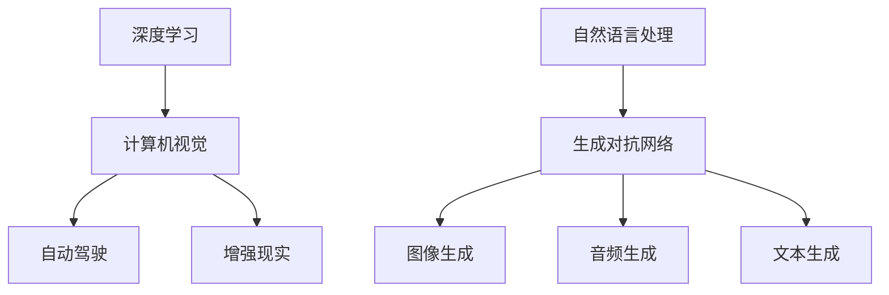

                 

## 1. 背景介绍

Andrej Karpathy 是一位人工智能领域的前沿专家，以其在计算机视觉和深度学习领域的重要贡献而闻名。在本文中，我们将探讨人工智能的未来发展前景，并深入探讨 Andrej Karpathy 的观点和贡献。

## 2. 核心概念与联系

### 2.1 核心概念概述

为了更好地理解人工智能的未来发展前景，我们需要理解以下核心概念：

- **深度学习**：一种模拟人脑神经网络的机器学习方法，用于训练模型进行复杂的预测和决策。
- **计算机视觉**：使计算机能够理解和处理图像、视频和其他视觉信息的技术。
- **自动驾驶**：利用深度学习技术实现车辆自动驾驶，旨在提高道路安全和交通效率。
- **增强现实**：将数字信息叠加到现实世界中，以增强用户的感知和交互体验。
- **自然语言处理**：使计算机能够理解、处理和生成人类语言的技术。
- **生成对抗网络**：一种训练模型，用于生成高质量、逼真的图像、音频或文本等。

这些核心概念共同构成了人工智能技术的基石，推动了其在各个领域的应用和进步。

### 2.2 核心概念原理和架构的 Mermaid 流程图



## 3. 核心算法原理 & 具体操作步骤

### 3.1 算法原理概述

人工智能的未来发展前景主要依赖于以下几个方面的技术进步：

- **深度学习的不断突破**：通过增加网络的深度和宽度，以及更高效的优化算法，深度学习模型可以处理更复杂、更大规模的数据。
- **计算机视觉的提升**：通过对更高级别的视觉任务，如语义分割、实例分割和姿态估计算法的优化，计算机视觉技术将能够更好地理解和解释图像内容。
- **自动驾驶的普及**：随着高精度地图和传感器技术的发展，自动驾驶技术将在安全性、可靠性和普及率上实现重大突破。
- **增强现实的革新**：通过更先进的光学系统和虚拟现实技术，增强现实将能够提供更加沉浸和自然的交互体验。
- **自然语言处理的应用扩展**：通过语言模型和预训练技术，自然语言处理将能够更好地理解和生成自然语言，推动智能问答系统、智能写作和翻译等领域的发展。
- **生成对抗网络的创新**：通过生成模型和判别模型的协同优化，生成对抗网络将能够生成更加逼真和多样化的图像、音频和文本内容。

### 3.2 算法步骤详解

下面是实现人工智能未来发展前景的关键步骤：

1. **数据收集与处理**：收集大量高质量的数据，并进行清洗、标注和归一化，以供后续训练使用。
2. **模型设计与训练**：设计并训练深度学习模型，使用高效的优化算法和正则化技术，以提高模型的泛化能力和鲁棒性。
3. **模型评估与优化**：通过交叉验证和A/B测试等方法，评估模型的性能，并根据反馈进行调整和优化。
4. **应用部署与迭代**：将模型部署到实际应用场景中，并根据用户反馈进行持续迭代和改进。
5. **伦理与法律合规**：确保模型的应用符合伦理和法律要求，避免潜在的风险和滥用。

### 3.3 算法优缺点

深度学习和人工智能技术的优点包括：

- **高效处理大数据**：能够处理大规模和复杂的数据，发现数据中的规律和模式。
- **自动化**：减少人工干预，提高工作效率和精度。
- **创新应用**：推动许多新兴应用领域的创新，如自动驾驶、增强现实和智能写作等。

然而，这些技术也存在一些缺点：

- **数据需求高**：需要大量的标注数据进行训练，数据收集和标注成本高。
- **模型复杂**：模型结构和参数数量庞大，导致计算和存储成本高。
- **可解释性差**：深度学习模型通常被视为“黑盒”，难以解释其决策过程。
- **安全性问题**：模型可能存在偏见、误导性和滥用风险。

### 3.4 算法应用领域

人工智能技术在以下领域的应用前景广阔：

- **医疗**：利用深度学习进行疾病诊断、医疗影像分析和药物研发。
- **金融**：使用自然语言处理进行金融数据分析、智能投顾和风险控制。
- **交通**：推动自动驾驶和智能交通系统的普及，提高交通安全和效率。
- **教育**：通过智能教学和个性化学习，提升教育质量和公平性。
- **制造**：实现智能制造和机器人自动化，提高生产效率和质量。
- **能源**：利用计算机视觉进行能源消耗监测和优化，推动绿色能源发展。

## 4. 数学模型和公式 & 详细讲解

### 4.1 数学模型构建

人工智能技术的基础是数学模型，其中深度学习和计算机视觉常用的数学模型包括：

- **卷积神经网络(CNN)**：用于图像处理和计算机视觉任务，通过卷积层和池化层提取特征。
- **循环神经网络(RNN)**：用于时间序列数据处理和自然语言处理任务，通过循环层捕捉序列依赖。
- **生成对抗网络(GAN)**：用于生成逼真的图像、音频和文本，通过生成器和判别器的协同优化。
- **自编码器(AE)**：用于数据压缩和降维，通过重构误差训练生成模型。

### 4.2 公式推导过程

以卷积神经网络为例，其基本结构包括卷积层、池化层和全连接层。

卷积层的公式为：

$$
C_{i,j} = \sum_{k=1}^{K} W_{k} * F_{i,j,k}
$$

其中 $W_{k}$ 为卷积核，$F_{i,j,k}$ 为输入特征图，$C_{i,j}$ 为输出特征图。

池化层的公式为：

$$
C'_{i,j} = \sum_{k=1}^{K} W_{k} * F_{i,j,k}
$$

其中 $W_{k}$ 为池化核，$F_{i,j,k}$ 为输入特征图，$C'_{i,j}$ 为输出特征图。

全连接层的公式为：

$$
y = \sum_{i=1}^{n} w_i x_i + b
$$

其中 $w_i$ 为权重，$x_i$ 为输入，$b$ 为偏置，$y$ 为输出。

### 4.3 案例分析与讲解

以图像分类任务为例，使用卷积神经网络进行训练和推理。

首先，将图像数据进行预处理，包括归一化和数据增强。然后，使用卷积层和池化层提取特征，并将特征图输入到全连接层进行分类。最后，使用softmax函数进行输出，得到分类结果。

## 5. 项目实践：代码实例和详细解释说明

### 5.1 开发环境搭建

以下是使用PyTorch进行卷积神经网络训练的开发环境配置：

1. 安装Anaconda：从官网下载并安装Anaconda。
2. 创建并激活虚拟环境：
```bash
conda create -n pytorch-env python=3.8 
conda activate pytorch-env
```
3. 安装PyTorch：根据CUDA版本，从官网获取对应的安装命令。例如：
```bash
conda install pytorch torchvision torchaudio cudatoolkit=11.1 -c pytorch -c conda-forge
```
4. 安装TensorBoard：用于可视化模型训练过程。
5. 安装NVIDIA-Docker：用于运行GPU容器。

完成上述步骤后，即可在`pytorch-env`环境中开始项目实践。

### 5.2 源代码详细实现

以下是使用PyTorch进行图像分类任务的代码实现：

```python
import torch
import torch.nn as nn
import torch.optim as optim
from torch.utils.data import DataLoader, Dataset
import torchvision.transforms as transforms
from torchvision.datasets import CIFAR10

class CIFAR10Dataset(Dataset):
    def __init__(self, root, transform=None):
        self.transform = transform
        self.trainset = CIFAR10(root, train=True, download=True, transform=transform)
        self.testset = CIFAR10(root, train=False, download=True, transform=transform)

    def __len__(self):
        return len(self.trainset)

    def __getitem__(self, idx):
        train_sample, train_target = self.trainset[idx]
        test_sample, test_target = self.testset[idx]
        if self.transform:
            train_sample = self.transform(train_sample)
            test_sample = self.transform(test_sample)
        return train_sample, train_target, test_sample, test_target

# 定义卷积神经网络
class CNN(nn.Module):
    def __init__(self):
        super(CNN, self).__init__()
        self.conv1 = nn.Conv2d(3, 32, kernel_size=3, stride=1, padding=1)
        self.pool1 = nn.MaxPool2d(kernel_size=2, stride=2)
        self.conv2 = nn.Conv2d(32, 64, kernel_size=3, stride=1, padding=1)
        self.pool2 = nn.MaxPool2d(kernel_size=2, stride=2)
        self.fc1 = nn.Linear(64 * 8 * 8, 128)
        self.fc2 = nn.Linear(128, 10)

    def forward(self, x):
        x = self.pool1(torch.relu(self.conv1(x)))
        x = self.pool2(torch.relu(self.conv2(x)))
        x = x.view(-1, 64 * 8 * 8)
        x = torch.relu(self.fc1(x))
        x = self.fc2(x)
        return x

# 加载数据集并进行数据增强
transform_train = transforms.Compose([
    transforms.RandomCrop(32, padding=4),
    transforms.RandomHorizontalFlip(),
    transforms.ToTensor(),
    transforms.Normalize((0.4914, 0.4822, 0.4465), (0.2023, 0.1994, 0.2010))
])
transform_test = transforms.Compose([
    transforms.ToTensor(),
    transforms.Normalize((0.4914, 0.4822, 0.4465), (0.2023, 0.1994, 0.2010))
])
train_dataset = CIFAR10Dataset(root='./data', transform=transform_train)
test_dataset = CIFAR10Dataset(root='./data', transform=transform_test)
train_loader = DataLoader(train_dataset, batch_size=64, shuffle=True, num_workers=4)
test_loader = DataLoader(test_dataset, batch_size=64, shuffle=False, num_workers=4)

# 定义模型、优化器和损失函数
model = CNN()
optimizer = optim.Adam(model.parameters(), lr=0.001)
criterion = nn.CrossEntropyLoss()
device = torch.device('cuda' if torch.cuda.is_available() else 'cpu')
model.to(device)

# 训练模型
def train(epoch):
    model.train()
    train_loss = 0.0
    train_correct = 0
    for batch_idx, (inputs, targets) in enumerate(train_loader):
        inputs, targets = inputs.to(device), targets.to(device)
        optimizer.zero_grad()
        outputs = model(inputs)
        loss = criterion(outputs, targets)
        loss.backward()
        optimizer.step()
        train_loss += loss.item()
        _, predicted = outputs.max(1)
        train_correct += predicted.eq(targets).sum().item()

# 测试模型
def test(epoch):
    model.eval()
    test_loss = 0.0
    test_correct = 0
    with torch.no_grad():
        for batch_idx, (inputs, targets) in enumerate(test_loader):
            inputs, targets = inputs.to(device), targets.to(device)
            outputs = model(inputs)
            loss = criterion(outputs, targets)
            test_loss += loss.item()
            _, predicted = outputs.max(1)
            test_correct += predicted.eq(targets).sum().item()

# 训练和测试模型
for epoch in range(10):
    train(epoch)
    test(epoch)

print('Test Accuracy of the model on the 10000 test images: {} %'.format(100 * test_correct / len(test_loader.dataset)))
```

### 5.3 代码解读与分析

上述代码实现了使用卷积神经网络对CIFAR-10数据集进行训练和测试。以下是关键代码的解读：

1. 定义数据集和数据增强：使用CIFAR-10数据集，并使用随机裁剪、水平翻转等数据增强技术。
2. 定义卷积神经网络：包括卷积层、池化层和全连接层。
3. 加载数据集并进行模型训练：使用Adam优化器和交叉熵损失函数，在GPU上进行训练和测试。
4. 计算测试集上的准确率：使用测试集进行推理，计算准确率。

## 6. 实际应用场景

### 6.1 医疗

在医疗领域，深度学习被广泛应用于疾病诊断、医疗影像分析和药物研发。例如，使用卷积神经网络对医学影像进行分类和分割，有助于早期发现和诊断癌症、心脏病等疾病。

### 6.2 金融

在金融领域，自然语言处理技术被用于金融数据分析、智能投顾和风险控制。例如，使用循环神经网络进行情感分析，预测市场趋势和投资回报。

### 6.3 交通

在交通领域，自动驾驶和智能交通系统正在快速普及。例如，使用卷积神经网络进行道路标识别和行人检测，提高自动驾驶车的安全性。

### 6.4 教育

在教育领域，智能教学和个性化学习正在逐渐普及。例如，使用生成对抗网络生成模拟学生互动的教学内容，提升教育质量。

## 7. 工具和资源推荐

### 7.1 学习资源推荐

为了帮助开发者系统掌握深度学习和人工智能技术，以下是一些优质的学习资源：

1. **Deep Learning Specialization**（斯坦福大学）：由Andrew Ng教授主讲，系统介绍深度学习的基本概念和实践。
2. **CS231n：Convolutional Neural Networks for Visual Recognition**（斯坦福大学）：涵盖计算机视觉的多个方面，包括图像分类、目标检测等。
3. **Fast.ai**：提供实用的深度学习课程和教程，重点介绍PyTorch的快速实现。
4. **Kaggle**：一个数据科学竞赛平台，提供丰富的数据集和开源项目，可以学习和实践各种深度学习应用。
5. **GitHub**：一个代码托管平台，可以找到各种深度学习模型的代码实现和教程。

### 7.2 开发工具推荐

以下是一些常用的深度学习和人工智能开发工具：

1. **PyTorch**：一个基于Python的深度学习框架，提供灵活的动态计算图。
2. **TensorFlow**：由Google开发的深度学习框架，支持分布式计算和高效的GPU加速。
3. **Jupyter Notebook**：一个交互式的开发环境，支持Python、R等语言，用于快速迭代实验和分享代码。
4. **TensorBoard**：一个可视化工具，用于监控模型训练过程，分析模型性能。
5. **NVIDIA-Docker**：一个GPU容器管理工具，方便在云端和本地进行深度学习实验。

### 7.3 相关论文推荐

以下是一些深度学习和人工智能领域的经典论文：

1. **ImageNet Classification with Deep Convolutional Neural Networks**（AlexNet）：由Alex Krizhevsky等人提出，是深度学习领域的里程碑性工作。
2. **RNNs Applied to Printed Text**：由Yoshua Bengio等人提出，将循环神经网络应用于手写文本识别。
3. **Generative Adversarial Nets**：由Ian Goodfellow等人提出，介绍生成对抗网络的基本原理和实现方法。
4. **Convolutional Deep Belief Networks for Scalable Unsupervised Learning of Hierarchical Representations**：由Hinton等人提出，结合卷积神经网络和深度信念网络，进行无监督学习。
5. **Attention Is All You Need**：由Vaswani等人提出，介绍Transformer模型，推动了自然语言处理技术的发展。

## 8. 总结：未来发展趋势与挑战

### 8.1 研究成果总结

人工智能技术的进步离不开深度学习、计算机视觉、自然语言处理等领域的持续创新。Andrej Karpathy作为人工智能领域的前沿专家，提出了许多重要的理论和方法，推动了深度学习和大数据技术的发展。

### 8.2 未来发展趋势

未来人工智能技术的发展趋势包括：

1. **深度学习的不断突破**：随着硬件计算能力的提升，深度学习模型的规模和复杂度将不断增加，推动更多新任务的解决。
2. **计算机视觉的创新**：通过更高级别的视觉任务，如语义分割、实例分割和姿态估计算法，计算机视觉技术将能够更好地理解和解释图像内容。
3. **自动驾驶的普及**：随着高精度地图和传感器技术的发展，自动驾驶技术将在安全性、可靠性和普及率上实现重大突破。
4. **增强现实的革新**：通过更先进的光学系统和虚拟现实技术，增强现实将能够提供更加沉浸和自然的交互体验。
5. **自然语言处理的应用扩展**：通过语言模型和预训练技术，自然语言处理将能够更好地理解和生成自然语言，推动智能问答系统、智能写作和翻译等领域的发展。
6. **生成对抗网络的创新**：通过生成模型和判别模型的协同优化，生成对抗网络将能够生成更加逼真和多样化的图像、音频和文本内容。

### 8.3 面临的挑战

尽管人工智能技术在许多领域取得了显著进展，但仍面临一些挑战：

1. **数据需求高**：需要大量的标注数据进行训练，数据收集和标注成本高。
2. **模型复杂**：模型结构和参数数量庞大，导致计算和存储成本高。
3. **可解释性差**：深度学习模型通常被视为“黑盒”，难以解释其决策过程。
4. **安全性问题**：模型可能存在偏见、误导性和滥用风险。
5. **伦理和法律合规**：确保模型的应用符合伦理和法律要求，避免潜在的风险和滥用。

### 8.4 研究展望

未来研究将重点解决以下几个问题：

1. **数据高效性**：探索如何减少对标注数据的依赖，利用自监督学习、主动学习等方法。
2. **模型高效性**：开发更加参数高效和计算高效的微调方法，提高模型部署效率。
3. **模型鲁棒性**：提高模型的泛化能力和鲁棒性，增强模型在不同场景下的适应性。
4. **模型可解释性**：提升模型的可解释性和可审计性，帮助用户理解和信任模型输出。
5. **模型安全性**：通过引入伦理和法律导向的评估指标，过滤和惩罚有害输出，确保模型安全性。
6. **模型集成与融合**：结合因果分析方法、知识表示和强化学习等技术，提升模型的综合能力。

## 9. 附录：常见问题与解答

**Q1：深度学习在医疗领域的应用前景如何？**

A: 深度学习在医疗领域有广泛的应用前景。例如，使用卷积神经网络对医学影像进行分类和分割，有助于早期发现和诊断癌症、心脏病等疾病。此外，深度学习还可以用于药物研发，加速新药的发现和测试。

**Q2：计算机视觉技术在自动驾驶中的作用是什么？**

A: 计算机视觉技术在自动驾驶中扮演着重要角色。例如，通过卷积神经网络进行道路标识别和行人检测，可以提高自动驾驶车的安全性。计算机视觉技术还可以用于环境感知、路径规划和行为决策等方面，推动自动驾驶技术的发展。

**Q3：自然语言处理技术在金融领域的应用有哪些？**

A: 自然语言处理技术在金融领域有广泛的应用。例如，使用循环神经网络进行情感分析，预测市场趋势和投资回报。自然语言处理技术还可以用于智能投顾、风险控制和欺诈检测等方面，提升金融机构的决策效率和风险管理能力。

**Q4：增强现实技术在教育中的作用是什么？**

A: 增强现实技术在教育中可以提高学习效果和互动体验。例如，通过AR技术，学生可以更加直观地理解复杂概念，如化学分子结构和历史事件。增强现实技术还可以用于虚拟实验和游戏化学习，提升学生的学习兴趣和参与度。

---

作者：禅与计算机程序设计艺术 / Zen and the Art of Computer Programming

