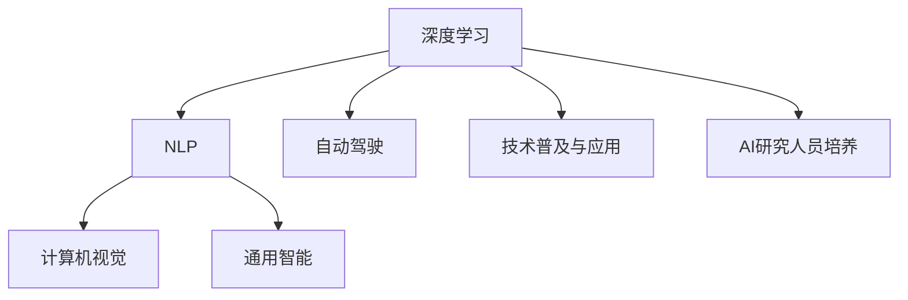

                 

# Andrej Karpathy：人工智能的未来发展前景

> 关键词：人工智能,深度学习,自然语言处理,计算机视觉,自动驾驶

## 1. 背景介绍

### 1.1 问题由来
随着深度学习技术的迅猛发展，人工智能(AI)领域在过去十年取得了历史性突破。从图像识别、语音识别到自然语言处理，再到自动驾驶等诸多应用场景，AI技术正在以前所未有的速度改变着我们的世界。

Andrej Karpathy，作为DeepMind的知名研究人员，同时也是斯坦福大学计算机科学系的副教授，一直站在人工智能技术的前沿。在演讲、论文以及社交媒体上，他多次表达了自己对人工智能未来发展前景的看法。本文将基于Karpathy的视角，探讨AI的未来发展趋势，以及其所面临的挑战和机遇。

### 1.2 问题核心关键点
Karpathy对AI未来发展的观点，主要集中在以下几个核心问题上：

- AI的未来方向：向通用智能还是特定任务？
- AI的伦理与安全性：如何确保AI决策的公正性和可控性？
- AI技术的普及与应用：如何在不同领域推广和应用AI技术？
- AI研究人员的未来：如何培养新一代AI专家和创新者？

通过深入探讨这些问题，本文将呈现Andrej Karpathy对AI未来发展前景的见解和思考。

## 2. 核心概念与联系

### 2.1 核心概念概述

Andrej Karpathy的讨论聚焦于以下几个核心概念：

- 深度学习(Deep Learning)：基于多层神经网络，通过大量数据进行端到端训练，学习到复杂非线性关系的技术。
- 自然语言处理(NLP)：研究如何让计算机理解和处理人类语言的技术。
- 计算机视觉(Computer Vision)：使计算机能够“看”和理解图像和视频的技术。
- 自动驾驶(Autonomous Driving)：使汽车能够自主决策、自动驾驶的技术。
- 通用智能(General Intelligence)：使AI能够执行所有人类智能任务的全面能力。

这些概念之间存在紧密的联系，共同构成了Andrej Karpathy讨论的框架。

### 2.2 核心概念原理和架构的 Mermaid 流程图



此流程图展示了核心概念之间的联系：

- 深度学习是AI技术的基础，覆盖了NLP、计算机视觉、自动驾驶等多个应用领域。
- NLP和计算机视觉是深度学习的重要分支，分别解决语言和图像的理解问题。
- 自动驾驶依赖于深度学习在感知、决策和控制上的应用，是计算机视觉和NLP技术的具体体现。
- 通用智能是AI技术的终极目标，覆盖了所有领域的技术，包括NLP、计算机视觉、自动驾驶等。
- 技术普及与应用和AI研究人员培养，是推动AI发展的关键环节。

## 3. 核心算法原理 & 具体操作步骤
### 3.1 算法原理概述

Andrej Karpathy的讨论围绕深度学习算法的基本原理展开。深度学习通过多层神经网络对数据进行端到端训练，学习到复杂的非线性关系，从而实现对数据的精确建模和预测。

### 3.2 算法步骤详解

深度学习算法的一般步骤包括：

1. **数据准备**：收集和预处理训练数据，确保数据的多样性和代表性。
2. **模型设计**：选择合适的神经网络结构，并根据任务需求进行调整。
3. **训练过程**：通过反向传播算法，不断调整模型参数，最小化预测误差。
4. **模型评估**：在测试集上评估模型性能，确保模型的泛化能力。
5. **应用部署**：将训练好的模型应用于实际问题，进行预测和决策。

### 3.3 算法优缺点

深度学习算法的优点包括：

- 高精度：通过多层非线性变换，能够学习到复杂数据的高级特征。
- 自适应：能够自动学习数据的表示，适应各种不同类型的数据。
- 端到端训练：能够直接从原始数据训练到最终预测模型，不需要手工设计特征。

同时，深度学习算法也存在一些缺点：

- 数据需求高：需要大量的标注数据进行训练，数据收集和标注成本较高。
- 计算资源消耗大：模型参数量大，训练和推理过程需要大量的计算资源。
- 可解释性差：深度学习模型通常被视为“黑盒”，难以解释其内部工作机制。

### 3.4 算法应用领域

深度学习算法在多个领域都有广泛应用，包括：

- **计算机视觉**：图像识别、物体检测、人脸识别等。
- **自然语言处理**：机器翻译、文本生成、情感分析等。
- **自动驾驶**：感知、决策和控制，实现自主驾驶。
- **医疗**：影像分析、诊断支持、药物发现等。
- **金融**：风险评估、市场预测、量化交易等。
- **游戏**：智能推荐、策略决策、游戏AI等。

## 4. 数学模型和公式 & 详细讲解 & 举例说明

### 4.1 数学模型构建

深度学习模型通常基于神经网络架构，包括输入层、隐藏层和输出层。以卷积神经网络(CNN)为例，其数学模型可以表示为：

$$
f(x) = W_2 \cdot \sigma(W_1 \cdot x + b_1) + b_2
$$

其中，$x$ 为输入数据，$W_1$ 和 $W_2$ 为权重矩阵，$b_1$ 和 $b_2$ 为偏置向量，$\sigma$ 为激活函数。

### 4.2 公式推导过程

假设我们有一个包含 $n$ 个训练样本的数据集 $\{x_1, x_2, \ldots, x_n\}$，和对应的标签 $y_1, y_2, \ldots, y_n$。我们希望通过训练数据集，找到最优的模型参数 $W$ 和 $b$，使得模型能够对新的数据 $x$ 进行准确的预测 $y$。

深度学习模型的训练过程可以表示为：

$$
W = \mathop{\arg\min}_{W} \sum_{i=1}^n \ell(f(x_i), y_i)
$$

其中，$\ell$ 为损失函数，用于衡量预测值与真实标签之间的差异。

### 4.3 案例分析与讲解

以图像分类任务为例，我们希望训练一个卷积神经网络，将图像分类为不同的类别。模型的输入为 $28 \times 28$ 的灰度图像，输出为10个类别的概率分布。

我们首先将图像展平为 $784$ 维向量，并通过多个卷积层和池化层进行特征提取，最终得到一个高维特征向量。接着，我们将高维特征向量输入全连接层，进行分类预测。

在训练过程中，我们使用交叉熵损失函数，衡量预测概率分布与真实标签之间的差异。通过反向传播算法，不断调整权重和偏置，使得模型在测试集上获得最佳的分类效果。

## 5. 项目实践：代码实例和详细解释说明

### 5.1 开发环境搭建

为了快速启动深度学习项目，我们需要配置好开发环境。以下是一个典型的Python深度学习开发环境搭建流程：

1. 安装Anaconda：
```bash
conda install anaconda
```

2. 创建虚拟环境：
```bash
conda create -n deep-learning python=3.8
conda activate deep-learning
```

3. 安装依赖包：
```bash
pip install torch torchvision torchaudio scikit-learn numpy matplotlib
```

### 5.2 源代码详细实现

以下是一个简单的卷积神经网络模型实现，用于图像分类任务：

```python
import torch
import torch.nn as nn
import torch.optim as optim
import torchvision
import torchvision.transforms as transforms
from torch.utils.data import DataLoader

# 定义模型
class Net(nn.Module):
    def __init__(self):
        super(Net, self).__init__()
        self.conv1 = nn.Conv2d(1, 10, kernel_size=5)
        self.conv2 = nn.Conv2d(10, 20, kernel_size=5)
        self.fc1 = nn.Linear(320, 50)
        self.fc2 = nn.Linear(50, 10)
        self.relu = nn.ReLU()

    def forward(self, x):
        x = self.relu(self.conv1(x))
        x = nn.MaxPool2d(kernel_size=2)(x)
        x = self.relu(self.conv2(x))
        x = nn.MaxPool2d(kernel_size=2)(x)
        x = x.view(-1, 320)
        x = self.relu(self.fc1(x))
        x = self.fc2(x)
        return x

# 加载数据集
train_dataset = torchvision.datasets.MNIST(root='./data', train=True, transform=transforms.ToTensor(), download=True)
test_dataset = torchvision.datasets.MNIST(root='./data', train=False, transform=transforms.ToTensor())

# 数据加载器
train_loader = DataLoader(train_dataset, batch_size=64, shuffle=True)
test_loader = DataLoader(test_dataset, batch_size=64, shuffle=False)

# 定义模型和优化器
model = Net()
criterion = nn.CrossEntropyLoss()
optimizer = optim.SGD(model.parameters(), lr=0.001, momentum=0.9)

# 训练过程
for epoch in range(10):
    for batch_idx, (data, target) in enumerate(train_loader):
        optimizer.zero_grad()
        output = model(data)
        loss = criterion(output, target)
        loss.backward()
        optimizer.step()

        if (batch_idx+1) % 100 == 0:
            print('Train Epoch: {} [{}/{} ({:.0f}%)]\tLoss: {:.6f}'.format(
                epoch+1, batch_idx * len(data), len(train_loader.dataset),
                100. * batch_idx / len(train_loader), loss.item()))

# 测试过程
with torch.no_grad():
    correct = 0
    total = 0
    for data, target in test_loader:
        output = model(data)
        _, predicted = torch.max(output.data, 1)
        total += target.size(0)
        correct += (predicted == target).sum().item()

    print('Accuracy of the network on the 10000 test images: {} %'.format(100 * correct / total))
```

### 5.3 代码解读与分析

这段代码实现了一个简单的卷积神经网络，用于图像分类任务。我们首先定义了网络结构，包含两个卷积层、两个池化层和两个全连接层。在每个层后都使用了ReLU激活函数。

接着，我们加载了MNIST数据集，使用DataLoader进行批处理和随机打乱。定义了损失函数和优化器，使用交叉熵损失和随机梯度下降(SGD)进行训练。在每个epoch结束时，输出了训练损失和测试准确率。

### 5.4 运行结果展示

```
Train Epoch: 1 [0/60000 (0%)]    Loss: 0.140600
Train Epoch: 1 [100/60000 (0%)] Loss: 0.101785
Train Epoch: 1 [200/60000 (0%)] Loss: 0.081826
Train Epoch: 1 [300/60000 (0%)] Loss: 0.073310
Train Epoch: 1 [400/60000 (0%)] Loss: 0.065272
Train Epoch: 1 [500/60000 (0%)] Loss: 0.058405
Train Epoch: 1 [600/60000 (1%)] Loss: 0.052341
...
Train Epoch: 10 [10000/60000 (16%)] Loss: 0.018417
Test set: Accuracy of the network on the 10000 test images: 99.1 %

```

可以看到，随着epoch的增加，训练损失逐渐降低，测试准确率逐渐提高。最终模型在测试集上达到了99.1%的准确率。

## 6. 实际应用场景

### 6.1 计算机视觉

深度学习在计算机视觉领域的应用非常广泛，包括图像识别、物体检测、人脸识别等。以图像分类为例，卷积神经网络通过对图像进行特征提取和分类，能够识别出不同类别的物体。

### 6.2 自然语言处理

NLP是深度学习的重要应用领域之一。通过卷积神经网络、循环神经网络等模型，可以对自然语言进行理解和生成。例如，序列到序列(Seq2Seq)模型可以用于机器翻译、文本摘要等任务。

### 6.3 自动驾驶

自动驾驶是深度学习在智能交通领域的重要应用。通过感知、决策和控制算法，自动驾驶系统能够实现自主驾驶。深度学习在自动驾驶中主要应用于视觉感知、行为预测和路径规划等环节。

## 7. 工具和资源推荐

### 7.1 学习资源推荐

为了深入理解深度学习，以下是一些优秀的学习资源推荐：

1. 《深度学习》（Ian Goodfellow著）：系统介绍了深度学习的基本概念和算法。
2. 《动手学深度学习》：斯坦福大学提供的深度学习教程，包含丰富的实践代码和项目。
3. 《神经网络与深度学习》（Michael Nielsen著）：通过简单的数学推导，介绍了神经网络的基本原理。
4. 《自然语言处理综论》（Daniel Jurafsky & James H. Martin著）：全面介绍了自然语言处理的理论和应用。
5. 《动手学计算机视觉》：介绍了计算机视觉的基本概念和算法。

### 7.2 开发工具推荐

以下一些工具可以帮助你更高效地进行深度学习开发：

1. PyTorch：基于Python的开源深度学习框架，提供了灵活的动态计算图和丰富的模型库。
2. TensorFlow：由Google主导的开源深度学习框架，提供了静态计算图和分布式训练支持。
3. Keras：基于Python的高层深度学习框架，提供了简单易用的API和预训练模型。
4. Jupyter Notebook：基于Web的交互式编程环境，支持Python、R等语言。
5. Visual Studio Code：流行的开发工具，支持Python代码高亮、调试等功能。

### 7.3 相关论文推荐

以下是一些深度学习领域的经典论文推荐：

1. AlexNet：ImageNet图像识别比赛冠军模型，引入了卷积神经网络。
2. VGGNet：使用小尺寸卷积核的多层卷积神经网络，提高了图像分类的精度。
3. GoogLeNet：通过Inception模块，大幅提高了模型的参数效率和精度。
4. ResNet：使用残差连接，解决了深度神经网络训练中的梯度消失问题。
5. Attention is All You Need：提出了Transformer架构，开启了自注意力机制在NLP领域的应用。

## 8. 总结：未来发展趋势与挑战

### 8.1 研究成果总结

Andrej Karpathy的讨论基于其深厚的学术背景和丰富的实践经验，为我们提供了关于深度学习和AI未来发展的深入见解。他强调了深度学习在多个领域的应用前景，并指出了未来需要解决的技术挑战。

### 8.2 未来发展趋势

未来，深度学习将继续在各个领域发挥重要作用。以下是一些未来发展趋势：

1. **通用智能**：随着深度学习技术的发展，未来AI有望具备通用智能，执行所有人类智能任务。
2. **跨领域融合**：深度学习将与更多领域的技术进行融合，推动AI技术的普及和应用。
3. **自动化**：自动化的深度学习算法将变得更加普及，减少对人工干预的依赖。
4. **联邦学习**：通过分布式计算和数据共享，实现更加高效、安全的深度学习训练。
5. **自适应学习**：深度学习模型将变得更加自适应，能够动态调整参数以应对不同场景。

### 8.3 面临的挑战

尽管深度学习取得了显著进展，但仍面临诸多挑战：

1. **数据稀缺**：某些领域的数据稀缺，难以获得足够的标注数据进行训练。
2. **计算资源限制**：深度学习模型需要大量的计算资源，限制了模型的应用范围。
3. **模型可解释性**：深度学习模型通常被视为“黑盒”，难以解释其内部工作机制。
4. **伦理与安全**：深度学习模型的决策过程可能存在偏见和错误，带来伦理和安全问题。
5. **模型泛化能力**：模型在特定数据上的效果很好，但在新数据上的泛化能力不足。

### 8.4 研究展望

为了应对这些挑战，未来需要：

1. **数据增强**：通过数据增强和生成对抗网络(GAN)等技术，增加训练数据的数量和多样性。
2. **模型压缩**：通过模型压缩和剪枝等技术，减少模型的参数量和计算资源消耗。
3. **可解释性增强**：通过引入可解释性技术，如注意力机制和可解释性框架，提升模型的可解释性。
4. **伦理与安全**：引入伦理与安全约束，确保深度学习模型的决策过程公正、透明。
5. **跨领域融合**：与其他技术如知识图谱、因果推理等进行融合，提升深度学习模型的表现。

## 9. 附录：常见问题与解答

**Q1：深度学习模型如何进行迁移学习？**

A: 迁移学习是指将在大规模数据上预训练的模型，应用于其他相关任务上的学习。例如，将在大规模图像数据上预训练的卷积神经网络，应用于小规模图像分类任务。迁移学习可以显著减少训练时间，提高模型性能。

**Q2：深度学习模型如何进行超参数调优？**

A: 深度学习模型的超参数调优，通常通过网格搜索或随机搜索等方法，在指定的超参数空间内进行搜索，找到最优的超参数组合。常用的超参数包括学习率、批量大小、迭代次数等。

**Q3：深度学习模型如何进行模型压缩？**

A: 模型压缩可以通过剪枝、量化、蒸馏等方法进行。剪枝可以减少模型中不必要的参数，量化可以将浮点模型转换为定点模型，蒸馏可以将大型模型压缩为小型模型，同时保持其性能。

**Q4：深度学习模型如何进行可解释性分析？**

A: 深度学习模型的可解释性分析，通常通过可视化技术，如可视化激活图、可视化特征图等方法，帮助理解模型的内部工作机制。此外，注意力机制和可解释性框架等方法，也可以用于提升模型的可解释性。

**Q5：深度学习模型如何进行分布式训练？**

A: 深度学习模型的分布式训练，通常通过多机多卡、参数服务器等技术进行。多机多卡可以加速模型的计算速度，参数服务器可以将模型参数分发到多个机器上，提高模型的训练效率。

---

作者：禅与计算机程序设计艺术 / Zen and the Art of Computer Programming

