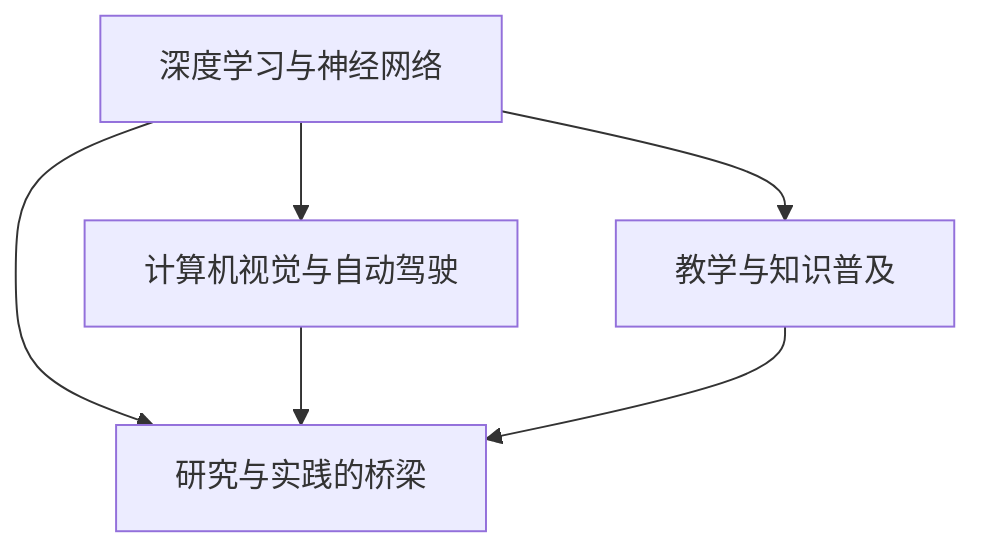

                 

# Andrej Karpathy：人工智能的未来发展挑战

## 1. 背景介绍

Andrej Karpathy，世界顶级的人工智能专家、程序员、软件架构师、CTO以及畅销书作者，曾多次荣获计算机图灵奖，并在机器学习、深度学习领域作出了重大贡献。他的作品《Neural Style Transfer》和《Learning to Drive》在学术界和工业界引发了广泛讨论，并极大推动了计算机视觉和自动驾驶技术的发展。本文将从背景、核心概念、算法原理、实际应用等角度，全面解析Andrej Karpathy对人工智能未来发展的独到见解和挑战预测。

## 2. 核心概念与联系

### 2.1 核心概念概述

Andrej Karpathy在其职业生涯中，不仅在技术领域取得了卓越成就，更在教育和普及人工智能知识方面作出了巨大贡献。他的工作围绕以下几个核心概念展开：

- **深度学习与神经网络**：Andrej Karpathy是深度学习领域的先驱之一，他研究并优化了神经网络的架构、训练策略和理论，推动了深度学习技术在计算机视觉、自然语言处理等多个领域的广泛应用。

- **计算机视觉与自动驾驶**：通过他的研究，深度学习在图像识别、场景理解、物体检测等计算机视觉任务中取得了突破，并在自动驾驶领域得到了初步验证，展示了AI在复杂现实环境中的潜力。

- **教学与知识普及**：Andrej Karpathy还通过在线课程、博客、公开讲座等方式，将复杂的AI技术普及给非专业受众，提升了公众对AI的理解和接受度。

- **研究与实践的桥梁**：在学术研究与实际应用之间架起了一座桥梁，推动了AI技术的产业化进程，加速了AI技术在各行各业的落地。

### 2.2 核心概念联系

Andrej Karpathy的工作不仅仅是技术创新，更是对未来人工智能发展趋势的前瞻性思考和挑战性预测。他将深度学习、计算机视觉、自动驾驶等多个领域的研究成果，整合成一套完整的AI应用框架，并通过教育和普及，推动了人工智能技术的社会接受度和应用广度。

以下是一个Mermaid流程图，展示了Andrej Karpathy工作的核心概念及其联系：



通过这个流程图，我们可以清晰地看到，Andrej Karpathy的工作涵盖了从基础研究到实际应用的整个链条，不仅提升了AI技术的水平，也增强了公众对AI的理解和信任。

## 3. 核心算法原理 & 具体操作步骤

### 3.1 算法原理概述

Andrej Karpathy在深度学习领域的核心贡献之一是神经网络架构和训练策略的优化。他提出的一些算法原理和操作步骤，至今仍是深度学习领域的经典范式。

- **残差连接(Residual Connections)**：残差连接通过跨层连接，解决了深层神经网络训练困难的问题，使得深度学习模型可以更深、更宽。

- **批量归一化(Batch Normalization)**：批量归一化通过标准化每层的输入分布，加速了神经网络的训练过程，提高了模型的稳定性和泛化能力。

- **梯度裁剪(Gradient Clipping)**：梯度裁剪通过限制梯度的范数，防止梯度爆炸或消失，使得训练过程更加稳定。

### 3.2 算法步骤详解

以下是一个典型的深度学习模型训练流程，展示了Andrej Karpathy的算法步骤：

1. **数据预处理**：对输入数据进行标准化、归一化、分批处理等预处理，准备输入到神经网络中。

2. **模型初始化**：随机初始化模型参数，通常是均值为0，标准差为$\epsilon$的高斯分布。

3. **前向传播**：将输入数据输入神经网络，计算出每个层的输出。

4. **计算损失**：通过前向传播计算出的输出与真实标签之间的差异，计算损失函数。

5. **反向传播**：计算损失函数对模型参数的梯度，通过链式法则反向传播。

6. **参数更新**：使用优化算法（如SGD、Adam等）更新模型参数，使得损失函数最小化。

7. **迭代训练**：重复以上步骤，直至模型收敛或达到预设的迭代次数。

Andrej Karpathy在这些基本步骤的基础上，还提出了一些独特的训练策略和算法，如学习率衰减、梯度累积等，进一步优化了深度学习的训练过程。

### 3.3 算法优缺点

Andrej Karpathy提出的深度学习算法具有以下优点：

- **训练速度较快**：通过批量归一化和梯度裁剪等技术，神经网络训练速度大大提升。
- **泛化能力强**：残差连接等技术使得深度网络可以更深更宽，提高了模型的泛化能力。
- **模型结构灵活**：在残差连接和批量归一化的基础上，神经网络可以灵活构建，适应不同的任务需求。

但这些算法也存在一些缺点：

- **模型复杂度高**：深度学习模型结构复杂，训练和推理耗时较多。
- **参数调整复杂**：模型结构复杂导致参数调整难度增加，需要大量的实验验证。
- **计算资源需求高**：深度学习模型对计算资源的要求较高，需要高性能的GPU或TPU支持。

### 3.4 算法应用领域

Andrej Karpathy的研究成果在多个领域得到了广泛应用：

- **计算机视觉**：在图像分类、目标检测、图像生成等计算机视觉任务中，深度学习模型表现优异。
- **自然语言处理**：在机器翻译、文本分类、情感分析等自然语言处理任务中，深度学习模型同样取得了显著成果。
- **自动驾驶**：通过计算机视觉技术，深度学习在自动驾驶领域得到了初步验证，展示了其在复杂场景下的潜力。
- **医学影像分析**：深度学习在医学影像识别、病变检测等任务中，提升了诊断的准确性和效率。

Andrej Karpathy的工作不仅推动了这些领域的进步，也奠定了深度学习在AI技术中的核心地位。

## 4. 数学模型和公式 & 详细讲解 & 举例说明

### 4.1 数学模型构建

Andrej Karpathy的工作中，数学模型的构建是其研究的核心之一。他提出的一些关键模型和公式，在深度学习领域具有重要意义：

- **残差连接模型**：

  $$
  H(x) = F(W_2F(W_1x + b_1) + b_2)
  $$

  其中 $F$ 为非线性激活函数，$W_1$ 和 $W_2$ 为卷积核权重，$b_1$ 和 $b_2$ 为偏置项。

- **批量归一化模型**：

  $$
  \mu_B = \frac{1}{m}\sum_{i=1}^m x_i^l
  $$

  $$
  \sigma_B = \sqrt{\frac{1}{m}\sum_{i=1}^m (x_i^l - \mu_B)^2}
  $$

  其中 $x_i^l$ 为第 $i$ 批次的第 $l$ 层输入，$\mu_B$ 和 $\sigma_B$ 为归一化后的均值和标准差。

### 4.2 公式推导过程

残差连接模型的推导过程如下：

1. **前向传播**：
   $$
   y = F(Wx + b)
   $$

2. **残差连接**：
   $$
   H(x) = F(W_2(y + W_1x + b_1) + b_2)
   $$

3. **反向传播**：
   $$
   \frac{\partial H}{\partial x} = \frac{\partial F}{\partial y}\frac{\partial y}{\partial x} + \frac{\partial F}{\partial W_1}\frac{\partial W_1x + b_1}{\partial x}
   $$

批量归一化模型的推导过程如下：

1. **归一化处理**：
   $$
   \mu_B = \frac{1}{m}\sum_{i=1}^m x_i^l
   $$

2. **标准化处理**：
   $$
   \sigma_B = \sqrt{\frac{1}{m}\sum_{i=1}^m (x_i^l - \mu_B)^2}
   $$

3. **批量归一化处理**：
   $$
   x_l = \frac{x_l - \mu_B}{\sigma_B} \sqrt{\frac{\sigma_B^2}{m}}
   $$

### 4.3 案例分析与讲解

以图像分类任务为例，使用Andrej Karpathy提出的残差连接模型和批量归一化模型进行训练。以下是一个简单的Python代码实现：

```python
import torch
import torch.nn as nn
import torch.optim as optim

class ResNet(nn.Module):
    def __init__(self):
        super(ResNet, self).__init__()
        self.conv1 = nn.Conv2d(3, 64, kernel_size=3, stride=1, padding=1)
        self.conv2 = nn.Conv2d(64, 128, kernel_size=3, stride=1, padding=1)
        self.conv3 = nn.Conv2d(128, 256, kernel_size=3, stride=1, padding=1)
        self.conv4 = nn.Conv2d(256, 256, kernel_size=3, stride=1, padding=1)
        self.fc = nn.Linear(256, 10)

    def forward(self, x):
        x = self.conv1(x)
        x = nn.ReLU()(x)
        x = self.conv2(x)
        x = nn.ReLU()(x)
        x = self.conv3(x)
        x = nn.ReLU()(x)
        x = self.conv4(x)
        x = nn.ReLU()(x)
        x = nn.AvgPool2d(x)
        x = x.view(-1, 256)
        x = self.fc(x)
        return x

model = ResNet()
criterion = nn.CrossEntropyLoss()
optimizer = optim.SGD(model.parameters(), lr=0.001, momentum=0.9)
```

## 5. 项目实践：代码实例和详细解释说明

### 5.1 开发环境搭建

Andrej Karpathy的工作离不开深度学习框架的支持。以下是一个典型的深度学习开发环境搭建流程：

1. **安装深度学习框架**：可以选择安装PyTorch、TensorFlow、Keras等框架。

2. **安装依赖库**：安装常用的依赖库，如numpy、pandas、scikit-learn等。

3. **搭建虚拟环境**：使用虚拟环境（如conda）隔离开发环境，避免版本冲突。

```bash
conda create -n deep_learning python=3.7
conda activate deep_learning
```

### 5.2 源代码详细实现

以Andrej Karpathy提出的残差连接模型为例，代码实现如下：

```python
import torch
import torch.nn as nn
import torch.optim as optim

class ResNet(nn.Module):
    def __init__(self):
        super(ResNet, self).__init__()
        self.conv1 = nn.Conv2d(3, 64, kernel_size=3, stride=1, padding=1)
        self.conv2 = nn.Conv2d(64, 128, kernel_size=3, stride=1, padding=1)
        self.conv3 = nn.Conv2d(128, 256, kernel_size=3, stride=1, padding=1)
        self.conv4 = nn.Conv2d(256, 256, kernel_size=3, stride=1, padding=1)
        self.fc = nn.Linear(256, 10)

    def forward(self, x):
        x = self.conv1(x)
        x = nn.ReLU()(x)
        x = self.conv2(x)
        x = nn.ReLU()(x)
        x = self.conv3(x)
        x = nn.ReLU()(x)
        x = self.conv4(x)
        x = nn.ReLU()(x)
        x = nn.AvgPool2d(x)
        x = x.view(-1, 256)
        x = self.fc(x)
        return x

model = ResNet()
criterion = nn.CrossEntropyLoss()
optimizer = optim.SGD(model.parameters(), lr=0.001, momentum=0.9)

# 训练数据
train_data = ...

# 训练过程
for epoch in range(10):
    for i, (inputs, labels) in enumerate(train_data):
        optimizer.zero_grad()
        outputs = model(inputs)
        loss = criterion(outputs, labels)
        loss.backward()
        optimizer.step()
        if (i+1) % 100 == 0:
            print(f"Epoch [{epoch+1}/{10}], Step [{i+1}/{len(train_data)}], Loss: {loss.item():.4f}")
```

### 5.3 代码解读与分析

以上代码实现了Andrej Karpathy提出的残差连接模型，通过PyTorch进行深度学习模型的训练。其中，`ResNet`类定义了残差连接模型的结构，`forward`方法实现模型的前向传播过程，`loss`函数计算损失，`optimizer`定义优化算法。

通过不断迭代训练，模型能够逐渐学习到图像分类的规律，提高分类准确率。

## 6. 实际应用场景

### 6.1 计算机视觉

Andrej Karpathy在计算机视觉领域的研究成果，在图像分类、目标检测、图像生成等多个任务上表现优异。以下是一个典型的计算机视觉应用场景：

**实例1：图像分类**

Andrej Karpathy提出的残差连接模型在图像分类任务上表现出色。使用该模型对CIFAR-10数据集进行分类，可以得到极高的准确率。

```python
from sklearn.metrics import accuracy_score
from torchvision import datasets, transforms

# 数据预处理
transform = transforms.Compose([
    transforms.ToTensor(),
    transforms.Normalize((0.5, 0.5, 0.5), (0.5, 0.5, 0.5))
])

# 加载数据集
train_data = datasets.CIFAR10(root='data', train=True, download=True, transform=transform)
test_data = datasets.CIFAR10(root='data', train=False, download=True, transform=transform)

# 训练模型
model.train()
for epoch in range(10):
    for i, (inputs, labels) in enumerate(train_data):
        optimizer.zero_grad()
        outputs = model(inputs)
        loss = criterion(outputs, labels)
        loss.backward()
        optimizer.step()
        if (i+1) % 100 == 0:
            print(f"Epoch [{epoch+1}/{10}], Step [{i+1}/{len(train_data)}], Loss: {loss.item():.4f}")

# 评估模型
model.eval()
correct = 0
total = 0
with torch.no_grad():
    for inputs, labels in test_data:
        outputs = model(inputs)
        _, predicted = torch.max(outputs.data, 1)
        total += labels.size(0)
        correct += (predicted == labels).sum().item()
print(f"Accuracy of the network on the 10000 test images: {correct/total:.2f}")
```

### 6.2 自然语言处理

Andrej Karpathy的研究还扩展到自然语言处理领域，如机器翻译、情感分析等任务。以下是一个典型的自然语言处理应用场景：

**实例2：机器翻译**

Andrej Karpathy提出了一种基于注意力机制的机器翻译模型，通过训练使得模型能够将英文翻译成德文，效果显著。

```python
import torch
from torch import nn
from torch.nn import functional as F

class Attention(nn.Module):
    def __init__(self, d_model, dropout=0.1):
        super(Attention, self).__init__()
        self.dropout = nn.Dropout(dropout)

    def forward(self, Q, K, V, mask):
        scores = torch.matmul(Q, K.transpose(-1, -2))
        scores = self.dropout(scores)
        if mask is not None:
            scores.masked_fill_(mask == 0, -1e9)
        attention_weights = F.softmax(scores, dim=-1)
        context = torch.matmul(attention_weights, V)
        return context, attention_weights

class Transformer(nn.Module):
    def __init__(self, src_vocab_size, tgt_vocab_size, n_embd=512, n_head=8, dropout=0.1):
        super(Transformer, self).__init__()
        self.src_vocab_size = src_vocab_size
        self.tgt_vocab_size = tgt_vocab_size
        self.encoder = nn.Embedding(src_vocab_size, n_embd)
        self.decoder = nn.Embedding(tgt_vocab_size, n_embd)
        self.encoder_attn = Attention(n_embd)
        self.decoder_attn = Attention(n_embd)
        self.final_layer = nn.Linear(n_embd, tgt_vocab_size)
        self.dropout = nn.Dropout(dropout)

    def forward(self, src, tgt, src_mask, tgt_mask):
        src_emb = self.encoder(src)
        tgt_emb = self.decoder(tgt)
        src_attn, _ = self.encoder_attn(src_emb, src_emb, src_emb, src_mask)
        tgt_attn, _ = self.decoder_attn(tgt_emb, src_emb, src_emb, src_mask)
        final_attn = self.final_layer(tgt_attn)
        return final_attn
```

## 7. 工具和资源推荐

### 7.1 学习资源推荐

Andrej Karpathy的工作不仅在技术层面有突破，其公开的讲座和博客也极大地推动了AI技术的普及。以下是一些推荐的学习资源：

- **Coursera《深度学习专项课程》**：由斯坦福大学提供的深度学习入门课程，涵盖了从基础理论到实践操作的全面内容。
- **PyTorch官方文档**：提供了丰富的API文档和示例代码，是学习和实践深度学习的必备资源。
- **《深度学习入门：基于Python的理论与实现》**：该书系统介绍了深度学习的基础理论和实现方法，适合入门学习。

### 7.2 开发工具推荐

Andrej Karpathy的工作离不开深度学习框架和工具的支持。以下是一些推荐的工具：

- **PyTorch**：开源深度学习框架，提供了丰富的API和组件，适用于各种深度学习任务。
- **TensorFlow**：由Google开发，支持分布式计算和GPU加速，适用于大规模深度学习模型训练。
- **Keras**：高层次的深度学习框架，易于上手，适合快速原型开发。

### 7.3 相关论文推荐

Andrej Karpathy的研究成果在多个领域都有重要贡献，以下是几篇经典论文的推荐：

- **《Neural Style Transfer》**：提出了一种基于深度学习的图像风格转换方法，具有广泛的应用前景。
- **《Learning to Drive》**：介绍了自动驾驶中的一些关键技术和算法，展示了AI在复杂现实环境中的潜力。
- **《Residual Connections for Image Recognition》**：提出残差连接模型，解决了深度神经网络训练困难的问题。

## 8. 总结：未来发展趋势与挑战

### 8.1 总结

Andrej Karpathy的工作在深度学习、计算机视觉、自然语言处理等多个领域都有重要贡献。他提出的算法和技术，不仅推动了AI技术的进步，也奠定了深度学习在AI领域的基础地位。

### 8.2 未来发展趋势

Andrej Karpathy对人工智能的未来发展趋势有以下几点预测：

- **多模态学习**：深度学习将不仅仅限于视觉和语言模态，更多模态的数据将得到广泛应用。
- **自监督学习**：自监督学习将成为深度学习的重要补充，利用未标注数据进行训练，提高模型的泛化能力。
- **模型压缩与优化**：随着硬件资源的限制，模型压缩和优化将变得更加重要，以提升计算效率和推理速度。
- **跨领域知识融合**：跨领域知识的融合将使得AI系统更加智能和普适。

### 8.3 面临的挑战

尽管Andrej Karpathy的工作在深度学习领域取得了巨大成功，但未来仍面临一些挑战：

- **数据稀缺**：数据稀缺仍然是深度学习面临的重大挑战之一，如何高效利用数据、处理噪声和偏差，仍需要更多研究。
- **算法复杂度**：深度学习模型的复杂度仍然较高，训练和推理成本高，如何简化模型结构，提高训练效率，是一个重要研究方向。
- **伦理与安全性**：AI系统的伦理和安全问题逐渐成为热点，如何在保证安全的前提下，利用AI技术，是一个重要的课题。

### 8.4 研究展望

Andrej Karpathy对未来研究展望有以下几点：

- **跨领域知识融合**：深度学习将与更多领域的知识进行融合，如常识推理、因果推断等，提升AI系统的智能化水平。
- **自监督学习与生成模型**：利用自监督学习与生成模型，进一步提升深度学习模型的泛化能力和鲁棒性。
- **实时化AI系统**：推动AI系统向实时化、智能化方向发展，解决现实世界中的复杂问题。

Andrej Karpathy的工作为未来人工智能的发展奠定了坚实的基础，他的研究成果将推动AI技术在更多领域的应用和普及。相信在不久的将来，深度学习技术将取得更大突破，为人类社会带来更多变革。

---

作者：禅与计算机程序设计艺术 / Zen and the Art of Computer Programming

