                 

# Andrej Karpathy：人工智能的未来发展挑战

## 1. 背景介绍

Andrej Karpathy，斯坦福大学计算机视觉和人工智能教授，是一位深受全球人工智能领域关注的科技领袖。他的研究涉及深度学习、计算机视觉、自动驾驶等多个前沿领域，并发表了大量高质量的学术论文和技术文章。Karpathy同时也是知名的TED演讲者，积极推动人工智能技术的普及和大众理解。

本文将深入探讨Karpathy在人工智能领域的研究和思考，重点关注他在深度学习、计算机视觉、自然语言处理等领域所面临的挑战和未来发展趋势。

## 2. 核心概念与联系

### 2.1 核心概念概述

为了更好地理解Andrej Karpathy的研究工作，我们需要先梳理几个核心概念：

- **深度学习（Deep Learning）**：一种基于神经网络的机器学习方法，通过多层非线性变换，实现从数据中自动学习特征表示。深度学习在图像识别、语音识别、自然语言处理等领域取得了显著的进展。
- **计算机视觉（Computer Vision）**：使计算机“看懂”图像和视频的技术，包括目标检测、语义分割、实例分割等任务。Karpathy在计算机视觉领域的贡献主要体现在像素级别的图像理解、姿态估计、自动驾驶等方面。
- **自然语言处理（Natural Language Processing, NLP）**：使计算机理解、生成和处理人类语言的技术。NLP涵盖词向量、文本分类、语言生成、问答系统等方向，Karpathy的研究也涉及基于深度学习的高性能语言模型和对话系统。
- **自动驾驶（Autonomous Driving）**：使车辆能够自主导航、决策的技术。Karpathy在自动驾驶领域的工作主要集中在图像和视频数据处理、行为预测、驾驶策略规划等方面。

### 2.2 核心概念原理和架构的 Mermaid 流程图

```mermaid
graph LR
    A[深度学习] --> B[计算机视觉]
    A --> C[Natural Language Processing, NLP]
    B --> D[目标检测]
    B --> E[语义分割]
    C --> F[词向量]
    C --> G[文本分类]
    C --> H[语言生成]
    A --> I[自动驾驶]
    I --> J[图像处理]
    I --> K[行为预测]
    I --> L[驾驶策略规划]
```



通过这张流程图，我们可以清晰地看到不同领域间的交叉和互动关系。深度学习是这些领域的基础，而计算机视觉、自然语言处理和自动驾驶则是在其上的应用和拓展。

## 3. 核心算法原理 & 具体操作步骤

### 3.1 算法原理概述

Karpathy的研究集中在深度学习模型的设计和优化上，特别是如何通过改进模型架构和优化训练过程，提升模型性能和泛化能力。他的工作通常包括以下几个关键步骤：

1. **模型设计**：根据具体任务的需求，设计合适的神经网络结构，如卷积神经网络（CNN）、循环神经网络（RNN）、注意力机制（Attention）等。
2. **数据预处理**：对输入数据进行标准化、增强、分割等预处理操作，确保模型能够高效地训练和学习。
3. **模型训练**：使用优化算法（如梯度下降、Adam、SGD等）对模型进行训练，通过反向传播更新参数。
4. **模型评估**：在验证集和测试集上评估模型性能，选择合适的超参数。

### 3.2 算法步骤详解

以计算机视觉中的目标检测为例，Karpathy的“区域提出网络（RPN）”和“区域网络（RCNN）”算法步骤如下：

1. **数据准备**：收集带有标注框的图像数据集，进行数据增强和预处理。
2. **模型训练**：使用随机梯度下降（SGD）或Adam优化算法，在数据集上训练RPN和RCNN。
3. **目标检测**：使用RPN提出候选框，再通过RCNN对每个候选框进行分类和回归，输出最终的检测结果。

### 3.3 算法优缺点

Karpathy的深度学习算法在图像识别和自动驾驶等任务中表现出色，但也有一些局限性：

- **计算资源消耗大**：大型神经网络需要庞大的计算资源和存储空间，导致训练和推理成本高。
- **过拟合风险**：随着模型复杂度的增加，过拟合风险也随之增加，需要采取正则化、数据增强等方法来缓解。
- **数据依赖性强**：深度学习模型通常需要大量的标注数据进行训练，而标注数据获取成本高、难度大。
- **可解释性不足**：深度学习模型通常被视为“黑盒”，缺乏透明的可解释性，难以理解其内部工作机制。

### 3.4 算法应用领域

Karpathy的深度学习算法广泛应用于计算机视觉、自然语言处理、自动驾驶等多个领域，具体应用如下：

- **计算机视觉**：目标检测、语义分割、姿态估计等任务。
- **自然语言处理**：词向量、文本分类、语言生成等任务。
- **自动驾驶**：图像处理、行为预测、驾驶策略规划等任务。

## 4. 数学模型和公式 & 详细讲解 & 举例说明

### 4.1 数学模型构建

以计算机视觉中的目标检测为例，Karpathy的RPN算法可以表示为以下数学模型：

- **输入**：原始图像 $I$ 和标注框 $B$。
- **模型**：卷积神经网络（CNN）和区域生成器（RPN）。
- **输出**：候选框 $R$。

### 4.2 公式推导过程

RPN算法的主要公式包括：

1. **目标生成器（RPN）**：
   $$
   r_{ij} = s_i\exp(o_i - o_j)\exp(u_j - u_i)
   $$
   其中 $s_i$ 和 $o_i$ 分别是候选区域和锚点的位置和尺度，$u_i$ 和 $u_j$ 分别是候选区域和锚点的偏移和比例。

2. **目标分类器（RPN）**：
   $$
   p_{ij} = \sigma(a_i + \lambda f_{ij})
   $$
   其中 $\sigma$ 是Sigmoid函数，$a_i$ 是锚点的特征向量，$f_{ij}$ 是候选区域和锚点的特征向量差。

### 4.3 案例分析与讲解

通过上述公式，RPN算法可以自动生成和分类候选框，从而实现了目标检测的任务。Karpathy在此基础上进一步开发了Fast R-CNN、Faster R-CNN、Mask R-CNN等改进版本，提升了目标检测的精度和效率。

## 5. 项目实践：代码实例和详细解释说明

### 5.1 开发环境搭建

为了进行目标检测的实践，我们需要搭建一个Python开发环境，并安装相关的深度学习库。

1. **安装Anaconda**：
   ```
   conda install anaconda
   ```

2. **创建虚拟环境**：
   ```
   conda create --name pytorch_env python=3.8
   conda activate pytorch_env
   ```

3. **安装PyTorch和相关库**：
   ```
   pip install torch torchvision
   pip install numpy matplotlib
   ```

### 5.2 源代码详细实现

以Karpathy的Fast R-CNN算法为例，源代码实现如下：

```python
import torch
from torch import nn
from torchvision import models, transforms

# 定义Fast R-CNN模型
class FastRCNN(nn.Module):
    def __init__(self, num_classes):
        super(FastRCNN, self).__init__()
        self.num_classes = num_classes
        self.box_head = nn.Sequential(
            nn.Conv2d(256, 256, 3, padding=1),
            nn.ReLU(),
            nn.MaxPool2d(2, 2)
        )
        self.classifier = nn.Linear(256 * 2 * 2, 256)
        self.pred_head = nn.Linear(256, 4 * (num_classes + 1))
        
    def forward(self, x, rois):
        # 提取特征
        x = self.box_head(x)
        # 区域池化
        x = nn.functional.relu(nn.functional.max_pool2d(x, 2))
        # 特征图大小为(256, 14, 14)
        x = x.view(x.size(0), -1)
        # 分类器
        x = self.classifier(x)
        # 预测头
        x = self.pred_head(x)
        # 解码
        boxes, scores, labels = self.decode(rois, x)
        return boxes, scores, labels
    
    def decode(self, rois, x):
        # 解码
        # ...
        return boxes, scores, labels
```

### 5.3 代码解读与分析

通过上述代码，我们可以看到Fast R-CNN模型主要由两个部分组成：区域提取器和分类器。其中区域提取器通过池化操作和卷积操作提取特征，分类器通过线性层和激活函数进行分类预测。

### 5.4 运行结果展示

使用Fast R-CNN算法进行目标检测，可以获得高质量的候选框和分类结果。

## 6. 实际应用场景

### 6.1 智能交通系统

Karpathy的深度学习算法在智能交通系统中有着广泛的应用。通过计算机视觉技术，自动驾驶汽车可以实时监测道路环境、交通标志、行人和其他车辆，从而做出合理的驾驶决策。Karpathy的研究成果使得自动驾驶技术在实际应用中逐渐走向成熟。

### 6.2 医学影像分析

在医学影像分析领域，Karpathy的深度学习算法可以用于肿瘤检测、病变识别、影像分割等任务。通过计算机视觉技术，医生可以快速准确地诊断疾病，提高诊断效率和准确率。

### 6.3 自然语言处理

在自然语言处理领域，Karpathy的深度学习算法可以用于文本分类、情感分析、机器翻译等任务。通过自然语言处理技术，计算机可以理解和生成人类语言，提升人机交互的效率和质量。

## 7. 工具和资源推荐

### 7.1 学习资源推荐

- **《深度学习》课程**：斯坦福大学Andrew Ng教授开设的深度学习课程，涵盖了深度学习的基础知识和应用实践。
- **《计算机视觉：算法与应用》书籍**：Ian Goodfellow等著，全面介绍了计算机视觉算法和应用。
- **Kaggle竞赛**：参与Kaggle比赛，实战练习深度学习和计算机视觉技能。
- **PyTorch官方文档**：PyTorch官方文档，提供详细的教程和样例代码。
- **Coursera深度学习课程**：Coursera平台上的深度学习课程，包括计算机视觉、自然语言处理等多个方向。

### 7.2 开发工具推荐

- **PyTorch**：由Facebook开发的深度学习框架，支持动态图和静态图，灵活易用。
- **TensorFlow**：由Google开发的深度学习框架，具有强大的分布式计算能力。
- **Jupyter Notebook**：交互式编程环境，方便进行模型调试和数据分析。
- **TensorBoard**：TensorFlow配套的可视化工具，提供模型训练过程的可视化支持。

### 7.3 相关论文推荐

- **《Deep Learning》书籍**：Ian Goodfellow等著，介绍了深度学习的基本原理和应用。
- **《计算机视觉：现代方法》书籍**：David A. Forsyth等著，涵盖了计算机视觉的各个方向。
- **《Natural Language Processing with Python》书籍**：Stanford University著，介绍自然语言处理的实用技巧。
- **《Autonomous Driving》书籍**：Anthony P. Ázubel等著，全面介绍了自动驾驶技术。

## 8. 总结：未来发展趋势与挑战

### 8.1 研究成果总结

Andrej Karpathy在深度学习、计算机视觉和自然语言处理等领域的研究成果，推动了人工智能技术的快速发展。他提出的区域生成网络（RPN）和区域网络（RCNN）算法，显著提升了目标检测的精度和效率。

### 8.2 未来发展趋势

- **模型优化**：未来深度学习模型将朝着更高效、更泛化、更可解释的方向发展。
- **跨领域融合**：深度学习与自然语言处理、计算机视觉、自动驾驶等领域的融合将产生更多创新应用。
- **应用拓展**：深度学习技术将进一步应用于医疗、交通、金融等各个领域，推动社会进步。

### 8.3 面临的挑战

- **数据瓶颈**：获取高质量标注数据仍然是一个重大挑战。
- **计算资源**：大规模深度学习模型的训练和推理需要大量计算资源。
- **可解释性**：深度学习模型的黑盒特性限制了其在某些领域的应用。

### 8.4 研究展望

- **数据增强**：探索更高效的数据增强方法，提高数据利用率。
- **模型压缩**：研究模型压缩技术，减小模型体积和推理时间。
- **跨模态融合**：将深度学习与多模态数据融合，提升模型性能。
- **解释性增强**：研究可解释的深度学习算法，增强模型透明性。

## 9. 附录：常见问题与解答

**Q1: 如何理解深度学习模型的黑盒特性？**

A: 深度学习模型通常由大量神经元组成，参数数量庞大，无法直接解释其内部工作机制。因此，深度学习模型被视为“黑盒”，难以理解其推理逻辑和决策依据。

**Q2: 如何提高深度学习模型的泛化能力？**

A: 泛化能力是指模型在未见过的数据上表现良好。可以通过以下方法提高泛化能力：
- 数据增强：增加训练数据的多样性。
- 正则化：使用L1/L2正则化等方法防止过拟合。
- 丢弃率：调整网络中神经元的丢弃率，减少模型复杂度。

**Q3: 如何在计算机视觉任务中处理噪声数据？**

A: 噪声数据对深度学习模型的训练和推理有较大影响。可以通过以下方法处理噪声数据：
- 数据清洗：剔除明显的噪声数据。
- 数据增强：通过旋转、缩放等方式增加数据的多样性。
- 鲁棒性训练：使用对抗样本训练模型，增强其鲁棒性。

**Q4: 如何在自动驾驶中实现安全驾驶策略？**

A: 自动驾驶策略包括车道保持、红绿灯识别、行人检测等。可以通过以下方法实现安全驾驶策略：
- 传感器融合：将激光雷达、摄像头等传感器数据融合，提高感知精度。
- 行为预测：使用深度学习模型预测其他车辆的行驶行为，避免碰撞。
- 驾驶策略优化：通过强化学习等方法优化驾驶策略，提高系统稳定性。

**Q5: 如何在医学影像分析中提高诊断准确率？**

A: 医学影像分析任务包括肿瘤检测、病变识别等。可以通过以下方法提高诊断准确率：
- 数据增强：增加训练数据的多样性。
- 模型优化：调整网络结构，使用残差连接、注意力机制等改进算法。
- 多模态融合：将图像、文本等多模态数据融合，提高诊断准确率。

---

作者：禅与计算机程序设计艺术 / Zen and the Art of Computer Programming

