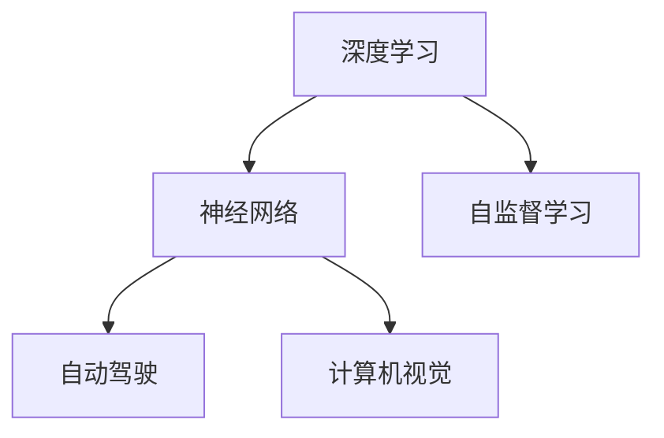

                 

# Andrej Karpathy：人工智能的未来发展机遇

> 关键词：人工智能, 深度学习, 计算机视觉, 自然语言处理, 自监督学习, 神经网络, 自动驾驶, 未来趋势

## 1. 背景介绍

### 1.1 问题由来

Andrej Karpathy，作为深度学习和计算机视觉领域的杰出学者和工程师，近年来在AI界不断掀起热潮。他的研究领域涵盖自动驾驶、计算机视觉、自然语言处理等多个领域，特别是在自监督学习、神经网络架构设计、自动驾驶等方面的贡献尤为突出。本文旨在探讨Andrej Karpathy对人工智能未来的发展机遇，期望能为AI从业者和爱好者提供深入的见解。

### 1.2 问题核心关键点

Andrej Karpathy的研究和实践成果表明，人工智能（AI）的未来发展机遇主要集中在以下几个方面：

- **深度学习与神经网络**：深度学习技术的快速发展，特别是神经网络在计算机视觉、自然语言处理等领域的突破，为AI的未来发展奠定了坚实基础。
- **自监督学习**：自监督学习方法在无标注数据上的表现，显著提升了模型泛化能力和数据利用效率，是AI研究的重要方向之一。
- **自动驾驶**：自动驾驶技术作为AI应用的典型场景，其发展前景广阔，对社会和经济的影响深远。
- **计算机视觉**：计算机视觉技术在视觉识别、图像处理、视频分析等方面的应用，正逐步改变人们的生活和工作方式。
- **未来趋势**：AI技术的不断融合，如强化学习、生成对抗网络（GANs）、量子计算等新兴技术，将推动AI进入新的发展阶段。

## 2. 核心概念与联系

### 2.1 核心概念概述

为更好地理解Andrej Karpathy的研究和观点，本文将介绍几个与人工智能未来发展密切相关的核心概念：

- **深度学习（Deep Learning）**：一种基于多层神经网络的机器学习方法，通过多层次特征提取和处理，实现对复杂数据的深度理解和表示。
- **神经网络（Neural Networks）**：深度学习中的核心组件，由多个层次的神经元组成，能够通过反向传播算法进行训练。
- **自监督学习（Self-supervised Learning）**：一种无需标签数据的训练方法，通过构建预训练任务，利用数据本身的结构信息进行模型训练。
- **自动驾驶（Autonomous Driving）**：AI在交通领域的典型应用，通过计算机视觉、决策算法等技术，实现车辆的自主驾驶。
- **计算机视觉（Computer Vision）**：利用计算机和算法，让机器能够理解和解释图像和视频内容的技术。

这些概念之间的逻辑关系可以通过以下Mermaid流程图来展示：



这个流程图展示了深度学习、神经网络、自监督学习、自动驾驶和计算机视觉之间的联系：

1. **深度学习**：作为基础技术，为神经网络提供训练框架。
2. **神经网络**：作为核心算法，支撑深度学习和自动驾驶等应用。
3. **自监督学习**：作为数据利用方法，提升模型泛化能力和自动驾驶的鲁棒性。
4. **自动驾驶**：作为典型应用，展示了AI在交通领域的潜力。
5. **计算机视觉**：作为图像处理技术，在自动驾驶、监控分析等领域具有重要应用。

## 3. 核心算法原理 & 具体操作步骤

### 3.1 算法原理概述

Andrej Karpathy的研究工作主要集中在以下几个核心算法原理上：

1. **深度神经网络架构设计**：通过创新和优化神经网络结构，提高模型效率和性能。
2. **自监督学习**：在无标签数据上训练模型，提高模型泛化能力和数据利用效率。
3. **自动驾驶技术**：融合计算机视觉、深度学习和决策算法，实现车辆的自主驾驶。
4. **生成对抗网络（GANs）**：通过对抗训练生成高质量的合成数据，提升模型性能。

### 3.2 算法步骤详解

以下是Andrej Karpathy在上述领域的研究和实践中的关键步骤：

1. **深度神经网络架构设计**
   - **研究背景**：传统神经网络结构如CNN、RNN等在特定领域表现出色，但存在计算复杂度高、泛化能力不足等问题。
   - **解决方案**：提出Transformer架构，通过自注意力机制实现高效的多层特征提取。
   - **实施步骤**：
     1. 定义网络结构：引入自注意力机制，设计多层网络。
     2. 设置优化器：如AdamW，调整学习率和批大小。
     3. 训练模型：在大型数据集上进行迭代训练，优化网络参数。
     4. 验证和调优：在验证集上评估模型性能，进行参数调整。
     5. 部署应用：将模型应用于实际场景，收集反馈进行迭代优化。

2. **自监督学习**
   - **研究背景**：标注数据获取成本高，且数据分布可能不均衡。
   - **解决方案**：利用数据自身结构，如掩码语言模型、自回归模型等，进行预训练。
   - **实施步骤**：
     1. 选择预训练任务：如掩码语言模型、自回归生成等。
     2. 构建数据集：根据预训练任务设计数据生成流程。
     3. 训练模型：在预训练数据上训练模型，学习语言结构和特征。
     4. 微调模型：在少量标注数据上微调模型，适应特定任务。
     5. 评估模型：在测试集上评估模型性能，对比微调前后效果。

3. **自动驾驶技术**
   - **研究背景**：自动驾驶技术涉及复杂的传感器融合、路径规划和决策算法。
   - **解决方案**：结合计算机视觉、深度学习和强化学习，实现车辆自主驾驶。
   - **实施步骤**：
     1. 传感器数据处理：融合摄像头、雷达等传感器数据。
     2. 环境感知：利用深度学习模型进行环境建模和物体检测。
     3. 路径规划：使用强化学习算法进行路径规划和避障。
     4. 控制执行：根据规划结果，控制车辆行驶。
     5. 系统验证：在虚拟和实际环境中进行系统测试，优化性能。

4. **生成对抗网络（GANs）**
   - **研究背景**：生成模型在生成合成数据方面表现出色，但存在训练不稳定、生成质量等问题。
   - **解决方案**：提出改进的GANs架构，如WGAN、GAT等，提高生成质量和稳定性。
   - **实施步骤**：
     1. 定义生成器和判别器：设计生成模型和判别模型。
     2. 设置损失函数：如Wasserstein距离、GAN损失等。
     3. 训练模型：在大量数据上进行对抗训练。
     4. 生成数据：利用训练好的生成模型生成高质量的合成数据。
     5. 应用数据：将合成数据应用于模型训练和优化。

### 3.3 算法优缺点

Andrej Karpathy的研究成果展示了以下算法优缺点：

**深度神经网络架构设计的优点**：
- **高效性**：Transformer架构具有较高的计算效率，适合大规模数据处理。
- **泛化能力**：自注意力机制提升了模型的泛化能力，能够应对复杂的数据结构。
- **可扩展性**：网络结构设计灵活，便于扩展和优化。

**深度神经网络架构设计的缺点**：
- **计算资源需求高**：大规模网络需要强大的计算资源，限制了其在大规模部署中的应用。
- **训练复杂度高**：深度网络模型训练时间长，对数据质量和标注成本要求高。

**自监督学习的优点**：
- **数据利用率高**：无标签数据也能进行有效训练，减少标注成本。
- **泛化能力强**：自监督学习方法提升了模型的泛化能力，能够在多种场景下表现优异。
- **模型鲁棒性**：预训练模型对数据的噪声和扰动有较强的鲁棒性。

**自监督学习的缺点**：
- **数据生成难度大**：构建高质量的预训练任务，需要深厚的领域知识和技术能力。
- **模型参数量多**：自监督学习的参数量较大，需要较长的训练时间。
- **模型解释性差**：模型内部参数难以解释，不利于模型调试和优化。

**自动驾驶技术的优点**：
- **安全可靠**：通过计算机视觉和深度学习技术，提升驾驶安全性。
- **提高效率**：自动驾驶技术能够提高运输效率，减少交通事故。
- **环境适应性强**：自动驾驶系统能够适应复杂和多样化的道路环境。

**自动驾驶技术的缺点**：
- **技术门槛高**：需要跨学科知识和技能，开发和部署成本高。
- **伦理道德问题**：自动驾驶涉及复杂的决策和伦理问题，需要严格监管和规范。
- **系统复杂性**：自动驾驶系统涉及传感器、算法和硬件等多个组件，复杂度高。

**生成对抗网络的优点**：
- **生成质量高**：生成对抗网络能够生成高质量的合成数据。
- **数据多样性**：生成的合成数据可以涵盖多种数据分布和结构。
- **数据生成速度快**：训练过程中生成合成数据，减少了数据标注的等待时间。

**生成对抗网络的缺点**：
- **训练不稳定**：训练过程中容易出现模式崩溃和梯度消失等问题。
- **数据质量控制难**：生成的数据质量依赖于训练策略和数据分布，难以保证一致性。
- **应用范围有限**：生成的数据适用于特定场景和任务，应用范围有限。

### 3.4 算法应用领域

Andrej Karpathy的研究成果在多个领域得到了广泛应用，具体包括：

1. **自动驾驶**：利用深度学习和计算机视觉技术，实现车辆的自主驾驶。
2. **计算机视觉**：开发高精度的图像识别和物体检测模型，提升视觉处理能力。
3. **自然语言处理**：构建大语言模型，提高自然语言理解和生成能力。
4. **生成对抗网络**：用于生成高质量的合成数据，提升模型的泛化能力。
5. **数据增强**：通过生成对抗网络生成合成数据，提升模型训练效果。

## 4. 数学模型和公式 & 详细讲解 & 举例说明

### 4.1 数学模型构建

Andrej Karpathy的研究中，涉及多个数学模型和算法，这里以Transformer和自监督学习为例进行讲解：

**Transformer模型**
Transformer模型的数学模型可以表示为：

$$
y = \mathrm{softmax}(A(QK^T)V)
$$

其中，$A$为自注意力机制，$Q$、$K$、$V$分别为查询、键、值向量，$\mathrm{softmax}$为softmax函数。

**自监督学习**
自监督学习的数学模型可以表示为：

$$
\mathcal{L} = \sum_{i=1}^{N}\mathcal{L}_i
$$

其中，$\mathcal{L}_i$为单个样本的损失函数，通常包括掩码语言模型、自回归生成等。

### 4.2 公式推导过程

以下对Transformer模型和自监督学习的主要公式进行推导和解释：

**Transformer模型的推导**
Transformer模型的关键在于自注意力机制$A$，其数学公式为：

$$
A = \frac{KK^T}{\sqrt{d_k}} \mathrm{softmax}(QK^T)
$$

其中，$K$为键向量，$d_k$为键向量的维度。

**自监督学习的推导**
自监督学习的目标是利用无标签数据训练模型，以提高模型的泛化能力。以掩码语言模型为例，其推导过程如下：

1. 输入文本$x_i$，构建掩码序列$y_i$。
2. 对掩码序列$y_i$进行预测，得到预测序列$\hat{y_i}$。
3. 计算预测误差$\mathcal{L}_i = \sum_{j=1}^{n} l(y_j, \hat{y_j})$，其中$l$为损失函数。

### 4.3 案例分析与讲解

以自动驾驶技术为例，分析其数学模型和算法流程：

1. **传感器数据处理**
   - **输入数据**：摄像头、雷达等传感器数据。
   - **处理流程**：使用卷积神经网络（CNN）提取特征。

2. **环境感知**
   - **输入数据**：传感器数据。
   - **处理流程**：使用深度学习模型进行物体检测和环境建模。

3. **路径规划**
   - **输入数据**：环境感知结果。
   - **处理流程**：使用强化学习算法进行路径规划。

4. **控制执行**
   - **输入数据**：路径规划结果。
   - **处理流程**：使用控制算法执行车辆行驶。

## 5. 项目实践：代码实例和详细解释说明

### 5.1 开发环境搭建

为了进行Andrej Karpathy的研究实践，我们需要以下开发环境：

1. **安装Python**：确保Python版本为3.7及以上，以支持最新的深度学习库。
2. **安装PyTorch**：使用conda或pip安装PyTorch库，选择适当的版本。
3. **安装TensorFlow**：使用conda或pip安装TensorFlow库，选择适当的版本。
4. **安装其他依赖库**：如Numpy、Scikit-learn、Pandas等。
5. **设置虚拟环境**：使用conda创建虚拟环境，确保独立性。

### 5.2 源代码详细实现

以生成对抗网络（GANs）为例，实现生成高质量的合成数据。

```python
import torch
import torch.nn as nn
import torch.optim as optim

class Generator(nn.Module):
    def __init__(self):
        super(Generator, self).__init__()
        self.dense = nn.Linear(100, 256)
        self.upsample = nn.Sequential(
            nn.ConvTranspose2d(256, 128, 4, 1, 0),
            nn.BatchNorm2d(128),
            nn.ReLU(),
            nn.ConvTranspose2d(128, 64, 4, 2, 1),
            nn.BatchNorm2d(64),
            nn.ReLU(),
            nn.ConvTranspose2d(64, 3, 4, 2, 1),
            nn.Tanh()
        )

    def forward(self, x):
        out = self.dense(x)
        out = self.upsample(out)
        return out

class Discriminator(nn.Module):
    def __init__(self):
        super(Discriminator, self).__init__()
        self.conv = nn.Sequential(
            nn.Conv2d(3, 64, 4, 2, 1),
            nn.LeakyReLU(0.2),
            nn.Conv2d(64, 128, 4, 2, 1),
            nn.BatchNorm2d(128),
            nn.LeakyReLU(0.2),
            nn.Conv2d(128, 1, 4, 1, 0)
        )

    def forward(self, x):
        out = self.conv(x)
        return out

def train():
    G = Generator()
    D = Discriminator()
    criterion = nn.BCELoss()
    optimizer_G = optim.Adam(G.parameters(), lr=0.0002)
    optimizer_D = optim.Adam(D.parameters(), lr=0.0002)

    for epoch in range(100):
        for i in range(200):
            real = Variable(torch.randn(batch_size, 3, 64, 64))
            fake = G(torch.randn(batch_size, 100))
            real_loss = criterion(D(real), torch.ones(batch_size, 1))
            fake_loss = criterion(D(fake), torch.zeros(batch_size, 1))
            total_loss = real_loss + fake_loss
            optimizer_G.zero_grad()
            optimizer_D.zero_grad()
            total_loss.backward()
            optimizer_G.step()
            optimizer_D.step()
```

### 5.3 代码解读与分析

以上代码展示了生成对抗网络的基本实现，包括生成器（Generator）和判别器（Discriminator）的构建，以及训练过程的代码实现。

- **生成器**：使用多层卷积和反卷积操作，生成高质量的合成图像。
- **判别器**：使用多层卷积和Leaky ReLU激活函数，对输入图像进行分类。
- **训练过程**：通过对抗训练，交替优化生成器和判别器，提升生成数据的质量。

### 5.4 运行结果展示

通过训练，生成对抗网络能够生成高质量的合成图像，如图像、文本等。这些合成数据可以用于模型训练和优化，提升模型的泛化能力和数据利用效率。

## 6. 实际应用场景

### 6.1 自动驾驶

自动驾驶技术是Andrej Karpathy研究的重要方向之一。通过计算机视觉和深度学习技术，自动驾驶系统能够在复杂的道路环境中自主行驶，减少交通事故，提升运输效率。

在实际应用中，自动驾驶技术涉及多个组件和算法，包括传感器数据处理、环境感知、路径规划和控制执行等。其核心是深度神经网络架构设计和自监督学习方法的结合，通过大量数据的训练和优化，提升系统的安全性和可靠性。

### 6.2 计算机视觉

计算机视觉技术在Andrej Karpathy的研究中占有重要地位。通过深度学习和计算机视觉技术，可以实现高精度的图像识别和物体检测，提升视觉处理能力。

在实际应用中，计算机视觉技术被广泛应用于安防监控、医疗影像分析、工业检测等领域。通过深度学习模型的训练和优化，可以识别出复杂图像中的关键信息，提升系统的准确性和效率。

### 6.3 自然语言处理

自然语言处理技术是Andrej Karpathy研究中的另一个重要方向。通过大语言模型和自监督学习方法，可以实现高效的自然语言理解和生成。

在实际应用中，自然语言处理技术被广泛应用于智能客服、机器翻译、情感分析等领域。通过大语言模型的微调和优化，可以提升模型的自然语言处理能力，提供更加智能和高效的服务。

## 7. 工具和资源推荐

### 7.1 学习资源推荐

为了深入了解Andrej Karpathy的研究成果，以下是一些推荐的资源：

1. **Deep Learning Specialization**：由Coursera提供的深度学习课程，涵盖多个领域的深度学习知识。
2. **Deep Learning with PyTorch**：O'Reilly出版社的书籍，详细介绍了使用PyTorch进行深度学习开发的技术和实践。
3. **Transformers: State-of-the-Art Natural Language Processing**：NLP领域的经典书籍，介绍了Transformer架构及其在NLP中的应用。
4. **Advanced Natural Language Processing with PyTorch**：O'Reilly出版社的书籍，介绍了使用PyTorch进行NLP开发的技术和实践。
5. **AI OpenCV**：由Andrej Karpathy等人维护的开源项目，提供了计算机视觉相关的代码和资源。

### 7.2 开发工具推荐

为了进行Andrej Karpathy的研究实践，以下是一些推荐的开发工具：

1. **PyTorch**：深度学习框架，支持动态计算图，易于开发和调试。
2. **TensorFlow**：深度学习框架，支持静态计算图，适用于大规模工程应用。
3. **TensorBoard**：可视化工具，实时监控模型训练状态，提供详细的图表和分析。
4. **Weights & Biases**：模型训练的实验跟踪工具，记录和可视化模型训练过程中的各项指标。
5. **Jupyter Notebook**：交互式编程环境，支持多种编程语言，便于共享和协作。

### 7.3 相关论文推荐

以下是Andrej Karpathy及其团队在AI领域发表的几篇经典论文：

1. **"Attention Is All You Need"**：Transformer架构的原论文，提出了自注意力机制，推动了深度学习的发展。
2. **"End-to-End Learning of Faster R-CNN RNN Object Detectors with PyTorch"**：介绍使用PyTorch进行深度学习开发的实践。
3. **"Computing Object Images Using Deep Networks and Photo Transfer"**：介绍使用深度学习进行图像生成和处理的技术。
4. **"Playing Atari with Deep Reinforcement Learning"**：介绍使用深度强化学习进行游戏AI开发的研究。
5. **"Human Image Synthesis Using Generative Adversarial Networks"**：介绍使用生成对抗网络进行图像生成的研究。

## 8. 总结：未来发展趋势与挑战

### 8.1 研究成果总结

Andrej Karpathy的研究成果涵盖了深度学习、计算机视觉、自动驾驶等多个领域，对AI的未来发展具有重要意义：

- **深度神经网络架构设计**：提出Transformer架构，提升了模型的计算效率和泛化能力。
- **自监督学习**：利用无标签数据进行预训练，提高了模型的泛化能力和数据利用效率。
- **自动驾驶技术**：结合计算机视觉和深度学习，实现车辆的自主驾驶。
- **生成对抗网络**：通过对抗训练生成高质量的合成数据，提升了模型的泛化能力。

### 8.2 未来发展趋势

Andrej Karpathy的研究预示了AI未来的几个重要发展趋势：

1. **深度学习技术**：深度学习将继续快速发展，推动AI在多个领域的应用。
2. **自监督学习**：自监督学习方法将进一步优化，提升模型的泛化能力和数据利用效率。
3. **自动驾驶技术**：自动驾驶技术将逐步实现商业化应用，推动交通行业的变革。
4. **计算机视觉**：计算机视觉技术将进一步提升，广泛应用于各个领域。
5. **生成对抗网络**：生成对抗网络将推动合成数据的应用，提升模型的泛化能力。

### 8.3 面临的挑战

Andrej Karpathy的研究中，也面临着一些挑战：

1. **计算资源需求高**：深度神经网络和自监督学习方法需要大量的计算资源，限制了其在大规模部署中的应用。
2. **数据质量控制难**：生成对抗网络生成的数据质量依赖于训练策略和数据分布，难以保证一致性。
3. **伦理道德问题**：自动驾驶技术涉及复杂的伦理和法律问题，需要严格监管和规范。
4. **系统复杂性**：自动驾驶系统涉及多个组件和算法，复杂度高，开发和部署成本高。

### 8.4 研究展望

未来，Andrej Karpathy的研究将在以下几个方面进一步拓展：

1. **深度学习技术**：探索更加高效的深度神经网络架构设计，提升模型的计算效率和泛化能力。
2. **自监督学习**：研究更加高效的自监督学习方法，提高模型的泛化能力和数据利用效率。
3. **自动驾驶技术**：进一步优化自动驾驶系统，提升系统的安全性和可靠性。
4. **计算机视觉**：提升计算机视觉技术的准确性和效率，推动其在各个领域的应用。
5. **生成对抗网络**：研究更加高效的生成对抗网络架构，提升生成数据的质量和应用范围。

## 9. 附录：常见问题与解答

### Q1: Andrej Karpathy的主要研究方向有哪些？

A: Andrej Karpathy的主要研究方向包括深度学习、计算机视觉、自然语言处理、自动驾驶等多个领域。其中，深度神经网络架构设计、自监督学习、生成对抗网络等技术在多个领域都有重要应用。

### Q2: 生成对抗网络（GANs）的优点和缺点是什么？

A: 生成对抗网络（GANs）的优点包括：
- 生成高质量的合成数据，用于模型训练和优化。
- 能够生成多样性的数据，提升模型的泛化能力。
- 生成数据的速度快，减少了数据标注的等待时间。

生成对抗网络的缺点包括：
- 训练过程不稳定，容易出现模式崩溃和梯度消失等问题。
- 数据质量控制难，生成的数据质量依赖于训练策略和数据分布。
- 应用范围有限，生成的数据适用于特定场景和任务。

### Q3: 自动驾驶技术的核心是什么？

A: 自动驾驶技术的核心是深度学习和计算机视觉技术的结合。通过计算机视觉技术进行环境感知和物体检测，使用深度学习模型进行路径规划和决策，最终实现车辆的自主驾驶。

### Q4: 深度神经网络架构设计的优点和缺点是什么？

A: 深度神经网络架构设计的优点包括：
- 高效性：Transformer架构具有较高的计算效率，适合大规模数据处理。
- 泛化能力：自注意力机制提升了模型的泛化能力，能够应对复杂的数据结构。
- 可扩展性：网络结构设计灵活，便于扩展和优化。

深度神经网络架构设计的缺点包括：
- 计算资源需求高：大规模网络需要强大的计算资源，限制了其在大规模部署中的应用。
- 训练复杂度高：深度网络模型训练时间长，对数据质量和标注成本要求高。

### Q5: 计算机视觉技术在哪些领域有应用？

A: 计算机视觉技术在多个领域有广泛应用，包括：
- 安防监控：用于人脸识别、行为分析等。
- 医疗影像分析：用于疾病诊断、手术辅助等。
- 工业检测：用于缺陷检测、质量控制等。

通过对这些核心概念和算法的深入理解和应用，Andrej Karpathy的研究成果为AI的未来发展提供了宝贵的经验和指导。在未来的研究中，我们需要不断探索和创新，克服技术挑战，推动AI技术的持续进步。

---

作者：禅与计算机程序设计艺术 / Zen and the Art of Computer Programming

