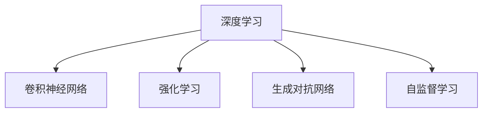

                 

# Andrej Karpathy：人工智能的未来发展机遇

## 1. 背景介绍

### 1.1 问题由来

Andrej Karpathy，斯坦福大学计算机科学教授，OpenAI首席科学家，也是深度学习领域的先驱者之一。他的工作在图像识别、自动驾驶、自然语言处理等领域产生了深远影响。本文将探讨Karpathy对于人工智能未来发展趋势的见解，及其对学术界和工业界的重要启示。

### 1.2 问题核心关键点

Andrej Karpathy在深度学习领域拥有深厚的理论功底和丰富的实践经验，他对人工智能的未来发展趋势有着深刻的见解。本文将重点讨论以下关键点：
1. 人工智能的最新进展和突破
2. 人工智能在各个领域的应用前景
3. 人工智能面临的主要挑战和未来方向

## 2. 核心概念与联系

### 2.1 核心概念概述

- **深度学习(Deep Learning)**：通过多层神经网络模拟人脑处理信息的过程，实现对复杂数据的自动学习和处理。
- **卷积神经网络(CNN)**：一种专门用于图像识别和处理的深度学习模型，通过卷积操作提取图像的特征。
- **强化学习(Reinforcement Learning)**：通过试错的方式训练模型，使其在特定环境中做出最优决策。
- **生成对抗网络(GAN)**：由生成器和判别器两个网络组成，用于生成逼真的假样本，如人脸、视频等。
- **自监督学习(Self-supervised Learning)**：利用数据本身的特性，如语义关系、空间关系等，进行无监督学习。

这些概念之间的关系可以用以下Mermaid流程图来表示：



这些概念构成了人工智能技术的基础，并在各个领域得到了广泛应用。理解这些核心概念，有助于把握人工智能的发展脉络和应用前景。

## 3. 核心算法原理 & 具体操作步骤
### 3.1 算法原理概述

Andrej Karpathy在深度学习领域的贡献主要集中在以下几个方面：

- **深度卷积神经网络**：开发了ResNet、ResNeXt等深度卷积神经网络，大幅提升了图像识别和处理的精度和效率。
- **自监督预训练**：通过大规模无监督学习，预训练模型在图像识别和生成任务上取得了显著效果。
- **迁移学习**：利用预训练模型的特征提取能力，在大规模数据集上微调，提升了下游任务的性能。

这些技术为人工智能的发展奠定了坚实的基础，也开创了深度学习的新时代。

### 3.2 算法步骤详解

以深度卷积神经网络为例，其核心步骤包括：

1. **数据准备**：收集和预处理数据集，如ImageNet、COCO等。
2. **模型设计**：设计卷积神经网络的结构，包括卷积层、池化层、全连接层等。
3. **模型训练**：使用随机梯度下降等优化算法，在大量数据上训练模型，优化权重参数。
4. **模型评估**：在验证集上评估模型的性能，调整超参数以提高模型精度。
5. **模型应用**：将训练好的模型应用于实际任务，如图像分类、物体检测、图像生成等。

### 3.3 算法优缺点

深度卷积神经网络的优势在于：
1. 能够处理大规模的图像数据，提取高层次的特征。
2. 通过自监督学习预训练，提升了模型泛化能力。
3. 迁移学习能够在大规模数据上微调，提升下游任务性能。

缺点在于：
1. 训练过程需要大量计算资源，耗时较长。
2. 模型复杂度较高，难以解释其决策过程。
3. 数据依赖性强，依赖于大规模标注数据集。

### 3.4 算法应用领域

深度卷积神经网络在图像识别、计算机视觉、自动驾驶等领域得到了广泛应用。其应用场景包括：
1. **图像分类**：将图像分为不同的类别，如动物、车辆等。
2. **物体检测**：识别图像中的物体位置和数量，如目标检测、人脸检测等。
3. **图像生成**：生成逼真的假样本，如GAN在生成逼真人脸、视频等方面的应用。
4. **自动驾驶**：利用图像和激光雷达数据，训练模型进行路径规划和驾驶决策。

## 4. 数学模型和公式 & 详细讲解 & 举例说明

### 4.1 数学模型构建

以图像分类为例，其数学模型可以表示为：
$$
\max_{w} \min_{\theta} \mathcal{L}(\theta, w; x, y)
$$
其中，$\theta$ 是分类器的参数，$w$ 是预训练模型的参数，$x$ 是输入图像，$y$ 是标签。损失函数 $\mathcal{L}$ 通常使用交叉熵损失，表示为：
$$
\mathcal{L}(\theta, w; x, y) = -\log \frac{e^{z(x; \theta)}}{\sum_k e^{z(x; \theta)}} = -y \cdot z(x; \theta) + \log \sum_k e^{z(x; \theta)}
$$
其中，$z(x; \theta)$ 是分类器输出的概率，通过softmax函数计算。

### 4.2 公式推导过程

以ResNet为例，其核心思想是通过残差连接避免梯度消失问题，使得深层网络能够有效训练。具体推导过程如下：

- **残差连接**：对于两个卷积层 $h_1 = \text{Conv}(x; w_1)$ 和 $h_2 = \text{Conv}(h_1; w_2)$，其残差连接可以表示为 $h = h_2 + \text{Conv}(x; w_1) + \text{Conv}(h_1; w_3)$。
- **堆叠残差块**：将多个残差块堆叠起来，构成深层网络。
- **激活函数**：在每个残差块之间引入激活函数，如ReLU，以增强网络表达能力。

### 4.3 案例分析与讲解

以Karpathy开发的ResNet为例，其核心思想是通过残差连接解决深层网络训练困难问题，取得了显著的图像识别效果。在ImageNet数据集上，ResNet-50达到了73.6%的分类精度，远超之前的SOTA模型。

## 5. 项目实践：代码实例和详细解释说明

### 5.1 开发环境搭建

Karpathy的深度学习项目通常使用PyTorch框架，以下是一个简单的PyTorch环境搭建步骤：

1. 安装Anaconda：
```bash
conda create -n pytorch-env python=3.7
conda activate pytorch-env
```
2. 安装PyTorch：
```bash
conda install pytorch torchvision torchaudio cudatoolkit=10.1 -c pytorch -c conda-forge
```
3. 安装相关依赖：
```bash
pip install numpy matplotlib scikit-image imageio tensorboard
```

### 5.2 源代码详细实现

以下是一个简单的PyTorch代码实现，用于训练ResNet模型进行图像分类：

```python
import torch
import torch.nn as nn
import torch.optim as optim
from torchvision import datasets, transforms
from torchvision.models import resnet

# 定义数据预处理
transform = transforms.Compose([
    transforms.Resize(256),
    transforms.CenterCrop(224),
    transforms.ToTensor(),
    transforms.Normalize(mean=[0.485, 0.456, 0.406],
                         std=[0.229, 0.224, 0.225])
])

# 加载数据集
train_dataset = datasets.CIFAR10(root='./data', train=True,
                                transform=transform, download=True)
test_dataset = datasets.CIFAR10(root='./data', train=False,
                               transform=transform, download=True)

# 定义模型
model = resnet.ResNet(3, [3, 4, 6, 3], dropout=0.3)

# 定义优化器和损失函数
optimizer = optim.SGD(model.parameters(), lr=0.01, momentum=0.9)
criterion = nn.CrossEntropyLoss()

# 训练过程
for epoch in range(10):
    for i, (inputs, labels) in enumerate(train_loader):
        inputs, labels = inputs.to(device), labels.to(device)
        optimizer.zero_grad()
        outputs = model(inputs)
        loss = criterion(outputs, labels)
        loss.backward()
        optimizer.step()

    print(f"Epoch {epoch+1}, Loss: {loss.item()}")
```

### 5.3 代码解读与分析

上述代码实现了ResNet模型在CIFAR-10数据集上的训练。代码的关键步骤包括：

- **数据预处理**：使用torchvision库中的数据预处理函数，将图像标准化为网络所需的格式。
- **模型定义**：使用torchvision库中的ResNet模型，定义其结构和超参数。
- **优化器和损失函数**：使用SGD优化器和交叉熵损失函数，进行模型训练。
- **训练过程**：在每个epoch内，对训练集进行前向传播和反向传播，更新模型参数。

## 6. 实际应用场景

### 6.1 智能交通系统

Andrej Karpathy在自动驾驶领域的研究，对智能交通系统的构建具有重要参考价值。其研究成果包括自动驾驶算法、车辆路径规划、交通信号控制等。

Karpathy的自动驾驶项目使用卷积神经网络进行道路图像识别和物体检测，通过强化学习优化驾驶决策。具体应用场景包括：
- **自动泊车**：通过图像识别和物体检测，辅助驾驶员进行车辆定位和停车。
- **路径规划**：利用视觉和激光雷达数据，进行环境建模和路径规划。
- **交通信号控制**：根据实时交通数据，自动调整信号灯的时序，优化交通流量。

### 6.2 医疗影像分析

Karpathy在深度学习医疗影像分析领域也有深入研究，主要应用于病理图像分类和病变区域定位。

其项目包括：
- **病理图像分类**：利用卷积神经网络对切片图像进行自动分类，辅助医生进行诊断。
- **病变区域定位**：通过图像分割技术，定位病变区域，提高诊断精度和效率。
- **模型解释**：通过可解释性技术，解释模型的决策过程，增强医生的信任度。

### 6.3 自然语言处理

Karpathy的自然语言处理项目主要集中在机器翻译和文本生成上。其使用Transformer模型进行神经机器翻译，取得了显著效果。

具体应用场景包括：
- **机器翻译**：将一种语言翻译成另一种语言，如英中翻译、中英文互译等。
- **文本生成**：生成自然流畅的文本，应用于自动摘要、对话系统等场景。
- **数据增强**：通过对抗样本生成，增强训练集的样本多样性，提升模型泛化能力。

## 7. 工具和资源推荐

### 7.1 学习资源推荐

- **Coursera《深度学习专项课程》**：由深度学习领域的大师级教授讲授，涵盖深度学习的基础理论和实践技巧。
- **Arxiv论文预印本**：最新的深度学习论文和研究动态，是学习前沿技术的最佳来源。
- **GitHub代码库**：Karpathy在GitHub上分享了大量深度学习项目代码，包括ResNet、图像生成、自动驾驶等。
- **Kaggle竞赛平台**：参加Kaggle深度学习竞赛，实践深度学习项目，提升技术水平。

### 7.2 开发工具推荐

- **PyTorch**：深度学习开源框架，提供灵活的动态计算图，适用于研究和工程开发。
- **TensorFlow**：由Google开发的深度学习框架，支持大规模分布式计算，适用于生产环境部署。
- **Jupyter Notebook**：交互式编程环境，方便开发者进行代码调试和实验记录。
- **TensorBoard**：可视化工具，实时监测模型训练状态和性能指标。

### 7.3 相关论文推荐

- **Deep Residual Learning for Image Recognition**：Karpathy发表在ICCV 2016上的重要论文，介绍了ResNet模型的设计原理和性能。
- **End to End Learning for Self-Driving Cars**：Karpathy在NIPS 2016上提出的自动驾驶模型，使用深度学习和强化学习进行车辆控制和路径规划。
- **Capturing Motion Dynamics for Autonomous Driving**：Karpathy在ICCV 2017上提出的视觉SLAM系统，通过深度学习捕捉车辆运动轨迹，实现精准定位和地图构建。

## 8. 总结：未来发展趋势与挑战

### 8.1 总结

Andrej Karpathy在深度学习领域的贡献深远，其研究成果为人工智能的未来发展提供了重要参考。本文从Karpathy的工作出发，探讨了深度学习的发展趋势和应用前景。

### 8.2 未来发展趋势

未来，人工智能技术将在以下几个方面取得突破：

- **更强大的深度学习模型**：模型参数量和计算资源的持续增长，将带来更强大的深度学习模型。
- **更高效的数据处理技术**：数据预处理、特征提取等技术的进步，将提升模型训练和推理效率。
- **更广泛的领域应用**：深度学习在医疗、交通、金融等领域的广泛应用，将带来新的商业机会和社会价值。
- **更智能的机器学习系统**：通过深度学习、强化学习、自监督学习等技术的结合，构建更智能的机器学习系统。

### 8.3 面临的挑战

人工智能技术在发展过程中，也面临诸多挑战：

- **计算资源瓶颈**：深度学习模型需要大量计算资源，如何在有限的硬件条件下提升性能，是一个重要问题。
- **数据依赖性强**：深度学习依赖于大规模标注数据，如何降低标注成本，提升数据利用效率，是一个亟待解决的问题。
- **模型可解释性不足**：深度学习模型的黑盒特性，使其难以解释其决策过程，限制了其在高风险领域的应用。
- **伦理和安全问题**：深度学习模型的决策过程中可能存在偏见、有害信息，如何保证其伦理和安全，是一个重要的研究课题。

### 8.4 研究展望

未来，人工智能技术需要在以下几个方面进行深入研究：

- **可解释性**：开发更多可解释的深度学习模型，提高其在高风险领域的应用。
- **伦理和安全**：引入伦理和安全约束，防止模型偏见和有害信息，确保模型输出的公平性和安全性。
- **跨领域应用**：将深度学习技术应用到更多领域，如医疗、交通、金融等，带来新的应用场景。
- **自监督学习**：探索更多自监督学习范式，降低对标注数据的依赖，提升模型泛化能力。

## 9. 附录：常见问题与解答

**Q1：深度学习模型如何应用于医疗影像分析？**

A: 深度学习模型可以用于医疗影像分类、病变区域定位等任务。通常使用卷积神经网络进行图像分割和特征提取，利用全连接层进行分类。训练过程中使用医疗影像数据集，如PASCAL VOC、COCO等。

**Q2：深度学习模型如何应用于自然语言处理？**

A: 深度学习模型可以用于文本分类、情感分析、机器翻译等任务。通常使用Transformer模型进行序列建模，利用注意力机制捕捉长距离依赖。训练过程中使用自然语言数据集，如IMDB、WMT等。

**Q3：如何提升深度学习模型的训练效率？**

A: 提升训练效率的方法包括：
1. 使用GPU加速计算，利用深度学习框架的优化算法，如TensorFlow、PyTorch等。
2. 使用模型并行和数据并行技术，加速模型训练和推理。
3. 使用分布式训练技术，将模型部署在多个服务器上进行训练，提高计算资源利用率。

**Q4：深度学习模型如何应用于自动驾驶？**

A: 深度学习模型可以用于车辆定位、路径规划、障碍物检测等任务。通常使用卷积神经网络进行图像处理，使用LSTM等序列模型进行决策。训练过程中使用自动驾驶数据集，如Cityscapes、KITTI等。

**Q5：深度学习模型如何应用于机器翻译？**

A: 深度学习模型可以用于机器翻译任务。通常使用Transformer模型进行序列建模，利用注意力机制捕捉上下文信息。训练过程中使用机器翻译数据集，如WMT等。

---

作者：禅与计算机程序设计艺术 / Zen and the Art of Computer Programming

