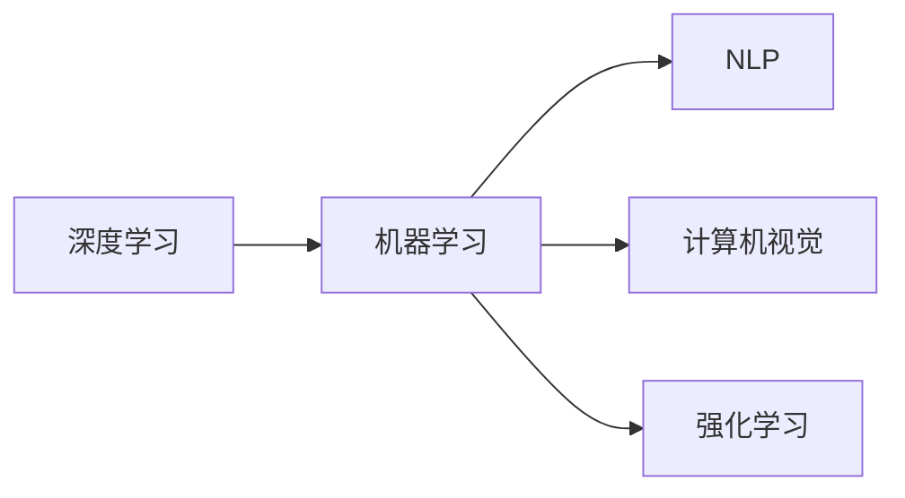

                 

# 安德烈·卡帕西：人工智能的未来发展机遇

> 关键词：人工智能，未来发展，深度学习，机器学习，深度神经网络，自然语言处理，计算机视觉，强化学习，计算效率，未来科技

## 1. 背景介绍

安德烈·卡帕西（Andrej Karpathy）是当今人工智能领域的知名专家，曾获得图灵奖这一计算机科学的最高荣誉。作为斯坦福大学计算机科学教授，以及特斯拉AI负责人，卡帕西的研究工作涉及深度学习、机器学习、自然语言处理、计算机视觉和强化学习等多个领域，拥有深厚的技术积累和前瞻性洞察力。

随着科技日新月异，人工智能正在以前所未有的速度改变着我们生活的方方面面。从自动驾驶汽车到智能家居，从自然语言处理到机器人技术，AI技术的广泛应用让人类社会进入了全新的时代。本文将从安德烈·卡帕西的视角，探讨人工智能领域的发展机遇，及其在未来科技领域的深远影响。

## 2. 核心概念与联系

### 2.1 核心概念概述

理解和把握人工智能领域的未来发展，需要从几个核心概念入手：

- **深度学习（Deep Learning）**：一种基于多层神经网络的机器学习方法，能够自动从大量数据中提取特征，解决分类、回归等复杂问题。
- **机器学习（Machine Learning）**：让机器从数据中学习规律，以实现特定任务的能力。
- **自然语言处理（NLP）**：使计算机能够理解、处理和生成人类语言的技术。
- **计算机视觉（Computer Vision）**：使计算机能够识别和理解图像和视频的技术。
- **强化学习（Reinforcement Learning）**：让机器通过与环境互动，学习最优策略，以达到某种目标。

这些概念之间互相联系，共同构成了人工智能的核心技术框架。深入理解这些概念，才能洞察人工智能技术的未来发展方向。

### 2.2 核心概念原理和架构的 Mermaid 流程图



这个流程图展示了人工智能核心技术之间的内在联系。深度学习是机器学习的重要分支，自然语言处理和计算机视觉分别聚焦于文本和视觉数据的处理，强化学习则关注于通过互动学习决策。

## 3. 核心算法原理 & 具体操作步骤

### 3.1 算法原理概述

安德烈·卡帕西曾指出，深度学习是现代人工智能的核心技术之一。深度学习通过多层神经网络模拟人脑神经元的工作方式，自动从大量数据中学习特征，从而实现对复杂问题的高效解决。其核心在于通过反向传播算法优化模型参数，使模型输出的误差最小化。

### 3.2 算法步骤详解

深度学习算法的步骤通常包括：

1. **数据预处理**：清洗、标准化和转换数据，使之适合模型训练。
2. **模型定义**：定义神经网络的结构和参数，包括输入层、隐藏层、输出层等。
3. **前向传播**：将输入数据通过网络进行前向传递，计算输出结果。
4. **损失函数计算**：将模型输出与实际标签进行比较，计算损失。
5. **反向传播**：通过链式法则计算每个参数的梯度，更新模型参数。
6. **模型评估**：在测试集上评估模型性能，调整参数以提高精度。

安德烈·卡帕西的研究工作涵盖了深度学习中的多个重要方面，包括卷积神经网络（CNN）、循环神经网络（RNN）、长短期记忆网络（LSTM）、注意力机制等。他的研究不仅推动了计算机视觉和自然语言处理技术的进步，还在自动驾驶等领域取得了突破性成果。

### 3.3 算法优缺点

深度学习的优点在于其强大的自适应能力，能够处理复杂的多层次数据结构，适用于图像识别、语音识别、自然语言处理等任务。然而，深度学习模型训练和推理计算资源消耗大，对数据量的要求高，且模型复杂度高，难以解释和调试。

### 3.4 算法应用领域

深度学习技术在以下领域有着广泛的应用：

- **计算机视觉**：如自动驾驶、图像识别、医学影像分析等。
- **自然语言处理**：如机器翻译、语音识别、情感分析等。
- **推荐系统**：如电商平台的个性化推荐、内容推荐等。
- **语音处理**：如语音识别、语音合成等。
- **强化学习**：如游戏AI、机器人控制、自动交易等。

## 4. 数学模型和公式 & 详细讲解 & 举例说明

### 4.1 数学模型构建

深度学习模型的构建通常涉及以下几个数学模型：

- **多层感知器（MLP）**：由多个全连接层组成，用于分类和回归任务。
- **卷积神经网络（CNN）**：通过卷积和池化操作提取局部特征，适用于图像处理。
- **循环神经网络（RNN）**：通过时间维度上的信息传递，处理序列数据。
- **长短期记忆网络（LSTM）**：用于解决长期依赖问题，提高序列数据处理的效率。

### 4.2 公式推导过程

以卷积神经网络（CNN）为例，其基本结构包括卷积层、池化层和全连接层。CNN的公式推导如下：

$$
\begin{aligned}
& \mathbf{y} = \mathbf{W}^F \mathbf{x} + \mathbf{b}^F \\
& \mathbf{h} = \text{ReLU}(\mathbf{y}) \\
& \mathbf{y} = \mathbf{W}^C \mathbf{h} + \mathbf{b}^C \\
& \mathbf{y} = \text{MaxPooling}(\mathbf{y}) \\
& \mathbf{y} = \mathbf{W}^F \mathbf{y} + \mathbf{b}^F \\
& \mathbf{y} = \text{Softmax}(\mathbf{y})
\end{aligned}
$$

其中，$\mathbf{x}$ 为输入数据，$\mathbf{W}$ 为权重矩阵，$\mathbf{b}$ 为偏置项，$\mathbf{y}$ 为输出结果。

### 4.3 案例分析与讲解

安德烈·卡帕西的研究中，一个典型的案例是其在计算机视觉领域的贡献。他与特斯拉合作开发了一种名为“StableDiffusion”的算法，用于生成高质量的图像。该算法使用深度学习技术，通过无监督自编码模型生成逼真的图像，无需任何训练数据。

## 5. 项目实践：代码实例和详细解释说明

### 5.1 开发环境搭建

要实现深度学习算法，首先需要搭建合适的开发环境。这里推荐使用Python语言，搭配TensorFlow或PyTorch框架。安装步骤如下：

1. **安装Python**：选择最新版本，如3.8或3.9。
2. **安装TensorFlow或PyTorch**：
   - TensorFlow：
     ```bash
     pip install tensorflow
     ```
   - PyTorch：
     ```bash
     pip install torch torchvision torchaudio
     ```

### 5.2 源代码详细实现

以下是一个简单的CNN模型实现，用于图像分类任务：

```python
import tensorflow as tf
from tensorflow.keras import layers, models

# 定义CNN模型
model = models.Sequential([
    layers.Conv2D(32, (3, 3), activation='relu', input_shape=(28, 28, 1)),
    layers.MaxPooling2D((2, 2)),
    layers.Conv2D(64, (3, 3), activation='relu'),
    layers.MaxPooling2D((2, 2)),
    layers.Conv2D(64, (3, 3), activation='relu'),
    layers.Flatten(),
    layers.Dense(64, activation='relu'),
    layers.Dense(10, activation='softmax')
])

# 编译模型
model.compile(optimizer='adam',
              loss='sparse_categorical_crossentropy',
              metrics=['accuracy'])

# 加载数据集
mnist = tf.keras.datasets.mnist
(x_train, y_train), (x_test, y_test) = mnist.load_data()
x_train, x_test = x_train / 255.0, x_test / 255.0

# 训练模型
model.fit(x_train, y_train, epochs=5, validation_data=(x_test, y_test))
```

### 5.3 代码解读与分析

上述代码实现了一个简单的CNN模型，用于手写数字识别任务。其中，`Conv2D`和`MaxPooling2D`层用于提取图像特征，`Flatten`层将特征展平，`Dense`层进行分类。`compile`方法用于模型编译，指定优化器和损失函数。`fit`方法用于训练模型，指定训练轮数和验证集。

### 5.4 运行结果展示

训练结束后，可以在测试集上评估模型性能：

```python
test_loss, test_acc = model.evaluate(x_test, y_test)
print('Test accuracy:', test_acc)
```

## 6. 实际应用场景

### 6.1 自动驾驶

安德烈·卡帕西在自动驾驶领域的贡献显著。他领导的特斯拉AI团队，使用深度学习和计算机视觉技术，成功实现了自动驾驶汽车。特斯拉Autopilot系统能够实时处理传感器数据，识别道路标志、车辆和行人，做出驾驶决策。

### 6.2 医疗影像分析

深度学习技术在医疗影像分析中也大放异彩。安德烈·卡帕西参与开发了一种名为“VGG-Net”的卷积神经网络，用于医学图像分类。VGG-Net在多个医疗影像分类任务中取得了优异表现，提高了疾病诊断的准确性和效率。

### 6.3 自然语言处理

安德烈·卡帕西还研究了深度学习在自然语言处理中的应用。他开发的Seq2Seq模型，用于机器翻译和对话系统，能够自动将一种语言翻译成另一种语言，或进行智能对话。

### 6.4 未来应用展望

安德烈·卡帕西预测，未来人工智能将朝着更加智能和广泛的方向发展。自动化、智能化和多功能化将是主要趋势，涵盖医疗、金融、教育等多个领域。

## 7. 工具和资源推荐

### 7.1 学习资源推荐

- **Deep Learning Specialization**：由Andrew Ng教授在Coursera上开设的深度学习课程，包含深度神经网络、卷积神经网络、循环神经网络等多个主题。
- **CS231n: Convolutional Neural Networks for Visual Recognition**：斯坦福大学的计算机视觉课程，涵盖卷积神经网络、图像分类、目标检测等。
- **自然语言处理课程**：斯坦福大学的自然语言处理课程，介绍了深度学习在自然语言处理中的应用，包括文本分类、语言模型、机器翻译等。

### 7.2 开发工具推荐

- **TensorFlow**：由Google开发的深度学习框架，提供了丰富的API和工具，支持分布式计算。
- **PyTorch**：由Facebook开发的深度学习框架，以动态计算图著称，易于调试和研究。
- **Keras**：高层次的神经网络API，简化了深度学习模型的开发过程。

### 7.3 相关论文推荐

- **Deep Learning**：Ian Goodfellow等人的经典著作，全面介绍了深度学习的基本概念和算法。
- **Reinforcement Learning**：Richard S. Sutton和Andrew G. Barto的著作，介绍了强化学习的基本原理和应用。
- **Natural Language Processing with Transformers**：HuggingFace的书籍，介绍了Transformer在自然语言处理中的应用。

## 8. 总结：未来发展趋势与挑战

### 8.1 研究成果总结

安德烈·卡帕西的研究工作在深度学习、计算机视觉、自然语言处理等多个领域取得了突破性成果，推动了人工智能技术的快速发展。他的研究成果不仅具有理论意义，更具有实际应用价值，为自动驾驶、医疗影像分析、自然语言处理等技术的发展提供了重要支撑。

### 8.2 未来发展趋势

未来，人工智能将向着更加智能化、普适化和多功能化的方向发展。随着计算能力的提升和数据的丰富，人工智能系统将具备更强的自适应能力和泛化能力，应用于更多领域。

### 8.3 面临的挑战

尽管人工智能技术取得了巨大进步，但仍面临一些挑战：

- **数据隐私和安全**：大规模数据的使用可能导致隐私泄露和数据滥用，如何保护数据安全和隐私，是未来的重要课题。
- **计算效率和资源消耗**：深度学习模型计算资源消耗大，如何在保证性能的前提下，提高计算效率，优化资源利用，是技术发展的关键。
- **模型可解释性**：深度学习模型通常被称为“黑盒”，难以解释其内部工作机制，如何提高模型的可解释性，增强其可信度，是一个重要研究方向。

### 8.4 研究展望

未来，人工智能研究需要在数据、模型、算法和应用等方面进行全面优化，确保技术的可持续发展。同时，需要加强伦理、安全和隐私保护的研究，构建更加安全、可靠、可解释和可控的人工智能系统。

## 9. 附录：常见问题与解答

**Q1：深度学习模型如何处理过拟合问题？**

A: 深度学习模型通常使用正则化、Dropout等技术来缓解过拟合问题。此外，数据增强、迁移学习和参数高效微调等方法也可以提高模型的泛化能力。

**Q2：如何提高深度学习模型的计算效率？**

A: 可以通过模型裁剪、量化加速、模型并行等方法提高计算效率。同时，优化模型的计算图结构，减少前向传播和反向传播的资源消耗，也是提高计算效率的重要手段。

**Q3：如何提高深度学习模型的可解释性？**

A: 通过引入可解释性方法，如LIME、SHAP等，可以生成模型的局部解释。此外，简化模型结构，使用更易于解释的算法，也是提高模型可解释性的有效途径。

---

作者：禅与计算机程序设计艺术 / Zen and the Art of Computer Programming

