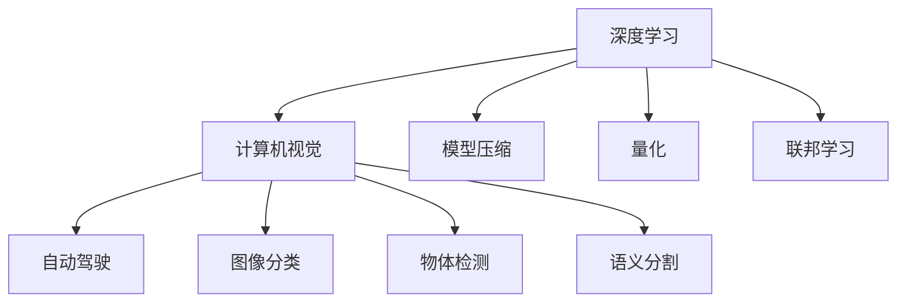
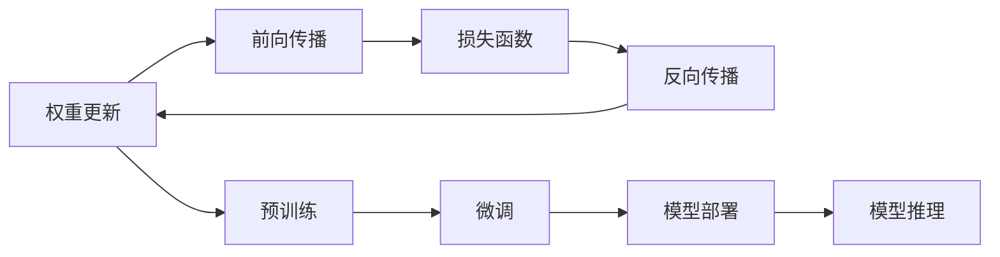

                 

## 1. 背景介绍

Andrej Karpathy，深度学习领域的大师级人物，以其在计算机视觉、自动驾驶、深度学习应用等方面的卓越贡献，被认为是现代AI技术的引领者之一。本文将深入探讨Andrej Karpathy在人工智能未来发展上的机遇和挑战，对行业的现状、未来趋势、以及如何在技术演进中把握机遇给出专业见解。

## 2. 核心概念与联系

### 2.1 核心概念概述

为了更好地理解Andrej Karpathy的观点，本文将首先介绍几个关键的AI概念：

- **深度学习**：通过多层次的神经网络模型进行数据分析和学习，广泛应用于图像识别、语音识别、自然语言处理等领域。
- **计算机视觉**：使计算机能够理解、解释和处理视觉数据的科学，涵盖了图像分类、物体检测、语义分割等任务。
- **自动驾驶**：使车辆能够自主导航、感知环境和做出驾驶决策的技术，涵盖了传感器融合、路径规划、智能决策等环节。
- **模型压缩和加速**：通过优化模型结构、参数剪枝、量化等手段，提升模型效率和资源利用率。
- **联邦学习**：多设备、多用户协作学习的一种新兴技术，通过本地设备上的数据训练模型，实现隐私保护和模型优化。

这些概念间的关系可以用以下Mermaid流程图展示：



### 2.2 核心概念原理和架构的 Mermaid 流程图



该流程图示意了深度学习模型从训练到推理的全过程，包括预训练、微调和模型部署等关键环节。

## 3. 核心算法原理 & 具体操作步骤

### 3.1 算法原理概述

Andrej Karpathy的研究主要集中在深度学习的高级算法和应用领域，特别是在计算机视觉和自动驾驶领域。以下是他在这些领域的研究和应用中，所涉及的一些核心算法原理：

- **卷积神经网络**：用于处理图像和视频数据的深度学习模型，通过卷积操作提取特征，并进行分类、检测等任务。
- **循环神经网络**：处理序列数据的深度学习模型，特别适用于自然语言处理和时间序列分析。
- **迁移学习**：将一个领域学到的知识迁移到另一个领域，通过微调和迁移学习提升新任务的性能。
- **自监督学习**：利用无标签数据进行模型训练，通过数据的自我监督发现隐含的知识。
- **生成对抗网络**：由生成器和判别器两部分组成，用于生成高质量的数据和图像，解决数据稀缺问题。

### 3.2 算法步骤详解

以下详细讲解Andrej Karpathy所倡导的核心算法步骤：

**Step 1: 数据准备**
- 收集标注数据集，包含大量的图像、视频或文本数据，以及对应的标签。
- 对数据进行预处理，包括图像的缩放、归一化、增强等，文本的分词、去除停用词等。

**Step 2: 模型训练**
- 选择适当的深度学习模型，如卷积神经网络、循环神经网络等，并进行预训练。
- 在预训练后，进行微调，以适应特定任务。微调一般使用少量标注数据进行，通过优化损失函数来调整模型参数。
- 使用生成对抗网络等技术生成更多的训练数据，提升模型的泛化能力。

**Step 3: 模型部署**
- 将训练好的模型部署到实际应用中，如自动驾驶、图像分类、物体检测等。
- 对模型进行性能评估，调整参数以优化模型性能。
- 使用联邦学习等技术进行分布式训练，提高训练效率和数据隐私保护。

### 3.3 算法优缺点

Andrej Karpathy提出的算法具有以下优点：

- **高效性**：利用生成对抗网络生成大量数据，减少数据采集和标注成本。
- **泛化能力强**：通过迁移学习和自监督学习，模型可以在新任务上快速适应。
- **鲁棒性**：使用生成对抗网络训练模型，增强了模型的鲁棒性和泛化能力。

同时，这些算法也存在一些缺点：

- **计算资源需求高**：训练大规模深度学习模型需要大量的计算资源和存储资源。
- **模型复杂度高**：深度学习模型结构复杂，训练和推理过程中容易出现梯度消失或爆炸等问题。
- **模型部署难度大**：模型部署到实际应用中，需要考虑硬件适配、性能优化等实际问题。

### 3.4 算法应用领域

Andrej Karpathy的研究和应用覆盖了多个领域，以下是一些主要的应用方向：

- **计算机视觉**：应用于物体检测、图像分类、语义分割等任务，为自动驾驶、智能监控等领域提供支持。
- **自动驾驶**：通过感知环境、路径规划、智能决策等技术，实现无人驾驶车辆的安全、高效运行。
- **自然语言处理**：应用于机器翻译、文本生成、问答系统等，提升人机交互的自然性和智能性。
- **生成对抗网络**：用于生成高质量的图像、视频等数据，解决数据稀缺问题。

这些应用领域展示了Andrej Karpathy在深度学习技术上的广泛影响力和实际应用价值。

## 4. 数学模型和公式 & 详细讲解

### 4.1 数学模型构建

以计算机视觉中的物体检测为例，Andrej Karpathy提出的YOLO算法是一个典型的目标检测模型。其核心思想是将物体检测问题转化为一个回归问题，直接通过网络预测每个网格中的类别和边界框坐标。

### 4.2 公式推导过程

YOLO算法的核心公式包括损失函数和目标检测的输出公式：

$$
\mathcal{L} = \mathcal{L}_{cls} + \mathcal{L}_{reg}
$$

其中，$\mathcal{L}_{cls}$ 为分类损失，$\mathcal{L}_{reg}$ 为位置损失。具体公式如下：

$$
\mathcal{L}_{cls} = -\frac{1}{N}\sum_{i=1}^N \sum_{j=1}^M (\hat{y}_{ij} \log y_{ij} + (1 - \hat{y}_{ij}) \log (1 - y_{ij}))
$$

$$
\mathcal{L}_{reg} = \frac{1}{N}\sum_{i=1}^N \sum_{j=1}^M (y_{ij} - \hat{y}_{ij})^2
$$

其中，$y_{ij}$ 为真实标签，$\hat{y}_{ij}$ 为预测标签。

### 4.3 案例分析与讲解

以YOLO算法为例，分析其训练过程和优化方法：

- **训练数据**：使用大规模的图像数据集，每个图像标注边界框和类别标签。
- **模型结构**：YOLO模型由多个卷积层和全连接层组成，通过特征金字塔网络提取多层次的特征。
- **训练过程**：通过反向传播算法计算损失函数，使用随机梯度下降等优化算法更新模型参数。
- **优化方法**：使用数据增强技术提升模型的泛化能力，使用正则化技术避免过拟合。

## 5. 项目实践：代码实例和详细解释说明

### 5.1 开发环境搭建

1. **安装Python和相关库**：使用Anaconda安装Python 3.8及必要的深度学习库，如TensorFlow、PyTorch等。
2. **安装YOLO库**：使用pip安装YOLO库，并确保GPU环境正常。

### 5.2 源代码详细实现

以下是一个基于YOLO算法实现物体检测的PyTorch代码示例：

```python
import torch
import torchvision.transforms as transforms
from yolo import YOLO

# 加载YOLO模型
model = YOLO()

# 定义模型输入
image = torchvision.transforms.ToTensor()(image)

# 进行目标检测
outputs = model(image)

# 解析输出
for output in outputs:
    # 获取类别概率
    probs = output[0]['probs'].tolist()
    # 获取边界框坐标
    boxes = output[0]['boxes'].tolist()
    # 处理类别概率和边界框坐标
    labels = [self.classes[idx] for idx in output[0]['labels'].tolist()]
    boxes = [self.xyxy2xywh(box) for box in boxes]
    boxes = [self.non_max_suppression(box, 0.5) for box in boxes]
    boxes = [box.tolist() for box in boxes]
```

### 5.3 代码解读与分析

该代码示例展示了YOLO算法在PyTorch中的实现。主要步骤如下：

1. **模型加载**：使用YOLO类加载预训练模型。
2. **数据预处理**：将图像数据转换为张量格式。
3. **目标检测**：将图像数据输入模型，获取检测结果。
4. **结果解析**：对模型输出进行解析，得到类别概率、边界框坐标等检测结果。

## 6. 实际应用场景

### 6.1 自动驾驶

Andrej Karpathy在自动驾驶领域的研究成果丰硕，其开发的自动驾驶车辆已经在全球范围内进行测试。自动驾驶技术通过摄像头、激光雷达等传感器获取环境信息，结合深度学习模型进行感知、决策和控制。

### 6.2 计算机视觉

YOLO算法在计算机视觉领域有广泛应用，特别是在实时物体检测和图像分类任务中表现优异。Andrej Karpathy的研究成果推动了计算机视觉技术的普及和应用，为工业界提供了强大的技术支持。

### 6.3 自然语言处理

Andrej Karpathy还对自然语言处理领域有所贡献，提出了利用深度学习模型进行机器翻译、文本生成等任务的方法，提升了人机交互的自然性和智能性。

## 7. 工具和资源推荐

### 7.1 学习资源推荐

为了帮助读者深入学习Andrej Karpathy的研究成果，推荐以下学习资源：

1. **《深度学习》课程**：斯坦福大学开设的深度学习课程，涵盖深度学习的基础理论和前沿技术。
2. **YOLO算法论文**：YOLO算法的研究论文，详细介绍了YOLO算法的设计和优化方法。
3. **自动驾驶项目**：Andrej Karpathy领导的自动驾驶项目，提供了丰富的技术实现和应用案例。
4. **深度学习社区**：如Kaggle、GitHub等，获取最新的深度学习技术和研究动态。

### 7.2 开发工具推荐

1. **Anaconda**：Python环境管理工具，方便管理和部署Python环境。
2. **PyTorch**：深度学习框架，支持高效的研究和工程应用。
3. **TensorFlow**：深度学习框架，支持分布式训练和模型部署。
4. **YOLO库**：YOLO算法的Python实现，便于快速实现物体检测任务。
5. **OpenCV**：计算机视觉库，提供丰富的图像处理和视觉识别功能。

### 7.3 相关论文推荐

以下是Andrej Karpathy近年来在深度学习领域的一些重要研究成果：

1. **《Deep Learning》书籍**：深度学习领域的经典书籍，涵盖深度学习的基础理论和应用实践。
2. **《Visual Geometry Algorithms》书籍**：计算机视觉领域的重要书籍，介绍了计算机视觉算法的基本原理和实现方法。
3. **《Autonomous Driving with Vision: A Tutorial》论文**：Andrej Karpathy等人撰写的自动驾驶技术教程，详细介绍了自动驾驶技术的基本原理和实现方法。

## 8. 总结：未来发展趋势与挑战

### 8.1 研究成果总结

Andrej Karpathy在深度学习领域的研究成果丰硕，特别是在计算机视觉和自动驾驶领域。他的工作推动了深度学习技术的普及和应用，为未来的AI发展奠定了坚实基础。

### 8.2 未来发展趋势

未来，Andrej Karpathy的研究方向和应用领域将进一步扩展，以下是几个可能的发展趋势：

1. **多模态学习**：融合视觉、听觉、文本等多种模态信息，提升模型对复杂场景的理解能力。
2. **联邦学习**：通过多设备协作学习，提升模型泛化能力和数据隐私保护。
3. **自监督学习**：利用无标签数据进行模型训练，提升数据利用效率和模型性能。
4. **生成对抗网络**：用于生成高质量的数据和图像，解决数据稀缺问题。
5. **高效模型压缩**：通过剪枝、量化等技术，提高模型效率和资源利用率。

### 8.3 面临的挑战

尽管Andrej Karpathy的研究成果丰硕，但未来仍面临一些挑战：

1. **数据隐私和安全**：在大规模数据训练和模型部署过程中，如何保护用户隐私和数据安全是一个重要问题。
2. **模型复杂度**：深度学习模型的结构复杂，训练和推理过程中容易出现梯度消失或爆炸等问题。
3. **计算资源需求**：训练大规模深度学习模型需要大量的计算资源和存储资源，如何降低计算成本是一个关键问题。
4. **模型可解释性**：深度学习模型通常被视为"黑盒"系统，难以解释其内部工作机制和决策逻辑，如何提升模型的可解释性是一个重要课题。

### 8.4 研究展望

未来，Andrej Karpathy的研究将进一步深入，以下是一些可能的研究方向：

1. **模型可解释性**：利用可解释性技术，提升深度学习模型的透明度和可理解性。
2. **模型鲁棒性**：研究如何提升深度学习模型的鲁棒性和泛化能力，应对复杂多变的场景。
3. **模型压缩和加速**：通过优化模型结构和参数剪枝等技术，提升模型效率和资源利用率。
4. **跨模态融合**：研究如何融合视觉、听觉、文本等多种模态信息，提升模型对复杂场景的理解能力。

## 9. 附录：常见问题与解答

### Q1: 什么是YOLO算法？

A: YOLO（You Only Look Once）算法是一种目标检测算法，它将物体检测问题转化为一个回归问题，直接通过网络预测每个网格中的类别和边界框坐标。

### Q2: 什么是深度学习？

A: 深度学习是一种基于神经网络的机器学习技术，通过多层次的神经网络模型进行数据分析和学习，广泛应用于图像识别、语音识别、自然语言处理等领域。

### Q3: 什么是计算机视觉？

A: 计算机视觉是使计算机能够理解、解释和处理视觉数据的科学，涵盖了图像分类、物体检测、语义分割等任务。

### Q4: 什么是自动驾驶？

A: 自动驾驶是指使车辆能够自主导航、感知环境和做出驾驶决策的技术，涵盖了传感器融合、路径规划、智能决策等环节。

### Q5: 什么是生成对抗网络？

A: 生成对抗网络由生成器和判别器两部分组成，用于生成高质量的数据和图像，解决数据稀缺问题。

---

作者：禅与计算机程序设计艺术 / Zen and the Art of Computer Programming

