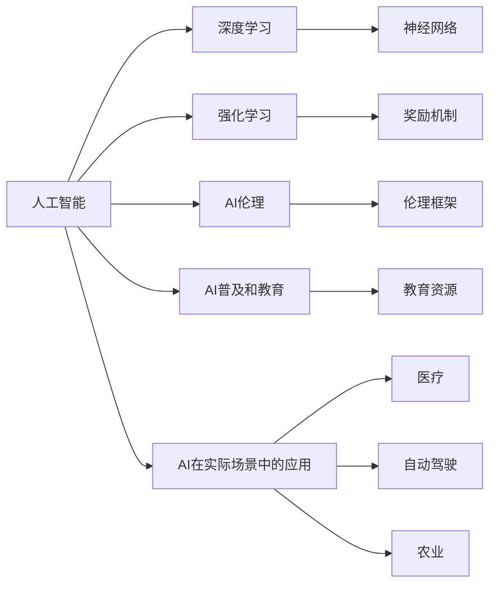

                 

# 《Andrej Karpathy：人工智能的未来发展策略》

## 1. 背景介绍

### 1.1 问题由来
Andrej Karpathy是斯坦福大学计算机科学教授，深度学习专家，OpenAI的AI研究员，曾参与开发了NVIDIA的深度学习平台，并共同创立了VaidekAI。在人工智能领域，他不仅是研究者，也是创业者，致力于通过前沿技术和创新的应用推动AI技术的不断发展。近年来，Karpathy发表了一系列关于人工智能未来发展趋势的思考和策略，引起了广泛关注。本文旨在梳理和解析Karpathy关于人工智能未来发展的策略，提供深入的见解和分析。

### 1.2 问题核心关键点
Karpathy的思考主要围绕以下核心关键点展开：
1. **人工智能的伦理问题**：如何平衡技术的进步与伦理道德，确保AI系统服务于人类福祉。
2. **AI技术的普及和教育**：如何普及AI技术，提高公众对AI的理解和信任，同时进行AI教育的推广，培养更多AI人才。
3. **AI在实际场景中的应用**：AI技术在医疗、自动驾驶、农业等领域的应用前景和挑战。
4. **AI的安全性和可控性**：如何确保AI系统的安全性和可控性，避免潜在的风险和滥用。
5. **AI与社会的融合**：AI如何更好地融入社会，提升人类生活质量和生产效率。

### 1.3 问题研究意义
Karpathy的这些思考和策略对于指导未来AI技术的健康发展具有重要意义：
1. 有助于在技术创新与社会伦理之间找到平衡点，推动AI技术的可持续发展。
2. 促进AI技术的普及和教育，为AI技术的广泛应用打下坚实基础。
3. 揭示AI技术在实际场景中的应用前景，为各行业带来创新和变革。
4. 强调AI系统安全性和可控性的重要性，保障AI技术的可靠性。
5. 探讨AI与社会的融合，提升人类的生活质量和工作效率。

## 2. 核心概念与联系

### 2.1 核心概念概述

Andrej Karpathy的思考涉及多个核心概念，这些概念构成了他关于人工智能未来发展的整体框架。

- **人工智能**：指通过计算机程序和算法，让机器具备类似于人类的智能行为，包括感知、推理、学习和决策等能力。
- **深度学习**：一种基于神经网络的机器学习方法，通过多层次的非线性变换，从数据中提取高层次的特征表示。
- **强化学习**：一种通过奖励和惩罚机制，让机器在特定环境中通过不断试错学习最优策略的方法。
- **AI伦理**：涉及AI技术的设计、开发、使用过程中所面临的伦理问题，如隐私保护、公平性、安全性等。
- **AI普及和教育**：通过多种方式，提高公众对AI技术的理解和应用，同时培养更多AI专业人才。
- **AI在实际场景中的应用**：将AI技术应用于医疗、自动驾驶、农业等实际问题中，提升各行业的效率和质量。

这些概念之间通过逻辑连接，共同构成了Karpathy对人工智能未来发展的系统思考。

### 2.2 核心概念原理和架构的 Mermaid 流程图



这个流程图展示了Karpathy思考的核心概念及其相互关系。其中：
- 人工智能是核心，通过深度学习和强化学习等技术手段，实现各种智能行为。
- AI伦理、普及和教育等保障了AI技术的健康发展。
- AI在医疗、自动驾驶、农业等实际场景中的应用，展示了AI技术的广泛潜力。

## 3. 核心算法原理 & 具体操作步骤

### 3.1 算法原理概述

Karpathy关于人工智能未来发展的策略，主要围绕以下算法原理展开：

- **强化学习策略**：通过奖励和惩罚机制，让AI系统在特定环境中学习最优策略，应用于自动驾驶、机器人等复杂系统。
- **深度学习架构**：利用深度神经网络，通过多层次的特征提取和表示学习，提升AI系统的感知和推理能力。
- **AI伦理框架**：建立AI系统的伦理审查机制，确保AI技术的安全性和公平性。
- **AI普及教育**：通过多种形式的教育和宣传，提高公众对AI技术的理解和接受。
- **AI应用创新**：将AI技术应用于医疗、农业等领域，探索新的应用场景和技术突破。

### 3.2 算法步骤详解

以下是Karpathy策略的具体操作步骤：

1. **数据收集和处理**：收集各领域的标注数据，进行清洗和预处理，为AI模型提供高质量的训练数据。
   
2. **模型训练**：选择适合的深度学习模型和算法，对数据进行训练，优化模型参数，提升模型性能。

3. **强化学习优化**：设计合理的奖励和惩罚机制，训练AI系统，使其在特定环境中通过不断试错学习最优策略。

4. **伦理框架设计**：建立AI系统的伦理审查机制，确保AI系统的决策过程透明、公平和可解释。

5. **教育推广**：通过在线课程、讲座、科普文章等多种形式，普及AI知识，培养更多AI专业人才。

6. **实际应用探索**：在医疗、自动驾驶、农业等领域，探索AI技术的新应用，提升各行业的效率和质量。

### 3.3 算法优缺点

Karpathy策略的优点包括：
1. **技术先进性**：利用深度学习和强化学习等前沿技术，提升AI系统的性能。
2. **伦理保障**：建立AI伦理框架，确保AI技术的健康发展，避免潜在的滥用和风险。
3. **教育普及**：通过教育推广，提高公众对AI技术的理解和接受，为AI技术的普及打下基础。
4. **广泛应用**：探索AI技术在医疗、自动驾驶、农业等领域的应用，推动各行业的创新和变革。

同时，也存在一些缺点：
1. **技术复杂性**：深度学习和强化学习等技术手段相对复杂，需要较高的技术门槛和资源投入。
2. **伦理挑战**：AI伦理框架的建立和实施面临诸多挑战，需要多方协作和持续努力。
3. **教育资源不足**：AI教育的普及需要更多的教育资源投入，尤其是在资源相对匮乏的地区。
4. **应用局限性**：AI技术在部分领域的实际应用仍面临诸多挑战，需要进一步研究和突破。

### 3.4 算法应用领域

Karpathy的策略在以下领域有广泛应用前景：

- **自动驾驶**：利用强化学习，让车辆在复杂道路环境中学习最优驾驶策略。
- **医疗诊断**：通过深度学习，提升医疗影像诊断的准确性和效率。
- **机器人操作**：在工业、服务等领域，让机器人具备智能操作能力。
- **农业智能化**：通过AI技术，优化农业生产过程，提升农产品质量和产量。
- **智能客服**：利用自然语言处理和深度学习，提高客服系统的智能化水平。

## 4. 数学模型和公式 & 详细讲解 & 举例说明

### 4.1 数学模型构建

Karpathy关于AI的策略，可以通过以下数学模型来描述：

- **强化学习模型**：通过状态、动作、奖励等元素，构建AI系统的强化学习模型。

- **深度学习模型**：利用多层神经网络，构建AI系统的特征提取和表示学习模型。

- **伦理框架模型**：通过伦理审查机制，构建AI系统的伦理框架模型。

### 4.2 公式推导过程

以下是强化学习模型的公式推导：

1. **状态转移公式**：
   $$
   P(s_{t+1} | s_t, a_t) = P(s_{t+1} | s_t)
   $$
   表示在状态$s_t$下，采取动作$a_t$后，下一个状态$s_{t+1}$的概率分布。

2. **奖励函数公式**：
   $$
   R(s_t, a_t) = R(s_{t+1})
   $$
   表示在状态$s_t$下，采取动作$a_t$后，获得的即时奖励$R(s_{t+1})$。

3. **价值函数公式**：
   $$
   V(s_t) = \sum_{t'=t}^\infty \gamma^{t'-t} R(s_{t'}, s_{t'}) + \gamma^{t'-t} V(s_{t'})
   $$
   表示在状态$s_t$下，执行最优策略时，未来期望奖励的折现和。

### 4.3 案例分析与讲解

以下是一个强化学习在自动驾驶中的应用案例：

1. **环境建模**：利用激光雷达、摄像头等传感器，构建自动驾驶车辆的环境模型。

2. **动作设计**：设计车辆的转向、加速、刹车等动作，作为强化学习的动作空间。

3. **奖励机制**：设计奖励机制，鼓励车辆在安全、高效的情况下，通过加速、转向等动作完成任务。

4. **模型训练**：使用上述模型和奖励机制，训练AI系统，使其在特定环境中学习最优驾驶策略。

## 5. 项目实践：代码实例和详细解释说明

### 5.1 开发环境搭建

Karpathy策略的实现需要以下开发环境：

1. **深度学习框架**：如TensorFlow、PyTorch等，用于构建深度学习模型。

2. **强化学习框架**：如Reinforcement Learning Toolkit，用于构建强化学习模型。

3. **大数据处理工具**：如Hadoop、Spark等，用于处理和存储大规模数据。

4. **云计算平台**：如AWS、Google Cloud等，提供高性能计算资源和存储服务。

5. **教育平台**：如Coursera、Udacity等，用于AI教育的推广和普及。

### 5.2 源代码详细实现

以下是一个利用PyTorch实现强化学习的简单代码示例：

```python
import torch
import torch.nn as nn
import torch.optim as optim

class Policy(nn.Module):
    def __init__(self, input_size, output_size):
        super(Policy, self).__init__()
        self.fc1 = nn.Linear(input_size, 64)
        self.fc2 = nn.Linear(64, output_size)
    
    def forward(self, x):
        x = self.fc1(x)
        x = torch.relu(x)
        x = self.fc2(x)
        return x
    
policy = Policy(input_size, output_size)
optimizer = optim.Adam(policy.parameters(), lr=learning_rate)
criterion = nn.MSELoss()

# 训练过程
for episode in range(num_episodes):
    state = init_state()
    for t in range(max_timesteps):
        action = policy(state)
        next_state, reward, done = env.step(action)
        loss = criterion(policy(next_state), target)
        optimizer.zero_grad()
        loss.backward()
        optimizer.step()
        if done:
            state = init_state()
```

### 5.3 代码解读与分析

在上述代码中，我们首先定义了策略函数`Policy`，用于输出动作。然后，使用Adam优化器和均方误差损失函数进行模型训练。在训练过程中，每个步骤都包含状态、动作、奖励等元素的交互，通过不断更新策略函数，使得模型在特定环境中学习最优策略。

### 5.4 运行结果展示

在训练过程中，可以通过可视化工具展示训练过程中的奖励和策略变化。例如，使用TensorBoard工具，可以实时监测模型训练的状态，包括损失函数、奖励变化等。

## 6. 实际应用场景

### 6.1 自动驾驶

自动驾驶是Karpathy策略中最重要的应用场景之一。通过强化学习，自动驾驶车辆可以在复杂交通环境中学习最优驾驶策略，提升行车安全性和效率。

### 6.2 医疗诊断

在医疗领域，利用深度学习技术，可以显著提升影像诊断的准确性和效率。例如，通过卷积神经网络，可以自动分析医学影像，检测病灶和异常。

### 6.3 农业智能化

AI技术在农业智能化中也有广泛应用。通过深度学习，可以优化农业生产过程，提高农产品质量和产量，同时降低生产成本。

## 7. 工具和资源推荐

### 7.1 学习资源推荐

1. **《深度学习》（Deep Learning）**：由Ian Goodfellow等著，全面介绍了深度学习的基本原理和算法。

2. **Coursera AI专项课程**：斯坦福大学的AI专项课程，涵盖深度学习、强化学习等前沿技术。

3. **ArXiv论文库**：包含大量最新的AI研究论文，是了解AI技术进展的重要资源。

### 7.2 开发工具推荐

1. **PyTorch**：用于深度学习和强化学习开发的Python框架。

2. **TensorFlow**：Google开发的深度学习框架，支持多种GPU和TPU加速。

3. **Reinforcement Learning Toolkit**：用于强化学习开发的Python库，支持多种算法和环境。

### 7.3 相关论文推荐

1. **AlphaGo论文**：DeepMind开发的AlphaGo，展示了深度学习和强化学习在棋类游戏中的应用。

2. **ImageNet分类论文**：AlexNet等深度学习模型在ImageNet分类任务上的突破性表现。

3. **GAN论文**：生成对抗网络（GAN）在图像生成和风格转换等任务上的应用。

## 8. 总结：未来发展趋势与挑战

### 8.1 研究成果总结

Andrej Karpathy的AI未来发展策略，在以下几个方面取得了重要成果：
1. **强化学习**：利用强化学习，让AI系统在特定环境中学习最优策略，应用于自动驾驶、机器人等领域。
2. **深度学习**：通过深度学习，提升AI系统的感知和推理能力，应用于医疗诊断、农业智能化等领域。
3. **AI伦理**：建立AI系统的伦理框架，确保AI技术的健康发展，避免潜在的滥用和风险。
4. **AI普及教育**：通过多种形式的教育和宣传，提高公众对AI技术的理解和接受。
5. **AI应用创新**：探索AI技术在医疗、自动驾驶、农业等领域的新应用，推动各行业的创新和变革。

### 8.2 未来发展趋势

Karpathy对未来AI技术的发展趋势进行了以下展望：
1. **深度学习和强化学习**：随着技术的不断进步，深度学习和强化学习将在更多领域得到应用，推动AI技术的进一步发展。
2. **多模态学习**：AI系统将融合视觉、听觉、触觉等多种模态信息，提升感知能力和决策效果。
3. **自监督学习**：通过无监督或半监督学习，降低对标注数据的依赖，提升模型的泛化能力。
4. **联邦学习**：在保护隐私的前提下，利用分布式计算资源进行模型训练，提升AI系统的安全性。
5. **人机协同**：AI系统将与人类进行更紧密的协同工作，提升工作效率和决策质量。

### 8.3 面临的挑战

尽管AI技术发展迅速，但在未来应用中仍面临以下挑战：
1. **技术复杂性**：深度学习和强化学习等技术手段相对复杂，需要较高的技术门槛和资源投入。
2. **伦理问题**：AI技术的伦理审查和监管机制仍需不断完善，确保AI系统的公平性和安全性。
3. **数据隐私**：如何在保证数据隐私的前提下，利用大规模数据进行模型训练，是一个重要问题。
4. **模型解释性**：AI系统的决策过程需要更高的可解释性和可解释性，增强用户信任。
5. **资源消耗**：大规模AI系统的训练和部署需要大量的计算资源和存储空间，如何优化资源利用是一个重要问题。

### 8.4 研究展望

未来，在以下几个方向上需要进一步研究：
1. **可解释AI**：提高AI系统的可解释性，增强用户信任和接受度。
2. **联邦学习**：在保护隐私的前提下，利用分布式计算资源进行模型训练，提升AI系统的安全性。
3. **多模态融合**：融合视觉、听觉、触觉等多种模态信息，提升AI系统的感知能力和决策效果。
4. **人机协同**：在智能系统中引入人机协同机制，提升系统的灵活性和适应性。

## 9. 附录：常见问题与解答

**Q1: 如何平衡AI技术的进步和伦理道德？**

A: 建立AI系统的伦理框架，确保AI技术的健康发展，避免潜在的滥用和风险。

**Q2: 如何普及AI技术？**

A: 通过多种形式的教育和宣传，提高公众对AI技术的理解和接受，同时培养更多AI专业人才。

**Q3: 如何在实际场景中应用AI技术？**

A: 将AI技术应用于医疗、自动驾驶、农业等领域，探索新的应用场景和技术突破。

**Q4: 如何确保AI系统的安全性？**

A: 通过建立AI系统的伦理审查机制，确保AI技术的公平性和安全性。

**Q5: 如何提高AI系统的可解释性？**

A: 引入可解释性分析方法，增强AI系统的决策过程的透明性和可解释性。

---

作者：禅与计算机程序设计艺术 / Zen and the Art of Computer Programming

