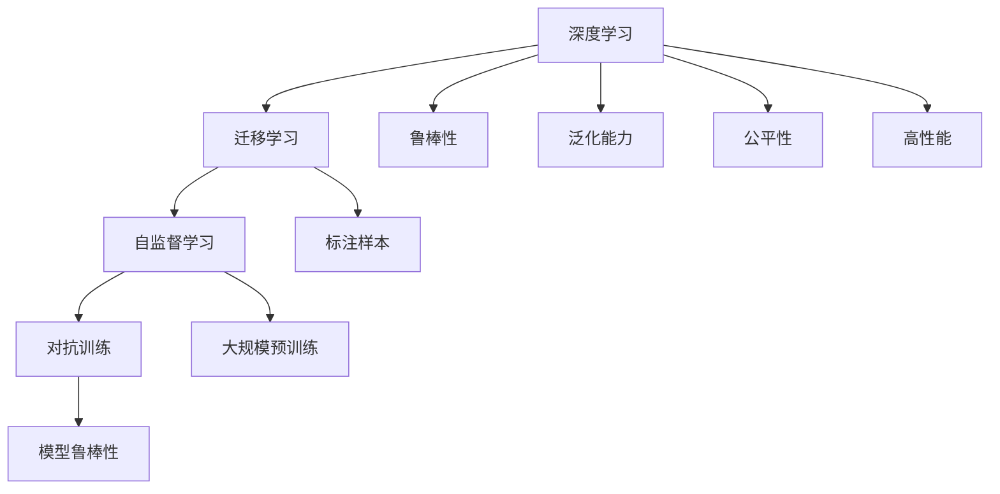

                 

# Andrej Karpathy：人工智能的未来发展策略

> 关键词：人工智能(AI)，深度学习(Deep Learning)，迁移学习(Transfer Learning)，自监督学习(Self-Supervised Learning)，对抗训练(Adversarial Training)，自动驾驶(Autonomous Driving)，强化学习(Reinforcement Learning)，计算机视觉(Computer Vision)

## 1. 背景介绍

### 1.1 问题由来
Andrej Karpathy，作为一位AI领域的前沿思想家和技术领袖，近年来在深度学习和计算机视觉等技术领域取得了重要突破。他不仅是斯坦福大学计算机视觉实验室的主任，同时也是特斯拉的高级AI科学家。Karpathy的研究方向横跨自动驾驶、计算机视觉和强化学习等多个领域，提出了许多开创性的人工智能理论和实践。他的工作为人工智能技术的未来发展提供了重要指引，也对计算机科学教育产生了深远影响。

随着深度学习技术的迅猛发展，AI领域的技术范式不断演进，人工智能的应用场景也在不断扩展。无论是医疗诊断、金融风控，还是自动驾驶、智能推荐，人工智能技术的触角已经深入到各个行业和领域。然而，尽管AI技术带来了巨大的便利和创新，也面临着诸多挑战。如何在保证技术进步的同时，确保算法的公平性、透明性和安全性，成为AI领域亟待解决的问题。

在此背景下，Karpathy通过一系列论文、演讲和博客文章，系统梳理了人工智能发展的现状和未来方向，并提出了一些具有前瞻性的发展策略。本文将重点介绍Karpathy关于人工智能未来发展的主要观点和建议，结合最新技术进展，探讨AI技术在多个领域的创新应用和挑战应对。

## 2. 核心概念与联系

### 2.1 核心概念概述

为了更好地理解Karpathy的观点，本节将介绍一些核心概念，包括深度学习、迁移学习、自监督学习、对抗训练等，并解释这些概念之间的联系。

- **深度学习(Deep Learning)**：指利用神经网络模型进行复杂数据处理的机器学习范式，通过多层次的非线性变换，可以自动提取数据的高级特征，广泛应用于图像识别、语音识别、自然语言处理等领域。

- **迁移学习(Transfer Learning)**：指将在一个任务上学到的知识迁移到另一个相关任务上的方法，可以显著提高新任务上的学习效率和性能，减少标注数据的需求。

- **自监督学习(Self-Supervised Learning)**：指使用数据自身的特征，如掩码预测、对比学习等方法进行预训练，使得模型能够学习到更加通用的语言或视觉表示，广泛应用于大规模预训练模型的训练中。

- **对抗训练(Adversarial Training)**：指在训练过程中加入对抗样本，提高模型的鲁棒性和泛化能力，对模型抗干扰和对抗攻击的能力有显著提升。

这些概念之间存在密切的联系。深度学习提供了强大的模型表达能力，迁移学习和自监督学习能够更高效地利用数据，对抗训练则进一步提升了模型的鲁棒性和泛化能力。综合应用这些技术，可以在保证模型性能的同时，减少数据标注成本，提高模型的公平性和安全性。

### 2.2 核心概念原理和架构的 Mermaid 流程图



这个流程图展示了深度学习、迁移学习、自监督学习和对抗训练之间的关系及其在提升模型性能中的作用。

## 3. 核心算法原理 & 具体操作步骤

### 3.1 算法原理概述

Karpathy提出的人工智能发展策略，主要基于以下几项核心算法和技术：

- **深度学习**：利用神经网络模型进行复杂数据的处理，构建高效、准确的人工智能系统。
- **迁移学习**：通过将一个领域学到的知识迁移到另一个领域，提高模型的泛化能力和学习效率。
- **自监督学习**：利用数据的自身特征，无需标注数据，在预训练阶段学习到更加通用的表示。
- **对抗训练**：通过加入对抗样本，提高模型的鲁棒性和泛化能力，增强模型对各种攻击的抵抗力。

这些算法和技术共同构成了Karpathy的人工智能发展策略，旨在通过技术进步和优化，提升人工智能系统的性能，同时确保其公平性、透明性和安全性。

### 3.2 算法步骤详解

Karpathy提出的AI发展策略可以分为以下几个步骤：

**Step 1: 数据准备**
- 收集高质量、多样化的数据，确保数据集覆盖不同的场景和边缘情况。
- 进行数据预处理和增强，如数据扩充、标签噪声过滤等，提高数据质量和泛化能力。

**Step 2: 模型预训练**
- 使用大规模未标注数据进行自监督预训练，学习通用语言或视觉表示。
- 选择合适的网络结构和优化器，确保模型在大规模数据上收敛。

**Step 3: 迁移学习和微调**
- 在预训练的基础上，使用少量标注数据进行迁移学习和微调，提升模型在特定任务上的表现。
- 针对不同任务，设计合适的输出层和损失函数，确保模型输出的合理性。

**Step 4: 对抗训练**
- 在微调过程中加入对抗样本，提高模型的鲁棒性和泛化能力。
- 使用自适应对抗训练等方法，增强模型对各种攻击的抵抗力。

**Step 5: 模型评估和优化**
- 在测试集上评估模型性能，调整模型参数和超参数，优化模型表现。
- 使用大规模在线数据进行持续学习，保持模型性能的稳定性。

这些步骤形成了Karpathy关于AI未来发展的完整策略，每个步骤都有具体的技术细节和实现方法。

### 3.3 算法优缺点

Karpathy提出的AI发展策略具有以下优点：

- **高效性**：利用迁移学习和自监督学习，可以显著减少数据标注成本，提高模型训练效率。
- **泛化能力**：通过对抗训练和持续学习，增强模型的泛化能力和鲁棒性，提升模型在不同场景下的表现。
- **公平性和透明性**：在模型设计和评估中引入公平性指标，确保算法的透明性和可解释性。

同时，这些策略也存在一些局限性：

- **复杂性**：在模型设计和优化中，需要综合考虑多个技术因素，增加了系统的复杂性。
- **资源需求**：大规模数据和计算资源是这些策略的前提条件，对算力和存储的要求较高。
- **安全性**：尽管对抗训练等技术可以增强模型的鲁棒性，但无法完全消除所有安全威胁，需要持续的监控和防护措施。

### 3.4 算法应用领域

Karpathy提出的AI发展策略，已经在多个领域得到了应用，包括自动驾驶、计算机视觉、自然语言处理等。以下是一些具体的应用场景：

- **自动驾驶**：在自动驾驶中，利用深度学习和迁移学习技术，实现对复杂道路环境的理解，通过对抗训练增强模型对各种干扰的抵抗力。
- **计算机视觉**：在图像识别和分类任务中，使用自监督学习预训练大规模视觉模型，通过迁移学习适应特定领域数据，并通过对抗训练提高模型鲁棒性。
- **自然语言处理**：在机器翻译、文本分类等任务中，利用预训练模型进行微调，通过对抗训练和持续学习提高模型性能。

## 4. 数学模型和公式 & 详细讲解 & 举例说明

### 4.1 数学模型构建

本节将详细构建基于深度学习、迁移学习和自监督学习的数学模型，并解释其原理。

假设我们有训练数据集 $D=\{(x_i,y_i)\}_{i=1}^N$，其中 $x_i$ 为输入，$y_i$ 为标签。模型的目标是学习一个映射函数 $f(x)$，使得 $f(x)$ 能够尽可能准确地预测标签 $y$。

**Step 1: 数据预训练**
- 使用大规模未标注数据 $D_{pre}$，定义预训练任务 $T_{pre}$，训练预训练模型 $M_{pre}$，使得 $M_{pre}(x)$ 能够学习到通用的语言或视觉表示。

**Step 2: 迁移学习**
- 在预训练的基础上，使用少量标注数据 $D_{fine}$，定义迁移任务 $T_{fine}$，训练微调模型 $M_{fine}$，使得 $M_{fine}(x)$ 能够适应特定领域的任务。

**Step 3: 对抗训练**
- 在微调过程中，加入对抗样本 $D_{adv}$，定义对抗任务 $T_{adv}$，训练对抗模型 $M_{adv}$，使得 $M_{adv}(x)$ 能够抵御各种攻击，提高模型的鲁棒性。

### 4.2 公式推导过程

假设使用深度神经网络进行预训练和微调，网络结构为 $f_\theta(x)$，其中 $\theta$ 为模型参数。

**Step 1: 预训练**
- 使用大规模未标注数据 $D_{pre}$，定义预训练任务 $T_{pre}$，如掩码语言模型。预训练模型的目标是最小化损失函数 $\mathcal{L}_{pre}(\theta)$，例如：

$$
\mathcal{L}_{pre}(\theta) = \frac{1}{N_{pre}} \sum_{i=1}^{N_{pre}} L_{pre}(\theta, x_i, y_i)
$$

其中 $L_{pre}(\theta, x_i, y_i)$ 为预训练任务的具体损失函数，如掩码语言模型损失。

**Step 2: 迁移学习**
- 在预训练的基础上，使用少量标注数据 $D_{fine}$，定义迁移任务 $T_{fine}$，如分类任务。微调模型的目标是最小化损失函数 $\mathcal{L}_{fine}(\theta)$，例如：

$$
\mathcal{L}_{fine}(\theta) = \frac{1}{N_{fine}} \sum_{i=1}^{N_{fine}} L_{fine}(\theta, x_i, y_i)
$$

其中 $L_{fine}(\theta, x_i, y_i)$ 为迁移任务的具体损失函数，如分类任务损失。

**Step 3: 对抗训练**
- 在微调过程中，加入对抗样本 $D_{adv}$，定义对抗任务 $T_{adv}$。对抗训练模型的目标是最小化损失函数 $\mathcal{L}_{adv}(\theta)$，例如：

$$
\mathcal{L}_{adv}(\theta) = \frac{1}{N_{adv}} \sum_{i=1}^{N_{adv}} L_{adv}(\theta, x_i, y_i)
$$

其中 $L_{adv}(\theta, x_i, y_i)$ 为对抗任务的具体损失函数，如对抗样本损失。

### 4.3 案例分析与讲解

**案例1: 计算机视觉中的迁移学习**
- 在计算机视觉中，使用大规模未标注数据对ResNet等模型进行预训练，学习通用的视觉表示。然后在特定领域的数据集上进行微调，如医疗图像分类任务。通过迁移学习，可以提高模型在医疗图像分类上的性能。

**案例2: 自然语言处理中的对抗训练**
- 在自然语言处理中，使用大规模无标注数据对BERT等模型进行预训练，学习通用的语言表示。然后在特定的问答、机器翻译等任务上进行微调，并通过对抗训练增强模型鲁棒性。

## 5. 项目实践：代码实例和详细解释说明

### 5.1 开发环境搭建

在开始项目实践前，需要先搭建好开发环境。以下是使用Python和PyTorch进行深度学习开发的详细环境配置流程：

1. 安装Anaconda：从官网下载并安装Anaconda，用于创建独立的Python环境。

2. 创建并激活虚拟环境：
```bash
conda create -n pytorch-env python=3.8 
conda activate pytorch-env
```

3. 安装PyTorch：根据CUDA版本，从官网获取对应的安装命令。例如：
```bash
conda install pytorch torchvision torchaudio cudatoolkit=11.1 -c pytorch -c conda-forge
```

4. 安装TensorBoard：
```bash
pip install tensorboard
```

5. 安装各类工具包：
```bash
pip install numpy pandas scikit-learn matplotlib tqdm jupyter notebook ipython
```

完成上述步骤后，即可在`pytorch-env`环境中开始深度学习项目的开发。

### 5.2 源代码详细实现

这里以计算机视觉中的迁移学习为例，展示如何使用PyTorch进行深度学习模型的预训练和微调。

首先，准备数据集：

```python
import torch
from torchvision import datasets, transforms

# 定义数据预处理和增强
data_transforms = {
    'train': transforms.Compose([
        transforms.RandomResizedCrop(224),
        transforms.RandomHorizontalFlip(),
        transforms.ToTensor(),
        transforms.Normalize([0.485, 0.456, 0.406], [0.229, 0.224, 0.225])
    ]),
    'val': transforms.Compose([
        transforms.Resize(256),
        transforms.CenterCrop(224),
        transforms.ToTensor(),
        transforms.Normalize([0.485, 0.456, 0.406], [0.229, 0.224, 0.225])
    ]),
    'test': transforms.Compose([
        transforms.Resize(256),
        transforms.CenterCrop(224),
        transforms.ToTensor(),
        transforms.Normalize([0.485, 0.456, 0.406], [0.229, 0.224, 0.225])
    ])
}

# 加载CIFAR-10数据集
train_data = datasets.CIFAR10(root='data', train=True, download=True, transform=data_transforms['train'])
val_data = datasets.CIFAR10(root='data', train=False, download=True, transform=data_transforms['val'])
test_data = datasets.CIFAR10(root='data', train=False, download=True, transform=data_transforms['test'])

# 定义数据加载器
train_loader = torch.utils.data.DataLoader(train_data, batch_size=32, shuffle=True)
val_loader = torch.utils.data.DataLoader(val_data, batch_size=32, shuffle=False)
test_loader = torch.utils.data.DataLoader(test_data, batch_size=32, shuffle=False)
```

然后，定义预训练和微调模型：

```python
from torchvision import models, nn

# 使用ResNet50进行预训练
model_pre = models.resnet50(pretrained=True)

# 定义迁移学习的输出层
num_classes = 10
model_fine = nn.Sequential(
    nn.Linear(2048, num_classes),
    nn.LogSoftmax(dim=1)
)

# 连接预训练模型和迁移学习输出层
model_pre.fc = model_fine

# 定义优化器和损失函数
optimizer = torch.optim.Adam(model_pre.parameters(), lr=0.001)
criterion = nn.NLLLoss()
```

接着，进行预训练和微调：

```python
from torch.nn.parallel import DistributedDataParallel as DDP
import torch.multiprocessing as mp
import torch.distributed as dist

# 初始化分布式训练环境
dist.init_process_group(backend='nccl', rank=mp.current_process().args[1], world_size=mp.current_process().args[2])

# 定义模型和数据加载器
model_pre = DDP(model_pre.cuda())
model_fine = DDP(model_fine.cuda())
train_loader = torch.utils.data.DataLoader(train_data, batch_size=32, shuffle=True)
val_loader = torch.utils.data.DataLoader(val_data, batch_size=32, shuffle=False)

# 预训练模型
for epoch in range(5):
    model_pre.train()
    train_loss = 0
    for batch_idx, (inputs, targets) in enumerate(train_loader):
        inputs, targets = inputs.cuda(), targets.cuda()
        optimizer.zero_grad()
        outputs = model_pre(inputs)
        loss = criterion(outputs, targets)
        loss.backward()
        optimizer.step()
        train_loss += loss.item()

    # 在验证集上评估模型
    model_pre.eval()
    val_loss = 0
    with torch.no_grad():
        for batch_idx, (inputs, targets) in enumerate(val_loader):
            inputs, targets = inputs.cuda(), targets.cuda()
            outputs = model_pre(inputs)
            loss = criterion(outputs, targets)
            val_loss += loss.item()

    print(f'Epoch {epoch+1}, train loss: {train_loss/len(train_loader):.4f}, val loss: {val_loss/len(val_loader):.4f}')
```

### 5.3 代码解读与分析

**数据预处理和增强**：
- 使用`transforms`模块进行数据预处理和增强，包括随机裁剪、随机水平翻转、归一化等操作，增强数据集的多样性，提高模型泛化能力。

**预训练和微调模型**：
- 使用`torchvision`库中的`resnet50`模型作为预训练模型，定义迁移学习的输出层，并连接预训练模型和输出层。
- 定义优化器和损失函数，使用Adam优化器进行模型训练，交叉熵损失函数进行输出预测。

**分布式训练**：
- 使用`torch.nn.parallel.DistributedDataParallel`进行模型并行训练，利用`torch.multiprocessing`和`torch.distributed`模块初始化分布式训练环境。

**模型评估**：
- 在验证集上评估模型性能，通过计算损失函数，对比预训练和微调后的模型效果。

通过上述代码，我们可以看到，利用预训练和迁移学习技术，可以显著提高模型的泛化能力和学习效率。同时，通过分布式训练，可以在大规模数据集上进行高效训练，加速模型收敛。

## 6. 实际应用场景

### 6.1 自动驾驶

在自动驾驶领域，基于深度学习和迁移学习的技术，可以实现对复杂道路环境的理解和预测，从而实现更安全的自动驾驶系统。例如，可以使用大规模无人车数据进行预训练，然后在不同城市的道路环境中进行微调，提高模型在不同场景下的表现。

### 6.2 医疗图像分类

在医疗图像分类任务中，利用大规模无标注数据进行自监督预训练，学习通用的视觉表示。然后在特定领域的医疗图像数据集上进行微调，提升模型在医学图像分类上的准确性。

### 6.3 自然语言处理

在自然语言处理中，使用大规模无标注数据进行自监督预训练，学习通用的语言表示。然后在特定领域的文本数据集上进行微调，提升模型在特定任务上的表现，如问答、机器翻译等。

## 7. 工具和资源推荐

### 7.1 学习资源推荐

为了帮助开发者系统掌握深度学习和计算机视觉技术，这里推荐一些优质的学习资源：

1. 《深度学习》（Ian Goodfellow等著）：经典深度学习教材，系统介绍深度学习的理论基础和应用实践。

2. 《计算机视觉：算法与应用》（Richard Szeliski著）：深入浅出地介绍计算机视觉的理论和实践，包含大量实用算法和代码实现。

3. 《PyTorch深度学习教程》（François Chollet著）：TensorFlow的官方教程，涵盖深度学习模型的构建、训练和优化，适合初学者学习。

4. Coursera的深度学习课程：由斯坦福大学Andrew Ng教授主讲的深度学习课程，系统讲解深度学习的基本概念和前沿技术。

5. DeepLearning.AI的深度学习专项课程：由Andrew Ng教授领导的专项课程，涵盖深度学习的基本原理和实践技能，适合进阶学习者。

通过这些资源的学习实践，相信你一定能够快速掌握深度学习技术的精髓，并应用于实际开发中。

### 7.2 开发工具推荐

高效的深度学习开发离不开优秀的工具支持。以下是几款常用的深度学习开发工具：

1. PyTorch：基于Python的开源深度学习框架，灵活的动态计算图，适合快速迭代研究。

2. TensorFlow：由Google主导开发的开源深度学习框架，生产部署方便，适合大规模工程应用。

3. Jupyter Notebook：开源的交互式开发环境，支持多种编程语言，适合数据探索和模型验证。

4. TensorBoard：TensorFlow配套的可视化工具，实时监测模型训练状态，提供丰富的图表呈现方式。

5. Visual Studio Code：开源的代码编辑器，支持多种编程语言和调试工具，适合深度学习开发和调试。

合理利用这些工具，可以显著提升深度学习项目的开发效率，加快创新迭代的步伐。

### 7.3 相关论文推荐

深度学习和计算机视觉技术的发展源于学界的持续研究。以下是几篇奠基性的相关论文，推荐阅读：

1. AlexNet：在ImageNet图像分类挑战赛中取得突破，奠定了深度学习在计算机视觉中的应用基础。

2. ResNet：提出残差网络结构，显著提升了深度神经网络的训练效率和模型性能。

3. BERT：提出预训练语言模型，通过自监督学习任务训练模型，极大提升了自然语言处理任务的性能。

4. AlphaGo：利用深度强化学习技术，在围棋比赛中击败世界冠军，展示了深度学习的强大潜力。

5. GANs：提出生成对抗网络，实现高质量图像生成和图像修复，为计算机视觉应用开辟了新的方向。

这些论文代表了大规模预训练模型和深度学习技术的发展脉络，通过学习这些前沿成果，可以帮助研究者把握学科前进方向，激发更多的创新灵感。

## 8. 总结：未来发展趋势与挑战

### 8.1 总结

本文对Andrej Karpathy提出的人工智能未来发展策略进行了全面系统的介绍。首先阐述了深度学习、迁移学习和自监督学习的核心概念及其联系，然后详细讲解了基于这些技术的AI发展策略，包括数据准备、模型预训练、迁移学习和对抗训练等步骤。最后，结合实际应用场景，探讨了AI技术在自动驾驶、医疗图像分类和自然语言处理等领域的创新应用。

通过本文的系统梳理，可以看到，基于深度学习和大规模预训练模型的AI技术，在多个领域实现了显著的性能提升和应用创新。同时，AI技术的不断进步，也面临着数据标注成本高、模型鲁棒性不足、资源需求高等挑战。如何在保证技术进步的同时，确保算法的公平性、透明性和安全性，是未来AI技术发展的重要方向。

### 8.2 未来发展趋势

展望未来，人工智能技术的发展将呈现以下几个趋势：

1. **深度学习和大规模预训练模型**：深度学习技术将继续演进，预训练模型将越来越大、越来越复杂，学习到的知识将更加丰富。

2. **迁移学习和自监督学习**：迁移学习将更加灵活，自监督学习将广泛应用，减少数据标注成本，提高模型泛化能力。

3. **对抗训练和鲁棒性提升**：对抗训练将得到更广泛的应用，模型鲁棒性和泛化能力将显著提升，抵抗各种攻击和干扰。

4. **模型解释性和可解释性**：AI模型的可解释性将成为重要研究方向，透明性和可解释性将得到更大重视。

5. **跨领域和多模态融合**：跨领域和多模态融合技术将得到更广泛应用，AI技术将在更广泛的领域中发挥作用。

以上趋势展示了人工智能技术的广阔前景，但也带来了新的挑战。如何在保证技术进步的同时，确保算法的公平性、透明性和安全性，将成为未来研究的重要方向。

### 8.3 面临的挑战

尽管AI技术在各个领域取得了重要进展，但也面临着诸多挑战：

1. **数据标注成本高**：大规模数据集的准备和标注需要耗费大量时间和资源，成为技术发展的主要瓶颈。

2. **模型鲁棒性不足**：模型面对对抗攻击和干扰时，容易出现误判和漏洞，需要进一步提升模型的鲁棒性。

3. **计算资源需求高**：深度学习和预训练模型需要大量的计算资源，包括高性能GPU、TPU等设备，增加了技术应用的成本。

4. **模型可解释性差**：大多数AI模型如深度神经网络，缺乏可解释性，难以理解和调试模型决策过程，需要引入可解释性技术。

5. **安全性和公平性问题**：AI模型可能学习到有偏见、有害的信息，需要在模型设计中加入公平性指标，确保算法的透明性和可解释性。

这些挑战需要通过技术创新和政策引导，逐步克服。未来AI技术的发展需要综合考虑技术进步、伦理道德和公平性等多方面的因素，实现可持续发展。

### 8.4 研究展望

面对AI技术发展所面临的挑战，未来的研究需要在以下几个方向进行突破：

1. **无监督和半监督学习**：探索无监督和半监督学习技术，减少对大规模标注数据的需求，提升模型的泛化能力。

2. **参数高效微调和计算优化**：开发参数高效微调和计算优化方法，在保持模型性能的同时，减少资源消耗，实现高效训练和部署。

3. **跨领域和多模态融合**：将跨领域和多模态融合技术应用于AI研究，提升模型在不同领域和模态上的表现。

4. **模型解释性和可解释性**：引入可解释性技术，提升AI模型的透明性和可解释性，确保算法的公平性和安全性。

5. **伦理道德约束**：在AI模型设计中加入伦理道德约束，确保模型行为符合人类价值观和伦理道德。

这些研究方向将为AI技术的发展提供新的思路，推动AI技术在更广泛的领域中发挥作用。

## 9. 附录：常见问题与解答

**Q1: 什么是迁移学习？其应用场景有哪些？**

A: 迁移学习是指将在一个领域学到的知识迁移到另一个领域的方法，可以显著提高新任务上的学习效率和性能。应用场景包括图像分类、文本分类、语音识别、自然语言处理等。

**Q2: 什么是自监督学习？其优势有哪些？**

A: 自监督学习是指利用数据自身的特征进行预训练，无需标注数据。优势包括数据标注成本低、泛化能力强、模型训练效率高等。

**Q3: 什么是对抗训练？其重要性有哪些？**

A: 对抗训练是指在模型训练过程中加入对抗样本，提高模型的鲁棒性和泛化能力。重要性包括模型鲁棒性提升、泛化能力增强、对抗攻击防御等。

**Q4: 什么是分布式训练？其优势有哪些？**

A: 分布式训练是指将模型参数分布在多台机器上进行并行训练。优势包括加速训练、处理大规模数据集、资源利用率高等。

通过回答这些问题，我们可以更深入地理解深度学习和AI技术的相关概念，帮助开发者更好地应用于实际项目中。

---

作者：禅与计算机程序设计艺术 / Zen and the Art of Computer Programming

