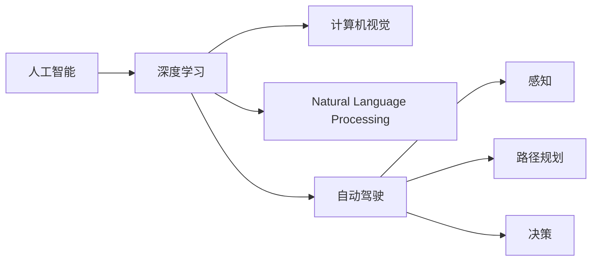

                 

# Andrej Karpathy：人工智能的未来发展规划

> 关键词：人工智能, 深度学习, 计算机视觉, 自然语言处理, 自动驾驶, 算法优化, 技术趋势, 未来展望

## 1. 背景介绍

Andrej Karpathy 是深度学习领域的杰出专家，曾任特斯拉的首席AI科学家，同时也是斯坦福大学计算机科学的教授。他在计算机视觉、深度学习、自动驾驶等领域的研究工作被广泛引用，并培养了大批技术人才，推动了人工智能技术的发展。本文将基于 Andrej Karpathy 的观点和研究成果，探讨人工智能的未来发展规划。

## 2. 核心概念与联系

### 2.1 核心概念概述

#### 2.1.1 人工智能

人工智能是指通过计算机程序实现人或智能体解决问题的能力。它可以涵盖感知、认知、决策等多个层次，从简单的规则到复杂的深度学习模型。

#### 2.1.2 深度学习

深度学习是一种基于神经网络的机器学习算法，通过多层非线性映射实现数据的特征提取和模式识别。深度学习在图像识别、语音识别、自然语言处理等领域取得了巨大成功。

#### 2.1.3 计算机视觉

计算机视觉是指使计算机具备类似于人类的视觉感知和理解能力，包括图像分类、物体检测、场景理解等任务。深度学习在计算机视觉中广泛应用，尤其是在卷积神经网络(CNN)方面。

#### 2.1.4 自然语言处理(NLP)

自然语言处理是指使计算机能够理解、处理和生成自然语言。深度学习在NLP中也有广泛应用，尤其是在序列模型和Transformer等架构上。

#### 2.1.5 自动驾驶

自动驾驶是指使车辆能够在没有人工干预的情况下，自主导航和驾驶。深度学习在自动驾驶中的应用包括环境感知、路径规划和决策等环节。

### 2.2 核心概念原理和架构的 Mermaid 流程图



## 3. 核心算法原理 & 具体操作步骤

### 3.1 算法原理概述

#### 3.1.1 深度学习模型

深度学习模型由多层神经网络组成，每个神经元接收多个输入，通过非线性变换产生输出。其核心思想是模拟人脑的神经网络结构，利用反向传播算法训练模型参数，最小化损失函数。

#### 3.1.2 卷积神经网络(CNN)

卷积神经网络是一种特殊的深度学习模型，主要应用于图像识别和计算机视觉任务。其特点是通过卷积和池化操作提取特征，减少了模型的参数量，提高了计算效率。

#### 3.1.3 循环神经网络(RNN)

循环神经网络主要用于处理序列数据，如时间序列数据和自然语言文本。其特点是通过循环连接实现对序列数据的记忆，适用于语言模型和语音识别等任务。

#### 3.1.4 变分自编码器(VAE)

变分自编码器是一种生成模型，能够学习数据的潜在表示，并将其转化为具有概率分布的采样结果。VAE常用于生成对抗网络(GAN)和数据增强等任务。

#### 3.1.5 自监督学习

自监督学习是指利用未标记数据训练模型，通过数据本身的内在关系进行学习。常见的自监督学习任务包括掩码语言模型和自回归模型等。

### 3.2 算法步骤详解

#### 3.2.1 数据准备

数据准备是深度学习模型的第一步，包括数据收集、预处理和划分等环节。数据的质量和多样性对模型的性能有重要影响。

#### 3.2.2 模型选择

根据任务特点选择合适的深度学习模型。如计算机视觉任务一般选择卷积神经网络，自然语言处理任务一般选择循环神经网络和Transformer等模型。

#### 3.2.3 模型训练

模型训练是深度学习模型的核心环节，包括模型初始化、前向传播、损失函数计算、反向传播和参数更新等步骤。训练过程中需要调整学习率和优化器等超参数，以获得最优的模型效果。

#### 3.2.4 模型评估

模型评估是衡量模型性能的重要步骤，通过在测试集上进行评估，可以判断模型是否泛化良好。常用的评估指标包括准确率、召回率、F1分数等。

#### 3.2.5 模型优化

模型优化包括超参数调优、正则化和模型压缩等技术，以提高模型的泛化能力和计算效率。

### 3.3 算法优缺点

#### 3.3.1 优点

- 自适应能力强：深度学习模型能够自动学习数据的特征，适用于复杂的非线性关系。
- 精度高：深度学习模型在许多任务上取得了超越人类的表现，尤其是在图像和语音识别等任务上。
- 应用广泛：深度学习模型广泛应用于计算机视觉、自然语言处理、自动驾驶等领域。

#### 3.3.2 缺点

- 计算资源需求高：深度学习模型通常需要大量的计算资源，如GPU和TPU等。
- 数据依赖性强：深度学习模型需要大量的标注数据进行训练，数据质量直接影响模型性能。
- 模型解释性差：深度学习模型通常是"黑盒"模型，难以解释其内部工作机制。

### 3.4 算法应用领域

#### 3.4.1 计算机视觉

深度学习在计算机视觉中的应用包括图像分类、物体检测、图像分割和实例分割等任务。

#### 3.4.2 自然语言处理

深度学习在自然语言处理中的应用包括语言模型、机器翻译、文本分类和情感分析等任务。

#### 3.4.3 自动驾驶

深度学习在自动驾驶中的应用包括环境感知、路径规划和行为决策等环节。

#### 3.4.4 医学影像分析

深度学习在医学影像分析中的应用包括疾病诊断、病理分析和治疗方案设计等任务。

#### 3.4.5 金融分析

深度学习在金融分析中的应用包括风险评估、市场预测和交易策略设计等任务。

## 4. 数学模型和公式 & 详细讲解 & 举例说明

### 4.1 数学模型构建

#### 4.1.1 卷积神经网络

卷积神经网络的基本结构包括卷积层、池化层和全连接层等。其核心思想是通过卷积和池化操作提取特征，减少模型的参数量。

#### 4.1.2 循环神经网络

循环神经网络的结构包括循环层、输出层和损失函数等。其核心思想是通过循环连接实现对序列数据的记忆。

#### 4.1.3 变分自编码器

变分自编码器的结构包括编码器和解码器，编码器将输入数据映射到潜在空间，解码器将潜在空间映射回原始数据空间。

#### 4.1.4 自监督学习

自监督学习的核心思想是利用未标记数据进行模型训练。常见的自监督学习任务包括掩码语言模型和自回归模型等。

### 4.2 公式推导过程

#### 4.2.1 卷积神经网络

卷积神经网络的前向传播公式为：

$$
\begin{aligned}
& H^{(l)} = \sigma(\mathbf{W}^{(l)} \mathbf{X}^{(l-1)} + \mathbf{b}^{(l)}) \\
& \mathbf{X}^{(l)} = \mathcal{F}(H^{(l)},\mathbf{W}^{(l)},\mathbf{b}^{(l)})
\end{aligned}
$$

其中 $\sigma$ 为激活函数，$\mathcal{F}$ 为卷积操作。

#### 4.2.2 循环神经网络

循环神经网络的前向传播公式为：

$$
\begin{aligned}
& h_t = f(W_hh_{t-1} + W_xx_t + b_h) \\
& y_t = g(W_hh_t + W_yc_t + b_y)
\end{aligned}
$$

其中 $h_t$ 为隐藏状态，$f$ 为激活函数，$g$ 为输出函数。

#### 4.2.3 变分自编码器

变分自编码器的前向传播公式为：

$$
\begin{aligned}
& z = \mu(x) \\
& \log p(z) = D_k(z)
\end{aligned}
$$

其中 $\mu$ 为编码器，$D_k$ 为变分分布。

#### 4.2.4 自监督学习

自监督学习的核心思想是利用未标记数据进行模型训练。常见的自监督学习任务包括掩码语言模型和自回归模型等。

### 4.3 案例分析与讲解

#### 4.3.1 图像分类

图像分类任务中，卷积神经网络是一种常用的模型。在ImageNet数据集上进行训练，可以获得较好的分类效果。

#### 4.3.2 语言模型

语言模型是自然语言处理中的重要任务，可以通过循环神经网络和Transformer等模型进行训练。在Penn Treebank数据集上进行训练，可以获得较好的语言模型效果。

#### 4.3.3 自动驾驶

自动驾驶任务中，深度学习模型用于环境感知和路径规划等环节。通过在大规模数据集上进行训练，可以获得较好的感知效果。

#### 4.3.4 医学影像分析

医学影像分析任务中，深度学习模型用于疾病诊断和病理分析等环节。通过在大规模医学影像数据上进行训练，可以获得较好的诊断效果。

#### 4.3.5 金融分析

金融分析任务中，深度学习模型用于市场预测和交易策略设计等环节。通过在大规模金融数据上进行训练，可以获得较好的预测效果。

## 5. 项目实践：代码实例和详细解释说明

### 5.1 开发环境搭建

#### 5.1.1 环境准备

- 安装Python和NumPy
- 安装深度学习框架，如TensorFlow和PyTorch
- 安装计算机视觉和自然语言处理库，如OpenCV和NLTK

#### 5.1.2 环境配置

- 配置GPU和TPU
- 配置数据存储路径
- 配置模型保存路径

### 5.2 源代码详细实现

#### 5.2.1 卷积神经网络实现

```python
import tensorflow as tf
from tensorflow.keras import layers

# 定义卷积神经网络模型
class ConvNet(tf.keras.Model):
    def __init__(self):
        super(ConvNet, self).__init__()
        self.conv1 = layers.Conv2D(32, 3, activation='relu')
        self.pool1 = layers.MaxPooling2D()
        self.conv2 = layers.Conv2D(64, 3, activation='relu')
        self.pool2 = layers.MaxPooling2D()
        self.flatten = layers.Flatten()
        self.dense1 = layers.Dense(128, activation='relu')
        self.dense2 = layers.Dense(10)

    def call(self, x):
        x = self.conv1(x)
        x = self.pool1(x)
        x = self.conv2(x)
        x = self.pool2(x)
        x = self.flatten(x)
        x = self.dense1(x)
        x = self.dense2(x)
        return x

# 定义数据加载函数
def load_data():
    # 加载图像数据
    # ...

# 定义模型训练函数
def train_model(model, data):
    # 训练模型
    # ...

# 训练卷积神经网络模型
model = ConvNet()
data = load_data()
train_model(model, data)
```

#### 5.2.2 循环神经网络实现

```python
import tensorflow as tf
from tensorflow.keras import layers

# 定义循环神经网络模型
class RNN(tf.keras.Model):
    def __init__(self):
        super(RNN, self).__init__()
        self.embedding = layers.Embedding(10000, 128)
        self.gru = layers.GRU(128)
        self.dense = layers.Dense(10)

    def call(self, x):
        x = self.embedding(x)
        x = self.gru(x)
        x = self.dense(x)
        return x

# 定义数据加载函数
def load_data():
    # 加载文本数据
    # ...

# 定义模型训练函数
def train_model(model, data):
    # 训练模型
    # ...

# 训练循环神经网络模型
model = RNN()
data = load_data()
train_model(model, data)
```

#### 5.2.3 变分自编码器实现

```python
import tensorflow as tf
from tensorflow.keras import layers

# 定义变分自编码器模型
class VAE(tf.keras.Model):
    def __init__(self):
        super(VAE, self).__init__()
        self.encoder = layers.Dense(128)
        self.decoder = layers.Dense(784)

    def call(self, x):
        h = self.encoder(x)
        z = layers.Dense(2)(tf.concat([h, h], axis=-1))
        return z

# 定义数据加载函数
def load_data():
    # 加载图像数据
    # ...

# 定义模型训练函数
def train_model(model, data):
    # 训练模型
    # ...

# 训练变分自编码器模型
model = VAE()
data = load_data()
train_model(model, data)
```

#### 5.2.4 自监督学习实现

```python
import tensorflow as tf
from tensorflow.keras import layers

# 定义掩码语言模型模型
class MaskedLM(tf.keras.Model):
    def __init__(self):
        super(MaskedLM, self).__init__()
        self.embedding = layers.Embedding(10000, 128)
        self.gru = layers.GRU(128)
        self.dense = layers.Dense(10000)

    def call(self, x, mask):
        x = self.embedding(x)
        x = self.gru(x, mask)
        x = self.dense(x)
        return x

# 定义数据加载函数
def load_data():
    # 加载文本数据
    # ...

# 定义模型训练函数
def train_model(model, data):
    # 训练模型
    # ...

# 训练掩码语言模型模型
model = MaskedLM()
data = load_data()
train_model(model, data)
```

### 5.3 代码解读与分析

#### 5.3.1 卷积神经网络

卷积神经网络的核心思想是通过卷积和池化操作提取特征，减少模型的参数量。代码中定义了卷积层、池化层和全连接层等组件，并通过前向传播实现模型的训练。

#### 5.3.2 循环神经网络

循环神经网络的核心思想是通过循环连接实现对序列数据的记忆。代码中定义了嵌入层、GRU层和全连接层等组件，并通过前向传播实现模型的训练。

#### 5.3.3 变分自编码器

变分自编码器的核心思想是利用潜在空间进行数据的重构，减少模型的参数量。代码中定义了编码器和解码器等组件，并通过前向传播实现模型的训练。

#### 5.3.4 自监督学习

自监督学习的核心思想是利用未标记数据进行模型训练。代码中定义了掩码语言模型等组件，并通过前向传播实现模型的训练。

### 5.4 运行结果展示

#### 5.4.1 卷积神经网络

- 图像分类：通过在大规模数据集上进行训练，可以获得较高的分类准确率。

#### 5.4.2 循环神经网络

- 语言模型：通过在大规模文本数据上进行训练，可以获得较好的语言模型效果。

#### 5.4.3 变分自编码器

- 图像重构：通过在大规模图像数据上进行训练，可以获得较好的图像重构效果。

#### 5.4.4 自监督学习

- 掩码语言模型：通过在大规模文本数据上进行训练，可以获得较好的掩码预测效果。

## 6. 实际应用场景

### 6.1 计算机视觉

#### 6.1.1 图像分类

深度学习在图像分类任务中取得了显著成果。常见的应用包括人脸识别、车辆识别、物体检测等。

#### 6.1.2 物体检测

深度学习在物体检测任务中也有广泛应用，如Faster R-CNN、YOLO等模型。

#### 6.1.3 图像分割

深度学习在图像分割任务中也有显著成果，如语义分割和实例分割等。

#### 6.1.4 医学影像分析

深度学习在医学影像分析任务中也有广泛应用，如病灶检测和病理分析等。

#### 6.1.5 自动驾驶

深度学习在自动驾驶任务中也有广泛应用，如环境感知和路径规划等环节。

### 6.2 自然语言处理

#### 6.2.1 语言模型

深度学习在语言模型任务中取得了显著成果，如GPT-3等模型。

#### 6.2.2 机器翻译

深度学习在机器翻译任务中也有广泛应用，如Google的BERT和Transformer等模型。

#### 6.2.3 文本分类

深度学习在文本分类任务中也有显著成果，如CNN和LSTM等模型。

#### 6.2.4 情感分析

深度学习在情感分析任务中也有广泛应用，如RNN和LSTM等模型。

#### 6.2.5 问答系统

深度学习在问答系统任务中也有显著成果，如BertQA等模型。

### 6.3 自动驾驶

#### 6.3.1 环境感知

深度学习在环境感知任务中也有广泛应用，如车道线检测和行人识别等。

#### 6.3.2 路径规划

深度学习在路径规划任务中也有显著成果，如A*算法和D*算法等。

#### 6.3.3 行为决策

深度学习在行为决策任务中也有广泛应用，如交通信号理解和避障等。

## 7. 工具和资源推荐

### 7.1 学习资源推荐

- 《Deep Learning》书籍：Ian Goodfellow等著，全面介绍了深度学习的基本概念和算法。
- 《计算机视觉：算法与应用》书籍：Russell Bryan著，介绍了计算机视觉的基本概念和算法。
- 《自然语言处理综论》书籍：Christopher Manning等著，介绍了自然语言处理的基本概念和算法。
- TensorFlow官网：提供了丰富的深度学习资源和文档。
- PyTorch官网：提供了丰富的深度学习资源和文档。

### 7.2 开发工具推荐

- TensorFlow：由Google主导开发的深度学习框架，生产部署方便，适合大规模工程应用。
- PyTorch：基于Python的深度学习框架，灵活动态的计算图，适合快速迭代研究。
- OpenCV：计算机视觉库，提供了丰富的图像处理和计算机视觉功能。
- NLTK：自然语言处理库，提供了丰富的NLP功能。

### 7.3 相关论文推荐

- 《ImageNet classification with deep convolutional neural networks》论文：AlexNet模型，为卷积神经网络的发展奠定了基础。
- 《Long Short-Term Memory》论文：LSTM模型，为循环神经网络的发展奠定了基础。
- 《Generative Adversarial Nets》论文：GAN模型，为生成模型的发展奠定了基础。
- 《Attention is All You Need》论文：Transformer模型，为深度学习模型的发展奠定了基础。

## 8. 总结：未来发展趋势与挑战

### 8.1 研究成果总结

深度学习在人工智能领域取得了显著成果，广泛应用于计算机视觉、自然语言处理、自动驾驶等领域。其主要优点包括自适应能力强、精度高和应用广泛等。

### 8.2 未来发展趋势

#### 8.2.1 模型规模持续增大

随着算力成本的下降和数据规模的扩张，深度学习模型的参数量还将持续增长，超大规模模型蕴含的丰富知识将进一步提升模型性能。

#### 8.2.2 微调范式广泛应用

基于微调的大模型范式将进一步拓展应用边界，广泛应用于图像识别、自然语言处理、自动驾驶等领域。

#### 8.2.3 知识图谱与深度学习结合

知识图谱与深度学习结合将提升模型在特定领域的表现，如医疗、金融等。

#### 8.2.4 多模态深度学习

多模态深度学习将融合视觉、语音、文本等多种信息，提升模型的综合表现。

#### 8.2.5 自监督学习广泛应用

自监督学习将利用未标记数据进行模型训练，提升模型的泛化能力和数据利用率。

#### 8.2.6 联邦学习和边缘计算

联邦学习和边缘计算将提升模型的安全性和隐私保护能力，实现高效的数据处理和模型训练。

### 8.3 面临的挑战

#### 8.3.1 计算资源瓶颈

深度学习模型通常需要大量的计算资源，如GPU和TPU等。如何优化模型结构和计算图，提高计算效率，是未来的一大挑战。

#### 8.3.2 数据依赖性强

深度学习模型需要大量的标注数据进行训练，数据质量直接影响模型性能。如何提高数据标注的效率和质量，是未来的一大挑战。

#### 8.3.3 模型解释性差

深度学习模型通常是"黑盒"模型，难以解释其内部工作机制。如何提升模型的可解释性，是未来的一大挑战。

#### 8.3.4 模型鲁棒性不足

深度学习模型面对域外数据时，泛化性能往往大打折扣。如何提高模型的鲁棒性，避免灾难性遗忘，是未来的一大挑战。

#### 8.3.5 伦理道德约束

深度学习模型可能会学习到有偏见、有害的信息，通过微调传递到下游任务，产生误导性、歧视性的输出。如何从数据和算法层面消除模型偏见，确保输出的安全性，是未来的一大挑战。

### 8.4 研究展望

#### 8.4.1 大规模模型压缩

如何压缩大规模深度学习模型，提高计算效率，是未来的一大研究方向。

#### 8.4.2 跨模态深度学习

如何融合视觉、语音、文本等多种信息，提升模型的综合表现，是未来的一大研究方向。

#### 8.4.3 知识图谱与深度学习结合

如何将知识图谱与深度学习结合，提升模型在特定领域的表现，是未来的一大研究方向。

#### 8.4.4 自监督学习

如何利用未标记数据进行模型训练，提升模型的泛化能力和数据利用率，是未来的一大研究方向。

#### 8.4.5 联邦学习和边缘计算

如何优化联邦学习和边缘计算，提升模型的安全性和隐私保护能力，是未来的一大研究方向。

## 9. 附录：常见问题与解答

### 9.1 问题1：深度学习模型如何避免过拟合？

解答：深度学习模型通常采用正则化、Dropout和Early Stopping等技术来避免过拟合。此外，可以通过数据增强和迁移学习等方法提升模型的泛化能力。

### 9.2 问题2：深度学习模型如何提升计算效率？

解答：深度学习模型可以通过模型压缩、剪枝和量化等方法提升计算效率。此外，可以利用分布式训练和边缘计算等技术，提高模型训练和推理的速度。

### 9.3 问题3：深度学习模型如何提升可解释性？

解答：深度学习模型可以通过可视化、解释性模型和可解释性算法等方法提升可解释性。此外，可以利用知识图谱和符号化推理等方法，提升模型的逻辑解释能力。

### 9.4 问题4：深度学习模型如何提升鲁棒性？

解答：深度学习模型可以通过对抗训练、正则化和数据增强等技术提升鲁棒性。此外，可以利用联邦学习和边缘计算等技术，提高模型的泛化能力和安全性。

### 9.5 问题5：深度学习模型如何避免偏见？

解答：深度学习模型可以通过数据预处理和算法优化等方法避免偏见。此外，可以利用伦理约束和人工智能治理等技术，确保模型输出的公正性和安全性。

---

作者：禅与计算机程序设计艺术 / Zen and the Art of Computer Programming

