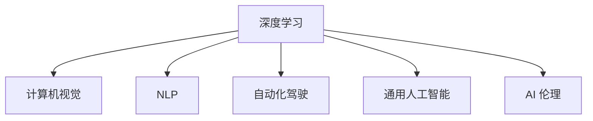

                 

# Andrej Karpathy：人工智能的未来发展规划

> 关键词：人工智能,未来规划,技术趋势,深度学习,计算机视觉,自然语言处理

## 1. 背景介绍

### 1.1 问题由来
Andrej Karpathy，作为人工智能领域著名的研究者、教授、工程师，以其在计算机视觉、深度学习和自动驾驶等方向的前沿研究和贡献而闻名。他在社交媒体上经常发布关于技术趋势的见解，这些见解常常能引起广泛的关注和讨论。近日，他在Twitter上发布了一系列的帖子，讨论了人工智能的未来发展规划。本文将整理并总结他的这些观点，以供读者参考。

### 1.2 问题核心关键点
Karpathy讨论了人工智能的未来发展方向，涵盖了深度学习、计算机视觉、自然语言处理、自动化驾驶等领域。他强调了当前人工智能技术的局限性，同时展望了未来可能的发展趋势。

## 2. 核心概念与联系

### 2.1 核心概念概述

为更好地理解Karpathy的观点，本节将介绍几个密切相关的核心概念：

- 深度学习（Deep Learning）：一种模拟人脑神经网络结构的人工智能技术，通过多层次的非线性变换，从大量数据中学习到高级表示。

- 计算机视觉（Computer Vision）：使计算机能够识别和理解图像、视频等视觉信息的技术。

- 自然语言处理（Natural Language Processing, NLP）：使计算机能够理解、生成和处理人类语言的技术。

- 自动化驾驶（Autonomous Driving）：通过计算机视觉、深度学习等技术，使汽车能够自主导航和决策。

- 通用人工智能（Artificial General Intelligence, AGI）：计算机能够执行任意智能任务，具有类人水平的认知能力。

- 人工智能伦理（AI Ethics）：在人工智能开发和应用过程中，需考虑的伦理问题，如隐私、安全性、公平性等。

这些核心概念之间的逻辑关系可以通过以下Mermaid流程图来展示：



这个流程图展示了大语言模型的核心概念及其之间的关系：

1. 深度学习是计算机视觉、自然语言处理和自动化驾驶的基础。
2. 计算机视觉和自然语言处理是通用人工智能的重要组成部分。
3. AI伦理是所有人工智能技术的共同考量因素。

## 3. 核心算法原理 & 具体操作步骤

### 3.1 算法原理概述

Karpathy在讨论中强调了深度学习的原理和操作步骤。深度学习通过构建多层次的非线性变换，从大量数据中学习到高级表示。这种表示不仅能够捕捉数据中的局部特征，还能学习到全局结构。通过反向传播算法，深度学习模型能够自动调整权重，最小化预测与真实标签之间的差异。

### 3.2 算法步骤详解

深度学习的核心步骤包括数据预处理、模型设计、训练、评估和部署。以计算机视觉为例，常见的深度学习流程如下：

1. **数据预处理**：收集和标注训练数据，进行数据增强、标准化等预处理，使其适合模型训练。
2. **模型设计**：选择合适的深度学习模型，如卷积神经网络（CNN）、循环神经网络（RNN）等，并设计相应的网络结构。
3. **训练**：使用反向传播算法，不断调整模型参数，使其最小化预测误差。
4. **评估**：在验证集上评估模型性能，使用损失函数、准确率等指标衡量模型效果。
5. **部署**：将训练好的模型部署到实际应用中，进行推理预测。

### 3.3 算法优缺点

深度学习的优点在于其强大的表示能力，能够自动从数据中学习到高级特征。同时，由于使用了大量的训练数据，深度学习模型通常具有较高的准确率。然而，深度学习的缺点在于其高昂的计算成本和数据需求，模型训练需要大量的计算资源和大量标注数据。此外，深度学习模型的黑盒特性也使其难以解释和调试。

### 3.4 算法应用领域

深度学习在计算机视觉、自然语言处理、自动化驾驶等领域都有广泛的应用。以计算机视觉为例，深度学习模型已经被应用于图像识别、物体检测、人脸识别、自动驾驶等任务，取得了显著的成果。

## 4. 数学模型和公式 & 详细讲解

### 4.1 数学模型构建

以计算机视觉中的图像分类为例，常见的深度学习模型为卷积神经网络（CNN）。CNN由卷积层、池化层、全连接层等组成。CNN的目标是学习到图像的特征表示，通过多层卷积和池化操作，逐步提取出图像的高层特征。

### 4.2 公式推导过程

CNN的基本公式为：

$$
\mathcal{L}(\theta) = -\frac{1}{N}\sum_{i=1}^N \log P(y_i|x_i; \theta)
$$

其中，$\mathcal{L}$为损失函数，$\theta$为模型参数，$N$为样本数量，$x_i$为输入图像，$y_i$为对应的标签，$P$为模型预测概率分布。

以二分类任务为例，假设模型预测输出为$x_i$的特征表示$z_i$，则：

$$
\mathcal{L}(\theta) = -\frac{1}{N}\sum_{i=1}^N [y_i\log z_i + (1-y_i)\log (1-z_i)]
$$

### 4.3 案例分析与讲解

以AlexNet为例，AlexNet是2012年ImageNet比赛中获胜的深度学习模型，使用了五层卷积和三层全连接层。通过数据增强、随机失速等技术，AlexNet在ImageNet数据集上取得了显著的性能提升。

## 5. 项目实践：代码实例和详细解释说明

### 5.1 开发环境搭建

Karpathy常使用TensorFlow和PyTorch进行深度学习项目的开发。以下是使用PyTorch搭建图像分类模型的环境配置流程：

1. 安装Anaconda：从官网下载并安装Anaconda，用于创建独立的Python环境。

2. 创建并激活虚拟环境：
```bash
conda create -n pytorch-env python=3.8 
conda activate pytorch-env
```

3. 安装PyTorch：根据CUDA版本，从官网获取对应的安装命令。例如：
```bash
conda install pytorch torchvision torchaudio cudatoolkit=11.1 -c pytorch -c conda-forge
```

4. 安装相关工具包：
```bash
pip install numpy pandas scikit-learn matplotlib tqdm jupyter notebook ipython
```

完成上述步骤后，即可在`pytorch-env`环境中开始项目实践。

### 5.2 源代码详细实现

以下是使用PyTorch搭建AlexNet模型的代码实现：

```python
import torch
import torch.nn as nn
import torch.optim as optim
import torchvision.transforms as transforms
from torch.utils.data import DataLoader
from torchvision.datasets import CIFAR10

# 数据预处理
transform = transforms.Compose([
    transforms.RandomCrop(32, padding=4),
    transforms.RandomHorizontalFlip(),
    transforms.ToTensor(),
    transforms.Normalize((0.5, 0.5, 0.5), (0.5, 0.5, 0.5))
])

train_dataset = CIFAR10(root='./data', train=True, transform=transform, download=True)
test_dataset = CIFAR10(root='./data', train=False, transform=transform)

# 定义模型
class AlexNet(nn.Module):
    def __init__(self):
        super(AlexNet, self).__init__()
        self.conv1 = nn.Conv2d(3, 96, kernel_size=11, stride=4, padding=2)
        self.conv2 = nn.Conv2d(96, 256, kernel_size=5, stride=1, padding=2)
        self.conv3 = nn.Conv2d(256, 384, kernel_size=3, stride=1, padding=1)
        self.conv4 = nn.Conv2d(384, 256, kernel_size=3, stride=1, padding=1)
        self.conv5 = nn.Conv2d(256, 256, kernel_size=3, stride=1, padding=1)
        self.fc1 = nn.Linear(256*8*8, 4096)
        self.fc2 = nn.Linear(4096, 4096)
        self.fc3 = nn.Linear(4096, 10)

    def forward(self, x):
        x = F.relu(self.conv1(x))
        x = F.max_pool2d(x, 3, 2)
        x = F.relu(self.conv2(x))
        x = F.max_pool2d(x, 3, 2)
        x = F.relu(self.conv3(x))
        x = F.max_pool2d(x, 3, 2)
        x = F.relu(self.conv4(x))
        x = F.relu(self.conv5(x))
        x = x.view(-1, 256*8*8)
        x = F.relu(self.fc1(x))
        x = F.relu(self.fc2(x))
        x = self.fc3(x)
        return x

# 训练函数
def train(model, device, train_loader, optimizer, epoch):
    model.train()
    for batch_idx, (data, target) in enumerate(train_loader):
        data, target = data.to(device), target.to(device)
        optimizer.zero_grad()
        output = model(data)
        loss = F.cross_entropy(output, target)
        loss.backward()
        optimizer.step()
        if batch_idx % 100 == 0:
            print('Train Epoch: {} [{}/{} ({:.0f}%)]\tLoss: {:.6f}'.format(
                epoch, batch_idx * len(data), len(train_loader.dataset),
                100. * batch_idx / len(train_loader), loss.item()))

# 测试函数
def test(model, device, test_loader):
    model.eval()
    test_loss = 0
    correct = 0
    with torch.no_grad():
        for data, target in test_loader:
            data, target = data.to(device), target.to(device)
            output = model(data)
            test_loss += F.cross_entropy(output, target, reduction='sum').item()
            pred = output.argmax(dim=1, keepdim=True)
            correct += pred.eq(target.view_as(pred)).sum().item()

    test_loss /= len(test_loader.dataset)
    print('\nTest set: Average loss: {:.4f}, Accuracy: {}/{} ({:.0f}%)\n'.format(
        test_loss, correct, len(test_loader.dataset),
        100. * correct / len(test_loader.dataset)))

# 训练和测试过程
device = torch.device('cuda' if torch.cuda.is_available() else 'cpu')
model = AlexNet().to(device)
optimizer = optim.SGD(model.parameters(), lr=0.01, momentum=0.9, weight_decay=5e-4)

train_loader = DataLoader(train_dataset, batch_size=128, shuffle=True, num_workers=2)
test_loader = DataLoader(test_dataset, batch_size=128, shuffle=False, num_workers=2)

for epoch in range(1, 11):
    train(model, device, train_loader, optimizer, epoch)
    test(model, device, test_loader)
```

以上就是使用PyTorch搭建AlexNet模型的完整代码实现。可以看到，PyTorch封装了大量的深度学习操作，使得模型的实现变得简洁高效。

### 5.3 代码解读与分析

让我们再详细解读一下关键代码的实现细节：

**数据预处理**：
- 使用`transforms`模块定义了数据增强和标准化操作，包括随机裁剪、随机翻转、标准化等。

**模型定义**：
- 定义了AlexNet模型，包括五层卷积和三层全连接层。
- 使用`nn`模块创建卷积层、池化层和全连接层。
- 在`forward`函数中，使用`F.relu`激活函数和`F.max_pool2d`池化操作，逐步提取特征。

**训练和测试函数**：
- `train`函数中，首先设置模型为训练模式，然后使用`F.cross_entropy`计算交叉熵损失，反向传播更新模型参数。
- `test`函数中，首先设置模型为评估模式，然后计算测试集上的损失和准确率。

**训练和测试过程**：
- 在主函数中，将模型和优化器分别定义，然后加载训练和测试数据集。
- 使用`DataLoader`对数据进行批量加载，然后在训练和测试循环中进行模型训练和评估。

通过以上代码，可以看出深度学习模型的实现过程较为简单，主要通过一系列的神经网络层和激活函数，利用反向传播算法进行训练和测试。

## 6. 实际应用场景

### 6.1 智能推荐系统

深度学习在智能推荐系统中有着广泛的应用。通过构建推荐模型，能够对用户的历史行为进行分析和预测，从而推荐符合用户兴趣的商品或内容。

以电商平台为例，电商平台可以收集用户浏览、点击、购买等行为数据，构建用户-商品特征表示，使用深度学习模型进行训练和预测。推荐模型能够学习到用户和商品之间的关联关系，从而推荐高相关商品。

### 6.2 医学图像诊断

深度学习在医学图像诊断中也有着重要的应用。通过构建卷积神经网络（CNN）模型，能够对医学影像进行自动分析，辅助医生进行诊断。

以乳腺癌诊断为例，可以使用深度学习模型对乳腺X光片进行分类，自动检测出乳腺癌病变区域，并提供相应的诊断报告。深度学习模型能够学习到医学影像的特征表示，从而提高诊断的准确率和效率。

### 6.3 自然语言处理

深度学习在自然语言处理中也有着广泛的应用。通过构建循环神经网络（RNN）或变压器（Transformer）模型，能够对文本进行分类、生成、翻译等操作。

以机器翻译为例，可以使用深度学习模型对源语言和目标语言的文本进行编码和解码，从而实现自动翻译。深度学习模型能够学习到语言的高级表示，从而提高翻译的准确率和流畅度。

## 7. 工具和资源推荐

### 7.1 学习资源推荐

为了帮助开发者系统掌握深度学习的理论基础和实践技巧，这里推荐一些优质的学习资源：

1. 《深度学习》书籍：Ian Goodfellow等人的著作，详细介绍了深度学习的原理和算法，是深度学习入门的经典教材。

2. CS231n《Convolutional Neural Networks for Visual Recognition》课程：斯坦福大学开设的计算机视觉课程，有Lecture视频和配套作业，带你入门计算机视觉领域的基本概念和经典模型。

3. CS224n《Natural Language Processing with Deep Learning》课程：斯坦福大学开设的自然语言处理课程，有Lecture视频和配套作业，带你入门自然语言处理领域的基本概念和经典模型。

4. 《PyTorch深度学习入门教程》：由PyTorch官方编写的入门教程，详细介绍了PyTorch的使用方法，是深度学习开发的必备资料。

5. 《动手学深度学习》：由李沐等人编写的深度学习教程，以代码为主，边做边学，深入浅出地介绍了深度学习的原理和算法。

通过对这些资源的学习实践，相信你一定能够快速掌握深度学习的精髓，并用于解决实际的NLP问题。

### 7.2 开发工具推荐

高效的开发离不开优秀的工具支持。以下是几款用于深度学习开发的常用工具：

1. PyTorch：基于Python的开源深度学习框架，灵活动态的计算图，适合快速迭代研究。

2. TensorFlow：由Google主导开发的开源深度学习框架，生产部署方便，适合大规模工程应用。

3. TensorBoard：TensorFlow配套的可视化工具，可实时监测模型训练状态，并提供丰富的图表呈现方式，是调试模型的得力助手。

4. Weights & Biases：模型训练的实验跟踪工具，可以记录和可视化模型训练过程中的各项指标，方便对比和调优。

5. Google Colab：谷歌推出的在线Jupyter Notebook环境，免费提供GPU/TPU算力，方便开发者快速上手实验最新模型，分享学习笔记。

合理利用这些工具，可以显著提升深度学习模型的开发效率，加快创新迭代的步伐。

### 7.3 相关论文推荐

深度学习的发展离不开学界的持续研究。以下是几篇奠基性的相关论文，推荐阅读：

1. AlexNet: ImageNet Classification with Deep Convolutional Neural Networks：提出AlexNet模型，取得了ImageNet 2012比赛的胜利。

2. Inception: GoogLeNet and the Inception Architecture for Computer Vision：提出Inception模型，提升了深度神经网络的性能和效率。

3. ResNet: Deep Residual Learning for Image Recognition：提出ResNet模型，解决了深度神经网络中的梯度消失问题，提高了深度神经网络的训练效果。

4. Transformer: Attention Is All You Need：提出Transformer模型，改进了传统的循环神经网络，提升了序列建模的效果。

5. BERT: Pre-training of Deep Bidirectional Transformers for Language Understanding：提出BERT模型，改进了传统的预训练任务，提升了语言模型的效果。

这些论文代表了大语言模型微调技术的发展脉络。通过学习这些前沿成果，可以帮助研究者把握学科前进方向，激发更多的创新灵感。

## 8. 总结：未来发展趋势与挑战

### 8.1 总结

本文对Andrej Karpathy关于人工智能未来发展规划的观点进行了全面系统的介绍。首先阐述了深度学习的原理和操作步骤，然后总结了深度学习在计算机视觉、自然语言处理、自动化驾驶等领域的应用。通过本文的系统梳理，可以看到，深度学习在大规模数据和计算资源的支持下，在各个领域都有着广泛的应用前景，正在改变我们的生活方式。

### 8.2 未来发展趋势

展望未来，深度学习的发展趋势如下：

1. 模型规模持续增大。随着算力成本的下降和数据规模的扩张，深度学习模型的参数量还将持续增长。超大规模模型蕴含的丰富知识，有望支撑更加复杂多变的任务。

2. 深度学习与其他AI技术的融合。深度学习将与其他AI技术，如自然语言处理、知识图谱等，进行更深入的融合，提升系统的综合能力。

3. 通用人工智能的实现。随着深度学习技术的不断发展，通用人工智能的目标也将逐渐实现，计算机将具备更强的认知能力，能够执行任意智能任务。

4. AI伦理和监管的重视。在深度学习技术快速发展的过程中，需要更多地考虑伦理和监管问题，确保AI技术的健康发展。

5. AI技术在各行各业的应用。深度学习技术将在更多领域得到应用，为各行各业带来新的变革，如医疗、金融、教育等。

这些趋势凸显了深度学习技术的广阔前景，预示着未来人工智能将进入更加智能和普适的新阶段。

### 8.3 面临的挑战

尽管深度学习技术已经取得了显著的成果，但在迈向更加智能化、普适化应用的过程中，仍面临以下挑战：

1. 高昂的计算成本。深度学习模型的训练和推理需要大量的计算资源，导致训练和部署成本较高。

2. 数据需求较大。深度学习模型需要大量的标注数据进行训练，而标注数据获取成本较高，且存在标注质量问题。

3. 模型的可解释性不足。深度学习模型通常被视为黑盒系统，难以解释其内部工作机制和决策逻辑。

4. 模型的泛化能力不足。深度学习模型在面对域外数据时，泛化性能往往较差，容易出现过拟合现象。

5. 模型训练和优化复杂。深度学习模型的训练和优化过程较为复杂，需要更多的经验和技巧。

6. AI伦理和监管问题。深度学习技术在实际应用中可能带来伦理和监管问题，需要更多的研究和讨论。

这些挑战需要技术界和产业界的共同努力，才能逐步解决，推动深度学习技术的健康发展。

### 8.4 研究展望

未来深度学习技术的发展，需要在以下几个方面寻求新的突破：

1. 更高效的模型结构。开发更加高效的深度学习模型结构，减少参数量和计算资源消耗，提升模型训练和推理效率。

2. 更灵活的数据处理方法。研究更灵活的数据处理方法，如自监督学习、主动学习等，降低深度学习对标注数据的依赖，提升模型的泛化能力。

3. 更强大的模型解释能力。研究如何提高深度学习模型的可解释性，使得其决策过程更加透明和可信。

4. 更广泛的跨领域应用。推动深度学习技术在更多领域的应用，如医疗、金融、教育等，提升各行各业的智能化水平。

5. 更完善的AI伦理和监管机制。研究如何建立更完善的AI伦理和监管机制，确保深度学习技术的健康发展，避免潜在的伦理风险。

这些研究方向的探索，必将引领深度学习技术的未来发展，为人类认知智能的进化带来深远影响。面向未来，深度学习技术需要与其他AI技术进行更深入的融合，共同推动自然语言理解和智能交互系统的进步。只有勇于创新、敢于突破，才能不断拓展深度学习技术的边界，让智能技术更好地造福人类社会。

## 9. 附录：常见问题与解答

**Q1：深度学习在实际应用中面临哪些挑战？**

A: 深度学习在实际应用中面临以下挑战：

1. 高昂的计算成本。深度学习模型的训练和推理需要大量的计算资源，导致训练和部署成本较高。

2. 数据需求较大。深度学习模型需要大量的标注数据进行训练，而标注数据获取成本较高，且存在标注质量问题。

3. 模型的可解释性不足。深度学习模型通常被视为黑盒系统，难以解释其内部工作机制和决策逻辑。

4. 模型的泛化能力不足。深度学习模型在面对域外数据时，泛化性能往往较差，容易出现过拟合现象。

5. 模型训练和优化复杂。深度学习模型的训练和优化过程较为复杂，需要更多的经验和技巧。

6. AI伦理和监管问题。深度学习技术在实际应用中可能带来伦理和监管问题，需要更多的研究和讨论。

**Q2：未来深度学习的发展趋势是什么？**

A: 未来深度学习的发展趋势如下：

1. 模型规模持续增大。随着算力成本的下降和数据规模的扩张，深度学习模型的参数量还将持续增长。超大规模模型蕴含的丰富知识，有望支撑更加复杂多变的任务。

2. 深度学习与其他AI技术的融合。深度学习将与其他AI技术，如自然语言处理、知识图谱等，进行更深入的融合，提升系统的综合能力。

3. 通用人工智能的实现。随着深度学习技术的不断发展，通用人工智能的目标也将逐渐实现，计算机将具备更强的认知能力，能够执行任意智能任务。

4. AI伦理和监管的重视。在深度学习技术快速发展的过程中，需要更多地考虑伦理和监管问题，确保AI技术的健康发展。

5. AI技术在各行各业的应用。深度学习技术将在更多领域得到应用，为各行各业带来新的变革，如医疗、金融、教育等。

这些趋势凸显了深度学习技术的广阔前景，预示着未来人工智能将进入更加智能和普适的新阶段。

**Q3：如何提高深度学习模型的泛化能力？**

A: 提高深度学习模型的泛化能力，可以考虑以下方法：

1. 使用更多的数据。获取更多的训练数据，扩大数据集规模，提升模型的泛化能力。

2. 使用数据增强。使用数据增强技术，对原始数据进行变换，增加数据集的多样性，提高模型的泛化能力。

3. 使用正则化技术。使用L2正则化、Dropout等正则化技术，防止模型过拟合，提升模型的泛化能力。

4. 使用迁移学习。在目标任务上使用预训练模型进行微调，利用已有知识提升模型的泛化能力。

5. 使用自监督学习。使用自监督学习任务，如掩码语言模型、自编码器等，提升模型的泛化能力。

这些方法可以有效地提升深度学习模型的泛化能力，使其在面对域外数据时，能够更好地泛化。

**Q4：如何提高深度学习模型的可解释性？**

A: 提高深度学习模型的可解释性，可以考虑以下方法：

1. 使用可视化工具。使用可视化工具，如图像、热图等，展示模型的内部工作机制和决策逻辑，提高模型的可解释性。

2. 使用模型压缩。使用模型压缩技术，如剪枝、量化等，减小模型规模，提高模型的可解释性。

3. 使用可解释模型。使用可解释模型，如决策树、线性模型等，提升模型的可解释性。

4. 使用目标检测模型。使用目标检测模型，对模型的输出进行分析和解释，提高模型的可解释性。

5. 使用因果分析。使用因果分析方法，识别出模型决策的关键特征，提高模型的可解释性。

这些方法可以有效地提高深度学习模型的可解释性，使得其决策过程更加透明和可信。

**Q5：未来深度学习的应用场景有哪些？**

A: 未来深度学习的应用场景如下：

1. 计算机视觉：图像分类、物体检测、人脸识别、自动驾驶等。

2. 自然语言处理：文本分类、生成、翻译、问答等。

3. 医学图像诊断：医学影像分类、自动检测等。

4. 智能推荐系统：电商推荐、视频推荐等。

5. 自动化驾驶：自动驾驶汽车、无人驾驶等。

6. 金融风控：信用评分、风险评估等。

7. 智能家居：智能语音助手、智能家电等。

8. 智能制造：质量检测、自动化生产等。

9. 智能医疗：医疗影像分析、健康监测等。

这些应用场景将深度学习技术推向了新的高度，展示了深度学习技术的广泛应用前景。

---

作者：禅与计算机程序设计艺术 / Zen and the Art of Computer Programming

