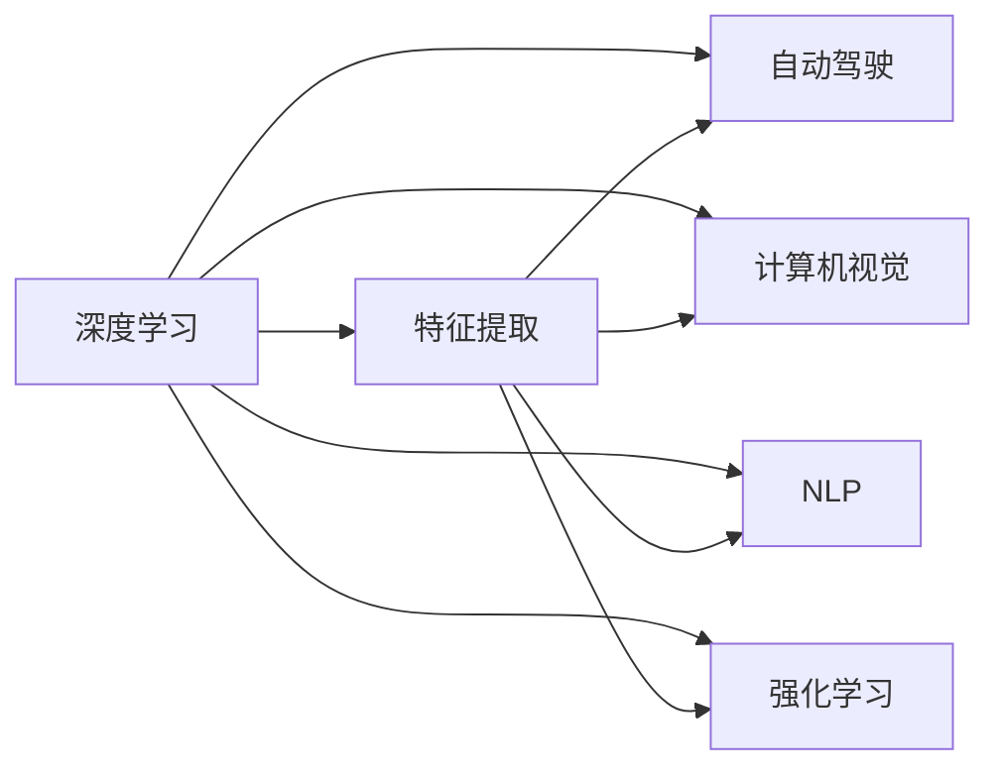

                 

# Andrej Karpathy：人工智能的未来发展趋势

> 关键词：人工智能(AI),深度学习(Deep Learning),机器学习(Machine Learning),自动驾驶(Autonomous Driving),计算机视觉(Computer Vision),自然语言处理(Natural Language Processing),强化学习(Reinforcement Learning)

## 1. 背景介绍

### 1.1 问题由来
Andrej Karpathy是人工智能领域的前沿科学家和知名开发者，其研究工作覆盖了深度学习、自动驾驶、计算机视觉等多个重要领域。在2022年的TED演讲《The future of AI》中，他深入浅出地探讨了人工智能未来发展的关键趋势。本章节将首先介绍Andrej Karpathy的研究背景及其在AI领域的贡献，随后探讨其关于AI未来发展趋势的见解。

### 1.2 问题核心关键点
Andrej Karpathy的演讲主要围绕以下几个核心问题展开：
- 人工智能未来将会如何发展？
- 深度学习在各个领域的应用前景是什么？
- 自动驾驶技术的前景和挑战
- 计算机视觉和自然语言处理的发展方向
- 强化学习在未来的重要性

这些问题是Andrej Karpathy演讲的核心内容，将通过接下来的章节进行详细阐述。

## 2. 核心概念与联系

### 2.1 核心概念概述

在探讨人工智能未来发展趋势之前，我们需要理解几个核心概念及其之间的关系：

- **深度学习(Deep Learning)**：一种基于多层神经网络的机器学习技术，通过多层次的非线性变换，从数据中提取高级特征。
- **自动驾驶(Autonomous Driving)**：利用计算机视觉、传感器融合、路径规划等技术，使车辆能够自主导航和决策。
- **计算机视觉(Computer Vision)**：让计算机具备“看”和“理解”图像和视频的能力，应用于图像识别、目标检测、场景理解等任务。
- **自然语言处理(Natural Language Processing, NLP)**：让计算机具备理解和生成自然语言的能力，应用于机器翻译、问答系统、情感分析等任务。
- **强化学习(Reinforcement Learning, RL)**：通过试错和奖励机制，让智能体学习最优策略，广泛应用于游戏、机器人控制等领域。

这些概念通过深度学习、机器学习等技术紧密联系，共同推动人工智能的进步。深度学习提供了强大的特征提取和表示能力，自动驾驶、计算机视觉和自然语言处理则是具体的应用领域，而强化学习则提供了一种通用的学习机制。

### 2.2 核心概念原理和架构的 Mermaid 流程图



这个流程图展示了深度学习在自动驾驶、计算机视觉、自然语言处理和强化学习中的应用，以及特征提取在这些领域中的重要性。

## 3. 核心算法原理 & 具体操作步骤

### 3.1 算法原理概述

Andrej Karpathy在演讲中强调了深度学习在未来AI发展中的核心地位。深度学习通过多层神经网络，能够自动学习数据中的高级特征，从而在计算机视觉、自然语言处理、自动驾驶等各个领域取得显著进展。

具体而言，深度学习通过反向传播算法，不断调整网络参数，使得输出与目标之间的误差最小化。这个过程通过优化函数（如损失函数）和梯度下降等方法实现。同时，深度学习模型的参数量巨大，通常需要GPU等高性能设备进行训练和推理。

### 3.2 算法步骤详解

1. **数据准备**：收集和标注数据，构建数据集。对于自动驾驶和计算机视觉，需要大量的标注图片和视频；对于自然语言处理，需要语料库和标注数据。

2. **模型构建**：选择合适的深度学习框架（如TensorFlow、PyTorch等），构建模型结构。通常包括卷积神经网络（CNN）、循环神经网络（RNN）、Transformer等。

3. **模型训练**：使用标注数据训练模型，通过反向传播算法优化模型参数。训练过程中需要设置合适的学习率、批大小等超参数。

4. **模型验证**：在验证集上评估模型性能，调整超参数。常用指标包括准确率、召回率、F1-score等。

5. **模型部署**：将训练好的模型部署到实际应用中，进行推理预测。

6. **模型优化**：根据实际应用需求，对模型进行调优，提升性能和鲁棒性。

### 3.3 算法优缺点

**优点**：
- 强大的特征提取能力
- 自动学习高级表示
- 适用于多种任务，如图像识别、语音识别、自然语言处理等

**缺点**：
- 对数据和计算资源依赖度高
- 模型复杂，训练时间长
- 黑盒模型，难以解释和调试
- 过拟合风险高，需进行正则化

### 3.4 算法应用领域

深度学习已经在多个领域展示了其强大的应用潜力：

- **自动驾驶**：用于环境感知、路径规划、决策生成等，如特斯拉Autopilot系统。
- **计算机视觉**：应用于图像分类、目标检测、场景理解等，如COCO、ImageNet等大规模图像识别任务。
- **自然语言处理**：应用于机器翻译、问答系统、情感分析等，如BERT、GPT等预训练语言模型。
- **强化学习**：应用于游戏、机器人控制、自动驾驶路径优化等，如AlphaGo、OpenAI Five等。

## 4. 数学模型和公式 & 详细讲解 & 举例说明

### 4.1 数学模型构建

假设有一个简单的卷积神经网络（CNN），其包含两个卷积层和两个全连接层。输入为28x28的灰度图像，输出为10个类别的分类结果。

数学模型可以表示为：

$$
h = \sigma(\text{conv}1(x)) \\
y = \text{softmax}(\text{fc}2(h))
$$

其中，$\sigma$表示激活函数，$\text{conv}1$表示第一个卷积层，$\text{fc}2$表示第二个全连接层，$x$表示输入图像。

### 4.2 公式推导过程

对于损失函数，通常使用交叉熵损失（Cross-Entropy Loss）：

$$
\mathcal{L}(y,\hat{y}) = -\frac{1}{N}\sum_{i=1}^N y_i \log \hat{y_i}
$$

其中，$y$为真实标签，$\hat{y}$为模型预测结果，$N$为样本数量。

### 4.3 案例分析与讲解

以ImageNet数据集为例，其中包含1000个类别的图片。我们可以使用预训练的VGG16模型作为特征提取器，将其输出作为输入，再使用全连接层进行分类。

假设训练集为50000张图片，测试集为10000张图片。我们可以按照以下步骤训练模型：

1. 使用训练集图片训练VGG16模型，得到特征提取器。
2. 将特征提取器的输出作为输入，使用全连接层进行分类。
3. 使用交叉熵损失函数，训练全连接层分类器。
4. 在测试集上评估模型性能，计算准确率、召回率等指标。

## 5. 项目实践：代码实例和详细解释说明

### 5.1 开发环境搭建

为了进行深度学习项目开发，需要安装Python、TensorFlow、Keras等工具。以下是Python环境的搭建步骤：

1. 安装Anaconda，并创建虚拟环境。
2. 安装TensorFlow和Keras。
3. 下载ImageNet数据集，解压并放入指定目录。
4. 安装OpenCV和NumPy等依赖库。

### 5.2 源代码详细实现

以简单的图像分类为例，以下是使用TensorFlow和Keras进行图像分类的代码实现：

```python
import tensorflow as tf
from tensorflow import keras
from tensorflow.keras import layers

# 加载数据集
(x_train, y_train), (x_test, y_test) = keras.datasets.mnist.load_data()

# 数据预处理
x_train = x_train / 255.0
x_test = x_test / 255.0

# 构建模型
model = keras.Sequential([
    layers.Flatten(input_shape=(28, 28)),
    layers.Dense(128, activation='relu'),
    layers.Dense(10, activation='softmax')
])

# 编译模型
model.compile(optimizer='adam',
              loss='sparse_categorical_crossentropy',
              metrics=['accuracy'])

# 训练模型
model.fit(x_train, y_train, epochs=5, batch_size=32, validation_data=(x_test, y_test))

# 评估模型
test_loss, test_acc = model.evaluate(x_test, y_test, verbose=2)
print('Test accuracy:', test_acc)
```

### 5.3 代码解读与分析

上述代码中，首先加载MNIST数据集，并对其进行归一化处理。然后定义了一个包含两个全连接层的神经网络模型，其中第一个全连接层为128个神经元，使用ReLU激活函数，第二个全连接层为10个神经元，使用softmax激活函数。

在模型编译阶段，指定了优化器为Adam，损失函数为稀疏分类交叉熵，并设置评价指标为准确率。在训练模型时，使用批量大小为32，训练5个epoch。最后，在测试集上评估模型性能，并输出测试集上的准确率。

## 6. 实际应用场景

### 6.1 自动驾驶

自动驾驶是人工智能的重要应用领域之一，其核心技术包括计算机视觉、传感器融合、路径规划等。

深度学习在自动驾驶中的应用包括：
- **环境感知**：使用卷积神经网络（CNN）和全连接网络（FCN），对传感器数据进行特征提取和分类。
- **路径规划**：使用循环神经网络（RNN）和长短期记忆网络（LSTM），预测车辆运动轨迹和决策。
- **决策生成**：使用强化学习（RL），根据环境感知和路径规划结果，生成最优驾驶决策。

自动驾驶技术在实际应用中面临诸多挑战，如复杂多变的路况、高精度定位、实时计算等。未来，自动驾驶技术将在智慧交通、城市物流、智能交通管理等领域得到广泛应用。

### 6.2 计算机视觉

计算机视觉技术在图像识别、目标检测、场景理解等方面具有广泛应用。深度学习通过卷积神经网络（CNN），可以从图像中提取高层次特征，实现复杂的视觉任务。

计算机视觉在自动驾驶、医疗影像分析、智能监控等场景中得到广泛应用。未来，计算机视觉技术将在更多领域得到应用，如智能家居、智能制造等。

### 6.3 自然语言处理

自然语言处理技术在机器翻译、情感分析、问答系统等方面具有广泛应用。深度学习通过预训练语言模型（如BERT、GPT等），可以学习到丰富的语言表示，实现自然语言处理任务。

自然语言处理在智能客服、智能推荐、智能助手等场景中得到广泛应用。未来，自然语言处理技术将在更多领域得到应用，如智能编辑、智能创作等。

## 7. 工具和资源推荐

### 7.1 学习资源推荐

- **《Deep Learning》**：Ian Goodfellow、Yoshua Bengio和Aaron Courville合著的经典教材，详细介绍了深度学习的基本概念和算法。
- **《Hands-On Machine Learning with Scikit-Learn, Keras, and TensorFlow》**：Aurélien Géron著的深度学习入门书籍，包含大量的实践代码和项目案例。
- **《计算机视觉：算法与应用》**：Russell C. Brown、James F. (!(?))著的计算机视觉入门教材，涵盖计算机视觉的基本概念和算法。
- **《自然语言处理综论》**：Daniel Jurafsky、James H. Martin著的自然语言处理经典教材，详细介绍了NLP的基本概念和算法。

### 7.2 开发工具推荐

- **TensorFlow**：Google开发的深度学习框架，支持多种计算图模型和分布式计算。
- **Keras**：基于TensorFlow的高级深度学习框架，提供了简单易用的API，适合快速开发原型。
- **PyTorch**：Facebook开发的深度学习框架，支持动态计算图和GPU加速。
- **OpenCV**：开源计算机视觉库，提供了丰富的图像处理和特征提取工具。

### 7.3 相关论文推荐

- **《ImageNet Classification with Deep Convolutional Neural Networks》**：Alex Krizhevsky、Ilya Sutskever和Geoffrey Hinton在2012年发表的论文，展示了深度卷积神经网络在ImageNet数据集上的性能。
- **《Attention is All You Need》**：Ashish Vaswani等人在2017年发表的论文，提出Transformer模型，显著提升了自然语言处理任务的表现。
- **《Playing Atari with Deep Reinforcement Learning》**：Volodymyr Mnih等人在2015年发表的论文，展示了深度强化学习在自动驾驶游戏中的应用。
- **《BERT: Pre-training of Deep Bidirectional Transformers for Language Understanding》**：Jamal Ardoune、Marc’Aurelio Ranzato等人在2018年发表的论文，提出BERT模型，显著提升了自然语言处理任务的表现。

## 8. 总结：未来发展趋势与挑战

### 8.1 研究成果总结

Andrej Karpathy在演讲中强调了深度学习在未来AI发展中的核心地位，同时指出深度学习在各个领域的应用前景。他认为，深度学习通过多层神经网络，能够自动学习数据中的高级特征，从而在自动驾驶、计算机视觉、自然语言处理等各个领域取得显著进展。

### 8.2 未来发展趋势

1. **深度学习将继续主导AI发展**：深度学习在图像识别、自然语言处理、自动驾驶等领域的持续进步，将推动AI技术的进一步发展。
2. **多模态学习成为热点**：深度学习将与计算机视觉、自然语言处理等技术相结合，实现多模态学习，提升AI系统的感知和理解能力。
3. **边缘计算与深度学习结合**：随着物联网和5G技术的发展，边缘计算与深度学习的结合将使得AI系统更加实时和高效。
4. **联邦学习与隐私保护**：联邦学习技术将使得AI系统能够在保护用户隐私的前提下，进行大规模数据训练。
5. **通用AI与自主学习**：未来AI系统将具备更加通用的学习能力，能够在不同领域进行自主学习和适应。

### 8.3 面临的挑战

1. **数据隐私和安全**：深度学习需要大量标注数据，如何保护用户隐私和数据安全是一个重要挑战。
2. **模型可解释性**：深度学习模型的黑盒特性使得其难以解释和调试，如何提高模型的可解释性是一个重要课题。
3. **计算资源需求**：深度学习模型通常需要大量的计算资源进行训练和推理，如何降低计算资源消耗是一个重要挑战。
4. **泛化能力不足**：深度学习模型面临泛化能力不足的问题，如何提高模型的泛化能力是一个重要课题。
5. **模型鲁棒性不足**：深度学习模型面临鲁棒性不足的问题，如何提高模型的鲁棒性是一个重要课题。

### 8.4 研究展望

未来AI研究需要关注以下几个方向：
1. **隐私保护技术**：研究如何保护用户隐私和数据安全，特别是在大数据环境下。
2. **模型可解释性**：研究如何提高深度学习模型的可解释性，使得其更加透明和可信。
3. **高效计算技术**：研究如何降低深度学习模型的计算资源需求，使得其能够在大规模数据集上进行训练和推理。
4. **泛化能力提升**：研究如何提高深度学习模型的泛化能力，使得其能够在不同领域和数据集上进行良好的表现。
5. **模型鲁棒性增强**：研究如何提高深度学习模型的鲁棒性，使得其能够在复杂和多变的环境中进行稳定表现。

## 9. 附录：常见问题与解答

**Q1：深度学习在自动驾驶中的应用有哪些？**

A: 深度学习在自动驾驶中的应用包括：
- **环境感知**：使用卷积神经网络（CNN）和全连接网络（FCN），对传感器数据进行特征提取和分类。
- **路径规划**：使用循环神经网络（RNN）和长短期记忆网络（LSTM），预测车辆运动轨迹和决策。
- **决策生成**：使用强化学习（RL），根据环境感知和路径规划结果，生成最优驾驶决策。

**Q2：什么是多模态学习？**

A: 多模态学习是指将不同模态（如图像、文本、语音）的数据融合在一起，进行联合学习和特征提取。多模态学习能够提高AI系统的感知和理解能力，适用于复杂的多感官任务。

**Q3：联邦学习与隐私保护有何关系？**

A: 联邦学习是一种分布式机器学习方法，它使得多个设备或服务器可以在不共享数据的情况下，协同训练一个全局模型。这种方法可以保护用户隐私和数据安全，特别是在医疗、金融等敏感领域。

**Q4：如何提高深度学习模型的可解释性？**

A: 提高深度学习模型的可解释性需要从多个方面入手：
- **模型简化**：通过简化模型结构，减少神经元数量和层数，提高模型的可解释性。
- **特征可视化**：通过特征可视化技术，展示模型对输入数据的响应。
- **模型解释器**：开发模型解释器，提供对模型内部工作机制的解释。
- **数据驱动**：通过数据驱动的方法，揭示模型对输入数据的依赖关系。

**Q5：什么是边缘计算？**

A: 边缘计算是指在设备端进行数据处理和推理，将计算任务从中心服务器分散到多个边缘设备上。边缘计算可以降低计算延迟和带宽消耗，提高系统的实时性和效率。

