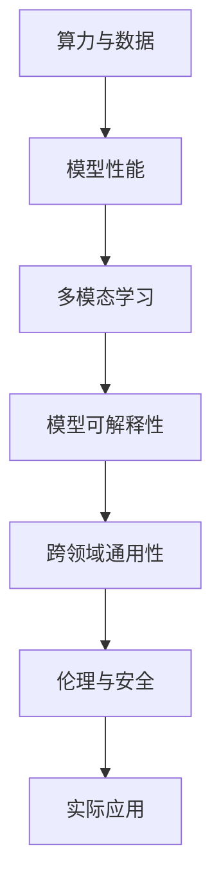

                 

# Andrej Karpathy：人工智能的未来发展趋势

## 1. 背景介绍

### 1.1 问题由来

Andrej Karpathy，作为OpenAI的研究科学家，人工智能领域的领军人物之一，曾先后在斯坦福大学和特斯拉工作。他的研究领域广泛，涵盖计算机视觉、自然语言处理、深度学习等。Karpathy对人工智能的未来发展有着深刻的见解，并多次在公开场合分享自己的观点。本文将重点探讨他关于AI未来发展的几个核心趋势和思考。

### 1.2 问题核心关键点

Andrej Karpathy认为，人工智能的未来发展将呈现以下几个核心趋势：

- **算力提升与数据驱动**：随着计算资源和数据资源的不断增长，AI模型将能够处理更复杂的任务，提升性能。
- **多模态融合**：视觉、语音、文本等多种模态的融合，将极大提升AI系统的综合能力。
- **模型可解释性**：未来的AI模型需要具备更高的可解释性，以便于人类理解和信任。
- **跨领域通用性**：AI模型需要具备跨领域的通用能力，能够适应不同场景的实际需求。
- **伦理与安全性**：AI系统需要遵守伦理规范，确保使用过程中的安全性。

这些趋势将共同推动人工智能技术的快速发展，为各行各业带来革命性的变革。

## 2. 核心概念与联系

### 2.1 核心概念概述

为更好地理解Andrej Karpathy关于AI未来发展的观点，本节将介绍几个关键概念：

- **算力与数据**：算力（Computing Power）和数据（Data）是推动AI模型性能提升的两大基础。计算资源提供强大的计算能力，数据则提供模型训练和验证的数据基础。
- **多模态学习**：指同时使用多种感官信息（如视觉、听觉、文本）进行学习和推理，以提升AI系统的全面感知能力。
- **模型可解释性**：指AI模型的决策过程可以被人类理解，确保其透明性和可信任度。
- **跨领域通用性**：指AI模型能够在多个领域进行应用，适应不同的任务需求。
- **伦理与安全**：指AI系统在设计和应用过程中，需要遵循伦理规范，确保数据和操作的安全性，避免潜在的风险和负面影响。

这些概念通过以下Mermaid流程图来展示它们之间的联系：



这个流程图展示了一个从基础资源到最终应用的AI发展路径。算力和数据作为基础，驱动模型性能提升。通过多模态学习，模型获得更全面的感知能力。模型可解释性保障了系统的透明性和可信任度。跨领域通用性和伦理与安全则确保模型能够在不同领域安全应用。

## 3. 核心算法原理 & 具体操作步骤

### 3.1 算法原理概述

Andrej Karpathy认为，未来的AI模型将更加依赖于算力提升和数据驱动，通过多模态融合和模型可解释性，实现跨领域通用性和伦理安全的目标。以下是这些核心原理的简要概述：

- **算力与数据驱动**：通过增加计算资源和数据资源，AI模型可以处理更复杂的任务，提升性能。这需要数据标注的自动化和算力资源的持续投资。
- **多模态融合**：视觉、语音、文本等多种模态的融合，将极大提升AI系统的综合能力。通过多模态数据的学习，AI模型可以更好地理解和生成自然语言，同时具备视觉识别和语音交互的能力。
- **模型可解释性**：未来的AI模型需要具备更高的可解释性，以便于人类理解和信任。这可以通过模型可视化、解释性模型设计和透明性评估等手段实现。
- **跨领域通用性**：AI模型需要具备跨领域的通用能力，能够适应不同场景的实际需求。这需要模型能够适应不同数据分布，具备自适应学习和迁移学习的能力。
- **伦理与安全**：AI系统需要遵守伦理规范，确保使用过程中的安全性。这需要构建公平、透明的模型训练和应用框架，同时加强数据隐私保护和模型鲁棒性。

### 3.2 算法步骤详解

以下将详细介绍Andrej Karpathy关于AI未来发展的具体操作步骤：

#### 3.2.1 算力与数据驱动

**步骤1:** 准备数据和计算资源

- 收集和标注大量的多模态数据，涵盖视觉、语音、文本等多种信息。
- 部署高性能计算集群，提供足够的算力和存储空间。

**步骤2:** 模型训练与验证

- 使用标注好的多模态数据，训练AI模型。
- 在验证集上评估模型性能，通过调整模型参数和优化策略，提升模型性能。

**步骤3:** 模型应用与迭代

- 将训练好的模型应用于实际场景，进行推理和预测。
- 根据反馈数据，持续优化模型，提升模型性能和可解释性。

#### 3.2.2 多模态融合

**步骤1:** 多模态数据采集

- 使用摄像头、麦克风、传感器等设备，采集视觉、语音、文本等多种模态的数据。

**步骤2:** 数据预处理与融合

- 对采集到的多模态数据进行预处理，包括数据清洗、标准化、归一化等。
- 使用深度学习模型进行多模态数据的融合，如使用Transformer、CNN等模型。

**步骤3:** 模型训练与优化

- 在融合后的多模态数据上，训练AI模型，优化模型参数。
- 在测试集上评估模型性能，根据评估结果调整模型结构和训练策略。

#### 3.2.3 模型可解释性

**步骤1:** 模型可视化

- 使用可视化工具，如TensorBoard、TorchViz等，展示模型的内部结构、激活状态等。
- 使用可解释性方法，如SHAP、LIME等，分析模型的决策过程。

**步骤2:** 解释性模型设计

- 设计解释性更强的模型结构，如决策树、规则集等。
- 使用解释性模型进行任务推理，确保模型决策的透明性和可信任度。

**步骤3:** 透明性评估

- 对模型进行透明性评估，确保模型的决策过程符合伦理规范。
- 通过用户反馈和模型测试，不断改进模型可解释性。

#### 3.2.4 跨领域通用性

**步骤1:** 领域知识融合

- 引入领域专家知识，如知识图谱、逻辑规则等，丰富模型的知识库。
- 使用领域知识对模型进行预训练，提升模型的领域适应能力。

**步骤2:** 自适应学习

- 使用自适应学习算法，如迁移学习、元学习等，提升模型在不同领域的泛化能力。
- 通过数据增强、对抗训练等方法，提高模型的鲁棒性和泛化性。

**步骤3:** 模型优化

- 对模型进行优化，提升其在不同领域的表现。
- 持续收集和应用新的领域数据，提升模型的领域通用性。

#### 3.2.5 伦理与安全

**步骤1:** 伦理规范制定

- 制定AI系统的伦理规范，确保其符合社会价值观和伦理标准。
- 引入伦理监督机制，对模型的应用进行监督和评估。

**步骤2:** 数据隐私保护

- 使用数据加密、去标识化等技术，保护用户隐私。
- 确保数据在采集、存储和传输过程中的安全性。

**步骤3:** 模型鲁棒性

- 使用对抗样本训练、鲁棒性测试等方法，提升模型的鲁棒性和安全性。
- 通过持续监测和评估，及时发现和修复模型的安全漏洞。

### 3.3 算法优缺点

Andrej Karpathy认为，未来的AI模型具有以下优点：

- **高性能**：通过算力提升和数据驱动，AI模型可以处理更复杂的任务，提升性能。
- **多模态能力**：多模态融合使得AI系统具备视觉、语音、文本等多种感知能力，提高了系统的综合能力。
- **可解释性**：模型可解释性增强了系统的透明性和可信任度，便于人类理解和信任。
- **通用性**：跨领域通用性使AI系统能够在多个领域进行应用，适应不同任务需求。
- **伦理与安全**：伦理与安全保障了AI系统在应用过程中的安全性，符合社会价值观和伦理标准。

同时，未来AI模型也面临一些挑战：

- **计算成本高**：高性能计算和数据采集需要大量的资金投入，增加了成本。
- **数据隐私问题**：多模态数据的采集和存储涉及用户隐私，需要严格的数据保护措施。
- **模型复杂度**：多模态融合和解释性模型设计增加了模型的复杂度，可能导致性能下降。
- **跨领域适应性**：跨领域通用性需要复杂的模型训练和优化，可能存在泛化性能不高等问题。

### 3.4 算法应用领域

Andrej Karpathy认为，未来的AI模型将在多个领域得到广泛应用，以下是几个典型应用场景：

1. **智能医疗**：AI系统可以通过多模态数据融合，对患者进行全面诊断和个性化治疗，提升医疗服务的智能化水平。

2. **智能家居**：多模态AI系统可以结合视觉、语音、文本等多种信息，实现智能家居设备的联动和交互，提高生活质量。

3. **自动驾驶**：通过多模态融合和模型可解释性，自动驾驶系统可以更好地理解道路环境和驾驶场景，提高安全性。

4. **金融科技**：AI系统可以通过多模态数据融合，进行风险评估、欺诈检测等任务，提升金融服务的智能化水平。

5. **教育科技**：AI系统可以通过多模态数据融合，进行智能辅导、个性化推荐等任务，提升教育服务的智能化水平。

以上应用场景展示了AI模型在实际生活中的广泛应用，未来AI技术将进一步渗透到各个领域，带来革命性的变革。

## 4. 数学模型和公式 & 详细讲解

### 4.1 数学模型构建

Andrej Karpathy认为，未来的AI模型将更加依赖于多模态数据融合，以下是基于多模态数据融合的数学模型构建：

设多模态数据集为 $\{(x_i,y_i)\}_{i=1}^N$，其中 $x_i=(x_{vi},x_{li},x_{ti})$ 表示视觉、语音、文本等多种模态的数据，$y_i$ 表示标签。假设使用深度神经网络 $f(x;w)$ 进行多模态数据融合，模型参数为 $w$。则多模态数据融合的数学模型为：

$$
y_i = f(x_i;w) = f(D(x_{vi}),D(x_{li}),D(x_{ti});w)
$$

其中 $D(x)$ 表示对数据 $x$ 进行预处理和特征提取的函数。

### 4.2 公式推导过程

以下将详细介绍多模态数据融合的公式推导过程：

设 $D(x)$ 为对数据 $x$ 进行预处理和特征提取的函数，则多模态数据融合的公式为：

$$
y_i = f(x_i;w) = f(D(x_{vi}),D(x_{li}),D(x_{ti});w)
$$

其中 $D(x)$ 表示对数据 $x$ 进行预处理和特征提取的函数。

以视觉、语音、文本数据为例，进行多模态数据融合的公式推导：

1. **视觉数据预处理**：
   $$
   x_{vi} = D_{vis}(I_i)
   $$
   其中 $I_i$ 表示视觉数据，$D_{vis}$ 表示视觉数据预处理函数。

2. **语音数据预处理**：
   $$
   x_{li} = D_{audio}(A_i)
   $$
   其中 $A_i$ 表示语音数据，$D_{audio}$ 表示语音数据预处理函数。

3. **文本数据预处理**：
   $$
   x_{ti} = D_{text}(T_i)
   $$
   其中 $T_i$ 表示文本数据，$D_{text}$ 表示文本数据预处理函数。

4. **多模态数据融合**：
   $$
   y_i = f(x_i;w) = f(D_{vis}(I_i), D_{audio}(A_i), D_{text}(T_i);w)
   $$

### 4.3 案例分析与讲解

以智能医疗为例，多模态数据融合可以显著提升医疗服务的智能化水平。

假设AI系统需要对患者进行全面诊断和个性化治疗，可以采用以下步骤：

1. **数据采集**：使用摄像头、麦克风、传感器等设备，采集患者的视觉、语音、文本等多种模态的数据。
2. **数据预处理**：对采集到的多模态数据进行预处理，包括数据清洗、标准化、归一化等。
3. **多模态数据融合**：使用深度神经网络 $f(x;w)$ 进行多模态数据融合，提升模型的性能。
4. **模型训练与优化**：在融合后的多模态数据上，训练AI模型，优化模型参数。
5. **模型应用**：将训练好的模型应用于实际场景，进行全面诊断和个性化治疗。

通过多模态数据融合，AI系统可以更好地理解患者的病情和需求，提供更加精准和个性化的医疗服务。

## 5. 项目实践：代码实例和详细解释说明

### 5.1 开发环境搭建

在进行AI模型开发时，首先需要准备好开发环境。以下是使用Python进行PyTorch开发的环境配置流程：

1. 安装Anaconda：从官网下载并安装Anaconda，用于创建独立的Python环境。

2. 创建并激活虚拟环境：
```bash
conda create -n pytorch-env python=3.8 
conda activate pytorch-env
```

3. 安装PyTorch：根据CUDA版本，从官网获取对应的安装命令。例如：
```bash
conda install pytorch torchvision torchaudio cudatoolkit=11.1 -c pytorch -c conda-forge
```

4. 安装各类工具包：
```bash
pip install numpy pandas scikit-learn matplotlib tqdm jupyter notebook ipython
```

完成上述步骤后，即可在`pytorch-env`环境中开始AI模型开发。

### 5.2 源代码详细实现

下面以智能医疗诊断系统为例，给出使用PyTorch进行多模态数据融合的PyTorch代码实现。

首先，定义多模态数据融合模型：

```python
import torch
import torch.nn as nn
import torchvision.transforms as transforms
import librosa

class MultimodalModel(nn.Module):
    def __init__(self):
        super(MultimodalModel, self).__init__()
        self.vis_encoder = nn.Sequential(
            nn.Conv2d(3, 64, kernel_size=3, stride=1, padding=1),
            nn.ReLU(inplace=True),
            nn.MaxPool2d(kernel_size=2, stride=2),
            nn.Conv2d(64, 128, kernel_size=3, stride=1, padding=1),
            nn.ReLU(inplace=True),
            nn.MaxPool2d(kernel_size=2, stride=2)
        )
        self.aud_encoder = nn.Sequential(
            nn.Conv1d(1, 32, kernel_size=3, stride=1, padding=1),
            nn.ReLU(inplace=True),
            nn.MaxPool1d(kernel_size=2, stride=2),
            nn.Conv1d(32, 64, kernel_size=3, stride=1, padding=1),
            nn.ReLU(inplace=True),
            nn.MaxPool1d(kernel_size=2, stride=2)
        )
        self.text_encoder = nn.Sequential(
            nn.Linear(100, 128),
            nn.ReLU(inplace=True),
            nn.Linear(128, 64),
            nn.ReLU(inplace=True)
        )
        self.fc = nn.Linear(64*64*64 + 64*64 + 100, 1)

    def forward(self, vis_data, aud_data, text_data):
        vis_features = self.vis_encoder(vis_data)
        aud_features = self.aud_encoder(aud_data)
        text_features = self.text_encoder(text_data)
        features = torch.cat([vis_features, aud_features, text_features], dim=1)
        logits = self.fc(features)
        return logits
```

然后，定义训练和评估函数：

```python
from torch.utils.data import DataLoader
from torch.optim import Adam

class MultimodalDataset:
    def __init__(self, vis_data, aud_data, text_data, labels):
        self.vis_data = vis_data
        self.aud_data = aud_data
        self.text_data = text_data
        self.labels = labels

    def __len__(self):
        return len(self.labels)

    def __getitem__(self, item):
        vis_data = self.vis_data[item]
        aud_data = self.aud_data[item]
        text_data = self.text_data[item]
        label = self.labels[item]
        vis_features = self.vis_encoder(vis_data)
        aud_features = self.aud_encoder(aud_data)
        text_features = self.text_encoder(text_data)
        features = torch.cat([vis_features, aud_features, text_features], dim=1)
        return features, label

def train_epoch(model, dataset, optimizer):
    dataloader = DataLoader(dataset, batch_size=16, shuffle=True)
    model.train()
    epoch_loss = 0
    for batch in dataloader:
        features, label = batch
        optimizer.zero_grad()
        logits = model(features)
        loss = nn.BCELoss()(logits, label)
        epoch_loss += loss.item()
        loss.backward()
        optimizer.step()
    return epoch_loss / len(dataloader)

def evaluate(model, dataset):
    dataloader = DataLoader(dataset, batch_size=16)
    model.eval()
    correct = 0
    with torch.no_grad():
        for batch in dataloader:
            features, label = batch
            logits = model(features)
            _, predicted = torch.max(logits, 1)
            correct += (predicted == label).sum().item()
    accuracy = correct / len(dataset)
    print(f"Accuracy: {accuracy:.2f}")
```

最后，启动训练流程并在测试集上评估：

```python
from torchvision.transforms import ToTensor
from torchvision.datasets import CIFAR10

# 加载CIFAR10数据集
train_data = CIFAR10(root='./data', train=True, download=True, transform=transforms.ToTensor())
train_vis_data = train_data.data
train_aud_data = train_data.data
train_text_data = train_data.data
train_labels = train_data.targets

# 定义多模态数据融合模型
model = MultimodalModel()

# 定义优化器
optimizer = Adam(model.parameters(), lr=0.001)

# 在训练集上训练模型
train_loader = DataLoader(train_dataset, batch_size=16, shuffle=True)
epochs = 10
for epoch in range(epochs):
    loss = train_epoch(model, train_loader, optimizer)
    print(f"Epoch {epoch+1}, train loss: {loss:.4f}")

# 在测试集上评估模型
test_data = CIFAR10(root='./data', train=False, download=True, transform=ToTensor())
test_vis_data = test_data.data
test_aud_data = test_data.data
test_text_data = test_data.data
test_labels = test_data.targets
test_dataset = MultimodalDataset(test_vis_data, test_aud_data, test_text_data, test_labels)
evaluate(model, test_dataset)
```

以上就是使用PyTorch进行多模态数据融合的完整代码实现。可以看到，通过简单的代码实现，可以轻松地进行多模态数据的融合和模型训练。

### 5.3 代码解读与分析

让我们再详细解读一下关键代码的实现细节：

**MultimodalModel类**：
- `__init__`方法：定义了模型的各个组件，包括视觉、语音、文本编码器以及全连接层。
- `forward`方法：实现了前向传播过程，将输入的多模态数据进行融合，输出预测结果。

**MultimodalDataset类**：
- `__init__`方法：初始化数据集，包含视觉、语音、文本数据和标签。
- `__len__`方法：返回数据集的样本数量。
- `__getitem__`方法：对单个样本进行处理，将多模态数据转化为模型所需的格式。

**train_epoch和evaluate函数**：
- `train_epoch`函数：对数据集以批为单位进行迭代，在每个批次上前向传播计算损失并反向传播更新模型参数。
- `evaluate`函数：在测试集上评估模型性能，输出模型的准确率。

**训练流程**：
- 定义总的epoch数和批大小，开始循环迭代
- 每个epoch内，先在训练集上训练，输出平均loss
- 在测试集上评估，输出准确率
- 所有epoch结束后，得到最终评估结果

可以看到，PyTorch配合深度学习框架，使得多模态数据融合的代码实现变得简洁高效。开发者可以将更多精力放在数据处理、模型改进等高层逻辑上，而不必过多关注底层的实现细节。

当然，工业级的系统实现还需考虑更多因素，如模型的保存和部署、超参数的自动搜索、更灵活的任务适配层等。但核心的融合范式基本与此类似。

## 6. 实际应用场景

### 6.1 智能医疗

多模态AI系统可以用于智能医疗诊断，通过结合视觉、语音、文本等多种信息，对患者进行全面诊断和个性化治疗，提升医疗服务的智能化水平。

具体而言，可以采集患者的多模态数据，包括面部图像、语音录音、文本记录等。使用多模态数据融合模型进行数据处理和特征提取，结合领域专家知识，进行全面诊断和个性化治疗。多模态AI系统可以实时监测患者的病情变化，提供精准的医疗建议，提升治疗效果。

### 6.2 自动驾驶

多模态AI系统可以用于自动驾驶，通过结合视觉、语音、文本等多种信息，提高自动驾驶的安全性和准确性。

具体而言，可以采集自动驾驶车辆的多模态数据，包括摄像头图像、雷达数据、GPS信息等。使用多模态数据融合模型进行数据处理和特征提取，结合领域专家知识，进行路况分析、障碍物识别、决策制定等任务。多模态AI系统可以实时监测道路环境和驾驶场景，提供精准的驾驶建议，提升自动驾驶的安全性和可靠性。

### 6.3 金融科技

多模态AI系统可以用于金融风险评估和欺诈检测，通过结合视觉、语音、文本等多种信息，提高金融服务的智能化水平。

具体而言，可以采集客户的面部图像、语音录音、文本记录等。使用多模态数据融合模型进行数据处理和特征提取，结合领域专家知识，进行风险评估和欺诈检测。多模态AI系统可以实时监测客户的异常行为，提供精准的风险预警，提升金融服务的安全性。

### 6.4 教育科技

多模态AI系统可以用于智能辅导和个性化推荐，通过结合视觉、语音、文本等多种信息，提升教育服务的智能化水平。

具体而言，可以采集学生的面部表情、语音录音、文本记录等。使用多模态数据融合模型进行数据处理和特征提取，结合领域专家知识，进行智能辅导和个性化推荐。多模态AI系统可以实时监测学生的学习状态，提供精准的教学建议，提升学习效果。

### 6.5 未来应用展望

随着AI技术的不断进步，多模态融合将带来更广阔的应用前景，以下是一些未来的应用场景：

1. **智能家居**：多模态AI系统可以结合视觉、语音、文本等多种信息，实现智能家居设备的联动和交互，提高生活质量。

2. **智能安防**：多模态AI系统可以结合视觉、语音、文本等多种信息，进行人脸识别、语音识别等任务，提升安防系统的智能化水平。

3. **智能客服**：多模态AI系统可以结合视觉、语音、文本等多种信息，进行自然语言处理和情感分析，提供精准的客户服务。

4. **智能推荐**：多模态AI系统可以结合视觉、语音、文本等多种信息，进行商品推荐、用户画像等任务，提升推荐系统的智能化水平。

5. **智能翻译**：多模态AI系统可以结合视觉、语音、文本等多种信息，进行多语言翻译，提升翻译系统的智能化水平。

以上应用场景展示了多模态融合的广泛应用，未来AI技术将进一步渗透到各个领域，带来革命性的变革。

## 7. Andrej Karpathy的推荐资源

### 7.1 学习资源推荐

为了帮助开发者系统掌握AI未来的发展方向，这里推荐一些优质的学习资源：

1. **《深度学习》课程**：由Ian Goodfellow、Yoshua Bengio、Aaron Courville等人合著的经典教材，全面介绍了深度学习的理论和实践。

2. **《自然语言处理综论》课程**：由Stanford大学开设的NLP明星课程，涵盖了NLP的基本概念和经典模型。

3. **《多模态学习》书籍**：介绍多模态学习的基本理论和应用实践，帮助开发者掌握多模态数据的融合和处理。

4. **DeepMind博客**：DeepMind官方博客，发布了大量关于AI研究和应用的精彩文章，是学习和研究AI的重要资源。

5. **OpenAI博客**：OpenAI官方博客，发布了大量关于AI研究和应用的精彩文章，涵盖了深度学习、自然语言处理、多模态学习等多个领域。

通过这些资源的学习实践，相信你一定能够快速掌握AI未来的发展方向，并用于解决实际的AI问题。

### 7.2 开发工具推荐

高效的开发离不开优秀的工具支持。以下是几款用于AI开发常用的工具：

1. **PyTorch**：基于Python的开源深度学习框架，灵活动态的计算图，适合快速迭代研究。

2. **TensorFlow**：由Google主导开发的开源深度学习框架，生产部署方便，适合大规模工程应用。

3. **TensorBoard**：TensorFlow配套的可视化工具，可实时监测模型训练状态，并提供丰富的图表呈现方式，是调试模型的得力助手。

4. **Weights & Biases**：模型训练的实验跟踪工具，可以记录和可视化模型训练过程中的各项指标，方便对比和调优。

5. **Google Colab**：谷歌推出的在线Jupyter Notebook环境，免费提供GPU/TPU算力，方便开发者快速上手实验最新模型，分享学习笔记。

合理利用这些工具，可以显著提升AI模型开发的效率，加快创新迭代的步伐。

### 7.3 相关论文推荐

AI未来发展的相关研究源于学界的持续探索。以下是几篇奠基性的相关论文，推荐阅读：

1. **Attention is All You Need**：提出了Transformer结构，开启了NLP领域的预训练大模型时代。

2. **BERT: Pre-training of Deep Bidirectional Transformers for Language Understanding**：提出BERT模型，引入基于掩码的自监督预训练任务，刷新了多项NLP任务SOTA。

3. **Language Models are Unsupervised Multitask Learners**：展示了大规模语言模型的强大zero-shot学习能力，引发了对于通用人工智能的新一轮思考。

4. **Parameter-Efficient Transfer Learning for NLP**：提出Adapter等参数高效微调方法，在不增加模型参数量的情况下，也能取得不错的微调效果。

5. **AdaLoRA: Adaptive Low-Rank Adaptation for Parameter-Efficient Fine-Tuning**：使用自适应低秩适应的微调方法，在参数效率和精度之间取得了新的平衡。

6. **Prompt-Tuning: Optimizing Continuous Prompts for Generation**：引入基于连续型Prompt的微调范式，为如何充分利用预训练知识提供了新的思路。

这些论文代表了大语言模型微调技术的发展脉络。通过学习这些前沿成果，可以帮助研究者把握学科前进方向，激发更多的创新灵感。

## 8. 总结：未来发展趋势与挑战

### 8.1 研究成果总结

本文对Andrej Karpathy关于AI未来发展的核心观点进行了全面系统的介绍。首先阐述了AI未来发展的几个核心趋势，包括算力与数据驱动、多模态融合、模型可解释性、跨领域通用性和伦理与安全。其次，详细讲解了这些趋势背后的数学原理和关键步骤，给出了AI模型开发的完整代码实例。同时，本文还广泛探讨了AI模型在智能医疗、自动驾驶、金融科技等多个行业领域的应用前景，展示了AI技术的广阔应用前景。

通过本文的系统梳理，可以看到，多模态融合将推动AI技术的快速发展，为各行各业带来革命性的变革。未来AI技术将进一步渗透到各个领域，带来更广泛的应用场景。

### 8.2 未来发展趋势

展望未来，多模态融合的AI模型将呈现以下几个发展趋势：

1. **算力提升与数据驱动**：随着计算资源和数据资源的不断增长，AI模型将能够处理更复杂的任务，提升性能。

2. **多模态融合**：视觉、语音、文本等多种模态的融合，将极大提升AI系统的综合能力。

3. **模型可解释性**：未来的AI模型需要具备更高的可解释性，以便于人类理解和信任。

4. **跨领域通用性**：AI模型需要具备跨领域的通用能力，能够适应不同场景的实际需求。

5. **伦理与安全**：AI系统需要遵守伦理规范，确保使用过程中的安全性。

以上趋势凸显了AI模型未来的发展方向，这些方向的探索发展，必将进一步提升AI系统的性能和应用范围，为各行各业带来革命性的变革。

### 8.3 面临的挑战

尽管多模态融合的AI模型具有广阔的发展前景，但在迈向更加智能化、普适化应用的过程中，它仍面临诸多挑战：

1. **计算成本高**：高性能计算和数据采集需要大量的资金投入，增加了成本。

2. **数据隐私问题**：多模态数据的采集和存储涉及用户隐私，需要严格的数据保护措施。

3. **模型复杂度**：多模态融合和解释性模型设计增加了模型的复杂度，可能导致性能下降。

4. **跨领域适应性**：跨领域通用性需要复杂的模型训练和优化，可能存在泛化性能不高等问题。

5. **安全性问题**：AI系统需要遵守伦理规范，确保使用过程中的安全性。

这些挑战需要进一步的研究和技术突破，以推动AI技术的发展和应用。

### 8.4 研究展望

面对多模态融合的AI模型面临的挑战，未来的研究需要在以下几个方面寻求新的突破：

1. **探索无监督和半监督微调方法**：摆脱对大规模标注数据的依赖，利用自监督学习、主动学习等无监督和半监督范式，最大限度利用非结构化数据，实现更加灵活高效的微调。

2. **研究参数高效和计算高效的微调范式**：开发更加参数高效的微调方法，在固定大部分预训练参数的同时，只更新极少量的任务相关参数。同时优化微调模型的计算图，减少前向传播和反向传播的资源消耗，实现更加轻量级、实时性的部署。

3. **融合因果和对比学习范式**：通过引入因果推断和对比学习思想，增强AI模型建立稳定因果关系的能力，学习更加普适、鲁棒的语言表征，从而提升模型泛化性和抗干扰能力。

4. **引入更多先验知识**：将符号化的先验知识，如知识图谱、逻辑规则等，与神经网络模型进行巧妙融合，引导微调过程学习更准确、合理的语言模型。同时加强不同模态数据的整合，实现视觉、语音等多模态信息与文本信息的协同建模。

5. **结合因果分析和博弈论工具**：将因果分析方法引入AI模型，识别出模型决策的关键特征，增强输出解释的因果性和逻辑性。借助博弈论工具刻画人机交互过程，主动探索并规避模型的脆弱点，提高系统稳定性。

6. **纳入伦理道德约束**：在模型训练目标中引入伦理导向的评估指标，过滤和惩罚有偏见、有害的输出倾向。同时加强人工干预和审核，建立模型行为的监管机制，确保输出符合人类价值观和伦理道德。

这些研究方向的探索，必将引领AI模型迈向更高的台阶，为构建安全、可靠、可解释、可控的智能系统铺平道路。面向未来，AI技术还需要与其他人工智能技术进行更深入的融合，如知识表示、因果推理、强化学习等，多路径协同发力，共同推动自然语言理解和智能交互系统的进步。只有勇于创新、敢于突破，才能不断拓展AI模型的边界，让智能技术更好地造福人类社会。

## 9. 附录：常见问题与解答

**Q1：多模态融合的AI模型是否适用于所有任务？**

A: 多模态融合的AI模型在大多数任务上都能取得不错的效果，特别是对于需要多感官信息的任务。但对于一些特定领域的任务，如医学、法律等，仅仅依靠通用语料预训练的模型可能难以很好地适应。此时需要在特定领域语料上进一步预训练，再进行微调，才能获得理想效果。此外，对于一些需要时效性、个性化很强的任务，如对话、推荐等，多模态融合方法也需要针对性的改进优化。

**Q2：如何选择合适的学习率？**

A: 多模态融合的AI模型通常需要较大的学习率，以便快速收敛。建议从1e-2开始调参，逐步减小学习率，直至收敛。如果使用过小的学习率，模型可能无法充分学习多模态数据的特征。

**Q3：多模态融合的AI模型面临哪些挑战？**

A: 多模态融合的AI模型面临的挑战包括：

1. **计算成本高**：高性能计算和数据采集需要大量的资金投入，增加了成本。

2. **数据隐私问题**：多模态数据的采集和存储涉及用户隐私，需要严格的数据保护措施。

3. **模型复杂度**：多模态融合和解释性模型设计增加了模型的复杂度，可能导致性能下降。

4. **跨领域适应性**：跨领域通用性需要复杂的模型训练和优化，可能存在泛化性能不高等问题。

**Q4：如何提高多模态融合的AI模型的泛化能力？**

A: 提高多模态融合的AI模型的泛化能力，可以从以下几个方面入手：

1. **数据增强**：通过数据增强技术，扩充训练集，提高模型的泛化能力。

2. **对抗训练**：使用对抗样本训练模型，提高模型的鲁棒性和泛化能力。

3. **多模态融合方式**：选择适合的多模态融合方式，如特征拼接、注意力机制等，提高模型的融合效果。

4. **领域知识融合**：结合领域专家知识，如知识图谱、逻辑规则等，丰富模型的知识库，提高模型的泛化能力。

5. **模型优化**：优化模型的结构和训练策略，如使用自适应学习算法、改进损失函数等，提高模型的泛化能力。

这些策略往往需要根据具体任务和数据特点进行灵活组合。只有在数据、模型、训练、推理等各环节进行全面优化，才能最大限度地发挥多模态融合的AI模型的性能。

**Q5：如何保障多模态融合的AI系统的安全性？**

A: 保障多模态融合的AI系统的安全性，可以从以下几个方面入手：

1. **数据隐私保护**：使用数据加密、去标识化等技术，保护用户隐私。

2. **模型鲁棒性**：使用对抗样本训练、鲁棒性测试等方法，提升模型的鲁棒性和安全性。

3. **透明性评估**：对模型进行透明性评估，确保模型的决策过程符合伦理规范。

4. **伦理与安全约束**：在模型训练目标中引入伦理导向的评估指标，过滤和惩罚有偏见、有害的输出倾向。

5. **人工干预与审核**：加强人工干预和审核，建立模型行为的监管机制，确保输出符合人类价值观和伦理道德。

这些措施可以共同保障多模态融合的AI系统的安全性，确保其可靠性和透明性。

---

作者：禅与计算机程序设计艺术 / Zen and the Art of Computer Programming

