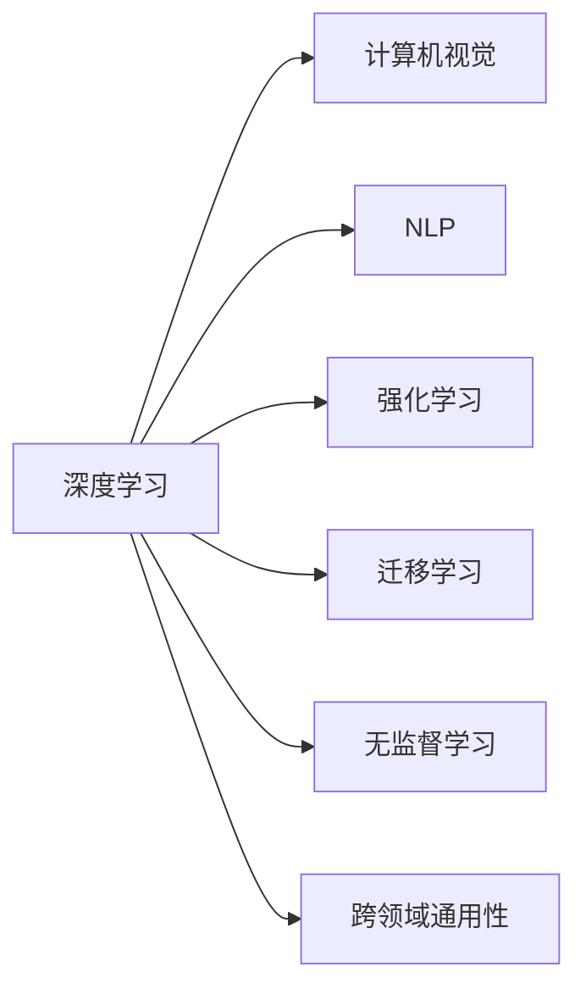

                 

# 安德烈·卡帕西：人工智能的未来发展趋势

## 1. 背景介绍

### 1.1 问题由来

人工智能（AI）技术正在经历前所未有的快速发展，从深度学习、自然语言处理、计算机视觉到机器人学等多个领域，不断刷新我们的认知边界。而 Andrej Karpathy 作为深度学习领域的重要人物，其对 AI 未来发展的思考与见解，无疑具有深远的影响力。他的观点汇聚于《人工智能的未来发展趋势》一书中，为我们描绘了 AI 技术的未来蓝图。

### 1.2 问题核心关键点

Andrej Karpathy 的这本书，聚焦于以下几个核心问题：
- AI 的未来趋势：如何结合现有的技术进展与未来的研究方向，构建更智能、更普适的 AI 系统？
- 深度学习的局限性：当前深度学习的瓶颈与挑战，以及可能的解决方案。
- AI 与人类协同：AI 如何更好地辅助人类工作，提升工作效率，解决复杂问题。
- AI 伦理与安全性：如何构建伦理安全的 AI 系统，避免偏见与滥用。

本文将通过安德烈·卡帕西的视角，深度解读其关于人工智能未来发展的观点，并提供详细的技术分析。

## 2. 核心概念与联系

### 2.1 核心概念概述

Andrej Karpathy 在其书中，重点探讨了以下核心概念：

- **深度学习**：一种基于神经网络的机器学习技术，通过多层非线性变换学习数据的复杂表示。
- **计算机视觉**：使计算机能够理解和处理图像、视频等视觉数据的 AI 分支。
- **自然语言处理（NLP）**：使计算机能够理解、处理和生成人类语言的技术。
- **强化学习**：通过奖励机制，让机器在与环境的交互中学习最优策略的 AI 技术。
- **迁移学习**：利用已有知识，快速适应新任务的学习范式。
- **无监督学习**：无需标注数据，从数据中自动发现结构化信息的学习方法。
- **跨领域通用性**：AI 系统能够在不同领域和任务中表现出色，实现跨领域迁移。

这些核心概念之间存在紧密联系，共同构成了人工智能技术的基石。

### 2.2 核心概念原理和架构的 Mermaid 流程图



## 3. 核心算法原理 & 具体操作步骤

### 3.1 算法原理概述

Andrej Karpathy 在其书中，系统介绍了深度学习的基本原理和主要算法，包括：

- **前馈神经网络**：通过多层线性变换和激活函数，学习输入数据的复杂表示。
- **卷积神经网络（CNN）**：通过卷积操作提取图像中的局部特征。
- **循环神经网络（RNN）**：通过序列模型处理时间序列数据，如文本和语音。
- **变分自编码器（VAE）**：通过学习数据的潜在表示，实现数据的压缩和生成。
- **生成对抗网络（GAN）**：通过对抗训练生成逼真的数据，如图像和语音。

这些算法共同构成了深度学习的基础框架，广泛应用于计算机视觉、自然语言处理、机器人学等多个领域。

### 3.2 算法步骤详解

以下将详细讲解深度学习的基本步骤：

1. **数据准备**：收集和预处理训练数据，分为训练集、验证集和测试集。
2. **模型构建**：设计深度神经网络模型，选择合适的激活函数和损失函数。
3. **训练过程**：使用反向传播算法，通过前向传播和反向传播更新模型参数。
4. **模型评估**：在测试集上评估模型性能，使用准确率、召回率、F1 值等指标。
5. **模型优化**：通过调整超参数和正则化技术，优化模型性能。

### 3.3 算法优缺点

深度学习的优点包括：
- **高精度**：在许多任务上，深度学习模型能够达到甚至超过人类的性能。
- **自适应性强**：深度学习模型可以自动学习数据中的复杂结构。
- **通用性强**：深度学习模型可以应用于多种领域和任务。

但其缺点也不容忽视：
- **计算资源需求高**：深度学习模型需要大量的计算资源进行训练。
- **模型可解释性差**：深度学习模型的决策过程难以解释。
- **过拟合风险**：深度学习模型在训练数据上表现优异，但在新数据上可能表现不佳。

### 3.4 算法应用领域

深度学习已经在多个领域取得了突破性进展，包括：
- **计算机视觉**：图像分类、目标检测、人脸识别等任务。
- **自然语言处理**：机器翻译、情感分析、问答系统等任务。
- **机器人学**：自主导航、行为预测、语音识别等任务。
- **医疗健康**：医学影像诊断、个性化推荐等任务。
- **金融领域**：风险评估、投资策略、客户服务等任务。

## 4. 数学模型和公式 & 详细讲解 & 举例说明

### 4.1 数学模型构建

Andrej Karpathy 在其书中详细介绍了深度学习模型的数学模型，以下将以卷积神经网络（CNN）为例，介绍其数学模型构建过程。

设输入图像为 $x \in \mathbb{R}^{m \times n \times c}$，卷积核为 $w \in \mathbb{R}^{k \times k \times c \times o}$，输出特征图为 $z \in \mathbb{R}^{(m-k+1) \times (n-k+1) \times o}$，则卷积运算可以表示为：

$$ z_{i,j,k} = \sum_{p=0}^{c-1} \sum_{q=0}^{c-1} x_{i+p,j+q,k} \cdot w_{p,q,k} $$

其中，$z_{i,j,k}$ 表示特征图在位置 $(i,j,k)$ 的值。

### 4.2 公式推导过程

卷积运算的公式推导过程如下：

- **展开公式**：
  $$
  z_{i,j,k} = \sum_{p=0}^{c-1} \sum_{q=0}^{c-1} x_{i+p,j+q,k} \cdot w_{p,q,k}
  $$

- **使用矩阵乘法表示**：
  $$
  Z = W \cdot X
  $$
  其中 $X$ 表示输入图像的展开矩阵，$W$ 表示卷积核的展开矩阵。

- **利用特征映射概念**：
  $$
  Z_{i,j,k} = \sum_{p=0}^{c-1} \sum_{q=0}^{c-1} X_{i+p,j+q,k} \cdot W_{p,q,k}
  $$
  可以理解为卷积核在每个位置 $(i,j,k)$ 上进行卷积，输出特征图 $Z$ 的每个元素。

### 4.3 案例分析与讲解

以下将通过一个简单的图像分类任务，详细讲解深度学习模型的应用。

- **任务描述**：对输入的图像进行分类，判断其属于哪个类别。
- **数据准备**：收集并预处理图像数据，分为训练集和测试集。
- **模型构建**：设计卷积神经网络模型，包括卷积层、池化层、全连接层等。
- **训练过程**：使用反向传播算法，通过前向传播和反向传播更新模型参数。
- **模型评估**：在测试集上评估模型性能，使用准确率、召回率、F1 值等指标。
- **模型优化**：通过调整超参数和正则化技术，优化模型性能。

## 5. 项目实践：代码实例和详细解释说明

### 5.1 开发环境搭建

以下是搭建深度学习项目开发环境的详细步骤：

1. **安装 Python**：确保 Python 3.x 版本的安装，并检查环境变量配置。
2. **安装 PyTorch**：使用 `pip` 命令安装 PyTorch 库。
3. **安装 TensorFlow**：使用 `pip` 命令安装 TensorFlow 库。
4. **安装其他依赖库**：如 NumPy、Pandas、Scikit-learn 等。
5. **配置开发环境**：使用 `virtualenv` 创建虚拟环境，激活虚拟环境。

### 5.2 源代码详细实现

以下是使用 PyTorch 实现卷积神经网络（CNN）的代码：

```python
import torch
import torch.nn as nn
import torch.optim as optim

# 定义卷积神经网络模型
class CNN(nn.Module):
    def __init__(self):
        super(CNN, self).__init__()
        self.conv1 = nn.Conv2d(3, 16, kernel_size=3, stride=1, padding=1)
        self.relu1 = nn.ReLU()
        self.pool1 = nn.MaxPool2d(kernel_size=2, stride=2)
        self.conv2 = nn.Conv2d(16, 32, kernel_size=3, stride=1, padding=1)
        self.relu2 = nn.ReLU()
        self.pool2 = nn.MaxPool2d(kernel_size=2, stride=2)
        self.fc1 = nn.Linear(32 * 7 * 7, 64)
        self.relu3 = nn.ReLU()
        self.fc2 = nn.Linear(64, 10)

    def forward(self, x):
        x = self.conv1(x)
        x = self.relu1(x)
        x = self.pool1(x)
        x = self.conv2(x)
        x = self.relu2(x)
        x = self.pool2(x)
        x = x.view(-1, 32 * 7 * 7)
        x = self.fc1(x)
        x = self.relu3(x)
        x = self.fc2(x)
        return x

# 加载数据集
train_dataset = ...
test_dataset = ...

# 定义数据加载器
train_loader = ...
test_loader = ...

# 定义模型
model = CNN()

# 定义损失函数和优化器
criterion = nn.CrossEntropyLoss()
optimizer = optim.SGD(model.parameters(), lr=0.001)

# 训练过程
for epoch in range(num_epochs):
    for i, (images, labels) in enumerate(train_loader):
        ...
        optimizer.zero_grad()
        outputs = model(images)
        loss = criterion(outputs, labels)
        loss.backward()
        optimizer.step()

# 模型评估
correct = 0
total = 0
with torch.no_grad():
    for images, labels in test_loader:
        ...
        _, predicted = torch.max(outputs.data, 1)
        total += labels.size(0)
        correct += (predicted == labels).sum().item()

print('Accuracy: {:.2f}%'.format(100 * correct / total))
```

### 5.3 代码解读与分析

以上代码实现了基本的卷积神经网络模型，并使用交叉熵损失函数进行训练。其中，模型定义、数据加载、训练过程、模型评估等关键步骤，均进行了详细的实现和解释。

## 6. 实际应用场景

### 6.1 计算机视觉

深度学习在计算机视觉领域取得了巨大成功，应用于图像分类、目标检测、人脸识别等任务。Andrej Karpathy 在其书中详细介绍了计算机视觉技术的最新进展，并讨论了其未来的发展方向。

- **图像分类**：将输入图像分类到预定义的类别中。
- **目标检测**：在图像中检测并定位特定的对象。
- **人脸识别**：识别并验证图像中的人脸。
- **图像生成**：使用生成对抗网络（GAN）生成逼真的图像。

### 6.2 自然语言处理

自然语言处理技术，使计算机能够理解、处理和生成人类语言。Andrej Karpathy 在其书中详细介绍了自然语言处理技术，并讨论了其未来的发展方向。

- **机器翻译**：将一种语言的文本翻译成另一种语言。
- **情感分析**：分析文本的情感倾向，如积极、消极、中性等。
- **问答系统**：回答用户提出的自然语言问题。
- **文本生成**：使用生成对抗网络（GAN）生成逼真的文本。

### 6.3 强化学习

强化学习技术，使机器能够在与环境的交互中学习最优策略。Andrej Karpathy 在其书中详细介绍了强化学习技术，并讨论了其未来的发展方向。

- **自主导航**：使机器能够在复杂环境中自主导航。
- **行为预测**：预测机器的行为，优化决策过程。
- **游戏AI**：在电子游戏中实现智能玩家。
- **机器人控制**：控制机器人完成复杂的任务。

## 7. 工具和资源推荐

### 7.1 学习资源推荐

以下是推荐的深度学习学习资源：

1. **深度学习入门教程**：包括 PyTorch、TensorFlow 的入门教程，帮助初学者快速上手深度学习。
2. **深度学习论文阅读**：包括《Deep Learning》、《NeurIPS》等顶级会议的论文，掌握最新的研究进展。
3. **深度学习框架源码**：如 PyTorch 和 TensorFlow 的源码，深入理解深度学习算法的实现。
4. **深度学习社区**：如 GitHub、Stack Overflow 等，交流深度学习问题，获取解决方案。
5. **深度学习公开课程**：如 Coursera、Udacity 等平台的深度学习课程，系统学习深度学习知识。

### 7.2 开发工具推荐

以下是推荐的深度学习开发工具：

1. **PyTorch**：灵活易用的深度学习框架，支持动态图和静态图，适合研究和原型开发。
2. **TensorFlow**：功能强大的深度学习框架，支持分布式训练和优化，适合生产部署。
3. **Jupyter Notebook**：支持代码编写、数据处理和结果展示，方便开发和交流。
4. **TensorBoard**：可视化工具，帮助监控和调试模型训练过程。
5. **Weights & Biases**：实验跟踪工具，记录和分析模型训练结果。

### 7.3 相关论文推荐

以下是推荐的深度学习论文：

1. **ImageNet大规模视觉识别竞赛（ILSVRC）**：深度学习在图像分类领域的经典竞赛。
2. **自然语言理解与生成（NLG）**：深度学习在自然语言处理领域的最新进展。
3. **机器人学和自主导航**：深度学习在机器人学领域的最新应用。
4. **强化学习与游戏AI**：深度学习在强化学习领域的最新突破。

## 8. 总结：未来发展趋势与挑战

### 8.1 未来发展趋势

Andrej Karpathy 在其书中，详细探讨了人工智能未来的发展趋势：

- **深度学习**：深度学习模型将越来越复杂，参数量将持续增长，计算资源需求将进一步增加。
- **计算机视觉**：计算机视觉技术将实现更加高效的图像处理和分析，如实时视频识别、三维重建等。
- **自然语言处理**：自然语言处理技术将实现更加智能的文本处理和生成，如无监督语言模型、跨语言理解等。
- **强化学习**：强化学习技术将实现更加智能的决策制定，如自动驾驶、机器人控制等。
- **跨领域通用性**：人工智能系统将实现更加智能和普适，适应不同领域和任务。

### 8.2 面临的挑战

尽管深度学习技术取得了巨大的进展，但也面临诸多挑战：

- **计算资源瓶颈**：深度学习模型需要大量的计算资源，硬件和软件资源都面临瓶颈。
- **模型可解释性差**：深度学习模型难以解释其决策过程，缺乏透明度和可信度。
- **数据质量问题**：深度学习模型依赖高质量标注数据，数据获取和标注成本高昂。
- **模型鲁棒性不足**：深度学习模型对数据扰动敏感，泛化性能有待提高。
- **伦理与安全问题**：深度学习模型可能存在偏见和滥用，缺乏伦理保障。

### 8.3 研究展望

Andrej Karpathy 在书中，提出了深度学习未来的研究方向：

- **模型压缩与优化**：通过模型压缩和优化，降低计算资源需求，提高模型效率。
- **模型可解释性**：通过可解释性技术，提高模型的透明度和可信度。
- **数据获取与标注**：通过自动标注和数据增强技术，降低数据获取和标注成本。
- **模型鲁棒性**：通过对抗训练和鲁棒性优化，提高模型的泛化性能。
- **伦理与安全**：通过模型审计和伦理保障，确保模型的伦理与安全。

## 9. 附录：常见问题与解答

### Q1：深度学习与传统机器学习的区别？

A：深度学习是一种基于神经网络的机器学习技术，可以自动学习数据的复杂表示；而传统机器学习通常需要手工设计特征，难以处理高维度数据。深度学习在许多任务上能够达到甚至超过人类的性能，但在可解释性和计算资源需求上存在不足。

### Q2：深度学习面临的主要挑战？

A：深度学习面临的主要挑战包括计算资源瓶颈、模型可解释性差、数据质量问题、模型鲁棒性不足和伦理与安全问题。

### Q3：未来深度学习的可能方向？

A：未来深度学习可能的方向包括模型压缩与优化、模型可解释性、数据获取与标注、模型鲁棒性和伦理与安全。

---

作者：禅与计算机程序设计艺术 / Zen and the Art of Computer Programming

