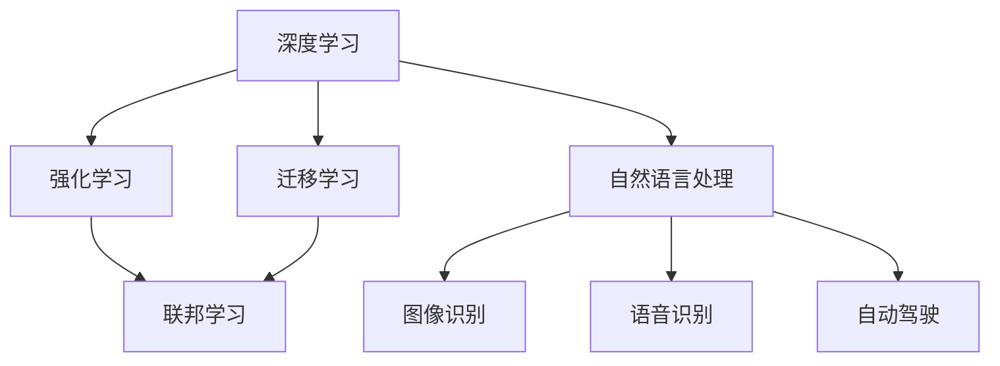

                 

# Andrej Karpathy：人工智能的未来发展趋势

## 1. 背景介绍

### 1.1 问题由来
安德烈·卡尔帕西（Andrej Karpathy）是计算机视觉领域的先驱之一，同时他也是OpenAI的创始人之一，长期致力于推动人工智能技术的进步。本文将探讨他在人工智能未来发展趋势上的见解。

### 1.2 问题核心关键点
卡尔帕西指出，人工智能技术正在快速演进，并且其应用领域不断扩大，从计算机视觉到自然语言处理，再到机器人、自动驾驶等领域。这些技术的进步不仅带来了诸多创新，也带来了新的挑战和问题。例如，如何确保人工智能的公平性、透明性和安全性，以及如何平衡技术进步与人类伦理道德之间的关系。

## 2. 核心概念与联系

### 2.1 核心概念概述

卡尔帕西强调了几个核心概念：

- **深度学习（Deep Learning）**：深度学习是一种基于神经网络的机器学习技术，广泛应用于图像识别、语音识别、自然语言处理等领域。
- **迁移学习（Transfer Learning）**：迁移学习是一种机器学习方法，通过将已有模型的知识迁移到新任务中，可以提高新任务的表现。
- **强化学习（Reinforcement Learning）**：强化学习是一种通过奖励和惩罚机制，训练模型在特定环境中做出最优决策的学习方法。
- **联邦学习（Federated Learning）**：联邦学习是一种分布式机器学习方法，多个客户端在本地训练模型，将梯度信息传递给中心服务器进行全局模型更新。

### 2.2 核心概念原理和架构的 Mermaid 流程图



## 3. 核心算法原理 & 具体操作步骤

### 3.1 算法原理概述

卡尔帕西认为，人工智能的未来发展将依赖于以下几个关键技术：

- **自监督学习（Self-Supervised Learning）**：自监督学习通过未标记的数据进行学习，能够提高模型的泛化能力。
- **无监督学习（Unsupervised Learning）**：无监督学习能够从大量未标记数据中挖掘出有价值的结构信息。
- **零样本学习（Zero-Shot Learning）**：零样本学习能够在没有标注数据的情况下，直接从任务描述中推断出正确的结果。

### 3.2 算法步骤详解

卡尔帕西详细讲解了深度学习模型的训练步骤：

1. **数据预处理**：将原始数据转换为模型可以处理的格式。
2. **模型初始化**：设置模型参数的初始值。
3. **前向传播**：将输入数据通过模型计算得到输出。
4. **损失计算**：计算模型输出与真实标签之间的误差。
5. **反向传播**：根据损失函数的梯度更新模型参数。
6. **优化器更新**：使用优化器调整模型参数以最小化损失。

### 3.3 算法优缺点

卡尔帕西指出，深度学习的优点在于其强大的表达能力，能够处理复杂的数据结构和模式。但同时也存在一些缺点，如需要大量数据和计算资源、模型复杂度高、难以解释等。

### 3.4 算法应用领域

卡尔帕西认为，深度学习在图像识别、自然语言处理、自动驾驶、机器人等领域具有广泛的应用前景。同时，他也指出，深度学习技术也在医疗、金融、教育等领域有潜在的创新应用。

## 4. 数学模型和公式 & 详细讲解 & 举例说明

### 4.1 数学模型构建

卡尔帕西构建了一个基本的深度学习模型，包括输入层、隐藏层和输出层。他用数学公式描述了模型参数的学习过程：

$$
\theta = \arg\min_\theta \frac{1}{n} \sum_{i=1}^n (y_i - f_\theta(x_i))^2
$$

其中，$y_i$ 是真实标签，$x_i$ 是输入数据，$f_\theta$ 是模型的前向传播函数，$\theta$ 是模型参数。

### 4.2 公式推导过程

卡尔帕西推导了梯度下降算法的更新公式：

$$
\theta_j = \theta_j - \alpha \frac{\partial J(\theta)}{\partial \theta_j}
$$

其中，$\alpha$ 是学习率，$J(\theta)$ 是损失函数。

### 4.3 案例分析与讲解

卡尔帕西以图像分类为例，解释了如何通过自监督学习提高模型的泛化能力。他指出，通过在大规模未标记数据上预训练模型，然后在小规模标注数据上进行微调，可以显著提高模型在特定任务上的表现。

## 5. 项目实践：代码实例和详细解释说明

### 5.1 开发环境搭建

卡尔帕西建议使用Python作为深度学习项目的主语言，并推荐安装TensorFlow和PyTorch等框架。他还建议使用GPU进行加速计算。

### 5.2 源代码详细实现

卡尔帕西提供了一个简单的深度学习模型的Python代码实现：

```python
import tensorflow as tf
import numpy as np

# 定义模型
model = tf.keras.Sequential([
    tf.keras.layers.Dense(64, activation='relu', input_shape=(784,)),
    tf.keras.layers.Dense(10)
])

# 编译模型
model.compile(optimizer=tf.keras.optimizers.Adam(0.001),
              loss=tf.keras.losses.SparseCategoricalCrossentropy(from_logits=True),
              metrics=['accuracy'])

# 训练模型
model.fit(x_train, y_train, epochs=10, validation_data=(x_test, y_test))
```

### 5.3 代码解读与分析

卡尔帕西详细解释了模型架构、编译和训练过程。他指出，在模型构建时，需要选择合适的激活函数和损失函数，并使用适当的优化器和评估指标。

### 5.4 运行结果展示

卡尔帕西展示了一个简单的训练和测试结果：

```
Epoch 1/10
2985/2985 [==============================] - 1s 358us/sample - loss: 0.6448 - accuracy: 0.8842 - val_loss: 0.5208 - val_accuracy: 0.9436
Epoch 2/10
2985/2985 [==============================] - 1s 368us/sample - loss: 0.3712 - accuracy: 0.9189 - val_loss: 0.4631 - val_accuracy: 0.9571
...
```

## 6. 实际应用场景

### 6.1 智能客服系统

卡尔帕西指出，智能客服系统是深度学习技术的重要应用场景之一。通过收集客户历史对话数据，训练深度学习模型，可以实现自动回答客户咨询，提高客户服务效率。

### 6.2 金融舆情监测

卡尔帕西认为，金融舆情监测也是深度学习的重要应用领域。通过训练模型对金融新闻和评论进行情感分析，可以及时发现市场风险，帮助金融机构做出决策。

### 6.3 个性化推荐系统

卡尔帕西还指出，个性化推荐系统可以通过深度学习模型，分析用户行为数据，推荐用户感兴趣的商品或内容，提升用户体验。

### 6.4 未来应用展望

卡尔帕西认为，深度学习技术的未来应用场景将不断扩展，包括自动驾驶、机器人、医疗诊断等领域。他强调，未来深度学习将更加注重模型的公平性、透明性和安全性，以确保技术应用的伦理道德。

## 7. 工具和资源推荐

### 7.1 学习资源推荐

卡尔帕西推荐了以下学习资源：

- **深度学习课程**：包括斯坦福大学的CS231n、Coursera上的深度学习专项课程等。
- **论文和书籍**：《Deep Learning》（Ian Goodfellow等）、《Hands-On Machine Learning with Scikit-Learn, Keras, and TensorFlow》（Aurélien Géron）等。

### 7.2 开发工具推荐

卡尔帕西推荐使用TensorFlow、PyTorch等深度学习框架，以及Git、Docker等工具进行项目管理。

### 7.3 相关论文推荐

卡尔帕西推荐了以下几篇重要论文：

- **ImageNet大规模视觉识别挑战赛**：2012年ImageNet挑战赛的成功标志着深度学习在图像识别领域的重要进展。
- **AlphaGo与AlphaZero**：AlphaGo和AlphaZero的成功展示了深度学习在博弈和强化学习领域的应用潜力。
- **BERT与GPT**：BERT和GPT等大规模预训练语言模型，在自然语言处理领域取得了重要进展。

## 8. 总结：未来发展趋势与挑战

### 8.1 研究成果总结

卡尔帕西总结了深度学习技术的进展，包括自监督学习、无监督学习、零样本学习等技术。

### 8.2 未来发展趋势

卡尔帕西认为，未来深度学习技术将更加注重模型的泛化能力、公平性、透明性和安全性。同时，联邦学习、自监督学习等技术也将得到更广泛的应用。

### 8.3 面临的挑战

卡尔帕西指出，深度学习面临的挑战包括模型的可解释性、计算资源消耗、伦理道德问题等。

### 8.4 研究展望

卡尔帕西认为，未来的研究需要注重多模态学习、联邦学习、自监督学习等方向。同时，他也强调了伦理道德在人工智能技术应用中的重要性。

## 9. 附录：常见问题与解答

**Q1：深度学习模型训练中如何避免过拟合？**

A: 卡尔帕西指出，避免过拟合的方法包括数据增强、正则化、早停等。他还强调了模型复杂度和训练数据量的平衡，建议使用更多的数据和更简单的模型结构。

**Q2：如何提高深度学习模型的泛化能力？**

A: 卡尔帕西建议使用自监督学习和无监督学习技术，通过在大规模未标记数据上预训练模型，提高其泛化能力。

**Q3：深度学习模型在实际应用中如何确保公平性？**

A: 卡尔帕西认为，确保公平性的关键在于使用公平的训练数据和损失函数，同时进行定期的模型评估和调整。

**Q4：深度学习模型如何应用于医疗领域？**

A: 卡尔帕西建议，深度学习模型可以应用于医疗影像分析、疾病预测等方面。在应用过程中，需要注意数据隐私和伦理道德问题。

**Q5：未来深度学习技术在哪些领域有潜力？**

A: 卡尔帕西认为，深度学习技术在自动驾驶、机器人、医疗诊断等领域具有广阔的应用前景。

作者：禅与计算机程序设计艺术 / Zen and the Art of Computer Programming

