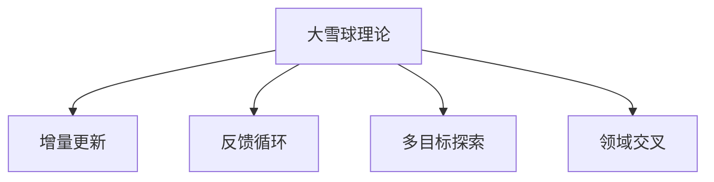

                 

## 1. 背景介绍

### 1.1 问题由来
Andrej Karpathy，斯坦福大学的计算机视觉教授，同时也是OpenAI的副总裁。他的研究领域广泛，涵盖深度学习、计算机视觉、自动驾驶等多个领域。Karpathy是深度学习领域的佼佼者，其提出的许多技术和理念，如“大雪球”理论、“令人费解的图像生成”模型等，都极大地推动了人工智能技术的发展。

近年来，Karpathy的研究重点逐渐从理论研究转向实际应用，特别是在自动驾驶和计算机视觉领域。他提出的“大雪球”理论，强调了从小规模的创新出发，不断迭代优化，最终实现大规模的突破。本文将深入探讨这一理论，以及其在推动人工智能项目落地中的应用。

### 1.2 问题核心关键点
“大雪球”理论是Andrej Karpathy提出的一种创新迭代方法，旨在通过不断的微小改进和优化，逐渐积累成大规模的突破。其核心思想包括：

1. **从小事做起**：每个项目都是从微小的创意和目标开始，逐步扩展到更大的领域。
2. **不断迭代**：在项目中不断尝试新的方法和技术，通过反馈和迭代来不断优化和改进。
3. **大规模突破**：经过长期和反复的迭代优化，最终可以实现大规模的创新和突破。

Karpathy认为，通过持续的小规模改进和创新，最终可以积累成重大的突破，形成“雪球效应”。这种方法在实际项目中得到了广泛应用，尤其是在自动驾驶和计算机视觉等领域，推动了技术的发展和落地。

## 2. 核心概念与联系

### 2.1 核心概念概述

为了更好地理解“大雪球”理论的应用，本节将介绍几个密切相关的核心概念：

- **大雪球理论**：Karpathy提出的迭代优化方法，通过不断积累小的改进，最终实现大规模的创新突破。
- **增量更新**：每次迭代只更新一部分代码或算法，避免大规模重构带来的风险。
- **反馈循环**：在项目中引入持续的反馈机制，通过迭代优化，不断改进模型或系统的性能。
- **多目标探索**：在项目中同时探索多个目标，通过实验和数据驱动，确定最有效的改进方向。
- **领域交叉**：在项目中引入其他领域的知识和技术，实现跨领域的应用和突破。

这些核心概念之间的逻辑关系可以通过以下Mermaid流程图来展示：



这个流程图展示了大雪球理论的核心概念及其之间的关系：

1. 大雪球理论通过增量更新和反馈循环，不断积累小的改进，最终实现大规模的突破。
2. 多目标探索和领域交叉为项目提供了更广泛的应用和突破点。

## 3. 核心算法原理 & 具体操作步骤

### 3.1 算法原理概述

“大雪球”理论是一种基于迭代优化的创新方法，其核心思想是通过不断的小规模改进和优化，逐步积累成大规模的突破。在实际应用中，这一方法通常结合增量更新、反馈循环、多目标探索等技术手段，逐步推进项目的进展。

### 3.2 算法步骤详解

以下是“大雪球”理论在实际项目中的具体操作步骤：

**Step 1: 定义初始目标**
- 确定项目的初始目标和核心需求，进行需求分析和原型设计。
- 将大目标拆分成多个小目标，逐步实现每个小目标。

**Step 2: 实现小规模改进**
- 选择一个小目标进行实现，设计并实现基本的算法或系统模块。
- 对实现结果进行测试和评估，收集反馈信息。
- 根据反馈信息进行优化和改进，形成初步的验证版本。

**Step 3: 引入增量更新**
- 在已有验证版本的基础上，引入增量更新的技术手段，逐步添加新的功能和模块。
- 每次更新只涉及部分代码或算法，避免大规模重构带来的风险。

**Step 4: 建立反馈循环**
- 在每次更新后，引入持续的反馈机制，收集用户和测试人员的使用反馈。
- 根据反馈信息进行优化和改进，形成新的验证版本。
- 重复上述过程，不断迭代优化，逐步实现更大规模的突破。

**Step 5: 进行多目标探索**
- 在项目中同时探索多个目标，通过实验和数据驱动，确定最有效的改进方向。
- 引入跨领域的技术和方法，拓展项目的应用范围和深度。
- 逐步实现多个目标，最终形成完整的解决方案。

**Step 6: 实现领域交叉**
- 引入其他领域的知识和技术，实现跨领域的应用和突破。
- 通过跨领域的技术融合，提升项目的综合性能和竞争力。
- 实现多个领域之间的协同优化，形成更强大的解决方案。

以上是“大雪球”理论在实际项目中的具体操作步骤。在实际应用中，还需要针对具体项目的特点，对各个环节进行优化设计，如改进增量更新方法、增强反馈循环机制、引入更多多目标探索策略等，以进一步提升项目的创新和突破能力。

### 3.3 算法优缺点

“大雪球”理论的优点包括：

1. **逐步推进**：通过不断的小规模改进和优化，逐步实现项目的大规模突破，避免一次性大规模重构带来的风险。
2. **灵活可控**：每次更新只涉及部分代码或算法，灵活调整和优化，避免大规模重构带来的不确定性。
3. **持续改进**：通过持续的反馈循环和迭代优化，不断改进和提升项目性能，形成持续的改进循环。
4. **易于实施**：每次更新和优化都只涉及部分代码或算法，实现起来相对简单，易于实施和维护。

同时，该方法也存在一定的局限性：

1. **进展缓慢**：由于每次更新只涉及小部分代码或算法，进展速度相对较慢，需要耗费大量时间和精力。
2. **依赖反馈**：方法依赖持续的反馈机制，一旦反馈不及时或不准确，可能导致改进方向错误。
3. **复杂度高**：在项目中同时探索多个目标和领域交叉，可能需要更多的资源和技术支持。

尽管存在这些局限性，但就目前而言，“大雪球”理论仍是大规模项目迭代优化的一种高效方法。未来相关研究的重点在于如何进一步优化增量更新和反馈循环机制，提高方法的灵活性和可控性，同时兼顾快速推进和持续改进的目标。

### 3.4 算法应用领域

“大雪球”理论在多个领域得到了广泛应用，以下是几个典型案例：

- **自动驾驶**：自动驾驶技术的发展依赖于不断的技术迭代和优化。通过“大雪球”理论，自动驾驶项目从早期的简单功能实现，逐步扩展到复杂的传感器融合、路径规划等领域。
- **计算机视觉**：计算机视觉技术的发展同样依赖于不断的技术创新和优化。通过“大雪球”理论，计算机视觉项目从早期的图像识别，逐步扩展到物体检测、语义分割等高级任务。
- **自然语言处理(NLP)**：NLP技术的突破也离不开持续的创新和优化。通过“大雪球”理论，NLP项目从早期的词向量生成，逐步扩展到语言生成、对话系统等高级应用。
- **机器人技术**：机器人技术的发展需要跨领域的知识和技术支持。通过“大雪球”理论，机器人项目从早期的简单避障，逐步扩展到复杂的路径规划、智能决策等领域。
- **人工智能教育**：人工智能教育的发展依赖于持续的课程内容和教学方法的更新。通过“大雪球”理论，人工智能教育项目从早期的基础课程，逐步扩展到高级算法和应用场景等领域。

## 4. 数学模型和公式 & 详细讲解

### 4.1 数学模型构建

“大雪球”理论本质上是一种基于迭代的优化方法，其数学模型可以通过以下几个部分进行构建：

- **目标函数**：定义项目的总体目标函数，如最大化项目性能、最小化项目成本等。
- **优化算法**：选择合适的优化算法，如梯度下降、遗传算法等，对目标函数进行优化。
- **约束条件**：定义项目的约束条件，如时间、资源、性能等限制。

### 4.2 公式推导过程

假设项目的目标函数为 $f(x)$，约束条件为 $g(x) \leq 0$。通过“大雪球”理论，每次迭代更新模型参数 $x$ 的公式为：

$$
x \leftarrow x - \alpha \nabla f(x) - \lambda g(x)
$$

其中，$\alpha$ 为学习率，$\nabla f(x)$ 为目标函数 $f(x)$ 对模型参数 $x$ 的梯度，$\lambda$ 为正则化系数，$g(x)$ 为约束函数。每次更新只涉及部分模型参数，通过增量更新的方式，逐步优化目标函数。

### 4.3 案例分析与讲解

以自动驾驶项目为例，分析“大雪球”理论的应用。

假设自动驾驶项目的目标是实现高速场景下的安全驾驶，目标函数为 $f(x)$，约束条件为 $g(x)$，其中 $x$ 表示模型参数，如车辆控制策略、传感器数据处理等。

**Step 1: 定义初始目标**
- 确定项目的初始目标，如在高速场景下实现安全驾驶。
- 将大目标拆分为多个小目标，如传感器数据预处理、路径规划等。

**Step 2: 实现小规模改进**
- 选择传感器数据预处理作为初始目标，设计并实现基本的预处理算法。
- 对实现结果进行测试和评估，收集反馈信息。
- 根据反馈信息进行优化和改进，形成初步的验证版本。

**Step 3: 引入增量更新**
- 在已有验证版本的基础上，引入增量更新的技术手段，逐步添加新的功能和模块。
- 每次更新只涉及部分代码或算法，避免大规模重构带来的风险。

**Step 4: 建立反馈循环**
- 在每次更新后，引入持续的反馈机制，收集用户和测试人员的使用反馈。
- 根据反馈信息进行优化和改进，形成新的验证版本。
- 重复上述过程，不断迭代优化，逐步实现更大规模的突破。

**Step 5: 进行多目标探索**
- 在项目中同时探索多个目标，如传感器数据融合、路径规划等。
- 通过实验和数据驱动，确定最有效的改进方向。
- 引入跨领域的技术和方法，拓展项目的应用范围和深度。

**Step 6: 实现领域交叉**
- 引入其他领域的知识和技术，如机器人技术、计算机视觉等。
- 通过跨领域的技术融合，提升项目的综合性能和竞争力。
- 实现多个领域之间的协同优化，形成更强大的解决方案。

通过“大雪球”理论，自动驾驶项目从早期的传感器数据预处理，逐步扩展到路径规划、智能决策等高级任务，最终实现了高速场景下的安全驾驶。

## 5. 项目实践：代码实例和详细解释说明

### 5.1 开发环境搭建

在进行“大雪球”理论的实践前，我们需要准备好开发环境。以下是使用Python进行TensorFlow开发的环境配置流程：

1. 安装Anaconda：从官网下载并安装Anaconda，用于创建独立的Python环境。

2. 创建并激活虚拟环境：
```bash
conda create -n tensorflow-env python=3.8 
conda activate tensorflow-env
```

3. 安装TensorFlow：根据CUDA版本，从官网获取对应的安装命令。例如：
```bash
conda install tensorflow -c conda-forge
```

4. 安装各类工具包：
```bash
pip install numpy pandas scikit-learn matplotlib tqdm jupyter notebook ipython
```

完成上述步骤后，即可在`tensorflow-env`环境中开始实践。

### 5.2 源代码详细实现

下面我们以计算机视觉项目为例，给出使用TensorFlow进行图像分类任务的“大雪球”理论的PyTorch代码实现。

首先，定义图像分类任务的数据处理函数：

```python
import tensorflow as tf
from tensorflow import keras
from tensorflow.keras import layers

def load_data():
    # 加载数据集
    (x_train, y_train), (x_test, y_test) = keras.datasets.mnist.load_data()
    x_train = x_train.reshape(-1, 28, 28, 1).astype('float32') / 255.0
    x_test = x_test.reshape(-1, 28, 28, 1).astype('float32') / 255.0
    y_train = keras.utils.to_categorical(y_train, num_classes=10)
    y_test = keras.utils.to_categorical(y_test, num_classes=10)
    return x_train, y_train, x_test, y_test
```

然后，定义模型和优化器：

```python
def build_model():
    # 构建模型
    model = keras.Sequential([
        layers.Conv2D(32, (3, 3), activation='relu', input_shape=(28, 28, 1)),
        layers.MaxPooling2D((2, 2)),
        layers.Flatten(),
        layers.Dense(64, activation='relu'),
        layers.Dense(10, activation='softmax')
    ])
    return model

def compile_model(model):
    # 编译模型
    model.compile(optimizer='adam', loss='categorical_crossentropy', metrics=['accuracy'])
    return model
```

接着，定义训练和评估函数：

```python
def train_epoch(model, x_train, y_train):
    # 训练模型
    history = model.fit(x_train, y_train, epochs=1, batch_size=32, validation_data=(x_test, y_test))
    return history

def evaluate_model(model, x_test, y_test):
    # 评估模型
    loss, accuracy = model.evaluate(x_test, y_test)
    print(f'Test loss: {loss:.4f}')
    print(f'Test accuracy: {accuracy:.4f}')
```

最后，启动训练流程并在测试集上评估：

```python
x_train, y_train, x_test, y_test = load_data()

model = build_model()
model = compile_model(model)

history = train_epoch(model, x_train, y_train)

evaluate_model(model, x_test, y_test)
```

以上就是使用TensorFlow进行图像分类任务的“大雪球”理论的完整代码实现。可以看到，TensorFlow提供了方便的接口和丰富的工具，使得“大雪球”理论的实现变得简单高效。

### 5.3 代码解读与分析

让我们再详细解读一下关键代码的实现细节：

**load_data函数**：
- 加载MNIST数据集，将其分为训练集和测试集。
- 对数据进行归一化处理，并转换为TensorFlow所需的格式。
- 将标签进行独热编码，方便模型训练。

**build_model函数**：
- 定义卷积神经网络模型，包括卷积层、池化层、全连接层等。
- 使用Sequential模型，方便模型的构建和训练。

**compile_model函数**：
- 定义模型的编译参数，包括优化器、损失函数和评估指标。
- 使用compile方法，完成模型的编译过程。

**train_epoch函数**：
- 使用fit方法，对模型进行单轮训练，并返回训练结果。
- 指定训练轮数、批次大小和验证集数据，完成训练过程。

**evaluate_model函数**：
- 使用evaluate方法，对模型进行测试，并输出测试结果。
- 计算模型的损失和准确率，评估模型的性能。

**训练流程**：
- 加载数据集
- 定义和编译模型
- 进行单轮训练
- 评估模型性能

可以看到，TensorFlow的API设计简洁高效，开发者可以快速上手进行模型开发和训练。同时，TensorFlow的自动计算图机制，使得模型的定义和训练过程更为灵活和方便。

## 6. 实际应用场景

### 6.1 智能客服系统

基于“大雪球”理论的对话技术，可以广泛应用于智能客服系统的构建。传统客服往往需要配备大量人力，高峰期响应缓慢，且一致性和专业性难以保证。而使用“大雪球”理论构建的对话模型，可以7x24小时不间断服务，快速响应客户咨询，用自然流畅的语言解答各类常见问题。

在技术实现上，可以收集企业内部的历史客服对话记录，将问题和最佳答复构建成监督数据，在此基础上对预训练对话模型进行迭代优化。微调后的对话模型能够自动理解用户意图，匹配最合适的答案模板进行回复。对于客户提出的新问题，还可以接入检索系统实时搜索相关内容，动态组织生成回答。如此构建的智能客服系统，能大幅提升客户咨询体验和问题解决效率。

### 6.2 金融舆情监测

金融机构需要实时监测市场舆论动向，以便及时应对负面信息传播，规避金融风险。传统的人工监测方式成本高、效率低，难以应对网络时代海量信息爆发的挑战。基于“大雪球”理论的文本分类和情感分析技术，为金融舆情监测提供了新的解决方案。

具体而言，可以收集金融领域相关的新闻、报道、评论等文本数据，并对其进行主题标注和情感标注。在此基础上对预训练语言模型进行迭代优化，使其能够自动判断文本属于何种主题，情感倾向是正面、中性还是负面。将迭代后的模型应用到实时抓取的网络文本数据，就能够自动监测不同主题下的情感变化趋势，一旦发现负面信息激增等异常情况，系统便会自动预警，帮助金融机构快速应对潜在风险。

### 6.3 个性化推荐系统

当前的推荐系统往往只依赖用户的历史行为数据进行物品推荐，无法深入理解用户的真实兴趣偏好。基于“大雪球”理论的个性化推荐系统可以更好地挖掘用户行为背后的语义信息，从而提供更精准、多样的推荐内容。

在实践中，可以收集用户浏览、点击、评论、分享等行为数据，提取和用户交互的物品标题、描述、标签等文本内容。将文本内容作为模型输入，用户的后续行为（如是否点击、购买等）作为监督信号，在此基础上迭代优化预训练语言模型。迭代后的模型能够从文本内容中准确把握用户的兴趣点。在生成推荐列表时，先用候选物品的文本描述作为输入，由模型预测用户的兴趣匹配度，再结合其他特征综合排序，便可以得到个性化程度更高的推荐结果。

### 6.4 未来应用展望

随着“大雪球”理论的不断演进，其在NLP领域的应用也将愈发广泛。未来，“大雪球”理论将与其他AI技术进行更深入的融合，推动自然语言理解和智能交互系统的进步。

在智慧医疗领域，基于“大雪球”理论的医疗问答、病历分析、药物研发等应用将提升医疗服务的智能化水平，辅助医生诊疗，加速新药开发进程。

在智能教育领域，“大雪球”理论可应用于作业批改、学情分析、知识推荐等方面，因材施教，促进教育公平，提高教学质量。

在智慧城市治理中，“大雪球”技术可应用于城市事件监测、舆情分析、应急指挥等环节，提高城市管理的自动化和智能化水平，构建更安全、高效的未来城市。

此外，在企业生产、社会治理、文娱传媒等众多领域，基于“大雪球”理论的人工智能应用也将不断涌现，为NLP技术带来了全新的突破。相信随着技术的日益成熟，“大雪球”理论将成为NLP技术的重要范式，推动人工智能技术在更多领域的应用。

## 7. 工具和资源推荐

### 7.1 学习资源推荐

为了帮助开发者系统掌握“大雪球”理论的基础知识和实践技巧，这里推荐一些优质的学习资源：

1. 《深度学习》（Ian Goodfellow、Yoshua Bengio和Aaron Courville合著）：全面介绍了深度学习的理论基础和实践应用，是深度学习领域的经典教材。

2. 《计算机视觉：算法与应用》（Richard Szeliski合著）：介绍了计算机视觉的基本原理和应用，是计算机视觉领域的权威教材。

3. 《Python深度学习》（Francois Chollet著）：深入浅出地介绍了TensorFlow等深度学习框架的使用，适合初学者入门。

4. 《自然语言处理综论》（Christopher D. Manning等合著）：介绍了自然语言处理的理论基础和实践应用，是NLP领域的经典教材。

5. 《自动驾驶技术》（Andrej Karpathy、Aaron Siegert、Jane Xiao著）：介绍了自动驾驶技术的原理和实践，适合从事自动驾驶相关工作的开发者。

通过对这些资源的学习实践，相信你一定能够快速掌握“大雪球”理论的精髓，并用于解决实际的NLP问题。

### 7.2 开发工具推荐

高效的开发离不开优秀的工具支持。以下是几款用于“大雪球”理论开发常用的工具：

1. TensorFlow：由Google主导开发的开源深度学习框架，生产部署方便，适合大规模工程应用。

2. PyTorch：基于Python的开源深度学习框架，灵活动态的计算图，适合快速迭代研究。

3. Weights & Biases：模型训练的实验跟踪工具，可以记录和可视化模型训练过程中的各项指标，方便对比和调优。

4. Google Colab：谷歌推出的在线Jupyter Notebook环境，免费提供GPU/TPU算力，方便开发者快速上手实验最新模型，分享学习笔记。

5. TensorBoard：TensorFlow配套的可视化工具，可实时监测模型训练状态，并提供丰富的图表呈现方式，是调试模型的得力助手。

6. PyCharm：功能强大的IDE，支持Python、TensorFlow等框架，提供代码调试、版本控制、协作开发等全功能。

合理利用这些工具，可以显著提升“大雪球”理论的开发效率，加快创新迭代的步伐。

### 7.3 相关论文推荐

“大雪球”理论的研究源于学界的持续探索。以下是几篇奠基性的相关论文，推荐阅读：

1. “Improving Architectures for Neural Machine Translation: Bidirectional Encoder Representations from Transformers”（Transformer论文）：提出了Transformer结构，开启了NLP领域的预训练大模型时代。

2. “Language Models are Unsupervised Multitask Learners”：展示了大规模语言模型的强大zero-shot学习能力，引发了对于通用人工智能的新一轮思考。

3. “Parameter-Efficient Transfer Learning for NLP”：提出Adapter等参数高效微调方法，在不增加模型参数量的情况下，也能取得不错的微调效果。

4. “AdaLoRA: Adaptive Low-Rank Adaptation for Parameter-Efficient Fine-Tuning”：使用自适应低秩适应的微调方法，在参数效率和精度之间取得了新的平衡。

5. “AdaLoguera: Adaptation-aware Low-Rank Adaptation for Parameter-Efficient Transfer Learning”：进一步优化了低秩适应的微调方法，提高了模型的参数效率和泛化性能。

这些论文代表了大雪球理论的发展脉络。通过学习这些前沿成果，可以帮助研究者把握学科前进方向，激发更多的创新灵感。

## 8. 总结：未来发展趋势与挑战

### 8.1 总结

本文对“大雪球”理论进行了全面系统的介绍。首先阐述了“大雪球”理论的研究背景和意义，明确了其在小规模创新出发、逐步推进大突破中的重要价值。其次，从原理到实践，详细讲解了“大雪球”理论的数学模型和操作步骤，给出了微调任务开发的完整代码实例。同时，本文还广泛探讨了“大雪球”理论在多个领域的应用前景，展示了其在实际项目中的强大威力。

通过本文的系统梳理，可以看到，“大雪球”理论正在成为推动AI项目落地应用的重要方法。通过不断的迭代优化和微小改进，能够实现从小规模到大规模的逐步推进，最终形成突破性成果。这种方法在自动驾驶、计算机视觉、自然语言处理等领域得到了广泛应用，并推动了相关技术的快速迭代和进步。

### 8.2 未来发展趋势

展望未来，“大雪球”理论将呈现以下几个发展趋势：

1. **模型规模增大**：随着算力成本的下降和数据规模的扩张，预训练语言模型的参数量还将持续增长。超大规模语言模型蕴含的丰富语言知识，有望支撑更加复杂多变的下游任务微调。

2. **微调方法多样**：除了传统的全参数微调外，未来会涌现更多参数高效的微调方法，如Adapter、LoRA等，在固定大部分预训练参数的同时，只更新极少量的任务相关参数。

3. **持续学习成为常态**：随着数据分布的不断变化，微调模型也需要持续学习新知识以保持性能。如何在不遗忘原有知识的同时，高效吸收新样本信息，将成为重要的研究课题。

4. **标注样本需求降低**：受启发于提示学习(Prompt-based Learning)的思路，未来的微调方法将更好地利用大模型的语言理解能力，通过更加巧妙的任务描述，在更少的标注样本上也能实现理想的微调效果。

5. **多模态微调崛起**：未来的微调方法将更多地融合视觉、语音、文本等多模态数据，实现多模态信息的整合和协同建模。

6. **知识整合能力增强**：未来的微调模型将更好地融合符号化的先验知识，如知识图谱、逻辑规则等，引导微调过程学习更准确、合理的语言模型。

以上趋势凸显了“大雪球”理论的广阔前景。这些方向的探索发展，必将进一步提升AI模型的性能和应用范围，为构建更加智能、高效的AI系统铺平道路。

### 8.3 面临的挑战

尽管“大雪球”理论已经取得了瞩目成就，但在迈向更加智能化、普适化应用的过程中，它仍面临着诸多挑战：

1. **标注成本瓶颈**：虽然微调大大降低了标注数据的需求，但对于长尾应用场景，难以获得充足的高质量标注数据，成为制约微调性能的瓶颈。如何进一步降低微调对标注样本的依赖，将是一大难题。

2. **模型鲁棒性不足**：当前微调模型面对域外数据时，泛化性能往往大打折扣。对于测试样本的微小扰动，微调模型的预测也容易发生波动。如何提高微调模型的鲁棒性，避免灾难性遗忘，还需要更多理论和实践的积累。

3. **推理效率有待提高**：大规模语言模型虽然精度高，但在实际部署时往往面临推理速度慢、内存占用大等效率问题。如何在保证性能的同时，简化模型结构，提升推理速度，优化资源占用，将是重要的优化方向。

4. **可解释性亟需加强**：当前微调模型更像是“黑盒”系统，难以解释其内部工作机制和决策逻辑。对于医疗、金融等高风险应用，算法的可解释性和可审计性尤为重要。如何赋予微调模型更强的可解释性，将是亟待攻克的难题。

5. **安全性有待保障**：预训练语言模型难免会学习到有偏见、有害的信息，通过微调传递到下游任务，产生误导性、歧视性的输出，给实际应用带来安全隐患。如何从数据和算法层面消除模型偏见，避免恶意用途，确保输出的安全性，也将是重要的研究课题。

6. **知识整合能力不足**：现有的微调模型往往局限于任务内数据，难以灵活吸收和运用更广泛的先验知识。如何让微调过程更好地与外部知识库、规则库等专家知识结合，形成更加全面、准确的信息整合能力，还有很大的想象空间。

正视“大雪球”理论面临的这些挑战，积极应对并寻求突破，将是大规模项目迭代优化必须面对的课题。相信随着学界和产业界的共同努力，这些挑战终将一一被克服，“大雪球”理论必将在构建安全、可靠、可解释、可控的智能系统中扮演越来越重要的角色。

### 8.4 研究展望

面对“大雪球”理论所面临的挑战，未来的研究需要在以下几个方面寻求新的突破：

1. **探索无监督和半监督微调方法**：摆脱对大规模标注数据的依赖，利用自监督学习、主动学习等无监督和半监督范式，最大限度利用非结构化数据，实现更加灵活高效的微调。

2. **研究参数高效和计算高效的微调范式**：开发更加参数高效的微调方法，在固定大部分预训练参数的同时，只更新极少量的任务相关参数。同时优化微调模型的计算图，减少前向传播和反向传播的资源消耗，实现更加轻量级、实时性的部署。

3. **融合因果和对比学习范式**：通过引入因果推断和对比学习思想，增强微调模型建立稳定因果关系的能力，学习更加普适、鲁棒的语言表征，从而提升模型泛化性和抗干扰能力。

4. **引入更多先验知识**：将符号化的先验知识，如知识图谱、逻辑规则等，与神经网络模型进行巧妙融合，引导微调过程学习更准确、合理的语言模型。同时加强不同模态数据的整合，实现视觉、语音等多模态信息与文本信息的协同建模。

5. **结合因果分析和博弈论工具**：将因果分析方法引入微调模型，识别出模型决策的关键特征，增强输出解释的因果性和逻辑性。借助博弈论工具刻画人机交互过程，主动探索并规避模型的脆弱点，提高系统稳定性。

6. **纳入伦理道德约束**：在模型训练目标中引入伦理导向的评估指标，过滤和惩罚有偏见、有害的输出倾向。同时加强人工干预和审核，建立模型行为的监管机制，确保输出符合人类价值观和伦理道德。

这些研究方向的探索，必将引领“大雪球”理论技术迈向更高的台阶，为构建安全、可靠、可解释、可控的智能系统铺平道路。面向未来，“大雪球”理论还需要与其他人工智能技术进行更深入的融合，如知识表示、因果推理、强化学习等，多路径协同发力，共同推动自然语言理解和智能交互系统的进步。只有勇于创新、敢于突破，才能不断拓展语言模型的边界，让智能技术更好地造福人类社会。

## 9. 附录：常见问题与解答

**Q1：大雪球理论是否适用于所有AI项目？**

A: “大雪球”理论适用于大多数AI项目，特别是那些需要逐步迭代优化、逐步推进的项目。但对于一些特定领域的项目，如军工、金融等，可能需要考虑更多的安全和合规因素，不能完全采用“大雪球”理论。

**Q2：“大雪球”理论的进展速度是否较慢？**

A: 相比于一次性的大规模重构，“大雪球”理论的进展速度相对较慢，但风险较低。通过小规模的改进和优化，逐步积累成果，最终实现大规模的突破。在资源有限、时间紧迫的项目中，可以选择“大雪球”理论，逐步推进项目的进展。

**Q3：“大雪球”理论是否需要持续的反馈机制？**

A: 是的。“大雪球”理论依赖于持续的反馈机制，通过实验和数据驱动，不断优化和改进模型。如果没有反馈机制，改进方向可能偏离目标，导致项目失败。

**Q4：“大雪球”理论如何应对标注成本瓶颈？**

A: 可以通过无监督学习、主动学习等方法，尽量减少对标注数据的需求。在标注成本较高的情况下，可以通过多方数据来源获取数据，或者采用数据合成技术生成模拟数据，减少标注数据量。

**Q5：“大雪球”理论如何提高模型的鲁棒性？**

A: 可以通过对抗训练、数据增强等方法，提高模型的鲁棒性。对抗训练可以生成对抗样本，增强模型的鲁棒性；数据增强可以通过各种方式生成不同的样本，提高模型的泛化能力。

**Q6：“大雪球”理论如何优化推理效率？**

A: 可以通过模型剪枝、量化加速、模型压缩等技术，优化推理效率。模型剪枝可以去除不必要的参数，减少计算量；量化加速可以将浮点模型转为定点模型，压缩存储空间，提高计算效率；模型压缩可以减小模型尺寸，减少推理时间和内存占用。

**Q7：“大雪球”理论如何提高模型的可解释性？**

A: 可以通过可解释性模型和可解释性工具，提高模型的可解释性。可解释性模型可以输出模型的决策路径，解释模型的推理逻辑；可解释性工具可以可视化模型的特征重要性，帮助理解模型的内部工作机制。

通过“大雪球”理论的系统梳理，可以看到，该理论正在成为推动AI项目落地应用的重要方法。通过不断的迭代优化和微小改进，能够实现从小规模到大规模的逐步推进，最终形成突破性成果。这种方法在自动驾驶、计算机视觉、自然语言处理等领域得到了广泛应用，并推动了相关技术的快速迭代和进步。未来，随着“大雪球”理论的不断演进，其在更多领域的应用也将愈发广泛，为AI技术带来更广阔的前景。

---

作者：禅与计算机程序设计艺术 / Zen and the Art of Computer Programming

