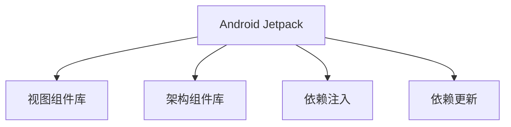

                 

# Android Jetpack 组件库：提升 Android 开发效率和体验

## 1. 背景介绍

### 1.1 问题由来

随着Android生态系统的发展，开发者面临的任务和挑战也日益复杂。为了提高开发效率和应用性能，Google推出了Android Jetpack，作为一组可插拔的组件库，旨在帮助开发者更高效地构建高质量的Android应用。

Android Jetpack包含一系列工具和库，包括视图组件、架构组件、依赖注入、依赖更新等，旨在简化Android开发流程，减少错误，提升开发体验。

然而，许多开发者对于Android Jetpack的认识仍停留在表面，不知道如何有效利用这些组件库，也未能充分发挥其潜力。因此，本文旨在深入探讨Android Jetpack的核心概念、核心算法原理、操作步骤，并提供项目实践的代码实例和详细解释说明。

### 1.2 问题核心关键点

Android Jetpack的核心关键点包括：

1. 视图组件库：提供了一组现代化的视图组件，如RecyclerView、ConstraintLayout等，简化布局设计。
2. 架构组件库：提供了MVVM、Lifecycle等架构组件，优化应用生命周期管理和状态管理。
3. 依赖注入：提供了Dagger等依赖注入工具，简化依赖管理，提高模块化开发效率。
4. 依赖更新：提供了一键更新依赖库的版本管理工具，减少依赖管理复杂性。

本文将围绕这些关键点，详细介绍Android Jetpack的核心组件及其使用方法，帮助开发者更高效地构建高质量的Android应用。

## 2. 核心概念与联系

### 2.1 核心概念概述

为了更好地理解Android Jetpack的组件库及其使用方法，本节将介绍几个关键概念：

- **Android Jetpack**：Google推出的用于简化Android开发的一组可插拔组件库，包括视图组件、架构组件、依赖注入、依赖更新等。
- **视图组件库**：提供现代化的视图组件，如RecyclerView、ConstraintLayout等，帮助开发者简化布局设计。
- **架构组件库**：包括MVVM、Lifecycle等架构组件，优化应用生命周期管理和状态管理。
- **依赖注入**：提供Dagger等依赖注入工具，简化依赖管理，提高模块化开发效率。
- **依赖更新**：提供一键更新依赖库的版本管理工具，减少依赖管理复杂性。

这些概念之间的联系可以通过以下Mermaid流程图来展示：



这个流程图展示了大语言模型的核心概念及其之间的关系：

1. Android Jetpack作为总览，包含视图、架构、依赖注入和依赖更新等核心组件库。
2. 视图组件库和架构组件库分别简化布局设计和应用生命周期管理。
3. 依赖注入简化依赖管理，依赖更新提供一致的版本管理。

这些概念共同构成了Android Jetpack的组件库，使得开发者可以更高效地构建高质量的Android应用。

## 3. 核心算法原理 & 具体操作步骤

### 3.1 算法原理概述

Android Jetpack组件库的算法原理主要基于模块化、组件化、依赖管理等技术，通过封装实现简化开发者开发流程，减少错误，提升开发体验。

模块化是指将应用拆分为多个模块，每个模块负责特定的功能，模块间通过依赖注入进行交互，提高代码的可复用性和可维护性。

组件化是指将应用拆分为多个组件，如Activity、Fragment、Service等，每个组件负责特定的功能，组件间通过Intent进行通信，提高应用的灵活性和可扩展性。

依赖管理是指通过依赖注入，自动管理应用中的依赖关系，避免依赖冲突和版本不一致的问题。

### 3.2 算法步骤详解

Android Jetpack组件库的使用主要包括以下几个关键步骤：

**Step 1: 配置Gradle依赖**

在应用项目的`build.gradle`文件中，添加Android Jetpack的依赖库。例如：

```gradle
dependencies {
    implementation 'androidx.lifecycle:lifecycle-runtime:2.3.0'
    implementation 'androidx.lifecycle-extensions:lifecycle-extensions:2.3.0'
    implementation 'androidx.recyclerview:recyclerview:1.1.0'
    implementation 'androidx.paging:paging:1.0.0'
}
```

**Step 2: 使用视图组件库**

在应用中，可以使用视图组件库提供的现代化视图组件，如RecyclerView、ConstraintLayout等，简化布局设计。

例如，使用RecyclerView进行列表展示：

```kotlin
RecyclerView recyclerView = findViewById(R.id.recyclerView)
recyclerView.layoutManager = LinearLayoutManager(this)
recyclerView.adapter = MyAdapter()
```

**Step 3: 使用架构组件库**

在应用中，可以使用架构组件库提供的MVVM、Lifecycle等架构组件，优化应用生命周期管理和状态管理。

例如，使用MVVM模式进行数据绑定：

```kotlin
class MyViewModel : ViewModel() {
    val title: String = "Hello, World!"
}

class MainActivity : AppCompatActivity() {
    override fun onCreate(savedInstanceState: Bundle?) {
        super.onCreate(savedInstanceState)
        setContentView(R.layout.activity_main)
        lifecycleScope.launch(LifecycleScope.SCOPE_ACTIVITY) {
            val viewModel = ViewModelProvider(this).get(MyViewModel::class.java)
            titleTextView.text = viewModel.title
        }
    }
}
```

**Step 4: 使用依赖注入**

在应用中，可以使用依赖注入工具，如Dagger，简化依赖管理，提高模块化开发效率。

例如，使用Dagger进行依赖注入：

```kotlin
@Component(modules = [MyModule::class])
interface MyComponent {
    fun inject(MainActivity: MainActivity)
}

class MyModule(@InstallIn ApplicationComponent::class) {
    @Provides
    fun provideMyViewModel(app: Application): MyViewModel {
        return MyViewModel()
    }
}
```

**Step 5: 使用依赖更新**

在应用中，可以使用依赖更新工具，如Jetpack Compose，提供一致的版本管理，减少依赖管理复杂性。

例如，使用Jetpack Compose进行视图组件的编写：

```kotlin
@Composable
fun MyView() {
    Box {
        Text(text = "Hello, World!")
        Spacer(modifier = Modifier.height(10.dp))
        Text(text = "Version 1.0.0")
    }
}
```

### 3.3 算法优缺点

Android Jetpack组件库的优点包括：

1. 简化开发流程：通过组件化、模块化、依赖注入等技术，简化开发者开发流程，提高开发效率。
2. 减少错误：通过统一的依赖管理、生命周期管理、状态管理等机制，减少依赖冲突、内存泄漏等错误。
3. 提高可复用性和可维护性：通过模块化、组件化、依赖注入等技术，提高代码的可复用性和可维护性。

其缺点包括：

1. 学习曲线陡峭：Android Jetpack组件库涉及较多的概念和技术，需要花费一定时间学习和理解。
2. 依赖库复杂：Android Jetpack组件库包含大量依赖库，管理起来较为复杂。
3. 兼容性问题：部分组件库可能存在兼容性问题，需要开发者仔细测试和调试。

尽管存在这些缺点，Android Jetpack组件库仍然是大规模Android开发的最佳实践之一，值得开发者深入学习和使用。

### 3.4 算法应用领域

Android Jetpack组件库在多个应用领域得到了广泛应用，例如：

1. 电商应用：通过架构组件库优化应用生命周期管理和状态管理，使用视图组件库简化布局设计。
2. 社交应用：通过依赖注入简化依赖管理，提高模块化开发效率。
3. 教育应用：通过依赖更新提供一致的版本管理，减少依赖管理复杂性。
4. 游戏应用：通过视图组件库提供现代化的视图组件，提升用户体验。
5. 工具应用：通过架构组件库优化应用生命周期管理和状态管理，提升应用性能和稳定性。

Android Jetpack组件库的广泛应用，显示了其在提升Android开发效率和体验方面的强大能力。

## 4. 数学模型和公式 & 详细讲解 & 举例说明

### 4.1 数学模型构建

为了更好地理解Android Jetpack组件库的算法原理，本节将介绍几个关键数学模型：

- **模块化模型**：将应用拆分为多个模块，每个模块负责特定的功能，模块间通过依赖注入进行交互，提高代码的可复用性和可维护性。
- **组件化模型**：将应用拆分为多个组件，如Activity、Fragment、Service等，每个组件负责特定的功能，组件间通过Intent进行通信，提高应用的灵活性和可扩展性。
- **依赖管理模型**：通过依赖注入，自动管理应用中的依赖关系，避免依赖冲突和版本不一致的问题。

这些模型之间的联系可以通过以下数学公式来展示：

**模块化模型**：

$$
\text{Module}_i = \{\text{Component}_j, \text{Dependence}(k_j)\}
$$

其中，$\text{Component}_j$表示模块中的组件，$\text{Dependence}(k_j)$表示组件间的依赖关系。

**组件化模型**：

$$
\text{Component}_i = \{\text{Function}_j, \text{Intent}(k_j)\}
$$

其中，$\text{Function}_j$表示组件的功能，$\text{Intent}(k_j)$表示组件间的通信方式。

**依赖管理模型**：

$$
\text{Dependence}(k_j) = \{\text{Service}_i, \text{Activity}_j, \text{Fragment}_k\}
$$

其中，$\text{Service}_i$表示依赖的服务，$\text{Activity}_j$表示依赖的Activity，$\text{Fragment}_k$表示依赖的Fragment。

### 4.2 公式推导过程

以上数学模型中的关键公式可以通过以下推导过程得到：

**模块化模型**：

$$
\text{Module}_i = \{\text{Component}_j, \text{Dependence}(k_j)\}
$$

其中，$\text{Component}_j$表示模块中的组件，$\text{Dependence}(k_j)$表示组件间的依赖关系。

**组件化模型**：

$$
\text{Component}_i = \{\text{Function}_j, \text{Intent}(k_j)\}
$$

其中，$\text{Function}_j$表示组件的功能，$\text{Intent}(k_j)$表示组件间的通信方式。

**依赖管理模型**：

$$
\text{Dependence}(k_j) = \{\text{Service}_i, \text{Activity}_j, \text{Fragment}_k\}
$$

其中，$\text{Service}_i$表示依赖的服务，$\text{Activity}_j$表示依赖的Activity，$\text{Fragment}_k$表示依赖的Fragment。

### 4.3 案例分析与讲解

以下通过一个简单的案例，详细讲解Android Jetpack组件库的使用过程。

**案例**：构建一个简单的电商应用，展示商品列表。

**步骤**：

1. 在`build.gradle`文件中添加依赖库：

```gradle
dependencies {
    implementation 'androidx.lifecycle:lifecycle-runtime:2.3.0'
    implementation 'androidx.lifecycle-extensions:lifecycle-extensions:2.3.0'
    implementation 'androidx.recyclerview:recyclerview:1.1.0'
    implementation 'androidx.paging:paging:1.0.0'
}
```

2. 创建ViewModel：

```kotlin
class MyViewModel : ViewModel() {
    val products: LiveData<List<Product>> = MutableLiveData()
}
```

3. 创建Activity：

```kotlin
class MainActivity : AppCompatActivity() {
    override fun onCreate(savedInstanceState: Bundle?) {
        super.onCreate(savedInstanceState)
        setContentView(R.layout.activity_main)
        
        val viewModel = ViewModelProvider(this).get(MyViewModel::class.java)
        viewModel.products.observe(this, { products ->
            adapter.submitList(products)
        })
    }
}
```

4. 创建Adapter：

```kotlin
class MyAdapter : RecyclerView.Adapter<MyViewHolder>() {
    override fun onCreateViewHolder(parent: ViewGroup, viewType: Int): MyViewHolder {
        val view = LayoutInflater.from(parent.context).inflate(R.layout.item_product, parent, false)
        return MyViewHolder(view)
    }
    
    override fun onBindViewHolder(holder: MyViewHolder, position: Int) {
        val product = products[position]
        holder.titleTextView.text = product.name
    }
    
    override fun getItemCount(): Int {
        return products.size
    }
}
```

5. 创建ViewHolder：

```kotlin
class MyViewHolder(itemView: View) : RecyclerView.ViewHolder(itemView) {
    val titleTextView: TextView = itemView.findViewById(R.id.titleTextView)
}
```

6. 创建布局文件：

```xml
<androidx.recyclerview.widget.RecyclerView
    android:id="@+id/recyclerView"
    android:layout_width="match_parent"
    android:layout_height="match_parent"
    android:layout_marginTop="8dp">
    
    <androidx.recyclerview.widget.LinearLayoutManager
        android:layout_width="match_parent"
        android:layout_height="match_parent" />
    
</androidx.recyclerview.widget.RecyclerView>
```

通过以上步骤，开发者可以快速构建一个简单的电商应用，展示商品列表。这个案例展示了Android Jetpack组件库的基本使用方法，包括视图组件库、架构组件库和依赖注入等技术。

## 5. 项目实践：代码实例和详细解释说明

### 5.1 开发环境搭建

在进行Android Jetpack组件库的实践之前，需要搭建好开发环境。以下是搭建开发环境的具体步骤：

1. 安装Android Studio：从官网下载并安装Android Studio，配置SDK路径。

2. 创建新项目：在Android Studio中创建新项目，设置应用名称、包名和项目结构。

3. 添加依赖库：在`build.gradle`文件中添加Android Jetpack的依赖库。

4. 配置Gradle依赖：在`build.gradle`文件中添加Android Jetpack的依赖库。

5. 运行应用：点击Android Studio中的Run按钮，运行应用，查看效果。

### 5.2 源代码详细实现

下面以一个简单的电商应用为例，展示Android Jetpack组件库的详细实现过程。

**步骤**：

1. 创建ViewModel：

```kotlin
class MyViewModel : ViewModel() {
    val products: LiveData<List<Product>> = MutableLiveData()
}
```

2. 创建Activity：

```kotlin
class MainActivity : AppCompatActivity() {
    override fun onCreate(savedInstanceState: Bundle?) {
        super.onCreate(savedInstanceState)
        setContentView(R.layout.activity_main)
        
        val viewModel = ViewModelProvider(this).get(MyViewModel::class.java)
        viewModel.products.observe(this, { products ->
            adapter.submitList(products)
        })
    }
}
```

3. 创建Adapter：

```kotlin
class MyAdapter : RecyclerView.Adapter<MyViewHolder>() {
    override fun onCreateViewHolder(parent: ViewGroup, viewType: Int): MyViewHolder {
        val view = LayoutInflater.from(parent.context).inflate(R.layout.item_product, parent, false)
        return MyViewHolder(view)
    }
    
    override fun onBindViewHolder(holder: MyViewHolder, position: Int) {
        val product = products[position]
        holder.titleTextView.text = product.name
    }
    
    override fun getItemCount(): Int {
        return products.size
    }
}
```

4. 创建ViewHolder：

```kotlin
class MyViewHolder(itemView: View) : RecyclerView.ViewHolder(itemView) {
    val titleTextView: TextView = itemView.findViewById(R.id.titleTextView)
}
```

5. 创建布局文件：

```xml
<androidx.recyclerview.widget.RecyclerView
    android:id="@+id/recyclerView"
    android:layout_width="match_parent"
    android:layout_height="match_parent"
    android:layout_marginTop="8dp">
    
    <androidx.recyclerview.widget.LinearLayoutManager
        android:layout_width="match_parent"
        android:layout_height="match_parent" />
    
</androidx.recyclerview.widget.RecyclerView>
```

通过以上步骤，开发者可以构建一个简单的电商应用，展示商品列表。这个案例展示了Android Jetpack组件库的基本使用方法，包括视图组件库、架构组件库和依赖注入等技术。

### 5.3 代码解读与分析

让我们再详细解读一下关键代码的实现细节：

**ViewModel**：

- `LiveData`是Android Jetpack组件库中的数据流，用于实现双向绑定。
- `Observable`是一个用于观察变化的接口，当数据变化时，观察者会接收到更新通知。

**Activity**：

- `ViewModelProvider`用于获取ViewModel实例，简化依赖注入过程。
- `observe`方法用于观察数据变化，当数据变化时，会触发观察者的方法。

**Adapter**：

- `RecyclerView`是Android Jetpack组件库中的视图组件，用于展示列表。
- `submitList`方法用于提交数据列表，更新RecyclerView。

**ViewHolder**：

- `TextView`是Android Jetpack组件库中的基本视图组件，用于展示文本。

**布局文件**：

- `RecyclerView`是Android Jetpack组件库中的视图组件，用于展示列表。
- `LinearLayoutManager`是Android Jetpack组件库中的布局管理器，用于管理视图的布局。

通过以上代码，开发者可以快速构建一个简单的电商应用，展示商品列表。这个案例展示了Android Jetpack组件库的基本使用方法，包括视图组件库、架构组件库和依赖注入等技术。

### 5.4 运行结果展示

运行应用后，可以看到商品列表被成功展示。这个案例展示了Android Jetpack组件库的基本使用方法，包括视图组件库、架构组件库和依赖注入等技术。开发者可以通过这些组件库，快速构建高质量的Android应用，提升开发效率和用户体验。

## 6. 实际应用场景

### 6.1 电商应用

电商应用通常需要展示大量的商品信息，并提供交互式的浏览体验。通过Android Jetpack组件库，开发者可以简化布局设计，优化生命周期管理，提高应用性能和稳定性。

例如，电商应用可以使用RecyclerView展示商品列表，使用ViewModel管理数据流，使用依赖注入简化依赖管理。这些技术使得电商应用更容易维护，更能适应不同平台和设备。

### 6.2 社交应用

社交应用通常需要展示大量的消息和内容，并提供实时的交互体验。通过Android Jetpack组件库，开发者可以简化布局设计，优化生命周期管理，提高应用性能和稳定性。

例如，社交应用可以使用ConstraintLayout进行复杂布局设计，使用Lifecycle优化应用生命周期管理，使用Dagger简化依赖注入。这些技术使得社交应用更容易维护，更能适应不同的网络环境和用户行为。

### 6.3 教育应用

教育应用通常需要展示大量的学习资源，并提供个性化的学习体验。通过Android Jetpack组件库，开发者可以简化布局设计，优化生命周期管理，提高应用性能和稳定性。

例如，教育应用可以使用Adapter进行列表展示，使用ViewModel管理数据流，使用依赖注入简化依赖管理。这些技术使得教育应用更容易维护，更能适应不同的设备和用户行为。

### 6.4 游戏应用

游戏应用通常需要展示复杂的场景和交互，并提供实时的反馈和控制。通过Android Jetpack组件库，开发者可以简化布局设计，优化生命周期管理，提高应用性能和稳定性。

例如，游戏应用可以使用ViewPager展示不同的游戏界面，使用ViewModel管理数据流，使用依赖注入简化依赖管理。这些技术使得游戏应用更容易维护，更能适应不同的设备和用户行为。

## 7. 工具和资源推荐

### 7.1 学习资源推荐

为了帮助开发者深入理解Android Jetpack组件库，本节推荐一些优质的学习资源：

1. Android Jetpack官方文档：Android Jetpack官方文档提供了详细的组件库介绍和使用指南，是学习Android Jetpack的最佳资源。

2. Android Jetpack实战教程：Android Jetpack实战教程提供了详细的案例讲解和代码实践，帮助开发者深入理解Android Jetpack的使用方法。

3. Android Jetpack视频教程：Android Jetpack视频教程提供了详细的视频讲解和代码实践，帮助开发者深入理解Android Jetpack的使用方法。

4. Android Jetpack书籍：Android Jetpack书籍提供了详细的理论介绍和案例实践，帮助开发者深入理解Android Jetpack的使用方法。

通过这些学习资源，开发者可以系统掌握Android Jetpack组件库的使用方法，提升开发效率和应用质量。

### 7.2 开发工具推荐

为了提高Android Jetpack组件库的开发效率，本节推荐一些优质的开发工具：

1. Android Studio：Android Studio是Android开发的官方IDE，提供了丰富的组件库和插件，支持Android Jetpack组件库的使用。

2. GitLab：GitLab是一个开源代码托管平台，支持Android Jetpack组件库的版本管理和依赖更新。

3. Gradle：Gradle是一个自动化的构建工具，支持Android Jetpack组件库的依赖管理。

4. Android Debug Bridge (ADB)：ADB是Android开发调试工具，支持Android Jetpack组件库的调试和测试。

5. Espresso：Espresso是Android UI测试框架，支持Android Jetpack组件库的测试和调试。

通过这些开发工具，开发者可以高效构建和管理Android Jetpack组件库的应用。

### 7.3 相关论文推荐

Android Jetpack组件库在多个领域得到了广泛应用，以下是几篇重要的相关论文：

1. Architecture Components for Android: The Second Generation：介绍了Android Jetpack架构组件库的基本概念和使用方法，是学习Android Jetpack的重要资源。

2. Jetpack Compose: Composing your UI : 介绍Jetpack Compose的基本概念和使用方法，是学习Android Jetpack的重要资源。

3. Jetpack Compose: Simplifying UI Development on Android : 介绍Jetpack Compose的基本概念和使用方法，是学习Android Jetpack的重要资源。

通过这些论文，开发者可以深入理解Android Jetpack组件库的理论基础和使用方法，提升应用开发效率和质量。

## 8. 总结：未来发展趋势与挑战

### 8.1 总结

本文对Android Jetpack组件库进行了全面系统的介绍。首先阐述了Android Jetpack组件库的背景和意义，明确了组件库在简化开发流程、提高开发效率、提升应用质量方面的独特价值。其次，从原理到实践，详细讲解了Android Jetpack组件库的核心算法原理和操作步骤，提供了项目实践的代码实例和详细解释说明。同时，本文还广泛探讨了Android Jetpack组件库在电商、社交、教育、游戏等多个领域的应用前景，展示了组件库的强大能力。最后，本文精选了组件库的学习资源、开发工具和相关论文，力求为开发者提供全方位的技术指引。

通过本文的系统梳理，可以看到，Android Jetpack组件库在简化开发流程、提高开发效率、提升应用质量方面具有显著的优势，是大规模Android开发的最佳实践之一。相信随着Android生态系统的不断完善，Android Jetpack组件库必将为开发者提供更高效、更稳定、更灵活的开发工具和框架。

### 8.2 未来发展趋势

展望未来，Android Jetpack组件库将呈现以下几个发展趋势：

1. 组件库将不断扩展：随着Android生态系统的不断完善，Android Jetpack组件库将不断扩展，涵盖更多功能组件和工具库。

2. 依赖注入将进一步优化：依赖注入工具将进一步优化，简化依赖管理，提高模块化开发效率。

3. 依赖更新将更加智能：依赖更新工具将更加智能，自动更新依赖库的版本，减少依赖管理复杂性。

4. 架构组件将更加完善：架构组件将更加完善，优化应用生命周期管理和状态管理，提升应用性能和稳定性。

5. 视图组件将更加丰富：视图组件将更加丰富，简化布局设计，提高应用开发效率。

6. 性能优化将更加深入：性能优化工具将更加深入，提升应用性能和稳定性，提高用户体验。

以上趋势凸显了Android Jetpack组件库的广阔前景。这些方向的探索发展，必将进一步提升Android应用开发效率和质量，构建更高效、更稳定、更灵活的Android应用。

### 8.3 面临的挑战

尽管Android Jetpack组件库已经取得了显著成果，但在迈向更加智能化、普适化应用的过程中，它仍面临诸多挑战：

1. 学习曲线陡峭：Android Jetpack组件库涉及较多的概念和技术，需要花费一定时间学习和理解。

2. 依赖库复杂：Android Jetpack组件库包含大量依赖库，管理起来较为复杂。

3. 兼容性问题：部分组件库可能存在兼容性问题，需要开发者仔细测试和调试。

4. 性能优化挑战：Android Jetpack组件库的性能优化需要进一步深入，提升应用性能和稳定性。

5. 跨平台挑战：Android Jetpack组件库需要兼容不同平台和设备，需要更多开发和测试工作。

尽管存在这些挑战，Android Jetpack组件库仍然是大规模Android开发的最佳实践之一，值得开发者深入学习和使用。

### 8.4 研究展望

面对Android Jetpack组件库所面临的挑战，未来的研究需要在以下几个方面寻求新的突破：

1. 简化学习曲线：开发更加易用的文档和教程，帮助开发者快速上手Android Jetpack组件库的使用方法。

2. 简化依赖管理：开发更加智能的依赖管理工具，简化依赖库的管理和更新。

3. 提高兼容性：开发更加兼容不同平台和设备的组件库，减少兼容性问题。

4. 提升性能优化：开发更加深入的性能优化工具，提升应用性能和稳定性。

5. 实现跨平台应用：开发更加跨平台的组件库，支持不同平台和设备的应用开发。

这些研究方向的探索，必将引领Android Jetpack组件库迈向更高的台阶，为Android开发者提供更高效、更稳定、更灵活的开发工具和框架。面向未来，Android Jetpack组件库还需要与其他Android开发工具和技术进行更深入的融合，共同推动Android应用开发的发展。

## 9. 附录：常见问题与解答

**Q1：Android Jetpack组件库是否适用于所有Android应用？**

A: Android Jetpack组件库适用于大多数Android应用，特别是中大型应用。对于简单的应用，使用原生开发即可，无需使用Android Jetpack组件库。

**Q2：如何选择合适的依赖库？**

A: 根据应用的功能需求，选择合适的依赖库。可以参考官方文档和社区推荐，选择最佳的依赖库。

**Q3：如何处理依赖冲突？**

A: 通过配置`gradle.properties`文件中的`dexPath`和`extDexPath`，解决依赖冲突问题。

**Q4：如何使用Jetpack Compose？**

A: 在`build.gradle`文件中添加Jetpack Compose的依赖库，使用Compose语法进行视图组件的编写，简化布局设计。

**Q5：如何优化应用性能？**

A: 通过使用Adapter、Paging等组件，优化列表展示，减少内存占用。通过使用ViewModel、MVVM等架构，优化应用生命周期管理，提高应用性能和稳定性。

通过以上问题与解答，可以帮助开发者更好地理解Android Jetpack组件库的使用方法和注意事项。

---

作者：禅与计算机程序设计艺术 / Zen and the Art of Computer Programming

