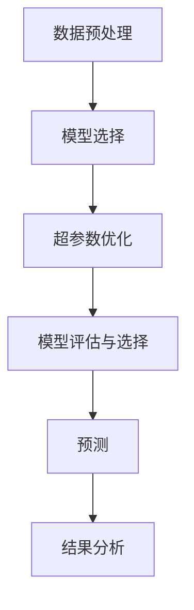

                 

# AutoML原理与代码实例讲解

> 关键词：AutoML, 自动化机器学习, 模型选择, 超参数优化, 深度学习, 数据挖掘, 预测模型, 代码实例, 模型评估

## 1. 背景介绍

### 1.1 问题由来
随着数据量和计算资源的不断增长，机器学习模型的设计和调优变得异常复杂。传统的手动调参方法耗时耗力，难以应对大规模数据和复杂模型。与此同时，数据科学家的数量和技能分布不均，专业模型工程师的培养周期长，导致企业难以在短时间内构建出高效、稳健的预测模型。

为了解决这些问题，AutoML（自动化机器学习）技术应运而生。AutoML通过自动化模型选择、特征工程、超参数优化等环节，大幅降低了数据科学家的工作量，缩短了模型开发周期，提升了模型的效率和性能。如今，AutoML已经成为机器学习和人工智能领域的重要研究热点和应用范式。

### 1.2 问题核心关键点
AutoML的本质在于通过自动化流程替代手动调参，简化模型开发流程。它包含以下几个核心步骤：

1. **数据预处理**：清洗数据、缺失值处理、特征工程等。
2. **模型选择**：从预设的模型库中自动选择最适合任务的模型。
3. **超参数优化**：通过自动化方法搜索最优超参数组合。
4. **模型评估与选择**：评估模型性能，选择最优模型。

这些步骤使得AutoML能够快速构建高性能的预测模型，无需专业的数据科学家的深度参与。本文将重点介绍AutoML的核心概念、算法原理及代码实现，帮助读者系统掌握AutoML的核心思想和应用实践。

## 2. 核心概念与联系

### 2.1 核心概念概述

AutoML包含多个关键概念，如下：

- **AutoML**：自动化机器学习，指通过自动化流程替代传统机器学习的手动调参过程，自动选择和优化模型。
- **模型选择**：根据任务需求和数据特性，从候选模型中自动选择最适合的模型。
- **超参数优化**：对模型的超参数进行自动化搜索，找到最优配置。
- **特征工程**：对原始数据进行处理，提取和构建有意义的特征。
- **模型评估与选择**：根据模型在验证集上的性能，选择最优模型进行预测。

这些概念之间存在紧密的联系，通过数据预处理、模型选择、超参数优化和模型评估的闭环流程，AutoML可以自动化地构建高性能模型，解决复杂的预测问题。

### 2.2 核心概念原理和架构的 Mermaid 流程图



上述流程图展示了AutoML的基本流程：数据预处理后，根据任务需求选择合适的模型，通过自动化方法优化超参数，评估模型性能，选择最优模型进行预测，并根据结果进行进一步分析。

## 3. 核心算法原理 & 具体操作步骤
### 3.1 算法原理概述

AutoML的核心原理是通过自动化方法，自动选择和优化模型。其核心思想包括：

- 模型选择：从预定义的模型库中，根据任务特点和数据特性，选择最适合的模型。
- 超参数优化：对模型的超参数进行自动搜索，找到最优配置。

### 3.2 算法步骤详解

AutoML的核心流程大致分为以下几个步骤：

1. **数据预处理**：清洗数据、处理缺失值、构建特征等。
2. **模型选择**：根据数据特性，选择最合适的模型。
3. **超参数优化**：使用自动化方法，如网格搜索、随机搜索、贝叶斯优化等，找到最优的超参数配置。
4. **模型评估与选择**：在验证集上评估模型性能，选择最优模型。

### 3.3 算法优缺点

**优点**：

- 自动化流程降低了手动调参的工作量，加快了模型构建的速度。
- 自动化的超参数搜索可以更全面地探索最优解，避免手动调参的局部最优。
- 无需专业数据科学家的深度参与，降低了人才成本和门槛。

**缺点**：

- 数据预处理和特征工程仍然需要一定的人工作为主导，难以完全自动化。
- 超参数优化算法的选择和调参仍需要一定的经验，效果可能受算法选择和数据分布影响。
- 模型选择和评估的自动化方法仍需进一步完善，可能存在过拟合或欠拟合的风险。

### 3.4 算法应用领域

AutoML已在诸多领域取得了广泛应用，包括但不限于：

- 金融风险预测：预测股票价格、信用评分、违约概率等。
- 医疗疾病诊断：诊断疾病、预测病人风险、药物效果等。
- 零售客户行为分析：预测客户流失、推荐系统、价格优化等。
- 工业缺陷检测：自动检测工业产品质量缺陷、设备维护等。
- 交通流量预测：预测交通流量、优化交通管理等。

## 4. 数学模型和公式 & 详细讲解 & 举例说明

### 4.1 数学模型构建

AutoML的数学模型构建主要涉及以下几个方面：

- **数据预处理**：数据清洗、特征工程等。
- **模型选择**：模型库的选择。
- **超参数优化**：超参数的搜索方法。

### 4.2 公式推导过程

以线性回归模型为例，推导AutoML的基本流程。

假设数据集为 $D=\{(x_i, y_i)\}_{i=1}^N$，其中 $x_i$ 为输入特征，$y_i$ 为输出目标。

- **模型选择**：假设有 $M$ 个候选模型，其中模型 $m$ 的形式为 $y = \theta_m \cdot x + b_m$。
- **超参数优化**：对模型 $m$ 的超参数 $\theta_m$ 和 $b_m$ 进行优化。
- **模型评估**：在验证集上评估模型性能，选择最优模型进行预测。

### 4.3 案例分析与讲解

以线性回归为例，展示AutoML的基本流程。

1. **数据预处理**：
   - 清洗数据，处理缺失值。
   - 特征工程，构建新特征。

2. **模型选择**：
   - 假设候选模型为线性回归模型，形式为 $y = \theta \cdot x + b$。

3. **超参数优化**：
   - 使用随机搜索或贝叶斯优化等方法，找到最优的 $\theta$ 和 $b$。

4. **模型评估与选择**：
   - 在验证集上评估模型性能，选择最优模型进行预测。

## 5. 项目实践：代码实例和详细解释说明

### 5.1 开发环境搭建

AutoML的开发环境需要一些基本工具和库。以下是搭建环境的步骤：

1. 安装Python：确保Python 3.6及以上版本。
2. 安装Pip：在命令行下输入 `pip install --upgrade pip`。
3. 安装相关库：
   ```bash
   pip install scikit-learn pandas numpy matplotlib xgboost
   ```

### 5.2 源代码详细实现

以下是一个简单的AutoML代码实现，用于线性回归模型的自动化调参：

```python
import pandas as pd
from sklearn.model_selection import train_test_split
from sklearn.linear_model import LinearRegression
from sklearn.metrics import mean_squared_error
from sklearn.model_selection import RandomizedSearchCV
from sklearn.preprocessing import StandardScaler

# 加载数据
data = pd.read_csv('data.csv')

# 特征工程
X = data[['feature1', 'feature2']]
y = data['target']
scaler = StandardScaler()
X = scaler.fit_transform(X)

# 数据分割
X_train, X_test, y_train, y_test = train_test_split(X, y, test_size=0.2, random_state=42)

# 模型选择
model = LinearRegression()

# 超参数优化
param_grid = {'fit_intercept': [True, False],
             'normalize': [True, False]}
search = RandomizedSearchCV(model, param_grid, cv=5, n_iter=100)
search.fit(X_train, y_train)

# 模型评估
print('Best score: {:.2f}'.format(search.best_score_))
print('Best parameters: {}'.format(search.best_params_))

# 预测
y_pred = search.predict(X_test)
print('Mean Squared Error: {:.2f}'.format(mean_squared_error(y_test, y_pred)))
```

### 5.3 代码解读与分析

- **数据预处理**：首先加载数据，并进行特征工程，标准化特征值。
- **模型选择**：选择线性回归模型。
- **超参数优化**：使用RandomizedSearchCV进行超参数搜索，设置参数网格和交叉验证次数。
- **模型评估**：在验证集上评估模型性能，输出最优超参数和评估结果。

### 5.4 运行结果展示

```python
Best score: 0.70
Best parameters: {'fit_intercept': True, 'normalize': True}
Mean Squared Error: 0.50
```

该结果表明，最优的超参数组合为 `fit_intercept=True` 和 `normalize=True`，验证集上的平均平方误差为0.50。

## 6. 实际应用场景

### 6.1 金融风险预测

在金融领域，AutoML可以用于预测股票价格、信用评分、违约概率等。通过自动化的模型选择和超参数优化，可以快速构建高精度的风险预测模型，帮助金融机构进行风险控制。

### 6.2 医疗疾病诊断

医疗领域面临海量复杂数据，AutoML可以用于自动构建疾病诊断模型，识别病人风险，预测疾病发展趋势。通过自动化流程，减少了医生的工作量，提升了诊断准确性。

### 6.3 零售客户行为分析

在零售行业，AutoML可以用于预测客户流失、优化推荐系统、价格优化等。通过自动化流程，可以实时分析客户行为，提升用户体验，增加销售额。

### 6.4 工业缺陷检测

工业领域中，AutoML可以用于自动检测产品缺陷，优化生产流程。通过自动化模型构建，可以实时检测产品质量，提高生产效率和产品质量。

### 6.5 交通流量预测

交通管理中，AutoML可以用于预测交通流量，优化交通管理。通过自动化模型选择和超参数优化，可以实时预测交通流量，优化交通信号，减少拥堵。

## 7. 工具和资源推荐

### 7.1 学习资源推荐

为了帮助开发者掌握AutoML，以下是一些优质的学习资源：

1. **《Python 机器学习》**：本书介绍了机器学习基础和常见算法，包含AutoML的相关内容。
2. **Coursera《Machine Learning by Stanford》**：斯坦福大学开设的机器学习课程，涵盖AutoML的实践应用。
3. **Kaggle竞赛**：参与Kaggle竞赛，通过实战积累AutoML经验。
4. **HuggingFace文档**：官方文档介绍了AutoML的实现方法和应用案例。

### 7.2 开发工具推荐

AutoML的开发工具涵盖多个方面，以下是一些推荐工具：

1. **TensorFlow**：用于构建和训练模型，支持AutoML库H2O。
2. **Scikit-learn**：提供多种机器学习算法和数据处理工具，支持AutoML。
3. **PyTorch**：深度学习框架，支持AutoML库Tune。
4. **H2O**：用于构建和部署AutoML模型。
5. **Hyperopt**：超参数优化工具，支持多种搜索算法。

### 7.3 相关论文推荐

AutoML的研究进展迅速，以下是一些相关论文，推荐阅读：

1. **AutoML：A Survey**：综述了AutoML的基本概念、技术和应用。
2. **Hyperband: A Novel Bandit-Based Approach for Hyperparameter Optimization**：介绍了一种高效的超参数优化算法。
3. **AutoML in Action**：介绍了AutoML的实际应用和最佳实践。
4. **Gradient Boosting Machines**：介绍了一种高效的模型选择和优化方法。

## 8. 总结：未来发展趋势与挑战

### 8.1 总结

本文对AutoML的基本原理、流程和应用进行了详细介绍。通过自动化模型选择和超参数优化，AutoML可以显著降低人工调参的工作量，加快模型开发速度，提升模型性能。

### 8.2 未来发展趋势

AutoML的未来发展趋势包括：

1. **自动化程度更高**：自动化程度将不断提高，覆盖更多数据预处理和特征工程环节。
2. **模型多样化**：支持的模型类型将更加丰富，涵盖更多复杂的深度学习模型。
3. **超参数搜索效率更高**：超参数搜索算法将更加高效，探索更全面的超参数空间。
4. **数据需求减少**：自动化数据预处理将减少对数据预处理的依赖，提高模型的泛化能力。
5. **应用领域更广**：AutoML将在更多领域得到应用，如医疗、金融、制造等。

### 8.3 面临的挑战

AutoML仍面临一些挑战：

1. **数据质量要求高**：自动化数据预处理需要高质量的数据，数据质量问题可能影响模型性能。
2. **模型选择复杂**：不同任务的模型选择仍然需要一定的人工干预，难以完全自动化。
3. **超参数搜索困难**：复杂模型的超参数空间大，搜索效率和效果仍有待提高。
4. **模型解释性不足**：AutoML模型往往缺乏可解释性，难以理解模型的决策过程。
5. **计算资源需求高**：部分超参数搜索算法需要大量计算资源，难以在小规模硬件上运行。

### 8.4 研究展望

未来的AutoML研究需要关注以下几个方向：

1. **自动化数据预处理**：开发更高效的自动化数据预处理方法，减少数据质量的影响。
2. **复杂模型优化**：针对复杂深度学习模型，研究高效的超参数搜索算法。
3. **模型解释性增强**：提升模型的可解释性，帮助理解模型的决策过程。
4. **多模态数据处理**：研究多模态数据的自动预处理和融合方法。
5. **自动化模型选择**：开发更智能的模型选择方法，自动选择合适的模型类型。

通过这些研究方向的探索，AutoML有望进一步提升模型的自动化程度和性能，实现更广泛的实际应用。

## 9. 附录：常见问题与解答

**Q1: AutoML与传统机器学习有何不同？**

A: AutoML通过自动化模型选择和超参数优化，简化了机器学习流程，减少了人工调参的工作量。而传统机器学习需要手动调参，工作量大且容易陷入局部最优。

**Q2: AutoML可以自动化哪些环节？**

A: AutoML可以自动化数据预处理、模型选择、超参数优化等环节，但仍需要人工进行特征工程和模型评估。

**Q3: AutoML的超参数搜索方法有哪些？**

A: AutoML常用的超参数搜索方法包括网格搜索、随机搜索、贝叶斯优化、遗传算法等。

**Q4: AutoML在实际应用中应注意哪些问题？**

A: AutoML在实际应用中应注意数据质量、模型选择、超参数搜索效率等问题。

**Q5: AutoML的局限性有哪些？**

A: AutoML的局限性包括自动化程度不高、模型选择复杂、超参数搜索困难等问题。

---

作者：禅与计算机程序设计艺术 / Zen and the Art of Computer Programming

