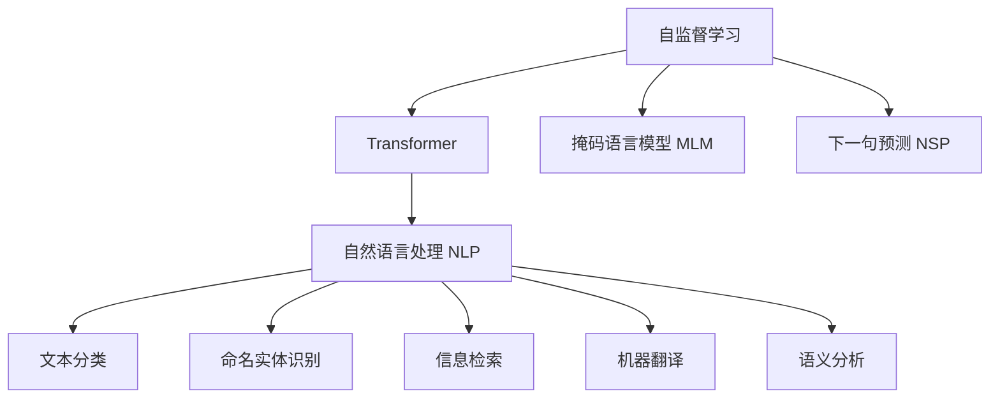

                 

# BERT 原理与代码实例讲解

> 关键词：BERT, 自监督学习, 预训练, Transformer, Attention, 代码实例, 自然语言处理(NLP)

## 1. 背景介绍

### 1.1 问题由来
Transformer结构的提出，标志着现代深度学习进入以自注意力机制为核心的新阶段。在此基础上，Google的BERT（Bidirectional Encoder Representations from Transformers）模型进一步通过大规模语料自监督预训练，成为NLP领域的里程碑。BERT不仅刷新了多项NLP任务的SOTA性能，其训练策略和架构设计也奠定了后续诸多模型的基础。本文将详细讲解BERT的原理，并结合代码实例，介绍如何利用BERT进行文本分类、命名实体识别等NLP任务的开发。

### 1.2 问题核心关键点
本节将概述BERT的核心概念和设计思路，帮助读者系统理解其工作原理和创新点。

- BERT的**自监督预训练**：通过对大规模无标签语料进行掩码语言模型（Masked Language Model, MLM）和下一句预测（Next Sentence Prediction, NSP）等自监督任务训练，学习语言表示。
- BERT的**双向Transformer结构**：与自回归模型不同，双向Transformer结构使得模型能够同时考虑上下文信息，更加准确地理解文本。
- BERT的**代码实现**：虽然Google实现了BERT官方库，但通过开源实现，如HuggingFace的Transformers库，可以更方便地进行模型训练和微调。

## 2. 核心概念与联系

### 2.1 核心概念概述

为更好地理解BERT的原理和实现，本节将介绍几个密切相关的核心概念：

- **自监督学习（Self-supervised Learning）**：指通过无标签数据进行学习，学习目标是从数据自身挖掘出有意义的表示。
- **Transformer结构**：一种由多头自注意力机制和全连接层构成的神经网络结构，能够有效处理序列数据。
- **掩码语言模型（MLM）**：一种自监督任务，模型在输入部分词被随机掩码的情况下，通过上下文预测缺失部分，学习词汇与语境的映射关系。
- **下一句预测（NSP）**：一种自监督任务，模型学习两个句子是否是连续的，用于捕捉句子间的关系。
- **HuggingFace Transformers库**：一个集成了多种预训练语言模型的开源库，支持BERT等模型的训练、微调等操作。

这些概念之间的逻辑关系可以通过以下Mermaid流程图来展示：



这个流程图展示了自监督学习、Transformer结构、MLM和NSP任务与NLP各任务之间的联系：

1. 自监督学习通过MLM和NSP任务训练Transformer模型。
2. 预训练模型（如BERT）可用于文本分类、命名实体识别、信息检索、机器翻译、语义分析等多个NLP任务。

## 3. 核心算法原理 & 具体操作步骤
### 3.1 算法原理概述

BERT通过大规模语料的自监督预训练，学习出通用的语言表示。具体步骤如下：

1. 在大规模无标签文本语料上，进行掩码语言模型（MLM）和下一句预测（NSP）训练。MLM通过随机掩码输入文本中部分词，让模型预测这些词，学习词汇与上下文的映射关系；NSP任务通过预测两个句子是否是连续的，学习句子间的关系。
2. 在预训练完成后，将模型微调（Fine-tuning）为特定任务的模型，如文本分类、命名实体识别等，以适应下游任务的需求。

### 3.2 算法步骤详解

#### 3.2.1 数据准备

BERT需要大规模无标签的文本数据进行预训练，如Wikipedia、新闻、书籍等。数据的预处理通常包括以下几个步骤：

1. 分词：将原始文本划分为单词或子词，构成序列。
2. 编码：将分词后的序列编码为Tensor形式，作为模型输入。
3. 填充和截断：将序列填充或截断至固定长度，通常为512。
4. 掩码：随机掩码输入序列中部分词，构成掩码语言模型。

#### 3.2.2 模型训练

BERT模型的训练主要分为预训练和微调两个阶段：

1. 预训练：在无标签数据上，使用MLM和NSP任务训练BERT模型，学习通用的语言表示。预训练过程通常需要多GPU、大规模内存和高性能计算资源。
2. 微调：在特定任务的有标签数据上，使用Fine-tuning方法调整模型参数，使其适应下游任务。

### 3.3 算法优缺点

BERT作为预训练语言模型，具有以下优点：

- **通用性强**：在大规模语料上预训练后，BERT模型可以应用于多种NLP任务，如文本分类、命名实体识别、机器翻译等。
- **效果好**：在多个任务上取得了SOTA性能，提升了模型在新样本上的泛化能力。
- **预训练过程高效**：通过自监督任务训练，显著减少了标注数据的需求。

同时，BERT也存在以下缺点：

- **计算资源需求高**：预训练需要大量GPU和内存资源，微调也需较多计算资源。
- **可解释性差**：BERT作为黑盒模型，其决策过程难以解释。
- **训练时间长**：预训练和微调过程通常需要几天甚至几周的时间。
- **依赖语料**：BERT依赖大规模无标签语料，对数据质量要求高。

### 3.4 算法应用领域

BERT的预训练和微调范式，已经广泛应用于多个NLP领域：

- **文本分类**：如情感分析、新闻分类等。通过微调BERT，使其学习文本-类别映射。
- **命名实体识别**：识别文本中的人名、地名、机构名等特定实体。通过微调BERT，使其掌握实体边界和类型。
- **机器翻译**：将源语言文本翻译成目标语言。通过微调BERT，使其学习语言-语言映射。
- **问答系统**：对自然语言问题给出答案。将问题-答案对作为微调数据，训练BERT模型学习匹配答案。
- **文本摘要**：将长文本压缩成简短摘要。通过微调BERT，使其学习抓取要点。
- **对话系统**：使机器能够与人自然对话。将多轮对话历史作为上下文，微调BERT进行回复生成。

除了这些经典任务外，BERT的预训练和微调方法也被创新性地应用到更多场景中，如代码生成、情感分析、信息检索等，为NLP技术带来了全新的突破。

## 4. 数学模型和公式 & 详细讲解
### 4.1 数学模型构建

BERT的预训练过程主要通过掩码语言模型（MLM）和下一句预测（NSP）任务进行。以下是数学模型的详细构建过程。

记预训练BERT模型为 $M_{\theta}:\mathcal{X} \rightarrow \mathcal{Y}$，其中 $\mathcal{X}$ 为输入空间，$\mathcal{Y}$ 为输出空间，$\theta$ 为模型参数。假设训练数据集为 $\{(x_i, y_i)\}_{i=1}^N$，其中 $x_i$ 为输入，$y_i$ 为输出标签。

#### 掩码语言模型（MLM）

MLM任务的目标是预测输入序列中随机掩码的词汇，模型在每个位置 $j$ 的预测概率为：

$$
P_{\theta}(\hat{x}_j|x_1, x_2, ..., x_j, ..., x_N)
$$

其中 $\hat{x}_j$ 表示被掩码的词汇。

对于给定输入 $x$，MLM损失函数为：

$$
\mathcal{L}_{MLM}(\theta) = -\frac{1}{N}\sum_{i=1}^N \log P_{\theta}(\hat{x}_j|x_1, x_2, ..., x_j, ..., x_N)
$$

#### 下一句预测（NSP）

NSP任务的目标是预测两个句子是否是连续的，模型在每个位置的预测概率为：

$$
P_{\theta}(y_i|x_1, x_2, ..., x_i, ..., x_N)
$$

其中 $y_i$ 表示句子对，$x_i$ 为句子1，$x_{i+1}$ 为句子2。

对于给定输入 $x$，NSP损失函数为：

$$
\mathcal{L}_{NSP}(\theta) = -\frac{1}{N}\sum_{i=1}^N \log P_{\theta}(y_i|x_1, x_2, ..., x_i, ..., x_N)
$$

### 4.2 公式推导过程

以下是掩码语言模型（MLM）和下一句预测（NSP）的公式推导过程。

首先，定义模型在输入 $x$ 上的输出为 $M_{\theta}(x)$，为一个向量，其中每个元素表示一个词汇的概率分布。

#### 掩码语言模型（MLM）

对于被掩码的词汇 $x_j$，模型的预测概率为：

$$
P_{\theta}(\hat{x}_j|x_1, x_2, ..., x_j, ..., x_N) = \frac{e^{M_{\theta}(x_1)M_{\theta}(x_2)..M_{\theta}(x_j)...M_{\theta}(x_N)_{\hat{x}_j}}{\sum_{k=1}^N e^{M_{\theta}(x_1)M_{\theta}(x_2)..M_{\theta}(x_j)...M_{\theta}(x_N)_k}}
$$

其中 $M_{\theta}(x_j)_k$ 表示模型在位置 $j$ 处预测词汇 $k$ 的概率分布。

根据交叉熵损失函数，掩码语言模型的损失函数为：

$$
\mathcal{L}_{MLM}(\theta) = -\frac{1}{N}\sum_{i=1}^N \sum_{j=1}^N \log P_{\theta}(\hat{x}_j|x_1, x_2, ..., x_j, ..., x_N)
$$

#### 下一句预测（NSP）

对于句子对 $(x_i, x_{i+1})$，模型的预测概率为：

$$
P_{\theta}(y_i|x_1, x_2, ..., x_i, ..., x_N) = \frac{e^{M_{\theta}(x_i)M_{\theta}(x_{i+1})}}{\sum_{k=1}^N e^{M_{\theta}(x_i)M_{\theta}(x_{i+1})_k}}
$$

其中 $M_{\theta}(x_i)_k$ 表示模型在位置 $i$ 处预测词汇 $k$ 的概率分布。

根据交叉熵损失函数，下一句预测的损失函数为：

$$
\mathcal{L}_{NSP}(\theta) = -\frac{1}{N}\sum_{i=1}^N \log P_{\theta}(y_i|x_1, x_2, ..., x_i, ..., x_N)
$$

### 4.3 案例分析与讲解

以新闻分类任务为例，分析BERT模型的具体实现。

1. 准备数据：收集新闻数据，并将其划分为训练集、验证集和测试集。
2. 数据预处理：对新闻文本进行分词，编码，并应用掩码语言模型和下一句预测任务进行预训练。
3. 模型微调：在训练集上进行微调，学习新闻-类别映射。
4. 评估和部署：在验证集和测试集上进行评估，并部署模型进行预测。

## 5. 项目实践：代码实例和详细解释说明
### 5.1 开发环境搭建

在进行BERT代码实现前，我们需要准备好开发环境。以下是使用Python进行PyTorch开发的环境配置流程：

1. 安装Anaconda：从官网下载并安装Anaconda，用于创建独立的Python环境。

2. 创建并激活虚拟环境：
```bash
conda create -n pytorch-env python=3.8 
conda activate pytorch-env
```

3. 安装PyTorch：根据CUDA版本，从官网获取对应的安装命令。例如：
```bash
conda install pytorch torchvision torchaudio cudatoolkit=11.1 -c pytorch -c conda-forge
```

4. 安装HuggingFace Transformers库：
```bash
pip install transformers
```

5. 安装各类工具包：
```bash
pip install numpy pandas scikit-learn matplotlib tqdm jupyter notebook ipython
```

完成上述步骤后，即可在`pytorch-env`环境中开始BERT的代码实现。

### 5.2 源代码详细实现

下面我们以新闻分类任务为例，给出使用Transformers库对BERT模型进行训练的PyTorch代码实现。

首先，定义数据处理函数：

```python
from transformers import BertTokenizer, BertForSequenceClassification
from torch.utils.data import Dataset, DataLoader
import torch

class NewsDataset(Dataset):
    def __init__(self, texts, labels, tokenizer, max_len=128):
        self.texts = texts
        self.labels = labels
        self.tokenizer = tokenizer
        self.max_len = max_len
        
    def __len__(self):
        return len(self.texts)
    
    def __getitem__(self, item):
        text = self.texts[item]
        label = self.labels[item]
        
        encoding = self.tokenizer(text, return_tensors='pt', max_length=self.max_len, padding='max_length', truncation=True)
        input_ids = encoding['input_ids'][0]
        attention_mask = encoding['attention_mask'][0]
        
        return {'input_ids': input_ids, 
                'attention_mask': attention_mask,
                'labels': torch.tensor(label, dtype=torch.long)}
```

然后，定义模型和优化器：

```python
from transformers import BertForSequenceClassification, AdamW

model = BertForSequenceClassification.from_pretrained('bert-base-uncased', num_labels=2)
optimizer = AdamW(model.parameters(), lr=2e-5)
```

接着，定义训练和评估函数：

```python
from torch.utils.data import DataLoader
from tqdm import tqdm
from sklearn.metrics import accuracy_score

device = torch.device('cuda') if torch.cuda.is_available() else torch.device('cpu')
model.to(device)

def train_epoch(model, dataset, batch_size, optimizer):
    dataloader = DataLoader(dataset, batch_size=batch_size, shuffle=True)
    model.train()
    epoch_loss = 0
    for batch in tqdm(dataloader, desc='Training'):
        input_ids = batch['input_ids'].to(device)
        attention_mask = batch['attention_mask'].to(device)
        labels = batch['labels'].to(device)
        model.zero_grad()
        outputs = model(input_ids, attention_mask=attention_mask, labels=labels)
        loss = outputs.loss
        epoch_loss += loss.item()
        loss.backward()
        optimizer.step()
    return epoch_loss / len(dataloader)

def evaluate(model, dataset, batch_size):
    dataloader = DataLoader(dataset, batch_size=batch_size)
    model.eval()
    preds, labels = [], []
    with torch.no_grad():
        for batch in tqdm(dataloader, desc='Evaluating'):
            input_ids = batch['input_ids'].to(device)
            attention_mask = batch['attention_mask'].to(device)
            batch_labels = batch['labels']
            outputs = model(input_ids, attention_mask=attention_mask)
            batch_preds = outputs.logits.argmax(dim=1).to('cpu').tolist()
            batch_labels = batch_labels.to('cpu').tolist()
            for pred, label in zip(batch_preds, batch_labels):
                preds.append(pred)
                labels.append(label)
                
    print('Accuracy: {:.2f}%'.format(accuracy_score(labels, preds)))
```

最后，启动训练流程并在测试集上评估：

```python
epochs = 5
batch_size = 16

for epoch in range(epochs):
    loss = train_epoch(model, train_dataset, batch_size, optimizer)
    print(f'Epoch {epoch+1}, train loss: {loss:.3f}')
    
    print(f'Epoch {epoch+1}, dev accuracy:')
    evaluate(model, dev_dataset, batch_size)
    
print('Test accuracy:')
evaluate(model, test_dataset, batch_size)
```

以上就是使用PyTorch对BERT进行新闻分类任务训练的完整代码实现。可以看到，得益于Transformers库的强大封装，我们可以用相对简洁的代码完成BERT模型的加载和训练。

### 5.3 代码解读与分析

让我们再详细解读一下关键代码的实现细节：

**NewsDataset类**：
- `__init__`方法：初始化文本、标签、分词器等关键组件。
- `__len__`方法：返回数据集的样本数量。
- `__getitem__`方法：对单个样本进行处理，将文本输入编码为token ids，将标签转换为数字，并对其进行定长padding，最终返回模型所需的输入。

**模型和优化器定义**：
- `BertForSequenceClassification`类：用于定义新闻分类任务，需要指定模型输出层和分类数。
- `AdamW`优化器：选择AdamW优化器，学习率为2e-5。

**训练和评估函数**：
- 使用PyTorch的DataLoader对数据集进行批次化加载，供模型训练和推理使用。
- 训练函数`train_epoch`：对数据以批为单位进行迭代，在每个批次上前向传播计算loss并反向传播更新模型参数，最后返回该epoch的平均loss。
- 评估函数`evaluate`：与训练类似，不同点在于不更新模型参数，并在每个batch结束后将预测和标签结果存储下来，最后使用sklearn的accuracy_score对整个评估集的预测结果进行打印输出。

**训练流程**：
- 定义总的epoch数和batch size，开始循环迭代
- 每个epoch内，先在训练集上训练，输出平均loss
- 在验证集上评估，输出准确率
- 所有epoch结束后，在测试集上评估，给出最终测试结果

可以看到，PyTorch配合Transformers库使得BERT代码实现变得简洁高效。开发者可以将更多精力放在数据处理、模型改进等高层逻辑上，而不必过多关注底层的实现细节。

当然，工业级的系统实现还需考虑更多因素，如模型的保存和部署、超参数的自动搜索、更灵活的任务适配层等。但核心的预训练和微调范式基本与此类似。

## 6. 实际应用场景
### 6.1 智能客服系统

基于BERT的对话技术，可以广泛应用于智能客服系统的构建。传统客服往往需要配备大量人力，高峰期响应缓慢，且一致性和专业性难以保证。而使用预训练BERT模型进行微调，可以7x24小时不间断服务，快速响应客户咨询，用自然流畅的语言解答各类常见问题。

在技术实现上，可以收集企业内部的历史客服对话记录，将问题和最佳答复构建成监督数据，在此基础上对预训练BERT模型进行微调。微调后的BERT模型能够自动理解用户意图，匹配最合适的答案模板进行回复。对于客户提出的新问题，还可以接入检索系统实时搜索相关内容，动态组织生成回答。如此构建的智能客服系统，能大幅提升客户咨询体验和问题解决效率。

### 6.2 金融舆情监测

金融机构需要实时监测市场舆论动向，以便及时应对负面信息传播，规避金融风险。传统的人工监测方式成本高、效率低，难以应对网络时代海量信息爆发的挑战。基于预训练BERT模型的文本分类和情感分析技术，为金融舆情监测提供了新的解决方案。

具体而言，可以收集金融领域相关的新闻、报道、评论等文本数据，并对其进行主题标注和情感标注。在此基础上对预训练BERT模型进行微调，使其能够自动判断文本属于何种主题，情感倾向是正面、中性还是负面。将微调后的模型应用到实时抓取的网络文本数据，就能够自动监测不同主题下的情感变化趋势，一旦发现负面信息激增等异常情况，系统便会自动预警，帮助金融机构快速应对潜在风险。

### 6.3 个性化推荐系统

当前的推荐系统往往只依赖用户的历史行为数据进行物品推荐，无法深入理解用户的真实兴趣偏好。基于预训练BERT模型的个性化推荐系统可以更好地挖掘用户行为背后的语义信息，从而提供更精准、多样的推荐内容。

在实践中，可以收集用户浏览、点击、评论、分享等行为数据，提取和用户交互的物品标题、描述、标签等文本内容。将文本内容作为模型输入，用户的后续行为（如是否点击、购买等）作为监督信号，在此基础上微调BERT模型。微调后的模型能够从文本内容中准确把握用户的兴趣点。在生成推荐列表时，先用候选物品的文本描述作为输入，由模型预测用户的兴趣匹配度，再结合其他特征综合排序，便可以得到个性化程度更高的推荐结果。

### 6.4 未来应用展望

随着BERT模型的不断发展，其在更多领域的应用也将不断拓展。

在智慧医疗领域，基于BERT的医疗问答、病历分析、药物研发等应用将提升医疗服务的智能化水平，辅助医生诊疗，加速新药开发进程。

在智能教育领域，BERT模型可应用于作业批改、学情分析、知识推荐等方面，因材施教，促进教育公平，提高教学质量。

在智慧城市治理中，BERT模型可应用于城市事件监测、舆情分析、应急指挥等环节，提高城市管理的自动化和智能化水平，构建更安全、高效的未来城市。

此外，在企业生产、社会治理、文娱传媒等众多领域，BERT模型也将发挥重要作用，为传统行业数字化转型升级提供新的技术路径。

## 7. 工具和资源推荐
### 7.1 学习资源推荐

为了帮助开发者系统掌握BERT的原理和应用实践，这里推荐一些优质的学习资源：

1. 《BERT: Pre-training of Deep Bidirectional Transformers for Language Understanding》论文：BERT的官方论文，详细介绍了BERT的原理和训练过程。
2. 《Transformers: State-of-the-Art Natural Language Processing》书籍：Transformers库的作者所著，全面介绍了NLP中的Transformer结构和BERT模型。
3. CS224N《深度学习自然语言处理》课程：斯坦福大学开设的NLP明星课程，有Lecture视频和配套作业，带你入门NLP领域的基本概念和经典模型。
4. HuggingFace官方文档：BERT官方库的文档，提供了丰富的预训练模型和微调样例代码。
5. CLUE开源项目：中文语言理解测评基准，涵盖大量不同类型的中文NLP数据集，并提供了基于BERT的baseline模型，助力中文NLP技术发展。

通过对这些资源的学习实践，相信你一定能够快速掌握BERT的精髓，并用于解决实际的NLP问题。
###  7.2 开发工具推荐

高效的开发离不开优秀的工具支持。以下是几款用于BERT代码实现和微调的常用工具：

1. PyTorch：基于Python的开源深度学习框架，灵活动态的计算图，适合快速迭代研究。大部分预训练语言模型都有PyTorch版本的实现。
2. TensorFlow：由Google主导开发的开源深度学习框架，生产部署方便，适合大规模工程应用。同样有丰富的预训练语言模型资源。
3. Transformers库：HuggingFace开发的NLP工具库，集成了多种预训练语言模型，支持BERT等模型的训练、微调等操作。
4. Weights & Biases：模型训练的实验跟踪工具，可以记录和可视化模型训练过程中的各项指标，方便对比和调优。与主流深度学习框架无缝集成。
5. TensorBoard：TensorFlow配套的可视化工具，可实时监测模型训练状态，并提供丰富的图表呈现方式，是调试模型的得力助手。
6. Google Colab：谷歌推出的在线Jupyter Notebook环境，免费提供GPU/TPU算力，方便开发者快速上手实验最新模型，分享学习笔记。

合理利用这些工具，可以显著提升BERT代码实现和微调的开发效率，加快创新迭代的步伐。

### 7.3 相关论文推荐

BERT作为预训练语言模型，其创新和发展源于学界的持续研究。以下是几篇奠基性的相关论文，推荐阅读：

1. Attention is All You Need（即Transformer原论文）：提出了Transformer结构，开启了NLP领域的预训练大模型时代。
2. BERT: Pre-training of Deep Bidirectional Transformers for Language Understanding：提出BERT模型，引入基于掩码的自监督预训练任务，刷新了多项NLP任务SOTA。
3. Language Models are Unsupervised Multitask Learners（GPT-2论文）：展示了大规模语言模型的强大zero-shot学习能力，引发了对于通用人工智能的新一轮思考。
4. Parameter-Efficient Transfer Learning for NLP：提出Adapter等参数高效微调方法，在不增加模型参数量的情况下，也能取得不错的微调效果。
5. Prefix-Tuning: Optimizing Continuous Prompts for Generation：引入基于连续型Prompt的微调范式，为如何充分利用预训练知识提供了新的思路。

这些论文代表了大语言模型BERT的发展脉络。通过学习这些前沿成果，可以帮助研究者把握学科前进方向，激发更多的创新灵感。

## 8. 总结：未来发展趋势与挑战

### 8.1 总结

本文对BERT的原理和应用实践进行了详细讲解。首先，从自监督学习、Transformer结构等核心概念入手，全面介绍了BERT的预训练过程。其次，通过PyTorch代码实例，展示了如何使用Transformers库进行BERT模型训练和微调。最后，结合实际应用场景，分析了BERT在智能客服、金融舆情、个性化推荐等多个NLP任务中的应用，展望了BERT未来在更多领域的发展潜力。

通过本文的系统梳理，可以看到，BERT作为预训练语言模型，以其强大的通用性和效果，已成为NLP领域的重要工具。未来，随着BERT模型的不断发展，其应用范围将进一步拓展，为NLP技术带来更多的突破和创新。

### 8.2 未来发展趋势

展望未来，BERT的发展趋势将呈现以下几个方面：

1. **模型规模继续增大**：随着计算资源的提升和算法研究的深入，预训练BERT模型的参数量还将持续增长，学习到更为复杂的语言表示。
2. **微调方法更加多样**：未来将涌现更多参数高效、计算高效的微调方法，如Prefix-Tuning、LoRA等，在节省计算资源的同时保证微调精度。
3. **多模态融合增强**：BERT的预训练和微调方法将更多地与其他模态（如图像、视频）结合，提升对复杂多模态数据的建模能力。
4. **实时性和交互性提升**：BERT模型将在实时处理、交互式对话等方面发挥更大作用，推动NLP技术在更多实际应用场景中落地。
5. **可解释性和透明度增强**：BERT作为黑盒模型，其可解释性不足。未来将引入更多可解释性技术，增强模型的透明度和信任度。
6. **数据隐私和安全保护**：随着BERT模型的广泛应用，数据隐私和安全问题将更加凸显。未来需加强数据保护和隐私计算，确保模型应用的公平性和安全性。

这些趋势将推动BERT在NLP领域进一步发展，提升其应用的广度和深度，带来新的技术突破。

### 8.3 面临的挑战

尽管BERT在NLP领域取得了显著成就，但在实际应用中仍面临诸多挑战：

1. **计算资源需求高**：预训练和微调过程需大量GPU和内存资源，对算力要求高。
2. **可解释性差**：作为黑盒模型，BERT的决策过程难以解释，难以进行调试和优化。
3. **泛化能力有限**：模型在特定领域或数据分布下的泛化能力仍需进一步提升。
4. **知识更新不足**：模型无法及时更新新知识，难以应对快速变化的语言和知识环境。
5. **数据隐私问题**：大规模预训练模型需处理大量数据，数据隐私和安全问题不容忽视。

这些挑战仍需进一步研究和解决，以推动BERT技术的成熟和应用。

### 8.4 研究展望

未来，对于BERT的研究将在以下几个方面进行探索：

1. **无监督和半监督学习**：探索更多无监督和半监督学习方法，减少标注数据需求，提高模型泛化能力。
2. **知识图谱与语言模型的融合**：将知识图谱、逻辑规则等先验知识与BERT模型结合，提升模型对复杂结构的建模能力。
3. **自适应学习与个性化推荐**：研究自适应学习机制，提升模型对个性化推荐任务的适应性，实现更精准的推荐。
4. **可解释性与透明化**：开发更多可解释性技术，增强模型的透明度和可信度，避免"黑盒"风险。
5. **模型压缩与优化**：通过模型压缩、稀疏化等方法，优化BERT模型结构，提升推理速度和资源效率。
6. **伦理与社会责任**：加强对BERT模型的伦理和社会责任研究，确保其应用公平、无害。

这些研究方向将为BERT技术带来新的突破，推动其在更多领域的应用落地。

## 9. 附录：常见问题与解答

**Q1：BERT的预训练过程需要多长时间？**

A: BERT的预训练通常需要几周甚至几小时的时间，具体取决于数据量、计算资源等因素。一般而言，可以使用多个GPU并行加速训练过程。

**Q2：如何选择合适的学习率？**

A: BERT模型的学习率一般设置在$2e-5$左右，但具体值需要根据任务和数据进行调整。可以使用warmup策略，在训练初期使用较小的学习率，再逐步过渡到预设值。

**Q3：BERT模型是否适用于所有NLP任务？**

A: BERT模型在大多数NLP任务上都能取得不错的效果，但对于一些特定领域的任务，如医学、法律等，可能需要进一步微调和优化。

**Q4：如何缓解BERT模型在特定领域上的过拟合问题？**

A: 可以通过数据增强、正则化等技术缓解过拟合问题。例如，应用回译、近义替换等方式扩充训练集，使用L2正则、Dropout等技术防止模型过拟合。

**Q5：BERT模型在落地部署时需要注意哪些问题？**

A: 将BERT模型应用于实际应用时，需要注意模型裁剪、量化加速、服务化封装、弹性伸缩、监控告警等问题，确保模型的稳定性和高效性。

---

作者：禅与计算机程序设计艺术 / Zen and the Art of Computer Programming

