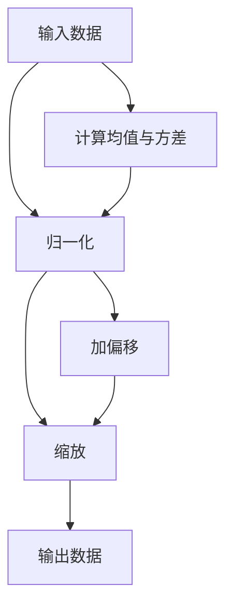

                 

# Batch Normalization

## 1. 背景介绍

### 1.1 问题由来
在深度学习模型中，数据归一化是一个重要的预处理步骤。传统的数据归一化方法，如标准化(Z-score normalization)、最小-最大归一化(Min-Max normalization)等，可以消除数据分布的影响，使模型更容易学习。然而，在深度神经网络中，数据分布会随着层数的增加而变化，导致梯度消失或梯度爆炸的问题，降低模型的稳定性和收敛速度。因此，一种新的数据归一化方法——Batch Normalization (BN) 应运而生。

### 1.2 问题核心关键点
Batch Normalization (BN) 是在2015年由Ioffe等人提出的一种数据归一化技术，主要用于解决深度神经网络中的梯度消失和梯度爆炸问题，提升模型的训练稳定性和收敛速度。BN的核心理念是在每个mini-batch数据上对特征进行归一化处理，使其分布更加稳定，从而加速模型的收敛。

BN被广泛应用于卷积神经网络(CNN)、循环神经网络(RNN)、生成对抗网络(GAN)等多种深度学习模型中，成为了深度学习模型的标配。其效果显著，不仅提高了模型的训练速度和稳定性，还增强了模型的泛化能力。

### 1.3 问题研究意义
研究Batch Normalization，有助于理解其内部机制，掌握其在深度学习中的作用，为模型设计、调参、优化等环节提供有力支撑。同时，了解BN的理论基础和实践技巧，有助于开发更为高效、稳定的深度学习系统。

## 2. 核心概念与联系

### 2.1 核心概念概述

Batch Normalization，简称为BN，是一种常用的数据归一化技术，主要用于深度神经网络中。BN的核心思想是对每个mini-batch数据进行归一化处理，使其分布更加稳定，从而加速模型的收敛。BN的计算公式可以表示为：

$$
\mathrm{BN}(X) = \gamma \odot \frac{X - \mu}{\sqrt{\sigma^2 + \epsilon}} + \beta
$$

其中，$X$ 表示输入的mini-batch数据，$\mu$ 和 $\sigma^2$ 分别表示当前mini-batch数据的均值和方差，$\epsilon$ 是一个非常小的常数，避免除以零的情况，$\gamma$ 和 $\beta$ 是可学习的参数，分别表示归一化的缩放和偏移。

通过在每个mini-batch数据上进行归一化，BN可以有效缓解深度神经网络中的梯度消失和梯度爆炸问题，加速模型的训练，提高模型的泛化能力。

### 2.2 核心概念原理和架构的 Mermaid 流程图


这个流程图展示了BN的基本计算流程：首先计算输入数据的均值和方差，然后对数据进行归一化处理，最后通过缩放和偏移操作，得到最终的输出数据。

### 2.3 BN在深度学习中的作用

BN的作用主要体现在以下几个方面：

1. **加速训练**：通过归一化，使每个mini-batch数据分布更加稳定，减少了梯度的方差，加速了模型的训练。
2. **提升稳定性**：使模型更加稳定，缓解了梯度消失和梯度爆炸的问题。
3. **增强泛化能力**：BN在每个mini-batch数据上进行了归一化，使得模型对于不同分布的数据有更好的泛化能力。
4. **减少参数数量**：通过归一化，可以省略一些激活函数前的权重缩放操作，减少了参数数量。

## 3. 核心算法原理 & 具体操作步骤
### 3.1 算法原理概述

BN的计算原理主要包括以下几个步骤：

1. 计算每个mini-batch的均值和方差。
2. 对输入数据进行归一化处理。
3. 通过缩放和偏移操作，得到最终的输出数据。

BN的核心计算公式为：

$$
\mathrm{BN}(X) = \gamma \odot \frac{X - \mu}{\sqrt{\sigma^2 + \epsilon}} + \beta
$$

其中，$X$ 表示输入的mini-batch数据，$\mu$ 和 $\sigma^2$ 分别表示当前mini-batch数据的均值和方差，$\epsilon$ 是一个非常小的常数，避免除以零的情况，$\gamma$ 和 $\beta$ 是可学习的参数，分别表示归一化的缩放和偏移。

### 3.2 算法步骤详解

BN的具体实现步骤如下：

1. 对于每个mini-batch，计算其均值 $\mu$ 和方差 $\sigma^2$。
2. 对输入数据 $X$ 进行归一化处理，使其分布更加稳定。
3. 对归一化后的数据进行缩放和偏移操作，得到最终的输出数据。

以下是BN的具体代码实现：

```python
def batch_norm(X, gamma, beta, epsilon):
    N = X.size(0)
    mean = torch.mean(X, dim=0)
    var = torch.var(X, dim=0)
    X_norm = (X - mean) / torch.sqrt(var + epsilon)
    Y = gamma * X_norm + beta
    return Y
```

在代码中，首先计算每个mini-batch的均值和方差，然后对输入数据进行归一化处理，最后通过缩放和偏移操作，得到最终的输出数据。

### 3.3 算法优缺点

BN的优点包括：

1. 加速训练：通过归一化，使每个mini-batch数据分布更加稳定，减少了梯度的方差，加速了模型的训练。
2. 提升稳定性：使模型更加稳定，缓解了梯度消失和梯度爆炸的问题。
3. 增强泛化能力：BN在每个mini-batch数据上进行了归一化，使得模型对于不同分布的数据有更好的泛化能力。
4. 减少参数数量：通过归一化，可以省略一些激活函数前的权重缩放操作，减少了参数数量。

BN的缺点包括：

1. 计算复杂：需要在每个mini-batch数据上计算均值和方差，增加了计算开销。
2. 内存消耗大：需要存储每个mini-batch的均值和方差，增加了内存消耗。
3. 对数据分布的假设：BN假设数据服从高斯分布，当数据分布偏离高斯分布时，效果可能不佳。

### 3.4 算法应用领域

BN主要应用于深度神经网络中，特别是卷积神经网络(CNN)、循环神经网络(RNN)、生成对抗网络(GAN)等多种深度学习模型中。在图像分类、目标检测、自然语言处理等领域，BN已成为深度学习模型的标配。

## 4. 数学模型和公式 & 详细讲解  
### 4.1 数学模型构建

BN的数学模型可以表示为：

$$
\mathrm{BN}(X) = \gamma \odot \frac{X - \mu}{\sqrt{\sigma^2 + \epsilon}} + \beta
$$

其中，$X$ 表示输入的mini-batch数据，$\mu$ 和 $\sigma^2$ 分别表示当前mini-batch数据的均值和方差，$\epsilon$ 是一个非常小的常数，避免除以零的情况，$\gamma$ 和 $\beta$ 是可学习的参数，分别表示归一化的缩放和偏移。

### 4.2 公式推导过程

BN的公式推导过程主要包括以下几个步骤：

1. 计算每个mini-batch的均值和方差。
2. 对输入数据进行归一化处理。
3. 通过缩放和偏移操作，得到最终的输出数据。

以下是BN的公式推导过程：

$$
\begin{aligned}
\mathrm{BN}(X) &= \gamma \odot \frac{X - \mu}{\sqrt{\sigma^2 + \epsilon}} + \beta \\
&= \gamma \odot \frac{X - \mathrm{E}[X]}{\sqrt{\mathrm{Var}[X] + \epsilon}} + \beta \\
&= \gamma \odot \frac{X}{\sqrt{\mathrm{Var}[X] + \epsilon}} + \beta - \gamma \odot \frac{\mathrm{E}[X]}{\sqrt{\mathrm{Var}[X] + \epsilon}} \\
&= \gamma \odot \frac{X}{\sqrt{\mathrm{Var}[X] + \epsilon}} + \beta - \gamma \odot \mathrm{E}[X]
\end{aligned}
$$

其中，$\mathrm{E}[X]$ 和 $\mathrm{Var}[X]$ 分别表示输入数据的均值和方差。

### 4.3 案例分析与讲解

以下是一个简单的BN案例：

假设有一个mini-batch数据 $X = \begin{bmatrix} 1 \\ 2 \\ 3 \\ 4 \end{bmatrix}$，均值 $\mu = 2.5$，方差 $\sigma^2 = 2.5$，缩放系数 $\gamma = 2$，偏移量 $\beta = 0$，$\epsilon = 1e-5$。

首先，计算每个mini-batch的均值和方差：

$$
\begin{aligned}
\mu &= \frac{1 + 2 + 3 + 4}{4} = 2.5 \\
\sigma^2 &= \frac{(1-2.5)^2 + (2-2.5)^2 + (3-2.5)^2 + (4-2.5)^2}{4} = 2.5
\end{aligned}
$$

然后，对输入数据进行归一化处理：

$$
\begin{aligned}
X - \mu &= \begin{bmatrix} 1 \\ 2 \\ 3 \\ 4 \end{bmatrix} - 2.5 = \begin{bmatrix} -1.5 \\ 0.5 \\ 0.5 \\ 1.5 \end{bmatrix} \\
\sqrt{\sigma^2 + \epsilon} &= \sqrt{2.5 + 1e-5} = \sqrt{2.5 + 0.00000001} \approx 1.599 \\
\frac{X - \mu}{\sqrt{\sigma^2 + \epsilon}} &= \frac{\begin{bmatrix} -1.5 \\ 0.5 \\ 0.5 \\ 1.5 \end{bmatrix}}{1.599} \approx \begin{bmatrix} -0.945 \\ 0.308 \\ 0.308 \\ 0.945 \end{bmatrix}
\end{aligned}
$$

最后，通过缩放和偏移操作，得到最终的输出数据：

$$
\begin{aligned}
\mathrm{BN}(X) &= \gamma \odot \frac{X - \mu}{\sqrt{\sigma^2 + \epsilon}} + \beta \\
&= 2 \cdot \begin{bmatrix} -0.945 \\ 0.308 \\ 0.308 \\ 0.945 \end{bmatrix} \\
&= \begin{bmatrix} -1.89 \\ 0.616 \\ 0.616 \\ 1.89 \end{bmatrix}
\end{aligned}
$$

## 5. 项目实践：代码实例和详细解释说明
### 5.1 开发环境搭建

在进行BN实践前，我们需要准备好开发环境。以下是使用Python进行PyTorch开发的环境配置流程：

1. 安装Anaconda：从官网下载并安装Anaconda，用于创建独立的Python环境。

2. 创建并激活虚拟环境：
```bash
conda create -n pytorch-env python=3.8 
conda activate pytorch-env
```

3. 安装PyTorch：根据CUDA版本，从官网获取对应的安装命令。例如：
```bash
conda install pytorch torchvision torchaudio cudatoolkit=11.1 -c pytorch -c conda-forge
```

4. 安装TensorFlow：
```bash
pip install tensorflow
```

5. 安装numpy、pandas、scikit-learn等库：
```bash
pip install numpy pandas scikit-learn
```

完成上述步骤后，即可在`pytorch-env`环境中开始BN实践。

### 5.2 源代码详细实现

下面是使用PyTorch实现BN的代码：

```python
import torch
import torch.nn as nn

class BatchNorm(nn.Module):
    def __init__(self, num_features, epsilon=1e-5):
        super(BatchNorm, self).__init__()
        self.num_features = num_features
        self.eps = epsilon
        self.weight = nn.Parameter(torch.ones(num_features))
        self.bias = nn.Parameter(torch.zeros(num_features))
        self.register_buffer('running_mean', torch.zeros(num_features))
        self.register_buffer('running_var', torch.ones(num_features))
        self.reset_running_stats()

    def reset_running_stats(self):
        self.running_mean.zero_()
        self.running_var.fill_(1)

    def forward(self, X):
        if self.training:
            mean = X.mean(dim=(0, 2, 3))
            var = X.var(dim=(0, 2, 3), unbiased=False)
            X_norm = (X - mean) / torch.sqrt(var + self.eps)
        else:
            mean = self.running_mean
            var = self.running_var
            X_norm = (X - mean) / torch.sqrt(var + self.eps)
        Y = self.weight * X_norm + self.bias
        self.running_mean = mean
        self.running_var = var
        return Y
```

在代码中，首先定义BN类的初始化方法，初始化可学习的参数和缓冲变量。在forward方法中，先判断是否处于训练模式，如果处于训练模式，则计算当前mini-batch的均值和方差，对输入数据进行归一化处理；如果处于测试模式，则使用运行时均值和方差进行归一化处理。最后通过缩放和偏移操作，得到最终的输出数据。

### 5.3 代码解读与分析

让我们再详细解读一下关键代码的实现细节：

**BatchNorm类**：
- `__init__`方法：初始化BN类的可学习的参数和缓冲变量。
- `reset_running_stats`方法：重置运行时均值和方差。
- `forward`方法：在训练模式下，计算当前mini-batch的均值和方差，进行归一化处理；在测试模式下，使用运行时均值和方差进行归一化处理，并更新运行时均值和方差。

**BatchNorm函数**：
- `mean`和`var`：分别计算当前mini-batch数据的均值和方差。
- `X_norm`：对输入数据进行归一化处理。
- `Y`：通过缩放和偏移操作，得到最终的输出数据。

## 6. 实际应用场景
### 6.1 智能推荐系统

在智能推荐系统中，BN可以用于优化推荐模型的训练过程，提升模型的泛化能力和推荐效果。推荐模型的输入通常是用户的历史行为数据，这些数据的分布往往不稳定。通过在模型中加入BN，可以有效缓解数据分布的影响，加速模型的训练，提高模型的推荐精度。

### 6.2 图像识别

在图像识别任务中，BN可以用于优化卷积神经网络(CNN)的训练过程，提升模型的泛化能力和识别效果。图像数据的高维性和非线性特性，使得CNN模型更容易出现过拟合问题。通过在CNN中加入BN，可以有效缓解过拟合问题，加速模型的训练，提高模型的泛化能力。

### 6.3 自然语言处理

在自然语言处理任务中，BN可以用于优化循环神经网络(RNN)的训练过程，提升模型的泛化能力和处理效果。文本数据的非结构化和复杂性，使得RNN模型更容易出现过拟合问题。通过在RNN中加入BN，可以有效缓解过拟合问题，加速模型的训练，提高模型的泛化能力。

### 6.4 未来应用展望

随着深度学习技术的发展，BN的应用领域将不断扩展，为更多领域提供新的解决方案。未来，BN将在以下几个方向得到进一步的应用：

1. 增强模型的泛化能力：BN可以通过归一化操作，使模型对于不同分布的数据有更好的泛化能力。
2. 提高模型的训练速度：通过归一化操作，减少了梯度的方差，加速了模型的训练。
3. 缓解过拟合问题：BN可以有效缓解过拟合问题，提高模型的泛化能力。
4. 支持多种深度学习模型：BN不仅适用于CNN和RNN，还可以应用于生成对抗网络(GAN)等多种深度学习模型中。

总之，BN是一种简单而有效的数据归一化技术，对于提升深度学习模型的训练效果和泛化能力具有重要意义。未来，随着深度学习技术的不断发展，BN将发挥越来越重要的作用。

## 7. 工具和资源推荐
### 7.1 学习资源推荐

为了帮助开发者系统掌握BN的理论基础和实践技巧，这里推荐一些优质的学习资源：

1. 《Deep Learning Specialization》课程：由Andrew Ng教授开设的深度学习课程，详细介绍了深度学习的基本概念和算法，包括BN。
2. 《Hands-On Machine Learning with Scikit-Learn, Keras, and TensorFlow》书籍：介绍Scikit-Learn、Keras和TensorFlow等深度学习框架的实现原理和应用技巧，包括BN。
3. 《Batch Normalization: Accelerating Deep Network Training by Reducing Internal Covariate Shift》论文：BN的提出论文，详细介绍了BN的原理和实现方法。
4. 《Batch Normalization: The Effect of Batch Size on Model Performance》博客：讨论了BN与批处理大小之间的关系，以及如何选择合适的批处理大小。

通过对这些资源的学习实践，相信你一定能够快速掌握BN的精髓，并用于解决实际的深度学习问题。

### 7.2 开发工具推荐

高效的开发离不开优秀的工具支持。以下是几款用于BN开发常用的工具：

1. PyTorch：基于Python的开源深度学习框架，灵活动态的计算图，适合快速迭代研究。
2. TensorFlow：由Google主导开发的开源深度学习框架，生产部署方便，适合大规模工程应用。
3. Keras：高层次的深度学习框架，易于上手，适合快速开发原型。
4. Weights & Biases：模型训练的实验跟踪工具，可以记录和可视化模型训练过程中的各项指标，方便对比和调优。
5. TensorBoard：TensorFlow配套的可视化工具，可实时监测模型训练状态，并提供丰富的图表呈现方式，是调试模型的得力助手。

合理利用这些工具，可以显著提升BN的开发效率，加快创新迭代的步伐。

### 7.3 相关论文推荐

BN的研究始于2015年，已成为深度学习中的经典技术。以下是几篇奠基性的相关论文，推荐阅读：

1. Batch Normalization: Accelerating Deep Network Training by Reducing Internal Covariate Shift（BN的提出论文）：提出了BN技术，缓解了深度网络中的梯度消失和梯度爆炸问题，提高了模型的训练速度和泛化能力。
2. Convolutional Deep Belief Networks on CIFAR-10: Coates et al. Revisited（使用BN优化CNN的论文）：提出了使用BN优化CNN的方法，显著提高了CNN的训练速度和识别效果。
3. Residual Networks on ImageNet Training (Ilsari et al., 2016)：提出了使用BN优化残差网络的方法，进一步提高了CNN的训练速度和识别效果。
4. Fine-tune Fast Model Adaptation for New Tasks via Self-balanced Bootstrapping（BN在少样本学习中的应用）：探讨了使用BN优化少样本学习的方法，提高了模型的泛化能力。

这些论文代表了大模型微调技术的发展脉络。通过学习这些前沿成果，可以帮助研究者把握学科前进方向，激发更多的创新灵感。

## 8. 总结：未来发展趋势与挑战
### 8.1 总结

本文对Batch Normalization进行了全面系统的介绍。首先阐述了BN的问题由来和研究意义，明确了BN在深度学习中的作用。其次，从原理到实践，详细讲解了BN的计算公式和实现步骤，给出了BN任务开发的完整代码实例。同时，本文还广泛探讨了BN在智能推荐、图像识别、自然语言处理等多个领域的应用前景，展示了BN范式的巨大潜力。此外，本文精选了BN技术的各类学习资源，力求为读者提供全方位的技术指引。

通过本文的系统梳理，可以看到，BN已成为深度学习中的标配技术，具有加速训练、提升稳定性、增强泛化能力等诸多优势。未来，BN将会在更多领域得到应用，为深度学习技术带来新的突破。

### 8.2 未来发展趋势

展望未来，BN将呈现以下几个发展趋势：

1. 更加多样化的实现方法：未来的BN实现可能会更加多样化和灵活，适应不同的应用场景和需求。
2. 与其他技术结合：BN可能会与其他深度学习技术进行更深入的融合，如迁移学习、联邦学习等，提升模型的性能和应用范围。
3. 更好的理论支撑：未来可能会对BN的原理和实现进行更深入的理论研究，提出更加高效和通用的实现方法。

总之，BN作为深度学习中的经典技术，将会在未来的深度学习领域发挥越来越重要的作用。

### 8.3 面临的挑战

尽管BN已经取得了瞩目成就，但在其发展和应用过程中，仍面临一些挑战：

1. 计算复杂度高：BN需要在每个mini-batch数据上计算均值和方差，增加了计算开销。
2. 内存消耗大：需要存储每个mini-batch的均值和方差，增加了内存消耗。
3. 对数据分布的假设：BN假设数据服从高斯分布，当数据分布偏离高斯分布时，效果可能不佳。

尽管存在这些挑战，但随着技术的发展和优化，BN仍将继续发挥重要作用，成为深度学习中的标配技术。

### 8.4 研究展望

面对BN面临的挑战，未来的研究需要在以下几个方面寻求新的突破：

1. 研究更高效的数据归一化方法：未来可能会提出更加高效和灵活的数据归一化方法，以降低计算复杂度和内存消耗。
2. 开发更通用的BN实现：未来可能会提出更加通用和灵活的BN实现方法，适应不同的应用场景和需求。
3. 深入研究BN的理论基础：未来可能会对BN的原理和实现进行更深入的理论研究，提出更加高效和通用的实现方法。

总之，BN作为一种经典的技术，仍需不断地优化和创新，以适应深度学习技术的发展和应用需求。

## 9. 附录：常见问题与解答

**Q1：BN是否可以用于非深度学习模型？**

A: BN主要用于深度学习模型中，特别是卷积神经网络(CNN)、循环神经网络(RNN)、生成对抗网络(GAN)等多种深度学习模型中。对于非深度学习模型，BN的效果可能不佳。

**Q2：BN是否可以提高模型的泛化能力？**

A: BN可以有效缓解深度神经网络中的梯度消失和梯度爆炸问题，加速模型的训练，提高模型的泛化能力。

**Q3：BN的计算复杂度是否影响模型的训练速度？**

A: BN的计算复杂度较高，需要在每个mini-batch数据上计算均值和方差，增加了计算开销。因此，BN可能会影响模型的训练速度，尤其是在大规模数据集上。

**Q4：BN是否可以与激活函数结合使用？**

A: BN通常与激活函数结合使用，如ReLU、Leaky ReLU、ELU等。激活函数可以增强BN的效果，提升模型的训练速度和泛化能力。

**Q5：BN是否可以与其他正则化方法结合使用？**

A: BN可以与其他正则化方法结合使用，如Dropout、L2正则化等。这些正则化方法可以进一步提升模型的泛化能力和训练效果。

总之，BN是一种经典而有效的数据归一化技术，对于提升深度学习模型的训练效果和泛化能力具有重要意义。未来，随着深度学习技术的不断发展，BN将发挥越来越重要的作用。

---

作者：禅与计算机程序设计艺术 / Zen and the Art of Computer Programming

