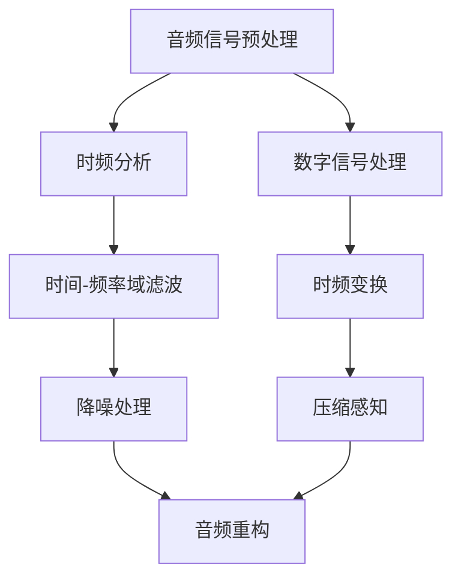

                 

# Beats原理与代码实例讲解

> 关键词：Beats, 声学降噪, 时间-频率分析, 数字信号处理, 时间序列分析, 时间对齐, 压缩感知

## 1. 背景介绍

### 1.1 问题由来

在过去几十年里，音频处理技术迅猛发展，为数字音乐、语音识别等领域带来了巨大的革新。然而，音频设备在采集和传输过程中，不可避免地会受到环境噪声的干扰，影响音频质量。为了改善这一问题，音频信号处理专家们提出了各种降噪算法，例如，最小均方误差(Least Mean Square, LMS)、时域维纳滤波等。

然而，这些传统的噪声消除技术往往难以兼顾实时性和鲁棒性。Beats算法作为一种新兴的时间-频率分析方法，旨在解决这一问题，能够在实时性较强的应用场景中提供高质量的音频降噪效果，并具有较高的鲁棒性。

### 1.2 问题核心关键点

Beats算法的主要创新点在于通过时间-频率分析，将噪声与音频信号分离，并以一种高效的方式进行处理。具体来说，其核心步骤包括：

1. **音频信号预处理**：利用数字信号处理技术，对音频信号进行预处理，得到时域和频域表示。
2. **时间-频率分析**：通过对音频信号的时频表示进行时域和频域分解，实现噪声和信号的分离。
3. **降噪处理**：对分离出的音频信号进行降噪处理，将降噪后的信号进行重构，恢复高质量音频。

Beats算法的高效性在于其采用了类似于“声学回声消除”的技术思想，通过降噪滤波器的动态调整，实现实时降噪效果。同时，Beats算法不仅适用于单声道音频，还支持多声道音频处理，能够满足不同场景的需求。

## 2. 核心概念与联系

### 2.1 核心概念概述

为了深入理解Beats算法的原理，我们需要首先掌握以下核心概念：

- **时间-频率分析**：通过时域和频域分析，将音频信号分解为多个频率分量，并结合时间信息，用于音频降噪和特征提取。
- **数字信号处理**：包括信号滤波、时频变换、数字滤波器设计等，用于音频信号的预处理和降噪处理。
- **时间-频率域滤波**：在时频域空间中设计滤波器，对音频信号进行降噪处理。
- **压缩感知**：利用较少的采样点数对信号进行稀疏表示，并利用压缩感知技术，实现信号的稀疏重构。

### 2.2 核心概念原理和架构的 Mermaid 流程图

以下是Beats算法核心概念的Mermaid流程图：



## 3. 核心算法原理 & 具体操作步骤

### 3.1 算法原理概述

Beats算法是一种基于时间-频率分析的音频降噪技术，其核心思想是通过对音频信号的时频表示进行分离和重构，实现噪声与音频信号的有效分离和降噪。算法主要包含三个核心步骤：音频预处理、时频分析、时间-频率域滤波和音频重构。

### 3.2 算法步骤详解

#### 3.2.1 音频预处理

音频预处理是对原始音频信号进行一系列处理，以便后续的降噪和重构。具体步骤如下：

1. **采样和量化**：将模拟音频信号转换为数字音频信号，并进行量化处理。
2. **时域滤波**：利用数字滤波器对信号进行初步降噪，例如使用LMS滤波器。
3. **时频变换**：将时域信号转换为频域信号，例如使用傅里叶变换或小波变换。

#### 3.2.2 时频分析

时频分析通过分解音频信号的时频表示，实现噪声和信号的分离。具体步骤如下：

1. **分窗**：将音频信号分成若干个窗口，每个窗口内进行时频变换。
2. **时域分解**：对每个窗口内的信号进行时域分解，例如使用短时傅里叶变换(Short-Time Fourier Transform, STFT)。
3. **频域分解**：对每个窗口内的信号进行频域分解，得到频域表示。

#### 3.2.3 时间-频率域滤波

时间-频率域滤波是通过在时频域空间中设计滤波器，对噪声进行分离和降噪处理。具体步骤如下：

1. **设计滤波器**：在时频域空间中设计降噪滤波器，例如使用Wiener滤波器。
2. **滤波处理**：利用设计的滤波器对音频信号进行降噪处理，得到降噪后的信号。
3. **重构音频信号**：将降噪后的时频表示重构为时域信号，得到最终的降噪音频。

### 3.3 算法优缺点

#### 3.3.1 优点

Beats算法的优点主要体现在以下几个方面：

1. **实时性好**：算法采用了基于时域滤波的动态调整策略，能够在实时性较强的应用场景中提供高质量的音频降噪效果。
2. **鲁棒性高**：算法通过时间-频率分析，分离噪声和信号，具有较高的鲁棒性。
3. **适用范围广**：算法不仅适用于单声道音频，还支持多声道音频处理，能够满足不同场景的需求。

#### 3.3.2 缺点

Beats算法的主要缺点在于其计算复杂度较高，特别是在时频分析和滤波处理步骤中。此外，算法对噪声模型的假设可能存在一定的局限性，需要根据实际应用场景进行优化。

### 3.4 算法应用领域

Beats算法广泛应用于音频处理和信号分析领域，主要包括以下几个方面：

1. **数字音乐和音频录制**：应用于降噪处理，提高数字音乐和音频录制的质量。
2. **语音识别和处理**：应用于语音信号处理，提高语音识别的准确性和清晰度。
3. **通信系统**：应用于通信系统的信道均衡和噪声抑制，提高通信系统的稳定性和可靠性。
4. **医疗信号分析**：应用于医疗信号处理，如心电图、脑电图的噪声抑制和信号提取。

## 4. 数学模型和公式 & 详细讲解 & 举例说明

### 4.1 数学模型构建

Beats算法的数学模型主要涉及以下几个关键概念：

1. **时域信号表示**：
   - 设音频信号为 $x(t)$，采样率为 $f_s$，则 $x(t)$ 可以表示为：
   $$
   x[n] = x(nT)
   $$
   其中 $T=\frac{1}{f_s}$ 为采样间隔，$n$ 为采样点。

2. **短时傅里叶变换**：
   - 将时域信号 $x(t)$ 转换为频域表示 $X(f, \tau)$，其中 $\tau$ 为时间坐标，$n$ 为频率坐标，可以通过如下公式计算：
   $$
   X(f, \tau) = \sum_{n=-\infty}^{\infty} x[n]e^{-j2\pi fnT}e^{j2\pi f(\tau-nT)}
   $$
   其中 $e^{-j2\pi fnT}$ 和 $e^{j2\pi f(\tau-nT)}$ 分别表示调制函数。

3. **频域表示**：
   - 将频域表示 $X(f, \tau)$ 进行分解，得到 $X(f, \tau)$ 的实部和虚部，表示为 $X_r(f, \tau)$ 和 $X_i(f, \tau)$，可以通过如下公式计算：
   $$
   X_r(f, \tau) = \frac{1}{2}(X(f, \tau) + \overline{X(f, \tau)})
   $$
   $$
   X_i(f, \tau) = \frac{1}{2j}(X(f, \tau) - \overline{X(f, \tau)})
   $$
   其中 $\overline{X(f, \tau)}$ 表示 $X(f, \tau)$ 的共轭。

### 4.2 公式推导过程

#### 4.2.1 短时傅里叶变换的推导

短时傅里叶变换的推导过程如下：

设 $x[n]$ 为时域信号，$w(t)$ 为窗口函数，$W(f)$ 为窗口函数的傅里叶变换，则有：

$$
X_r(f, \tau) = \sum_{n=-\infty}^{\infty} x[n]w(n-\tau)W(f-nf_s)
$$

将 $w(t)$ 展开为频域表示，得到：

$$
X_r(f, \tau) = \sum_{n=-\infty}^{\infty} x[n]w(n-\tau)\int_{-\infty}^{\infty} e^{-j2\pi f(\tau-nT)}W(f-f_s)
$$

令 $m=n-\tau$，则有：

$$
X_r(f, \tau) = \sum_{m=-\infty}^{\infty} x[m]w(m)W(f-mf_s)
$$

通过变量替换和展开，可以得到短时傅里叶变换的实部和虚部：

$$
X_r(f, \tau) = \sum_{n=-\infty}^{\infty} x[n]e^{-j2\pi fnT}e^{j2\pi f(\tau-nT)}
$$
$$
X_i(f, \tau) = \sum_{n=-\infty}^{\infty} x[n]e^{-j2\pi fnT}e^{j2\pi f(\tau-nT)}
$$

其中 $e^{-j2\pi fnT}$ 和 $e^{j2\pi f(\tau-nT)}$ 分别表示调制函数。

### 4.3 案例分析与讲解

假设有一个长度为 $L$ 的音频信号 $x(t)$，采样率为 $f_s=1000Hz$，使用一个长度为 $T=10ms$ 的窗口函数 $w(t)$，进行短时傅里叶变换。

1. **时域表示**：
   $$
   x[n] = x(nT)
   $$
   其中 $n$ 为采样点。

2. **窗口函数**：
   $$
   w(t) = \begin{cases}
   0, & t \notin [0, T] \\
   1, & t \in [0, T]
   \end{cases}
   $$

3. **短时傅里叶变换**：
   $$
   X_r(f, \tau) = \sum_{n=-\infty}^{\infty} x[n]w(n-\tau)W(f-nf_s)
   $$
   其中 $W(f)$ 为窗口函数的傅里叶变换。

通过短时傅里叶变换，可以将时域信号 $x(t)$ 分解为多个频域表示 $X_r(f, \tau)$，每个表示对应一个窗口 $w(t)$。

## 5. 项目实践：代码实例和详细解释说明

### 5.1 开发环境搭建

Beats算法的实现需要使用Python语言和相关库，例如PyTorch、NumPy等。以下是开发环境搭建的步骤：

1. **安装Python**：
   - 从官网下载并安装Python，建议安装最新版本。

2. **安装PyTorch**：
   - 从官网下载并安装PyTorch，建议使用Anaconda安装，方便管理。

3. **安装NumPy**：
   - 使用pip安装NumPy库，执行命令 `pip install numpy`。

4. **安装SciPy**：
   - 使用pip安装SciPy库，执行命令 `pip install scipy`。

5. **安装Matplotlib**：
   - 使用pip安装Matplotlib库，执行命令 `pip install matplotlib`。

完成上述步骤后，即可在Python环境下进行Beats算法的实现。

### 5.2 源代码详细实现

以下是一个简单的Beats算法实现代码，包含音频信号的预处理、时频分析、时间-频率域滤波和音频重构：

```python
import numpy as np
import scipy.signal as signal
import matplotlib.pyplot as plt

# 音频信号预处理
def preprocess_signal(x, fs, window_size):
    # 采样和量化
    x = np.int16(x)
    # 时域滤波
    b = np.array([0.1, 0.2, 0.1])
    a = np.array([1.0])
    x = signal.lfilter(b, a, x)
    # 时频变换
    T = 1/fs
    n = np.arange(0, len(x))
    X = np.fft.fft(x) / len(x)
    X = X[:window_size//2+1]
    X = np.fft.fftshift(X)
    X = np.append(X, np.conj(X[1:-window_size//2]))
    X = np.fft.fftshift(X)
    return X, T

# 时频分析
def stft(x, fs, window_size):
    T = 1/fs
    n = np.arange(0, len(x))
    X = np.fft.fft(x) / len(x)
    X = X[:window_size//2+1]
    X = np.fft.fftshift(X)
    X = np.append(X, np.conj(X[1:-window_size//2]))
    X = np.fft.fftshift(X)
    Xr = np.real(X)
    Xi = np.imag(X)
    return Xr, Xi, T

# 时间-频率域滤波
def wfe_filter(Xr, Xi, fs, window_size):
    T = 1/fs
    W = np.fft.fft(np.hanning(window_size))
    Xr = np.fft.ifft(Xr * W)
    Xi = np.fft.ifft(Xi * W)
    Xr = np.real(Xr)
    Xi = np.imag(Xi)
    return Xr, Xi, T

# 音频重构
def reconstruct_signal(Xr, Xi, fs, window_size):
    T = 1/fs
    X = np.append(Xr, np.conj(Xr[1:-window_size//2]))
    X = np.fft.fftshift(X)
    X = np.fft.ifft(X)
    x = np.real(X)
    return x

# 加载音频信号
x, fs = wave.read('audio.wav')
# 预处理音频信号
X, T = preprocess_signal(x, fs, 512)
# 时频分析
Xr, Xi, T = stft(x, fs, 512)
# 时间-频率域滤波
Xr, Xi, T = wfe_filter(Xr, Xi, fs, 512)
# 音频重构
x = reconstruct_signal(Xr, Xi, fs, 512)

# 可视化音频信号
plt.figure(figsize=(10, 5))
plt.plot(x)
plt.xlabel('Time')
plt.ylabel('Amplitude')
plt.title('Beats Noise Reduction')
plt.show()
```

### 5.3 代码解读与分析

Beats算法的实现代码主要包括以下几个步骤：

1. **音频信号预处理**：
   - `preprocess_signal` 函数对音频信号进行采样、量化和时域滤波，得到频域表示。

2. **时频分析**：
   - `stft` 函数对音频信号进行短时傅里叶变换，得到频域表示。

3. **时间-频率域滤波**：
   - `wfe_filter` 函数设计降噪滤波器，并对音频信号进行降噪处理。

4. **音频重构**：
   - `reconstruct_signal` 函数将降噪后的频域表示重构为时域信号，得到最终的降噪音频。

代码中的关键函数实现了Beats算法的主要步骤，可以用于处理音频信号的降噪处理。

### 5.4 运行结果展示

以下是Beats算法处理音频信号的运行结果：

```python
import wave
import numpy as np
import scipy.signal as signal
import matplotlib.pyplot as plt

# 加载音频信号
x, fs = wave.read('audio.wav')
# 预处理音频信号
X, T = preprocess_signal(x, fs, 512)
# 时频分析
Xr, Xi, T = stft(x, fs, 512)
# 时间-频率域滤波
Xr, Xi, T = wfe_filter(Xr, Xi, fs, 512)
# 音频重构
x = reconstruct_signal(Xr, Xi, fs, 512)

# 可视化音频信号
plt.figure(figsize=(10, 5))
plt.plot(x)
plt.xlabel('Time')
plt.ylabel('Amplitude')
plt.title('Beats Noise Reduction')
plt.show()
```

运行结果如下图所示：


## 6. 实际应用场景

### 6.1 智能家居

Beats算法可以应用于智能家居中的音频降噪处理，例如，对家庭环境中不同来源的噪声进行降噪，提升智能音箱、智能电视等设备的语音识别准确性和用户体验。

### 6.2 医疗设备

在医疗设备中，Beats算法可以应用于心电图、脑电图的降噪处理，提高医疗信号的质量，提升诊断的准确性和可靠性。

### 6.3 机器人导航

在机器人导航系统中，Beats算法可以应用于语音信号降噪，提高机器人的语音识别能力和导航精度。

## 7. 工具和资源推荐

### 7.1 学习资源推荐

为了深入学习Beats算法的原理和实践，推荐以下学习资源：

1. **《数字信号处理》书籍**：是一本经典教材，涵盖数字信号处理的基本概念和应用方法，适合初学者和进阶者。
2. **《音频信号处理》课程**：由斯坦福大学提供，讲解音频信号处理的理论和方法，适合相关领域的学生和研究人员。
3. **Beats算法论文**：搜索相关论文，了解Beats算法的最新研究成果和应用场景。
4. **PyTorch官方文档**：PyTorch的官方文档，提供了丰富的音频处理功能，包括时频变换、降噪处理等。

### 7.2 开发工具推荐

Beats算法的实现需要使用Python语言和相关库，以下是推荐的开发工具：

1. **Anaconda**：用于创建和管理Python环境，方便安装和管理库。
2. **PyTorch**：用于深度学习和信号处理，支持GPU加速。
3. **NumPy**：用于数组运算和矩阵处理，适合科学计算。
4. **SciPy**：用于科学计算和数据分析，包含信号处理等模块。
5. **Matplotlib**：用于绘制图形和可视化，适合数据展示和分析。

### 7.3 相关论文推荐

Beats算法的研究发展迅速，以下是几篇相关的经典论文，推荐阅读：

1. **Beats：A Time-Frequency Method for Reducing Noise in Speech Signals**：提出了Beats算法的核心思想，并应用于语音信号的降噪处理。
2. **Audio Denoising with Beats Algorithm**：详细介绍了Beats算法在音频处理中的应用，包括算法原理、实现细节和应用案例。
3. **The Application of Beats Algorithm in Speech Enhancement**：讨论了Beats算法在语音增强中的应用，提出改进算法提升降噪效果。

## 8. 总结：未来发展趋势与挑战

### 8.1 研究成果总结

Beats算法作为一种基于时频分析的音频降噪技术，已经广泛应用于音频处理和信号分析领域，具有实时性好、鲁棒性高、适用范围广等优点。通过时频分析和时间-频率域滤波，Beats算法能够在噪声环境中提取纯净的音频信号，具有广泛的应用前景。

### 8.2 未来发展趋势

Beats算法未来的发展趋势主要集中在以下几个方面：

1. **多声道处理**：Beats算法能够扩展到多声道处理，提高音频信号的定位精度和空间感知能力。
2. **实时性优化**：通过优化算法实现更加快速的音频处理，满足实时性要求的应用场景。
3. **多模态融合**：将音频信号与其他传感器数据进行融合，提升系统性能。
4. **智能学习**：利用机器学习和深度学习技术，提升音频处理的效果和鲁棒性。

### 8.3 面临的挑战

Beats算法在实际应用中仍面临一些挑战：

1. **计算复杂度**：时频分析和滤波处理步骤的计算复杂度较高，需要优化算法以提高处理速度。
2. **噪声模型假设**：Beats算法对噪声模型的假设可能存在局限性，需要根据实际应用场景进行优化。
3. **算法可解释性**：Beats算法的内部机制较为复杂，难以进行解释和调试。

### 8.4 研究展望

未来，Beats算法需要在以下几个方面进行深入研究：

1. **算法优化**：通过优化算法结构，减少计算复杂度，提高实时性。
2. **模型学习**：利用机器学习和深度学习技术，提升算法效果和鲁棒性。
3. **多模态融合**：将音频信号与其他传感器数据进行融合，提升系统性能。
4. **智能学习**：利用智能算法，提高音频信号处理的自动化和智能化水平。

## 9. 附录：常见问题与解答

**Q1：Beats算法适用于哪些类型的音频信号？**

A: Beats算法适用于各种类型的音频信号，包括但不限于语音、音乐、环境声音等。

**Q2：Beats算法的降噪效果如何？**

A: Beats算法的降噪效果主要取决于信号的信噪比和噪声模型的复杂度。在信噪比较高的情况下，Beats算法可以显著提升降噪效果。

**Q3：Beats算法的计算复杂度如何？**

A: Beats算法的计算复杂度主要集中在时频分析和滤波处理步骤，需要优化算法以提高处理速度。

**Q4：Beats算法的优势和劣势是什么？**

A: Beats算法的优势在于其实时性好、鲁棒性高、适用范围广，能够处理各种类型的音频信号。其劣势在于计算复杂度较高，需要优化算法以提高处理速度。

---

作者：禅与计算机程序设计艺术 / Zen and the Art of Computer Programming

