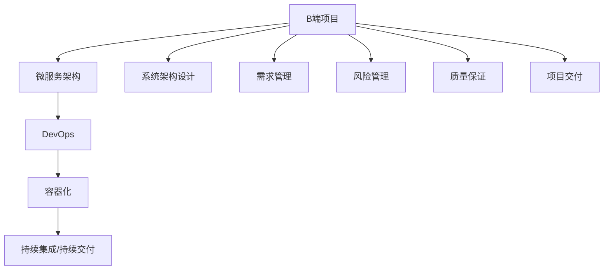

                 

## 1. 背景介绍

### 1.1 问题由来
近年来，B端市场的需求迅速增长，企业对IT解决方案的需求不断增加，催生了大量B端项目，其中不乏一些大单合同。这些B端项目往往利润丰厚，投入产出比高，对于B端开发者和团队来说，是一个不错的收入来源。然而，B端项目的开发难度和维护成本通常远高于C端项目。此外，B端项目对技术栈的深度要求较高，往往需要具备复杂系统架构的设计和实施能力。这使得B端项目开发的不确定性和风险性增加，对开发者的技术和经验要求也更高。

### 1.2 问题核心关键点
B端项目相对于C端项目，有以下几个关键特点和难点：
1. **需求复杂性高**：B端项目通常需求复杂，涉及业务流程、数据模型、安全管控等多个方面，需要开发者具备较强的系统设计和架构能力。
2. **技术栈深度**：B端项目往往需要采用较为复杂的技术栈，如Docker、Kubernetes、微服务架构等，对开发者的技术积累和实践经验要求较高。
3. **维护成本高**：B端项目通常涉及企业内部系统的深度整合，系统复杂度高，变更管理难度大，后续维护成本较高。
4. **项目周期长**：B端项目往往涉及多个部门协作，项目周期较长，需要开发者的协调能力和沟通技巧。
5. **商业利润大**：B端项目合同金额大，对企业的收入贡献显著，对项目成功与否的依赖性更强。

### 1.3 问题研究意义
研究和探讨B端项目开发的现状和难点，有助于B端开发者提高技术水平和项目管理能力，更好地适应市场变化和客户需求。了解B端项目的不确定性和风险性，有助于企业制定合理的项目计划和风险管理策略，确保项目成功交付。

## 2. 核心概念与联系

### 2.1 核心概念概述

为了更好地理解B端项目的开发挑战，本节将介绍几个密切相关的核心概念：

- **B端项目（Business-to-Business, B2B）**：指企业间为了商业目的而进行的IT系统开发和部署项目。
- **微服务架构（Microservices Architecture）**：将大型应用拆分为多个小型服务，每个服务独立运行、松耦合的架构方式。
- **DevOps**：结合开发（Development）和运维（Operations）的跨职能文化，以提高软件交付速度和系统稳定性。
- **容器化（Containerization）**：通过Docker等容器技术，将应用程序及其依赖打包为独立运行的环境。
- **持续集成/持续交付（CI/CD）**：通过自动化测试和部署流程，快速交付高质量软件。
- **系统架构设计**：涵盖系统规划、功能设计、性能优化等多个方面的系统开发和管理工作。

这些核心概念之间的逻辑关系可以通过以下Mermaid流程图来展示：



这个流程图展示了大语言模型的核心概念及其之间的关系：

1. B端项目通过微服务架构进行拆分，降低系统复杂度。
2. DevOps流程提供自动化和持续集成支持，提升交付速度和质量。
3. 容器化技术提供环境隔离和一致性保障。
4. 系统架构设计关注功能、性能和扩展性。
5. 需求管理、风险管理和质量保证等项目管理和技术工作，支持B端项目的成功交付。

## 3. 核心算法原理 & 具体操作步骤
### 3.1 算法原理概述

B端项目开发的核心算法原理主要涉及微服务架构设计、DevOps流程自动化、系统架构设计和项目管理技术。以下分别介绍这些关键原理：

- **微服务架构设计**：将大型应用拆分为多个小型服务，每个服务独立运行、松耦合，提升系统的可扩展性和维护性。微服务架构设计包括服务拆分、接口定义、服务注册和发现等关键步骤。
- **DevOps流程自动化**：通过自动化测试、部署和监控流程，快速交付高质量软件。DevOps流程包括持续集成、持续交付、持续监控等环节。
- **系统架构设计**：涵盖系统规划、功能设计、性能优化等多个方面的系统开发和管理工作。系统架构设计需考虑系统的可扩展性、可靠性、安全性等关键因素。
- **项目管理技术**：包括需求管理、风险管理、质量保证等技术手段，确保项目按时交付和质量达标。

### 3.2 算法步骤详解

基于上述核心算法原理，B端项目开发的具体操作步骤如下：

**Step 1: 项目需求分析**
- 与客户沟通，了解项目需求和目标。
- 收集业务流程、数据模型和安全需求，进行详细的需求分析。
- 制定项目需求说明书，明确项目范围和交付标准。

**Step 2: 系统架构设计**
- 根据需求分析结果，设计系统架构。
- 定义系统组件和接口，确保各服务间的松耦合性。
- 进行性能和扩展性评估，确保系统可扩展和可维护。
- 设计数据模型，确保数据一致性和可扩展性。

**Step 3: 微服务拆分**
- 将系统按功能模块拆分为多个微服务。
- 定义微服务的接口和通信协议，确保服务间互通。
- 配置服务注册和发现机制，确保服务可动态扩展。

**Step 4: DevOps流程实施**
- 配置持续集成和持续交付环境。
- 编写自动化测试脚本，确保代码质量。
- 配置自动化部署流程，确保快速交付。
- 配置持续监控系统，实时跟踪系统性能和稳定性。

**Step 5: 系统开发和测试**
- 按设计文档开发各微服务。
- 编写单元测试和集成测试用例，确保代码质量。
- 进行系统集成测试，确保各服务间协同工作。

**Step 6: 项目交付和维护**
- 进行系统验收测试，确保系统满足交付标准。
- 配置生产环境，进行最终部署。
- 提供用户培训和文档，确保系统稳定运行。
- 进行持续维护，及时修复和优化系统。

### 3.3 算法优缺点

B端项目开发具有以下优点：
1. **需求价值高**：B端项目通常合同金额大，对企业的收入贡献显著。
2. **技术挑战高**：B端项目对技术栈深度和系统设计能力要求较高，能够锻炼开发者的技术水平和项目管理能力。
3. **项目周期长**：B端项目通常涉及多个部门协作，项目周期较长，能够提高开发者的沟通和协调能力。

同时，B端项目开发也存在以下局限性：
1. **需求变化高**：B端项目需求复杂，变更管理难度大，需要频繁与客户沟通，调整项目计划。
2. **技术栈复杂**：B端项目涉及微服务、容器化、DevOps等技术栈，学习曲线较陡峭。
3. **项目风险高**：B端项目系统复杂度高，变更管理难度大，后续维护成本较高，项目失败风险高。
4. **交付压力大**：B端项目对交付时间和质量要求高，开发者面临较大的交付压力。
5. **商业利润大**：B端项目合同金额大，对项目的成功与否依赖性更强，失败对企业的损失也更大。

### 3.4 算法应用领域

B端项目开发的应用领域非常广泛，涵盖了各种行业的企业内部系统开发，包括但不限于：

1. **ERP系统**：企业管理信息系统，涵盖财务管理、人力资源管理、供应链管理等多个方面。
2. **CRM系统**：客户关系管理系统，帮助企业管理客户信息、销售机会等。
3. **HR系统**：人力资源管理系统，包括招聘、绩效管理、员工培训等模块。
4. **财务系统**：会计和财务管理系统，涉及账目核算、报表生成、审计等。
5. **物流系统**：物流和仓储管理系统，涉及库存管理、配送路线规划等。
6. **电子商务平台**：电商平台，涵盖商品管理、订单处理、支付系统等。
7. **医疗信息系统**：医院管理信息系统，涉及患者信息管理、病历记录、药品管理等。

## 4. 数学模型和公式 & 详细讲解 & 举例说明
### 4.1 数学模型构建

B端项目开发中，涉及多种复杂的技术栈和架构设计，需要建立相应的数学模型进行分析和计算。以下是一个简化版的B端项目开发数学模型，包括需求分析、系统架构设计、微服务拆分和DevOps流程自动化等关键环节：

- **需求分析模型**：
  - 需求数量：$m$
  - 需求优先级：$p$
  - 需求变化率：$\lambda$

  需求分析模型：

  $$
  D_{total} = \sum_{i=1}^m p_i
  $$

- **系统架构设计模型**：
  - 组件数量：$n$
  - 接口数量：$k$
  - 接口通信延迟：$\tau$

  系统架构设计模型：

  $$
  A_{total} = \sum_{i=1}^n k_i
  $$

- **微服务拆分模型**：
  - 微服务数量：$s$
  - 服务通信延迟：$\delta$
  - 服务接口数量：$w$

  微服务拆分模型：

  $$
  M_{total} = \sum_{i=1}^s w_i
  $$

- **DevOps流程自动化模型**：
  - 自动化测试比例：$r$
  - 自动化部署比例：$q$
  - 持续监控覆盖率：$\sigma$

  DevOps流程自动化模型：

  $$
  T_{total} = r \times q \times \sigma
  $$

### 4.2 公式推导过程

以下是对上述数学模型的详细推导过程：

**需求分析模型推导**：

假设需求数量为$m$，每个需求的优先级为$p_i$，需求变化率为$\lambda$，则总需求量$D_{total}$为：

$$
D_{total} = \sum_{i=1}^m p_i
$$

**系统架构设计模型推导**：

假设系统由$n$个组件构成，每个组件的接口数量为$k_i$，则总接口数量$A_{total}$为：

$$
A_{total} = \sum_{i=1}^n k_i
$$

**微服务拆分模型推导**：

假设系统拆分为$s$个微服务，每个微服务的接口数量为$w_i$，则总接口数量$M_{total}$为：

$$
M_{total} = \sum_{i=1}^s w_i
$$

**DevOps流程自动化模型推导**：

假设自动化测试比例为$r$，自动化部署比例为$q$，持续监控覆盖率为$\sigma$，则总自动化时间$T_{total}$为：

$$
T_{total} = r \times q \times \sigma
$$

### 4.3 案例分析与讲解

以某金融机构的ERP系统为例，进行B端项目开发数学模型的应用分析：

假设该金融机构有$m=20$个需求，需求变化率为$\lambda=0.5$，每个需求的优先级$p_i$不同，假设平均优先级为5。系统设计包含$n=10$个组件，每个组件的接口数量为$k_i$，假设平均接口数量为5。系统被拆分为$s=5$个微服务，每个微服务的接口数量为$w_i$，假设平均接口数量为3。系统使用DevOps流程，自动化测试比例为$r=0.8$，自动化部署比例为$q=0.9$，持续监控覆盖率为$\sigma=0.95$。

根据上述模型推导，可以得到：

$$
D_{total} = \sum_{i=1}^m p_i = 20 \times 5 = 100
$$

$$
A_{total} = \sum_{i=1}^n k_i = 10 \times 5 = 50
$$

$$
M_{total} = \sum_{i=1}^s w_i = 5 \times 3 = 15
$$

$$
T_{total} = r \times q \times \sigma = 0.8 \times 0.9 \times 0.95 = 0.72
$$

通过这些数学模型，可以更科学地进行需求分析、系统架构设计和DevOps流程规划，确保B端项目的成功交付和稳定运行。

## 5. 项目实践：代码实例和详细解释说明
### 5.1 开发环境搭建

在进行B端项目开发前，我们需要准备好开发环境。以下是使用Python进行B2B项目开发的Python环境配置流程：

1. 安装Anaconda：从官网下载并安装Anaconda，用于创建独立的Python环境。

2. 创建并激活虚拟环境：
```bash
conda create -n b2b-env python=3.8 
conda activate b2b-env
```

3. 安装B2B项目所需依赖库：
```bash
pip install django flask django-rest-framework django-environ django-crispy-forms
```

4. 安装数据库和前端框架：
```bash
pip install psycopg2 django-bugsnag django-heroku
```

5. 安装必要的中间件和插件：
```bash
pip install django-cors-headers django-compressor django-stripe
```

完成上述步骤后，即可在`b2b-env`环境中开始B2B项目开发。

### 5.2 源代码详细实现

下面以B端ERP系统为例，给出使用Django框架进行开发的PyTorch代码实现。

首先，定义ERP系统的基本模块：

```python
from django.db import models
from django.contrib.auth.models import User

class Department(models.Model):
    name = models.CharField(max_length=50)
    manager = models.ForeignKey(User, on_delete=models.CASCADE)
    
class Employee(models.Model):
    name = models.CharField(max_length=50)
    department = models.ForeignKey(Department, on_delete=models.CASCADE)
    
class Product(models.Model):
    name = models.CharField(max_length=50)
    price = models.DecimalField(max_digits=10, decimal_places=2)
    
class Order(models.Model):
    user = models.ForeignKey(User, on_delete=models.CASCADE)
    product = models.ForeignKey(Product, on_delete=models.CASCADE)
    quantity = models.IntegerField()
```

然后，定义系统的视图和模型：

```python
from django.shortcuts import render
from django.http import HttpResponse

def index(request):
    return render(request, 'index.html', {'user': request.user})

def add_department(request):
    if request.method == 'POST':
        name = request.POST.get('name')
        manager = request.POST.get('manager')
        department = Department(name=name, manager=User.objects.get(username=manager))
        department.save()
        return HttpResponse('Department added successfully')
    else:
        return render(request, 'add_department.html', {'managers': User.objects.all()})

def add_employee(request):
    if request.method == 'POST':
        name = request.POST.get('name')
        department = request.POST.get('department')
        employee = Employee(name=name, department=Department.objects.get(name=department))
        employee.save()
        return HttpResponse('Employee added successfully')
    else:
        return render(request, 'add_employee.html', {'departments': Department.objects.all()})
```

最后，定义系统的模板和样式：

```html
<!-- index.html -->
<h1>Welcome, {{ user.username }}!</h1>
<a href="">Add Department</a>

<!-- add_department.html -->
<h1>Add Department</h1>
<form method="post">
    
    <input type="text" name="name" placeholder="Department Name">
    <select name="manager">
        <option value="">Select Manager</option>
        
        <option value="{{ manager.username }}">{{ manager.username }}</option>
        
    </select>
    <button type="submit">Add Department</button>
</form>

<!-- add_employee.html -->
<h1>Add Employee</h1>
<form method="post">
    
    <input type="text" name="name" placeholder="Employee Name">
    <select name="department">
        <option value="">Select Department</option>
        
        <option value="{{ department.name }}">{{ department.name }}</option>
        
    </select>
    <button type="submit">Add Employee</button>
</form>
```

### 5.3 代码解读与分析

让我们再详细解读一下关键代码的实现细节：

**ERP系统的基本模块定义**：
- `Department`：部门模型，包含部门名称和部门经理。
- `Employee`：员工模型，包含员工姓名和所属部门。
- `Product`：产品模型，包含产品名称和价格。
- `Order`：订单模型，包含订单用户、产品和数量。

**视图和模型定义**：
- `index`：首页视图，显示欢迎信息和部门添加链接。
- `add_department`：部门添加视图，根据POST请求添加新的部门。
- `add_employee`：员工添加视图，根据POST请求添加新的员工。

**模板和样式定义**：
- `index.html`：显示欢迎信息和部门添加链接。
- `add_department.html`：部门添加模板，包含名称输入框、经理选择框和添加按钮。
- `add_employee.html`：员工添加模板，包含姓名输入框、部门选择框和添加按钮。

通过上述代码实例，可以看出B端项目开发的基本流程和实现方式。开发者可以根据具体需求，灵活设计数据库模型、视图和模板，确保系统的稳定性和用户体验。

## 6. 实际应用场景
### 6.1 企业内部系统开发
B端项目最常见的应用场景是企业内部系统开发，涵盖财务管理、人力资源管理、供应链管理等多个方面。以某金融机构的ERP系统为例，该系统涉及财务管理、销售管理、人力资源等多个模块，采用微服务架构进行拆分，确保系统的可扩展性和维护性。

在实际开发中，开发者需要深入理解企业内部业务流程，设计合理的系统架构和数据模型，确保系统的稳定运行和高效交付。此外，开发者还需要与多个部门协作，进行需求沟通和变更管理，确保项目按时交付。

### 6.2 商业智能分析
B端项目还可以用于商业智能分析，帮助企业进行数据挖掘和决策支持。以某电商平台的销售数据分析系统为例，该系统通过微服务架构进行数据收集、清洗和分析，生成各类报表和可视化图表，帮助企业了解销售趋势和客户行为。

在实际开发中，开发者需要设计复杂的数据模型和报表模板，确保数据的准确性和报表的可视性。此外，开发者还需要与数据科学家和业务分析师协作，进行数据验证和业务分析，确保系统的实用性和可操作性。

### 6.3 工业互联网平台
B端项目还可以用于工业互联网平台，帮助制造企业实现数字化转型。以某智能制造平台为例，该平台通过微服务架构进行设备管理、生产调度、质量监控等功能的实现，提升生产效率和产品质量。

在实际开发中，开发者需要设计复杂的应用架构和数据模型，确保系统的稳定性和扩展性。此外，开发者还需要与生产工程师和质量管理人员协作，进行系统集成和功能优化，确保系统的实用性和可靠性。

## 7. 工具和资源推荐
### 7.1 学习资源推荐

为了帮助开发者系统掌握B端项目开发的理论基础和实践技巧，这里推荐一些优质的学习资源：

1. **《软件架构设计模式》**：深入浅出地介绍了软件架构设计的基本模式和最佳实践，帮助开发者设计合理的系统架构。

2. **《微服务架构实战》**：结合实际案例，详细讲解了微服务架构的实现方法和应用场景，帮助开发者深入理解微服务架构。

3. **《DevOps实践指南》**：系统介绍了DevOps流程的自动化和持续集成方法，帮助开发者提升软件交付效率和系统稳定性。

4. **《Django官方文档》**：详细介绍了Django框架的使用方法和最佳实践，帮助开发者快速上手B端项目开发。

5. **《B2B项目开发实战》**：通过实际项目案例，展示了B端项目开发的完整流程和实践技巧，帮助开发者积累开发经验。

通过对这些资源的学习实践，相信你一定能够快速掌握B端项目开发的精髓，并用于解决实际的业务问题。

### 7.2 开发工具推荐

高效的开发离不开优秀的工具支持。以下是几款用于B2B项目开发的常用工具：

1. **Django**：一个高层次的Web框架，提供了丰富的功能，如ORM、模板引擎、表单处理等，适合快速开发B端项目。

2. **Flask**：一个轻量级的Web框架，灵活性高，适合开发小型B端应用。

3. **Django Rest Framework**：一个基于Django的RESTful API开发框架，支持快速开发API接口。

4. **PostgreSQL**：一个开源关系型数据库，性能稳定，适合存储复杂的数据模型。

5. **Heroku**：一个云端PaaS平台，提供了便捷的部署和运维服务，适合B端应用的快速部署。

6. **Bugsnag**：一个错误监控工具，帮助开发者实时监测系统错误，提高系统稳定性。

合理利用这些工具，可以显著提升B端项目开发和部署的效率，加快创新迭代的步伐。

### 7.3 相关论文推荐

B端项目开发的研究涉及软件架构、微服务、DevOps等多个领域，以下是几篇奠基性的相关论文，推荐阅读：

1. **《微服务架构模式与实践》**：介绍了微服务架构的基本模式和实现方法，帮助开发者设计合理的微服务架构。

2. **《DevOps最佳实践》**：总结了DevOps流程的最佳实践，帮助开发者提升软件交付效率和系统稳定性。

3. **《大数据下的软件架构设计》**：介绍了大数据环境下的软件架构设计方法，帮助开发者设计高效、可扩展的软件架构。

4. **《Django框架实战》**：通过实际项目案例，展示了Django框架的使用方法和最佳实践，帮助开发者快速上手Django开发。

5. **《工业互联网平台架构设计》**：介绍了工业互联网平台的设计方法和实现技术，帮助开发者设计高效、可靠的平台架构。

这些论文代表了大语言模型微调技术的发展脉络。通过学习这些前沿成果，可以帮助研究者把握学科前进方向，激发更多的创新灵感。

## 8. 总结：未来发展趋势与挑战
### 8.1 总结

本文对B端项目开发的现状和难点进行了全面系统的介绍。首先阐述了B端项目的需求复杂性、技术栈深度、维护成本等关键特点和难点，明确了项目开发的不确定性和风险性。其次，从需求分析、系统架构设计、微服务拆分和DevOps流程自动化等关键环节，详细讲解了B端项目开发的算法原理和具体操作步骤。同时，本文还广泛探讨了B端项目在企业内部系统开发、商业智能分析和工业互联网平台等多个领域的应用前景，展示了B端项目开发的广阔市场空间。

通过本文的系统梳理，可以看到，B端项目开发在实际应用中面临着诸多挑战，但通过深入理解和灵活应对，开发团队仍可以确保项目成功交付和稳定运行。未来，伴随技术的不断发展，B端项目开发必将迎来新的突破，为企业的数字化转型提供更强大的技术支撑。

### 8.2 未来发展趋势

展望未来，B端项目开发将呈现以下几个发展趋势：

1. **微服务架构普及化**：微服务架构将成为B端项目开发的主流架构方式，帮助企业提升系统的可扩展性和维护性。

2. **DevOps流程自动化**：自动化测试、部署和监控将成为B端项目开发的标准流程，提升软件的交付速度和系统稳定性。

3. **容器化技术普及化**：容器化技术将成为B端项目开发的基础设施，帮助开发者实现系统的高效部署和灵活管理。

4. **持续集成/持续交付普及化**：持续集成和持续交付将成为B端项目开发的标准流程，确保软件的快速交付和高质量交付。

5. **数据驱动化**：数据驱动的业务分析将成为B端项目开发的重要方向，帮助企业进行数据分析和决策支持。

6. **智能化自动化**：智能化和自动化将成为B端项目开发的重要趋势，通过引入AI技术，提升系统的智能化和自动化水平。

以上趋势凸显了B端项目开发技术的不断进步和市场需求的不断变化，将为企业的数字化转型提供更强大的技术支撑。

### 8.3 面临的挑战

尽管B端项目开发已经取得了显著进展，但在迈向更加智能化、普适化应用的过程中，仍面临诸多挑战：

1. **需求复杂性高**：B端项目需求复杂，变更管理难度大，需要开发者具备较强的系统设计和架构能力。

2. **技术栈复杂**：B端项目涉及微服务、容器化、DevOps等技术栈，学习曲线较陡峭。

3. **项目风险高**：B端项目系统复杂度高，变更管理难度大，后续维护成本较高，项目失败风险高。

4. **交付压力大**：B端项目对交付时间和质量要求高，开发者面临较大的交付压力。

5. **商业利润大**：B端项目合同金额大，对项目的成功与否依赖性更强，失败对企业的损失也更大。

6. **团队协作困难**：B端项目涉及多个部门协作，需要进行良好的团队管理和沟通，确保项目顺利进行。

正视B端项目开发所面临的这些挑战，积极应对并寻求突破，将是大规模项目开发成功的关键。相信随着技术的发展和经验的积累，这些挑战终将一一被克服，B端项目开发必将在企业数字化转型中扮演越来越重要的角色。

### 8.4 研究展望

面向未来，B端项目开发的研究需要在以下几个方面寻求新的突破：

1. **模型化需求管理**：通过模型化需求管理，提高需求变更管理的效率和质量，确保项目按时交付。

2. **自动化测试和部署**：通过自动化测试和部署技术，提升软件的交付速度和质量，降低开发和运维成本。

3. **数据驱动的决策支持**：通过数据驱动的业务分析，帮助企业进行数据分析和决策支持，提升业务决策的准确性和效率。

4. **智能化和自动化**：通过引入AI技术，提升系统的智能化和自动化水平，提升用户体验和系统性能。

5. **多部门协作**：通过引入协作工具和平台，提高团队沟通和协作效率，确保项目的顺利进行。

6. **数据安全和隐私保护**：通过加强数据安全和隐私保护措施，确保系统稳定运行，提升用户信任度。

这些研究方向的探索，将引领B端项目开发技术迈向更高的台阶，为企业的数字化转型提供更强大的技术支撑。面向未来，B端项目开发还需要与其他人工智能技术进行更深入的融合，如知识表示、因果推理、强化学习等，多路径协同发力，共同推动自然语言理解和智能交互系统的进步。只有勇于创新、敢于突破，才能不断拓展B端项目开发的应用边界，让智能技术更好地造福企业。

## 9. 附录：常见问题与解答

**Q1：B端项目与C端项目相比，有哪些不同的开发难点？**

A: B端项目相对于C端项目，有以下几个不同的开发难点：

1. **需求复杂性高**：B端项目需求复杂，涉及业务流程、数据模型、安全管控等多个方面，需要开发者具备较强的系统设计和架构能力。

2. **技术栈深度**：B端项目往往需要采用较为复杂的技术栈，如Docker、Kubernetes、微服务架构等，对开发者的技术积累和实践经验要求较高。

3. **维护成本高**：B端项目通常涉及企业内部系统的深度整合，系统复杂度高，变更管理难度大，后续维护成本较高。

4. **项目周期长**：B端项目通常涉及多个部门协作，项目周期较长，需要开发者的协调能力和沟通技巧。

5. **商业利润大**：B端项目合同金额大，对项目的成功与否的依赖性更强，失败对企业的损失也更大。

这些难点使得B端项目开发具有较高的不确定性和风险性，开发者需要具备较强的技术积累和项目管理能力，才能确保项目的顺利进行和成功交付。

**Q2：B端项目开发中，如何确保系统的稳定性和可扩展性？**

A: 为了确保B端项目的稳定性和可扩展性，开发者可以采取以下措施：

1. **微服务架构设计**：将系统按功能模块拆分为多个微服务，确保各服务独立运行、松耦合。

2. **容器化技术**：通过Docker等容器技术，将应用程序及其依赖打包为独立运行的环境，确保环境一致性。

3. **持续集成/持续交付**：通过自动化测试和部署流程，快速交付高质量软件，提升软件交付速度和质量。

4. **DevOps流程自动化**：自动化测试、部署和监控流程，确保系统稳定运行。

5. **数据驱动的决策支持**：通过数据驱动的业务分析，提升业务决策的准确性和效率，确保系统的实用性和可操作性。

6. **智能化和自动化**：通过引入AI技术，提升系统的智能化和自动化水平，提升用户体验和系统性能。

通过这些技术手段，可以大大提升B端项目的稳定性和可扩展性，确保系统的高效运行和快速交付。

**Q3：B端项目开发中，如何进行有效的需求管理？**

A: 进行有效的需求管理，可以采取以下措施：

1. **模型化需求管理**：通过需求模型化，提高需求变更管理的效率和质量，确保项目按时交付。

2. **需求优先级管理**：根据需求的重要性和紧急程度，制定优先级列表，确保关键需求优先满足。

3. **需求变更管理**：建立需求变更流程，及时记录和处理需求变更，确保变更的透明性和可追溯性。

4. **需求沟通管理**：通过多轮沟通，明确需求细节，确保需求理解的准确性。

5. **需求文档管理**：建立需求文档，确保需求记录的完整性和一致性。

通过这些措施，可以大大提高B端项目的需求管理效率，确保项目按时交付和高质量交付。

**Q4：B端项目开发中，如何进行有效的团队协作？**

A: 进行有效的团队协作，可以采取以下措施：

1. **多部门协作平台**：引入协作工具和平台，如JIRA、Trello、Slack等，提高团队沟通和协作效率。

2. **团队会议制度**：建立团队会议制度，定期进行项目进展汇报和问题沟通，确保项目顺利进行。

3. **跨部门沟通渠道**：建立跨部门沟通渠道，及时解决部门间的协作问题，确保项目顺利进行。

4. **团队培训**：进行团队培训，提升团队成员的技术水平和项目管理能力。

5. **团队建设**：进行团队建设活动，提升团队凝聚力和协作能力。

通过这些措施，可以大大提高B端项目的团队协作效率，确保项目顺利进行。

**Q5：B端项目开发中，如何进行有效的风险管理？**

A: 进行有效的风险管理，可以采取以下措施：

1. **风险识别**：识别项目的风险点，建立风险清单，明确风险的优先级和影响范围。

2. **风险评估**：对每个风险点进行评估，确定风险发生的概率和影响程度，制定风险管理计划。

3. **风险监控**：建立风险监控机制，定期检查风险状态，及时调整风险管理计划。

4. **风险应对**：制定风险应对策略，及时处理风险事件，确保项目顺利进行。

5. **风险记录**：建立风险记录，记录风险处理的过程和结果，为未来项目提供参考。

通过这些措施，可以大大提高B端项目的风险管理能力，确保项目顺利进行和高质量交付。

---

作者：禅与计算机程序设计艺术 / Zen and the Art of Computer Programming

