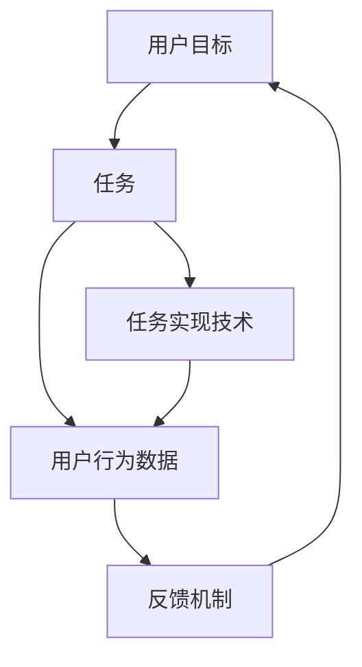
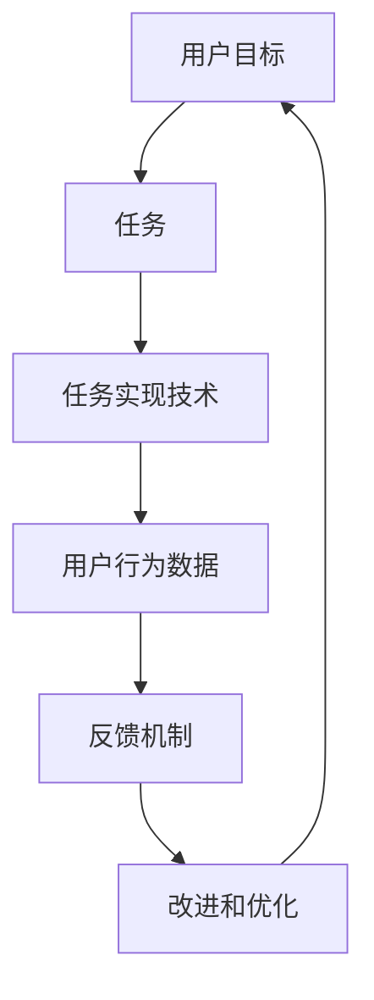

                 

## 1. 背景介绍

在如今数字化的时代，计算用户界面（CUI，Computing User Interface）越来越成为人们与计算机交互的重要接口。CUI系统的目标是实现自然、高效、互动的交互体验，提升用户满意度，增强业务价值。用户目标，即用户希望通过CUI系统实现的功能和效果，是CUI设计和实现的核心。然而，用户目标的抽象描述与具体的技术实现之间存在较大差距，如何清晰地定义用户目标，并通过技术手段高效地实现这些目标，是CUI系统开发中的核心挑战。

本文将从用户目标和任务实现技术的角度，探讨CUI系统设计和开发中的关键问题。首先，我们将介绍用户目标的定义及其重要性，然后深入探讨任务实现技术的基本原理和操作步骤，并结合具体案例分析，展示这些技术如何在实际CUI系统中得到应用。最后，我们将总结未来CUI系统的发展趋势和面临的挑战，并提出一些前瞻性的研究方向和建议。

## 2. 核心概念与联系

### 2.1 核心概念概述

CUI系统旨在通过计算手段，为用户提供自然、高效、互动的交互体验。其核心包括用户目标、任务、任务实现技术、用户行为数据、反馈机制等几个关键组成部分。

- **用户目标（User Goals）**：用户使用CUI系统希望达到的最终效果和功能。例如，通过查询天气信息、下单购物、管理日程等。
- **任务（Tasks）**：用户实现其目标需要完成的一系列步骤和操作。例如，查询天气信息需要输入查询地点、选择查询方式、查看天气预报等。
- **任务实现技术（Task Realization Techniques）**：具体实现用户任务的技术手段，包括自然语言处理（NLP）、计算机视觉（CV）、机器学习（ML）等。
- **用户行为数据（User Behavior Data）**：用户在CUI系统上的交互数据，用于分析和优化系统性能。
- **反馈机制（Feedback Mechanism）**：用户对系统表现的反馈，用于改进系统功能和用户体验。

这些核心概念之间的关系可以通过以下Mermaid流程图来展示：



### 2.2 核心概念原理和架构的 Mermaid 流程图



## 3. 核心算法原理 & 具体操作步骤

### 3.1 算法原理概述

CUI系统中的任务实现技术主要基于自然语言处理（NLP）、计算机视觉（CV）、机器学习（ML）等前沿技术。以NLP技术为例，其核心思想是将自然语言输入转化为计算机可理解的形式，并通过算法进行处理和分析，最终输出结果。常用的NLP技术包括词法分析、句法分析、语义分析、机器翻译、文本分类等。

### 3.2 算法步骤详解

以自然语言处理（NLP）为例，展示任务实现技术的具体步骤：

1. **输入处理**：将用户的自然语言输入转换为计算机可理解的形式，如分词、词性标注、句法分析等。
2. **语义分析**：通过NLP模型对文本进行语义分析，提取关键词、实体、关系等信息。
3. **知识图谱构建**：将文本中的实体和关系映射到知识图谱中，形成结构化的知识表示。
4. **推理和生成**：基于知识图谱进行推理和生成，如推荐系统中的个性化推荐、问答系统中的自然语言问答。
5. **输出处理**：将生成的结果转换为自然语言输出，如语音合成、文本生成等。

### 3.3 算法优缺点

自然语言处理（NLP）技术在CUI系统中的应用广泛，但也存在一些缺点：

- **语言多样性**：不同语言和方言的语法和词汇差异较大，难以通用。
- **歧义问题**：同一句子可能有多种解释，需要进行上下文理解。
- **计算复杂度**：处理大规模语料时，计算复杂度较高。
- **数据需求**：需要大量标注数据进行模型训练，数据获取成本较高。

### 3.4 算法应用领域

自然语言处理（NLP）技术广泛应用于各种CUI系统中，如智能客服、智能翻译、智能搜索、智能助理等。此外，NLP技术还被应用于信息抽取、文本分类、情感分析、舆情监控等任务。

## 4. 数学模型和公式 & 详细讲解 & 举例说明

### 4.1 数学模型构建

以文本分类为例，展示CUI任务中的数学模型构建：

1. **输入表示**：将文本转换为向量表示，如词袋模型、TF-IDF、Word2Vec等。
2. **分类模型**：使用逻辑回归、SVM、神经网络等模型进行分类。
3. **损失函数**：使用交叉熵损失函数，衡量预测结果与真实标签之间的差异。
4. **优化算法**：使用梯度下降、Adam、Adagrad等优化算法，最小化损失函数。

### 4.2 公式推导过程

以逻辑回归为例，展示文本分类的数学公式推导：

设文本 $x$ 属于类别 $y$ 的概率为 $P(y|x)$，则逻辑回归模型的输出为：

$$
\hat{P(y|x)} = \frac{1}{1+e^{-z}} \\
z = w \cdot x + b
$$

其中 $w$ 为权重向量，$b$ 为偏置项，$x$ 为文本向量，$y$ 为分类标签。

### 4.3 案例分析与讲解

以智能客服为例，展示自然语言处理技术在实际应用中的实现：

1. **输入处理**：用户输入自然语言查询，如“我想订一张去北京的机票”。
2. **意图识别**：使用NLP模型识别用户意图为“订票”。
3. **知识图谱查询**：根据意图，从知识图谱中查询相关信息，如航班信息、票价等。
4. **生成回复**：将查询结果生成自然语言回复，如“航班号为CA123，票价为1000元”。
5. **用户反馈**：用户查看回复，如果满意则继续交互，如果不满意则提供反馈。

## 5. 项目实践：代码实例和详细解释说明

### 5.1 开发环境搭建

CUI系统的开发环境搭建主要涉及Python编程语言、深度学习框架（如TensorFlow、PyTorch）、自然语言处理库（如NLTK、spaCy）、知识图谱构建工具（如GATE、TransKAD）等。以下是一个基本的环境搭建步骤：

1. 安装Python和相关依赖库：
```bash
pip install numpy pandas scikit-learn matplotlib tqdm jupyter notebook ipython
```

2. 安装深度学习框架：
```bash
pip install tensorflow
pip install pytorch torchvision torchaudio
```

3. 安装自然语言处理库：
```bash
pip install nltk spacy
```

4. 安装知识图谱构建工具：
```bash
pip install GATE TransKAD
```

### 5.2 源代码详细实现

以智能客服中的意图识别为例，展示代码实现：

```python
import nltk
from nltk.tokenize import word_tokenize
from nltk.corpus import stopwords
from nltk.stem import WordNetLemmatizer
from sklearn.feature_extraction.text import TfidfVectorizer
from sklearn.linear_model import LogisticRegression

# 定义NLP预处理函数
def preprocess(text):
    # 分词、去除停用词、词形还原
    tokens = word_tokenize(text.lower())
    stop_words = set(stopwords.words('english'))
    lemmatizer = WordNetLemmatizer()
    tokens = [lemmatizer.lemmatize(token) for token in tokens if token not in stop_words]
    return ' '.join(tokens)

# 定义文本分类函数
def classify(text, model):
    # 文本预处理
    text = preprocess(text)
    # 特征提取
    vectorizer = TfidfVectorizer()
    X = vectorizer.transform([text])
    # 分类预测
    y_pred = model.predict(X)[0]
    return y_pred

# 加载意图识别模型
model = LogisticRegression()
model.fit(X_train, y_train)

# 示例测试
query = "I want to book a flight to New York"
label = classify(query, model)
print(label)
```

### 5.3 代码解读与分析

以上代码展示了智能客服中意图识别的基本流程，包括以下关键点：

1. **NLP预处理**：对用户输入的文本进行分词、去除停用词、词形还原等预处理。
2. **特征提取**：使用TF-IDF等方法将文本转换为向量表示。
3. **模型训练**：使用逻辑回归等模型进行训练，最小化损失函数。
4. **意图识别**：根据训练好的模型，对用户输入进行意图识别，输出对应的标签。

## 6. 实际应用场景

### 6.1 智能客服系统

智能客服系统利用自然语言处理技术，通过对话机器人实现用户与系统的自然交互。系统能够理解用户输入的文本，根据意图进行响应和处理。常见的应用场景包括：

- 在线客服：处理用户提出的常见问题和投诉，提供24/7不间断服务。
- 企业内部客服：自动处理客户查询、订单管理、售后服务等。
- 医疗咨询：提供健康咨询、诊疗建议、在线问诊等服务。

### 6.2 智能翻译

智能翻译系统利用自然语言处理技术，将一种语言的文本翻译成另一种语言。系统能够处理各种文本格式，如新闻、邮件、文本文件等。常见的应用场景包括：

- 网页翻译：将网页上的文本自动翻译成目标语言，便于用户理解。
- 会议翻译：在跨国会议中，实时将会议内容翻译成多种语言，便于沟通。
- 文档翻译：将文档中的内容翻译成多种语言，便于跨国公司内部协作。

### 6.3 智能搜索

智能搜索系统利用自然语言处理技术，根据用户输入的自然语言查询，快速获取相关信息。系统能够处理各种查询类型，如文本搜索、图像搜索、语音搜索等。常见的应用场景包括：

- 搜索引擎：如Google、Bing等，通过关键词搜索获取网页信息。
- 语音搜索：通过语音识别技术，将用户语音输入转换为文本查询，获取搜索结果。
- 推荐系统：根据用户历史行为和兴趣，推荐相关信息。

### 6.4 未来应用展望

未来CUI系统的应用将更加广泛和深入，主要发展趋势包括：

1. **多模态交互**：结合图像、语音、视频等多种模态信息，提供更丰富的交互体验。
2. **个性化推荐**：通过用户行为数据，提供更加个性化的服务。
3. **情感分析**：识别用户情绪，优化交互体验。
4. **知识图谱应用**：利用知识图谱进行信息抽取、推理等，提升系统智能水平。
5. **可解释性**：增强系统的可解释性，让用户了解系统的决策过程。

## 7. 工具和资源推荐

### 7.1 学习资源推荐

为了帮助开发者系统掌握CUI系统设计和实现的理论基础和实践技巧，以下是一些优质的学习资源：

1. 《自然语言处理综论》（李航著）：系统介绍了NLP的基本概念和常用技术。
2. Coursera《自然语言处理》课程：由斯坦福大学开设的NLP入门课程，涵盖了NLP的基本概念和经典模型。
3. TensorFlow官方文档：提供了TensorFlow框架的详细文档和使用示例。
4. PyTorch官方文档：提供了PyTorch框架的详细文档和使用示例。
5. Kaggle竞赛平台：提供丰富的NLP竞赛数据集和解决方案，可供学习和实践。

### 7.2 开发工具推荐

以下是几款用于CUI系统开发的常用工具：

1. Jupyter Notebook：提供交互式编程环境，便于代码调试和测试。
2. Visual Studio Code：提供强大的代码编辑器，支持多种语言和框架。
3. GitHub：提供代码托管和版本控制，便于团队协作和代码共享。
4. Docker：提供容器化部署，方便应用在不同环境中运行。

### 7.3 相关论文推荐

CUI系统研究和开发的论文众多，以下是一些奠基性的相关论文，推荐阅读：

1. 《Sequence to Sequence Learning with Neural Networks》：提出了Seq2Seq模型，开启了基于神经网络的机器翻译研究。
2. 《Attention Is All You Need》：提出了Transformer模型，提升了NLP模型的精度和效率。
3. 《BERT: Pre-training of Deep Bidirectional Transformers for Language Understanding》：提出了BERT模型，提升了语言理解的精度。
4. 《LSTM: A Search Space of Recurrent Neural Networks for Sequential Data》：介绍了LSTM模型，适用于长序列数据的处理。
5. 《Google’s Neural Machine Translation System: Bridging the Gap Between Human and Machine Translation》：介绍了Google的机器翻译系统，展示了NLP技术的实际应用。

## 8. 总结：未来发展趋势与挑战

### 8.1 总结

本文系统介绍了CUI系统中的用户目标和任务实现技术，展示了自然语言处理技术在CUI系统中的广泛应用。通过系统分析CUI系统设计和实现的各个环节，我们深入探讨了任务实现技术的基本原理和操作步骤，并通过具体案例展示了这些技术在实际应用中的实现。

通过本文的系统梳理，可以看到，CUI系统设计和实现是一个复杂的过程，需要综合考虑用户需求、技术手段、系统架构等多个方面。自然语言处理技术在CUI系统中发挥了关键作用，但实现其目标仍需解决语言多样性、歧义问题、计算复杂度等诸多挑战。未来CUI系统的发展方向和挑战仍需进一步研究和探索。

### 8.2 未来发展趋势

未来CUI系统的发展将呈现以下几个趋势：

1. **多模态融合**：结合图像、语音、视频等多种模态信息，提供更丰富的交互体验。
2. **个性化推荐**：通过用户行为数据，提供更加个性化的服务。
3. **情感分析**：识别用户情绪，优化交互体验。
4. **知识图谱应用**：利用知识图谱进行信息抽取、推理等，提升系统智能水平。
5. **可解释性**：增强系统的可解释性，让用户了解系统的决策过程。

### 8.3 面临的挑战

CUI系统设计和实现虽然具有广阔的发展前景，但也面临诸多挑战：

1. **数据获取成本高**：获取高质量标注数据成本较高，限制了CUI系统的应用范围。
2. **模型泛化能力不足**：模型在不同领域和环境下的泛化能力有限，影响用户体验。
3. **计算资源消耗大**：处理大规模语料和复杂模型需要高性能计算资源，影响系统部署和维护。
4. **可解释性不足**：系统决策过程缺乏可解释性，用户难以理解和信任。
5. **安全性和隐私保护**：系统需要保护用户隐私和数据安全，避免数据泄露和滥用。

### 8.4 研究展望

未来CUI系统需要从以下几个方面进行深入研究：

1. **无监督学习和半监督学习**：通过无监督或半监督学习，减少对标注数据的依赖，降低数据获取成本。
2. **多模态融合**：结合图像、语音、视频等多种模态信息，提升系统智能水平。
3. **知识图谱应用**：利用知识图谱进行信息抽取、推理等，提升系统智能水平。
4. **可解释性**：增强系统的可解释性，让用户了解系统的决策过程。
5. **安全性和隐私保护**：保障用户隐私和数据安全，避免数据泄露和滥用。

通过不断探索和突破，CUI系统必将实现更高的智能化水平，为人类社会带来更多的便捷和福利。

## 9. 附录：常见问题与解答

**Q1：自然语言处理技术在CUI系统中应用有哪些？**

A: 自然语言处理技术在CUI系统中应用广泛，主要包括：

- 意图识别：理解用户输入的意图，如订购、查询等。
- 文本分类：将文本分类到特定类别，如新闻、评论等。
- 实体识别：识别文本中的实体，如人名、地点等。
- 情感分析：识别文本中的情感，如正面、负面等。
- 文本生成：根据输入生成自然语言输出，如机器翻译、智能回复等。

**Q2：CUI系统中如何处理多模态信息？**

A: 在CUI系统中，多模态信息处理通常分为以下几个步骤：

1. 数据采集：通过摄像头、麦克风等设备采集用户输入的多模态数据，如文本、语音、图像等。
2. 数据融合：将不同模态的数据进行融合，形成统一的数据格式，如将语音转换成文本，将图像转换成文本描述。
3. 特征提取：对融合后的数据进行特征提取，形成可用于模型的输入。
4. 模型训练：使用多模态模型进行训练，如使用卷积神经网络（CNN）处理图像数据，使用循环神经网络（RNN）处理文本数据。
5. 结果生成：将模型预测结果生成多模态输出，如将文本和图像生成融合的交互界面。

**Q3：CUI系统中如何保护用户隐私和数据安全？**

A: 在CUI系统中，保护用户隐私和数据安全尤为重要。以下是一些常见措施：

1. 数据加密：对用户数据进行加密存储，防止数据泄露。
2. 访问控制：通过身份认证和权限控制，防止非法访问。
3. 数据匿名化：对用户数据进行匿名化处理，防止数据关联。
4. 隐私保护技术：使用差分隐私、联邦学习等技术，保护用户隐私。

**Q4：CUI系统中如何提升系统的可解释性？**

A: 在CUI系统中，提升系统的可解释性是提高用户信任度的重要手段。以下是一些常见措施：

1. 透明决策过程：通过可视化的方式展示系统的决策过程，让用户了解每个步骤的依据。
2. 规则推理：使用规则推理技术，将决策过程映射到具体的规则和条件。
3. 解释模型：使用可解释性较高的模型，如决策树、线性回归等。

**Q5：CUI系统中如何处理歧义问题？**

A: 在CUI系统中，歧义问题是常见的挑战。以下是一些常见措施：

1. 上下文理解：通过上下文理解，识别用户输入中的歧义，进行语境修正。
2. 多意图识别：通过多意图识别，将用户输入映射到多个可能的意图，进行多路径决策。
3. 交互验证：通过交互验证，确认用户意图，避免误解。

---

作者：禅与计算机程序设计艺术 / Zen and the Art of Computer Programming

