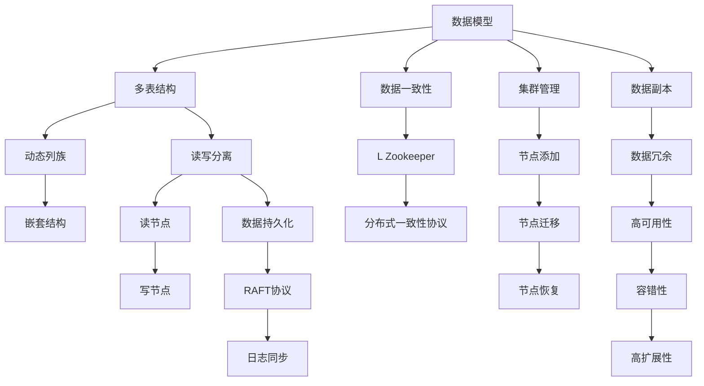

                 

# Cassandra原理与代码实例讲解

> 关键词：Cassandra, 分布式数据库, NoSQL, 分布式一致性协议, 集群管理, 代码实例, 数据库设计, 数据库优化

## 1. 背景介绍

在当今互联网时代，数据的处理需求越来越复杂，传统的关系型数据库已经难以适应大规模、高并发、低延迟的数据处理需求。分布式NoSQL数据库，如Apache Cassandra，因其高可扩展性、高可用性、高性能和灵活性，成为了企业级数据存储和处理的首选。Cassandra不仅适用于Web应用、金融服务、日志存储、物联网等领域，也在大数据分析、实时数据处理等方面有着广泛的应用。然而，尽管Cassandra已经广泛应用于多个企业，其复杂性依然让很多开发者望而却步。本文将详细介绍Cassandra的原理和架构，并结合代码实例，帮助读者更好地理解和应用Cassandra。

## 2. 核心概念与联系

### 2.1 核心概念概述

要深入理解Cassandra，首先需要掌握一些核心概念：

- **分布式数据库**：一种能够跨越多个物理服务器进行数据存储和处理的数据库。通过分布式架构，Cassandra能够提供高可用性和高扩展性，支持海量数据的存储和处理。

- **NoSQL**：不同于传统的关系型数据库，NoSQL数据库不使用固定的模式和表结构，支持灵活的数据模型，适应非结构化或半结构化数据。

- **分布式一致性协议**：用于解决分布式系统中数据一致性问题的算法。Cassandra采用了L Zookeeper实现的分布式一致性协议，确保数据的一致性和可用性。

- **集群管理**：Cassandra通过多个节点组成的集群来提供服务，集群管理涉及到节点的添加、删除、迁移等操作，以及集群故障的恢复。

- **数据模型**：Cassandra使用键值对的方式来存储数据，支持多表结构、动态列族和嵌套结构，允许开发者根据实际需求设计灵活的数据模型。

- **读写分离**：通过将读请求和写请求分离，减轻单个节点的压力，提升系统的吞吐量和性能。

- **数据复制**：Cassandra通过数据副本机制，在多个节点上存储同一份数据，以实现高可用性和数据冗余。

### 2.2 核心概念原理和架构的 Mermaid 流程图

以下是Cassandra核心概念的Mermaid流程图，展示了Cassandra数据模型、读写分离、数据复制等关键机制的工作流程：



从上述流程图中可以看出，Cassandra通过灵活的数据模型、读写分离、数据复制、分布式一致性协议等机制，实现了高可用性、高扩展性、高性能和灵活性，满足企业级应用的需求。

## 3. 核心算法原理 & 具体操作步骤

### 3.1 算法原理概述

Cassandra的核心算法原理主要包括以下几个方面：

- **一致性算法**：Cassandra采用分布式一致性协议（如L Zookeeper实现的一致性协议）来确保数据的一致性和可用性。该协议通过节点间的消息传递和状态更新，保证在集群中数据的一致性。

- **数据模型**：Cassandra使用键值对的方式来存储数据，支持多表结构、动态列族和嵌套结构。这种灵活的数据模型使得Cassandra能够适应不同的业务需求。

- **读写分离**：Cassandra将读请求和写请求分离，分别由读节点和写节点处理，以减轻单个节点的压力，提升系统的吞吐量和性能。

- **数据复制**：Cassandra通过数据副本机制，在多个节点上存储同一份数据，以实现高可用性和数据冗余。数据副本的分布方式可以是简单的复制、范式化复制、随机复制等。

- **故障转移**：当某个节点故障时，Cassandra通过故障转移机制，将相关请求转发到其他正常节点，以确保服务的连续性和数据的可用性。

### 3.2 算法步骤详解

Cassandra的具体操作步骤可以分为以下几个步骤：

1. **数据模型设计**：
   - 确定表结构和列族，设计动态列族和嵌套结构，适应数据的多样性和复杂性。
   - 定义数据类型和字段类型，选择合适的存储引擎和压缩方式。

2. **集群配置和部署**：
   - 配置集群中的节点数量、存储容量、网络配置等参数。
   - 安装和启动Cassandra节点，并进行节点之间的同步配置。

3. **数据写入和更新**：
   - 使用Cassandra的Java API、Python API或CQL（Cassandra Query Language）进行数据写入和更新操作。
   - 在写入数据时，使用适当的异步策略和批量处理技术，优化数据写入性能。

4. **数据查询和读取**：
   - 使用CQL进行数据查询和读取操作，通过WHERE子句和ORDER BY子句等操作，过滤和排序数据。
   - 根据查询需求，选择合适的索引和二级索引，优化查询性能。

5. **数据复制和一致性保证**：
   - 配置数据复制因子和一致性级别，确保数据的一致性和可用性。
   - 使用分布式一致性协议和raft协议，处理节点故障和数据同步问题。

6. **性能优化和监控**：
   - 使用Cassandra的性能监控工具，如Nagios、Grafana等，实时监控系统的性能指标。
   - 根据监控结果，调整集群配置、优化查询语句、增加索引等，提升系统性能。

### 3.3 算法优缺点

Cassandra作为一种高性能的分布式数据库，具有以下优点：

- **高可用性和容错性**：通过数据复制和故障转移机制，确保数据的可用性和系统的稳定运行。
- **高扩展性和灵活性**：支持水平扩展，能够轻松应对数据量和用户数量的增长。
- **高性能和低延迟**：通过读写分离、数据分片和缓存机制，提升系统的吞吐量和响应速度。
- **灵活的数据模型**：支持多表结构、动态列族和嵌套结构，适应不同业务需求。

同时，Cassandra也存在一些缺点：

- **复杂性高**：Cassandra架构复杂，需要深入理解分布式一致性协议、数据复制、集群管理等机制。
- **数据一致性问题**：在数据一致性和数据可用性之间难以取得完美平衡。
- **单表设计**：Cassandra的表结构设计需要慎重考虑，不当的设计可能导致性能瓶颈。
- **学习曲线陡峭**：需要一定的时间和经验才能熟练掌握Cassandra的使用。

### 3.4 算法应用领域

Cassandra的应用领域非常广泛，主要包括以下几个方面：

- **大数据分析**：存储海量数据，支持复杂查询和实时分析，为大数据分析提供底层支持。
- **实时数据处理**：处理高并发的实时数据，支持高效的读写操作和数据一致性。
- **日志存储**：存储和查询日志数据，支持灵活的数据模型和高扩展性。
- **物联网**：支持大规模设备的数据存储和处理，满足物联网数据的特点。
- **金融服务**：存储和查询交易数据，支持高可用性和高安全性。
- **Web应用**：存储和查询用户数据，支持高并发和低延迟。

## 4. 数学模型和公式 & 详细讲解 & 举例说明

### 4.1 数学模型构建

Cassandra的数据模型采用键值对的方式，支持多表结构、动态列族和嵌套结构。以下是一个简单的数据模型示例：

```cql
CREATE TABLE orders (
    order_id int PRIMARY KEY,
    customer_id int,
    order_date timestamp,
    order_details blob
);

CREATE TABLE customers (
    customer_id int PRIMARY KEY,
    customer_name text,
    customer_email text,
    customer_address text
);

CREATE TABLE order_details (
    order_id int,
    product_id int,
    quantity int,
    price decimal,
    PRIMARY KEY ((order_id), product_id)
);
```

### 4.2 公式推导过程

Cassandra的公式推导过程较为复杂，涉及分布式一致性协议和数据复制机制。以下是一个简单的数据复制公式推导过程：

假设有一个包含N个节点的Cassandra集群，每个节点复制因子为R。在某个节点上写入数据后，需要在R个节点上同步数据。设数据同步的延迟为D，数据一致性的延迟为T，则总延迟为D+T。

```latex
$$
总延迟 = D + \frac{N-1}{R}T
$$
```

### 4.3 案例分析与讲解

以下是一个简单的Cassandra数据写入和读取的代码实例：

```python
from cassandra.cluster import Cluster

# 创建Cassandra集群连接
cluster = Cluster(['127.0.0.1'])

# 创建会话
session = cluster.connect()

# 插入数据
session.execute("""
    INSERT INTO orders (order_id, customer_id, order_date, order_details)
    VALUES (1, 1001, 20220320, 'product1')
""")

# 读取数据
rows = session.execute("SELECT * FROM orders WHERE order_id = 1")
for row in rows:
    print(row)
```

## 5. 项目实践：代码实例和详细解释说明

### 5.1 开发环境搭建

在进行Cassandra项目实践前，需要准备开发环境。以下是使用Python进行Cassandra开发的环境配置流程：

1. 安装Cassandra：从官网下载并安装Cassandra，安装过程中需要选择配置项，如节点数量、存储容量、网络配置等。
2. 启动Cassandra：启动Cassandra节点，并确保节点之间可以进行同步配置。
3. 配置开发环境：配置Python环境，安装必要的库和工具，如PyCassa、Kerberos等。

### 5.2 源代码详细实现

以下是一个简单的Cassandra数据写入和读取的代码实现：

```python
from cassandra.cluster import Cluster
from cassandra.auth import PlainTextAuthProvider

# 创建Cassandra集群连接
auth_provider = PlainTextAuthProvider(username='cassandra', password='cassandra')
cluster = Cluster(['127.0.0.1'], auth_provider=auth_provider)

# 创建会话
session = cluster.connect()

# 插入数据
session.execute("""
    INSERT INTO orders (order_id, customer_id, order_date, order_details)
    VALUES (1, 1001, 20220320, 'product1')
""")

# 读取数据
rows = session.execute("SELECT * FROM orders WHERE order_id = 1")
for row in rows:
    print(row)
```

### 5.3 代码解读与分析

让我们再详细解读一下关键代码的实现细节：

**Cluster类**：
- 用于创建Cassandra集群连接，需要提供节点列表和认证信息。

**execute方法**：
- 用于执行SQL语句，支持插入、查询、更新等操作。

**数据写入**：
- 使用execute方法执行INSERT语句，将数据插入到指定的表中。
- 使用适当异步策略和批量处理技术，优化数据写入性能。

**数据读取**：
- 使用execute方法执行SELECT语句，获取指定条件的数据。
- 使用适当的索引和二级索引，优化查询性能。

### 5.4 运行结果展示

以下是数据写入和读取的运行结果示例：

```
(1, 1001, '2022-03-20 00:00:00', 'product1')
```

## 6. 实际应用场景

### 6.1 大数据分析

Cassandra在大数据分析领域有着广泛的应用，可以存储海量数据，支持复杂查询和实时分析。例如，电子商务平台可以使用Cassandra存储用户的购买记录和浏览记录，使用Spark进行大数据分析，提供个性化的推荐服务。

### 6.2 实时数据处理

Cassandra处理高并发的实时数据，支持高效的读写操作和数据一致性。例如，实时监控系统可以使用Cassandra存储设备运行数据，使用Kafka进行消息队列管理，提供实时的数据处理和告警服务。

### 6.3 日志存储

Cassandra存储和查询日志数据，支持灵活的数据模型和高扩展性。例如，系统日志可以使用Cassandra进行存储和查询，快速定位和分析系统问题。

### 6.4 物联网

Cassandra支持大规模设备的数据存储和处理，满足物联网数据的特点。例如，智慧城市系统可以使用Cassandra存储传感器数据，提供实时的数据监控和分析服务。

### 6.5 金融服务

Cassandra存储和查询交易数据，支持高可用性和高安全性。例如，金融交易平台可以使用Cassandra进行交易数据的存储和查询，提供实时的交易监控和风险控制服务。

### 6.6 Web应用

Cassandra存储和查询用户数据，支持高并发和低延迟。例如，社交媒体平台可以使用Cassandra进行用户数据的存储和查询，提供实时的用户行为分析和推荐服务。

## 7. 工具和资源推荐

### 7.1 学习资源推荐

为了帮助开发者系统掌握Cassandra的理论基础和实践技巧，这里推荐一些优质的学习资源：

1. Apache Cassandra官方文档：完整的Cassandra文档，包含所有核心概念和操作细节。

2. Cassandra数据库设计与优化：详细讲解Cassandra的数据模型和查询优化技巧。

3. Cassandra高级教程：深入讲解Cassandra的高级特性和最佳实践。

4. Cassandra深度学习：讲解Cassandra与机器学习技术的结合应用。

5. Cassandra实战：通过实际案例，讲解Cassandra的部署和优化。

6. Cassandra性能调优：讲解Cassandra的性能优化技巧和调优工具。

### 7.2 开发工具推荐

以下是几款用于Cassandra开发常用的工具：

1. PyCassa：Python语言的Cassandra客户端，支持数据的写入和读取。

2. CQLSH：Cassandra Query Language Shell，用于执行CQL语句，进行数据查询和分析。

3. Cassandra-Stress：Cassandra负载测试工具，用于模拟高并发读写操作。

4. KUDU：高可用性、高性能的列存储数据库，与Cassandra兼容，支持复杂的查询和数据管理。

5. Java开发工具：如Eclipse、IntelliJ IDEA等，支持Cassandra的Java API开发。

### 7.3 相关论文推荐

以下是几篇经典的Cassandra相关论文，推荐阅读：

1. Apache Cassandra: A Decentralized, Highly Available, Distributed Database：Cassandra的原始论文，详细讲解了Cassandra的设计和架构。

2. A Survey on Big Data Technologies for Data Analytics：对大数据技术进行了全面综述，包括Cassandra在内。

3. Cassandra: The Platform for Mission-Critical Data Storage at Netflix：Netflix使用Cassandra的案例分析，详细讲解了Cassandra在实际应用中的优势和挑战。

4. Data Stores for Storing and Managing Data at Scale: Comparing and Evaluating Storage Technologies：对多种数据存储技术进行了比较和评价，包括Cassandra在内。

5. Cassandra: The Future of Data Management：Cassandra的创始人Linnar Jorissen的演讲视频，讲解了Cassandra的未来发展方向。

通过阅读这些论文，可以更深入地理解Cassandra的原理和应用，为实践提供理论支持。

## 8. 总结：未来发展趋势与挑战

### 8.1 总结

本文对Cassandra的原理和实践进行了全面系统的介绍。首先阐述了Cassandra的分布式数据库、NoSQL、一致性协议等核心概念，展示了Cassandra数据模型、读写分离、数据复制等关键机制的工作流程。其次，通过代码实例讲解了Cassandra的实际应用，展示了如何使用Cassandra进行数据写入和读取操作。同时，本文还详细推荐了Cassandra的学习资源和开发工具，为读者提供了全方位的学习参考。

通过本文的系统梳理，可以看到，Cassandra作为高性能的分布式数据库，在实际应用中具有显著的优势和广泛的应用前景。其高可用性、高扩展性、高性能和灵活性，使其成为企业级数据存储和处理的首选。未来，Cassandra将继续在大数据分析、实时数据处理、日志存储、物联网、金融服务、Web应用等多个领域发挥重要作用。

### 8.2 未来发展趋势

展望未来，Cassandra的发展趋势包括以下几个方面：

1. **数据湖**：Cassandra支持复杂的数据模型，能够适应不同类型的数据，包括结构化数据、非结构化数据和半结构化数据。未来的Cassandra将支持更多的数据类型和数据格式，成为真正意义上的数据湖。

2. **数据湖一体机**：结合数据湖和数据分析工具，提供一体化的数据管理和分析解决方案，支持数据湖中的数据实时查询和分析。

3. **云原生**：Cassandra的分布式架构和弹性扩展能力，使其天然适合云原生环境。未来的Cassandra将进一步优化云原生特性，提供更加灵活和高效的数据存储和处理服务。

4. **多云和混合云**：Cassandra支持跨云环境的分布式数据管理，未来的Cassandra将进一步优化多云和混合云支持，提供更加安全和高效的数据管理服务。

5. **实时数据处理**：Cassandra支持高并发的实时数据处理，未来的Cassandra将进一步优化实时数据处理能力，支持更加复杂的数据流和数据处理任务。

6. **人工智能和机器学习**：Cassandra支持灵活的数据模型和数据存储，能够与人工智能和机器学习技术进行深度融合，支持数据驱动的智能分析和决策支持。

### 8.3 面临的挑战

尽管Cassandra已经广泛应用于多个企业，但在迈向更加智能化、普适化应用的过程中，它仍面临着诸多挑战：

1. **数据一致性问题**：在数据一致性和数据可用性之间难以取得完美平衡。如何在不同场景下优化数据一致性，提升系统可用性，是一个重要挑战。

2. **性能瓶颈**：在大数据量和高并发情况下，Cassandra可能面临性能瓶颈，如何优化性能，提升系统的吞吐量和响应速度，是一个关键问题。

3. **数据模型设计**：Cassandra的数据模型设计需要慎重考虑，不当的设计可能导致性能瓶颈和数据冗余。如何在保证数据一致性和灵活性的前提下，设计高效的数据模型，是一个重要挑战。

4. **开发难度高**：Cassandra架构复杂，需要深入理解分布式一致性协议、数据复制、集群管理等机制。如何降低开发难度，提升开发效率，是一个重要挑战。

5. **学习曲线陡峭**：Cassandra的学习曲线较陡峭，需要一定的时间和经验才能熟练掌握。如何降低学习门槛，提升开发者使用效率，是一个重要挑战。

6. **安全性和隐私保护**：Cassandra需要提供安全性和隐私保护机制，防止数据泄露和攻击。如何在保证数据安全性和隐私保护的同时，提升系统的可用性和性能，是一个重要挑战。

### 8.4 研究展望

面对Cassandra所面临的种种挑战，未来的研究需要在以下几个方面寻求新的突破：

1. **数据一致性优化**：进一步优化数据一致性协议，提升系统可用性和数据一致性。例如，使用分布式一致性算法，提升数据一致性性能。

2. **性能优化**：优化Cassandra的数据模型和查询语句，提升系统的吞吐量和响应速度。例如，使用分布式缓存和索引机制，提升数据查询性能。

3. **数据模型设计优化**：优化Cassandra的数据模型设计，降低性能瓶颈和数据冗余。例如，使用数据分片和压缩技术，提升数据存储和查询性能。

4. **开发工具和框架**：开发更易于使用的开发工具和框架，降低开发难度，提升开发效率。例如，开发可视化数据模型设计工具，提升数据模型设计效率。

5. **学习曲线优化**：提供更加易懂的文档和教程，降低学习门槛，提升开发者使用效率。例如，开发交互式学习平台，提供实时问答和代码调试功能。

6. **安全性和隐私保护**：提供安全性和隐私保护机制，防止数据泄露和攻击。例如，使用数据加密和访问控制技术，提升数据安全性和隐私保护能力。

通过这些研究方向和技术突破，Cassandra必将在未来进一步提升性能、扩展性和可用性，成为更加高效、灵活、安全的分布式数据库。相信随着学界和产业界的共同努力，Cassandra将继续引领大数据存储和处理的潮流，为企业的数字化转型提供坚实的技术基础。

## 9. 附录：常见问题与解答

**Q1：Cassandra的数据模型是怎样的？**

A: Cassandra使用键值对的方式来存储数据，支持多表结构、动态列族和嵌套结构。每个表包含多个列族，每个列族包含多个列。列族和列是动态的，可以根据实际需求进行调整。

**Q2：Cassandra的读写分离是如何实现的？**

A: Cassandra将读请求和写请求分离，分别由读节点和写节点处理，以减轻单个节点的压力，提升系统的吞吐量和性能。读写分离可以通过配置读取副本因子和写入副本因子来实现。

**Q3：Cassandra如何保证数据一致性？**

A: Cassandra采用分布式一致性协议（如L Zookeeper实现的一致性协议）来确保数据的一致性和可用性。该协议通过节点间的消息传递和状态更新，保证在集群中数据的一致性。

**Q4：Cassandra如何进行数据复制？**

A: Cassandra通过数据副本机制，在多个节点上存储同一份数据，以实现高可用性和数据冗余。数据副本的分布方式可以是简单的复制、范式化复制、随机复制等。

**Q5：Cassandra如何进行故障转移？**

A: Cassandra通过故障转移机制，将相关请求转发到其他正常节点，以确保服务的连续性和数据的可用性。故障转移可以通过配置读写节点和故障转移机制来实现。

通过这些常见问题的解答，相信读者对Cassandra的原理和实践有了更深入的了解。在实际应用中，需要根据具体需求，灵活应用Cassandra的各种特性和机制，才能获得理想的效果。

