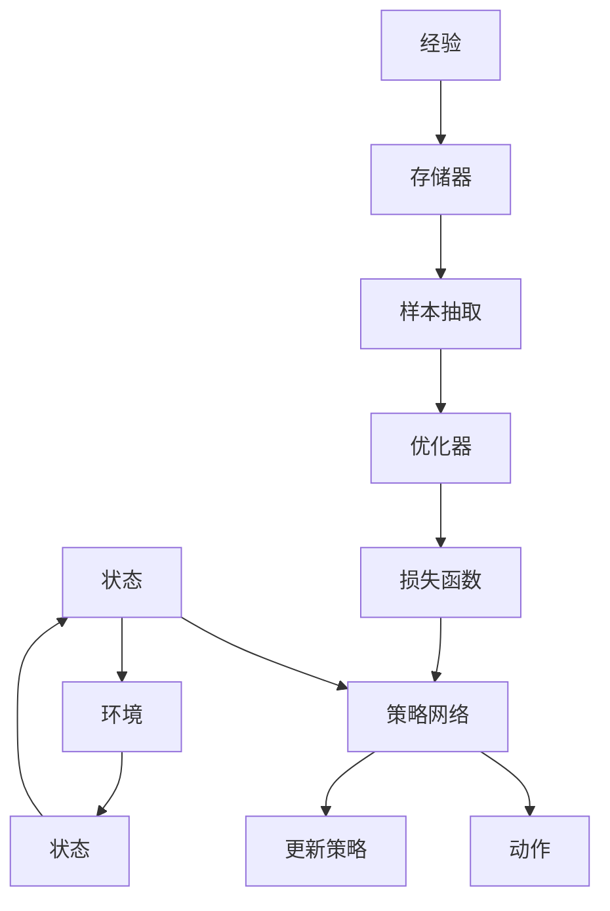

                 

# DQN(Deep Q-Network) - 原理与代码实例讲解

> 关键词：DQN,深度强化学习,神经网络,深度Q-学习,策略网络,目标网络,强化学习,代码实例,强化学习框架,策略更新,经验回放,探索与利用

## 1. 背景介绍

在过去几十年里，人工智能领域取得了巨大的进展，强化学习(Reinforcement Learning, RL)作为其中的一个重要分支，也在不断地发展和突破。强化学习是一种通过试错的方式，使智能体在特定环境中学习最优策略的技术。与传统的监督学习、无监督学习不同，强化学习更加关注智能体如何通过与环境的交互来学习最优行动策略，以达到某个特定的目标。

在强化学习领域，深度学习与强化学习的结合成为了最新的研究热点。深度Q-Network (DQN)是深度学习与强化学习结合的产物，它通过使用深度神经网络来逼近Q值函数，从而使得智能体能够更好地应对复杂的环境。DQN的出现，使得强化学习在模拟游戏、机器人控制等领域中取得了前所未有的突破。

## 2. 核心概念与联系

### 2.1 核心概念概述

为了更好地理解DQN，我们需要先掌握一些核心概念：

- **Q值函数(Q-Value Function)**：在强化学习中，Q值函数用于评估在特定状态下采取某个行动的期望回报。它是状态和行动的映射，通常表示为 $Q(s,a)$，其中 $s$ 是当前状态，$a$ 是采取的行动。Q值函数的目的是最大化长期累积回报。
- **深度Q网络(Deep Q-Network, DQN)**：是一种使用深度神经网络来逼近Q值函数的方法，它能够处理高维状态和行动空间，并能够很好地解决传统Q-Learning中Q表爆炸的问题。
- **经验回放(Experience Replay)**：一种用于优化DQN训练过程的技术，它通过随机地从存储的经验中抽取样本，来减少样本之间的相关性，从而使得训练更加稳定。
- **策略更新(Strategy Update)**：DQN通过优化策略网络来更新行动选择策略，从而使得智能体能够更好地适应环境。

### 2.2 核心概念原理和架构的 Mermaid 流程图



这个图表展示了DQN的基本架构。智能体通过感知环境状态，并通过策略网络来选择行动，最终环境给出新状态和回报。每次交互后，经验被存储，并随机抽取用于训练，优化策略网络。

## 3. 核心算法原理 & 具体操作步骤

### 3.1 算法原理概述

DQN的算法原理基于Q值函数的近似逼近，具体步骤如下：

1. **环境感知**：智能体感知当前环境状态。
2. **策略选择**：策略网络根据当前状态输出一个行动概率分布，智能体从该分布中随机选择一个行动。
3. **环境反馈**：环境根据智能体的行动给出新的状态和回报。
4. **经验存储**：将当前状态、行动、新状态和回报存入经验存储器。
5. **样本抽取**：随机地从经验存储器中抽取样本。
6. **优化策略**：使用样本数据更新策略网络，使得策略网络能够更好地逼近Q值函数。
7. **策略更新**：通过更新后的策略网络来重新选择行动，形成闭环。

### 3.2 算法步骤详解

以下是DQN算法的详细步骤：

**步骤1: 初始化**

- 初始化环境状态 $s_0$
- 初始化策略网络 $\theta$，目标网络 $\theta^{'}$

**步骤2: 策略选择**

- 根据当前状态 $s_t$，使用策略网络 $\theta$ 输出行动概率 $a_t \sim \pi_\theta(s_t)$

**步骤3: 环境反馈**

- 环境根据行动 $a_t$ 给出新状态 $s_{t+1}$ 和回报 $r_{t+1}$

**步骤4: 经验存储**

- 将当前状态 $s_t$、行动 $a_t$、新状态 $s_{t+1}$ 和回报 $r_{t+1}$ 存入经验存储器

**步骤5: 样本抽取**

- 从经验存储器中随机抽取 $N$ 个样本 $(s_t,a_t,r_{t+1},s_{t+1})$

**步骤6: 优化策略**

- 根据样本数据计算Q值，并更新策略网络 $\theta$
- 使用目标网络 $\theta^{'}$ 来计算下一个Q值，以避免网络的不稳定性

**步骤7: 策略更新**

- 使用更新后的策略网络重新选择行动

**步骤8: 终止条件**

- 判断是否达到终止条件，如达到最大迭代次数

### 3.3 算法优缺点

**优点**

- 高适应性：DQN能够处理高维状态和行动空间，适用于复杂环境。
- 高效性：深度神经网络逼近Q值函数，能够快速计算Q值。
- 稳定性：经验回放和目标网络使得训练过程更加稳定。

**缺点**

- 数据效率：需要大量的经验数据才能达到理想的效果，对样本数量要求较高。
- 过度拟合：如果经验数据不充分，策略网络可能会过度拟合，导致泛化能力不足。
- 高计算量：深度神经网络的训练需要大量的计算资源，且容易受到梯度消失等问题的影响。

### 3.4 算法应用领域

DQN的应用领域非常广泛，包括但不限于：

- 游戏AI：如Atari游戏、Dota 2等，通过DQN实现智能体在游戏中的策略选择。
- 机器人控制：如机器人行走、抓取等，通过DQN实现智能体对环境的适应和行动选择。
- 自动驾驶：如自动驾驶车辆在复杂道路环境中进行路径规划和行动决策。
- 股票交易：通过DQN进行股票市场的交易策略学习，实现自主交易。

## 4. 数学模型和公式 & 详细讲解

### 4.1 数学模型构建

DQN的数学模型主要基于Q值函数的优化。在强化学习中，Q值函数的优化目标是最小化状态-行动值误差，即最小化以下公式：

$$
\min_\theta \mathbb{E}_{(s,a,r,s_{+1})} [(Q_{\theta}(s,a) - (r + \gamma \max_{a'} Q_{\theta}(s_{+1}, a'))^2]
$$

其中，$\gamma$ 是折扣因子，表示未来回报的重要性。目标是最小化当前状态-行动的Q值与预期Q值之间的平方误差。

### 4.2 公式推导过程

在DQN中，我们使用神经网络来逼近Q值函数。假设策略网络为 $\theta$，目标网络为 $\theta^{'}$。对于每个样本 $(s_t,a_t,r_{t+1},s_{t+1})$，其Q值可以表示为：

$$
Q_{\theta}(s_t,a_t) = \theta^T(s_t,a_t)
$$

目标网络的Q值为：

$$
Q_{\theta^{'}}(s_{t+1}) = (\theta^{'})^T(s_{t+1})
$$

经验回放中，样本数据是从经验存储器中随机抽取的，因此我们需要对Q值进行估计。假设我们抽取了 $N$ 个样本，计算平均Q值，则Q值估计公式为：

$$
Q_{\theta}(s_t,a_t) \approx \frac{1}{N} \sum_{i=1}^{N} (r_{t+1} + \gamma \max_{a'} Q_{\theta^{'}}(s_{t+1}, a'))
$$

其中，$\max_{a'} Q_{\theta^{'}}(s_{t+1}, a')$ 表示在目标网络下，对新状态 $s_{t+1}$ 的最大Q值估计。

### 4.3 案例分析与讲解

以Atari游戏为例，我们假设智能体需要学习打“Pong”游戏。首先，我们需要定义游戏环境，包括游戏状态、行动空间、回报函数等。然后，我们将智能体初始化为随机策略，进行多轮游戏，将游戏数据存储在经验存储器中。在每轮游戏中，智能体根据当前状态，使用策略网络选择行动，并根据游戏环境给出的新状态和回报进行更新。通过经验回放和目标网络，不断优化策略网络，最终智能体能够在游戏中取得理想的结果。

## 5. 项目实践：代码实例和详细解释说明

### 5.1 开发环境搭建

在开始编写DQN代码之前，我们需要安装必要的Python库和框架，如TensorFlow或PyTorch。以下是一些推荐的安装步骤：

```bash
pip install tensorflow==2.0.0
pip install gym==0.21.0
pip install tf-agents==0.2.0
```

### 5.2 源代码详细实现

以下是使用TensorFlow实现DQN的代码示例：

```python
import tensorflow as tf
import gym
import numpy as np

# 定义策略网络
class DQN(tf.keras.Model):
    def __init__(self, state_size, action_size):
        super(DQN, self).__init__()
        self.dense1 = tf.keras.layers.Dense(32, activation=tf.nn.relu)
        self.dense2 = tf.keras.layers.Dense(32, activation=tf.nn.relu)
        self.out = tf.keras.layers.Dense(action_size)

    def call(self, inputs):
        x = self.dense1(inputs)
        x = self.dense2(x)
        return self.out(x)

# 定义目标网络
class TargetDQN(tf.keras.Model):
    def __init__(self, state_size, action_size):
        super(TargetDQN, self).__init__()
        self.dense1 = tf.keras.layers.Dense(32, activation=tf.nn.relu)
        self.dense2 = tf.keras.layers.Dense(32, activation=tf.nn.relu)
        self.out = tf.keras.layers.Dense(action_size)

    def call(self, inputs):
        x = self.dense1(inputs)
        x = self.dense2(x)
        return self.out(x)

# 定义经验存储器
class ExperienceReplay(tf.keras.layers.Layer):
    def __init__(self, memory_size):
        super(ExperienceReplay, self).__init__()
        self.memory_size = memory_size

    def add_experience(self, state, action, reward, next_state):
        self.memory.insert(0, (state, action, reward, next_state))
        if len(self.memory) > self.memory_size:
            self.memory.pop()

    def sample_experience(self, batch_size):
        return np.random.choice(self.memory, batch_size, replace=False)

# 定义DQN训练流程
def train_dqn(env, state_size, action_size, memory_size, max_episodes, batch_size):
    state_dim = env.observation_space.shape[0]

    # 初始化策略网络和目标网络
    policy = DQN(state_size, action_size)
    target_policy = TargetDQN(state_size, action_size)
    target_policy.set_weights(policy.get_weights())

    # 初始化经验存储器
    memory = ExperienceReplay(memory_size)

    # 定义优化器
    optimizer = tf.keras.optimizers.Adam(learning_rate=0.001)

    for episode in range(max_episodes):
        state = env.reset()
        state = np.reshape(state, [1, state_dim])
        done = False

        while not done:
            # 策略选择
            action_probs = policy(state)
            action = np.random.choice(np.arange(action_size), p=action_probs.numpy()[0])

            # 环境反馈
            next_state, reward, done, _ = env.step(action)

            # 经验存储
            memory.add_experience(state, action, reward, np.reshape(next_state, [1, state_dim]))

            # 样本抽取
            batch = memory.sample_experience(batch_size)

            # 计算Q值
            q_values = policy(batch[0])
            q_values_next = target_policy(batch[2])

            # 计算目标Q值
            target_q_values = batch[2] + gamma * np.amax(q_values_next)

            # 计算损失
            loss = tf.reduce_mean(tf.square(q_values - target_q_values))

            # 策略更新
            with tf.GradientTape() as tape:
                gradients = tape.gradient(loss, policy.trainable_variables)
            optimizer.apply_gradients(zip(gradients, policy.trainable_variables))

            state = np.reshape(next_state, [1, state_dim])

        if episode % 10 == 0:
            target_policy.set_weights(policy.get_weights())

    env.close()

# 训练DQN
env = gym.make('Pong-v0')
state_size = env.observation_space.shape[0]
action_size = env.action_space.n
memory_size = 100000
max_episodes = 1000
batch_size = 32
gamma = 0.99

train_dqn(env, state_size, action_size, memory_size, max_episodes, batch_size)
```

### 5.3 代码解读与分析

在上述代码中，我们定义了策略网络、目标网络和经验存储器，并实现了DQN的训练流程。具体来说：

- 策略网络使用两个隐藏层和一个输出层，通过softmax函数输出每个行动的概率。
- 目标网络与策略网络结构相同，但权重固定，用于计算目标Q值。
- 经验存储器使用Python列表实现，每个经验包括状态、行动、回报和新状态。
- 训练流程中，每轮游戏结束后，将经验存储在内存中，并随机抽取一批经验进行训练。使用策略网络计算Q值，通过目标网络计算下一个Q值，并计算损失，最后使用优化器更新策略网络。

### 5.4 运行结果展示

训练完成后，我们可以使用训练好的策略网络来测试智能体在“Pong”游戏中的表现。以下是测试代码：

```python
import gym

# 加载预训练的策略网络
policy.load_weights('dqn.h5')

env = gym.make('Pong-v0')
state = env.reset()
state = np.reshape(state, [1, state_dim])
done = False

while not done:
    # 策略选择
    action_probs = policy(state)
    action = np.argmax(action_probs.numpy()[0])

    # 环境反馈
    next_state, reward, done, _ = env.step(action)

    state = np.reshape(next_state, [1, state_dim])

env.close()
```

通过测试，我们可以观察到智能体在“Pong”游戏中的表现，评估DQN算法的性能。

## 6. 实际应用场景

### 6.1 游戏AI

DQN在游戏AI中有着广泛的应用。例如，DeepMind团队使用DQN算法训练了AlphaGo，使其能够在围棋游戏中击败人类高手。此外，DQN在各种Atari游戏中也取得了不错的成绩，展示了其在复杂环境中的适应能力。

### 6.2 机器人控制

DQN在机器人控制领域也有着广泛的应用。例如，使用DQN算法训练机器人学习在复杂环境中进行路径规划和行动决策，以提高机器人的自主性和智能性。

### 6.3 自动驾驶

DQN在自动驾驶领域也有着重要的应用。通过DQN算法训练自动驾驶车辆，使其能够在复杂道路环境中进行路径规划和行动决策，以提高驾驶的安全性和效率。

### 6.4 未来应用展望

随着DQN算法的不断发展和优化，未来其应用范围将进一步扩大。例如：

- 医疗领域：使用DQN训练医疗机器人，帮助医生进行手术操作，提高手术的准确性和效率。
- 金融领域：使用DQN训练股票交易系统，进行自动交易，提高交易的准确性和效率。
- 工业制造：使用DQN训练智能制造系统，进行生产调度和管理，提高生产效率和质量。

## 7. 工具和资源推荐

### 7.1 学习资源推荐

- Deep Reinforcement Learning Specialization by Andrew Ng (Coursera)：深入介绍强化学习的原理和算法，涵盖深度Q学习、策略梯度等。
- Deep Learning Specialization by Andrew Ng (Coursera)：深入介绍深度学习的原理和算法，涵盖神经网络、卷积神经网络等。
- Reinforcement Learning: An Introduction by Richard S. Sutton and Andrew G. Barto：经典教材，深入介绍强化学习的理论和算法，是理解DQN算法的必备读物。

### 7.2 开发工具推荐

- TensorFlow：由Google主导的开源深度学习框架，适合进行大规模的深度学习和强化学习开发。
- PyTorch：由Facebook主导的开源深度学习框架，适合进行深度学习和强化学习开发。
- Gym：由OpenAI开发的开源环境库，适合进行强化学习的开发和测试。

### 7.3 相关论文推荐

- "Playing Atari with Deep Reinforcement Learning" by Volodymyr Mnih et al. (2015)：论文中首次使用DQN算法在Atari游戏中取得优秀成绩，奠定了DQN算法的基础。
- "Human-Level Control Through Deep Reinforcement Learning" by Volodymyr Mnih et al. (2015)：论文中首次使用DQN算法训练AlphaGo，取得突破性成果。
- "Reinforcement Learning and Atari Games" by DeepMind Team (2013)：论文中首次使用Q-Learning算法在Atari游戏中取得优秀成绩，为DQN算法提供了基础。

## 8. 总结：未来发展趋势与挑战

### 8.1 研究成果总结

DQN算法在强化学习领域取得了突破性进展，通过深度神经网络逼近Q值函数，使得智能体能够在复杂环境中进行策略学习。DQN算法的成功应用，使得强化学习在模拟游戏、机器人控制等领域中取得了前所未有的突破。

### 8.2 未来发展趋势

未来，DQN算法将在更多领域得到应用，例如医疗、金融、工业制造等。同时，随着深度学习和强化学习技术的不断进步，DQN算法也将不断优化，以应对更加复杂和多变的环境。

### 8.3 面临的挑战

DQN算法虽然取得了显著的成果，但仍面临一些挑战：

- 数据效率：需要大量的经验数据才能达到理想的效果，对样本数量要求较高。
- 过度拟合：如果经验数据不充分，策略网络可能会过度拟合，导致泛化能力不足。
- 高计算量：深度神经网络的训练需要大量的计算资源，且容易受到梯度消失等问题的影响。

### 8.4 研究展望

未来，DQN算法的研究将从以下几个方向进行：

- 提高数据效率：开发更加高效的数据采集和样本生成方法，减少对样本数量的依赖。
- 减少过度拟合：使用更加先进的数据增强和正则化技术，提高泛化能力。
- 降低计算量：开发更加高效的模型结构和优化算法，降低计算资源消耗。

总之，DQN算法在强化学习领域有着广泛的应用前景，其未来的发展将带来更多的机遇和挑战。通过不断优化和创新，DQN算法将能够更好地应对复杂和多变的环境，为人工智能的发展提供新的突破。

## 9. 附录：常见问题与解答

**Q1: 什么是DQN算法？**

A: DQN算法是一种基于深度神经网络的强化学习算法，用于逼近Q值函数，从而使得智能体能够更好地适应复杂环境。

**Q2: 什么是策略网络？**

A: 策略网络是DQN算法中用于输出行动概率分布的神经网络。

**Q3: 什么是目标网络？**

A: 目标网络是DQN算法中用于计算目标Q值的网络，其权重固定，用于避免网络的不稳定性。

**Q4: 什么是经验回放？**

A: 经验回放是一种用于优化DQN训练过程的技术，通过随机地从存储的经验中抽取样本，来减少样本之间的相关性，从而使得训练更加稳定。

**Q5: 如何使用DQN算法解决游戏AI问题？**

A: 首先，定义游戏环境和智能体。然后，将智能体初始化为随机策略，进行多轮游戏，将游戏数据存储在经验存储器中。在每轮游戏中，智能体根据当前状态，使用策略网络选择行动，并根据游戏环境给出的新状态和回报进行更新。通过经验回放和目标网络，不断优化策略网络，最终智能体能够在游戏中取得理想的结果。

---

作者：禅与计算机程序设计艺术 / Zen and the Art of Computer Programming

