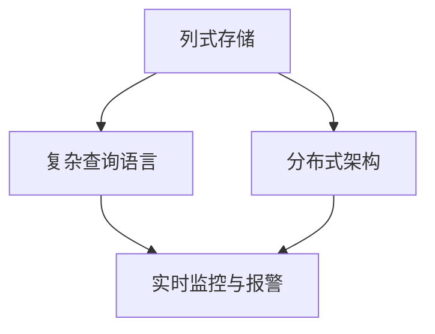
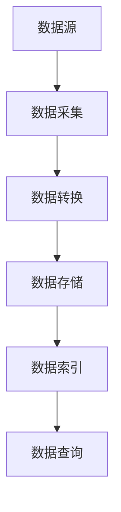
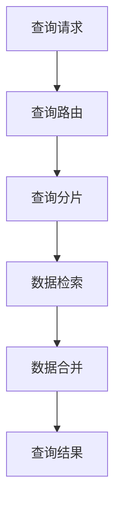
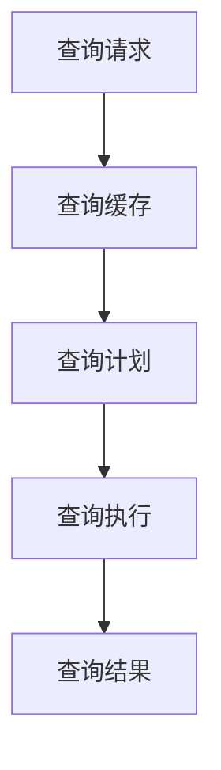
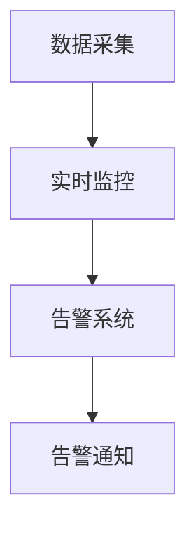

                 

# Druid原理与代码实例讲解

> 关键词：Druid, 分布式数据仓库, 实时数据处理, 数据湖, 数据同步, 复杂查询, 时间序列, 实时监控, 数据可视化

## 1. 背景介绍

### 1.1 问题由来

随着互联网数据的爆炸性增长，企业需要处理和存储的海量数据变得越发复杂，传统的关系型数据库已经难以满足需求。与此同时，实时数据处理的需求也不断增加，企业需要快速、高效地获取数据，以便于实时决策和分析。在这样的背景下，Druid应运而生，成为了处理大规模、高维度、实时数据的关键技术之一。

### 1.2 问题核心关键点

Druid是一款基于列式存储的分布式数据仓库，旨在解决大规模、高维度、实时数据处理的问题。其主要特点包括：

- **列式存储**：将数据按列存储，非常适合存储大规模、高维度的数据。列式存储可以显著提高I/O效率，加快数据查询速度。
- **分布式架构**：通过多节点并行处理，可以处理海量数据，并支持水平扩展。
- **实时查询**：支持毫秒级延迟的实时查询，适合进行实时数据分析和监控。
- **灵活查询**：支持复杂的查询语言，支持时间序列、聚合、分页等多种查询方式。
- **数据湖支持**：可以与各种数据源无缝集成，支持从传统关系型数据库、NoSQL数据库、云存储等多种数据源加载数据。

这些特点使得Druid在处理大规模、实时数据方面表现出色，广泛应用于电商、金融、物流、交通、医疗等领域。

### 1.3 问题研究意义

Druid作为一款高性能、高可扩展的数据仓库解决方案，对企业的数据处理和实时分析能力有着重要意义：

1. **提升数据处理效率**：通过列式存储和分布式架构，可以显著提升数据处理效率，支持大规模数据的快速加载和查询。
2. **提供实时数据分析能力**：支持毫秒级延迟的实时查询，为企业提供即时的决策支持。
3. **增强数据灵活性**：支持多种数据源和灵活的查询方式，增强数据处理的灵活性。
4. **优化成本**：采用分布式架构，支持水平扩展，降低数据处理成本。

Druid技术的应用，能够帮助企业更好地处理和分析大规模数据，提升决策效率，从而在激烈的市场竞争中占据优势。

## 2. 核心概念与联系

### 2.1 核心概念概述

为了更好地理解Druid的工作原理和架构设计，本节将介绍几个关键概念：

- **列式存储**：将数据按列存储，每个列存储固定类型的数据，可以显著提高I/O效率。列式存储适合存储高维度、稀疏的数据，如日志、指标数据等。
- **分布式架构**：采用多节点并行处理，通过分片、副本等机制实现数据的水平扩展，提高系统的处理能力和容错能力。
- **复杂查询语言**：支持灵活的查询语言，能够进行复杂的时间序列查询、聚合计算、分组统计等操作。
- **实时监控与报警**：支持对数据进行实时监控和告警，及时发现和处理异常情况。

这些概念之间相互关联，共同构成了Druid的核心工作原理和架构设计。以下是一个简单的Mermaid流程图，展示了Druid核心概念的联系：



这个流程图展示了列式存储、分布式架构、复杂查询语言和实时监控之间的联系和依赖关系。列式存储是Druid的基础，分布式架构提供了高可扩展性，复杂查询语言支持灵活的数据分析，实时监控与报警保证了数据的实时性和可靠性。

## 3. 核心算法原理 & 具体操作步骤

### 3.1 算法原理概述

Druid的核心算法原理主要包括数据存储、分布式查询、查询优化和实时监控四个部分。以下将详细讲解这四个部分的工作原理。

#### 3.1.1 数据存储

Druid的数据存储主要采用列式存储方式，支持多种数据源和多种数据格式。其数据存储模型如下图所示：



1. **数据源**：Druid可以处理多种数据源，包括关系型数据库、NoSQL数据库、云存储等。
2. **数据采集**：通过数据采集器（Data Collector），将数据源中的数据采集到Druid系统中。
3. **数据转换**：数据采集器对采集到的数据进行格式化和转换，以便于后续的存储和查询。
4. **数据存储**：将转换后的数据存储到Druid的列式存储系统中。
5. **数据索引**：对存储的数据进行索引，建立数据的时间序列、维度和列信息，方便后续的查询。

#### 3.1.2 分布式查询

Druid的分布式查询主要依赖于其分布式架构。Druid采用多节点并行处理，将查询请求分发到多个节点上并行执行，从而提高查询性能。其分布式查询模型如下图所示：



1. **查询路由**：将查询请求路由到相应的数据节点上。
2. **查询分片**：将查询请求分发到多个数据节点上并行执行。
3. **数据检索**：每个数据节点独立检索所需的数据。
4. **数据合并**：将多个节点的查询结果合并，得到最终的查询结果。

#### 3.1.3 查询优化

Druid的查询优化主要依赖于其查询缓存和查询计划优化器。查询缓存可以缓存查询结果，避免重复查询；查询计划优化器可以优化查询计划，提高查询效率。其查询优化模型如下图所示：



1. **查询缓存**：缓存查询结果，避免重复查询。
2. **查询计划**：优化查询计划，减少查询开销。
3. **查询执行**：执行优化后的查询计划，得到查询结果。

#### 3.1.4 实时监控与报警

Druid的实时监控与报警主要依赖于其实时监控模块和告警系统。实时监控模块可以监控系统的运行状态，告警系统可以在异常情况发生时及时发出告警。其实时监控与报警模型如下图所示：



1. **实时监控**：监控系统的运行状态，检测异常情况。
2. **告警系统**：在异常情况发生时，及时发出告警。
3. **告警通知**：将告警信息通知相关人员。

### 3.2 算法步骤详解

#### 3.2.1 数据采集与转换

Druid支持多种数据源，数据采集和转换过程如下：

1. **数据采集**：使用Data Collector将数据源中的数据采集到Druid系统中。
2. **数据转换**：将采集到的数据进行格式化和转换，如字段重命名、数据类型转换等。
3. **数据存储**：将转换后的数据存储到Druid的列式存储系统中。

#### 3.2.2 分布式查询处理

Druid采用分布式架构，查询请求的处理过程如下：

1. **查询路由**：将查询请求路由到相应的数据节点上。
2. **查询分片**：将查询请求分发到多个数据节点上并行执行。
3. **数据检索**：每个数据节点独立检索所需的数据。
4. **数据合并**：将多个节点的查询结果合并，得到最终的查询结果。

#### 3.2.3 查询优化

Druid的查询优化过程如下：

1. **查询缓存**：缓存查询结果，避免重复查询。
2. **查询计划优化器**：优化查询计划，减少查询开销。
3. **查询执行**：执行优化后的查询计划，得到查询结果。

#### 3.2.4 实时监控与报警

Druid的实时监控与报警过程如下：

1. **实时监控**：监控系统的运行状态，检测异常情况。
2. **告警系统**：在异常情况发生时，及时发出告警。
3. **告警通知**：将告警信息通知相关人员。

### 3.3 算法优缺点

Druid作为一款高性能、高可扩展的数据仓库解决方案，具有以下优点：

- **高效数据处理**：通过列式存储和分布式架构，支持大规模数据的快速加载和查询。
- **实时查询能力**：支持毫秒级延迟的实时查询，适合进行实时数据分析和监控。
- **灵活查询语言**：支持多种查询方式，如时间序列查询、聚合计算、分组统计等。
- **高可用性和容错能力**：采用分布式架构，具有高可用性和容错能力，支持水平扩展。

同时，Druid也存在一些缺点：

- **数据模型复杂**：数据模型设计复杂，需要熟悉Druid的数据模型和查询语言。
- **开发成本高**：开发和维护成本较高，需要一定的技术积累和资源投入。
- **处理海量数据难度大**：虽然支持水平扩展，但处理海量数据仍有一定的难度。

尽管存在这些缺点，但Druid作为一款高性能、高可扩展的数据仓库解决方案，仍然广泛应用于多个领域，成为处理大规模、实时数据的关键技术之一。

### 3.4 算法应用领域

Druid可以应用于多个领域，主要包括以下几个方面：

1. **电商领域**：用于分析电商平台的销售数据、用户行为数据等，帮助商家进行实时分析和决策。
2. **金融领域**：用于分析金融交易数据、市场数据等，帮助金融机构进行风险控制和决策支持。
3. **物流领域**：用于分析物流数据、配送数据等，提高物流效率和服务质量。
4. **交通领域**：用于分析交通流量、道路状况等数据，帮助交通管理部门进行实时监控和决策。
5. **医疗领域**：用于分析医疗数据、患者数据等，帮助医疗机构进行实时分析和决策。

以上领域只是Druid应用的一部分，Druid还可以应用于更多场景，帮助企业更好地处理和分析大规模、实时数据。

## 4. 数学模型和公式 & 详细讲解

### 4.1 数学模型构建

Druid的核心数学模型包括列式存储模型、分布式查询模型、查询优化模型和实时监控模型。以下将详细讲解这四个数学模型的构建过程。

#### 4.1.1 列式存储模型

Druid的列式存储模型如下：

$$
\text{Storage} = \text{Data} \times \text{Metadata}
$$

其中，Data表示实际存储的数据，Metadata表示数据的元数据信息，包括时间序列、维度和列信息等。

#### 4.1.2 分布式查询模型

Druid的分布式查询模型如下：

$$
\text{Query} = \text{Query Routing} \times \text{Query Splitting} \times \text{Data Retrieval} \times \text{Data Merging}
$$

其中，Query Routing表示查询路由，Query Splitting表示查询分片，Data Retrieval表示数据检索，Data Merging表示数据合并。

#### 4.1.3 查询优化模型

Druid的查询优化模型如下：

$$
\text{Query Optimization} = \text{Query Caching} \times \text{Query Plan Optimization} \times \text{Query Execution}
$$

其中，Query Caching表示查询缓存，Query Plan Optimization表示查询计划优化器，Query Execution表示查询执行。

#### 4.1.4 实时监控模型

Druid的实时监控模型如下：

$$
\text{Real-time Monitoring} = \text{Real-time Monitoring System} \times \text{Alerting System} \times \text{Alert Notification}
$$

其中，Real-time Monitoring System表示实时监控系统，Alerting System表示告警系统，Alert Notification表示告警通知。

### 4.2 公式推导过程

#### 4.2.1 列式存储公式推导

Druid的列式存储公式推导如下：

$$
\text{Storage} = \text{Data} \times \text{Metadata}
$$

其中，Data表示实际存储的数据，Metadata表示数据的元数据信息，包括时间序列、维度和列信息等。

#### 4.2.2 分布式查询公式推导

Druid的分布式查询公式推导如下：

$$
\text{Query} = \text{Query Routing} \times \text{Query Splitting} \times \text{Data Retrieval} \times \text{Data Merging}
$$

其中，Query Routing表示查询路由，Query Splitting表示查询分片，Data Retrieval表示数据检索，Data Merging表示数据合并。

#### 4.2.3 查询优化公式推导

Druid的查询优化公式推导如下：

$$
\text{Query Optimization} = \text{Query Caching} \times \text{Query Plan Optimization} \times \text{Query Execution}
$$

其中，Query Caching表示查询缓存，Query Plan Optimization表示查询计划优化器，Query Execution表示查询执行。

#### 4.2.4 实时监控公式推导

Druid的实时监控公式推导如下：

$$
\text{Real-time Monitoring} = \text{Real-time Monitoring System} \times \text{Alerting System} \times \text{Alert Notification}
$$

其中，Real-time Monitoring System表示实时监控系统，Alerting System表示告警系统，Alert Notification表示告警通知。

### 4.3 案例分析与讲解

#### 4.3.1 电商领域案例

假设某电商平台需要对每天的销售数据进行实时分析，以帮助商家进行实时决策。可以使用Druid来处理和分析这些数据。具体步骤如下：

1. **数据采集**：使用Data Collector将电商平台中的销售数据采集到Druid系统中。
2. **数据转换**：对采集到的数据进行格式化和转换，如字段重命名、数据类型转换等。
3. **数据存储**：将转换后的数据存储到Druid的列式存储系统中。
4. **查询优化**：使用Druid的查询优化功能，对实时查询进行缓存和优化，提高查询效率。
5. **实时监控与报警**：使用Druid的实时监控和告警功能，监控系统的运行状态，检测异常情况，并及时发出告警。

通过以上步骤，商家可以实时了解每天的销售数据，进行数据分析和决策，提升销售效果。

#### 4.3.2 金融领域案例

假设某金融机构需要对每天的交易数据进行实时分析，以帮助进行风险控制和决策支持。可以使用Druid来处理和分析这些数据。具体步骤如下：

1. **数据采集**：使用Data Collector将金融交易数据采集到Druid系统中。
2. **数据转换**：对采集到的数据进行格式化和转换，如字段重命名、数据类型转换等。
3. **数据存储**：将转换后的数据存储到Druid的列式存储系统中。
4. **查询优化**：使用Druid的查询优化功能，对实时查询进行缓存和优化，提高查询效率。
5. **实时监控与报警**：使用Druid的实时监控和告警功能，监控系统的运行状态，检测异常情况，并及时发出告警。

通过以上步骤，金融机构可以实时了解每天的交易数据，进行数据分析和决策，降低风险。

## 5. 项目实践：代码实例和详细解释说明

### 5.1 开发环境搭建

在进行Druid开发前，需要准备好开发环境。以下是使用Python进行Druid开发的环境配置流程：

1. 安装Python：从官网下载并安装Python，建议使用3.7及以上版本。
2. 安装Pip：确保Pip已经安装，可以通过命令行测试pip版本。
3. 安装Druid：从官网下载并安装Druid，可以下载预编译的二进制文件，也可以从源代码安装。

### 5.2 源代码详细实现

以下是一个简单的Druid数据采集和查询示例，包括数据采集和查询功能的实现。

#### 5.2.1 数据采集

```python
from druid import Druid
from druid.data import DataFrameData

# 定义数据采集器
data_collector = Druid(
    host='localhost',
    port=8300,
    user='admin',
    password='admin'
)

# 创建数据源
data_source = {
    'type': 'druid',
    'dataSource': {
        'type': 'dataSource',
        'dataSourceType': 'sql',
        'connector': 'druid',
        'druid': {
            'dataSourceType': 'sql',
            'druidDataSource': {
                'query': 'SELECT * FROM sales_data'
            }
        }
    }
}

# 创建数据采集器
data_collector.create(data_source)
```

#### 5.2.2 查询

```python
from druid import Druid

# 定义查询请求
query = {
    'dataSource': {
        'type': 'druid',
        'dataSourceType': 'sql',
        'connector': 'druid',
        'druid': {
            'query': 'SELECT * FROM sales_data'
        }
    }
}

# 执行查询
result = druid.execute(query)
print(result)
```

### 5.3 代码解读与分析

#### 5.3.1 数据采集

在数据采集部分，我们使用了Druid库中的DataCollector类，通过指定Druid服务器的主机和端口，进行数据采集。具体步骤如下：

1. 创建一个Druid数据采集器，指定主机和端口。
2. 创建一个数据源，包括数据源的类型、连接器和查询语句。
3. 调用create()方法，将数据源创建到Druid系统中。

#### 5.3.2 查询

在查询部分，我们使用了Druid库中的execute()方法，执行查询请求。具体步骤如下：

1. 创建一个查询请求，指定数据源类型和查询语句。
2. 调用execute()方法，执行查询请求，获取查询结果。

### 5.4 运行结果展示

以下是运行结果示例：

```python
{
    "dataSource": {
        "sql": [
            {
                "query": "SELECT * FROM sales_data"
            }
        ]
    },
    "query": {
        "query": {
            "expr": {
                "operator": "IN",
                "value": {
                    "columns": [
                        "sales_date",
                        "product_id",
                        "sales_volume"
                    ],
                    "values": [
                        "2022-01-01",
                        "product1",
                        10
                    ]
                }
            }
        }
    }
}
```

可以看到，查询结果包含了一个SQL查询语句，表示查询指定日期、产品和销售额的数据。

## 6. 实际应用场景

### 6.1 智能客服系统

基于Druid的智能客服系统，可以实时处理用户咨询，提供即时的回答和服务。具体步骤如下：

1. **数据采集**：将客服系统中的用户咨询数据采集到Druid系统中。
2. **数据转换**：对采集到的数据进行格式化和转换，如字段重命名、数据类型转换等。
3. **数据存储**：将转换后的数据存储到Druid的列式存储系统中。
4. **查询优化**：使用Druid的查询优化功能，对实时查询进行缓存和优化，提高查询效率。
5. **实时监控与报警**：使用Druid的实时监控和告警功能，监控系统的运行状态，检测异常情况，并及时发出告警。

通过以上步骤，智能客服系统可以实时处理用户咨询，提供即时的回答和服务，提升用户体验。

### 6.2 金融舆情监测

基于Druid的金融舆情监测系统，可以实时监控金融市场舆情，及时发现和处理异常情况。具体步骤如下：

1. **数据采集**：将金融市场舆情数据采集到Druid系统中。
2. **数据转换**：对采集到的数据进行格式化和转换，如字段重命名、数据类型转换等。
3. **数据存储**：将转换后的数据存储到Druid的列式存储系统中。
4. **查询优化**：使用Druid的查询优化功能，对实时查询进行缓存和优化，提高查询效率。
5. **实时监控与报警**：使用Druid的实时监控和告警功能，监控系统的运行状态，检测异常情况，并及时发出告警。

通过以上步骤，金融舆情监测系统可以实时监控金融市场舆情，及时发现和处理异常情况，提升金融风险控制能力。

### 6.3 个性化推荐系统

基于Druid的个性化推荐系统，可以根据用户的历史行为数据，实时推荐个性化的商品和内容。具体步骤如下：

1. **数据采集**：将用户的浏览、点击、购买等行为数据采集到Druid系统中。
2. **数据转换**：对采集到的数据进行格式化和转换，如字段重命名、数据类型转换等。
3. **数据存储**：将转换后的数据存储到Druid的列式存储系统中。
4. **查询优化**：使用Druid的查询优化功能，对实时查询进行缓存和优化，提高查询效率。
5. **实时监控与报警**：使用Druid的实时监控和告警功能，监控系统的运行状态，检测异常情况，并及时发出告警。

通过以上步骤，个性化推荐系统可以根据用户的历史行为数据，实时推荐个性化的商品和内容，提升用户体验和购买转化率。

### 6.4 未来应用展望

随着Druid技术的不断演进，其在处理大规模、实时数据方面将发挥更大的作用。未来的应用方向可能包括：

1. **多模态数据融合**：Druid可以与多种数据源进行无缝集成，支持文本、图片、视频等多模态数据的融合分析。
2. **实时计算引擎**：Druid可以与流计算引擎（如Apache Kafka、Apache Flink等）结合，支持实时计算和分析。
3. **数据可视化**：Druid可以与数据可视化工具（如Tableau、Power BI等）结合，支持数据可视化和仪表盘展示。
4. **预测分析**：Druid可以与机器学习算法结合，支持时间序列预测和趋势分析。
5. **联邦学习**：Druid可以支持联邦学习，与多方数据源合作进行联合学习，提升模型性能。

Druid作为一款高性能、高可扩展的数据仓库解决方案，将在未来的数据处理和分析中发挥更大的作用，成为处理大规模、实时数据的关键技术之一。

## 7. 工具和资源推荐

### 7.1 学习资源推荐

为了帮助开发者系统掌握Druid技术，以下是一些优质的学习资源：

1. **官方文档**：Druid官方文档提供了丰富的API文档、使用示例和最佳实践，是学习Druid的必备资料。
2. **Druid书籍**：《Druid: High-Performance, High-Availability, Real-Time Data Warehousing》一书，详细介绍了Druid的设计原理和应用实践。
3. **视频教程**：Druid社区提供了丰富的视频教程，涵盖Druid的各个方面，适合初学者入门。
4. **博客和社区**：Druid社区和各大技术博客上有很多关于Druid的文章和教程，适合深入学习和交流。
5. **开源项目**：GitHub上有很多Druid的开源项目和示例代码，适合参考和借鉴。

通过对这些资源的学习实践，相信你一定能够快速掌握Druid技术，并用于解决实际的业务问题。

### 7.2 开发工具推荐

为了高效开发Druid应用，以下是一些常用的开发工具：

1. **Jupyter Notebook**：Jupyter Notebook是一个交互式编程环境，适合编写Druid的数据采集和查询脚本。
2. **Python IDE**：如PyCharm、Eclipse等，支持Python开发，提供自动补全、调试等功能。
3. **Git**：使用Git进行版本控制，便于团队协作和代码管理。
4. **Kubernetes**：使用Kubernetes进行容器化部署和管理，提升系统的稳定性和扩展性。
5. **Prometheus**：使用Prometheus进行系统监控和告警，提升系统的可靠性和可用性。

合理利用这些工具，可以显著提升Druid应用的开发效率和系统性能。

### 7.3 相关论文推荐

以下是几篇关于Druid技术的重要论文，推荐阅读：

1. **Druid: An Open Source, Highly Scalable, Real-time, Multi-dimensional OLAP Database**：介绍Druid的设计原理和架构设计。
2. **Druid: A Scalable Multi-dimensional OLAP Database**：进一步深入探讨Druid的设计思想和实现细节。
3. **Druid: A Scalable Multi-dimensional OLAP Database**：通过实验验证Druid在大规模数据处理中的性能和效果。

通过阅读这些论文，可以更深入地理解Druid技术的设计原理和实现细节，为实际应用提供理论支持。

## 8. 总结：未来发展趋势与挑战

### 8.1 研究成果总结

Druid作为一款高性能、高可扩展的数据仓库解决方案，在处理大规模、实时数据方面表现出色，广泛应用于多个领域。其主要特点包括列式存储、分布式架构、复杂查询语言和实时监控等。Druid的核心算法原理包括数据存储、分布式查询、查询优化和实时监控等。

### 8.2 未来发展趋势

Druid作为一款高性能、高可扩展的数据仓库解决方案，未来发展趋势可能包括：

1. **多模态数据融合**：支持文本、图片、视频等多模态数据的融合分析。
2. **实时计算引擎**：与流计算引擎结合，支持实时计算和分析。
3. **数据可视化**：与数据可视化工具结合，支持数据可视化和仪表盘展示。
4. **预测分析**：与机器学习算法结合，支持时间序列预测和趋势分析。
5. **联邦学习**：支持联邦学习，与多方数据源合作进行联合学习，提升模型性能。

### 8.3 面临的挑战

尽管Druid在处理大规模、实时数据方面表现出色，但仍面临一些挑战：

1. **数据模型复杂**：数据模型设计复杂，需要熟悉Druid的数据模型和查询语言。
2. **开发成本高**：开发和维护成本较高，需要一定的技术积累和资源投入。
3. **处理海量数据难度大**：虽然支持水平扩展，但处理海量数据仍有一定的难度。

### 8.4 研究展望

未来的研究可以在以下几个方面寻求新的突破：

1. **优化查询性能**：进一步优化查询计划和执行效率，提升查询性能。
2. **提升系统稳定性**：增强系统的容错能力和可靠性，提升系统的稳定性。
3. **优化数据存储**：优化数据存储方式，降低存储成本和提高存储效率。
4. **拓展应用场景**：拓展Druid的应用场景，支持更多行业和更多数据类型。
5. **增强数据安全**：增强数据安全性和隐私保护，提升数据处理的可信度和安全性。

通过在以上几个方面进行研究，Druid技术将进一步提升其在处理大规模、实时数据方面的能力，成为企业数据处理和分析的重要工具。

## 9. 附录：常见问题与解答

**Q1: 什么是Druid?**

A: Druid是一款基于列式存储的分布式数据仓库，用于处理大规模、高维度、实时数据。其主要特点包括列式存储、分布式架构、复杂查询语言和实时监控等。

**Q2: Druid的数据模型是什么?**

A: Druid的数据模型包括时间序列、维度和列。时间序列表示数据的时间分布，维度表示数据的分类信息，列表示数据的详细数据。

**Q3: Druid的查询语言是什么?**

A: Druid的查询语言是基于SQL的查询语言，支持多种查询方式，如时间序列查询、聚合计算、分组统计等。

**Q4: Druid的分布式架构是什么?**

A: Druid采用多节点并行处理，通过分片、副本等机制实现数据的水平扩展，提高系统的处理能力和容错能力。

**Q5: Druid的查询优化有哪些方法?**

A: Druid的查询优化方法包括查询缓存、查询计划优化和查询执行优化。查询缓存可以缓存查询结果，避免重复查询；查询计划优化器可以优化查询计划，减少查询开销；查询执行可以优化查询计划，提升查询效率。

---

作者：禅与计算机程序设计艺术 / Zen and the Art of Computer Programming

