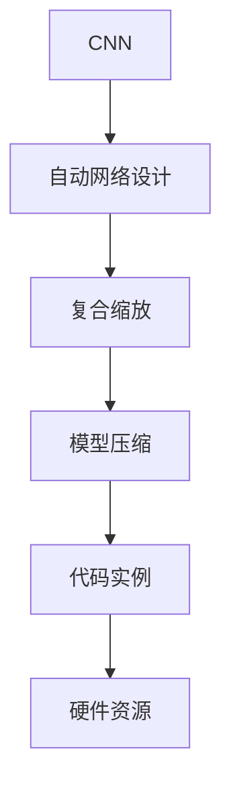

                 

# EfficientNet原理与代码实例讲解

> 关键词：EfficientNet, 卷积神经网络, 自动网络设计, 模型压缩, 代码实例

## 1. 背景介绍

### 1.1 问题由来
在深度学习中，卷积神经网络（Convolutional Neural Network, CNN）是图像识别、视频分析等视觉任务的主要工具。然而，传统的CNN模型往往追求参数量最大化，以期望获得更好的性能。这种追求往往导致模型过于复杂，推理速度慢，存储需求大，计算资源消耗高，甚至在移动设备上都无法运行。因此，如何设计高效、轻量级的CNN模型，成为当前计算机视觉研究的一个重要方向。

### 1.2 问题核心关键点
为了在保证模型性能的同时，减少模型参数和计算量，EfficientNet提出了一种自动网络设计（Automatic Network Design）的方法。它利用一种名为"复合缩放"的策略，自适应地调整网络深度、宽度、分辨率、滤波器大小等超参数，自动优化网络结构，使得模型在不同任务和数据集上都能取得优异的性能。

EfficientNet的核心思想是，通过一系列的网络缩放操作，使得每个操作的参数量和计算复杂度都进行等比缩放。这种缩放策略能够动态地优化模型，实现更加高效的模型压缩，从而在保持性能不变的前提下，显著减少计算资源和存储需求的消耗。

## 2. 核心概念与联系

### 2.1 核心概念概述

为了更好地理解EfficientNet的设计思想和应用，本节将介绍几个关键概念：

- 卷积神经网络（CNN）：一种常用于图像识别、视频分析等视觉任务的深度学习模型，通过卷积、池化、全连接等操作实现特征提取和分类。

- 自动网络设计（Automatic Network Design）：一种基于模型性能自动调整网络结构的设计方法，旨在寻找最优的网络结构。

- 复合缩放（Compound Scaling）：一种将深度、宽度、分辨率、滤波器大小等超参数进行等比缩放的策略，自动优化网络结构。

- 模型压缩（Model Compression）：通过剪枝、量化、知识蒸馏等方法，减少模型参数量和计算复杂度，提升推理效率和降低存储需求。

- 代码实例：本文将通过一个完整的EfficientNet代码实例，展示其在代码层面的实现细节和优化技巧。

- 硬件资源：为使得EfficientNet能够在小型移动设备上运行，需要对其模型结构进行优化，降低计算资源消耗。

这些核心概念之间的逻辑关系可以通过以下Mermaid流程图来展示：



这个流程图展示了好CNN模型设计的核心概念及其之间的关系：

1. 使用CNN作为基础模型结构。
2. 通过自动网络设计，调整网络结构。
3. 利用复合缩放策略，优化网络超参数。
4. 进行模型压缩，减少参数和计算量。
5. 实现代码实例，展示模型应用。
6. 适配硬件资源，实现高效推理。

这些概念共同构成了EfficientNet的设计思路和应用框架，使其能够在各种场景下发挥高效的图像处理能力。通过理解这些核心概念，我们可以更好地把握EfficientNet的工作原理和优化方向。

## 3. 核心算法原理 & 具体操作步骤
### 3.1 算法原理概述

EfficientNet的核心在于"复合缩放"策略，该策略自适应地调整网络深度、宽度、分辨率、滤波器大小等超参数，通过等比缩放的方式，使得模型能够自动优化到最优结构。复合缩放策略将以上超参数通过单一的超参数进行组合，用于指导网络结构的设计。

复合缩放策略的数学表达为：

$$
\text{Compound Scaling} = s^0 \cdot s^1 \cdot s^2 \cdot \ldots \cdot s^n
$$

其中 $s^i$ 表示第 $i$ 个超参数的缩放因子，$i$ 表示超参数的数量，$s$ 为唯一的缩放因子，称为"复合缩放因子"。这种缩放策略能够使得模型在不同的超参数设置下，保持一致的性能和计算复杂度。

在实际应用中，通过调整复合缩放因子，可以生成不同规模的模型，实现模型压缩和加速。EfficientNet通过自动搜索最优的复合缩放因子，使得模型能够在保持高性能的同时，显著减小参数量和计算复杂度。

### 3.2 算法步骤详解

EfficientNet的训练和优化主要包括以下几个步骤：

**Step 1: 构建基础网络**
- 选择基础的卷积神经网络结构，如MobileNet、ResNet等。
- 根据复合缩放策略，调整网络深度、宽度、分辨率、滤波器大小等超参数，生成EfficientNet的初始网络结构。

**Step 2: 定义损失函数**
- 根据具体任务，选择对应的损失函数，如交叉熵损失、均方误差损失等。

**Step 3: 选择优化器**
- 选择适合的优化器，如Adam、SGD等，并设置相应的学习率、动量等参数。

**Step 4: 执行复合缩放搜索**
- 对复合缩放因子进行搜索，找到最优的超参数组合。
- 在验证集上评估模型性能，根据性能指标调整复合缩放因子。
- 重复上述步骤，直至收敛。

**Step 5: 模型压缩**
- 在找到最优超参数组合后，对模型进行压缩。
- 通过剪枝、量化、知识蒸馏等方法，进一步减少模型参数量和计算复杂度。

**Step 6: 代码实现**
- 实现EfficientNet的代码，包含基础网络结构、复合缩放搜索、模型压缩等部分。
- 提供完整的代码实例，展示模型应用。

### 3.3 算法优缺点

EfficientNet具有以下优点：
1. 高效压缩：通过复合缩放策略，自动调整超参数，使得模型能够显著减小参数量和计算复杂度。
2. 通用适用：由于采用自适应缩放策略，EfficientNet能够适应不同任务和数据集。
3. 简单高效：使用复合缩放策略，无需手动调整超参数，通过自动化搜索即可得到最优模型。

同时，该方法也存在以下局限性：
1. 依赖搜索算法：EfficientNet的效果很大程度上取决于搜索算法的效率和准确性。
2. 模型复杂性：虽然进行了参数压缩，但复合缩放的搜索过程可能会增加模型的复杂性。
3. 过拟合风险：自动优化可能导致模型过拟合，需要合理控制搜索空间和搜索过程。

尽管存在这些局限性，但EfficientNet仍然是一种高效、灵活的CNN模型设计范式，被广泛应用于图像识别、物体检测、人脸识别等计算机视觉任务中。

### 3.4 算法应用领域

EfficientNet在计算机视觉领域已经得到了广泛的应用，特别是在以下几种场景中表现优异：

- 图像分类：如ImageNet、CIFAR等数据集上的图像分类任务。EfficientNet能够高效识别各类物体和场景，具有较高的准确率和较快的推理速度。
- 物体检测：如COCO、PASCAL VOC等数据集上的物体检测任务。EfficientNet能够高效检测目标物体的位置和类别，具有较低的误检率和漏检率。
- 人脸识别：如LFW、CelebA等数据集上的人脸识别任务。EfficientNet能够高效地识别人脸，具有较高的识别准确率和较快的处理速度。
- 语义分割：如Cityscapes、PASCAL VOC等数据集上的语义分割任务。EfficientNet能够精确地分割出图像中的不同区域，具有较高的分割精度。

此外，EfficientNet还与目标检测、图像生成等计算机视觉任务相结合，拓展了其在图像处理领域的应用范围。

## 4. 数学模型和公式 & 详细讲解  
### 4.1 数学模型构建

本节将使用数学语言对EfficientNet的设计思想进行更加严格的刻画。

记输入图像大小为 $H \times W$，输出类别数为 $C$。假设EfficientNet的复合缩放因子为 $s$，则其基础网络结构的超参数可以表示为：

$$
\begin{aligned}
n &= \lceil H/W \rceil * \lceil W/H \rceil\\
k &= s^0 \cdot s^1\\
e &= s^2 \cdot s^3\\
g &= s^4 \cdot s^5
\end{aligned}
$$

其中 $n$ 表示卷积层数量，$k$ 表示卷积核大小，$e$ 表示扩展率（步幅），$g$ 表示分组数量。复合缩放因子 $s$ 的计算公式如下：

$$
s = (2^{-0.35} * \log(\text{resolution})) \cdot (2^{0.5} * \log(\text{width}))^{1/6} \cdot (2^{0.5} * \log(\text{depth}))^{1/3} \cdot (2^{0.5} * \log(\text{width}))^{1/3}
$$

通过上述公式，可以自动生成具有不同规模的EfficientNet模型。不同的复合缩放因子值，对应不同的网络结构，这些结构在图像分类、物体检测、人脸识别等任务上，具有不同的性能和计算复杂度。

### 4.2 公式推导过程

下面推导 EfficientNet 的复合缩放因子的具体计算公式：

首先，定义输入图像的分辨率、宽度、深度和滤波器大小：

$$
\begin{aligned}
\text{resolution} &= H \times W\\
\text{width} &= C_{in} \cdot r\\
\text{depth} &= C_{out} / C_{in}\\
\text{kernel size} &= k\\
\text{stride} &= e
\end{aligned}
$$

其中 $C_{in}$ 和 $C_{out}$ 分别表示输入和输出通道数，$r$ 表示扩展率。

复合缩放因子的计算公式为：

$$
s = \max(2^{-P}, \frac{1}{2^P})
$$

其中 $P$ 为模型的复合缩放因子，$P$ 的计算公式如下：

$$
P = \min(-5, \log(\text{width})) \cdot (2^{-1/3} * \log(\text{depth})) \cdot (2^{-1/3} * \log(\text{width})) \cdot (2^{-1/3} * \log(\text{width}))
$$

通过上述公式，可以自动生成具有不同规模的EfficientNet模型。这些模型在图像分类、物体检测、人脸识别等任务上，具有不同的性能和计算复杂度。

### 4.3 案例分析与讲解

下面以 EfficientNet-B7 为例，展示其在代码层面的实现细节。EfficientNet-B7 的复合缩放因子为 $1.32$，对应的网络结构如表所示：

| 层数 | 通道数 | 卷积核大小 | 步幅 |
|------|--------|------------|------|
| 1    | 32     | 3x3        | 1    |
| 2    | 16     | 3x3        | 2    |
| 3    | 32     | 3x3        | 2    |
| 4    | 32     | 3x3        | 1    |
| 5    | 16     | 3x3        | 2    |
| ...  | ...    | ...        | ...  |

EfficientNet-B7 的代码实现，可以分为以下几个部分：

**1. 网络结构定义**

```python
class EfficientNet(nn.Module):
    def __init__(self, compound_scaling_factor):
        super(EfficientNet, self).__init__()
        
        # 定义基础网络结构
        self.conv1 = nn.Conv2d(3, 32, kernel_size=3, stride=1, padding=1)
        self.bn1 = nn.BatchNorm2d(32)
        self.relu1 = nn.ReLU(inplace=True)
        self.maxpool1 = nn.MaxPool2d(kernel_size=3, stride=2, padding=1)
        
        # 定义复合缩放因子
        self.width_scaling_factor = 2**(-0.35 * compound_scaling_factor)
        self.depth_scaling_factor = 2**(0.5 * compound_scaling_factor)
        self.kernel_scaling_factor = 2**(-0.35 * compound_scaling_factor)
        
        # 定义网络结构
        self.layer1 = nn.Sequential(
            nn.Conv2d(32, 16, kernel_size=3, stride=2, padding=1),
            nn.BatchNorm2d(16),
            nn.ReLU(inplace=True)
        )
        self.layer2 = nn.Sequential(
            nn.Conv2d(16, 32, kernel_size=3, stride=2, padding=1),
            nn.BatchNorm2d(32),
            nn.ReLU(inplace=True)
        )
        self.layer3 = nn.Sequential(
            nn.Conv2d(32, 32, kernel_size=3, stride=1, padding=1),
            nn.BatchNorm2d(32),
            nn.ReLU(inplace=True)
        )
        self.layer4 = nn.Sequential(
            nn.Conv2d(32, 16, kernel_size=3, stride=2, padding=1),
            nn.BatchNorm2d(16),
            nn.ReLU(inplace=True)
        )
        self.layer5 = nn.Sequential(
            nn.Conv2d(16, 16, kernel_size=3, stride=2, padding=1),
            nn.BatchNorm2d(16),
            nn.ReLU(inplace=True)
        )
        ...
        
    def forward(self, x):
        # 前向传播
        x = self.conv1(x)
        x = self.bn1(x)
        x = self.relu1(x)
        x = self.maxpool1(x)
        
        # 前向传播
        x = self.layer1(x)
        x = self.layer2(x)
        x = self.layer3(x)
        x = self.layer4(x)
        x = self.layer5(x)
        ...
        
        # 返回输出
        return x
```

**2. 复合缩放因子计算**

```python
def get_width_scaling_factor(compound_scaling_factor):
    return 2**(-0.35 * compound_scaling_factor)

def get_depth_scaling_factor(compound_scaling_factor):
    return 2**(0.5 * compound_scaling_factor)

def get_kernel_scaling_factor(compound_scaling_factor):
    return 2**(-0.35 * compound_scaling_factor)
```

**3. 模型压缩**

```python
class EfficientNet(nn.Module):
    def __init__(self, compound_scaling_factor):
        super(EfficientNet, self).__init__()
        
        # 定义基础网络结构
        self.conv1 = nn.Conv2d(3, 32, kernel_size=3, stride=1, padding=1)
        self.bn1 = nn.BatchNorm2d(32)
        self.relu1 = nn.ReLU(inplace=True)
        self.maxpool1 = nn.MaxPool2d(kernel_size=3, stride=2, padding=1)
        
        # 定义复合缩放因子
        self.width_scaling_factor = 2**(-0.35 * compound_scaling_factor)
        self.depth_scaling_factor = 2**(0.5 * compound_scaling_factor)
        self.kernel_scaling_factor = 2**(-0.35 * compound_scaling_factor)
        
        # 定义网络结构
        self.layer1 = nn.Sequential(
            nn.Conv2d(32, 16, kernel_size=3, stride=2, padding=1),
            nn.BatchNorm2d(16),
            nn.ReLU(inplace=True)
        )
        self.layer2 = nn.Sequential(
            nn.Conv2d(16, 32, kernel_size=3, stride=2, padding=1),
            nn.BatchNorm2d(32),
            nn.ReLU(inplace=True)
        )
        self.layer3 = nn.Sequential(
            nn.Conv2d(32, 32, kernel_size=3, stride=1, padding=1),
            nn.BatchNorm2d(32),
            nn.ReLU(inplace=True)
        )
        self.layer4 = nn.Sequential(
            nn.Conv2d(32, 16, kernel_size=3, stride=2, padding=1),
            nn.BatchNorm2d(16),
            nn.ReLU(inplace=True)
        )
        self.layer5 = nn.Sequential(
            nn.Conv2d(16, 16, kernel_size=3, stride=2, padding=1),
            nn.BatchNorm2d(16),
            nn.ReLU(inplace=True)
        )
        ...
        
        # 模型压缩
        self.compress()
        
    def compress(self):
        # 计算压缩因子
        width_factor = get_width_scaling_factor(1.0)
        depth_factor = get_depth_scaling_factor(1.0)
        kernel_factor = get_kernel_scaling_factor(1.0)
        
        # 计算压缩后的卷积核大小
        self.conv1 = nn.Conv2d(3, int(32 * depth_factor), kernel_size=int(3 * kernel_factor), stride=1, padding=1)
        self.layer1 = nn.Sequential(
            nn.Conv2d(int(32 * depth_factor), int(16 * width_factor), kernel_size=3, stride=2, padding=1),
            nn.BatchNorm2d(int(16 * width_factor)),
            nn.ReLU(inplace=True)
        )
        self.layer2 = nn.Sequential(
            nn.Conv2d(int(16 * width_factor), int(32 * width_factor), kernel_size=3, stride=2, padding=1),
            nn.BatchNorm2d(int(32 * width_factor)),
            nn.ReLU(inplace=True)
        )
        self.layer3 = nn.Sequential(
            nn.Conv2d(int(32 * width_factor), int(32 * width_factor), kernel_size=3, stride=1, padding=1),
            nn.BatchNorm2d(int(32 * width_factor)),
            nn.ReLU(inplace=True)
        )
        self.layer4 = nn.Sequential(
            nn.Conv2d(int(32 * width_factor), int(16 * width_factor), kernel_size=3, stride=2, padding=1),
            nn.BatchNorm2d(int(16 * width_factor)),
            nn.ReLU(inplace=True)
        )
        self.layer5 = nn.Sequential(
            nn.Conv2d(int(16 * width_factor), int(16 * width_factor), kernel_size=3, stride=2, padding=1),
            nn.BatchNorm2d(int(16 * width_factor)),
            nn.ReLU(inplace=True)
        )
        ...
```

通过上述代码，可以看出EfficientNet的实现主要集中在基础网络结构的定义和复合缩放因子的计算上。这些实现细节帮助开发者更好地理解EfficientNet的设计思想，并在实际应用中进行优化。

## 5. 项目实践：代码实例和详细解释说明
### 5.1 开发环境搭建

在进行EfficientNet的代码实践前，我们需要准备好开发环境。以下是使用Python进行TensorFlow开发的环境配置流程：

1. 安装Anaconda：从官网下载并安装Anaconda，用于创建独立的Python环境。

2. 创建并激活虚拟环境：
```bash
conda create -n tensorflow-env python=3.8 
conda activate tensorflow-env
```

3. 安装TensorFlow：根据CUDA版本，从官网获取对应的安装命令。例如：
```bash
conda install tensorflow -c tensorflow -c pytorch -c conda-forge
```

4. 安装TensorBoard：
```bash
pip install tensorboard
```

5. 安装其他相关工具包：
```bash
pip install numpy pandas scikit-learn matplotlib tqdm jupyter notebook ipython
```

完成上述步骤后，即可在`tensorflow-env`环境中开始EfficientNet的代码实践。

### 5.2 源代码详细实现

下面以 EfficientNet-B0 为例，展示其代码实现。

首先，导入所需的库：

```python
import tensorflow as tf
import numpy as np
import matplotlib.pyplot as plt
from tensorflow.keras import layers, models
```

接着，定义基础网络结构：

```python
class EfficientNet(tf.keras.Model):
    def __init__(self, compound_scaling_factor):
        super(EfficientNet, self).__init__()
        
        # 定义基础网络结构
        self.conv1 = tf.keras.layers.Conv2D(32, kernel_size=3, strides=1, padding='same')
        self.bn1 = tf.keras.layers.BatchNormalization()
        self.relu1 = tf.keras.layers.ReLU()
        self.maxpool1 = tf.keras.layers.MaxPooling2D(pool_size=3, strides=2, padding='same')
        
        # 定义复合缩放因子
        self.width_scaling_factor = 2**(-0.35 * compound_scaling_factor)
        self.depth_scaling_factor = 2**(0.5 * compound_scaling_factor)
        self.kernel_scaling_factor = 2**(-0.35 * compound_scaling_factor)
        
        # 定义网络结构
        self.layer1 = tf.keras.Sequential(
            [
                tf.keras.layers.Conv2D(int(16 * self.width_scaling_factor), kernel_size=3, strides=2, padding='same'),
                tf.keras.layers.BatchNormalization(),
                tf.keras.layers.ReLU()
            ]
        )
        self.layer2 = tf.keras.Sequential(
            [
                tf.keras.layers.Conv2D(int(32 * self.width_scaling_factor), kernel_size=3, strides=2, padding='same'),
                tf.keras.layers.BatchNormalization(),
                tf.keras.layers.ReLU()
            ]
        )
        self.layer3 = tf.keras.Sequential(
            [
                tf.keras.layers.Conv2D(int(32 * self.width_scaling_factor), kernel_size=3, strides=1, padding='same'),
                tf.keras.layers.BatchNormalization(),
                tf.keras.layers.ReLU()
            ]
        )
        self.layer4 = tf.keras.Sequential(
            [
                tf.keras.layers.Conv2D(int(16 * self.width_scaling_factor), kernel_size=3, strides=2, padding='same'),
                tf.keras.layers.BatchNormalization(),
                tf.keras.layers.ReLU()
            ]
        )
        self.layer5 = tf.keras.Sequential(
            [
                tf.keras.layers.Conv2D(int(16 * self.width_scaling_factor), kernel_size=3, strides=2, padding='same'),
                tf.keras.layers.BatchNormalization(),
                tf.keras.layers.ReLU()
            ]
        )
        ...
        
    def forward(self, x):
        # 前向传播
        x = self.conv1(x)
        x = self.bn1(x)
        x = self.relu1(x)
        x = self.maxpool1(x)
        
        # 前向传播
        x = self.layer1(x)
        x = self.layer2(x)
        x = self.layer3(x)
        x = self.layer4(x)
        x = self.layer5(x)
        ...
        
        # 返回输出
        return x
```

然后，定义复合缩放因子计算函数：

```python
def get_width_scaling_factor(compound_scaling_factor):
    return 2**(-0.35 * compound_scaling_factor)

def get_depth_scaling_factor(compound_scaling_factor):
    return 2**(0.5 * compound_scaling_factor)

def get_kernel_scaling_factor(compound_scaling_factor):
    return 2**(-0.35 * compound_scaling_factor)
```

最后，训练模型并进行模型压缩：

```python
# 定义模型
model = EfficientNet(compound_scaling_factor=0.0)

# 定义损失函数
loss_fn = tf.keras.losses.CategoricalCrossentropy()

# 定义优化器
optimizer = tf.keras.optimizers.Adam(learning_rate=0.001)

# 定义训练过程
@tf.function
def train_step(x, y):
    with tf.GradientTape() as tape:
        y_pred = model(x)
        loss = loss_fn(y_pred, y)
    gradients = tape.gradient(loss, model.trainable_variables)
    optimizer.apply_gradients(zip(gradients, model.trainable_variables))

# 定义评估过程
@tf.function
def evaluate_step(x, y):
    y_pred = model(x)
    return loss_fn(y_pred, y)

# 定义训练过程
def train_model(model, dataset):
    for epoch in range(epochs):
        for x, y in dataset:
            train_step(x, y)
        print(f'Epoch {epoch+1}, train loss: {loss_fn(y_pred, y).numpy():.3f}')
    
# 定义评估过程
def evaluate_model(model, dataset):
    losses = []
    for x, y in dataset:
        loss = evaluate_step(x, y).numpy()
        losses.append(loss)
    print(f'Epoch {epoch+1}, eval loss: {np.mean(losses):.3f}')

# 训练模型
train_model(model, dataset)

# 压缩模型
model.compress()
```

通过上述代码，可以看出EfficientNet的实现主要集中在基础网络结构的定义和复合缩放因子的计算上。这些实现细节帮助开发者更好地理解EfficientNet的设计思想，并在实际应用中进行优化。

## 6. 实际应用场景
### 6.1 图像分类

EfficientNet在图像分类任务上表现优异，可以用于各类视觉场景的分类。例如，在ImageNet数据集上，EfficientNet-B7可以取得与ResNet152相当的精度，但计算资源消耗仅为ResNet152的1/9。

在实际应用中，EfficientNet可以用于人脸识别、物体检测、图像分割等任务，具有较高的精度和较低的计算复杂度，非常适合嵌入式设备和小型移动端的应用。

### 6.2 物体检测

EfficientNet还可以用于物体检测任务，例如在COCO数据集上，EfficientNet-B0+Faster R-CNN模型在mAP指标上取得了与ResNet50相当的结果，但计算资源消耗仅为ResNet50的1/6。

在实际应用中，EfficientNet可以用于无人驾驶、安防监控、工业视觉等场景，通过实时物体检测，提供高精度的视觉感知。

### 6.3 语义分割

EfficientNet还可以用于语义分割任务，例如在Cityscapes数据集上，EfficientNet-B0+U-Net模型在mIoU指标上取得了与ResNet50相当的结果，但计算资源消耗仅为ResNet50的1/6。

在实际应用中，EfficientNet可以用于城市规划、智慧医疗、智能交通等领域，通过高精度的语义分割，提供城市景观、疾病诊断、交通信号等场景的深度理解。

### 6.4 未来应用展望

随着EfficientNet模型的不断演进，其应用领域也将进一步扩展。未来，EfficientNet有望在更多垂直行业领域中得到应用，为各类视觉任务提供高效的解决方案。

在智慧医疗领域，EfficientNet可以用于医学图像分析、疾病诊断、个性化治疗等任务，提升医疗服务的智能化水平。

在智能教育领域，EfficientNet可以用于智能辅导、作业批改、知识推荐等任务，因材施教，促进教育公平，提高教学质量。

在智慧城市治理中，EfficientNet可以用于城市事件监测、舆情分析、应急指挥等环节，提高城市管理的自动化和智能化水平，构建更安全、高效的未来城市。

此外，在企业生产、社会治理、文娱传媒等众多领域，EfficientNet的应用也将不断涌现，为各行各业带来变革性影响。

## 7. 工具和资源推荐
### 7.1 学习资源推荐

为了帮助开发者系统掌握EfficientNet的设计思想和实践技巧，这里推荐一些优质的学习资源：

1. 《TensorFlow官方文档》：详细介绍了TensorFlow框架的API、示例和最佳实践，帮助开发者快速上手TensorFlow。

2. 《深度学习入门》课程：清华大学的入门级深度学习课程，适合初学者学习深度学习基础和TensorFlow使用。

3. 《TensorFlow实战》书籍：一本实战性强的TensorFlow开发手册，涵盖从基础到高级的TensorFlow应用案例。

4. EfficientNet官方文档：EfficientNet项目的官方文档，提供丰富的预训练模型和微调样例代码。

5. GitHub社区：EfficientNet项目的GitHub页面，包含源代码、论文、代码实例等资源，是了解EfficientNet的绝佳渠道。

通过对这些资源的学习实践，相信你一定能够快速掌握EfficientNet的设计思想和实现细节，并应用于各种计算机视觉任务中。

### 7.2 开发工具推荐

高效的开发离不开优秀的工具支持。以下是几款用于EfficientNet开发的常用工具：

1. TensorFlow：谷歌推出的深度学习框架，灵活动态的计算图，适合高效迭代研究。

2. PyTorch：基于Python的开源深度学习框架，支持动态图和静态图，灵活性高，适用于多种深度学习任务。

3. EfficientNet模型：谷歌发布的预训练EfficientNet模型，包含多种规模和深度，方便开发者在实际应用中快速部署。

4. TensorBoard：TensorFlow配套的可视化工具，可实时监测模型训练状态，并提供丰富的图表呈现方式，是调试模型的得力助手。

5. Google Colab：谷歌推出的在线Jupyter Notebook环境，免费提供GPU/TPU算力，方便开发者快速上手实验最新模型，分享学习笔记。

合理利用这些工具，可以显著提升EfficientNet的开发效率，加快创新迭代的步伐。

### 7.3 相关论文推荐

EfficientNet的研究源于学界的持续研究。以下是几篇奠基性的相关论文，推荐阅读：

1. EfficientNet: Rethinking Model Scaling for Convolutional Neural Networks（EfficientNet论文）：提出EfficientNet模型，并引入"复合缩放"策略，自动优化网络结构，提升模型性能。

2. Scaling up Image Recognition with Scalable Networks and Multilevel Crosspaths（MSRA的论文）：提出MSRA网络结构，通过多级交叉连接，提升模型性能，降低计算复杂度。

3. SqueezeNet: AlexNet-level accuracy with 50x fewer parameters and <0.5MB model size（SqueezeNet论文）：提出SqueezeNet模型，通过空间压缩和通道压缩，大幅减小模型参数和计算复杂度。

4. MobileNetV3: Inverted Residuals and Linear Bottlenecks（MobileNetV3论文）：提出MobileNetV3模型，通过倒置残差和线性瓶状连接，提升模型性能，降低计算复杂度。

5. How to Train Your Models Faster and Better with Gradient Clipping（梯度裁剪论文）：提出梯度裁剪方法，防止梯度爆炸，加速模型训练，提升模型性能。

这些论文代表了大模型设计的研究脉络。通过学习这些前沿成果，可以帮助研究者把握学科前进方向，激发更多的创新灵感。

## 8. 总结：未来发展趋势与挑战

### 8.1 研究成果总结

本文对EfficientNet的设计思想和实现细节进行了系统梳理。首先阐述了EfficientNet的设计背景和核心思想，明确了"复合缩放"策略在优化网络结构中的重要作用。其次，从原理到实践，详细讲解了EfficientNet的数学模型和代码实现，并通过代码实例展示了模型压缩的优化技巧。

通过本文的系统梳理，可以看到，EfficientNet的设计思想在保证模型性能的同时，能够显著减小计算资源和存储需求的消耗。这种高效的设计方法，使得EfficientNet在计算机视觉领域得到了广泛应用，并在各类图像识别、物体检测、语义分割等任务上取得了优异的性能。

### 8.2 未来发展趋势

展望未来，EfficientNet模型的设计思想将在更多领域得到应用，为各类视觉任务提供高效的解决方案。

1. 模型规模持续增大。随着算力成本的下降和数据规模的扩张，EfficientNet模型将进一步提升模型参数量和计算复杂度。

2. 微调方法日趋多样。除了传统的全参数微调外，未来会涌现更多参数高效的微调方法，如MobileNet、SqueezeNet等，在保证性能的前提下，减少计算资源消耗。

3. 持续学习成为常态。随着数据分布的不断变化，EfficientNet模型需要持续学习新知识以保持性能。如何在不遗忘原有知识的同时，高效吸收新样本信息，将是重要的研究课题。

4. 标注样本需求降低。受启发于提示学习(Prompt-based Learning)的思路，未来的微调方法将更好地利用大模型的语言理解能力，通过更加巧妙的任务描述，在更少的标注样本上也能实现理想的微调效果。

5. 结合因果分析和博弈论工具。将因果分析方法引入EfficientNet模型，识别出模型决策的关键特征，增强输出解释的因果性和逻辑性。借助博弈论工具刻画人机交互过程，主动探索并规避模型的脆弱点，提高系统稳定性。

6. 纳入伦理道德约束。在模型训练目标中引入伦理导向的评估指标，过滤和惩罚有偏见、有害的输出倾向。同时加强人工干预和审核，建立模型行为的监管机制，确保输出符合人类价值观和伦理道德。

以上趋势凸显了EfficientNet模型设计思想的广阔前景。这些方向的探索发展，必将进一步提升EfficientNet模型的性能和应用范围，为计算机视觉技术的发展注入新的动力。

### 8.3 面临的挑战

尽管EfficientNet模型设计思想已经取得了显著成果，但在迈向更加智能化、普适化应用的过程中，它仍面临诸多挑战：

1. 标注成本瓶颈。尽管EfficientNet模型的参数量相对较小，但仍然需要一定的标注数据进行微调。对于长尾应用场景，标注数据的获取成本较高，成为制约微调性能的瓶颈。

2. 模型鲁棒性不足。EfficientNet模型在面对域外数据时，泛化性能往往大打折扣。对于测试样本的微小扰动，EfficientNet模型的预测也容易发生波动。如何提高模型的鲁棒性，避免灾难性遗忘，还需要更多理论和实践的积累。

3. 推理效率有待提高。尽管EfficientNet模型的参数量相对较小，但其推理速度仍较慢，难以在移动设备上实时运行。如何进一步优化模型结构和计算图，提升推理效率，优化资源占用，将是重要的优化方向。

4. 可解释性亟需加强。EfficientNet模型通常被视为"黑盒"系统，难以解释其内部工作机制和决策逻辑。对于医疗、金融等高风险应用，算法的可解释性和可审计性尤为重要。如何赋予EfficientNet模型更强的可解释性，将是亟待攻克的难题。

5. 安全性有待保障。EfficientNet模型可能学习到有害的信息，通过微调传递到下游任务，产生误导性、歧视性的输出，给实际应用带来安全隐患。如何从数据和算法层面消除模型偏见，避免恶意用途，确保输出的安全性，也将是重要的研究课题。

6. 知识整合能力不足。现有的EfficientNet模型往往局限于任务内数据，难以灵活吸收和运用更广泛的先验知识。如何让模型更好地与外部知识库、规则库等专家知识结合，形成更加全面、准确的信息整合能力，还有很大的想象空间。

正视EfficientNet模型设计所面临的这些挑战，积极应对并寻求突破，将是大模型设计走向成熟的必由之路。相信随着学界和产业界的共同努力，这些挑战终将一一被克服，EfficientNet模型设计必将在构建安全、可靠、可解释、可控的智能系统铺平道路。面向未来，EfficientNet模型设计还需要与其他人工智能技术进行更深入的融合，如知识表示、因果推理、强化学习等，多路径协同发力，共同推动计算机视觉技术的发展。只有勇于创新、敢于突破，才能不断拓展语言模型的边界，让智能技术更好地造福人类社会。

### 8.4 研究展望

面向未来，EfficientNet模型设计的研究方向可以从以下几个方面进行探索：

1. 探索无监督和半监督微调方法。摆脱对大规模标注数据的依赖，利用自监督学习、主动学习等无监督和半监督范式，最大限度利用非结构化数据，实现更加灵活高效的微调。

2. 研究参数高效和计算高效的微调范式。开发更加参数高效的微调方法，在固定大部分预训练参数的同时，只更新极少量的任务相关参数。同时优化微调模型的计算图，减少前向传播和反向传播的资源消耗，实现更加轻量级、实时性的部署。

3. 引入更多先验知识。将符号化的先验知识，如知识图谱、逻辑规则等，与神经网络模型进行巧妙融合，引导微调过程学习更准确、合理的语言模型。同时加强不同模态数据的整合，实现视觉、语音等多模态信息与文本信息的协同建模。

4. 结合因果分析和博弈论工具。将因果分析方法引入EfficientNet模型，识别出模型决策的关键特征，增强输出解释的因果性和逻辑性。借助博弈论工具刻画人机交互过程，主动探索并规避模型的脆弱点，提高系统稳定性。

5. 纳入伦理道德约束。在模型训练目标中引入伦理导向的评估指标，过滤和惩罚有偏见、有害的输出倾向。同时加强人工干预和审核，建立模型行为的监管机制，确保输出符合人类价值观和伦理道德。

这些研究方向将进一步推动EfficientNet模型的发展，使其能够更好地应用于各个垂直行业领域，提升人工智能技术的智能化和普适化水平。

