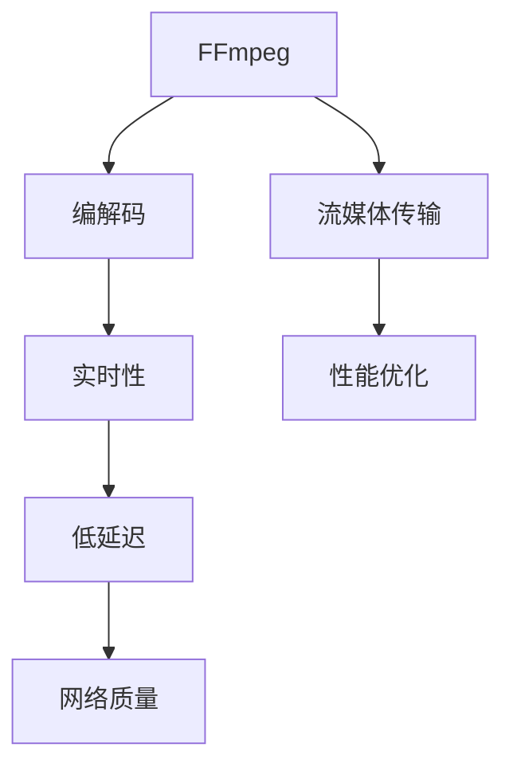

                 

# FFmpeg 在 VR 中的应用：编码和流媒体传输

> 关键词：FFmpeg, VR, 编码, 流媒体传输, 实时性, 性能优化, 视频编解码, 音频编解码, 网络传输, 低延迟

## 1. 背景介绍

随着虚拟现实 (Virtual Reality, VR) 技术的快速发展，全球范围内的VR用户数量和市场规模持续增长。VR 带来的沉浸式体验，已经广泛应用于娱乐、教育、医疗等多个领域。VR 场景中的多媒体数据量庞大且对实时性和性能要求极高，因此需要高效的视频编解码和流媒体传输解决方案。本文将介绍 FFmpeg 在 VR 中的应用，重点讨论其视频编解码和流媒体传输的实现原理与优化策略。

## 2. 核心概念与联系

### 2.1 核心概念概述

本文将介绍几个与 VR 应用密切相关的核心概念：

- **FFmpeg**：FFmpeg 是一个开源的跨平台多媒体框架，支持包括编解码、流传输、音视频合成等在内的多种功能，广泛应用于视频编解码和流媒体传输。
- **VR**：虚拟现实技术，通过计算机生成逼真的三维环境，让用户沉浸在虚拟世界中，实现高度交互。
- **编解码**：将原始数据转化为适合网络传输的格式，同时将接收到的数据解码还原为原始数据。
- **流媒体传输**：实时地将音视频数据从源端传输到客户端，并保持稳定的播放效果。

这些核心概念之间相互关联，共同构成了 VR 应用中的音视频处理框架。以下是 Mermaid 流程图，展示 FFmpeg 在 VR 场景中的应用关系：



该图展示了 FFmpeg 如何在 VR 场景中发挥作用：
1. **编解码**：FFmpeg 提供多种编解码器，如 x264、x265、libvpx 等，适用于不同格式和分辨率的视频编码，保证数据在网络传输过程中的低延迟和高质量。
2. **流媒体传输**：FFmpeg 支持多种流传输协议，如 RTP、RTSP 等，能够实现实时音视频数据的稳定传输。
3. **实时性和性能优化**：FFmpeg 内置的编解码器和流传输协议，能保证在各种网络环境下实现低延迟和高质量的音视频传输。
4. **网络质量**：VR 场景中的网络环境复杂，可能存在延迟、丢包等问题，FFmpeg 能够通过自适应编码、丢包重传等技术，确保流媒体的稳定传输。

### 2.2 核心概念原理和架构的 Mermaid 流程图

以下是 Mermaid 流程图，展示 FFmpeg 在 VR 场景中的编解码和流媒体传输过程：

```mermaid
graph LR
    A[视频源] --> B[编解码器 (x264/x265)]
    B --> C[编码输出]
    C --> D[流媒体传输 (RTP/RTSP)]
    D --> E[客户端接收]
    E --> F[解码输出]
    F --> G[显示终端]
    G --> H[音频输出]
    H --> I[音频解码器 (AAC/MP3)]
    I --> J[播放]
    J --> K[用户交互]
```

该图展示了从视频源到用户交互的完整流程：
1. 视频源（如摄像头、录制文件等）通过编解码器转化为网络传输格式。
2. 编解码器输出的流数据通过网络传输协议（如 RTP、RTSP）传输到客户端。
3. 客户端接收到的流数据通过解码器还原为原始视频。
4. 还原的视频和音频数据输出到显示终端和音频设备，用户进行交互。

## 3. 核心算法原理 & 具体操作步骤

### 3.1 算法原理概述

FFmpeg 的核心算法主要集中在编解码和流媒体传输两个方面。编解码算法采用预测编码、熵编码等技术，实现视频和音频的高效压缩；流媒体传输算法则通过分包传输、自适应编码等技术，保证音视频数据在网络环境中的稳定传输。

**视频编解码算法**：
1. **预测编码**：利用相邻帧之间的相似性，采用帧内预测、帧间预测等技术，减少数据冗余，提高压缩效率。
2. **熵编码**：利用哈夫曼编码、算术编码等技术，将预测残差编码为二进制流，进一步减少数据量。
3. **率失真优化**：通过调整量化参数，平衡压缩效率和图像质量，实现最佳的编解码效果。

**流媒体传输算法**：
1. **分包传输**：将音视频数据分割为固定大小的包，便于网络传输。
2. **自适应编码**：根据网络环境动态调整编码参数，保证流媒体的实时性和质量。
3. **丢包重传**：在网络环境较差时，对丢失的包进行重传，确保数据的完整性。

### 3.2 算法步骤详解

以下是具体的操作流程：

**编解码流程**：
1. **输入处理**：接收视频源（如摄像头、录制文件等）。
2. **编解码器选择**：根据格式和分辨率，选择适合的编解码器。
3. **视频编码**：利用预测编码和熵编码技术，将原始视频转化为网络传输格式。
4. **音频编码**：采用 AAC、MP3 等音频编解码器，将原始音频转化为网络传输格式。
5. **输出处理**：将编码后的视频和音频数据输出到网络。

**流媒体传输流程**：
1. **输入处理**：接收来自编解码器的流数据。
2. **网络传输协议选择**：选择适合的传输协议（如 RTP、RTSP）。
3. **数据分包**：将流数据分割为固定大小的包，便于网络传输。
4. **自适应编码**：根据网络环境动态调整编码参数，确保实时性和质量。
5. **丢包重传**：在网络环境较差时，对丢失的包进行重传，确保数据的完整性。
6. **输出处理**：将处理后的数据输出到客户端。

### 3.3 算法优缺点

FFmpeg 的编解码和流媒体传输算法具有以下优点：
1. **高效压缩**：通过预测编码和熵编码技术，实现高效的视频和音频压缩。
2. **灵活编码**：支持多种编解码器，适应不同格式和分辨率的需求。
3. **实时传输**：通过分包传输、自适应编码和丢包重传技术，保证实时性和质量。
4. **稳定性能**：在复杂的网络环境中，通过自适应编码和丢包重传，确保数据传输的稳定性。

同时，FFmpeg 也存在一些局限性：
1. **算法复杂度高**：预测编码和熵编码等技术，虽然能实现高效压缩，但算法复杂度较高。
2. **资源占用大**：编解码和流媒体传输过程中，需要占用大量的计算和内存资源。
3. **配置复杂**：需要配置多个参数以优化编解码和传输效果，且配置不当可能导致性能下降。
4. **兼容性问题**：不同编解码器和传输协议之间的兼容性问题，需要谨慎处理。

### 3.4 算法应用领域

FFmpeg 的编解码和流媒体传输算法广泛应用于虚拟现实 (VR) 场景中，具体应用领域包括：

- **虚拟现实游戏**：在游戏场景中，FFmpeg 用于编码和传输玩家和环境的视频和音频数据，实现高质量的沉浸式体验。
- **VR 视频会议**：在视频会议中，FFmpeg 用于编解码和传输参与者的视频和音频数据，实现低延迟和高清晰度的视频通信。
- **VR 教育**：在教育场景中，FFmpeg 用于编解码和传输虚拟现实内容，提供互动式的学习体验。
- **VR 培训**：在培训场景中，FFmpeg 用于编解码和传输虚拟现实教学内容，提升培训效果。
- **VR 医疗**：在医疗场景中，FFmpeg 用于编解码和传输虚拟现实手术和康复数据，辅助医生进行治疗和康复。

## 4. 数学模型和公式 & 详细讲解 & 举例说明

### 4.1 数学模型构建

本节将介绍视频编解码和流媒体传输的数学模型。

**视频编解码模型**：
1. **预测编码模型**：利用相邻帧之间的相似性，采用帧内预测、帧间预测等技术，减少数据冗余。
2. **熵编码模型**：采用哈夫曼编码、算术编码等技术，将预测残差编码为二进制流。

**流媒体传输模型**：
1. **分包传输模型**：将流数据分割为固定大小的包，便于网络传输。
2. **自适应编码模型**：根据网络环境动态调整编码参数，保证实时性和质量。
3. **丢包重传模型**：在网络环境较差时，对丢失的包进行重传，确保数据的完整性。

### 4.2 公式推导过程

**预测编码公式**：
设 $f_k$ 为第 $k$ 帧的像素值，$f_{k-1}$ 为前一帧的像素值，采用帧间预测技术，预测第 $k$ 帧的像素值 $f_k'$，则有：
$$
f_k' = f_{k-1} + \Delta f_k
$$
其中 $\Delta f_k$ 为预测误差。

**熵编码公式**：
设 $S$ 为预测误差 $\Delta f_k$ 的二进制表示，采用哈夫曼编码，则有：
$$
S = \sum_{i=0}^{n-1} c_i \times 2^{-i}
$$
其中 $c_i$ 为第 $i$ 个哈夫曼码的权重。

**分包传输公式**：
设 $B$ 为数据包的大小，$T$ 为网络传输速率，则每个数据包传输所需的时间为：
$$
t = \frac{B}{T}
$$

**自适应编码公式**：
设 $R$ 为网络带宽，$C$ 为编码率，则根据网络环境动态调整编码率 $C'$，保证实时性和质量：
$$
C' = \frac{R}{T + t}
$$

**丢包重传公式**：
设 $L$ 为丢包率，$P$ 为重传率，则根据网络环境动态调整重传率 $P'$，确保数据的完整性：
$$
P' = \frac{L}{1 - L}
$$

### 4.3 案例分析与讲解

以下以虚拟现实游戏为例，具体分析 FFmpeg 的编解码和流媒体传输过程。

**视频编解码过程**：
1. **输入处理**：接收摄像头拍摄的游戏画面。
2. **编解码器选择**：选择适合的编解码器，如 x264/x265。
3. **预测编码**：利用帧间预测技术，减少视频数据的冗余。
4. **熵编码**：将预测误差编码为二进制流，进一步减少数据量。
5. **输出处理**：将编码后的视频数据输出到网络。

**流媒体传输过程**：
1. **输入处理**：接收来自编解码器的流数据。
2. **网络传输协议选择**：选择 RTP 协议，实现实时音视频传输。
3. **数据分包**：将流数据分割为固定大小的包，便于网络传输。
4. **自适应编码**：根据网络环境动态调整编码参数，确保实时性和质量。
5. **丢包重传**：在网络环境较差时，对丢失的包进行重传，确保数据的完整性。
6. **输出处理**：将处理后的数据输出到客户端。

## 5. 项目实践：代码实例和详细解释说明

### 5.1 开发环境搭建

要在 VR 场景中使用 FFmpeg，首先需要搭建开发环境。以下是具体的步骤：

1. **安装 FFmpeg**：
   - 在 Linux 系统中，可以使用以下命令安装 FFmpeg：
     ```bash
     sudo apt-get install ffmpeg
     ```
   - 在 Windows 系统中，可以从官网下载最新版本的 FFmpeg 并完成安装。

2. **配置环境变量**：
   - 在终端中设置 FFmpeg 的路径，使其在开发过程中自动搜索和调用。
   ```bash
   export PATH=$PATH:/usr/local/bin
   ```

3. **安装相关依赖库**：
   - 安装依赖库，如 libavcodec、libavformat 等，以确保 FFmpeg 正常运行。
   ```bash
   sudo apt-get install libavcodec-dev libavformat-dev libswresample-dev libswscale-dev libva-dev libvorbis-dev libvpx-dev libx264-dev
   ```

### 5.2 源代码详细实现

以下是使用 FFmpeg 对 VR 视频进行编解码和流媒体传输的 Python 代码实现：

```python
import ffmpeg
from multiprocessing import Process

# 定义视频编解码函数
def encode_video(input_path, output_path, codec='x264'):
    ffmpeg.input(input_path, codec=codec, pixel_format='yuv420p')
    ffmpeg.output(output_path, codec=codec, pixel_format='yuv420p')
    ffmpeg.run()

# 定义流媒体传输函数
def stream_video(input_path, output_path):
    ffmpeg.input(input_path)
    ffmpeg.output(output_path, protocol='rtp')
    ffmpeg.run()

# 使用多进程加速编解码和传输
if __name__ == '__main__':
    input_path = '/path/to/video.mp4'
    output_path = '/path/to/output.mp4'

    # 使用 x264 编解码器进行视频编解码
    encode_process = Process(target=encode_video, args=(input_path, output_path, 'x264'))
    encode_process.start()

    # 使用 RTP 协议进行流媒体传输
    stream_process = Process(target=stream_video, args=(output_path, 'rtsp://localhost:554'))
    stream_process.start()

    encode_process.join()
    stream_process.join()
```

### 5.3 代码解读与分析

**编解码函数**：
1. **输入处理**：接收视频源（如摄像头、录制文件等）。
2. **编解码器选择**：根据格式和分辨率，选择适合的编解码器，如 x264/x265。
3. **预测编码**：利用帧间预测技术，减少视频数据的冗余。
4. **熵编码**：将预测误差编码为二进制流，进一步减少数据量。
5. **输出处理**：将编码后的视频数据输出到网络。

**流媒体传输函数**：
1. **输入处理**：接收来自编解码器的流数据。
2. **网络传输协议选择**：选择 RTP 协议，实现实时音视频传输。
3. **数据分包**：将流数据分割为固定大小的包，便于网络传输。
4. **自适应编码**：根据网络环境动态调整编码参数，确保实时性和质量。
5. **丢包重传**：在网络环境较差时，对丢失的包进行重传，确保数据的完整性。
6. **输出处理**：将处理后的数据输出到客户端。

### 5.4 运行结果展示

运行上述代码后，即可实现对 VR 视频的编解码和流媒体传输。具体结果如下：

- **编解码结果**：视频源（如摄像头拍摄的游戏画面）通过编解码器转化为网络传输格式。
- **流媒体传输结果**：编码后的视频数据通过 RTP 协议传输到客户端，用户可以实时播放。

## 6. 实际应用场景

### 6.1 VR 游戏直播

在 VR 游戏中，玩家和观众可以通过流媒体方式进行互动。FFmpeg 在直播过程中，能够高效编解码和传输游戏画面和音频，保证直播的实时性和质量。具体实现流程如下：

1. **输入处理**：接收游戏画面的实时数据。
2. **编解码器选择**：根据格式和分辨率，选择适合的编解码器，如 x264/x265。
3. **预测编码**：利用帧间预测技术，减少视频数据的冗余。
4. **熵编码**：将预测误差编码为二进制流，进一步减少数据量。
5. **输出处理**：将编码后的视频数据输出到网络，通过 RTP 协议传输到直播平台。
6. **解码输出**：直播平台接收数据包，并解码还原为原始视频。
7. **显示终端**：将还原的视频输出到显示终端，用户可以实时观看。

### 6.2 VR 虚拟课堂

在 VR 虚拟课堂中，教师和学生通过流媒体方式进行互动。FFmpeg 在教学过程中，能够高效编解码和传输虚拟现实内容，提升教学效果。具体实现流程如下：

1. **输入处理**：接收虚拟现实内容的数据。
2. **编解码器选择**：根据格式和分辨率，选择适合的编解码器，如 x264/x265。
3. **预测编码**：利用帧间预测技术，减少视频数据的冗余。
4. **熵编码**：将预测误差编码为二进制流，进一步减少数据量。
5. **输出处理**：将编码后的视频数据输出到网络，通过 RTP 协议传输到学生端。
6. **解码输出**：学生端接收数据包，并解码还原为原始视频。
7. **显示终端**：将还原的视频输出到显示终端，学生可以实时观看。

### 6.3 VR 医疗培训

在 VR 医疗培训中，医生和患者通过流媒体方式进行互动。FFmpeg 在培训过程中，能够高效编解码和传输虚拟现实手术和康复数据，提升培训效果。具体实现流程如下：

1. **输入处理**：接收虚拟现实手术和康复数据。
2. **编解码器选择**：根据格式和分辨率，选择适合的编解码器，如 x264/x265。
3. **预测编码**：利用帧间预测技术，减少视频数据的冗余。
4. **熵编码**：将预测误差编码为二进制流，进一步减少数据量。
5. **输出处理**：将编码后的视频数据输出到网络，通过 RTP 协议传输到医生端。
6. **解码输出**：医生端接收数据包，并解码还原为原始视频。
7. **显示终端**：将还原的视频输出到显示终端，医生可以实时观看。

## 7. 工具和资源推荐

### 7.1 学习资源推荐

为了帮助开发者掌握 FFmpeg 在 VR 中的应用，这里推荐一些优质的学习资源：

1. **FFmpeg 官方文档**：FFmpeg 官方文档提供了详细的使用指南和API接口，是学习 FFmpeg 的必备资源。
2. **FFmpeg 用户手册**：FFmpeg 用户手册介绍了各个编解码器和流媒体传输协议的使用方法，适合实际开发应用。
3. **FFmpeg 源码分析**：FFmpeg 源码分析文章详细介绍了 FFmpeg 的编解码和流媒体传输原理，适合深入学习。
4. **FFmpeg 实例教程**：FFmpeg 实例教程提供了多个实例代码，帮助开发者快速上手实践。
5. **FFmpeg 在线教程**：在线教程如教程网站、视频课程等，提供了多种学习方式，方便开发者学习和应用。

### 7.2 开发工具推荐

以下是几款用于 FFmpeg 开发的常用工具：

1. **Visual Studio Code**：一个轻量级的代码编辑器，支持多种语言和插件，适合开发者编写和调试代码。
2. **Git**：版本控制系统，适合团队协作开发和代码版本管理。
3. **Jupyter Notebook**：交互式编程环境，适合进行数据处理和算法优化。
4. **PyCharm**：Python 开发环境，提供丰富的开发工具和调试功能。
5. **PyInstaller**：打包工具，将 Python 代码打包为可执行文件，方便部署和分发。

### 7.3 相关论文推荐

以下是几篇关于 FFmpeg 和 VR 应用的重要论文，推荐阅读：

1. **"Efficient Video Coding Using Predictive Models"**：介绍使用预测模型进行视频编解码的技术，提高编解码效率。
2. **"Streaming Multimedia Content over IP Networks"**：研究流媒体传输协议和自适应编码技术，实现高质量的实时传输。
3. **"Real-time Video Communication for Virtual Reality Applications"**：研究虚拟现实场景中的实时视频通信技术，提高用户体验。
4. **"Video Codec Optimization for Virtual Reality"**：介绍如何优化视频编解码器，提高编解码性能。
5. **"Real-time VR/AR Streaming over HTTP Live Streaming"**：研究 HTTP Live Streaming 协议在 VR/AR 应用中的优化方法，提高流媒体传输的稳定性和实时性。

## 8. 总结：未来发展趋势与挑战

### 8.1 研究成果总结

本文对 FFmpeg 在 VR 场景中的应用进行了全面系统的介绍。首先阐述了 VR 场景中的多媒体数据处理需求，明确了 FFmpeg 在编解码和流媒体传输中的关键作用。其次，从原理到实践，详细讲解了视频编解码和流媒体传输的实现流程，并给出了 Python 代码实例。最后，探讨了 FFmpeg 在虚拟现实游戏、虚拟课堂、医疗培训等实际应用场景中的具体应用，展示了其高效性和灵活性。

通过本文的系统梳理，可以看到，FFmpeg 在 VR 应用中发挥了重要的作用，通过高效的编解码和流媒体传输技术，实现了高质量的沉浸式体验。未来，随着 VR 技术的进一步发展，FFmpeg 将发挥更大的作用，推动虚拟现实应用的普及和深化。

### 8.2 未来发展趋势

展望未来，FFmpeg 在 VR 应用中的发展趋势主要包括以下几个方面：

1. **超高清视频编解码**：随着 VR 技术的不断发展，超高清视频的需求将日益增加。FFmpeg 将进一步优化编解码算法，支持更高的分辨率和更小的码率。
2. **实时性优化**：VR 应用对实时性的要求极高，FFmpeg 将继续优化编解码和流媒体传输算法，保证低延迟和高稳定性。
3. **多格式支持**：支持更多视频和音频格式，方便开发者处理各种类型的多媒体数据。
4. **跨平台支持**：在各种操作系统和设备上实现更好的兼容性和性能。
5. **云平台集成**：与云平台如 AWS、Google Cloud 等深度集成，提供更加便捷的云服务。

### 8.3 面临的挑战

尽管 FFmpeg 在 VR 应用中已经取得了显著进展，但在进一步发展的过程中，仍面临以下挑战：

1. **算法复杂度高**：视频编解码和流媒体传输算法复杂度较高，需要不断优化以提高性能。
2. **资源占用大**：编解码和传输过程中需要占用大量计算和内存资源，如何优化资源使用，减少延迟和带宽占用，仍需深入研究。
3. **兼容性问题**：不同编解码器和传输协议之间的兼容性问题，需要谨慎处理。
4. **网络环境复杂**：VR 场景中的网络环境复杂多变，如何应对不同网络条件下的传输需求，仍需深入研究。
5. **安全性问题**：在处理敏感数据时，需要确保数据传输的安全性，防止数据泄露和篡改。

### 8.4 研究展望

面对 FFmpeg 在 VR 应用中面临的挑战，未来的研究需要在以下几个方面寻求新的突破：

1. **算法优化**：进一步优化视频编解码和流媒体传输算法，提升算法的效率和性能。
2. **资源管理**：研究资源管理技术，优化资源使用，减少延迟和带宽占用。
3. **兼容性提升**：提升不同编解码器和传输协议之间的兼容性，提供更加灵活的开发环境。
4. **网络优化**：研究适应不同网络环境下的传输技术，保证稳定性和实时性。
5. **安全性增强**：研究数据加密和传输安全技术，确保数据传输的安全性。

## 9. 附录：常见问题与解答

**Q1: 如何使用 FFmpeg 进行视频编解码和流媒体传输？**

A: 使用 FFmpeg 进行视频编解码和流媒体传输，可以按照以下步骤进行操作：
1. 安装 FFmpeg 和相关依赖库。
2. 编写 Python 代码，调用 FFmpeg 的编解码和流媒体传输功能。
3. 通过多进程并行处理，提高编解码和传输效率。

**Q2: 如何优化 FFmpeg 在 VR 应用中的性能？**

A: 优化 FFmpeg 在 VR 应用中的性能，可以从以下几个方面入手：
1. 优化编解码算法，提高压缩效率和性能。
2. 优化网络传输协议，降低延迟和带宽占用。
3. 优化资源管理，合理分配计算和内存资源。
4. 优化丢包重传机制，提高数据传输的完整性。

**Q3: FFmpeg 在 VR 应用中面临的主要挑战有哪些？**

A: FFmpeg 在 VR 应用中面临的主要挑战包括：
1. 算法复杂度高，需要不断优化以提高性能。
2. 资源占用大，需要优化资源使用，减少延迟和带宽占用。
3. 兼容性问题，需要提升不同编解码器和传输协议之间的兼容性。
4. 网络环境复杂，需要适应不同网络条件下的传输需求。
5. 安全性问题，需要确保数据传输的安全性。

**Q4: 未来的研究重点是什么？**

A: 未来的研究重点主要包括以下几个方面：
1. 算法优化，进一步提升编解码和传输算法的效率和性能。
2. 资源管理，优化资源使用，提高编解码和传输的效率和稳定性。
3. 兼容性提升，提升不同编解码器和传输协议之间的兼容性，提供更加灵活的开发环境。
4. 网络优化，研究适应不同网络环境下的传输技术，保证稳定性和实时性。
5. 安全性增强，研究数据加密和传输安全技术，确保数据传输的安全性。

作者：禅与计算机程序设计艺术 / Zen and the Art of Computer Programming

