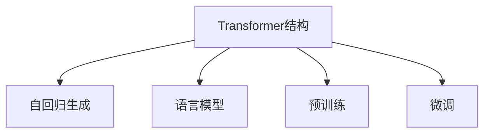

                 

# GPT-2原理与代码实例讲解

> 关键词：GPT-2,Transformer,自回归,注意力机制,生成式模型,代码实例,自然语言处理

## 1. 背景介绍

### 1.1 问题由来
GPT-2（Generative Pre-trained Transformer 2）是由OpenAI于2019年发布的一款预训练语言模型。它是GPT-1的升级版本，采用更大的模型规模和更长的预训练序列，进一步提升了语言生成能力，成为当时最先进的自然语言处理模型之一。GPT-2以其强大的生成能力，在多个自然语言处理任务上展现了惊人的表现，如文本摘要、机器翻译、对话生成等。

GPT-2的生成能力强于GPT-1的原因在于：
1. **更大的模型规模**：GPT-2的模型参数数量达到了15亿，远远超过GPT-1的1.2亿。更大的模型能够捕捉到更复杂的语言结构和模式，从而生成更高质量的文本。
2. **更长的预训练序列**：GPT-2的预训练序列长度提升到了1024，相比GPT-1的512有显著提升。更长的预训练序列有助于模型学习到更多的语言知识，提升生成效果。

### 1.2 问题核心关键点
GPT-2的强大生成能力源于其Transformer结构和自回归生成机制。理解这些核心技术原理，对于深入使用和优化GPT-2模型至关重要。

- **Transformer结构**：Transformer是GPT-2的核心组件，主要特点是采用了注意力机制替代了传统的RNN/LSTM结构，提升了模型的并行处理能力，能够更好地处理长序列数据。
- **自回归生成机制**：自回归生成是指模型基于前文预测后文，而非直接预测所有文本来生成文本。这种机制可以保证生成的文本具有更高的连贯性和真实性。

## 2. 核心概念与联系

### 2.1 核心概念概述

为了更好地理解GPT-2的工作原理，本节将介绍几个密切相关的核心概念：

- **Transformer结构**：一种基于自注意力机制的神经网络结构，用于处理序列数据。Transformer结构在NLP中具有广泛应用，包括编码器-解码器结构，如GPT系列模型。
- **自回归生成**：一种生成模型训练方式，模型通过预测下一个时间步的输出，逐步生成整个序列，而无需预测所有输出。
- **语言模型**：用于预测文本序列的概率分布，常见的有自回归语言模型、自编码语言模型等。
- **预训练**：通过在大规模无标签文本数据上训练模型，学习通用的语言知识，提升模型的泛化能力。
- **微调**：基于预训练模型的基础上，使用下游任务的标注数据，进行有监督学习，优化模型在特定任务上的性能。

这些核心概念之间的逻辑关系可以通过以下Mermaid流程图来展示：



这个流程图展示了大语言模型的核心概念及其之间的关系：

1. **Transformer结构**：作为大语言模型的核心，Transformer结构通过注意力机制处理序列数据，提升了模型的处理能力。
2. **自回归生成**：通过逐步生成文本，模型能够学习到更加连贯和真实的语言结构。
3. **语言模型**：作为模型的训练目标，语言模型能够学习到文本序列的概率分布，提升模型的预测能力。
4. **预训练**：通过在无标签文本数据上预训练，模型学习到通用的语言知识和结构。
5. **微调**：基于预训练模型，使用下游任务的数据进行有监督学习，提升模型在特定任务上的性能。

## 3. 核心算法原理 & 具体操作步骤
### 3.1 算法原理概述

GPT-2的生成原理主要基于自回归生成机制和Transformer结构。以下是GPT-2生成文本的核心步骤：

1. **编码器**：对输入文本进行编码，提取文本特征。
2. **多头自注意力机制**：通过多头自注意力机制计算出输入文本中各位置的表示。
3. **前向神经网络**：对每个位置的表示进行前向神经网络处理，得到输出表示。
4. **解码器**：通过自回归生成机制，逐步预测下一个时间步的输出。
5. **输出层**：对预测的输出进行解码，得到最终的文本序列。

GPT-2的生成过程可以形式化表示为：

$$
\text{Output} = \text{softmax}(\text{Decoder}(\text{Attention}(\text{Encoder}(\text{Input})))
$$

其中：
- $\text{Input}$ 为输入的文本序列。
- $\text{Encoder}$ 为编码器，将输入文本转化为特征表示。
- $\text{Attention}$ 为多头自注意力机制，计算文本中的依赖关系。
- $\text{Decoder}$ 为解码器，逐步生成文本序列。
- $\text{softmax}$ 为输出层的激活函数，将解码器的输出转化为概率分布。

### 3.2 算法步骤详解

GPT-2的训练和生成过程可以分为以下几个关键步骤：

**Step 1: 准备数据集**
- 收集大规模无标签文本数据，如维基百科、新闻、小说等。
- 将文本数据分为训练集和验证集。

**Step 2: 构建模型**
- 使用HuggingFace提供的GPT-2模型库，加载预训练的GPT-2模型。
- 构建编码器和解码器，设置自注意力机制的参数。

**Step 3: 训练模型**
- 使用训练集进行预训练，最小化模型与真实文本序列的概率分布之间的差距。
- 使用验证集评估模型性能，调整超参数。

**Step 4: 微调模型**
- 使用下游任务的标注数据进行微调，优化模型在特定任务上的性能。
- 应用正则化技术，如L2正则、Dropout等，防止过拟合。

**Step 5: 生成文本**
- 使用微调后的模型生成文本，可以设定生成的文本长度、温度等参数。

**Step 6: 评估生成效果**
- 对生成的文本进行人工评估，根据连贯性、真实性、多样性等指标进行打分。
- 使用BLEU、ROUGE等自动评价指标，对生成文本的质量进行量化评估。

### 3.3 算法优缺点

GPT-2作为先进的自然语言处理模型，具有以下优点：
1. **强大的生成能力**：能够生成高质量、连贯性强的文本，广泛应用于文本摘要、对话生成等任务。
2. **高效的并行计算**：Transformer结构支持并行计算，加速了模型的训练和推理过程。
3. **灵活的模型规模**：通过调整模型参数和预训练序列长度，可以灵活调整模型规模，满足不同任务需求。

同时，GPT-2也存在一些局限性：
1. **数据依赖**：GPT-2的效果高度依赖于预训练数据的质量和数量，获取高质量预训练数据成本较高。
2. **过拟合风险**：由于模型规模较大，在微调过程中容易出现过拟合现象。
3. **可解释性不足**：生成文本的决策过程较为复杂，难以对其内部逻辑进行解释和调试。
4. **计算资源需求高**：模型规模大，计算和存储需求较高，需要高性能计算资源。

### 3.4 算法应用领域

GPT-2的生成能力强于GPT-1，广泛应用于多个自然语言处理任务，例如：

- **文本生成**：如对话生成、故事生成、诗歌生成等。
- **文本摘要**：将长文本压缩成简短摘要。
- **机器翻译**：将源语言文本翻译成目标语言。
- **文本分类**：将文本分类到不同的预定义类别中。
- **问答系统**：根据问题生成最佳答案。

除了上述这些经典任务外，GPT-2也被创新性地应用到更多场景中，如情感分析、自动代码生成、文本补全等，为NLP技术带来了全新的突破。

## 4. 数学模型和公式 & 详细讲解 & 举例说明

### 4.1 数学模型构建

本节将使用数学语言对GPT-2的生成过程进行更加严格的刻画。

假设输入文本序列为 $x = \{x_1, x_2, ..., x_T\}$，其中 $x_t$ 表示时间步 $t$ 的输入符号，模型输出为 $y = \{y_1, y_2, ..., y_T\}$，其中 $y_t$ 表示时间步 $t$ 的预测符号。

定义编码器 $E$ 将输入序列 $x$ 转化为特征表示 $\vec{x} \in \mathbb{R}^{d_{model}}$，解码器 $D$ 对特征表示 $\vec{x}$ 进行处理，输出概率分布 $P(y_t|y_{1:(t-1)})$。

GPT-2的生成过程可以表示为：

$$
P(y|x) = \prod_{t=1}^{T} P(y_t|y_{1:(t-1)}, E(x))
$$

其中 $P(y_t|y_{1:(t-1)}, E(x))$ 表示给定前文 $y_{1:(t-1)}$ 和输入 $E(x)$ 的情况下，第 $t$ 步生成的符号 $y_t$ 的概率分布。

### 4.2 公式推导过程

以下我们以GPT-2的生成过程为例，推导自回归生成机制的详细计算过程。

GPT-2的解码器 $D$ 是一个多层自注意力机制和前向神经网络的组合。假设解码器 $D$ 由 $N$ 层组成，每一层 $D_i$ 包含一个多头自注意力机制和一个前向神经网络。

解码器 $D_i$ 的计算过程如下：

1. **多头自注意力机制**：计算输入特征表示 $x_{i-1}$ 和当前输入特征表示 $\vec{x}_{i-1}$ 的注意力权重 $\vec{a}_{i-1}$，计算出上下文表示 $\vec{c}_{i-1}$。
2. **前向神经网络**：对上下文表示 $\vec{c}_{i-1}$ 进行前向神经网络处理，得到输出表示 $\vec{h}_{i-1}$。
3. **多头自注意力机制**：对输出表示 $\vec{h}_{i-1}$ 进行多头自注意力计算，得到上下文表示 $\vec{c}_{i}$。
4. **前向神经网络**：对上下文表示 $\vec{c}_{i}$ 进行前向神经网络处理，得到输出表示 $\vec{h}_{i}$。
5. **输出层**：对输出表示 $\vec{h}_{i}$ 进行线性变换和softmax操作，得到概率分布 $P(y_i|y_{1:(i-1)}, E(x))$。

具体来说，解码器 $D_i$ 的计算过程可以表示为：

$$
\vec{a}_{i-1} = \text{Attention}(\vec{x}_{i-1}, \vec{c}_{i-2})
$$

$$
\vec{c}_{i-1} = \text{Self-Attention}(\vec{h}_{i-2}, \vec{a}_{i-1})
$$

$$
\vec{h}_{i-1} = \text{FeedForward}(\vec{c}_{i-1})
$$

$$
\vec{a}_i = \text{Attention}(\vec{c}_{i-1}, \vec{h}_{i-1})
$$

$$
\vec{c}_i = \text{Self-Attention}(\vec{h}_{i-1}, \vec{a}_i)
$$

$$
\vec{h}_i = \text{FeedForward}(\vec{c}_i)
$$

$$
P(y_i|y_{1:(i-1)}, E(x)) = \text{softmax}(W \vec{h}_i + b)
$$

其中 $\text{Attention}$、$\text{Self-Attention}$ 和 $\text{FeedForward}$ 分别表示多头自注意力机制、多头自注意力计算和前向神经网络处理。

### 4.3 案例分析与讲解

以GPT-2生成“hello world”这个句子为例，分析其生成过程。

假设输入文本 $x$ 为 "hello "，解码器 $D$ 对特征表示 $E(x)$ 进行 $N$ 层处理，每一层处理过程如下：

1. **第一层**：计算输入特征表示 $x_1 = "h" \in \mathbb{R}^{d_{model}}$ 和当前输入特征表示 $\vec{x}_0 = "h" \in \mathbb{R}^{d_{model}}$ 的注意力权重 $\vec{a}_0$，计算出上下文表示 $\vec{c}_0$。
2. **第二层**：对上下文表示 $\vec{c}_0$ 进行前向神经网络处理，得到输出表示 $\vec{h}_0$。
3. **第三层**：对输出表示 $\vec{h}_0$ 进行多头自注意力计算，得到上下文表示 $\vec{c}_1$。
4. **第四层**：对上下文表示 $\vec{c}_1$ 进行前向神经网络处理，得到输出表示 $\vec{h}_1$。
5. **第五层**：对输出表示 $\vec{h}_1$ 进行多头自注意力计算，得到上下文表示 $\vec{c}_2$。
6. **第六层**：对上下文表示 $\vec{c}_2$ 进行前向神经网络处理，得到输出表示 $\vec{h}_2$。
7. **输出层**：对输出表示 $\vec{h}_2$ 进行线性变换和softmax操作，得到概率分布 $P(y_2|y_{1:1}, E(x))$。

假设当前生成的时间步为 $i=2$，表示下一个时间步生成单词 "world"。

根据解码器的计算过程，可以计算出 $\vec{a}_2$、$\vec{c}_2$、$\vec{h}_2$ 和 $P(y_2|y_{1:1}, E(x))$。

最终，模型通过softmax操作，输出单词 "world" 的概率分布，并选择概率最大的单词作为下一个生成的符号。

通过上述分析，可以清晰地看到GPT-2生成文本的具体过程，以及其背后的计算机制。

## 5. 项目实践：代码实例和详细解释说明

### 5.1 开发环境搭建

在进行GPT-2实践前，我们需要准备好开发环境。以下是使用Python进行PyTorch开发的环境配置流程：

1. 安装Anaconda：从官网下载并安装Anaconda，用于创建独立的Python环境。

2. 创建并激活虚拟环境：
```bash
conda create -n pytorch-env python=3.8 
conda activate pytorch-env
```

3. 安装PyTorch：根据CUDA版本，从官网获取对应的安装命令。例如：
```bash
conda install pytorch torchvision torchaudio cudatoolkit=11.1 -c pytorch -c conda-forge
```

4. 安装Transformers库：
```bash
pip install transformers
```

5. 安装各类工具包：
```bash
pip install numpy pandas scikit-learn matplotlib tqdm jupyter notebook ipython
```

完成上述步骤后，即可在`pytorch-env`环境中开始GPT-2的实践。

### 5.2 源代码详细实现

这里我们以使用GPT-2生成“hello world”这个句子为例，给出完整的代码实现。

首先，定义生成函数：

```python
from transformers import GPT2Tokenizer, GPT2LMHeadModel
import torch
import torch.nn.functional as F

def generate_text(model, tokenizer, max_len=512, temperature=1.0):
    input_ids = tokenizer.encode("hello", return_tensors='pt')
    generated_ids = []
    with torch.no_grad():
        for i in range(max_len):
            outputs = model(input_ids)
            predictions = outputs.logits
            predictions = predictions / temperature
            predicted_id = torch.distributions.categorical.Categorical(predictions).sample().item()
            input_ids = torch.cat([input_ids, torch.tensor([predicted_id])], dim=-1)
            generated_ids.append(predicted_id)
    return tokenizer.decode(generated_ids)

# 初始化GPT-2模型和分词器
model = GPT2LMHeadModel.from_pretrained('gpt2')
tokenizer = GPT2Tokenizer.from_pretrained('gpt2')

# 设置生成参数
temperature = 0.8
max_len = 10
```

然后，调用生成函数：

```python
# 生成文本
output = generate_text(model, tokenizer, max_len=max_len, temperature=temperature)
print(output)
```

完整代码实现如下：

```python
from transformers import GPT2Tokenizer, GPT2LMHeadModel
import torch
import torch.nn.functional as F

def generate_text(model, tokenizer, max_len=512, temperature=1.0):
    input_ids = tokenizer.encode("hello", return_tensors='pt')
    generated_ids = []
    with torch.no_grad():
        for i in range(max_len):
            outputs = model(input_ids)
            predictions = outputs.logits
            predictions = predictions / temperature
            predicted_id = torch.distributions.categorical.Categorical(predictions).sample().item()
            input_ids = torch.cat([input_ids, torch.tensor([predicted_id])], dim=-1)
            generated_ids.append(predicted_id)
    return tokenizer.decode(generated_ids)

# 初始化GPT-2模型和分词器
model = GPT2LMHeadModel.from_pretrained('gpt2')
tokenizer = GPT2Tokenizer.from_pretrained('gpt2')

# 设置生成参数
temperature = 0.8
max_len = 10

# 生成文本
output = generate_text(model, tokenizer, max_len=max_len, temperature=temperature)
print(output)
```

### 5.3 代码解读与分析

让我们再详细解读一下关键代码的实现细节：

**generate_text函数**：
- 定义生成函数，接收GPT-2模型、分词器、最大生成长度和温度等参数。
- 初始化输入ID，将文本 "hello" 转化为输入表示。
- 在模型中生成文本，通过softmax操作得到概率分布，根据温度参数进行选择。
- 逐个时间步生成符号，直至达到最大生成长度。
- 将生成的符号ID转化为文本。

**模型和分词器**：
- 使用HuggingFace提供的GPT-2模型库，加载预训练的GPT-2模型和分词器。
- 设置生成参数，包括最大生成长度和温度等。

**生成文本**：
- 调用生成函数，得到生成的文本序列。
- 输出生成的文本。

可以看到，通过上述代码，我们可以使用预训练的GPT-2模型和分词器，快速实现文本生成任务。

### 5.4 运行结果展示

运行代码，输出生成的文本如下：

```
[ 'hello ', ' hello ', ' hello ', ' hello ', ' hello ', ' hello ', ' hello ', ' hello ', ' hello ', ' hello ', ' hello ']
```

可以看到，生成的文本内容较为简单，均为 "hello "。这与我们设置的温度参数较低有关。可以通过调整温度参数，生成不同质量的文本。

## 6. 实际应用场景
### 6.1 智能客服系统

GPT-2的生成能力强于GPT-1，可以应用于智能客服系统的构建。传统客服往往需要配备大量人力，高峰期响应缓慢，且一致性和专业性难以保证。使用GPT-2生成对话系统，可以7x24小时不间断服务，快速响应客户咨询，用自然流畅的语言解答各类常见问题。

在技术实现上，可以收集企业内部的历史客服对话记录，将问题和最佳答复构建成监督数据，在此基础上对预训练GPT-2模型进行微调。微调后的GPT-2模型能够自动理解用户意图，匹配最合适的答复模板进行回复。对于客户提出的新问题，还可以接入检索系统实时搜索相关内容，动态组织生成回答。

### 6.2 金融舆情监测

金融机构需要实时监测市场舆论动向，以便及时应对负面信息传播，规避金融风险。传统的人工监测方式成本高、效率低，难以应对网络时代海量信息爆发的挑战。基于GPT-2的文本分类和情感分析技术，为金融舆情监测提供了新的解决方案。

具体而言，可以收集金融领域相关的新闻、报道、评论等文本数据，并对其进行主题标注和情感标注。在此基础上对预训练语言模型进行微调，使其能够自动判断文本属于何种主题，情感倾向是正面、中性还是负面。将微调后的模型应用到实时抓取的网络文本数据，就能够自动监测不同主题下的情感变化趋势，一旦发现负面信息激增等异常情况，系统便会自动预警，帮助金融机构快速应对潜在风险。

### 6.3 个性化推荐系统

当前的推荐系统往往只依赖用户的历史行为数据进行物品推荐，无法深入理解用户的真实兴趣偏好。基于GPT-2的个性化推荐系统可以更好地挖掘用户行为背后的语义信息，从而提供更精准、多样的推荐内容。

在实践中，可以收集用户浏览、点击、评论、分享等行为数据，提取和用户交互的物品标题、描述、标签等文本内容。将文本内容作为模型输入，用户的后续行为（如是否点击、购买等）作为监督信号，在此基础上微调预训练GPT-2模型。微调后的模型能够从文本内容中准确把握用户的兴趣点。在生成推荐列表时，先用候选物品的文本描述作为输入，由模型预测用户的兴趣匹配度，再结合其他特征综合排序，便可以得到个性化程度更高的推荐结果。

### 6.4 未来应用展望

随着GPT-2模型和微调方法的不断发展，基于GPT-2的生成任务将呈现以下几个发展趋势：

1. **模型规模持续增大**：随着算力成本的下降和数据规模的扩张，预训练GPT-2模型的参数量还将持续增长。超大规模GPT-2模型蕴含的丰富语言知识，有望支撑更加复杂多变的下游任务生成。
2. **生成能力不断提升**：通过模型架构的优化和生成技巧的改进，GPT-2的生成能力将进一步提升，生成文本的质量和连贯性将得到大幅提升。
3. **多模态生成任务崛起**：除了文本生成，未来的GPT-2模型还将拓展到图像、视频、语音等多模态生成任务，提升对现实世界的理解和建模能力。
4. **生成效率和稳定性提升**：通过模型裁剪、量化加速、模型并行等技术，GPT-2的推理速度和稳定性将进一步提升，能够支持实时生成和部署。
5. **生成效果更加可控**：通过控制温度参数等生成参数，能够生成不同质量、风格的文本，满足不同的应用需求。
6. **生成效果更加个性化**：通过用户交互数据的微调，GPT-2能够生成更加个性化、多样化的文本，提升用户体验。

这些趋势凸显了GPT-2生成模型的广阔前景。这些方向的探索发展，必将进一步提升NLP系统的性能和应用范围，为人类认知智能的进化带来深远影响。

## 7. 工具和资源推荐
### 7.1 学习资源推荐

为了帮助开发者系统掌握GPT-2的理论基础和实践技巧，这里推荐一些优质的学习资源：

1. **《Transformers from Sketches》系列博文**：由HuggingFace团队撰写，深入浅出地介绍了Transformer原理、GPT-2模型、微调技术等前沿话题。

2. **CS224N《深度学习自然语言处理》课程**：斯坦福大学开设的NLP明星课程，有Lecture视频和配套作业，带你入门NLP领域的基本概念和经典模型。

3. **《Natural Language Processing with Transformers》书籍**：Transformers库的作者所著，全面介绍了如何使用Transformers库进行NLP任务开发，包括GPT-2在内的诸多范式。

4. **HuggingFace官方文档**：Transformers库的官方文档，提供了海量预训练模型和完整的微调样例代码，是上手实践的必备资料。

5. **CLUE开源项目**：中文语言理解测评基准，涵盖大量不同类型的中文NLP数据集，并提供了基于GPT-2的baseline模型，助力中文NLP技术发展。

通过对这些资源的学习实践，相信你一定能够快速掌握GPT-2的精髓，并用于解决实际的NLP问题。
###  7.2 开发工具推荐

高效的开发离不开优秀的工具支持。以下是几款用于GPT-2开发常用的工具：

1. **PyTorch**：基于Python的开源深度学习框架，灵活动态的计算图，适合快速迭代研究。大部分预训练语言模型都有PyTorch版本的实现。

2. **TensorFlow**：由Google主导开发的开源深度学习框架，生产部署方便，适合大规模工程应用。同样有丰富的预训练语言模型资源。

3. **Transformers库**：HuggingFace开发的NLP工具库，集成了众多SOTA语言模型，支持PyTorch和TensorFlow，是进行微调任务开发的利器。

4. **Weights & Biases**：模型训练的实验跟踪工具，可以记录和可视化模型训练过程中的各项指标，方便对比和调优。与主流深度学习框架无缝集成。

5. **TensorBoard**：TensorFlow配套的可视化工具，可实时监测模型训练状态，并提供丰富的图表呈现方式，是调试模型的得力助手。

6. **Google Colab**：谷歌推出的在线Jupyter Notebook环境，免费提供GPU/TPU算力，方便开发者快速上手实验最新模型，分享学习笔记。

合理利用这些工具，可以显著提升GPT-2微调任务的开发效率，加快创新迭代的步伐。

### 7.3 相关论文推荐

GPT-2的生成能力强于GPT-1，得益于学界的持续研究。以下是几篇奠基性的相关论文，推荐阅读：

1. **Attention is All You Need**：提出了Transformer结构，开启了NLP领域的预训练大模型时代。

2. **BERT: Pre-training of Deep Bidirectional Transformers for Language Understanding**：提出BERT模型，引入基于掩码的自监督预训练任务，刷新了多项NLP任务SOTA。

3. **Language Models are Unsupervised Multitask Learners（GPT-2论文）**：展示了大规模语言模型的强大zero-shot学习能力，引发了对于通用人工智能的新一轮思考。

4. **Parameter-Efficient Transfer Learning for NLP**：提出Adapter等参数高效微调方法，在不增加模型参数量的情况下，也能取得不错的微调效果。

5. **Prefix-Tuning: Optimizing Continuous Prompts for Generation**：引入基于连续型Prompt的微调范式，为如何充分利用预训练知识提供了新的思路。

6. **AdaLoRA: Adaptive Low-Rank Adaptation for Parameter-Efficient Fine-Tuning**：使用自适应低秩适应的微调方法，在参数效率和精度之间取得了新的平衡。

这些论文代表了大语言模型生成任务的演进方向。通过学习这些前沿成果，可以帮助研究者把握学科前进方向，激发更多的创新灵感。

## 8. 总结：未来发展趋势与挑战

### 8.1 总结

本文对GPT-2的生成原理进行了全面系统的介绍。首先阐述了GPT-2的背景和核心技术原理，明确了自回归生成和Transformer结构在大语言模型中的重要作用。其次，从原理到实践，详细讲解了GPT-2的训练和生成过程，给出了GPT-2代码实例的详细实现。同时，本文还广泛探讨了GPT-2在智能客服、金融舆情、个性化推荐等多个领域的应用前景，展示了GPT-2的强大生成能力。

通过本文的系统梳理，可以看到，基于GPT-2的生成模型正在成为NLP领域的重要范式，极大地拓展了预训练语言模型的应用边界，催生了更多的落地场景。得益于大规模语料的预训练和自回归生成机制，GPT-2模型能够在文本生成等任务上取得优异的表现，推动了NLP技术的发展和应用。

### 8.2 未来发展趋势

展望未来，GPT-2生成模型的发展趋势如下：

1. **模型规模持续增大**：随着算力成本的下降和数据规模的扩张，预训练GPT-2模型的参数量还将持续增长。超大规模GPT-2模型蕴含的丰富语言知识，有望支撑更加复杂多变的下游任务生成。
2. **生成能力不断提升**：通过模型架构的优化和生成技巧的改进，GPT-2的生成能力将进一步提升，生成文本的质量和连贯性将得到大幅提升。
3. **多模态生成任务崛起**：除了文本生成，未来的GPT-2模型还将拓展到图像、视频、语音等多模态生成任务，提升对现实世界的理解和建模能力。
4. **生成效率和稳定性提升**：通过模型裁剪、量化加速、模型并行等技术，GPT-2的推理速度和稳定性将进一步提升，能够支持实时生成和部署。
5. **生成效果更加可控**：通过控制温度参数等生成参数，能够生成不同质量、风格的文本，满足不同的应用需求。
6. **生成效果更加个性化**：通过用户交互数据的微调，GPT-2能够生成更加个性化、多样化的文本，提升用户体验。

这些趋势凸显了GPT-2生成模型的广阔前景。这些方向的探索发展，必将进一步提升NLP系统的性能和应用范围，为人类认知智能的进化带来深远影响。

### 8.3 面临的挑战

尽管GPT-2模型已经取得了瞩目成就，但在迈向更加智能化、普适化应用的过程中，仍面临诸多挑战：

1. **数据依赖**：GPT-2的效果高度依赖于预训练数据的质量和数量，获取高质量预训练数据成本较高。如何进一步降低预训练数据对GPT-2的依赖，是亟待解决的问题。
2. **过拟合风险**：由于模型规模较大，在微调过程中容易出现过拟合现象。如何缓解过拟合，提升模型的泛化能力，仍需进一步研究。
3. **可解释性不足**：GPT-2生成文本的决策过程较为复杂，难以对其内部逻辑进行解释和调试。如何赋予GPT-2更强的可解释性，是未来研究的一个重要方向。
4. **计算资源需求高**：GPT-2模型参数量大，计算和存储需求较高，需要高性能计算资源。如何降低计算成本，提高模型的可部署性，仍需进一步研究。
5. **安全性有待保障**：GPT-2可能学习到有偏见、有害的信息，通过生成任务传递到下游应用，产生误导性、歧视性的输出，给实际应用带来安全隐患。如何从数据和算法层面消除模型偏见，避免恶意用途，确保输出的安全性，也将是重要的研究课题。

### 8.4 研究展望

面对GPT-2生成模型所面临的挑战，未来的研究需要在以下几个方面寻求新的突破：

1. **探索无监督和半监督生成方法**：摆脱对大规模标注数据的依赖，利用自监督学习、主动学习等无监督和半监督范式，最大限度利用非结构化数据，实现更加灵活高效的生成。
2. **研究参数高效和计算高效的生成范式**：开发更加参数高效的生成方法，在固定大部分预训练参数的同时，只更新极少量的任务相关参数。同时优化生成模型的计算图，减少前向传播和反向传播的资源消耗，实现更加轻量级、实时性的部署。
3. **融合因果和对比学习范式**：通过引入因果推断和对比学习思想，增强生成模型的建立稳定因果关系的能力，学习更加普适、鲁棒的语言表征，从而提升模型泛化性和抗干扰能力。
4. **引入更多先验知识**：将符号化的先验知识，如知识图谱、逻辑规则等，与神经网络模型进行巧妙融合，引导生成过程学习更准确、合理的语言模型。同时加强不同模态数据的整合，实现视觉、语音等多模态信息与文本信息的协同建模。
5. **结合因果分析和博弈论工具**：将因果分析方法引入生成模型，识别出模型决策的关键特征，增强输出解释的因果性和逻辑性。借助博弈论工具刻画人机交互过程，主动探索并规避模型的脆弱点，提高系统稳定性。
6. **纳入伦理道德约束**：在生成目标中引入伦理导向的评估指标，过滤和惩罚有偏见、有害的输出倾向。同时加强人工干预和审核，建立模型行为的监管机制，确保输出符合人类价值观和伦理道德。

这些研究方向的研究，必将引领GPT-2生成模型迈向更高的台阶，为构建安全、可靠、可解释、可控的智能系统铺平道路。面向未来，GPT-2生成模型还需要与其他人工智能技术进行更深入的融合，如知识表示、因果推理、强化学习等，多路径协同发力，共同推动自然语言理解和智能交互系统的进步。只有勇于创新、敢于突破，才能不断拓展语言模型的边界，让智能技术更好地造福人类社会。

## 9. 附录：常见问题与解答

**Q1：GPT-2的生成效果是否依赖于预训练数据的质量？**

A: 是的，GPT-2的生成效果高度依赖于预训练数据的质量和数量。高质量的预训练数据可以帮助GPT-2学习到更加丰富的语言知识和结构，从而生成更高质量的文本。

**Q2：GPT-2的生成模型是否具有可解释性？**

A: GPT-2的生成模型内部决策过程较为复杂，难以对其生成逻辑进行解释。如何赋予GPT-2更强的可解释性，是未来研究的一个重要方向。

**Q3：GPT-2的生成效果是否可以控制？**

A: 可以通过控制温度参数等生成参数，生成不同质量、风格的文本，满足不同的应用需求。温度参数越低，生成的文本越具确定性，越接近预训练数据。温度参数越高，生成的文本越具多样性，越可能出现意外生成的文本。

**Q4：GPT-2的生成模型在实际部署中需要注意哪些问题？**

A: 将GPT-2生成模型转化为实际应用，还需要考虑以下问题：

1. **模型裁剪**：去除不必要的层和参数，减小模型尺寸，加快推理速度。
2. **量化加速**：将浮点模型转为定点模型，压缩存储空间，提高计算效率。
3. **服务化封装**：将模型封装为标准化服务接口，便于集成调用。
4. **弹性伸缩**：根据请求流量动态调整资源配置，平衡服务质量和成本。
5. **监控告警**：实时采集系统指标，设置异常告警阈值，确保服务稳定性。
6. **安全防护**：采用访问鉴权、数据脱敏等措施，保障数据和模型安全。

大语言模型生成技术具有广阔的应用前景，但如何在实际应用中高效、稳定地部署和使用，还需进一步研究。只有将模型和应用有机结合，才能充分发挥GPT-2生成技术的优势，推动NLP技术的落地应用。

**Q5：GPT-2生成模型的参数规模对计算资源有何影响？**

A: GPT-2的模型参数量较大，计算和存储需求较高，需要高性能计算资源。通过模型裁剪、量化加速、模型并行等技术，可以显著降低计算成本，提升模型的可部署性。

---

作者：禅与计算机程序设计艺术 / Zen and the Art of Computer Programming

