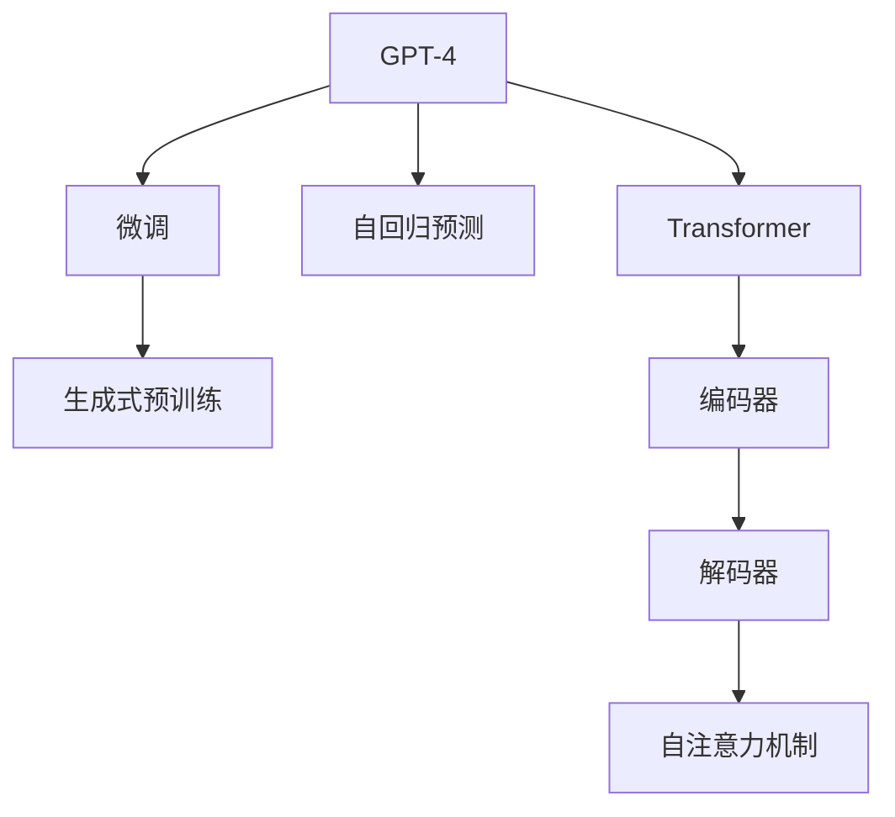

                 

## 1. 背景介绍

### 1.1 问题由来

在人工智能领域，生成式预训练模型如GPT-4，以其强大的语言生成和理解能力，广泛应用于自然语言处理(NLP)、内容创作、智能客服等多个领域。随着OpenAI最新发布的GPT-4模型，其在推理能力、代码生成、问答系统等任务上取得新的突破，成为当前最炙手可热的生成式模型之一。

GPT-4采用了Transformer结构，基于自回归预测方式进行训练，能够在大规模文本数据上学习到丰富的语言知识，并用于生成自然流畅、连贯的文本。GPT-4的创新点包括更高效的训练算法、更广泛的预训练语料以及更强的跨领域迁移能力，其在多项任务上均刷新了SOTA，成为研究者和开发者关注的焦点。

然而，尽管GPT-4表现优异，其大规模的参数量也带来了计算和资源上的挑战，实际应用时需要结合具体的任务需求进行优化和调整。本文将全面介绍GPT-4的原理与代码实现，并结合实际应用场景，进行详细讲解。

### 1.2 问题核心关键点

- GPT-4模型架构
- GPT-4训练流程
- GPT-4微调技术
- GPT-4生成和推理性能
- GPT-4在实际场景中的应用

本文将对上述核心点进行深入探讨，通过理论分析与代码实践，帮助读者全面理解GPT-4模型。

## 2. 核心概念与联系

### 2.1 核心概念概述

为了更好地理解GPT-4，本节将介绍几个关键概念：

- **生成式预训练模型(Generative Pre-trained Transformer, GPT)**：基于Transformer结构，通过自回归预测方式进行预训练和微调的语言模型。GPT系列模型通过在海量文本数据上进行预训练，学习语言生成和理解能力。
- **Transformer结构**：一种自注意力机制，用于并行处理大规模序列数据，提高模型训练和推理效率。Transformer由多个编码器和解码器构成，通过自注意力机制实现序列间的信息传递和融合。
- **自回归预测(Autoregressive Prediction)**：一种基于前文信息的生成方式，GPT-4通过预测下一个单词来生成文本，这种自回归方式使得模型生成的文本连贯性更强。
- **微调(Fine-tuning)**：在大规模预训练模型基础上，使用下游任务数据进行有监督训练，调整模型参数以适应特定任务需求。

这些概念共同构成了GPT-4模型的基本框架，通过理解这些核心概念，我们可以更好地把握GPT-4的工作原理。

### 2.2 核心概念原理和架构的 Mermaid 流程图



这个流程图展示了GPT-4模型的核心架构和运作原理：

1. GPT-4作为生成式预训练模型，通过自回归预测方式进行训练。
2. 自回归预测通过预测下一个单词来生成文本。
3. 模型结构由多个编码器和解码器构成，通过自注意力机制实现序列间的信息传递。
4. 微调通过在大规模预训练模型基础上，使用下游任务数据进行有监督训练，调整模型参数以适应特定任务需求。

## 3. 核心算法原理 & 具体操作步骤

### 3.1 算法原理概述

GPT-4模型的核心在于其基于Transformer的自回归预测方式。在预训练阶段，模型通过自回归预测的方式，在大规模无标签文本数据上学习语言知识，生成自然流畅的文本。在微调阶段，通过下游任务的标注数据，调整模型参数，使其适应特定任务。

### 3.2 算法步骤详解

GPT-4的微调流程一般包括以下几个关键步骤：

**Step 1: 准备预训练模型和数据集**

- 选择合适的预训练模型（如GPT-4），作为初始化参数。
- 准备下游任务的标注数据集，划分为训练集、验证集和测试集。

**Step 2: 添加任务适配层**

- 根据任务类型，在预训练模型顶层设计合适的输出层和损失函数。
- 对于分类任务，通常在顶层添加线性分类器和交叉熵损失函数。
- 对于生成任务，通常使用语言模型的解码器输出概率分布，并以负对数似然为损失函数。

**Step 3: 设置微调超参数**

- 选择合适的优化算法及其参数，如AdamW、SGD等，设置学习率、批大小、迭代轮数等。
- 设置正则化技术及强度，包括权重衰减、Dropout、Early Stopping等。
- 确定冻结预训练参数的策略，如仅微调顶层，或全部参数都参与微调。

**Step 4: 执行梯度训练**

- 将训练集数据分批次输入模型，前向传播计算损失函数。
- 反向传播计算参数梯度，根据设定的优化算法和学习率更新模型参数。
- 周期性在验证集上评估模型性能，根据性能指标决定是否触发Early Stopping。
- 重复上述步骤直到满足预设的迭代轮数或Early Stopping条件。

**Step 5: 测试和部署**

- 在测试集上评估微调后模型，对比微调前后的精度提升。
- 使用微调后的模型对新样本进行推理预测，集成到实际的应用系统中。
- 持续收集新的数据，定期重新微调模型，以适应数据分布的变化。

### 3.3 算法优缺点

GPT-4的微调方法具有以下优点：

- 简单高效。只需准备少量标注数据，即可对预训练模型进行快速适配，获得较大的性能提升。
- 通用适用。适用于各种NLP下游任务，包括分类、匹配、生成等，设计简单的任务适配层即可实现微调。
- 参数高效。利用参数高效微调技术，在固定大部分预训练参数的情况下，仍可取得不错的提升。
- 效果显著。在学术界和工业界的诸多任务上，基于微调的方法已经刷新了最先进的性能指标。

同时，该方法也存在一定的局限性：

- 依赖标注数据。微调的效果很大程度上取决于标注数据的质量和数量，获取高质量标注数据的成本较高。
- 迁移能力有限。当目标任务与预训练数据的分布差异较大时，微调的性能提升有限。
- 负面效果传递。预训练模型的固有偏见、有害信息等，可能通过微调传递到下游任务，造成负面影响。
- 可解释性不足。微调模型的决策过程通常缺乏可解释性，难以对其推理逻辑进行分析和调试。

尽管存在这些局限性，但就目前而言，基于监督学习的微调方法仍是大语言模型应用的最主流范式。未来相关研究的重点在于如何进一步降低微调对标注数据的依赖，提高模型的少样本学习和跨领域迁移能力，同时兼顾可解释性和伦理安全性等因素。

### 3.4 算法应用领域

GPT-4的微调方法已经在问答、对话、摘要、翻译、情感分析等诸多NLP任务上取得了优异的效果，成为NLP技术落地应用的重要手段。

**问答系统**：对自然语言问题给出答案。将问题-答案对作为微调数据，训练模型学习匹配答案。
**对话系统**：使机器能够与人自然对话。将多轮对话历史作为上下文，微调模型进行回复生成。
**文本摘要**：将长文本压缩成简短摘要。将文章-摘要对作为微调数据，使模型学习抓取要点。
**机器翻译**：将源语言文本翻译成目标语言。通过微调使模型学习语言-语言映射。
**情感分析**：识别文本中的情感倾向。通过微调使模型学习情感-情感映射。

除了上述这些经典任务外，GPT-4的微调方法也被创新性地应用到更多场景中，如可控文本生成、常识推理、代码生成、数据增强等，为NLP技术带来了全新的突破。

## 4. 数学模型和公式 & 详细讲解 & 举例说明

### 4.1 数学模型构建

记预训练语言模型为 $M_{\theta}$，其中 $\theta$ 为预训练得到的模型参数。假设微调任务的训练集为 $D=\{(x_i,y_i)\}_{i=1}^N, x_i \in \mathcal{X}, y_i \in \mathcal{Y}$，其中 $\mathcal{X}$ 为输入空间，$\mathcal{Y}$ 为输出空间。

定义模型 $M_{\theta}$ 在输入 $x$ 上的输出为 $\hat{y}=M_{\theta}(x) \in [0,1]$，表示样本属于正类的概率。真实标签 $y \in \{0,1\}$。则二分类交叉熵损失函数定义为：

$$
\ell(M_{\theta}(x),y) = -[y\log \hat{y} + (1-y)\log (1-\hat{y})]
$$

将其代入经验风险公式，得：

$$
\mathcal{L}(\theta) = -\frac{1}{N}\sum_{i=1}^N [y_i\log M_{\theta}(x_i)+(1-y_i)\log(1-M_{\theta}(x_i))]
$$

在实践中，我们通常使用基于梯度的优化算法（如SGD、Adam等）来近似求解上述最优化问题。设 $\eta$ 为学习率，$\lambda$ 为正则化系数，则参数的更新公式为：

$$
\theta \leftarrow \theta - \eta \nabla_{\theta}\mathcal{L}(\theta) - \eta\lambda\theta
$$

其中 $\nabla_{\theta}\mathcal{L}(\theta)$ 为损失函数对参数 $\theta$ 的梯度，可通过反向传播算法高效计算。

### 4.2 公式推导过程

以下我们以二分类任务为例，推导交叉熵损失函数及其梯度的计算公式。

假设模型 $M_{\theta}$ 在输入 $x$ 上的输出为 $\hat{y}=M_{\theta}(x) \in [0,1]$，表示样本属于正类的概率。真实标签 $y \in \{0,1\}$。则二分类交叉熵损失函数定义为：

$$
\ell(M_{\theta}(x),y) = -[y\log \hat{y} + (1-y)\log (1-\hat{y})]
$$

将其代入经验风险公式，得：

$$
\mathcal{L}(\theta) = -\frac{1}{N}\sum_{i=1}^N [y_i\log M_{\theta}(x_i)+(1-y_i)\log(1-M_{\theta}(x_i))]
$$

根据链式法则，损失函数对参数 $\theta_k$ 的梯度为：

$$
\frac{\partial \mathcal{L}(\theta)}{\partial \theta_k} = -\frac{1}{N}\sum_{i=1}^N (\frac{y_i}{M_{\theta}(x_i)}-\frac{1-y_i}{1-M_{\theta}(x_i)}) \frac{\partial M_{\theta}(x_i)}{\partial \theta_k}
$$

其中 $\frac{\partial M_{\theta}(x_i)}{\partial \theta_k}$ 可进一步递归展开，利用自动微分技术完成计算。

在得到损失函数的梯度后，即可带入参数更新公式，完成模型的迭代优化。重复上述过程直至收敛，最终得到适应下游任务的最优模型参数 $\theta^*$。

## 5. 项目实践：代码实例和详细解释说明

### 5.1 开发环境搭建

在进行微调实践前，我们需要准备好开发环境。以下是使用Python进行PyTorch开发的环境配置流程：

1. 安装Anaconda：从官网下载并安装Anaconda，用于创建独立的Python环境。

2. 创建并激活虚拟环境：
```bash
conda create -n pytorch-env python=3.8 
conda activate pytorch-env
```

3. 安装PyTorch：根据CUDA版本，从官网获取对应的安装命令。例如：
```bash
conda install pytorch torchvision torchaudio cudatoolkit=11.1 -c pytorch -c conda-forge
```

4. 安装Transformers库：
```bash
pip install transformers
```

5. 安装各类工具包：
```bash
pip install numpy pandas scikit-learn matplotlib tqdm jupyter notebook ipython
```

完成上述步骤后，即可在`pytorch-env`环境中开始微调实践。

### 5.2 源代码详细实现

这里以GPT-4的微调代码实现为例，展示如何使用Transformers库进行微调。

首先，定义二分类任务的数据处理函数：

```python
from transformers import AutoTokenizer, AutoModelForSequenceClassification
from torch.utils.data import Dataset
import torch

class BinaryClassificationDataset(Dataset):
    def __init__(self, texts, labels):
        self.texts = texts
        self.labels = labels
        self.tokenizer = AutoTokenizer.from_pretrained('gpt4-medium')

    def __len__(self):
        return len(self.texts)
    
    def __getitem__(self, item):
        text = self.texts[item]
        label = self.labels[item]
        
        encoding = self.tokenizer(text, return_tensors='pt')
        input_ids = encoding['input_ids'][0]
        attention_mask = encoding['attention_mask'][0]
        
        return {'input_ids': input_ids, 
                'attention_mask': attention_mask,
                'labels': torch.tensor(label, dtype=torch.long)}
```

然后，定义模型和优化器：

```python
from transformers import AutoModelForSequenceClassification, AdamW

model = AutoModelForSequenceClassification.from_pretrained('gpt4-medium', num_labels=2)
optimizer = AdamW(model.parameters(), lr=2e-5)
```

接着，定义训练和评估函数：

```python
from torch.utils.data import DataLoader
from tqdm import tqdm

device = torch.device('cuda') if torch.cuda.is_available() else torch.device('cpu')
model.to(device)

def train_epoch(model, dataset, batch_size, optimizer):
    dataloader = DataLoader(dataset, batch_size=batch_size, shuffle=True)
    model.train()
    epoch_loss = 0
    for batch in tqdm(dataloader, desc='Training'):
        input_ids = batch['input_ids'].to(device)
        attention_mask = batch['attention_mask'].to(device)
        labels = batch['labels'].to(device)
        model.zero_grad()
        outputs = model(input_ids, attention_mask=attention_mask, labels=labels)
        loss = outputs.loss
        epoch_loss += loss.item()
        loss.backward()
        optimizer.step()
    return epoch_loss / len(dataloader)

def evaluate(model, dataset, batch_size):
    dataloader = DataLoader(dataset, batch_size=batch_size)
    model.eval()
    preds, labels = [], []
    with torch.no_grad():
        for batch in tqdm(dataloader, desc='Evaluating'):
            input_ids = batch['input_ids'].to(device)
            attention_mask = batch['attention_mask'].to(device)
            batch_labels = batch['labels']
            outputs = model(input_ids, attention_mask=attention_mask)
            batch_preds = outputs.logits.argmax(dim=1).to('cpu').tolist()
            batch_labels = batch_labels.to('cpu').tolist()
            for pred, label in zip(batch_preds, batch_labels):
                preds.append(pred)
                labels.append(label)
                
    print(classification_report(labels, preds))
```

最后，启动训练流程并在测试集上评估：

```python
epochs = 5
batch_size = 16

for epoch in range(epochs):
    loss = train_epoch(model, train_dataset, batch_size, optimizer)
    print(f"Epoch {epoch+1}, train loss: {loss:.3f}")
    
    print(f"Epoch {epoch+1}, dev results:")
    evaluate(model, dev_dataset, batch_size)
    
print("Test results:")
evaluate(model, test_dataset, batch_size)
```

以上就是使用PyTorch对GPT-4进行微调的完整代码实现。可以看到，得益于Transformers库的强大封装，我们可以用相对简洁的代码完成模型的加载和微调。

### 5.3 代码解读与分析

让我们再详细解读一下关键代码的实现细节：

**BinaryClassificationDataset类**：
- `__init__`方法：初始化文本、标签等关键组件。
- `__len__`方法：返回数据集的样本数量。
- `__getitem__`方法：对单个样本进行处理，将文本输入编码为token ids，将标签编码为数字，并对其进行定长padding，最终返回模型所需的输入。

**训练和评估函数**：
- 使用PyTorch的DataLoader对数据集进行批次化加载，供模型训练和推理使用。
- 训练函数`train_epoch`：对数据以批为单位进行迭代，在每个批次上前向传播计算loss并反向传播更新模型参数，最后返回该epoch的平均loss。
- 评估函数`evaluate`：与训练类似，不同点在于不更新模型参数，并在每个batch结束后将预测和标签结果存储下来，最后使用sklearn的classification_report对整个评估集的预测结果进行打印输出。

**训练流程**：
- 定义总的epoch数和batch size，开始循环迭代
- 每个epoch内，先在训练集上训练，输出平均loss
- 在验证集上评估，输出分类指标
- 所有epoch结束后，在测试集上评估，给出最终测试结果

可以看到，PyTorch配合Transformers库使得GPT-4微调的代码实现变得简洁高效。开发者可以将更多精力放在数据处理、模型改进等高层逻辑上，而不必过多关注底层的实现细节。

当然，工业级的系统实现还需考虑更多因素，如模型的保存和部署、超参数的自动搜索、更灵活的任务适配层等。但核心的微调范式基本与此类似。

## 6. 实际应用场景

### 6.1 智能客服系统

基于GPT-4的微调对话技术，可以广泛应用于智能客服系统的构建。传统客服往往需要配备大量人力，高峰期响应缓慢，且一致性和专业性难以保证。而使用微调后的对话模型，可以7x24小时不间断服务，快速响应客户咨询，用自然流畅的语言解答各类常见问题。

在技术实现上，可以收集企业内部的历史客服对话记录，将问题和最佳答复构建成监督数据，在此基础上对预训练对话模型进行微调。微调后的对话模型能够自动理解用户意图，匹配最合适的答案模板进行回复。对于客户提出的新问题，还可以接入检索系统实时搜索相关内容，动态组织生成回答。如此构建的智能客服系统，能大幅提升客户咨询体验和问题解决效率。

### 6.2 金融舆情监测

金融机构需要实时监测市场舆论动向，以便及时应对负面信息传播，规避金融风险。传统的人工监测方式成本高、效率低，难以应对网络时代海量信息爆发的挑战。基于GPT-4的文本分类和情感分析技术，为金融舆情监测提供了新的解决方案。

具体而言，可以收集金融领域相关的新闻、报道、评论等文本数据，并对其进行主题标注和情感标注。在此基础上对预训练语言模型进行微调，使其能够自动判断文本属于何种主题，情感倾向是正面、中性还是负面。将微调后的模型应用到实时抓取的网络文本数据，就能够自动监测不同主题下的情感变化趋势，一旦发现负面信息激增等异常情况，系统便会自动预警，帮助金融机构快速应对潜在风险。

### 6.3 个性化推荐系统

当前的推荐系统往往只依赖用户的历史行为数据进行物品推荐，无法深入理解用户的真实兴趣偏好。基于GPT-4的个性化推荐系统可以更好地挖掘用户行为背后的语义信息，从而提供更精准、多样的推荐内容。

在实践中，可以收集用户浏览、点击、评论、分享等行为数据，提取和用户交互的物品标题、描述、标签等文本内容。将文本内容作为模型输入，用户的后续行为（如是否点击、购买等）作为监督信号，在此基础上微调预训练语言模型。微调后的模型能够从文本内容中准确把握用户的兴趣点。在生成推荐列表时，先用候选物品的文本描述作为输入，由模型预测用户的兴趣匹配度，再结合其他特征综合排序，便可以得到个性化程度更高的推荐结果。

### 6.4 未来应用展望

随着GPT-4模型的不断演进，其应用场景将进一步拓展，为各行各业带来新的变革：

- **智慧医疗**：基于GPT-4的问答、病历分析、药物研发等应用将提升医疗服务的智能化水平，辅助医生诊疗，加速新药开发进程。
- **智能教育**：微调技术可应用于作业批改、学情分析、知识推荐等方面，因材施教，促进教育公平，提高教学质量。
- **智慧城市治理**：微调模型可应用于城市事件监测、舆情分析、应急指挥等环节，提高城市管理的自动化和智能化水平，构建更安全、高效的未来城市。
- **企业生产**：GPT-4的代码生成和自然语言推理能力，将推动智能制造、智能运维等领域的创新应用。
- **社会治理**：通过NLP技术，构建基于自然语言的多模态交互平台，提高社会治理的效率和质量。

此外，在更多创新领域，如自动创作、虚拟助手、智能创作等，GPT-4模型的潜力也将逐步释放。相信伴随着技术的不断成熟，GPT-4模型必将在更广阔的应用领域大放异彩，深刻影响人类的生产生活方式。

## 7. 工具和资源推荐

### 7.1 学习资源推荐

为了帮助开发者系统掌握GPT-4的原理与实践技巧，这里推荐一些优质的学习资源：

1. **《自然语言处理与深度学习》(第二版)**：斯坦福大学陈俊彤教授的课程，涵盖了NLP的诸多前沿主题，包括生成式模型、预训练语言模型等。
2. **HuggingFace官方文档**：提供了丰富的GPT-4模型和微调范式样例，适合入门和实践。
3. **Arxiv论文**：及时跟进GPT-4最新的研究成果，了解最新的技术进展。
4. **Kaggle竞赛**：参加NLP相关的Kaggle竞赛，实践GPT-4模型，提升实战能力。
5. **Coursera课程**：提供广泛的深度学习和NLP在线课程，适合系统学习。

通过对这些资源的学习实践，相信你一定能够快速掌握GPT-4模型的原理与微调技巧，并用于解决实际的NLP问题。

### 7.2 开发工具推荐

高效的开发离不开优秀的工具支持。以下是几款用于GPT-4微调开发的常用工具：

1. **PyTorch**：基于Python的开源深度学习框架，灵活动态的计算图，适合快速迭代研究。大部分预训练语言模型都有PyTorch版本的实现。
2. **TensorFlow**：由Google主导开发的开源深度学习框架，生产部署方便，适合大规模工程应用。同样有丰富的预训练语言模型资源。
3. **Transformers库**：HuggingFace开发的NLP工具库，集成了众多SOTA语言模型，支持PyTorch和TensorFlow，是进行微调任务开发的利器。
4. **Weights & Biases**：模型训练的实验跟踪工具，可以记录和可视化模型训练过程中的各项指标，方便对比和调优。与主流深度学习框架无缝集成。
5. **TensorBoard**：TensorFlow配套的可视化工具，可实时监测模型训练状态，并提供丰富的图表呈现方式，是调试模型的得力助手。

合理利用这些工具，可以显著提升GPT-4微调的开发效率，加快创新迭代的步伐。

### 7.3 相关论文推荐

GPT-4模型和微调技术的发展源于学界的持续研究。以下是几篇奠基性的相关论文，推荐阅读：

1. **Attention is All You Need**：提出Transformer结构，开启了NLP领域的预训练大模型时代。
2. **Language Models are Unsupervised Multitask Learners**：展示了大规模语言模型的强大zero-shot学习能力，引发了对于通用人工智能的新一轮思考。
3. **Neural Architectures for Named Entity Recognition**：提出基于Transformer的命名实体识别模型，刷新了多项NLP任务SOTA。
4. **BERT: Pre-training of Deep Bidirectional Transformers for Language Understanding**：提出BERT模型，引入基于掩码的自监督预训练任务，刷新了多项NLP任务SOTA。
5. **Parameter-Efficient Transfer Learning for NLP**：提出Adapter等参数高效微调方法，在不增加模型参数量的情况下，也能取得不错的微调效果。

这些论文代表了大语言模型和微调技术的发展脉络。通过学习这些前沿成果，可以帮助研究者把握学科前进方向，激发更多的创新灵感。

## 8. 总结：未来发展趋势与挑战

### 8.1 研究成果总结

本文对GPT-4模型的原理与微调技术进行了全面系统的介绍。首先阐述了GPT-4模型的背景和优势，明确了其强大的语言生成和理解能力，以及在NLP任务中的广泛应用。其次，从原理到实践，详细讲解了GPT-4的数学模型、优化算法和微调步骤，给出了微调任务开发的完整代码实例。同时，本文还探讨了GPT-4在多个实际场景中的应用，展示了其巨大的潜力。

### 8.2 未来发展趋势

展望未来，GPT-4模型将呈现以下几个发展趋势：

1. **模型规模持续增大**：随着算力成本的下降和数据规模的扩张，GPT-4模型的参数量还将持续增长，带来更强的语言生成和理解能力。
2. **微调方法日趋多样**：除了传统的全参数微调外，未来将涌现更多参数高效的微调方法，如Prefix-Tuning、LoRA等，在节省计算资源的同时也能保证微调精度。
3. **持续学习成为常态**：随着数据分布的不断变化，GPT-4模型也需要持续学习新知识以保持性能。如何在不遗忘原有知识的同时，高效吸收新样本信息，将成为重要的研究课题。
4. **标注样本需求降低**：受启发于提示学习(Prompt-based Learning)的思路，未来的微调方法将更好地利用GPT-4的语言理解能力，通过更加巧妙的任务描述，在更少的标注样本上也能实现理想的微调效果。
5. **多模态微调崛起**：未来的微调方法将拓展到图像、视频、语音等多模态数据微调，实现视觉、语音等多模态信息与文本信息的协同建模。
6. **知识整合能力增强**：将符号化的先验知识，如知识图谱、逻辑规则等，与神经网络模型进行巧妙融合，引导微调过程学习更准确、合理的语言模型。

这些趋势凸显了GPT-4模型的广阔前景。这些方向的探索发展，必将进一步提升GPT-4的性能和应用范围，为人工智能技术在各行各业落地应用提供新的推动力。

### 8.3 面临的挑战

尽管GPT-4模型已经取得了瞩目成就，但在迈向更加智能化、普适化应用的过程中，它仍面临着诸多挑战：

1. **标注成本瓶颈**：尽管GPT-4的微调方法依赖较少的标注数据，但对于长尾应用场景，仍然需要获得高质量的标注数据，成本较高。
2. **模型鲁棒性不足**：GPT-4模型面对域外数据时，泛化性能往往大打折扣。对于测试样本的微小扰动，GPT-4模型的预测也容易发生波动。
3. **推理效率有待提高**：GPT-4模型的参数量巨大，导致推理速度慢、内存占用大等效率问题，需要优化以实现更高效的推理。
4. **可解释性不足**：GPT-4模型通常缺乏可解释性，难以解释其内部工作机制和决策逻辑，这对于高风险应用尤为重要。
5. **安全性有待保障**：GPT-4模型可能学习到有偏见、有害的信息，通过微调传递到下游任务，产生误导性、歧视性的输出，给实际应用带来安全隐患。
6. **知识整合能力不足**：现有的微调模型往往局限于任务内数据，难以灵活吸收和运用更广泛的先验知识。

正视GPT-4模型面临的这些挑战，积极应对并寻求突破，将是大规模语言模型微调技术走向成熟的必由之路。相信随着学界和产业界的共同努力，这些挑战终将一一被克服，GPT-4模型必将在构建人机协同的智能时代中扮演越来越重要的角色。

### 8.4 研究展望

未来，GPT-4模型的研究需要在以下几个方面寻求新的突破：

1. **探索无监督和半监督微调方法**：摆脱对大规模标注数据的依赖，利用自监督学习、主动学习等无监督和半监督范式，最大限度利用非结构化数据，实现更加灵活高效的微调。
2. **研究参数高效和计算高效的微调范式**：开发更加参数高效的微调方法，在固定大部分预训练参数的情况下，只更新极少量的任务相关参数。同时优化微调模型的计算图，减少前向传播和反向传播的资源消耗，实现更加轻量级、实时性的部署。
3. **融合因果和对比学习范式**：通过引入因果推断和对比学习思想，增强GPT-4模型建立稳定因果关系的能力，学习更加普适、鲁棒的语言表征，从而提升模型泛化性和抗干扰能力。
4. **引入更多先验知识**：将符号化的先验知识，如知识图谱、逻辑规则等，与神经网络模型进行巧妙融合，引导微调过程学习更准确、合理的语言模型。同时加强不同模态数据的整合，实现视觉、语音等多模态信息与文本信息的协同建模。
5. **结合因果分析和博弈论工具**：将因果分析方法引入GPT-4模型，识别出模型决策的关键特征，增强输出解释的因果性和逻辑性。借助博弈论工具刻画人机交互过程，主动探索并规避模型的脆弱点，提高系统稳定性。
6. **纳入伦理道德约束**：在模型训练目标中引入伦理导向的评估指标，过滤和惩罚有偏见、有害的输出倾向。同时加强人工干预和审核，建立模型行为的监管机制，确保输出符合人类价值观和伦理道德。

这些研究方向的探索，必将引领GPT-4模型微调技术迈向更高的台阶，为构建安全、可靠、可解释、可控的智能系统铺平道路。面向未来，GPT-4模型的微调技术还需要与其他人工智能技术进行更深入的融合，如知识表示、因果推理、强化学习等，多路径协同发力，共同推动自然语言理解和智能交互系统的进步。只有勇于创新、敢于突破，才能不断拓展语言模型的边界，让智能技术更好地造福人类社会。

## 9. 附录：常见问题与解答

**Q1: GPT-4在生成文本时如何控制输出的长度？**

A: GPT-4在生成文本时，可以通过设置`max_length`参数来控制输出的长度。例如，在调用`model.generate()`方法时，可以指定`max_length`来限制生成的文本长度，避免生成过长的文本。

**Q2: GPT-4在微调时如何调整学习率？**

A: 在微调时，通常建议从较小的学习率开始，逐步减小，以免破坏预训练权重。可以使用学习率调度器，如`LearningRateScheduler`或`ReduceLROnPlateau`，根据训练过程中的性能指标调整学习率。

**Q3: GPT-4在微调时如何提高模型的泛化能力？**

A: 提高GPT-4模型的泛化能力，可以通过以下方法：
- 数据增强：通过回译、近义替换等方式扩充训练集。
- 正则化：使用L2正则、Dropout、Early Stopping等防止过拟合。
- 对抗训练：引入对抗样本，提高模型鲁棒性。
- 参数高效微调：仅微调顶层，减少需优化的参数。

**Q4: GPT-4在实际应用中如何保证推理效率？**

A: 为了保证GPT-4的推理效率，可以采用以下策略：
- 使用GPU/TPU等高性能设备进行推理。
- 优化计算图，减少前向传播和反向传播的资源消耗。
- 使用量化加速，将浮点模型转为定点模型，减少内存占用和计算时间。
- 使用代码生成，将模型转化为高效的机器码执行，提升推理速度。

**Q5: GPT-4在生成文本时如何保证输出质量？**

A: 为了保证GPT-4生成文本的质量，可以采用以下方法：
- 数据过滤：去除低质量的文本数据，避免噪声干扰。
- 模型训练：通过大量高质量数据训练模型，提升生成质量。
- 模型融合：通过融合多个模型的生成结果，提高输出的连贯性和准确性。
- 后处理技术：使用语言模型评分、BLEU评分等技术评估输出质量，并进行优化。

通过以上问题的解答，相信读者对GPT-4模型及其微调技术有了更深入的了解，可以在实际应用中更好地发挥其潜力。

---

作者：禅与计算机程序设计艺术 / Zen and the Art of Computer Programming

