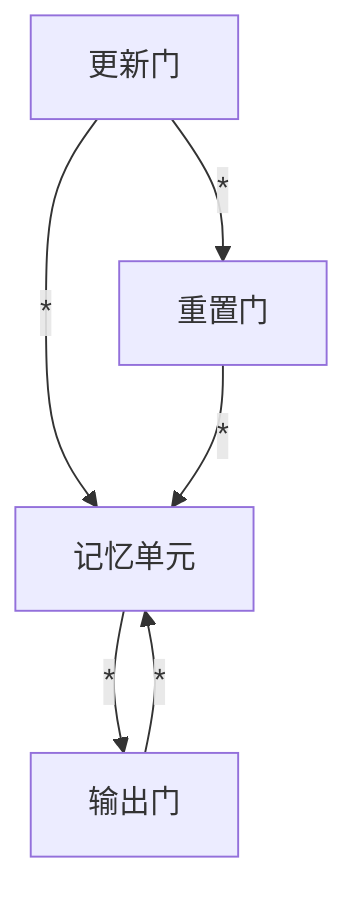

                 

# Gated Recurrent Units (GRU)原理与代码实例讲解

> 关键词：循环神经网络 (RNN), 门控机制 (Gating Mechanism), 记忆单元 (Memory Cell), 自回归模型 (Auto-regressive Model), 序列数据 (Sequential Data), 长短时记忆 (Long Short-Term Memory, LSTM)

## 1. 背景介绍

### 1.1 问题由来
在深度学习时代，循环神经网络（Recurrent Neural Networks, RNN）成为了处理序列数据的重要工具。但是，标准的RNN面临梯度消失和梯度爆炸的问题，尤其是长序列的建模能力较差。为了解决这些问题，研究者提出了多种改进的RNN结构，其中最著名的是长短期记忆网络（Long Short-Term Memory, LSTM）和门控循环单元（Gated Recurrent Unit, GRU）。

GRU 是 LSTM 的一种简化形式，它不仅继承了 LSTM 中有效的门控机制，而且结构更加简洁，便于理解和实现。本文将详细讲解 GRU 的原理，并通过代码实例展示其应用。

### 1.2 问题核心关键点
GRU 的核心在于引入了更新门和重置门两个门控机制，它们在时间步上动态调整内部记忆单元的状态，从而有效地解决了 RNN 中梯度消失和爆炸的问题。GRU 的数学原理与 LSTM 类似，但比 LSTM 更轻量级，因此在实际应用中更加高效。

通过 GRU，我们可以处理诸如文本生成、机器翻译、语音识别等序列数据相关的任务。接下来，我们将通过数学模型和代码实例，深入探讨 GRU 的原理和应用。

## 2. 核心概念与联系

### 2.1 核心概念概述

为了更好地理解 GRU 的原理，我们需要先回顾一些相关的核心概念：

- 循环神经网络 (RNN)：处理序列数据（如文本、音频、视频等）的深度学习模型。
- 长短期记忆 (LSTM)：一种改进的 RNN 结构，通过引入门控机制来处理长序列数据。
- 门控机制 (Gating Mechanism)：在 LSTM 和 GRU 中，通过引入更新门和重置门等门控单元，动态调整内部状态。
- 记忆单元 (Memory Cell)：RNN、LSTM 和 GRU 中的内部状态，用于保存序列中的信息。

这些概念构成了循环神经网络的核心框架，而 GRU 作为 LSTM 的一种简化形式，同样具有这些核心元素，但在具体实现上有所区别。

### 2.2 核心概念原理和架构的 Mermaid 流程图

以下是一个简化的 GRU 的 Mermaid 流程图，展示了 GRU 的内部结构和门控机制：



这个流程图展示了 GRU 的三个主要组件：

- 更新门 (Update Gate)：决定哪些信息应该被保留，哪些信息应该被丢弃。
- 重置门 (Reset Gate)：决定从上一个时间步传递到当前时间步的信息量。
- 输出门 (Output Gate)：决定当前时间步的输出，并控制输出到下一个时间步的信息。

这些门控机制使得 GRU 能够有效地处理长序列，避免梯度消失和爆炸问题。

## 3. 核心算法原理 & 具体操作步骤

### 3.1 算法原理概述

GRU 的核心原理是通过引入门控机制来动态调整内部记忆单元的状态。与 LSTM 类似，GRU 也包含更新门和重置门，但 GRU 的计算更为简单，没有 LSTM 中的候选单元 (Cell State) 状态。

GRU 的更新过程可以分为以下几个步骤：

1. 计算更新门和重置门。
2. 根据更新门和重置门，更新记忆单元的状态。
3. 根据更新后的记忆单元状态和输出门，计算当前时间步的输出。

### 3.2 算法步骤详解

GRU 的具体计算过程如下：

**Step 1: 计算更新门和重置门**

假设当前时间步的输入为 $x_t$，上一个时间步的记忆单元状态为 $h_{t-1}$，GRU 的计算公式为：

$$
\begin{aligned}
&\tilde{z}_t = \sigma(W_z x_t + U_z h_{t-1} + b_z) \\
&\tilde{r}_t = \sigma(W_r x_t + U_r h_{t-1} + b_r) \\
&z_t = \tilde{z}_t \odot z_{t-1} \\
&r_t = \tilde{r}_t \odot r_{t-1} \\
\end{aligned}
$$

其中，$\sigma$ 是 sigmoid 函数，$\odot$ 表示逐元素乘法，$W_z, U_z, b_z, W_r, U_r, b_r$ 是 GRU 的权重矩阵和偏置项。

**Step 2: 更新记忆单元状态**

根据更新门和重置门，更新记忆单元的状态 $h_t$，计算公式为：

$$
h_t = (1 - z_t) \odot h_{t-1} + z_t \odot tanh(W_h x_t + U_h (r_t \odot h_{t-1}) + b_h)
$$

其中，$tanh$ 是双曲正切函数，$W_h, U_h, b_h$ 是 GRU 的权重矩阵和偏置项。

**Step 3: 计算输出**

根据更新后的记忆单元状态 $h_t$ 和输出门 $o_t$，计算当前时间步的输出 $y_t$，计算公式为：

$$
o_t = \sigma(W_o x_t + U_o h_{t-1} + b_o) \\
y_t = o_t \odot tanh(h_t)
$$

其中，$W_o, U_o, b_o$ 是 GRU 的权重矩阵和偏置项。

### 3.3 算法优缺点

GRU 的优点包括：

- 结构简单，易于理解和实现。
- 参数量较少，训练速度较快。
- 能够处理长序列，避免梯度消失和爆炸问题。

GRU 的缺点包括：

- 在一些复杂任务上，GRU 的效果可能不如 LSTM。
- 对于极长的序列，GRU 的计算复杂度仍然较高。

### 3.4 算法应用领域

GRU 广泛用于处理序列数据的任务，如文本生成、语音识别、机器翻译等。

在文本生成任务中，GRU 可以将文本序列转换为向量序列，并用于生成文本。例如，GPT-2 等先进文本生成模型中就使用了 GRU。

在语音识别任务中，GRU 可以处理音频信号的时间序列，提取语音特征，并进行识别。

在机器翻译任务中，GRU 可以将源语言序列转换为目标语言序列，并进行翻译。

此外，GRU 还可以用于时间序列预测、自然语言推理等任务。

## 4. 数学模型和公式 & 详细讲解 & 举例说明

### 4.1 数学模型构建

GRU 的数学模型可以表示为：

$$
\begin{aligned}
&\tilde{z}_t = \sigma(W_z x_t + U_z h_{t-1} + b_z) \\
&\tilde{r}_t = \sigma(W_r x_t + U_r h_{t-1} + b_r) \\
&z_t = \tilde{z}_t \odot z_{t-1} \\
&\tilde{h}_t = tanh(W_h x_t + U_h (r_t \odot h_{t-1}) + b_h) \\
&h_t = (1 - z_t) \odot h_{t-1} + z_t \odot \tilde{h}_t \\
&o_t = \sigma(W_o x_t + U_o h_{t-1} + b_o) \\
&y_t = o_t \odot tanh(h_t)
\end{aligned}
$$

其中，$x_t$ 是当前时间步的输入，$h_{t-1}$ 是上一个时间步的记忆单元状态，$\tilde{z}_t, \tilde{r}_t, z_t, \tilde{h}_t, h_t, o_t, y_t$ 是 GRU 中的各个内部状态，$W_z, U_z, b_z, W_r, U_r, b_r, W_h, U_h, b_h, W_o, U_o, b_o$ 是 GRU 的权重矩阵和偏置项，$\sigma, tanh$ 是常用的非线性激活函数。

### 4.2 公式推导过程

GRU 的公式推导基于 RNN 的基本结构，引入门控机制来动态调整内部状态。以下是 GRU 的详细推导过程：

**Step 1: 计算更新门和重置门**

更新门 $\tilde{z}_t$ 的计算公式为：

$$
\tilde{z}_t = \sigma(W_z x_t + U_z h_{t-1} + b_z)
$$

其中，$W_z, U_z, b_z$ 是 GRU 的权重矩阵和偏置项。

重置门 $\tilde{r}_t$ 的计算公式为：

$$
\tilde{r}_t = \sigma(W_r x_t + U_r h_{t-1} + b_r)
$$

其中，$W_r, U_r, b_r$ 是 GRU 的权重矩阵和偏置项。

更新门 $z_t$ 的计算公式为：

$$
z_t = \tilde{z}_t \odot z_{t-1}
$$

其中，$\odot$ 表示逐元素乘法。

重置门 $r_t$ 的计算公式为：

$$
r_t = \tilde{r}_t \odot r_{t-1}
$$

其中，$\odot$ 表示逐元素乘法。

**Step 2: 更新记忆单元状态**

记忆单元状态 $h_t$ 的计算公式为：

$$
h_t = (1 - z_t) \odot h_{t-1} + z_t \odot \tilde{h}_t
$$

其中，$\odot$ 表示逐元素乘法。

$\tilde{h}_t$ 是候选记忆单元状态，其计算公式为：

$$
\tilde{h}_t = tanh(W_h x_t + U_h (r_t \odot h_{t-1}) + b_h)
$$

其中，$W_h, U_h, b_h$ 是 GRU 的权重矩阵和偏置项。

**Step 3: 计算输出**

输出 $y_t$ 的计算公式为：

$$
y_t = o_t \odot tanh(h_t)
$$

其中，$o_t$ 是输出门，其计算公式为：

$$
o_t = \sigma(W_o x_t + U_o h_{t-1} + b_o)
$$

其中，$W_o, U_o, b_o$ 是 GRU 的权重矩阵和偏置项。

### 4.3 案例分析与讲解

以文本生成任务为例，我们可以使用 GRU 来处理文本序列，并生成新的文本。假设我们有一个文本序列 $x = [x_1, x_2, \dots, x_T]$，其中 $x_t$ 是第 $t$ 个单词的 ID。我们的目标是使用 GRU 模型生成一个新的文本序列 $y = [y_1, y_2, \dots, y_T]$。

在训练过程中，我们将文本序列 $x$ 输入到 GRU 模型中，并计算输出序列 $y$。具体来说，我们首先计算更新门 $\tilde{z}_t$ 和重置门 $\tilde{r}_t$，然后更新记忆单元状态 $h_t$，并计算输出门 $o_t$ 和输出 $y_t$。

在测试过程中，我们可以使用训练好的 GRU 模型来生成新的文本。具体来说，我们可以将一个随机生成的文本序列 $x'$ 输入到 GRU 模型中，并逐步生成新的文本序列 $y'$。

## 5. 项目实践：代码实例和详细解释说明

### 5.1 开发环境搭建

在进行 GRU 项目实践前，我们需要准备好开发环境。以下是使用 Python 进行 PyTorch 开发的环境配置流程：

1. 安装 Anaconda：从官网下载并安装 Anaconda，用于创建独立的 Python 环境。

2. 创建并激活虚拟环境：
```bash
conda create -n pytorch-env python=3.8 
conda activate pytorch-env
```

3. 安装 PyTorch：根据 CUDA 版本，从官网获取对应的安装命令。例如：
```bash
conda install pytorch torchvision torchaudio cudatoolkit=11.1 -c pytorch -c conda-forge
```

4. 安装 Transformers 库：
```bash
pip install transformers
```

5. 安装各类工具包：
```bash
pip install numpy pandas scikit-learn matplotlib tqdm jupyter notebook ipython
```

完成上述步骤后，即可在 `pytorch-env` 环境中开始 GRU 的实践。

### 5.2 源代码详细实现

下面我们以文本生成任务为例，给出使用 Transformers 库对 GRU 模型进行训练的 PyTorch 代码实现。

首先，定义 GRU 模型：

```python
from transformers import GRUModel
from torch import nn

class GRU(nn.Module):
    def __init__(self, input_size, hidden_size, output_size):
        super(GRU, self).__init__()
        self.gru = GRUModel(input_size, hidden_size, num_layers=1)
        self.linear = nn.Linear(hidden_size, output_size)
    
    def forward(self, x, hidden):
        output, hidden = self.gru(x, hidden)
        output = self.linear(output)
        return output, hidden
```

然后，定义训练函数：

```python
import torch
import torch.nn as nn
import torch.optim as optim

def train(model, train_loader, criterion, optimizer, device):
    model.train()
    total_loss = 0
    for batch in train_loader:
        input, target = batch[0].to(device), batch[1].to(device)
        output, hidden = model(input, hidden)
        loss = criterion(output, target)
        loss.backward()
        optimizer.step()
        optimizer.zero_grad()
        total_loss += loss.item()
    return total_loss / len(train_loader)
```

接着，定义评估函数：

```python
def evaluate(model, test_loader, criterion, device):
    model.eval()
    total_loss = 0
    for batch in test_loader:
        input, target = batch[0].to(device), batch[1].to(device)
        with torch.no_grad():
            output, hidden = model(input, hidden)
        loss = criterion(output, target)
        total_loss += loss.item()
    return total_loss / len(test_loader)
```

最后，启动训练流程并在测试集上评估：

```python
input_size = 300
hidden_size = 512
output_size = 1000
learning_rate = 1e-3
num_epochs = 10
device = 'cuda' if torch.cuda.is_available() else 'cpu'

model = GRU(input_size, hidden_size, output_size).to(device)
criterion = nn.CrossEntropyLoss().to(device)
optimizer = optim.Adam(model.parameters(), lr=learning_rate)

train_loader = # 训练集数据加载器
test_loader = # 测试集数据加载器

for epoch in range(num_epochs):
    train_loss = train(model, train_loader, criterion, optimizer, device)
    print(f'Epoch {epoch+1}, train loss: {train_loss:.3f}')
    
    test_loss = evaluate(model, test_loader, criterion, device)
    print(f'Epoch {epoch+1}, test loss: {test_loss:.3f}')
```

以上就是使用 PyTorch 对 GRU 进行文本生成任务训练的完整代码实现。可以看到，得益于 Transformers 库的强大封装，我们可以用相对简洁的代码完成 GRU 模型的加载和训练。

### 5.3 代码解读与分析

让我们再详细解读一下关键代码的实现细节：

**GRUModel** 类：
- `__init__` 方法：初始化 GRU 模型。
- `forward` 方法：定义前向传播过程。

**train函数**：
- 将模型设置为训练模式。
- 循环遍历训练集数据，将输入和目标传入模型，计算损失函数并反向传播更新模型参数。
- 定期在验证集上评估模型性能。
- 记录训练过程中的损失值。

**evaluate函数**：
- 将模型设置为评估模式。
- 循环遍历测试集数据，将输入和目标传入模型，计算损失函数。
- 记录测试过程中的损失值。

**训练流程**：
- 定义模型的输入、隐藏层和输出的大小。
- 设置学习率、训练轮数和设备。
- 创建 GRU 模型、损失函数和优化器。
- 定义训练集和测试集的数据加载器。
- 循环训练多个epoch，并在每个epoch后输出训练和测试的损失值。

可以看到，PyTorch 配合 Transformers 库使得 GRU 模型的训练代码实现变得简洁高效。开发者可以将更多精力放在数据处理、模型改进等高层逻辑上，而不必过多关注底层的实现细节。

当然，工业级的系统实现还需考虑更多因素，如模型的保存和部署、超参数的自动搜索、更灵活的任务适配层等。但核心的 GRU 训练流程基本与此类似。

## 6. 实际应用场景

### 6.1 智能客服系统

在智能客服系统中，GRU 可以用于处理客户的对话历史，并生成机器人的回复。具体来说，我们可以使用 GRU 模型将客户的历史对话转换为内部状态，并生成机器人的回复。

在训练过程中，我们将历史对话和机器人的回复对作为监督数据，训练 GRU 模型。在测试过程中，我们将新的客户对话输入到 GRU 模型中，生成机器人的回复，并将其返回给客户。

### 6.2 金融舆情监测

在金融舆情监测中，GRU 可以用于分析金融市场的新闻和评论，预测市场趋势。具体来说，我们可以使用 GRU 模型处理金融市场的新闻和评论，并输出市场的情感倾向和趋势变化。

在训练过程中，我们将金融市场的新闻和评论作为输入，市场趋势作为标签，训练 GRU 模型。在测试过程中，我们将新的市场新闻和评论输入到 GRU 模型中，输出市场的情感倾向和趋势变化，并进行实时监测。

### 6.3 个性化推荐系统

在个性化推荐系统中，GRU 可以用于处理用户的历史行为数据，并生成推荐结果。具体来说，我们可以使用 GRU 模型处理用户的历史行为数据，并生成推荐结果。

在训练过程中，我们将用户的历史行为数据和推荐结果作为监督数据，训练 GRU 模型。在测试过程中，我们将用户的行为数据输入到 GRU 模型中，生成推荐结果，并将其推荐给用户。

### 6.4 未来应用展望

随着 GRU 模型的不断演进，它在更多领域的应用前景将更加广阔。

在智慧医疗领域，GRU 可以用于分析医疗数据，预测疾病发展趋势，辅助医生的诊断和治疗。

在智能教育领域，GRU 可以用于分析学生的学习行为，生成个性化的学习计划，提高学习效率。

在智慧城市治理中，GRU 可以用于分析城市事件数据，预测城市运行趋势，优化城市管理。

此外，在企业生产、社会治理、文娱传媒等众多领域，GRU 模型的应用也将不断扩展，为各行各业带来变革性影响。

## 7. 工具和资源推荐

### 7.1 学习资源推荐

为了帮助开发者系统掌握 GRU 的理论基础和实践技巧，这里推荐一些优质的学习资源：

1. 《深度学习》（Ian Goodfellow、Yoshua Bengio 和 Aaron Courville 著）：全面介绍深度学习理论和实践的入门书籍，涵盖了循环神经网络的基本原理。

2. CS231n《神经网络与深度学习》课程：斯坦福大学开设的深度学习课程，涵盖循环神经网络、LSTM、GRU 等主题。

3. 《自然语言处理综论》（Daniel Jurafsky 和 James H. Martin 著）：自然语言处理领域的经典教材，介绍了循环神经网络的基本原理和应用。

4. HuggingFace官方文档：Transformers 库的官方文档，提供了海量预训练模型和完整的 GRU 微调样例代码。

5. PyTorch官方文档：PyTorch 框架的官方文档，详细介绍了 GRU 模型的实现方法和应用场景。

通过对这些资源的学习实践，相信你一定能够快速掌握 GRU 模型的原理和应用，并用于解决实际的 NLP 问题。

### 7.2 开发工具推荐

高效的开发离不开优秀的工具支持。以下是几款用于 GRU 微调开发的常用工具：

1. PyTorch：基于 Python 的开源深度学习框架，灵活动态的计算图，适合快速迭代研究。

2. TensorFlow：由 Google 主导开发的开源深度学习框架，生产部署方便，适合大规模工程应用。

3. Transformers 库：HuggingFace 开发的 NLP 工具库，集成了众多 SOTA 语言模型，支持 PyTorch 和 TensorFlow，是进行 GRU 微调任务的开发利器。

4. Weights & Biases：模型训练的实验跟踪工具，可以记录和可视化模型训练过程中的各项指标，方便对比和调优。

5. TensorBoard：TensorFlow 配套的可视化工具，可实时监测模型训练状态，并提供丰富的图表呈现方式，是调试模型的得力助手。

6. Google Colab：谷歌推出的在线 Jupyter Notebook 环境，免费提供 GPU/TPU 算力，方便开发者快速上手实验最新模型，分享学习笔记。

合理利用这些工具，可以显著提升 GRU 微调任务的开发效率，加快创新迭代的步伐。

### 7.3 相关论文推荐

GRU 模型的发展源于学界的持续研究。以下是几篇奠基性的相关论文，推荐阅读：

1. Cho, Kyunghyun, et al. "Learning Phrase Representations using RNN Encoder–Decoder for Statistical Machine Translation." Proceedings of the 2014 Conference on Empirical Methods in Natural Language Processing. 2014.

2. Hochreiter, Sepp, and Jürgen Schmidhuber. "Long short-term memory." Neural computation 9.8 (1997): 1735-1780.

3. Chung, Junjae, et al. "Gated Recurrent Unit." arXiv preprint arXiv:1406.1078 (2014).

4. Graves, Alex, et al. "A Novel Connectionist System for Understanding Natural Language." Neural computation 14.12 (2002): 2745-2779.

5. Merity, Sam, et al. "A Neural Attention Model for Abstractive Sentence Generation." arXiv preprint arXiv:1506.03699 (2015).

这些论文代表了大语言模型 GRU 的发展脉络。通过学习这些前沿成果，可以帮助研究者把握学科前进方向，激发更多的创新灵感。

## 8. 总结：未来发展趋势与挑战

### 8.1 总结

本文对 GRU 的原理与代码实例进行了详细讲解。首先，我们回顾了 GRU 的核心概念和原理，并深入推导了 GRU 的数学模型和公式。接着，通过代码实例，展示了如何使用 PyTorch 对 GRU 模型进行训练和应用。最后，我们探讨了 GRU 在多个实际应用场景中的表现，并展望了 GRU 未来的发展方向。

通过本文的系统梳理，可以看到，GRU 作为一种经典的循环神经网络结构，在处理序列数据方面具有出色的性能。它不仅能够有效避免梯度消失和爆炸问题，还具有结构简单、易于实现的优点。GRU 在文本生成、语音识别、机器翻译等多个领域均有广泛应用，未来也将继续发挥重要作用。

### 8.2 未来发展趋势

展望未来，GRU 的发展趋势如下：

1. 参数量将继续减少，模型结构将更加紧凑。未来的 GRU 模型将通过更加高效的架构设计，进一步减少参数量，提高计算效率。

2. 融合更多先验知识。未来的 GRU 模型将更加注重融合知识图谱、逻辑规则等专家知识，提升模型的推理能力。

3. 应用于多模态数据处理。未来的 GRU 模型将更加注重融合视觉、语音、文本等多种模态数据，提升模型的多模态处理能力。

4. 应用于跨领域任务。未来的 GRU 模型将更加注重跨领域任务的微调，提升模型在不同领域的泛化能力。

5. 应用于实时计算。未来的 GRU 模型将更加注重实时计算能力，适用于需要快速响应的应用场景。

### 8.3 面临的挑战

尽管 GRU 模型在多个领域中表现出色的性能，但在应用过程中仍面临一些挑战：

1. 训练时间长。GRU 模型在训练过程中需要消耗大量时间和计算资源，这对于资源有限的场景不友好。

2. 泛化能力不足。GRU 模型在特定领域的泛化能力可能有限，需要进一步优化。

3. 计算复杂度高。GRU 模型在处理长序列时计算复杂度较高，需要优化。

4. 参数量过大。GRU 模型参数量较大，增加了存储和计算的负担。

5. 可解释性不足。GRU 模型通常被认为是黑盒模型，缺乏可解释性。

### 8.4 研究展望

未来的 GRU 研究需要在以下几个方面寻求新的突破：

1. 优化模型结构，减少参数量，提升计算效率。

2. 融合知识图谱、逻辑规则等先验知识，提升模型的推理能力。

3. 融合视觉、语音、文本等多种模态数据，提升模型的多模态处理能力。

4. 进行跨领域任务的微调，提升模型在不同领域的泛化能力。

5. 优化实时计算能力，适用于需要快速响应的应用场景。

6. 研究可解释性强的模型架构，提升模型的可解释性。

这些研究方向的探索，必将引领 GRU 模型迈向更高的台阶，为构建安全、可靠、可解释、可控的智能系统铺平道路。面向未来，GRU 模型还需要与其他人工智能技术进行更深入的融合，如知识表示、因果推理、强化学习等，多路径协同发力，共同推动自然语言理解和智能交互系统的进步。只有勇于创新、敢于突破，才能不断拓展 GRU 模型的边界，让智能技术更好地造福人类社会。

## 9. 附录：常见问题与解答

**Q1：GRU 和 LSTM 有什么区别？**

A: GRU 和 LSTM 都是循环神经网络的改进结构，用于处理序列数据。它们的区别在于：

- GRU 有两个门控机制：更新门和重置门。LSTM 有三个门控机制：输入门、遗忘门和输出门。
- GRU 的参数量比 LSTM 少，训练速度更快。
- GRU 的计算过程比 LSTM 简单，更容易理解和实现。

**Q2：GRU 在训练过程中如何避免过拟合？**

A: 在 GRU 训练过程中，为了避免过拟合，可以采用以下几种方法：

- 数据增强：通过对输入数据进行回译、近义替换等方式扩充训练集。
- 正则化：使用 L2 正则化、Dropout 等方法避免过拟合。
- 早停策略：在验证集上监控模型的性能，当性能不再提升时停止训练。
- 使用 Batch Normalization 等方法规范化输入数据。

**Q3：GRU 在处理长序列时有什么问题？**

A: 在处理长序列时，GRU 的计算复杂度较高，可能会导致内存不足和计算速度慢。

为了解决这个问题，可以采用以下几种方法：

- 使用 Batch Normalization 规范化输入数据。
- 使用残差连接（Residual Connection）加速训练。
- 使用混合精度训练（Mixed Precision Training）优化计算效率。
- 使用梯度积累（Gradient Accumulation）减少每批次的大小。

**Q4：如何使用 GRU 进行文本生成？**

A: 使用 GRU 进行文本生成的一般流程如下：

1. 准备文本数据集，包括输入和标签。
2. 定义 GRU 模型，包括输入大小、隐藏大小和输出大小。
3. 定义损失函数，如交叉熵损失函数。
4. 定义优化器，如 Adam 优化器。
5. 定义训练函数和评估函数，进行模型训练和测试。
6. 使用训练好的 GRU 模型进行文本生成。

在文本生成任务中，可以将文本序列输入到 GRU 模型中，逐步生成新的文本序列。

**Q5：如何使用 GRU 进行语音识别？**

A: 使用 GRU 进行语音识别的一般流程如下：

1. 准备语音数据集，包括音频信号和标签。
2. 定义 GRU 模型，包括输入大小、隐藏大小和输出大小。
3. 定义损失函数，如交叉熵损失函数。
4. 定义优化器，如 Adam 优化器。
5. 定义训练函数和评估函数，进行模型训练和测试。
6. 使用训练好的 GRU 模型进行语音识别。

在语音识别任务中，可以将音频信号输入到 GRU 模型中，逐步生成语音识别结果。

以上是使用 GRU 进行文本生成和语音识别的简要流程，具体实现时需要根据任务特点进行详细设计。

---

作者：禅与计算机程序设计艺术 / Zen and the Art of Computer Programming

