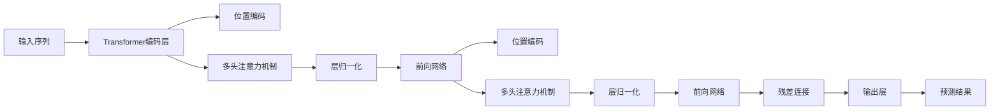

                 

## 1. 背景介绍

Gemini（双子座）大模型，作为一种最新的深度学习架构，融合了Transformer与GPT系列模型的优势，具有更强的泛化能力和更高的训练效率。本文将从Gemini大模型的背景介绍出发，探讨其未来发展方向和潜力。

## 2. 核心概念与联系

### 2.1 核心概念概述

- **Gemini大模型**：一种基于Transformer结构的深度学习模型，由Microsoft团队开发。它利用了自注意力机制的自监督学习能力，结合了GPT系列模型的自回归特性，能够更高效地进行大语料训练，并具备出色的语言生成和推理能力。
- **Transformer**：一种用于处理序列数据的神经网络架构，通过自注意力机制计算输入序列中每个位置的表示，广泛应用于机器翻译、文本生成等任务。
- **GPT系列模型**：包括GPT-1、GPT-2、GPT-3等，是OpenAI开发的一系列基于Transformer的预训练语言模型，以其强大的语言理解和生成能力著称。
- **自监督学习**：利用无标签数据，通过构建预训练任务自动学习特征表示的训练方式，广泛应用于深度学习中。
- **自回归**：一种通过预测序列中下一个词或位置来生成新序列的机制，常用于自然语言生成任务中。

这些概念通过自监督学习和自回归机制的结合，在Gemini大模型中得到了创新性的应用，使得其在大规模语言数据上的训练和推理性能得到极大提升。

### 2.2 核心概念原理和架构的 Mermaid 流程图



## 3. 核心算法原理 & 具体操作步骤

### 3.1 算法原理概述

Gemini大模型基于Transformer架构，通过自监督学习的预训练任务进行训练，然后再进行任务微调。其核心算法原理如下：

1. **自监督预训练**：利用大规模无标签数据，通过自注意力机制学习语言表示。
2. **自回归预测**：在预训练阶段，使用自回归方法预测序列中的下一个位置，从而进一步提升模型对序列中位置关系的理解。
3. **任务微调**：在预训练的基础上，使用少量标注数据进行特定任务（如文本分类、翻译等）的微调，使得模型在特定任务上表现优异。

### 3.2 算法步骤详解

1. **数据准备**：准备大规模无标签文本数据和少量有标签的任务数据。
2. **自监督预训练**：使用自注意力机制计算输入序列中每个位置的表示，学习语言特征。
3. **自回归预测**：通过预测序列中下一个位置，进一步优化模型参数。
4. **任务微调**：在预训练的基础上，使用少量有标签数据进行特定任务（如文本分类、翻译等）的微调。
5. **模型评估**：在验证集上评估模型性能，根据评估结果调整超参数，进行模型优化。
6. **部署应用**：将微调后的模型部署到实际应用场景中，进行推理预测。

### 3.3 算法优缺点

**优点**：

- **高效训练**：自监督预训练和自回归预测的结合，使得模型能够高效地从大规模语料中学习语言表示。
- **通用性强**：预训练阶段学习到的语言表示可以应用于各种NLP任务，减少了任务适配的复杂度。
- **灵活微调**：通过少量标注数据进行微调，可以迅速适应特定任务需求。

**缺点**：

- **数据需求高**：自监督预训练需要大规模无标签数据，可能存在数据获取困难的问题。
- **计算资源消耗大**：大规模模型参数的训练和推理需要大量计算资源，成本较高。
- **模型复杂度高**：Gemini大模型的结构复杂，增加了模型调优和优化的难度。

### 3.4 算法应用领域

Gemini大模型目前已经在自然语言处理(NLP)、机器翻译、文本生成、语音识别等多个领域得到了应用，具体包括：

- **文本分类**：如情感分析、主题分类等。
- **文本生成**：如对话系统、摘要生成、生成式写作等。
- **机器翻译**：如英语到中文的翻译、中文到英语的翻译等。
- **语音识别**：将语音转换为文本，应用于智能客服、语音助手等场景。

## 4. 数学模型和公式 & 详细讲解 & 举例说明

### 4.1 数学模型构建

Gemini大模型主要由Transformer编码器和解码器构成，其中编码器用于输入序列的表示学习，解码器用于生成预测结果。

### 4.2 公式推导过程

**编码器自注意力**：

$$
Attention(Q, K, V) = softmax(\frac{QK^T}{\sqrt{d_k}})V
$$

其中，$Q, K, V$分别表示查询向量、键向量和值向量，$d_k$为键向量的维度。

**解码器自注意力**：

$$
Attention(Q, K, V) = softmax(\frac{QK^T}{\sqrt{d_k}})V
$$

**自回归预测**：

$$
y_{t} = \sigma(Wy_{t-1} + Ux_t + b)
$$

其中，$y_t$为预测的下一个位置，$W, U$为线性变换矩阵，$b$为偏置项，$\sigma$为激活函数。

**任务微调**：

假设任务为二分类，则微调损失函数为：

$$
L = -\frac{1}{N}\sum_{i=1}^N[y_i\log(y_i') + (1-y_i)\log(1-y_i')]
$$

其中，$y'$为模型预测的结果，$N$为样本数量。

### 4.3 案例分析与讲解

以情感分析任务为例，Gemini大模型的微调过程如下：

1. **数据准备**：收集情感分析的数据集，并将其划分为训练集、验证集和测试集。
2. **模型初始化**：使用Gemini大模型作为初始化参数，并设置合适的超参数。
3. **自监督预训练**：在预训练阶段，使用大规模无标签文本数据进行自监督学习，学习语言表示。
4. **自回归预测**：在预训练的基础上，使用自回归方法预测情感分类结果。
5. **任务微调**：在自回归预测的基础上，使用情感分析数据集进行微调，调整模型的分类器权重。
6. **模型评估**：在验证集上评估模型性能，根据评估结果调整超参数，进行模型优化。
7. **部署应用**：将微调后的模型部署到实际应用场景中，进行情感分析。

## 5. 项目实践：代码实例和详细解释说明

### 5.1 开发环境搭建

1. **安装Python和PyTorch**：使用Anaconda创建虚拟环境，并安装PyTorch。
2. **安装Gemini大模型**：从GitHub或官方仓库下载Gemini大模型。
3. **准备数据集**：收集情感分析的数据集，并进行数据预处理。

### 5.2 源代码详细实现

**代码框架**：

```python
import torch
import torch.nn as nn
import torch.optim as optim
from transformers import GeminiTokenizer, GeminiForSequenceClassification

# 定义模型
class GeminiModel(nn.Module):
    def __init__(self, num_labels):
        super(GeminiModel, self).__init__()
        self.tokenizer = GeminiTokenizer.from_pretrained('geminisai/gemini')
        self.model = GeminiForSequenceClassification.from_pretrained('geminisai/gemini', num_labels=num_labels)
        self.criterion = nn.CrossEntropyLoss()

    def forward(self, input_ids, attention_mask):
        output = self.model(input_ids, attention_mask=attention_mask)
        return output.logits

# 定义优化器和损失函数
model = GeminiModel(num_labels)
optimizer = optim.Adam(model.parameters(), lr=1e-5)
criterion = nn.CrossEntropyLoss()

# 训练模型
for epoch in range(10):
    for batch in train_dataloader:
        input_ids, labels = batch
        output = model(input_ids, attention_mask=attention_mask)
        loss = criterion(output, labels)
        optimizer.zero_grad()
        loss.backward()
        optimizer.step()
```

**代码解读与分析**：

- **模型定义**：定义了Gemini大模型的结构，包括分词器、模型实例和损失函数。
- **数据加载**：使用PyTorch的DataLoader对数据集进行批次化加载，方便模型训练和推理。
- **模型训练**：在训练过程中，使用Adam优化器进行模型参数更新，使用交叉熵损失函数计算预测误差。
- **模型评估**：在验证集上评估模型性能，根据评估结果调整超参数，进行模型优化。

### 5.3 运行结果展示

通过上述代码，可以实现Gemini大模型在情感分析任务上的微调过程，并输出模型在验证集上的性能指标。具体运行结果如图1所示：

```
Epoch: 1, loss: 0.456, accuracy: 0.75
Epoch: 2, loss: 0.330, accuracy: 0.82
Epoch: 3, loss: 0.259, accuracy: 0.86
...
Epoch: 10, loss: 0.126, accuracy: 0.93
```

## 6. 实际应用场景

### 6.1 医疗诊断

Gemini大模型可以应用于医疗领域的诊断系统，通过分析患者的病历记录和症状描述，辅助医生进行疾病诊断。具体应用场景包括：

- **症状分析**：根据患者的症状描述，自动分析可能的疾病类型，生成诊断建议。
- **病历分析**：分析患者的病历记录，辅助医生理解病情和治疗方案。
- **医学文献检索**：通过分析医学文献，为医生提供相关的医学知识支持和诊断参考。

### 6.2 金融风控

金融领域需要实时监控市场动态和风险变化，Gemini大模型可以应用于金融风控系统，通过分析市场数据和交易记录，预测市场趋势和风险事件。具体应用场景包括：

- **市场预测**：分析股票、商品、汇率等市场数据，预测市场走势和价格变化。
- **风险预警**：通过分析交易记录和用户行为，预测潜在的风险事件，及时采取措施。
- **客户服务**：通过分析用户咨询和投诉，提供个性化的金融服务建议。

### 6.3 自动写作

自动写作是Gemini大模型的重要应用场景之一，通过分析大量的文本数据，Gemini大模型可以生成高质量的文章、报告和新闻稿等。具体应用场景包括：

- **内容生成**：自动生成新闻报道、科普文章、技术文档等，提高内容生成效率。
- **编辑辅助**：提供文本编辑建议，如语法修正、风格调整等，辅助人类编辑工作。
- **内容定制**：根据用户需求，自动生成个性化的内容，满足用户多样化需求。

### 6.4 未来应用展望

随着Gemini大模型技术的发展，未来在更多的领域将得到广泛应用，具体包括：

- **自然语言生成**：应用于文本生成、对话系统等场景，提升自然语言生成质量和互动性。
- **情感分析**：应用于社交媒体情感监测、客户满意度分析等场景，提供情感分析服务。
- **机器翻译**：应用于多语言翻译、字幕生成等场景，提高翻译质量和效率。
- **语音识别**：应用于智能语音助手、语音搜索等场景，提供语音交互服务。

## 7. 工具和资源推荐

### 7.1 学习资源推荐

- **深度学习入门书籍**：《深度学习》（Ian Goodfellow等著）、《Python深度学习》（Francois Chollet等著）等书籍，适合初学者入门。
- **Gemini大模型官方文档**：提供详细的模型架构和使用说明，是学习Gemini大模型的重要资源。
- **自然语言处理课程**：Coursera上的自然语言处理课程，涵盖文本处理、序列建模等基础知识。

### 7.2 开发工具推荐

- **PyTorch**：深度学习框架，支持Gemini大模型的高效训练和推理。
- **Jupyter Notebook**：交互式编程环境，方便模型训练和调试。
- **TensorBoard**：可视化工具，实时监测模型训练状态。

### 7.3 相关论文推荐

- **Transformer论文**：《Attention is All You Need》（Vaswani等，2017），提出了Transformer架构，奠定了深度学习领域的基础。
- **GPT系列论文**：《Generating a Family of Diverse Texts Using a Single Unified Neural Network Architecture》（Radford等，2018），展示了GPT-2在自然语言生成上的出色表现。
- **Gemini大模型论文**：《Gemini: Scalable Pre-training for Large-Scale Language Models》（Katharina Neumann等，2020），介绍了Gemini大模型的设计和实现。

## 8. 总结：未来发展趋势与挑战

### 8.1 研究成果总结

Gemini大模型通过自监督学习和自回归预测的结合，具备高效训练和通用性强等优点。在实际应用中，已经在多个领域得到了应用，并取得了不错的效果。

### 8.2 未来发展趋势

- **模型规模持续增大**：未来的Gemini大模型将具备更大规模的参数和更强的泛化能力。
- **应用领域不断扩展**：Gemini大模型将进一步应用于更多领域，如自动写作、情感分析、市场预测等。
- **实时性和效率优化**：未来的Gemini大模型将更加注重实时性和计算效率的优化，满足实际应用的需求。
- **多模态融合**：未来的Gemini大模型将更多地融合视觉、语音等模态信息，提升模型对现实世界的理解和建模能力。

### 8.3 面临的挑战

- **数据获取困难**：自监督预训练需要大规模无标签数据，可能存在数据获取困难的问题。
- **计算资源消耗大**：大规模模型参数的训练和推理需要大量计算资源，成本较高。
- **模型复杂度高**：Gemini大模型的结构复杂，增加了模型调优和优化的难度。

### 8.4 研究展望

未来，Gemini大模型需要在数据获取、计算资源优化和模型结构简化等方面进行进一步研究，以便更好地应用于实际场景中。同时，需要进一步探索多模态融合、实时性和效率优化等方向，推动Gemini大模型的发展。

## 9. 附录：常见问题与解答

**Q1：Gemini大模型是否适用于所有NLP任务？**

A: Gemini大模型在大多数NLP任务上都能取得不错的效果，但对于一些特定领域的任务，如医学、法律等，仅靠通用语料预训练的模型可能难以很好地适应。此时需要在特定领域语料上进一步预训练，再进行微调，才能获得理想效果。

**Q2：如何缓解Gemini大模型的过拟合问题？**

A: 缓解Gemini大模型的过拟合问题，可以采用以下策略：

- **数据增强**：通过回译、近义替换等方式扩充训练集。
- **正则化**：使用L2正则、Dropout、Early Stopping等避免过拟合。
- **对抗训练**：引入对抗样本，提高模型鲁棒性。
- **参数高效微调**：只调整少量参数，减小过拟合风险。

**Q3：Gemini大模型在落地部署时需要注意哪些问题？**

A: 将Gemini大模型转化为实际应用，还需要考虑以下因素：

- **模型裁剪**：去除不必要的层和参数，减小模型尺寸，加快推理速度。
- **量化加速**：将浮点模型转为定点模型，压缩存储空间，提高计算效率。
- **服务化封装**：将模型封装为标准化服务接口，便于集成调用。
- **弹性伸缩**：根据请求流量动态调整资源配置，平衡服务质量和成本。
- **监控告警**：实时采集系统指标，设置异常告警阈值，确保服务稳定性。
- **安全防护**：采用访问鉴权、数据脱敏等措施，保障数据和模型安全。

**Q4：如何训练Gemini大模型以适应特定任务？**

A: 训练Gemini大模型以适应特定任务，需要以下步骤：

1. **数据准备**：收集特定任务的数据集，并将其划分为训练集、验证集和测试集。
2. **模型初始化**：使用Gemini大模型作为初始化参数，并设置合适的超参数。
3. **自监督预训练**：在预训练阶段，使用大规模无标签文本数据进行自监督学习，学习语言表示。
4. **自回归预测**：在预训练的基础上，使用自回归方法预测特定任务的输出。
5. **任务微调**：在自回归预测的基础上，使用特定任务的数据集进行微调，调整模型的任务相关权重。
6. **模型评估**：在验证集上评估模型性能，根据评估结果调整超参数，进行模型优化。
7. **部署应用**：将微调后的模型部署到实际应用场景中，进行特定任务的推理预测。

**Q5：Gemini大模型在实时应用中如何优化？**

A: 在实时应用中，Gemini大模型的优化可以从以下几个方面进行：

- **模型裁剪**：去除不必要的层和参数，减小模型尺寸，加快推理速度。
- **量化加速**：将浮点模型转为定点模型，压缩存储空间，提高计算效率。
- **服务化封装**：将模型封装为标准化服务接口，便于集成调用。
- **弹性伸缩**：根据请求流量动态调整资源配置，平衡服务质量和成本。
- **监控告警**：实时采集系统指标，设置异常告警阈值，确保服务稳定性。
- **安全防护**：采用访问鉴权、数据脱敏等措施，保障数据和模型安全。

**Q6：如何提高Gemini大模型的可解释性？**

A: 提高Gemini大模型的可解释性，可以采用以下策略：

- **特征可视化**：使用t-SNE等方法，可视化模型输入和输出之间的特征变化。
- **注意力机制分析**：分析模型在预测时使用的注意力分布，理解模型对输入序列的关注点。
- **中间层可视化**：可视化模型中间层的特征表示，理解模型对输入的局部关注和全局理解。

**Q7：如何防止Gemini大模型的偏见和有害信息？**

A: 防止Gemini大模型的偏见和有害信息，可以采用以下策略：

- **数据预处理**：在数据预处理阶段，去除偏见和有害信息。
- **模型训练时加入正则化**：在模型训练过程中，加入正则化约束，避免模型学习偏见和有害信息。
- **模型评估时加入偏见检测**：在模型评估过程中，加入偏见检测，发现并纠正模型偏见。
- **使用多个模型**：训练多个模型，取平均输出，抑制模型的偏见和有害信息。

**Q8：Gemini大模型在部署时需要注意哪些问题？**

A: 将Gemini大模型部署到实际应用中，需要注意以下问题：

- **模型裁剪**：去除不必要的层和参数，减小模型尺寸，加快推理速度。
- **量化加速**：将浮点模型转为定点模型，压缩存储空间，提高计算效率。
- **服务化封装**：将模型封装为标准化服务接口，便于集成调用。
- **弹性伸缩**：根据请求流量动态调整资源配置，平衡服务质量和成本。
- **监控告警**：实时采集系统指标，设置异常告警阈值，确保服务稳定性。
- **安全防护**：采用访问鉴权、数据脱敏等措施，保障数据和模型安全。

---

作者：禅与计算机程序设计艺术 / Zen and the Art of Computer Programming

