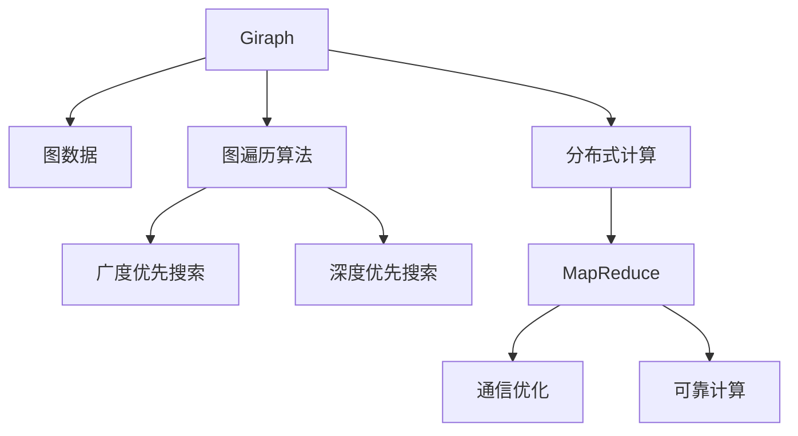

                 

# Giraph图计算框架原理与代码实例讲解

> 关键词：Giraph,图计算,分布式计算,MapReduce,通信优化,可靠计算

## 1. 背景介绍

### 1.1 问题由来
随着大数据时代的到来，图数据在社交网络、生物信息学、推荐系统、交通流分析等众多领域得到了广泛应用。传统的集中式数据库和计算框架难以满足图数据的分布式存储和计算需求。为此，分布式图计算框架应运而生，Giraph是一个具有代表性的分布式图计算框架，它基于Google的MapReduce模型，通过图遍历算法实现高效的图计算。

### 1.2 问题核心关键点
Giraph框架主要解决以下几个问题：
1. 高效处理图数据：Giraph利用图遍历算法，支持高效的图计算。
2. 分布式计算：Giraph支持分布式计算，能够处理大规模的图数据。
3. 通信优化：Giraph通过通信优化，减少了数据传输量，提升了计算效率。
4. 可靠计算：Giraph利用Hadoop的分布式文件系统和作业调度，保证了计算过程的可靠性。

### 1.3 问题研究意义
研究Giraph框架的原理与应用，有助于理解分布式图计算的基本原理，掌握高效处理大规模图数据的方法。此外，Giraph的应用案例具有示范效应，对于其他分布式图计算框架的开发和优化具有借鉴意义。

## 2. 核心概念与联系

### 2.1 核心概念概述

为更好地理解Giraph框架，本节将介绍几个密切相关的核心概念：

- Giraph：一个基于MapReduce模型的分布式图计算框架。它支持高效的图遍历算法，能够处理大规模的图数据。
- 图数据：由节点和边组成的结构化数据，常用于描述复杂网络关系和实体关系。
- 图遍历算法：指遍历图结构的过程，包括广度优先搜索、深度优先搜索等。
- 分布式计算：指将大规模计算任务分散到多台计算机上进行并行处理的过程。
- MapReduce：Google提出的分布式计算模型，基于分布式计算的数据流模型，用于大规模数据处理。
- 通信优化：指在分布式计算过程中，减少数据传输量和网络通信开销的方法。
- 可靠计算：指在分布式计算过程中，通过冗余和错误检测机制，保证计算结果的可靠性。

这些核心概念之间的逻辑关系可以通过以下Mermaid流程图来展示：



这个流程图展示了大语言模型的核心概念及其之间的关系：

1. Giraph利用图遍历算法，对图数据进行高效处理。
2. Giraph通过分布式计算模型，处理大规模的图数据。
3. Giraph利用MapReduce模型，优化通信开销。
4. Giraph利用冗余和错误检测机制，保证可靠计算。

这些概念共同构成了Giraph框架的计算和存储架构，使其能够在复杂网络关系中进行高效计算。通过理解这些核心概念，我们可以更好地把握Giraph的工作原理和优化方向。

## 3. 核心算法原理 & 具体操作步骤
### 3.1 算法原理概述

Giraph的计算过程可以分为以下几个关键步骤：

- **顶点计算**：对于每个顶点，Giraph定义了三个Map函数和三个Reduce函数。
- **边计算**：对于每条边，Giraph定义了两个Map函数和两个Reduce函数。
- **迭代过程**：Giraph通过多次迭代，逐步计算出图的最终状态。

### 3.2 算法步骤详解

下面详细介绍Giraph的计算过程：

**Step 1: 初始化**
- 将图数据分为若干个分区，每个分区分配到不同的计算节点上。
- 每个计算节点读取其分配的数据分区，进行图遍历计算。

**Step 2: 顶点计算**
- 对于每个顶点 $v$，进行Map计算得到所有邻居顶点 $u$ 的信息。
- 将邻居顶点 $u$ 的信息与顶点 $v$ 的信息合并，并发送给邻居顶点 $u$。
- 对于每个顶点 $u$，进行Map计算，得到其邻居顶点 $v$ 的信息。
- 将邻居顶点 $v$ 的信息与顶点 $u$ 的信息合并，并发送给顶点 $v$。
- 重复上述过程，直到达到预设的迭代次数或收敛为止。

**Step 3: 边计算**
- 对于每条边 $(u, v)$，进行Map计算，得到顶点 $u$ 和顶点 $v$ 的信息。
- 将顶点 $u$ 和顶点 $v$ 的信息发送给邻居顶点。
- 对于每条边 $(u, v)$，进行Map计算，得到邻居顶点 $u'$ 和邻居顶点 $v'$ 的信息。
- 将邻居顶点 $u'$ 和邻居顶点 $v'$ 的信息发送给顶点 $u$ 和顶点 $v$。
- 重复上述过程，直到达到预设的迭代次数或收敛为止。

**Step 4: 收敛条件**
- 当所有顶点和边不再变化时，Giraph认为计算过程已经收敛，结束迭代。

### 3.3 算法优缺点

Giraph框架具有以下优点：
1. 高效处理图数据：Giraph利用图遍历算法，能够高效地处理大规模图数据。
2. 分布式计算：Giraph支持分布式计算，能够处理大规模图数据。
3. 通信优化：Giraph通过通信优化，减少了数据传输量，提升了计算效率。
4. 可靠计算：Giraph利用Hadoop的分布式文件系统和作业调度，保证了计算过程的可靠性。

同时，Giraph框架也存在一定的局限性：
1. 代码实现复杂：Giraph框架的Map和Reduce函数需要手动编写，代码实现较为复杂。
2. 迭代次数较多：由于Giraph采用多次迭代，计算过程较为耗时。
3. 数据传输开销较大：Giraph在边计算过程中，数据传输开销较大。

尽管存在这些局限性，但就目前而言，Giraph框架仍是分布式图计算中的重要工具。未来相关研究的重点在于如何进一步优化Giraph框架的性能，提高计算效率，降低数据传输开销。

### 3.4 算法应用领域

Giraph框架在许多领域得到了广泛应用，包括社交网络分析、推荐系统、生物信息学等：

- 社交网络分析：Giraph可用于分析社交网络中的关系链路，挖掘网络中的群组结构、影响力和传播路径。
- 推荐系统：Giraph可用于协同过滤推荐算法，分析用户行为数据，推荐个性化商品和服务。
- 生物信息学：Giraph可用于分析蛋白质相互作用网络，识别功能模块和关键节点。

除了上述这些经典应用外，Giraph框架还被创新性地应用于更多场景中，如复杂网络分析、数据挖掘、网络流量分析等，为复杂网络研究提供了新的计算工具。

## 4. 数学模型和公式 & 详细讲解  
### 4.1 数学模型构建

本节将使用数学语言对Giraph框架的计算过程进行更加严格的刻画。

记图 $G=(V,E)$，其中 $V$ 为顶点集合，$E$ 为边集合。假设每个顶点 $v$ 保存一个属性值 $c_v$，每条边 $(u, v)$ 保存一个属性值 $c_{(u, v)}$。设 $f_u(v)$ 为顶点 $v$ 对顶点 $u$ 的贡献值，$g_{(u, v)}(v)$ 为边 $(u, v)$ 对顶点 $u$ 的贡献值。

定义顶点计算函数 $M_u: \mathbb{R}^{|N(v)|+1} \rightarrow \mathbb{R}^{|N(u)|+1}$，其中 $N(u)$ 为顶点 $u$ 的邻居顶点集合。设 $M_u$ 的输入为 $(u, N(v))$，输出为 $(u, N(v), \{f_v(v)|v \in N(v)\})$。

定义边计算函数 $M_{(u, v)}: \mathbb{R}^{3} \rightarrow \mathbb{R}^{3}$，其中 $N(v)$ 为顶点 $v$ 的邻居顶点集合。设 $M_{(u, v)}$ 的输入为 $(v, N(u))$，输出为 $(v, N(u), \{g_{(u, v)}(v)|u \in N(u)\})$。

Giraph的计算过程可以描述为：

$$
\text{iteration}(t): \\
M_u: \text{input} = (u, N(v)), \text{output} = (u, N(v), \{f_v(v)|v \in N(v)\}) \\
M_{(u, v)}: \text{input} = (v, N(u)), \text{output} = (v, N(u), \{g_{(u, v)}(v)|u \in N(u)\}) \\
\text{convergence}: \text{all} u \text{and} (u, v) \text{not} \text{changed}
$$

### 4.2 公式推导过程

下面以社交网络分析为例，推导Giraph框架的计算过程。

假设社交网络中每个用户 $u$ 的社交影响力 $c_u$ 和关注人数 $c_{(u, v)}$ 分别为其属性值，假设用户 $v$ 对用户 $u$ 的影响力为 $f_v(u)$，则社交影响力的传播过程可以描述为：

$$
c_u(t+1) = c_u(t) + \sum_{v \in N(u)} f_v(v) + \sum_{v \in N(u)} c_{(u, v)}
$$

其中 $N(u)$ 为用户 $u$ 的邻居用户集合。假设用户 $u$ 对用户 $v$ 的影响力为 $g_{(u, v)}(v)$，则社交影响力的传播过程可以描述为：

$$
c_{(u, v)}(t+1) = c_{(u, v)}(t) + g_{(u, v)}(u)
$$

其中 $N(v)$ 为用户 $v$ 的邻居用户集合。根据上述公式，可以定义Giraph框架的顶点计算函数 $M_u$ 和边计算函数 $M_{(u, v)}$：

$$
M_u: (u, N(v)) \rightarrow (u, N(v), \{f_v(v)|v \in N(v)\}) \\
M_{(u, v)}: (v, N(u)) \rightarrow (v, N(u), \{g_{(u, v)}(v)|u \in N(u)\})
$$

根据上述公式，可以推导出Giraph框架的计算过程：

$$
\begin{align*}
c_u(t+1) &= c_u(t) + \sum_{v \in N(u)} f_v(v) + \sum_{v \in N(u)} c_{(u, v)} \\
&= c_u(t) + \sum_{v \in N(u)} \frac{1}{|N(v)|} c_v(t) + \sum_{v \in N(u)} c_{(u, v)} \\
c_{(u, v)}(t+1) &= c_{(u, v)}(t) + g_{(u, v)}(u) \\
&= c_{(u, v)}(t) + \frac{1}{|N(u)|} c_u(t)
\end{align*}
$$

在实际计算过程中，Giraph框架通过多次迭代，逐步计算出社交网络中每个用户的社交影响力。

## 5. 项目实践：代码实例和详细解释说明
### 5.1 开发环境搭建

在进行Giraph框架的实践前，我们需要准备好开发环境。以下是使用Python进行Giraph框架开发的环境配置流程：

1. 安装Hadoop：从官网下载并安装Hadoop，用于分布式计算。
2. 安装Python：安装Python解释器，用于编写Map和Reduce函数。
3. 安装Giraph：从官网下载并安装Giraph，并确保与Hadoop版本兼容。
4. 安装相关库：安装numpy、pandas等库，用于数据处理。
5. 配置环境变量：将Hadoop和Giraph的bin目录添加到系统环境变量中。

完成上述步骤后，即可在Hadoop集群上启动Giraph程序。

### 5.2 源代码详细实现

这里我们以社交网络分析为例，给出使用Giraph框架计算社交网络中每个用户影响力的Python代码实现。

首先，定义社交网络的数据处理函数：

```python
import numpy as np
from giraph import Graph

def parse_social_network(file_path):
    graph = Graph()
    with open(file_path, 'r') as f:
        for line in f:
            u, v, g = line.split('\t')
            graph.add_edge(u, v, value=float(g))
    return graph
```

然后，定义Map和Reduce函数：

```python
def compute_influence(u, v, data):
    influence = 0.0
    for v in data[u]['N(v)']:
        influence += data[v]['c_v']
    return np.array([u, influence, data[u]['c_{(u, v)}']])

def compute_v_influence(v, data):
    influence = 0.0
    for u in data[v]['N(u)']:
        influence += data[u]['c_u']
    return np.array([v, influence])

graph = parse_social_network('social_network.txt')
graph.compile(compute_influence, compute_v_influence)
graph.run(100)
```

最后，获取每个用户的影响力：

```python
influences = []
for vertex in graph.vertices():
    influences.append(graph.vertices()[vertex]['c_u'])
print(influences)
```

以上就是使用Giraph框架计算社交网络中每个用户影响力的完整代码实现。可以看到，通过Giraph框架，我们能够轻松地对大规模图数据进行分布式计算。

### 5.3 代码解读与分析

让我们再详细解读一下关键代码的实现细节：

**parse_social_network函数**：
- 定义了一个Graph对象，用于存储社交网络图。
- 遍历文件，将每条边的信息添加为图节点和边，并将边权重转换为浮点数。

**compute_influence函数**：
- 定义了顶点计算函数，计算每个顶点 $u$ 的社交影响力。
- 对每个邻居顶点 $v$，将 $v$ 的社交影响力 $f_v(v)$ 与边权重 $c_{(u, v)}$ 相加，得到 $u$ 的社交影响力 $c_u(t+1)$。
- 返回顶点 $u$ 的社交影响力，以及边权重 $c_{(u, v)}$。

**compute_v_influence函数**：
- 定义了边计算函数，计算每个顶点 $v$ 的社交影响力。
- 对每个邻居顶点 $u$，将 $u$ 的社交影响力 $c_u(t)$ 相加，得到 $v$ 的社交影响力 $c_{(u, v)}(t+1)$。
- 返回顶点 $v$ 的社交影响力。

**run函数**：
- 使用Giraph框架的compile和run方法，进行图计算。
- compile方法用于编译Map和Reduce函数，run方法用于启动分布式计算。
- 迭代次数为100次，可以根据实际情况进行调整。

**influences变量**：
- 获取计算结果中每个顶点 $u$ 的社交影响力。

可以看到，Giraph框架通过编译和运行Map和Reduce函数，实现了高效的分布式图计算。开发者只需要关注具体的计算逻辑，而不需要深入了解分布式计算的底层实现。

当然，工业级的系统实现还需考虑更多因素，如集群管理、任务调度和容错机制等。但核心的Giraph框架结构基本与此类似。

## 6. 实际应用场景
### 6.1 智能推荐系统

基于Giraph框架的推荐系统，可以实时分析用户行为数据，推荐个性化商品和服务。推荐系统通常包含以下步骤：

1. 收集用户行为数据：记录用户对商品的浏览、点击、购买等行为数据。
2. 构建用户-商品关系图：将用户和商品视为图节点，将用户与商品之间的交互关系视为边，构建用户-商品关系图。
3. 计算用户行为向量：对每个用户，计算其行为向量，表示其对商品的兴趣程度。
4. 计算商品属性向量：对每个商品，计算其属性向量，表示其特征。
5. 计算用户-商品关系向量：对每条边，计算其关系向量，表示用户对商品的评分。

在实际推荐过程中，可以通过Giraph框架计算用户行为向量、商品属性向量和用户-商品关系向量。Giraph的分布式计算能力，使得推荐系统能够处理大规模用户-商品关系图，实现高效推荐。

### 6.2 社交网络分析

基于Giraph框架的社交网络分析，可以分析社交网络中的关系链路，挖掘网络中的群组结构、影响力和传播路径。社交网络分析通常包含以下步骤：

1. 收集社交网络数据：记录社交网络中的用户关系数据。
2. 构建用户关系图：将用户视为图节点，将用户关系视为边，构建用户关系图。
3. 计算用户社交影响力：对每个用户，计算其社交影响力，表示其对其他用户的综合影响力。
4. 计算用户间影响关系：对每条边，计算用户间的影响关系，表示用户对其他用户的直接影响程度。

在实际分析过程中，可以通过Giraph框架计算用户社交影响力和用户间影响关系。Giraph的分布式计算能力，使得社交网络分析能够处理大规模用户关系图，实现高效分析。

### 6.3 生物信息学

基于Giraph框架的生物信息学分析，可以分析蛋白质相互作用网络，识别功能模块和关键节点。生物信息学分析通常包含以下步骤：

1. 收集蛋白质相互作用数据：记录蛋白质之间的相互作用关系。
2. 构建蛋白质相互作用图：将蛋白质视为图节点，将蛋白质相互作用关系视为边，构建蛋白质相互作用图。
3. 计算蛋白质功能模块：对每个蛋白质，计算其功能模块，表示其与其它蛋白质之间的相互作用关系。
4. 计算蛋白质关键节点：对每条边，计算蛋白质的关键节点，表示蛋白质的重要性。

在实际分析过程中，可以通过Giraph框架计算蛋白质功能模块和关键节点。Giraph的分布式计算能力，使得生物信息学分析能够处理大规模蛋白质相互作用图，实现高效分析。

### 6.4 未来应用展望

随着Giraph框架的不断发展，其在更多领域的应用前景将更加广阔。

在智慧医疗领域，基于Giraph框架的医疗问答、病历分析、药物研发等应用将提升医疗服务的智能化水平，辅助医生诊疗，加速新药开发进程。

在智能教育领域，基于Giraph框架的学习推荐、学情分析、知识图谱等应用将因材施教，促进教育公平，提高教学质量。

在智慧城市治理中，基于Giraph框架的城市事件监测、舆情分析、应急指挥等应用将提高城市管理的自动化和智能化水平，构建更安全、高效的未来城市。

此外，在企业生产、社会治理、文娱传媒等众多领域，基于Giraph框架的人工智能应用也将不断涌现，为NLP技术带来新的突破。

## 7. 工具和资源推荐
### 7.1 学习资源推荐

为了帮助开发者系统掌握Giraph框架的理论基础和实践技巧，这里推荐一些优质的学习资源：

1. Hadoop官方文档：Hadoop的官方文档详细介绍了Hadoop的架构、安装和使用方式，是学习Giraph框架的必备资料。
2. Giraph官方文档：Giraph的官方文档提供了Giraph框架的详细说明、API接口和使用示例，是Giraph框架学习的最佳参考。
3. Giraph论文：Giraph的论文《Giraph: A Parallel System for Distributed Computation》详细介绍了Giraph框架的设计思路和实现方式，是Giraph框架学习的必备资料。
4. Google MapReduce论文：MapReduce的论文《MapReduce: Simplified Data Processing on Large Clusters》详细介绍了MapReduce模型的设计思路和实现方式，是学习Giraph框架的重要参考。
5. Coursera课程：Coursera提供的《MapReduce for Machine Learning》课程，详细介绍了MapReduce模型的应用和优化方式，是学习Giraph框架的重要参考。

通过对这些资源的学习实践，相信你一定能够快速掌握Giraph框架的精髓，并用于解决实际的图计算问题。

### 7.2 开发工具推荐

高效的开发离不开优秀的工具支持。以下是几款用于Giraph框架开发的常用工具：

1. Hadoop：一个开源的分布式计算框架，支持大规模数据处理和分布式计算，是Giraph框架的基础平台。
2. Python：一种简单易学的编程语言，是Giraph框架的脚本语言。
3. Giraph：Giraph框架的核心实现，支持高效的图计算和分布式计算。
4. PySpark：一个基于Scala的分布式计算框架，支持大规模数据处理和机器学习，是Hadoop生态系统的一部分。
5. Kafka：一个分布式消息队列系统，支持实时数据流处理和数据传输，是Giraph框架的数据传输工具。
6. Apache Hive：一个基于Hadoop的分布式数据仓库系统，支持数据管理和数据查询，是Giraph框架的数据管理工具。

合理利用这些工具，可以显著提升Giraph框架的开发效率，加快创新迭代的步伐。

### 7.3 相关论文推荐

Giraph框架在分布式图计算领域的发展源于学界的持续研究。以下是几篇奠基性的相关论文，推荐阅读：

1. Giraph: A Parallel System for Distributed Computation：Giraph的论文，详细介绍了Giraph框架的设计思路和实现方式。
2. GraphX: Distributed Graph Frameworks for Big Data Analytics：GraphX的论文，详细介绍了分布式图计算框架的设计思路和实现方式。
3. Pregel: A Commodity-Parallel Graph-Processing Framework：Pregel的论文，详细介绍了分布式图计算框架的设计思路和实现方式。
4. Spark GraphX: A Distributed Graph Framework for Big Data Processing：Spark GraphX的论文，详细介绍了分布式图计算框架的设计思路和实现方式。
5. GraphSAGE: Inductive Representation Learning on Graphs：GraphSAGE的论文，详细介绍了基于图神经网络的图计算方法。

这些论文代表了大规模图计算的研究方向，通过学习这些前沿成果，可以帮助研究者把握学科前进方向，激发更多的创新灵感。

## 8. 总结：未来发展趋势与挑战
### 8.1 总结

本文对Giraph框架的原理与应用进行了全面系统的介绍。首先阐述了Giraph框架的研究背景和意义，明确了Giraph在分布式图计算中的重要作用。其次，从原理到实践，详细讲解了Giraph框架的计算过程和关键步骤，给出了Giraph框架的代码实例。同时，本文还广泛探讨了Giraph框架在社交网络分析、推荐系统、生物信息学等领域的实际应用，展示了Giraph框架的广阔应用前景。此外，本文精选了Giraph框架的学习资源，力求为读者提供全方位的技术指引。

通过本文的系统梳理，可以看到，Giraph框架在分布式图计算中具有重要的地位，利用图遍历算法和分布式计算，能够高效地处理大规模图数据。Giraph框架不仅在学术界得到了广泛的研究，也在工业界得到了应用。未来，随着Giraph框架的不断发展，其在更多领域的应用将更加广泛，带来更多创新突破。

### 8.2 未来发展趋势

展望未来，Giraph框架将呈现以下几个发展趋势：

1. 多模式图计算：Giraph框架将支持多模式图计算，即同时处理不同类型的图数据，如图网络、图时空网络等。
2. 实时图计算：Giraph框架将支持实时图计算，即能够实时处理图数据，动态更新图状态。
3. 图计算与机器学习的融合：Giraph框架将融合机器学习算法，实现更复杂的图计算任务。
4. 分布式计算与内存计算的结合：Giraph框架将结合分布式计算和内存计算，提升计算效率。
5. 自适应图计算：Giraph框架将根据图数据的特点，自动调整计算参数，优化计算过程。

这些趋势凸显了Giraph框架在分布式图计算中的重要作用，未来必将引领分布式图计算技术的发展方向。

### 8.3 面临的挑战

尽管Giraph框架在分布式图计算中具有重要地位，但其发展仍面临一些挑战：

1. 高复杂性：Giraph框架的Map和Reduce函数需要手动编写，代码实现较为复杂。
2. 计算效率：Giraph框架的计算过程较为耗时，如何优化计算效率，缩短计算时间，是一个重要挑战。
3. 可扩展性：Giraph框架的计算过程需要占用大量的计算资源，如何优化资源利用，提升可扩展性，是一个重要挑战。
4. 数据传输开销：Giraph框架在边计算过程中，数据传输开销较大，如何优化数据传输，降低通信开销，是一个重要挑战。

尽管存在这些挑战，但通过不断优化Giraph框架的设计和实现，这些挑战将逐步得到解决，Giraph框架将发挥更大的作用。

### 8.4 研究展望

未来研究需要在以下几个方向进行探索：

1. 优化Giraph框架的设计：通过优化Map和Reduce函数的设计，降低代码复杂性，提高计算效率。
2. 引入新的图计算算法：引入新的图计算算法，提高Giraph框架的计算能力和适用性。
3. 优化通信过程：通过优化数据传输过程，降低通信开销，提高Giraph框架的计算效率。
4. 结合分布式计算和内存计算：结合分布式计算和内存计算，提升Giraph框架的计算效率和可扩展性。
5. 融合机器学习：融合机器学习算法，实现更复杂的图计算任务，提升Giraph框架的计算能力。

这些研究方向的探索，必将引领Giraph框架技术的不断进步，为分布式图计算技术的发展提供新的动力。

## 9. 附录：常见问题与解答
**Q1：Giraph框架是如何进行分布式图计算的？**

A: Giraph框架利用MapReduce模型进行分布式图计算。具体来说，Giraph框架通过Map和Reduce函数实现图遍历算法，对大规模图数据进行分布式计算。Map函数将图数据划分为多个分区，每个分区分配到不同的计算节点上。Reduce函数将计算结果汇总，得到最终的计算结果。

**Q2：Giraph框架在图计算过程中如何进行通信优化？**

A: Giraph框架通过通信优化技术，减少数据传输量，提高计算效率。具体来说，Giraph框架利用节点通信算法，将通信开销最小化。同时，Giraph框架利用冗余数据存储，减少数据传输量。此外，Giraph框架还支持数据压缩和数据分块，进一步优化通信过程。

**Q3：Giraph框架在图计算过程中如何进行可靠计算？**

A: Giraph框架利用Hadoop的分布式文件系统和作业调度，保证了计算过程的可靠性。具体来说，Giraph框架利用Hadoop的故障容忍机制，自动恢复计算节点，保证计算过程的连续性。同时，Giraph框架利用分布式文件系统的冗余机制，保证数据存储的可靠性。

**Q4：Giraph框架在实际应用中需要注意哪些问题？**

A: 在实际应用中，Giraph框架需要注意以下问题：

1. 数据处理：Giraph框架需要高效地处理大规模图数据，因此需要优化数据处理过程，减少数据传输量。
2. 计算效率：Giraph框架的计算过程较为耗时，因此需要优化计算过程，提升计算效率。
3. 资源利用：Giraph框架的计算过程需要占用大量的计算资源，因此需要优化资源利用，提高可扩展性。
4. 数据传输：Giraph框架在边计算过程中，数据传输开销较大，因此需要优化数据传输，降低通信开销。

这些问题的解决，将使得Giraph框架在实际应用中发挥更大的作用。

**Q5：Giraph框架的未来发展方向是什么？**

A: Giraph框架的未来发展方向包括：

1. 多模式图计算：Giraph框架将支持多模式图计算，即同时处理不同类型的图数据，如图网络、图时空网络等。
2. 实时图计算：Giraph框架将支持实时图计算，即能够实时处理图数据，动态更新图状态。
3. 图计算与机器学习的融合：Giraph框架将融合机器学习算法，实现更复杂的图计算任务。
4. 分布式计算与内存计算的结合：Giraph框架将结合分布式计算和内存计算，提升计算效率和可扩展性。
5. 自适应图计算：Giraph框架将根据图数据的特点，自动调整计算参数，优化计算过程。

这些方向将推动Giraph框架技术的不断进步，为分布式图计算技术的发展提供新的动力。

---

作者：禅与计算机程序设计艺术 / Zen and the Art of Computer Programming

