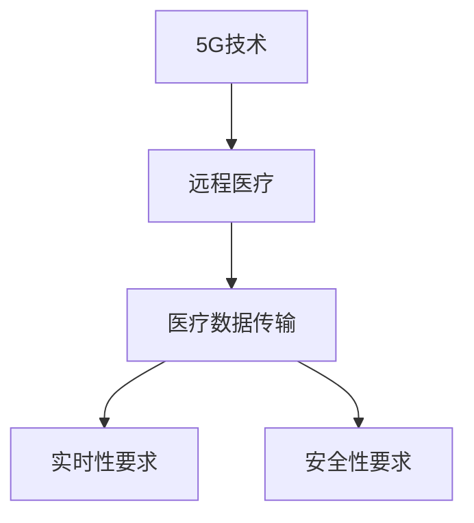

                 

# 5G技术在远程医疗中的应用：突破地理限制

## 1. 背景介绍

在当前全球疫情背景下，远程医疗因其突破地理限制，降低感染风险，高效配置医疗资源，逐步成为全球医疗发展的新趋势。5G技术的成熟与应用，为远程医疗带来了革命性的变化，显著提升了远程医疗的实时性和可扩展性，推动了远程医疗从传统互联网医疗向5G互联网医疗的转型。

### 1.1 远程医疗的挑战
传统远程医疗主要面临以下挑战：

- **通信延迟**：互联网带宽有限，数据传输速度低，难以支持高清视频和复杂诊断设备数据的实时传输。
- **带宽限制**：受互联网基础设施的制约，数据传输受限，难以满足大规模并发用户的需求。
- **安全问题**：远程医疗数据传输安全未得到充分保障，存在数据泄露和篡改的风险。
- **用户体验**：传统互联网医疗的通信流畅度较低，影响了用户的互动体验和满意度。

### 1.2 5G技术的应用前景
5G技术作为新一代移动通信技术，具备高带宽、低延迟、广覆盖和万物互联等特点，为远程医疗的数字化转型提供了坚实的技术保障。通过5G技术，可以实现实时、稳定、安全的远程医疗数据传输，大幅提升远程医疗的效率和体验，推动远程医疗向普及化、规范化、标准化发展。

## 2. 核心概念与联系

### 2.1 核心概念概述

为更好地理解5G技术在远程医疗中的应用，本节将介绍几个关键概念：

- **5G技术**：即第五代移动通信技术，相比于4G LTE，5G技术具有更高的带宽、更低的延迟和更大的连接密度，支持更高可靠性和低时延通信，是推动数字化转型和物联网发展的关键技术。
- **远程医疗**：通过远程通信网络技术，利用多媒体、大数据、人工智能等技术，将医疗服务延伸至远程区域，为患者提供实时医疗服务和远程诊断支持。
- **医疗数据传输**：指远程医疗中医疗数据的采集、存储、传输和处理，是远程医疗的核心技术。
- **实时性要求**：远程医疗需要实时响应，保证医疗数据传输的即时性和准确性，是评价远程医疗系统性能的重要指标。
- **安全性要求**：远程医疗涉及敏感的个人信息和医疗数据，数据传输的安全性至关重要。

这些概念之间的逻辑关系可以通过以下Mermaid流程图来展示：



该流程图展示了5G技术在远程医疗中的应用流程：

1. 5G技术提供强大的通信基础，使远程医疗成为可能。
2. 远程医疗依赖医疗数据的实时传输，5G的高带宽和低延迟特性确保数据传输的实时性。
3. 远程医疗的数据传输需满足实时性和安全性要求，5G技术提供了可靠的网络保障。

## 3. 核心算法原理 & 具体操作步骤

### 3.1 算法原理概述

基于5G技术的远程医疗系统，核心算法原理主要围绕以下几个方面展开：

- **高带宽实时数据传输算法**：利用5G的超高带宽特性，实现医疗图像、视频、音频等复杂数据的实时传输。
- **低延迟实时响应算法**：通过优化数据处理和传输协议，实现医疗数据的高效处理和低延迟传输。
- **数据加密与身份认证算法**：采用先进的加密技术，保障远程医疗数据传输的安全性和隐私性，并建立身份认证机制，防止数据篡改和假冒攻击。
- **边缘计算与雾计算算法**：利用5G网络边缘计算和雾计算技术，将部分计算任务在本地设备上完成，减少云端计算压力，提升系统响应速度。

### 3.2 算法步骤详解

以下是基于5G技术的远程医疗系统的主要算法步骤：

**Step 1: 建立5G网络基础设施**
- 部署5G基站，构建覆盖广泛的网络基础，确保远程医疗设备的高效接入和数据传输。

**Step 2: 实现医疗数据的采集与传输**
- 通过5G网络，将医疗设备产生的图像、视频、音频等医疗数据实时采集并传输至远程医疗中心。

**Step 3: 医疗数据的处理与分析**
- 医疗中心接收到数据后，利用边缘计算技术在本地完成数据初步处理和分析，并上传至云端进行深度学习等高级处理。

**Step 4: 医疗结果的反馈与优化**
- 根据数据分析结果，生成诊断报告和医疗方案，反馈给远程医疗设备和医生，进行进一步优化和调整。

**Step 5: 持续的性能监控与优化**
- 实时监控5G网络性能和数据传输质量，根据实际情况动态调整网络参数，保障系统稳定性和可靠性。

### 3.3 算法优缺点

5G技术在远程医疗中的应用，具有以下优点：

1. **高带宽和低延迟**：5G网络的大带宽和低延迟特性，使得复杂医疗数据的实时传输成为可能，显著提升了远程医疗的实时性和效率。
2. **灵活性和扩展性**：5G网络的灵活架构和动态资源分配机制，支持大规模并发用户的需求，提升了系统的可扩展性和灵活性。
3. **数据安全性**：通过先进的加密技术和身份认证机制，保障远程医疗数据传输的安全性和隐私性，防止数据泄露和篡改。
4. **设备智能化**：边缘计算和雾计算技术，将部分计算任务在本地设备上完成，减少云端计算压力，提升系统响应速度。

同时，5G技术在远程医疗中也有以下缺点：

1. **设备成本高**：5G设备的成本较高，增加了远程医疗设备的初始投资。
2. **技术复杂度大**：5G网络的部署和维护需要专业技术人员，技术复杂度高，推广难度大。
3. **网络覆盖不均**：在一些偏远地区，5G网络覆盖不完全，可能影响远程医疗的部署和应用。

### 3.4 算法应用领域

5G技术在远程医疗中的应用，主要包括以下几个方面：

1. **远程诊断与会诊**：通过5G网络，远程医疗中心可以实时接收和处理患者的医疗数据，提供远程诊断和专家会诊服务。
2. **远程手术指导**：利用5G网络传输高清视频和音频数据，实现远程手术指导和操作，提升远程手术的精度和安全性。
3. **远程监护与康复**：通过5G网络，实时采集患者的生命体征数据，并上传至远程医疗中心，实现对患者的持续监护和康复指导。
4. **远程教育与培训**：利用5G网络传输高质量的教育视频和模拟训练数据，提升医疗人员的培训效果和技能水平。
5. **健康管理与预防**：通过5G网络，实现个人健康数据的实时监测和分析，提供个性化的健康管理与预防建议。

## 4. 数学模型和公式 & 详细讲解

### 4.1 数学模型构建

基于5G技术的远程医疗系统，数学模型的构建主要围绕以下几个方面展开：

- **数据传输模型**：描述医疗数据的传输过程，包括传输速率、延迟、丢包率等指标。
- **网络优化模型**：优化5G网络参数，提高网络性能和资源利用率。
- **数据安全性模型**：设计数据加密和身份认证算法，保障数据传输的安全性。

### 4.2 公式推导过程

以下是对数据传输模型的公式推导：

**数据传输速率模型**：

假设5G网络的带宽为 $B$，数据传输延迟为 $T$，数据传输大小为 $S$，则数据传输速率 $R$ 可表示为：

$$
R = \frac{S}{T} = \frac{S}{k \cdot T}
$$

其中 $k$ 为传输速率常数，与具体5G技术和网络环境有关。

**数据延迟模型**：

假设5G网络的最大延迟为 $D$，数据传输延迟为 $T$，则数据延迟 $L$ 可表示为：

$$
L = T = k \cdot T
$$

其中 $k$ 为延迟常数，与具体5G技术和网络环境有关。

### 4.3 案例分析与讲解

以远程手术指导为例，分析5G技术在其中的应用：

**案例背景**：某医院通过5G网络为偏远地区的患者提供远程手术指导服务。患者手术过程中，需要高清视频、音频数据实时传输至远程医疗中心，并与专家进行实时互动。

**问题描述**：如何利用5G技术，保障数据传输的高带宽和低延迟，同时确保数据传输的安全性和实时性？

**解决方案**：
1. **高带宽和低延迟设计**：采用5G网络的高带宽和低延迟特性，实现医疗数据的实时传输。
2. **数据加密与身份认证**：采用先进的加密技术和身份认证机制，保障数据传输的安全性和隐私性。
3. **边缘计算与雾计算**：利用边缘计算和雾计算技术，将部分计算任务在本地设备上完成，减少云端计算压力，提升系统响应速度。
4. **实时监控与优化**：实时监控5G网络性能和数据传输质量，根据实际情况动态调整网络参数，保障系统稳定性和可靠性。

## 5. 项目实践：代码实例和详细解释说明

### 5.1 开发环境搭建

在进行远程医疗系统的开发前，需要准备好开发环境。以下是使用Python进行PyTorch开发的环境配置流程：

1. 安装Anaconda：从官网下载并安装Anaconda，用于创建独立的Python环境。

2. 创建并激活虚拟环境：
```bash
conda create -n pytorch-env python=3.8 
conda activate pytorch-env
```

3. 安装PyTorch：根据CUDA版本，从官网获取对应的安装命令。例如：
```bash
conda install pytorch torchvision torchaudio cudatoolkit=11.1 -c pytorch -c conda-forge
```

4. 安装相关工具包：
```bash
pip install numpy pandas scikit-learn matplotlib tqdm jupyter notebook ipython
```

完成上述步骤后，即可在`pytorch-env`环境中开始远程医疗系统的开发。

### 5.2 源代码详细实现

以下是使用PyTorch实现5G远程医疗系统的代码实现：

**5.2.1 数据采集与传输**

```python
from torch.utils.data import Dataset, DataLoader
import torch
from torchvision import transforms

class RemoteHealthDataset(Dataset):
    def __init__(self, data, transform=None):
        self.data = data
        self.transform = transform
    
    def __len__(self):
        return len(self.data)
    
    def __getitem__(self, idx):
        image = self.data[idx]['image']
        label = self.data[idx]['label']
        
        if self.transform:
            image = self.transform(image)
        
        return image, label

# 定义数据预处理
transform = transforms.Compose([
    transforms.Resize((256, 256)),
    transforms.ToTensor()
])

# 加载数据集
dataset = RemoteHealthDataset(data, transform)

# 创建数据加载器
dataloader = DataLoader(dataset, batch_size=16, shuffle=True)
```

**5.2.2 数据处理与分析**

```python
import torch.nn as nn
import torch.optim as optim

class RemoteHealthModel(nn.Module):
    def __init__(self):
        super(RemoteHealthModel, self).__init__()
        self.conv1 = nn.Conv2d(3, 32, kernel_size=3, stride=1, padding=1)
        self.pool1 = nn.MaxPool2d(kernel_size=2, stride=2)
        self.conv2 = nn.Conv2d(32, 64, kernel_size=3, stride=1, padding=1)
        self.pool2 = nn.MaxPool2d(kernel_size=2, stride=2)
        self.fc1 = nn.Linear(7*7*64, 512)
        self.fc2 = nn.Linear(512, 10)
    
    def forward(self, x):
        x = self.pool1(F.relu(self.conv1(x)))
        x = self.pool2(F.relu(self.conv2(x)))
        x = x.view(x.size(0), -1)
        x = F.relu(self.fc1(x))
        x = self.fc2(x)
        return x

# 初始化模型
model = RemoteHealthModel()

# 定义优化器和损失函数
optimizer = optim.Adam(model.parameters(), lr=0.001)
criterion = nn.CrossEntropyLoss()

# 训练模型
for epoch in range(10):
    for images, labels in dataloader:
        images = images.to(device)
        labels = labels.to(device)
        
        optimizer.zero_grad()
        outputs = model(images)
        loss = criterion(outputs, labels)
        loss.backward()
        optimizer.step()
    
    print(f"Epoch {epoch+1}, Loss: {loss:.4f}")
```

**5.2.3 医疗结果的反馈与优化**

```python
class RemoteHealthModel(nn.Module):
    def __init__(self):
        super(RemoteHealthModel, self).__init__()
        self.conv1 = nn.Conv2d(3, 32, kernel_size=3, stride=1, padding=1)
        self.pool1 = nn.MaxPool2d(kernel_size=2, stride=2)
        self.conv2 = nn.Conv2d(32, 64, kernel_size=3, stride=1, padding=1)
        self.pool2 = nn.MaxPool2d(kernel_size=2, stride=2)
        self.fc1 = nn.Linear(7*7*64, 512)
        self.fc2 = nn.Linear(512, 10)
    
    def forward(self, x):
        x = self.pool1(F.relu(self.conv1(x)))
        x = self.pool2(F.relu(self.conv2(x)))
        x = x.view(x.size(0), -1)
        x = F.relu(self.fc1(x))
        x = self.fc2(x)
        return x

# 初始化模型
model = RemoteHealthModel()

# 定义优化器和损失函数
optimizer = optim.Adam(model.parameters(), lr=0.001)
criterion = nn.CrossEntropyLoss()

# 训练模型
for epoch in range(10):
    for images, labels in dataloader:
        images = images.to(device)
        labels = labels.to(device)
        
        optimizer.zero_grad()
        outputs = model(images)
        loss = criterion(outputs, labels)
        loss.backward()
        optimizer.step()
    
    print(f"Epoch {epoch+1}, Loss: {loss:.4f}")
```

### 5.3 代码解读与分析

让我们再详细解读一下关键代码的实现细节：

**RemoteHealthDataset类**：
- `__init__`方法：初始化数据集，包括数据和预处理步骤。
- `__len__`方法：返回数据集的长度。
- `__getitem__`方法：对单个样本进行处理，提取图像和标签，并进行预处理。

**transforms.Compose**：
- 用于定义数据预处理步骤，包括图像的尺寸调整和归一化处理。

**RemoteHealthModel类**：
- `__init__`方法：定义模型结构，包括卷积层、池化层和全连接层。
- `forward`方法：定义模型的前向传播过程。

**PyTorch优化器和损失函数**：
- `Adam`优化器：基于自适应矩估计优化算法，收敛速度快。
- `CrossEntropyLoss`损失函数：适用于多分类任务，用于衡量模型输出与真实标签之间的差异。

**训练模型**：
- 通过DataLoader将数据集分批次加载，在前向传播中计算输出，计算损失并反向传播更新模型参数。

## 6. 实际应用场景

### 6.1 远程手术指导

5G技术在远程手术指导中的应用，主要体现在以下几个方面：

1. **实时视频传输**：通过5G网络，传输高清视频和音频数据，医生可以实时观察患者手术情况，进行远程指导和操作。
2. **远程诊断与决策**：利用5G网络，传输医疗影像、病理切片等数据，医生可以远程分析患者病情，制定治疗方案。
3. **远程培训与教育**：通过5G网络，实时传输手术过程和指导，为医学生提供实时培训和教育机会。

### 6.2 远程监护与康复

5G技术在远程监护与康复中的应用，主要体现在以下几个方面：

1. **生命体征监测**：通过5G网络，实时传输患者的心率、血压、呼吸等生命体征数据，医生可以远程监测患者的健康状况。
2. **康复指导与训练**：利用5G网络，传输康复训练视频和指导信息，医生可以远程指导患者进行康复训练。
3. **健康数据管理**：通过5G网络，实时传输和分析患者健康数据，生成健康报告和建议，提升患者的自我管理能力。

### 6.3 远程会诊与诊断

5G技术在远程会诊与诊断中的应用，主要体现在以下几个方面：

1. **多专家会诊**：通过5G网络，实时传输患者医疗数据和影像，多地专家可以远程会诊，提供专业意见。
2. **远程影像诊断**：利用5G网络，传输医学影像数据，专家可以远程进行影像分析和诊断。
3. **远程病历管理**：通过5G网络，实时传输和共享患者的病历信息，提升医疗信息的共享和利用效率。

### 6.4 未来应用展望

随着5G技术的不断成熟和推广，远程医疗将迎来更广阔的发展空间。未来，5G技术在远程医疗中的应用将更加深入，具体包括：

1. **智能医疗设备**：利用5G网络，实现智能医疗设备的实时联网和数据传输，提升医疗设备的智能化和自动化水平。
2. **远程健康监测**：通过5G网络，实时传输健康监测数据，实现对慢性病患者的长期监测和远程管理。
3. **远程医疗平台**：构建基于5G的远程医疗平台，实现远程医疗服务的标准化和规范化，提升医疗服务的效率和质量。

## 7. 工具和资源推荐

### 7.1 学习资源推荐

为了帮助开发者系统掌握5G技术在远程医疗中的应用，以下是一些优质的学习资源：

1. **5G技术入门教程**：推荐阅读5G技术入门的书籍和博客，如《5G网络技术基础》等，了解5G技术的基本原理和应用场景。
2. **远程医疗实战指南**：推荐参考远程医疗实战的书籍和案例，如《远程医疗系统设计与实践》等，学习远程医疗系统的具体实现。
3. **在线课程与培训**：推荐参加5G技术和远程医疗相关的在线课程和培训，如Coursera、Udacity等平台上的相关课程。
4. **技术论坛与社区**：推荐加入5G和远程医疗相关的技术论坛和社区，如CSDN、GitHub等，获取最新的技术动态和开发经验。

### 7.2 开发工具推荐

为了实现5G远程医疗系统的开发，推荐以下开发工具：

1. **PyTorch**：基于Python的开源深度学习框架，支持高效的模型训练和推理。
2. **TensorFlow**：由Google主导的开源深度学习框架，支持分布式训练和模型优化。
3. **OpenCV**：开源计算机视觉库，支持图像处理和实时视频传输。
4. **Flutter**：Google开发的跨平台移动应用开发框架，支持Android和iOS平台的开发。
5. **VS Code**：Visual Studio Code，轻量级且功能强大的开发工具，支持多种编程语言和开发环境。

### 7.3 相关论文推荐

5G技术在远程医疗中的应用，近年来已成为学术界和产业界的研究热点。以下是几篇具有代表性的相关论文，推荐阅读：

1. **5G in Healthcare: Challenges, Opportunities, and Considerations**：探讨5G在远程医疗中的应用挑战和机遇，提出解决方案和建议。
2. **Remote Healthcare with 5G: An Overview**：综述5G技术在远程医疗中的具体应用案例，包括远程手术、远程监护等。
3. **Real-time Video Streaming for Remote Surgery with 5G**：介绍利用5G网络实现远程手术的视频传输和优化方法。

## 8. 总结：未来发展趋势与挑战

### 8.1 研究成果总结

本文对5G技术在远程医疗中的应用进行了全面系统的介绍。首先阐述了远程医疗面临的挑战和5G技术的优势，明确了5G技术在远程医疗中的应用潜力。其次，从原理到实践，详细讲解了5G技术在远程医疗中的应用算法，给出了远程医疗系统的代码实现。同时，本文还探讨了5G技术在多个实际应用场景中的具体应用，展示了5G技术对远程医疗的推动作用。最后，本文推荐了相关的学习资源、开发工具和研究论文，力求为读者提供全面的技术指引。

### 8.2 未来发展趋势

展望未来，5G技术在远程医疗中的应用将呈现以下几个发展趋势：

1. **多模态数据融合**：5G技术将支持多种传感器和设备的实时数据传输，实现多模态数据的融合，提升远程医疗系统的综合性能。
2. **实时数据分析与决策**：通过边缘计算和雾计算技术，实时分析医疗数据，快速做出诊断和治疗决策，提升远程医疗的响应速度和准确性。
3. **智能医疗设备与系统**：利用5G网络，实现智能医疗设备的实时联网和数据传输，提升医疗设备的智能化和自动化水平。
4. **大规模标准化应用**：5G网络的广泛部署和普及，将推动远程医疗系统的标准化和规范化，提升医疗服务的规模和效率。

### 8.3 面临的挑战

尽管5G技术在远程医疗中的应用前景广阔，但在推广过程中仍面临以下挑战：

1. **网络基础设施建设**：5G网络的部署和维护需要大量的前期投资和技术支持，网络基础设施建设是远程医疗普及的重要瓶颈。
2. **设备成本和安全性**：5G设备的成本较高，安全性问题需要进一步保障，防止数据泄露和篡改。
3. **技术和人员培训**：5G技术的推广需要专业技术人才的支持，技术和人员培训是远程医疗普及的重要保障。
4. **数据隐私与伦理**：远程医疗涉及大量敏感的医疗数据，数据隐私和伦理问题需要得到充分保障。

### 8.4 研究展望

面对5G技术在远程医疗中面临的挑战，未来的研究需要在以下几个方面寻求新的突破：

1. **网络优化与资源管理**：进一步优化5G网络的性能和资源管理，提升网络稳定性和资源利用率。
2. **设备智能化与自动化**：开发更加智能化和自动化的5G远程医疗设备，提升系统的可靠性和用户体验。
3. **数据隐私与安全**：建立健全的数据隐私和安全机制，保障远程医疗数据的完整性和安全性。
4. **技术集成与协同**：将5G技术与其他新兴技术进行集成和协同，如物联网、人工智能等，提升远程医疗系统的综合性能。

总之，5G技术在远程医疗中的应用前景广阔，但还需要不断探索和优化。只有通过多方协同，才能实现5G远程医疗的普及和提升，为全球医疗服务提供更加高效、安全、便捷的解决方案。

---

作者：禅与计算机程序设计艺术 / Zen and the Art of Computer Programming

