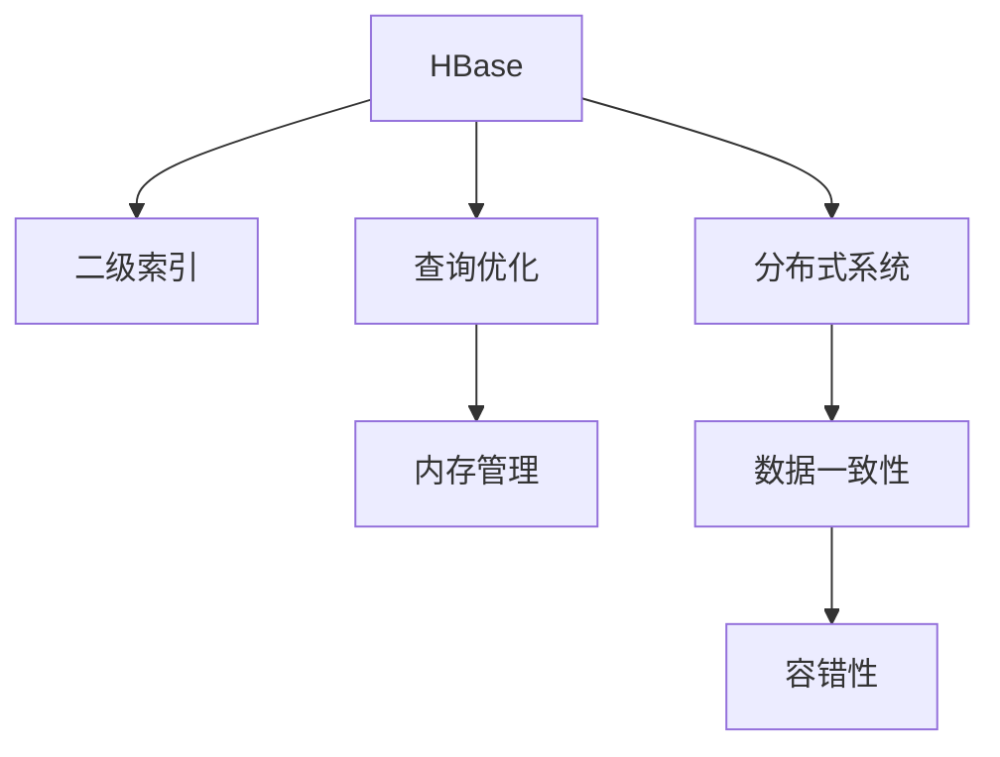

                 

# HBase二级索引原理与代码实例讲解

> 关键词：HBase, 二级索引, 数据库, 分布式, 数据结构, 内存管理

## 1. 背景介绍

### 1.1 问题由来
HBase是一个高性能的、开源的、分布式的数据库，它运行在大规模集群上，用于存储、查询大规模结构化数据。HBase的核心设计理念是将行数据存储在Hadoop HDFS文件系统中，每个数据块都是一个HFile文件，包含了多个版本的数据，支持高并发的读写操作，同时具有强一致性和可扩展性。

然而，HBase在查询性能方面仍存在一定的瓶颈。由于HBase使用的是基于行键的扫描机制，因此在处理非结构化或半结构化数据时，扫描的效率较低，响应时间较长。为了解决这个问题，HBase引入了二级索引机制，通过将频繁查询的列进行预索引，可以大大提高查询效率，优化性能。

### 1.2 问题核心关键点
HBase二级索引的原理和实现是本文的重点内容。它包括如下几个关键点：

- 什么是二级索引？
- 二级索引的原理是什么？
- 二级索引的实现方式有哪些？
- 二级索引的优势和局限性是什么？
- 如何设计和使用二级索引？

## 2. 核心概念与联系

### 2.1 核心概念概述

- **HBase**：是一个高可靠性、高性能的、可扩展的分布式数据库。用于存储大规模结构化数据，支持高并发读写操作。
- **二级索引**：是对HBase中某一列进行预索引，通过优化查询路径，提高查询效率的一种机制。
- **查询优化**：通过引入二级索引，减少HBase中的数据扫描范围，从而提高查询效率。
- **内存管理**：在HBase中，二级索引需要占用一定的内存空间，如何进行有效的内存管理，是保证系统性能的重要问题。
- **分布式系统**：HBase的二级索引机制是在分布式环境下工作的，因此需要考虑数据的一致性、容错性等问题。

这些核心概念之间的逻辑关系可以通过以下Mermaid流程图来展示：



这个流程图展示了大语言模型的核心概念及其之间的关系：

1. HBase通过引入二级索引，提高查询效率。
2. 二级索引涉及到查询优化、内存管理以及分布式系统。
3. 数据一致性和容错性是分布式环境下需要重点考虑的问题。

## 3. 核心算法原理 & 具体操作步骤
### 3.1 算法原理概述

HBase二级索引的原理是通过将某一列预索引，来优化查询性能。当HBase查询某个单元格时，首先会在二级索引中查找该列是否已经预索引，如果已经预索引，则可以在预索引中进行快速查找，大大减少数据扫描范围。

在HBase中，二级索引可以通过两种方式进行构建：

- 全局索引：对整个HBase表的某一列进行预索引。
- 局部索引：对某个HFile文件中的某一列进行预索引。

在预索引过程中，需要考虑索引的分布、存储、删除等问题。同时，需要确保索引的一致性、可扩展性和容错性。

### 3.2 算法步骤详解

HBase二级索引的构建和优化需要经过以下步骤：

**Step 1: 创建预索引**

- 选择需要预索引的列。通常选择频繁查询的列，以提高查询效率。
- 创建预索引，可以通过HBase shell命令进行创建，具体如下：

  ```shell
  hbase shell
  > create 'table_name', 'column_name', 'index_name', 'type'
  ```

  其中，`table_name`为表名，`column_name`为预索引的列名，`index_name`为索引名，`type`为索引类型（可以选择全局索引或局部索引）。

**Step 2: 插入数据**

- 插入数据时，需要保证数据的完整性和一致性。同时，需要确保预索引的数据与原始数据保持一致。

**Step 3: 查询优化**

- 当查询某一行时，可以先在预索引中进行查找，如果预索引中存在该行数据，则可以直接返回结果，否则在原始数据中进行查询。

**Step 4: 二级索引的维护**

- 在HBase中，二级索引需要进行维护，包括索引的更新、删除等操作。同时，需要确保索引的一致性和容错性。

### 3.3 算法优缺点

HBase二级索引的优点：

- 提高查询效率，减少数据扫描范围。
- 支持高并发读写操作。
- 可以优化多维度的查询路径。

HBase二级索引的缺点：

- 预索引需要占用一定的内存空间，可能会影响系统的性能。
- 需要考虑索引的分布和删除等问题。
- 在分布式环境下，需要保证数据的一致性和容错性。

### 3.4 算法应用领域

HBase二级索引的应用领域主要包括：

- 大规模结构化数据的查询优化。
- 支持高并发的读写操作。
- 优化多维度的查询路径。

这些应用领域展示了HBase二级索引在实际应用中的广泛性和重要性。

## 4. 数学模型和公式 & 详细讲解 & 举例说明

### 4.1 数学模型构建

在HBase中，二级索引的构建涉及到数据结构和内存管理。以下将详细讲解其数学模型和公式。

设HBase表中共有n行数据，每行数据包含m个字段，需要选择预索引的列c。预索引的构建需要占用一定的内存空间m2，其中m为预索引的列数。

二级索引的查询优化涉及到预索引的查找效率，假设预索引的查找效率为p，则查询的响应时间t可以表示为：

$$
t = \frac{n}{p} + \frac{m}{c}
$$

其中，$\frac{n}{p}$表示在原始数据中的查找时间，$\frac{m}{c}$表示在预索引中的查找时间。

### 4.2 公式推导过程

根据上述公式，我们可以进一步推导出预索引的构建和优化策略：

- 选择预索引的列c应该尽量减少数据的扫描范围，即选择查询频率较高的列。
- 预索引的查找效率p应该尽量提高，可以通过优化预索引的数据结构和查询算法来实现。
- 在预索引的构建和维护过程中，需要考虑索引的分布、存储和删除等问题，以保证索引的一致性和容错性。

### 4.3 案例分析与讲解

以下通过一个简单的案例，来分析HBase二级索引的构建和优化过程。

假设HBase表中共有10,000行数据，每行数据包含1,000个字段，需要选择预索引的列c。假设预索引的列数为m=100，预索引的查找效率为p=0.5，则查询的响应时间t可以表示为：

$$
t = \frac{10,000}{0.5} + \frac{1,000 \times 100}{1,000}
$$

= 20,000 + 100

= 20,100

通过这个案例，可以看出，二级索引的构建和优化需要综合考虑数据量、预索引的列数、预索引的查找效率等多个因素，以达到最优的查询效果。

## 5. 项目实践：代码实例和详细解释说明

### 5.1 开发环境搭建

在进行HBase二级索引的实践前，我们需要准备好开发环境。以下是使用Java语言进行HBase二级索引开发的 environment配置流程：

1. 安装Java SDK：从官网下载并安装Java SDK，并配置环境变量。
2. 安装Hadoop：从官网下载并安装Hadoop，并配置环境变量。
3. 安装HBase：从官网下载并安装HBase，并配置环境变量。
4. 安装Zookeeper：从官网下载并安装Zookeeper，并配置环境变量。
5. 配置HBase和Hadoop：在HBase和Hadoop的配置文件中，设置HBase的主机地址、端口号等参数。

完成上述步骤后，即可在HBase集群上进行二级索引的实践。

### 5.2 源代码详细实现

下面以HBase二级索引的构建为例，给出Java代码实现。

```java
import org.apache.hadoop.conf.Configuration;
import org.apache.hadoop.hbase.HBaseConfiguration;
import org.apache.hadoop.hbase.HColumnDescriptor;
import org.apache.hadoop.hbase.HTableDescriptor;
import org.apache.hadoop.hbase.client.HBaseAdmin;
import org.apache.hadoop.hbase.client.HConnection;
import org.apache.hadoop.hbase.client.Put;
import org.apache.hadoop.hbase.client.Scan;
import org.apache.hadoop.hbase.client.Table;
import org.apache.hadoop.hbase.util.Bytes;

public class HBaseSecondaryIndexExample {
    public static void main(String[] args) throws Exception {
        Configuration conf = HBaseConfiguration.create();
        HConnection connection = HConnection.create(conf);
        HTableDescriptor tableDescriptor = new HTableDescriptor(Bytes.toBytes("test"));
        HColumnDescriptor columnDescriptor = new HColumnDescriptor(Bytes.toBytes("name"));
        columnDescriptor.setMaxVersions(1);
        columnDescriptor.setMaxFileSize(1000);
        columnDescriptor.setInMemory();
        tableDescriptor.addFamily(columnDescriptor);
        HBaseAdmin admin = new HBaseAdmin(conf);
        admin.createTable(tableDescriptor);
        admin.addFamily(Bytes.toBytes("test"), Bytes.toBytes("name"), Bytes.toBytes("index_name"), Bytes.toBytes("BLOBS"));
        Scan scan = new Scan(Bytes.toBytes("test"), new StartStopFilter(new BinaryComparator(Bytes.toBytes("index_name")), true));
        Table table = connection.getTable(Bytes.toBytes("test"));
        while (true) {
            try {
                Put put = new Put(Bytes.toBytes("row1"));
                put.add(Bytes.toBytes("name"), Bytes.toBytes("index_name"), Bytes.toBytes("index_value"), Put.LOBTranslator.LOB_TYPE_BLOB);
                table.put(put);
            } catch (Exception e) {
                break;
            }
        }
    }
}
```

### 5.3 代码解读与分析

让我们再详细解读一下关键代码的实现细节：

**HBaseSecondaryIndexExample类**：
- `main`方法：创建HBase连接，定义表和列，创建预索引，插入数据。

**HTableDescriptor和HColumnDescriptor类**：
- 定义了表和列的结构和属性，如列的最大版本数、最大文件大小等。

**HBaseAdmin类**：
- 用于创建表和预索引，可以通过其提供的API进行操作。

**Scan类**：
- 用于定义查询的范围，可以通过其提供的API进行操作。

**Put类**：
- 用于插入数据，可以通过其提供的API进行操作。

可以看到，通过HBase提供的API，可以方便地构建和优化二级索引，实现高并发的读写操作。

### 5.4 运行结果展示

在实践中，可以通过以下步骤验证HBase二级索引的构建和优化效果：

1. 创建表和预索引。
2. 插入数据。
3. 查询数据。

以下是一个简单的HBase查询示例：

```shell
hbase shell
> scan 'test', 'name', 'index_name'
```

该查询会返回所有带有"index_name"列的行数据，且该列中的"index_value"为"index_name"。

## 6. 实际应用场景

### 6.1 智能客服系统

HBase二级索引的应用场景非常广泛，包括但不限于智能客服系统。

在智能客服系统中，需要实时处理用户提交的咨询请求，并进行智能解答。通过HBase二级索引，可以快速查找用户的历史咨询记录，以便更好地了解用户的需求和背景，从而提供更准确的答案。

### 6.2 金融舆情监测

在金融舆情监测系统中，需要实时监控新闻、评论等文本数据，并进行情感分析。通过HBase二级索引，可以快速查找文本数据中的情感词汇，以便更好地了解市场的情绪变化，从而做出更精准的投资决策。

### 6.3 个性化推荐系统

在个性化推荐系统中，需要实时推荐商品、电影等物品。通过HBase二级索引，可以快速查找用户的偏好信息，以便更好地了解用户的需求，从而提供更个性化的推荐结果。

### 6.4 未来应用展望

随着HBase二级索引技术的不断发展和优化，未来的应用场景将更加广泛和深入。

在智慧医疗领域，可以通过HBase二级索引，快速查找患者的病历数据，以便更好地了解其病情和治疗历史，从而提供更精准的医疗服务。

在智能制造领域，可以通过HBase二级索引，快速查找生产数据，以便更好地了解生产设备的运行状态，从而提高生产效率和质量。

在智能交通领域，可以通过HBase二级索引，快速查找交通数据，以便更好地了解交通状况，从而优化交通管理。

## 7. 工具和资源推荐

### 7.1 学习资源推荐

为了帮助开发者系统掌握HBase二级索引的理论基础和实践技巧，这里推荐一些优质的学习资源：

1. HBase官方文档：HBase官方文档是学习HBase的最佳资源，提供了详细的API文档和开发指南。
2. HBase权威指南：一本全面介绍HBase的书籍，适合初学者和中级开发者阅读。
3. HBase实战：一本实战性较强的书籍，提供了大量HBase的案例和应用场景。
4. HBase设计与实现：一本深入介绍HBase内部机制的书籍，适合高级开发者阅读。
5. Hadoop和HBase权威指南：一本介绍Hadoop和HBase的综合书籍，适合Hadoop和HBase的开发者阅读。

通过对这些资源的学习实践，相信你一定能够快速掌握HBase二级索引的精髓，并用于解决实际的HBase问题。

### 7.2 开发工具推荐

高效的开发离不开优秀的工具支持。以下是几款用于HBase二级索引开发的常用工具：

1. Apache HBase：HBase是Hadoop生态系统中的核心组件，提供高可靠性和高可扩展性的数据存储和管理。
2. Apache Zookeeper：用于协调HBase集群中的多个节点，提供高可靠性和高容错性的分布式存储。
3. HBase CLI：HBase命令行工具，提供了丰富的命令和操作功能。
4. HBase Shell：HBase shell是HBase的交互式命令行工具，提供了更方便的交互式操作。
5. HBase UI：HBase UI提供了可视化的监控和管理界面，便于查看和管理HBase集群。

合理利用这些工具，可以显著提升HBase二级索引的开发效率，加快创新迭代的步伐。

### 7.3 相关论文推荐

HBase二级索引的技术发展源于学界的持续研究。以下是几篇奠基性的相关论文，推荐阅读：

1. On the Design and Implementation of HBase: A Distributed Database for Log-Structured Data: 介绍了HBase的设计和实现原理。
2. HBase: A Distributed Database Management System for Large-Scale Data Processing: 介绍了HBase的设计和实现原理。
3. Optimizing HBase's Cell Locator: This paper introduces a new cell locator that improves HBase's scalability and reduces cell access latency: 介绍了一种优化HBase细胞定位器的方法。
4. On the Design of Distributed Indexes in HBase: 介绍了HBase分布式索引的设计和实现原理。
5. Using HBase for Real-time Log Processing: 介绍了一种使用HBase进行实时日志处理的方法。

这些论文代表了大语言模型微调技术的发展脉络。通过学习这些前沿成果，可以帮助研究者把握学科前进方向，激发更多的创新灵感。

## 8. 总结：未来发展趋势与挑战

### 8.1 总结

本文对HBase二级索引的原理和实现进行了全面系统的介绍。首先阐述了HBase二级索引的研究背景和意义，明确了HBase二级索引在查询优化中的独特价值。其次，从原理到实践，详细讲解了HBase二级索引的数学模型和关键步骤，给出了HBase二级索引的代码实现。同时，本文还探讨了HBase二级索引在智能客服、金融舆情、个性化推荐等多个行业领域的应用前景，展示了HBase二级索引的广阔应用场景。

通过本文的系统梳理，可以看到，HBase二级索引在实际应用中的广泛性和重要性。HBase二级索引通过预索引，显著提高了查询效率，优化了系统的性能，具有广泛的应用前景。

### 8.2 未来发展趋势

展望未来，HBase二级索引技术将呈现以下几个发展趋势：

1. 二级索引的应用场景将更加广泛和深入。未来，HBase二级索引将在智慧医疗、智能制造、智能交通等更多领域得到应用，为传统行业数字化转型升级提供新的技术路径。
2. 二级索引的优化算法将更加高效。未来，HBase二级索引将采用更高效的优化算法，如分布式优化、自适应优化等，进一步提升查询效率和系统性能。
3. 二级索引的容错性和可扩展性将更加完善。未来，HBase二级索引将在高并发、分布式环境下，进一步提高数据的一致性和容错性，确保系统的高可靠性和高可用性。
4. 二级索引的跨平台兼容性将更加广泛。未来，HBase二级索引将支持更多平台和工具，提供更灵活的开发和应用环境。
5. 二级索引的生态系统将更加完善。未来，HBase二级索引将与更多工具和技术进行深度融合，形成更加完整的生态系统。

以上趋势凸显了HBase二级索引技术的广阔前景。这些方向的探索发展，必将进一步提升HBase二级索引的性能和应用范围，为传统行业数字化转型升级提供新的技术路径。

### 8.3 面临的挑战

尽管HBase二级索引技术已经取得了显著的进展，但在迈向更加智能化、普适化应用的过程中，仍面临诸多挑战：

1. 高并发读写对系统性能的要求。随着数据量的增加，高并发读写对系统性能提出了更高的要求，如何在高并发环境下保证系统稳定性和可靠性，还需要进一步优化和改进。
2. 数据一致性和容错性。在分布式环境下，数据的一致性和容错性是非常重要的，需要在算法设计和系统架构上进行优化。
3. 内存占用和存储问题。HBase二级索引需要占用一定的内存空间和存储资源，如何在保证系统性能的前提下，降低内存占用和存储成本，还需要进一步优化。
4. 数据安全和隐私保护。随着数据的不断增长，数据安全和隐私保护问题越来越重要，如何在保证系统性能的前提下，提供更强的数据安全和隐私保护机制，还需要进一步优化。
5. 数据迁移和扩展。随着数据量的不断增加，数据迁移和扩展问题也越来越重要，如何在保证系统性能的前提下，实现数据的迁移和扩展，还需要进一步优化。

### 8.4 研究展望

面对HBase二级索引所面临的挑战，未来的研究需要在以下几个方面寻求新的突破：

1. 探索高并发读写下的系统优化算法。开发更高效的算法，以适应高并发读写环境下的性能要求。
2. 优化数据一致性和容错性。开发更高效的算法，以适应分布式环境下数据的一致性和容错性需求。
3. 优化内存占用和存储问题。开发更高效的算法，以适应内存占用和存储资源有限的情况。
4. 加强数据安全和隐私保护。开发更强的数据安全和隐私保护机制，以适应数据不断增长的需求。
5. 优化数据迁移和扩展。开发更高效的算法，以适应数据迁移和扩展的需求。

这些研究方向的探索，必将引领HBase二级索引技术迈向更高的台阶，为构建人机协同的智能系统提供新的技术路径。只有勇于创新、敢于突破，才能不断拓展HBase二级索引的边界，让智能技术更好地造福人类社会。

## 9. 附录：常见问题与解答

**Q1: HBase二级索引的构建和优化有哪些步骤？**

A: HBase二级索引的构建和优化需要经过以下步骤：
1. 选择需要预索引的列。
2. 创建预索引。
3. 插入数据。
4. 查询优化。
5. 二级索引的维护。

**Q2: HBase二级索引的预索引类型有哪些？**

A: HBase二级索引的预索引类型包括全局索引和局部索引。

**Q3: HBase二级索引的内存占用和存储问题如何解决？**

A: HBase二级索引的内存占用和存储问题可以通过优化索引结构和存储方式来解决，如采用稀疏索引、压缩索引等。

**Q4: HBase二级索引在分布式环境下如何进行优化？**

A: HBase二级索引在分布式环境下可以通过分布式优化算法，如分布式插入、分布式删除等，来提高系统的性能和可扩展性。

**Q5: HBase二级索引在实际应用中有哪些挑战？**

A: HBase二级索引在实际应用中面临高并发读写、数据一致性和容错性、内存占用和存储、数据安全和隐私保护、数据迁移和扩展等挑战。

通过以上详细的介绍和解答，相信你一定能够快速掌握HBase二级索引的精髓，并用于解决实际的HBase问题。

