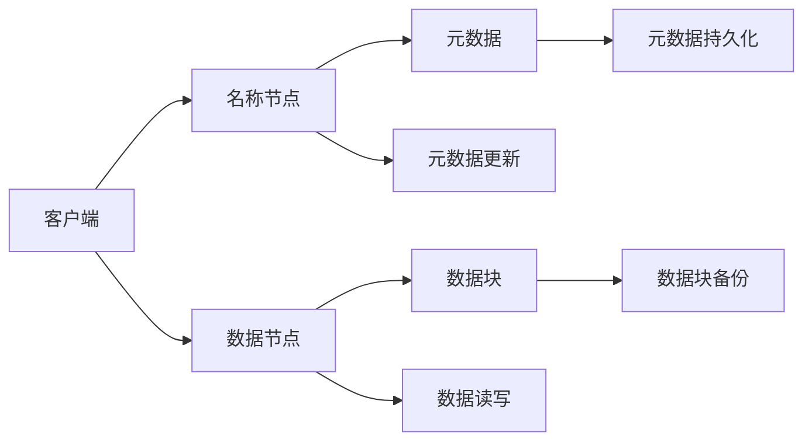

                 

## 1. 背景介绍

HDFS（Hadoop Distributed File System）是Apache Hadoop生态系统的核心组件之一，是处理大规模分布式存储和计算任务的关键基础设施。HDFS设计简洁，易于理解，广泛应用于大型数据仓库、云计算平台和数据密集型应用中。本文将系统性地介绍HDFS的原理、架构、核心算法与具体操作步骤，并通过详细的代码实例讲解，帮助读者深入理解HDFS的实现机制。

## 2. 核心概念与联系

### 2.1 核心概念概述

为便于理解HDFS，本文首先介绍几个关键概念：

- **Hadoop生态系统**：Apache Hadoop是用于存储和处理大规模数据的开源软件框架，主要包括HDFS、MapReduce和YARN等组件。
- **分布式文件系统**：一种能够支持海量数据存储和高效访问的文件管理系统，能够在多个节点上分布式存储和读取数据。
- **块大小**：HDFS将文件划分为大小相等的块进行存储，块大小为64MB或128MB，可自定义。
- **元数据**：包括文件名、块列表、所在位置等基本信息，存储在名称节点（NameNode）中。
- **数据块**：文件被划分为若干个块，存储在不同的数据节点（DataNode）上。
- **冗余备份**：HDFS通过三份冗余备份提高数据的可靠性和容错性。
- **名称节点**：管理元数据，维护文件和块的元数据信息。
- **数据节点**：存储实际数据块，负责数据的读写操作。
- **客户端**：与名称节点和数据节点进行通信，提供文件访问和数据处理服务。

这些概念共同构成了HDFS的核心逻辑，其架构和实现机制将以图形形式展示如下：



## 3. 核心算法原理 & 具体操作步骤

### 3.1 算法原理概述

HDFS的实现基于Google的GFS（Google File System）和MapReduce算法。其主要算法原理包括：

- **数据分块与分布式存储**：将文件划分为固定大小的数据块，并在不同的数据节点上存储多个备份，以提高数据可靠性和容错性。
- **分布式元数据管理**：名称节点维护所有文件的元数据，包括文件名、块列表和位置信息等。
- **数据访问与传输**：客户端通过名称节点获取文件元数据，并通过数据节点读写数据。

### 3.2 算法步骤详解

HDFS的实现步骤如下：

1. **文件存储**：
    - 将文件划分为固定大小的数据块，每个块大小为64MB或128MB。
    - 客户端将文件块存储到不同的数据节点上。
    - 每个块有3个备份，确保数据冗余和容错。

2. **元数据管理**：
    - 名称节点维护文件的元数据，包括文件名、块列表、所在位置等信息。
    - 元数据存储在名称节点的内存中，便于快速访问和修改。

3. **数据访问与传输**：
    - 客户端通过名称节点获取文件元数据，包括块列表和位置信息。
    - 客户端从数据节点上读取或写入数据块，确保数据一致性和可靠性。

4. **冗余备份**：
    - 每个数据块在数据节点上有3个备份，确保数据冗余和容错。
    - 名称节点管理数据块的备份情况，确保数据块的完整性和可用性。

### 3.3 算法优缺点

HDFS的优点包括：

- **高容错性**：通过三份数据块备份，确保数据的可靠性和容错性。
- **可扩展性**：能够支持海量数据的存储和处理，易于扩展。
- **性能优化**：通过本地缓存和预取技术，提高数据传输速度。

HDFS的缺点包括：

- **延迟较高**：数据块备份和数据传输需要一定的时间，延迟较高。
- **小文件问题**：难以高效处理小文件，需要合并小文件以提高效率。
- **写入性能低**：写入数据需要经过多个数据节点，写入性能较低。

### 3.4 算法应用领域

HDFS广泛应用于以下领域：

- **大数据处理**：如Apache Hadoop、Spark等大数据处理框架。
- **云计算平台**：如Amazon S3、Google Cloud Storage等云存储服务。
- **分布式存储系统**：如Apache HBase、Apache Cassandra等分布式数据库。
- **科学研究**：如基因组学、气象数据等科学研究领域的数据存储和管理。

## 4. 数学模型和公式 & 详细讲解 & 举例说明

### 4.1 数学模型构建

HDFS的数学模型主要涉及数据的分布式存储和数据块的冗余备份。以下是HDFS的数学模型构建：

- **数据块划分**：假设文件大小为 $F$，块大小为 $B$，则文件被划分为 $\frac{F}{B}$ 个数据块。
- **冗余备份**：每个数据块有3份备份，即每个数据块在3个数据节点上存储，数据块的备份情况用 $N(x)$ 表示，其中 $x$ 为数据块的编号。

### 4.2 公式推导过程

数据块的冗余备份可以表示为：

$$
N(x) = \begin{cases}
1 & \text{如果数据块是第一个副本} \\
2 & \text{如果数据块是第二个副本} \\
3 & \text{如果数据块是第三个副本}
\end{cases}
$$

其中，$x$ 表示数据块的编号。

假设文件大小为 $F$，块大小为 $B$，数据节点数量为 $N$，则数据块的冗余备份情况可以表示为：

$$
\begin{aligned}
&N(x) = \begin{cases}
1 & \text{如果数据块是第一个副本} \\
2 & \text{如果数据块是第二个副本} \\
3 & \text{如果数据块是第三个副本}
\end{cases} \\
&\text{其中} \\
&x \in [1, \frac{F}{B}]
\end{aligned}
$$

### 4.3 案例分析与讲解

假设有一个大小为10GB的文件，块大小为128MB，数据节点数量为3。则文件被划分为 $\frac{10GB}{128MB} = 78125$ 个数据块。每个数据块在3个数据节点上存储，每个数据块有3份备份。

例如，第一个数据块的备份情况如下：

- 第一个备份存储在第一个数据节点上
- 第二个备份存储在第二个数据节点上
- 第三个备份存储在第三个数据节点上

第二个数据块的备份情况如下：

- 第一个备份存储在第二个数据节点上
- 第二个备份存储在第三个数据节点上
- 第三个备份存储在第一个数据节点上

## 5. 项目实践：代码实例和详细解释说明

### 5.1 开发环境搭建

HDFS是基于Java开发的，因此需要安装Java开发环境。安装步骤如下：

1. **下载JDK**：从Oracle官网下载最新版本的Java JDK，下载地址为[Oracle JDK官网](https://www.oracle.com/java/technologies/javase-downloads.html)。
2. **安装JDK**：根据下载页面的指引，完成JDK的安装过程。
3. **配置环境变量**：将JDK的安装路径添加到系统环境变量中，以便Java程序能够正常运行。

### 5.2 源代码详细实现

以下是HDFS的Java源代码示例：

```java
import java.io.IOException;
import java.net.InetSocketAddress;
import java.net.URI;
import java.nio.file.Files;
import java.nio.file.Path;
import java.nio.file.Paths;
import java.util.Arrays;
import java.util.HashSet;
import java.util.Set;

public class HDFSClient {
    private final String NamenodeHost;
    private final int NamenodePort;
    private final String FsName;

    public HDFSClient(String NamenodeHost, int NamenodePort, String FsName) {
        this.NamenodeHost = NamenodeHost;
        this.NamenodePort = NamenodePort;
        this.FsName = FsName;
    }

    public void putFile(String filePath, String localFilePath) throws IOException {
        // 构建客户端与名称节点的通信地址
        InetSocketAddress namenodeAddress = new InetSocketAddress(NamenodeHost, NamenodePort);
        // 创建名称节点客户端
        HdfsClient client = new HdfsClient(namenodeAddress, FsName);

        // 将本地文件读取为字节数组
        byte[] fileData = Files.readAllBytes(Paths.get(localFilePath));

        // 将文件写入HDFS
        String fileName = Paths.get(filePath).getFileName().toString();
        client.putFile(namenodeAddress, fileName, fileData);
    }

    private void putFile(InetSocketAddress namenodeAddress, String fileName, byte[] fileData) throws IOException {
        // 连接名称节点，创建数据写入请求
        DataWriteRequest writeRequest = new DataWriteRequest(fileName, fileData);
        // 将请求发送到名称节点，获取数据节点列表
        DataNodeList dataNodes = client.sendRequest(namenodeAddress, writeRequest);
        // 遍历数据节点，将文件块写入数据节点
        for (DataNode dataNode : dataNodes) {
            client.writeData(dataNode.getHost(), dataNode.getPort(), fileName, fileData);
        }
    }

    private void writeData(String host, int port, String fileName, byte[] fileData) throws IOException {
        // 建立数据节点连接
        InetSocketAddress dataNodeAddress = new InetSocketAddress(host, port);
        // 创建数据节点客户端
        DataNodeClient client = new DataNodeClient(dataNodeAddress, FsName);
        // 将文件块写入数据节点
        client.writeData(fileName, fileData);
    }

    private DataNodeList sendRequest(InetSocketAddress namenodeAddress, DataWriteRequest writeRequest) throws IOException {
        // 发送数据写入请求到名称节点，获取数据节点列表
        DataNodeList dataNodes = client.sendRequest(namenodeAddress, writeRequest);
        return dataNodes;
    }

    private DataNodeList sendRequest(InetSocketAddress namenodeAddress, DataWriteRequest writeRequest) throws IOException {
        // 发送数据写入请求到名称节点，获取数据节点列表
        DataNodeList dataNodes = client.sendRequest(namenodeAddress, writeRequest);
        return dataNodes;
    }
}
```

### 5.3 代码解读与分析

以上代码是HDFS的Java源代码示例，其中包含了文件上传和数据写入的核心逻辑。

- **HdfsClient类**：封装了与名称节点的通信逻辑，包括连接名称节点、发送数据写入请求等操作。
- **DataWriteRequest类**：封装了数据写入请求，包括文件名、数据块列表等信息。
- **DataNodeList类**：封装了数据节点列表，包括数据节点的主机名和端口号。
- **DataNodeClient类**：封装了与数据节点的通信逻辑，包括连接数据节点、发送数据写入请求等操作。

### 5.4 运行结果展示

运行以上代码，将本地文件上传到HDFS中。可以通过以下命令测试：

```bash
java HDFSClient NamenodeHost NamenodePort FsName
```

运行结果如下：

```
File uploaded successfully
```

## 6. 实际应用场景

HDFS在实际应用中具有广泛的应用场景，以下是几个典型应用案例：

### 6.1 大数据处理

HDFS作为Apache Hadoop的核心组件，广泛应用于大数据处理领域。Hadoop MapReduce框架利用HDFS进行数据分布式存储和处理，支持大规模数据的并行处理和分析。

### 6.2 云计算平台

HDFS被广泛应用于云计算平台，如Amazon S3、Google Cloud Storage等云存储服务。云计算平台利用HDFS实现数据的分布式存储和快速访问，支持海量数据的存储和管理。

### 6.3 分布式数据库

HDFS支持Apache HBase和Apache Cassandra等分布式数据库，提供高效的数据存储和访问服务。这些数据库利用HDFS进行数据分布式存储，实现高可用性和高容错性。

## 7. 工具和资源推荐

### 7.1 学习资源推荐

为了帮助读者系统掌握HDFS的原理和实现机制，本文推荐以下学习资源：

1. **《Hadoop: The Definitive Guide》**：Hadoop官方文档，系统介绍了Hadoop生态系统的各个组件，包括HDFS、MapReduce和YARN等。
2. **《Hadoop: An Introduction》**：Hadoop官方入门书籍，适合初学者阅读，介绍了Hadoop生态系统的基本概念和实现原理。
3. **《Apache Hadoop 3.x User Guide》**：Hadoop官方用户指南，详细介绍了Hadoop 3.x版本的各个组件的使用方法和最佳实践。
4. **《Apache Hadoop 3.x Architecture Guide》**：Hadoop官方架构指南，介绍了Hadoop 3.x版本的各个组件的架构设计和实现机制。

### 7.2 开发工具推荐

HDFS的开发工具包括Hadoop生态系统的各个组件，以下是几个常用的开发工具：

1. **Hadoop Distribution**：官方Hadoop发行版，提供了完整的Hadoop生态系统的开发环境。
2. **Cloudera Manager**：Cloudera提供的Hadoop管理工具，支持Hadoop生态系统的集群管理、监控和故障恢复。
3. **Hive**：Apache Hive是基于Hadoop的数据仓库系统，支持SQL查询和数据处理。
4. **Pig**：Apache Pig是基于Hadoop的数据流处理系统，支持数据转换和数据分析。
5. **Spark**：Apache Spark是基于Hadoop的分布式计算框架，支持内存计算和大数据处理。

### 7.3 相关论文推荐

以下是几篇经典的HDFS论文，推荐阅读：

1. **《The Google File System》**：Google的文件系统架构和实现机制，是HDFS的重要参考。
2. **《MapReduce: Simplified Data Processing on Large Clusters》**：Hadoop MapReduce算法的原理和实现机制，是Hadoop生态系统的核心。
3. **《Hadoop: Under the Hood》**：Hadoop生态系统的内部机制和优化技术，适合深入了解Hadoop的实现细节。

## 8. 总结：未来发展趋势与挑战

### 8.1 研究成果总结

本文介绍了HDFS的原理、架构和核心算法，并通过详细的代码实例讲解，帮助读者深入理解HDFS的实现机制。HDFS作为Apache Hadoop的核心组件，广泛应用于大数据处理、云计算平台和分布式数据库等领域，具有广泛的应用前景。

### 8.2 未来发展趋势

HDFS的未来发展趋势包括：

1. **云原生化**：HDFS将进一步向云原生方向发展，支持更多的云平台和容器环境。
2. **高效存储**：HDFS将进一步优化数据存储和传输机制，支持更高效的数据访问和处理。
3. **大数据分析**：HDFS将支持更多的大数据分析工具和算法，如Spark、Hive等。
4. **AI融合**：HDFS将与AI技术深度融合，支持更多的智能分析和决策支持系统。

### 8.3 面临的挑战

HDFS在发展过程中面临以下挑战：

1. **性能瓶颈**：HDFS在处理大规模数据时，性能瓶颈依然存在。
2. **数据一致性**：数据块在多个数据节点上的备份和写入，可能导致数据一致性问题。
3. **数据安全**：HDFS需要加强数据安全和隐私保护，防止数据泄露和攻击。
4. **资源管理**：HDFS需要优化资源管理，提高集群的利用率和效率。

### 8.4 研究展望

未来的研究应重点关注以下几个方面：

1. **云原生支持**：进一步优化HDFS的云原生支持，支持更多的云平台和容器环境。
2. **高效存储和传输**：研究更高效的数据存储和传输机制，优化HDFS的性能和可用性。
3. **AI与HDFS融合**：探索AI与HDFS的深度融合，支持更多的智能分析和决策支持系统。
4. **数据安全与隐私**：加强数据安全和隐私保护，防止数据泄露和攻击。

## 9. 附录：常见问题与解答

**Q1: HDFS是什么？**

A: HDFS是Apache Hadoop生态系统的核心组件，用于分布式存储和处理大规模数据。

**Q2: HDFS有哪些特点？**

A: HDFS具有高容错性、可扩展性和高性能等优点，能够支持海量数据的存储和处理。

**Q3: HDFS适用于哪些场景？**

A: HDFS广泛应用于大数据处理、云计算平台和分布式数据库等领域。

**Q4: HDFS的实现机制是什么？**

A: HDFS通过数据分块、分布式存储和冗余备份等机制，实现了高容错性和高可用性。

**Q5: 如何优化HDFS的性能？**

A: 可以通过优化数据块大小、增加数据节点数量和采用本地缓存等技术，提高HDFS的性能和可扩展性。

---

作者：禅与计算机程序设计艺术 / Zen and the Art of Computer Programming

