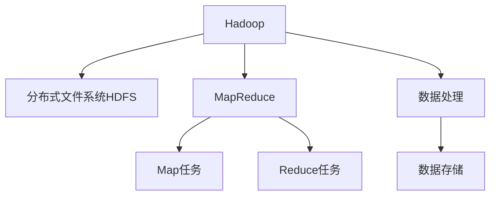

                 

# Hadoop原理与代码实例讲解

> 关键词：Hadoop, 分布式文件系统, 分布式计算, MapReduce, 核心架构, 代码实例, 性能优化, 容错机制, 数据处理

## 1. 背景介绍

### 1.1 问题由来
随着互联网的迅猛发展，数据的产生和增长速度急剧增加。如何在海量数据中快速、高效地存储和处理，成为了一个重要的挑战。传统的单机存储和计算方式已经无法满足需求，分布式计算框架应运而生。

### 1.2 问题核心关键点
Hadoop作为一种流行的分布式计算框架，已经被广泛用于大数据处理、存储和分析。它通过分布式文件系统和MapReduce编程模型，实现了数据的可靠存储和高效处理。Hadoop的核心思想是将数据分散存储在多个节点上，并并行处理数据，从而提升了处理能力。

### 1.3 问题研究意义
研究Hadoop框架的原理和代码实现，对于大数据处理、存储和分析技术的深入理解和应用具有重要意义：

1. 提高数据处理效率：Hadoop通过分布式存储和并行计算，可以显著提升数据处理效率，应对大规模数据集。
2. 保证数据可靠性：Hadoop具有高可靠性，即使单个节点故障，也能保证数据的完整性和可用性。
3. 简化开发难度：Hadoop提供了丰富的API和工具，简化了数据处理和分析的开发过程。
4. 提升技术前瞻性：掌握Hadoop的核心原理和实现细节，有助于开发者设计更加高效、可靠的大数据处理系统。

## 2. 核心概念与联系

### 2.1 核心概念概述

为了更好地理解Hadoop的原理和实现细节，本节将介绍几个关键概念：

- Hadoop：一种开源的分布式计算框架，由Apache基金会开发和维护。Hadoop的核心组件包括分布式文件系统HDFS和分布式计算框架MapReduce。
- 分布式文件系统（HDFS）：用于存储大规模数据的文件系统。HDFS通过将数据分散存储在多个节点上，实现了高可用性和高可靠性。
- MapReduce：一种编程模型，用于处理大规模数据集。MapReduce将任务划分为Map和Reduce两个步骤，分别进行数据处理和合并。
- Hadoop分布式文件系统（HDFS）：用于存储大规模数据的分布式文件系统，通过将数据分散存储在多个节点上，实现了高可用性和高可靠性。
- MapReduce：一种编程模型，用于处理大规模数据集。MapReduce将任务划分为Map和Reduce两个步骤，分别进行数据处理和合并。

这些核心概念之间的逻辑关系可以通过以下Mermaid流程图来展示：



这个流程图展示了Hadoop的核心组件和任务流程：

1. Hadoop将数据存储在分布式文件系统HDFS中。
2. 通过MapReduce编程模型，Hadoop将数据处理任务划分为Map和Reduce两个步骤。
3. Map任务对数据进行初步处理，Reduce任务对Map任务的结果进行合并和计算。
4. 通过Map和Reduce任务的并行执行，Hadoop实现了大规模数据的高效处理。

## 3. 核心算法原理 & 具体操作步骤
### 3.1 算法原理概述

Hadoop的核心原理是基于分布式文件系统和MapReduce编程模型。下面将详细介绍这两个关键技术。

#### 3.1.1 分布式文件系统（HDFS）
HDFS是一种用于存储大规模数据的分布式文件系统。它的核心思想是将数据分散存储在多个节点上，并通过冗余机制确保数据的高可用性和高可靠性。

##### 3.1.1.1 HDFS架构
HDFS架构由以下几个关键组件组成：

- 一个主节点（NameNode）：用于管理整个文件系统的元数据，包括文件的存储位置和副本信息。
- 多个从节点（DataNode）：用于存储实际数据块。
- 一个元数据缓存（Block Cache）：用于缓存文件系统元数据，减少访问NameNode的开销。

##### 3.1.1.2 数据存储
在HDFS中，数据被分割成固定大小的数据块，默认大小为128MB。每个数据块在多个DataNode上复制存储，以保证数据的高可用性。默认每个数据块复制3份，即3个副本。当某个DataNode故障时，可以通过从副本中获取数据块，确保数据的完整性和可用性。

##### 3.1.1.3 数据访问
客户端通过访问NameNode获取文件的元数据，通过访问DataNode获取实际数据块。HDFS通过块缓存机制，将经常访问的数据块缓存到本地内存中，减少访问网络的开销，提高数据访问速度。

#### 3.1.2 MapReduce编程模型
MapReduce是一种用于处理大规模数据集的编程模型，它将任务划分为Map和Reduce两个步骤。

##### 3.1.2.1 Map任务
Map任务对输入数据进行初步处理，产生中间结果。Map任务的输入数据格式为键值对（Key-Value Pair），输出数据格式也相同。

##### 3.1.2.2 Reduce任务
Reduce任务对Map任务的结果进行合并和计算，产生最终结果。Reduce任务的输入数据格式为键值对，输出数据格式为键值对。

##### 3.1.2.3 数据处理流程
MapReduce的核心流程包括以下几个步骤：

1. Map任务：将输入数据按照键值对划分，对每个键值对进行处理，产生中间结果。
2. Shuffle操作：将Map任务的输出结果按照键进行分组，并发送到对应的Reduce任务。
3. Reduce任务：对Map任务的输出结果进行合并和计算，产生最终结果。
4. 数据合并：将多个Reduce任务的结果合并，产生最终的输出结果。

### 3.2 算法步骤详解

#### 3.2.1 数据存储和访问
使用Hadoop进行数据存储和访问的步骤如下：

1. 创建HDFS文件系统：使用Hadoop命令行工具创建HDFS文件系统，包括设置存储路径、数据块大小、副本数等参数。
2. 上传文件到HDFS：将本地文件上传到HDFS中，可以使用Hadoop命令行工具或Java API实现。
3. 读取文件数据：从HDFS中读取文件数据，可以使用Hadoop命令行工具或Java API实现。

#### 3.2.2 MapReduce任务编写
使用Hadoop进行MapReduce任务编写的步骤如下：

1. 编写Map任务代码：Map任务代码包括Mapper类的实现，Mapper类必须实现map()方法，用于处理输入数据并产生中间结果。
2. 编写Reduce任务代码：Reduce任务代码包括Reducer类的实现，Reducer类必须实现reduce()方法，用于合并和计算Map任务的输出结果。
3. 编写Driver代码：Driver代码用于启动MapReduce任务，包括设置输入输出路径、任务参数等。

#### 3.2.3 MapReduce任务运行
使用Hadoop进行MapReduce任务运行的步骤如下：

1. 打包提交任务：将Map任务和Reduce任务代码打包成Jar文件，并提交到Hadoop集群中。
2. 启动任务运行：使用Hadoop命令行工具或Java API启动任务运行，Hadoop会自动进行任务调度和数据分布。
3. 监控任务状态：使用Hadoop命令行工具或Java API监控任务运行状态，确保任务正常运行。

### 3.3 算法优缺点

#### 3.3.1 优点
Hadoop的优点包括：

- 高可靠性：通过冗余机制和分布式存储，Hadoop具有高可靠性，即使单个节点故障，也能保证数据的完整性和可用性。
- 高可扩展性：通过添加更多的节点，Hadoop可以轻松扩展计算和存储能力。
- 高效率：通过分布式存储和并行计算，Hadoop可以显著提升数据处理效率。
- 开源免费：Hadoop是开源软件，使用和部署成本低。

#### 3.3.2 缺点
Hadoop的缺点包括：

- 数据倾斜问题：在数据分布不均衡的情况下，Map任务和Reduce任务可能会出现数据倾斜问题，影响任务性能。
- 单节点性能瓶颈：当任务量较小时，单个节点可能无法充分利用资源，导致任务性能下降。
- 学习曲线陡峭：Hadoop的学习曲线较陡峭，初学者需要花费一定的时间学习Hadoop的原理和实现。

### 3.4 算法应用领域

Hadoop作为一种分布式计算框架，已经广泛应用于各种大规模数据处理和存储场景，例如：

- 数据仓库：使用Hadoop进行数据的ETL（抽取、转换、加载）操作，构建数据仓库。
- 大数据分析：使用Hadoop进行大规模数据集的分析，包括统计分析、数据挖掘等。
- 云计算：使用Hadoop构建云存储和云计算平台，提供高效、可靠的数据存储和计算服务。
- 科学研究：使用Hadoop进行大规模科学数据处理和分析，如基因组测序、气候模拟等。
- 机器学习：使用Hadoop进行大规模机器学习任务的训练和推理，如图像识别、自然语言处理等。

## 4. 数学模型和公式 & 详细讲解 & 举例说明

### 4.1 数学模型构建

#### 4.1.1 MapReduce任务数学模型
MapReduce任务的数学模型可以通过以下公式表示：

$$
\text{Input} = (k_1, v_1), (k_2, v_2), ..., (k_n, v_n)
$$

$$
\text{Map} = \{ (k_i, f(v_i)) \mid (k_i, v_i) \in \text{Input} \}
$$

$$
\text{Shuffle} = \{ (k_i, \{v_i^{(1)}, v_i^{(2)}, ..., v_i^{(m_i)}\}) \mid k_i \in \text{Map} \}
$$

$$
\text{Reduce} = \{ (k_i, \text{Agg}(v_i^{(1)}, v_i^{(2)}, ..., v_i^{(m_i)})) \mid (k_i, \{v_i^{(1)}, v_i^{(2)}, ..., v_i^{(m_i)}\}) \in \text{Shuffle} \}
$$

$$
\text{Output} = \text{Reduce}
$$

其中，Input为输入数据，Map为Map任务的结果，Shuffle为Shuffle操作的结果，Reduce为Reduce任务的结果，Output为最终输出结果。

### 4.2 公式推导过程

#### 4.2.1 Map任务公式推导
Map任务的公式推导如下：

1. 输入数据格式为键值对：$(\text{key}, \text{value})$
2. Map函数作用于输入数据：$f(\text{value})$
3. Map任务输出结果：$(\text{key}, f(\text{value}))$

##### 4.2.1.1 Map任务示例
假设输入数据为$(\text{key}_1, \text{value}_1), (\text{key}_2, \text{value}_2), ..., (\text{key}_n, \text{value}_n)$，Map任务为：

$$
\text{Map} = \{ (\text{key}_i, \text{f}(\text{value}_i)) \mid (\text{key}_i, \text{value}_i) \in \text{Input} \}
$$

其中，$\text{f}(\text{value}_i)$为Map函数，将输入数据$\text{value}_i$进行处理后产生中间结果。

#### 4.2.2 Reduce任务公式推导
Reduce任务的公式推导如下：

1. 输入数据格式为键值对：$(\text{key}, \{v_i^{(1)}, v_i^{(2)}, ..., v_i^{(m_i)}\})$
2. Reduce函数作用于键值对：$\text{Agg}(v_i^{(1)}, v_i^{(2)}, ..., v_i^{(m_i)})$
3. Reduce任务输出结果：$(\text{key}, \text{Agg}(v_i^{(1)}, v_i^{(2)}, ..., v_i^{(m_i)}))$

##### 4.2.2.1 Reduce任务示例
假设输入数据为$(\text{key}_1, \{v_1^{(1)}, v_1^{(2)}, ..., v_1^{(m_1)}\}), (\text{key}_2, \{v_2^{(1)}, v_2^{(2)}, ..., v_2^{(m_2)}\}), ..., (\text{key}_n, \{v_n^{(1)}, v_n^{(2)}, ..., v_n^{(m_n)}\})$，Reduce任务为：

$$
\text{Reduce} = \{ (\text{key}_i, \text{Agg}(v_i^{(1)}, v_i^{(2)}, ..., v_i^{(m_i)})) \mid (\text{key}_i, \{v_i^{(1)}, v_i^{(2)}, ..., v_i^{(m_i)}\}) \in \text{Shuffle} \}
$$

其中，$\text{Agg}(v_i^{(1)}, v_i^{(2)}, ..., v_i^{(m_i)})$为Reduce函数，将Map任务的输出结果$v_i^{(1)}, v_i^{(2)}, ..., v_i^{(m_i)}$进行合并和计算，产生最终结果。

### 4.3 案例分析与讲解

#### 4.3.1 Map任务案例
假设有一个文本数据集，每个文本包含一个ID和一个单词列表，格式如下：

```
id1 word1 word2 word3
id2 word2 word4 word5
...
```

使用Hadoop进行Map任务，统计每个单词出现的次数，代码如下：

```java
import org.apache.hadoop.io.IntWritable;
import org.apache.hadoop.io.Text;
import org.apache.hadoop.mapreduce.Mapper;
import java.io.IOException;

public class WordCountMapper extends Mapper<Object, Text, Text, IntWritable> {
    private final static IntWritable one = new IntWritable(1);
    private Text word = new Text();

    public void map(Object key, Text value, Context context) throws IOException, InterruptedException {
        StringTokenizer itr = new StringTokenizer(value.toString());
        while (itr.hasMoreTokens()) {
            word.set(itr.nextToken());
            context.write(word, one);
        }
    }
}
```

#### 4.3.2 Reduce任务案例
假设在Map任务中已经将每个单词出现的次数统计完毕，接下来使用Hadoop进行Reduce任务，计算每个单词出现的总次数，代码如下：

```java
import org.apache.hadoop.io.IntWritable;
import org.apache.hadoop.io.Text;
import org.apache.hadoop.mapreduce.Reducer;
import java.io.IOException;

public class WordCountReducer extends Reducer<Text, IntWritable, Text, IntWritable> {
    private IntWritable result = new IntWritable();

    public void reduce(Text key, Iterable<IntWritable> values, Context context) throws IOException, InterruptedException {
        int sum = 0;
        for (IntWritable val : values) {
            sum += val.get();
        }
        result.set(sum);
        context.write(key, result);
    }
}
```

## 5. 项目实践：代码实例和详细解释说明

### 5.1 开发环境搭建

#### 5.1.1 环境准备
安装Java JDK，Hadoop 2.x版本，下载Hadoop源代码，解压到指定目录，进入源代码目录，执行以下命令安装Hadoop：

```
./configure
make
make dist
```

#### 5.1.2 集群搭建
搭建Hadoop集群包括以下几个步骤：

1. 搭建Hadoop主节点（NameNode）：安装Hadoop，配置Hadoop配置文件，启动NameNode。
2. 搭建Hadoop从节点（DataNode）：安装Hadoop，配置Hadoop配置文件，启动DataNode。
3. 搭建Hadoop客户端（Client）：安装Hadoop，配置Hadoop配置文件，启动Client。

#### 5.1.3 数据上传和下载
使用Hadoop命令行工具上传数据到HDFS：

```
hdfs dfs -put localfile hdfsfile
```

使用Hadoop命令行工具下载数据：

```
hdfs dfs -get hdfsfile localfile
```

### 5.2 源代码详细实现

#### 5.2.1 Map任务实现
Map任务的实现代码如下：

```java
import org.apache.hadoop.io.IntWritable;
import org.apache.hadoop.io.Text;
import org.apache.hadoop.mapreduce.Mapper;
import java.io.IOException;

public class WordCountMapper extends Mapper<Object, Text, Text, IntWritable> {
    private final static IntWritable one = new IntWritable(1);
    private Text word = new Text();

    public void map(Object key, Text value, Context context) throws IOException, InterruptedException {
        StringTokenizer itr = new StringTokenizer(value.toString());
        while (itr.hasMoreTokens()) {
            word.set(itr.nextToken());
            context.write(word, one);
        }
    }
}
```

#### 5.2.2 Reduce任务实现
Reduce任务的实现代码如下：

```java
import org.apache.hadoop.io.IntWritable;
import org.apache.hadoop.io.Text;
import org.apache.hadoop.mapreduce.Reducer;
import java.io.IOException;

public class WordCountReducer extends Reducer<Text, IntWritable, Text, IntWritable> {
    private IntWritable result = new IntWritable();

    public void reduce(Text key, Iterable<IntWritable> values, Context context) throws IOException, InterruptedException {
        int sum = 0;
        for (IntWritable val : values) {
            sum += val.get();
        }
        result.set(sum);
        context.write(key, result);
    }
}
```

#### 5.2.3 Driver代码实现
Driver代码实现如下：

```java
import org.apache.hadoop.conf.Configuration;
import org.apache.hadoop.fs.Path;
import org.apache.hadoop.io.IntWritable;
import org.apache.hadoop.io.Text;
import org.apache.hadoop.mapreduce.Job;
import org.apache.hadoop.mapreduce.lib.input.FileInputFormat;
import org.apache.hadoop.mapreduce.lib.output.FileOutputFormat;

public class WordCountDriver {
    public static void main(String[] args) throws Exception {
        Configuration conf = new Configuration();
        Job job = Job.getInstance(conf, "word count");
        job.setJarByClass(WordCountDriver.class);
        job.setMapperClass(WordCountMapper.class);
        job.setCombinerClass(WordCountReducer.class);
        job.setReducerClass(WordCountReducer.class);
        job.setOutputKeyClass(Text.class);
        job.setOutputValueClass(IntWritable.class);
        FileInputFormat.addInputPath(job, new Path(args[0]));
        FileOutputFormat.setOutputPath(job, new Path(args[1]));
        System.exit(job.waitForCompletion(true) ? 0 : 1);
    }
}
```

### 5.3 代码解读与分析

#### 5.3.1 Mapper类实现
Mapper类实现Map任务的核心代码，其中map()方法用于处理输入数据，产生中间结果。

##### 5.3.1.1 Mapper类代码
```java
import org.apache.hadoop.io.IntWritable;
import org.apache.hadoop.io.Text;
import org.apache.hadoop.mapreduce.Mapper;
import java.io.IOException;

public class WordCountMapper extends Mapper<Object, Text, Text, IntWritable> {
    private final static IntWritable one = new IntWritable(1);
    private Text word = new Text();

    public void map(Object key, Text value, Context context) throws IOException, InterruptedException {
        StringTokenizer itr = new StringTokenizer(value.toString());
        while (itr.hasMoreTokens()) {
            word.set(itr.nextToken());
            context.write(word, one);
        }
    }
}
```

#### 5.3.2 Reducer类实现
Reducer类实现Reduce任务的核心代码，其中reduce()方法用于合并和计算Map任务的输出结果。

##### 5.3.2.1 Reducer类代码
```java
import org.apache.hadoop.io.IntWritable;
import org.apache.hadoop.io.Text;
import org.apache.hadoop.mapreduce.Reducer;
import java.io.IOException;

public class WordCountReducer extends Reducer<Text, IntWritable, Text, IntWritable> {
    private IntWritable result = new IntWritable();

    public void reduce(Text key, Iterable<IntWritable> values, Context context) throws IOException, InterruptedException {
        int sum = 0;
        for (IntWritable val : values) {
            sum += val.get();
        }
        result.set(sum);
        context.write(key, result);
    }
}
```

#### 5.3.3 Driver类实现
Driver类实现MapReduce任务的启动和执行，其中setJarByClass()方法指定Jar文件，setMapperClass()方法指定Mapper类，setCombinerClass()方法指定Combiner类，setReducerClass()方法指定Reducer类，setOutputKeyClass()方法指定输出Key类型，setOutputValueClass()方法指定输出Value类型，addInputPath()方法添加输入路径，setOutputPath()方法设置输出路径。

##### 5.3.3.1 Driver类代码
```java
import org.apache.hadoop.conf.Configuration;
import org.apache.hadoop.fs.Path;
import org.apache.hadoop.io.IntWritable;
import org.apache.hadoop.io.Text;
import org.apache.hadoop.mapreduce.Job;
import org.apache.hadoop.mapreduce.lib.input.FileInputFormat;
import org.apache.hadoop.mapreduce.lib.output.FileOutputFormat;

public class WordCountDriver {
    public static void main(String[] args) throws Exception {
        Configuration conf = new Configuration();
        Job job = Job.getInstance(conf, "word count");
        job.setJarByClass(WordCountDriver.class);
        job.setMapperClass(WordCountMapper.class);
        job.setCombinerClass(WordCountReducer.class);
        job.setReducerClass(WordCountReducer.class);
        job.setOutputKeyClass(Text.class);
        job.setOutputValueClass(IntWritable.class);
        FileInputFormat.addInputPath(job, new Path(args[0]));
        FileOutputFormat.setOutputPath(job, new Path(args[1]));
        System.exit(job.waitForCompletion(true) ? 0 : 1);
    }
}
```

### 5.4 运行结果展示

运行WordCount任务后，可以使用Hadoop命令行工具查看结果：

```
hdfs dfs -ls /user/yourusername/output
```

## 6. 实际应用场景

### 6.1 数据仓库
使用Hadoop进行数据仓库的构建，可以使用Hadoop进行数据的ETL（抽取、转换、加载）操作，构建数据仓库。数据仓库可以用于数据管理和分析，支持各种查询和报表功能。

### 6.2 大数据分析
使用Hadoop进行大规模数据集的分析，包括统计分析、数据挖掘等。Hadoop可以处理海量的数据集，支持分布式存储和并行计算，能够快速高效地进行数据分析。

### 6.3 云计算
使用Hadoop构建云存储和云计算平台，提供高效、可靠的数据存储和计算服务。Hadoop可以支持大规模数据集的处理，能够快速响应大规模的数据请求。

### 6.4 科学研究
使用Hadoop进行大规模科学数据处理和分析，如基因组测序、气候模拟等。Hadoop可以支持大规模科学数据集的存储和处理，能够快速高效地进行科学数据处理和分析。

## 7. 工具和资源推荐

### 7.1 学习资源推荐

为了帮助开发者系统掌握Hadoop的原理和实践技巧，这里推荐一些优质的学习资源：

1. Hadoop官方文档：Hadoop官方文档提供了详细的Hadoop原理和API文档，是学习Hadoop的必备资料。
2. Hadoop指南：一本介绍Hadoop原理和实践的书籍，适合初学者和进阶开发者学习。
3. Hadoop实战：一本介绍Hadoop实践案例的书籍，提供了丰富的Hadoop开发实践经验。
4. Hadoop教程：一个提供Hadoop教程的在线平台，包括Hadoop原理、实践、案例等。
5. Hadoop课程：斯坦福大学提供的Hadoop课程，讲解Hadoop原理和实践。

通过对这些资源的学习实践，相信你一定能够快速掌握Hadoop的核心原理和实现细节，并用于解决实际的NLP问题。

### 7.2 开发工具推荐

高效的开发离不开优秀的工具支持。以下是几款用于Hadoop开发常用的工具：

1. Hadoop命令行工具：Hadoop提供了丰富的命令行工具，支持数据上传、下载、查看、处理等功能。
2. Hadoop IDE：一些支持Hadoop开发的IDE工具，如IntelliJ IDEA、Eclipse等，提供了丰富的Hadoop开发支持。
3. Hadoop性能监控工具：一些用于Hadoop性能监控的工具，如Ganglia、Ambari等，可以实时监控Hadoop集群的性能和状态。
4. Hadoop可视化工具：一些用于Hadoop可视化的工具，如Flume、Kafka等，可以实时展示Hadoop集群的数据流和状态。
5. Hadoop分布式文件系统（HDFS）管理工具：一些用于HDFS管理的工具，如Webhdfs、Cloudera Manager等，可以方便地管理HDFS文件系统。

合理利用这些工具，可以显著提升Hadoop的开发效率，加快创新迭代的步伐。

### 7.3 相关论文推荐

Hadoop作为一种分布式计算框架，已经得到了广泛的研究和应用。以下是几篇奠基性的相关论文，推荐阅读：

1. Hadoop: A Distributed File System：介绍HDFS架构和实现原理的论文，是Hadoop的基础论文。
2. MapReduce: Simplified Data Processing on Large Clusters：介绍MapReduce编程模型和实现原理的论文，是MapReduce的基础论文。
3. The Google File System：介绍Google文件系统的架构和实现原理的论文，是HDFS的灵感来源。
4. YARN: Yet Another Resource Negotiator：介绍Hadoop集群资源调度机制的论文，是YARN的基础论文。

这些论文代表了大数据处理框架的研究进展，可以帮助研究者深入理解Hadoop的核心原理和实现细节。

## 8. 总结：未来发展趋势与挑战

### 8.1 总结

本文对Hadoop框架的原理和代码实现进行了全面系统的介绍。首先阐述了Hadoop框架的背景和核心思想，明确了Hadoop在分布式文件系统和MapReduce编程模型上的重要性和优势。其次，从原理到实践，详细讲解了Hadoop的分布式文件系统和MapReduce编程模型的关键技术，给出了Hadoop开发的完整代码实例。同时，本文还广泛探讨了Hadoop在数据仓库、大数据分析、云计算、科学研究等众多领域的应用前景，展示了Hadoop框架的广泛应用价值。

通过本文的系统梳理，可以看到，Hadoop作为一种强大的分布式计算框架，已经成为大数据处理、存储和分析的基石，推动了大数据技术的广泛应用。未来，伴随大数据技术的不断发展和Hadoop的持续演进，Hadoop必将在更多领域发挥重要作用，为社会经济发展和科学研究提供强大的数据支撑。

### 8.2 未来发展趋势

展望未来，Hadoop框架的发展趋势如下：

1. 高可用性和高可靠性：随着分布式存储和计算技术的不断进步，Hadoop框架的高可用性和高可靠性将得到进一步提升。
2. 自动化管理：Hadoop框架的自动化管理技术将得到进一步提升，包括自动资源调度、自动故障恢复等，提高系统的易用性和可管理性。
3. 云原生化：Hadoop框架将进一步云原生化，支持容器化部署、微服务化、DevOps等新技术，与云计算平台无缝集成。
4. 数据湖技术：Hadoop框架将支持数据湖技术，支持更多类型的数据存储和处理，包括图形数据、时间序列数据、文本数据等。
5. 人工智能融合：Hadoop框架将与人工智能技术深度融合，支持机器学习、深度学习等高级数据分析任务，提升数据价值挖掘能力。

这些发展趋势将进一步推动Hadoop框架的演进，使其在更多场景下发挥更大的作用。

### 8.3 面临的挑战

尽管Hadoop框架已经取得了显著的进展，但在迈向更加智能化、普适化应用的过程中，它仍面临着诸多挑战：

1. 数据倾斜问题：在数据分布不均衡的情况下，Map任务和Reduce任务可能会出现数据倾斜问题，影响任务性能。
2. 单节点性能瓶颈：当任务量较小时，单个节点可能无法充分利用资源，导致任务性能下降。
3. 学习曲线陡峭：Hadoop框架的学习曲线较陡峭，初学者需要花费一定的时间学习Hadoop的原理和实现。
4. 资源调度问题：在多节点环境中，资源调度和负载均衡问题仍然是一个挑战，需要进一步优化。
5. 数据安全问题：Hadoop框架需要保护数据的安全性，防止数据泄露和未授权访问，需要进一步加强数据安全管理。

### 8.4 研究展望

未来，Hadoop框架的研究方向将集中在以下几个方面：

1. 优化数据处理性能：通过优化数据分布、任务调度等机制，提升Hadoop框架的数据处理性能。
2. 提升系统的可扩展性：通过提升Hadoop框架的可扩展性和容错性，使其能够更好地应对大规模数据处理需求。
3. 增强数据的实时处理能力：通过引入流处理技术，提升Hadoop框架的实时数据处理能力，支持更多实时性要求较高的场景。
4. 深度融合人工智能技术：通过深度融合人工智能技术，提升Hadoop框架的智能化水平，支持更多高级数据分析任务。
5. 支持更多数据类型和格式：通过支持更多类型和格式的数据存储和处理，扩展Hadoop框架的应用范围。

这些研究方向将进一步推动Hadoop框架的发展，使其在更多领域发挥更大的作用。

## 9. 附录：常见问题与解答

### 9.1 常见问题与解答

#### 9.1.1 问题：Hadoop框架有哪些优势和劣势？

答：Hadoop框架的优势包括：

- 高可靠性：通过冗余机制和分布式存储，Hadoop框架具有高可靠性，即使单个节点故障，也能保证数据的完整性和可用性。
- 高可扩展性：通过添加更多的节点，Hadoop框架可以轻松扩展计算和存储能力。
- 高效率：通过分布式存储和并行计算，Hadoop框架可以显著提升数据处理效率。
- 开源免费：Hadoop框架是开源软件，使用和部署成本低。

Hadoop框架的劣势包括：

- 数据倾斜问题：在数据分布不均衡的情况下，Map任务和Reduce任务可能会出现数据倾斜问题，影响任务性能。
- 单节点性能瓶颈：当任务量较小时，单个节点可能无法充分利用资源，导致任务性能下降。
- 学习曲线陡峭：Hadoop框架的学习曲线较陡峭，初学者需要花费一定的时间学习Hadoop的原理和实现。

#### 9.1.2 问题：Hadoop框架适用于哪些场景？

答：Hadoop框架适用于以下场景：

- 数据仓库：使用Hadoop进行数据的ETL（抽取、转换、加载）操作，构建数据仓库。
- 大数据分析：使用Hadoop进行大规模数据集的分析，包括统计分析、数据挖掘等。
- 云计算：使用Hadoop构建云存储和云计算平台，提供高效、可靠的数据存储和计算服务。
- 科学研究：使用Hadoop进行大规模科学数据处理和分析，如基因组测序、气候模拟等。
- 机器学习：使用Hadoop进行大规模机器学习任务的训练和推理，如图像识别、自然语言处理等。

#### 9.1.3 问题：如何优化Hadoop框架的数据处理性能？

答：优化Hadoop框架的数据处理性能的方法包括：

- 优化数据分布：通过优化数据分布，减少数据倾斜问题，提高任务性能。
- 优化任务调度：通过优化任务调度和负载均衡，提高资源利用率，提升任务性能。
- 优化数据压缩和编码：通过优化数据压缩和编码，减少数据传输和存储的开销，提升数据处理效率。
- 优化数据缓存和本地化：通过优化数据缓存和本地化，减少数据访问的开销，提高数据处理速度。

#### 9.1.4 问题：Hadoop框架的资源调度问题如何解决？

答：解决Hadoop框架的资源调度问题的方法包括：

- 优化资源分配策略：通过优化资源分配策略，提高资源利用率，减少资源浪费。
- 优化节点选择策略：通过优化节点选择策略，提高任务调度效率，减少任务等待时间。
- 引入自适应资源调度机制：通过引入自适应资源调度机制，根据任务需求动态调整资源分配，提高资源利用率。

#### 9.1.5 问题：如何提高Hadoop框架的安全性？

答：提高Hadoop框架的安全性的方法包括：

- 加强数据加密和访问控制：通过加强数据加密和访问控制，保护数据的安全性，防止数据泄露和未授权访问。
- 引入审计和监控机制：通过引入审计和监控机制，实时监控系统状态和数据访问，及时发现和处理安全问题。
- 引入防火墙和入侵检测：通过引入防火墙和入侵检测，防止恶意攻击和数据泄露。

通过本文的系统梳理，可以看到，Hadoop框架作为强大的分布式计算框架，已经成为大数据处理、存储和分析的重要工具，推动了大数据技术的广泛应用。未来，伴随大数据技术的不断发展和Hadoop的持续演进，Hadoop必将在更多领域发挥更大的作用，为社会经济发展和科学研究提供强大的数据支撑。

