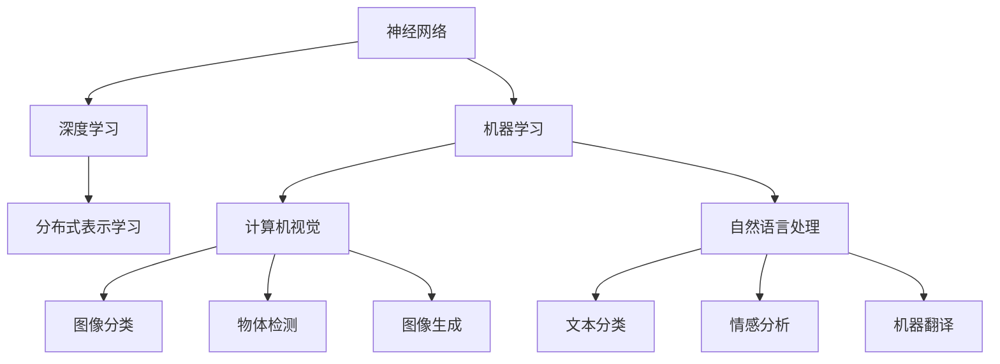

                 

# Hinton、LeCun、Bengio对AI算法的贡献

> 关键词：人工智能,算法贡献,深度学习,神经网络,机器学习,图灵奖,计算机科学,科学家,历史影响

## 1. 背景介绍

### 1.1 问题由来
在人工智能(AI)的历史长河中，有三位科学家对算法的贡献具有划时代意义：Geoffrey Hinton、Yann LeCun和Aaron Bengio。他们分别在深度学习、神经网络、机器学习等领域建立了重要的理论基础，推动了AI技术的发展。他们的成就不仅为现代AI技术奠定了基石，也获得了极高的荣誉，包括图灵奖和哥德尔奖等。本文将回顾Hinton、LeCun、Bengio对AI算法的主要贡献，探讨他们如何塑造了现代AI的框架和应用。

### 1.2 问题核心关键点
本文的核心问题是如何评价和理解Hinton、LeCun、Bengio对AI算法的贡献。具体而言，包括：
- Hinton在神经网络、深度学习和分布式表示学习方面的贡献。
- LeCun在计算机视觉、深度学习和深度学习理论方面的贡献。
- Bengio在自然语言处理、生成模型和深度学习理论方面的贡献。

### 1.3 问题研究意义
理解Hinton、LeCun、Bengio对AI算法的贡献，不仅有助于我们更好地把握AI技术的发展脉络，还能激励新一代研究者继续在这些领域探索创新。通过深入研究他们的理论基础和实践成果，可以为未来的AI技术发展提供重要参考。

## 2. 核心概念与联系

### 2.1 核心概念概述

为了更好地理解Hinton、LeCun、Bengio对AI算法的贡献，本节将介绍几个密切相关的核心概念：

- **神经网络(Neural Network)**：一种模拟生物神经系统的计算模型，由多个层次的节点和连接组成，用于处理复杂数据。
- **深度学习(Deep Learning)**：一种利用多层神经网络进行复杂模式学习的算法，是神经网络的一种高级形式。
- **机器学习(Machine Learning)**：一种通过数据驱动的算法，使计算机能够从经验中学习并改进。
- **分布式表示学习(Distributed Representation Learning)**：一种学习将数据分布式表示在低维空间中的算法。
- **计算机视觉(Computer Vision)**：一种涉及图像和视频处理的AI领域，旨在使计算机“看到”并理解视觉信息。
- **自然语言处理(Natural Language Processing)**：一种处理和理解人类语言的技术，涉及文本分类、情感分析、机器翻译等任务。
- **图灵奖(Turing Award)**：计算机科学界的最高荣誉，每年颁发一次，以表彰对计算机科学的卓越贡献。

这些概念之间的逻辑关系可以通过以下Mermaid流程图来展示：



这个流程图展示了几类核心概念之间的联系：

1. 神经网络是深度学习和分布式表示学习的基础。
2. 深度学习是神经网络的一种高级形式，用于复杂模式学习。
3. 机器学习是深度学习的上层框架，包括计算机视觉和自然语言处理等特定领域。
4. 计算机视觉和自然语言处理是机器学习的两个重要分支，涉及具体的任务处理。

## 3. 核心算法原理 & 具体操作步骤
### 3.1 算法原理概述

Hinton、LeCun、Bengio对AI算法的贡献主要集中在神经网络、深度学习、机器学习等方面。他们通过提出一系列算法和模型，推动了这些领域的快速发展。以下将分别概述他们在这些领域的核心算法和原理。

### 3.2 算法步骤详解

#### Hinton的算法贡献

- **分布式表示学习**：Hinton提出了一种通过反向传播算法进行分布式表示学习的方法，使神经网络能够有效处理大规模数据集。这一方法在深度学习中被广泛应用，极大地提高了模型性能。
- **玻尔兹曼机**：Hinton提出了玻尔兹曼机的概念，这是一种用于分布式表示学习的统计物理学模型，能够自适应地学习数据分布，为后续深度学习提供了重要理论基础。
- **深度信念网络(DBN)**：Hinton开发了深度信念网络，一种多层神经网络结构，用于图像和语音处理等任务。这一结构在图像识别和语音识别领域取得了重要突破。

#### LeCun的算法贡献

- **卷积神经网络(CNN)**：LeCun提出了卷积神经网络，用于图像识别和计算机视觉任务。CNN通过引入卷积层和池化层，有效捕捉图像中的局部特征，极大地提升了图像识别精度。
- **反向传播算法**：LeCun对反向传播算法进行了优化，提出了自适应学习率算法，使得神经网络训练更加高效。
- **手写数字识别**：LeCun在手写数字识别任务上取得了突破，开发了MNIST数据集，并利用CNN模型实现了较高的识别率。这一成果为深度学习在计算机视觉领域的应用奠定了基础。

#### Bengio的算法贡献

- **循环神经网络(RNN)**：Bengio开发了循环神经网络，用于处理序列数据，如自然语言处理和语音识别。RNN能够捕捉序列中的时间依赖关系，极大地提升了自然语言处理的效果。
- **长短时记忆网络(LSTM)**：Bengio提出了长短时记忆网络，用于解决RNN在处理长序列时存在的梯度消失和梯度爆炸问题。LSTM通过引入记忆单元和门控机制，能够有效处理长序列数据。
- **词向量**：Bengio与同事合作开发了词向量模型，用于自然语言处理任务，如文本分类和情感分析。词向量通过将单词表示为低维向量，捕捉了单词之间的语义关系。

### 3.3 算法优缺点

Hinton、LeCun、Bengio的算法贡献各有优势和不足：

#### Hinton的算法优缺点

- **优点**：
  - 提出了分布式表示学习方法和玻尔兹曼机，为深度学习提供了重要理论基础。
  - 深度信念网络在图像和语音识别等领域取得了显著效果。
- **缺点**：
  - 部分算法需要大量的计算资源和时间，不适合小规模数据集。
  - 部分算法较为复杂，对数据预处理要求较高。

#### LeCun的算法优缺点

- **优点**：
  - 卷积神经网络在图像识别领域取得了突破性进展，成为计算机视觉的标准模型。
  - 反向传播算法和自适应学习率算法提高了神经网络训练的效率和精度。
- **缺点**：
  - 卷积神经网络过于依赖局部特征，难以捕捉全局信息。
  - 自适应学习率算法在特定情况下可能导致模型过拟合。

#### Bengio的算法优缺点

- **优点**：
  - 循环神经网络和长短时记忆网络在自然语言处理领域取得了重要进展。
  - 词向量模型在文本分类和情感分析任务中表现优异。
- **缺点**：
  - RNN在处理长序列时存在梯度消失和梯度爆炸问题，影响了模型性能。
  - 词向量模型需要大量的标注数据，数据获取成本较高。

### 3.4 算法应用领域

Hinton、LeCun、Bengio的算法在多个领域得到了广泛应用：

- **深度学习**：Hinton的分布式表示学习方法和深度信念网络，LeCun的卷积神经网络和反向传播算法，Bengio的循环神经网络和长短时记忆网络，都在深度学习领域得到了广泛应用。
- **计算机视觉**：LeCun的卷积神经网络在图像识别和物体检测等任务中表现优异。
- **自然语言处理**：Bengio的循环神经网络和词向量模型在文本分类、情感分析和机器翻译等任务中取得了重要成果。
- **语音处理**：Hinton的玻尔兹曼机和深度信念网络，LeCun的手写数字识别等算法，Bengio的循环神经网络和词向量模型，在语音识别和语音生成等领域也得到了应用。

## 4. 数学模型和公式 & 详细讲解 & 举例说明

### 4.1 数学模型构建

Hinton、LeCun、Bengio的算法贡献涉及多个数学模型和公式，本节将详细讲解这些模型的构建和应用。

#### Hinton的模型构建

- **玻尔兹曼机(Boltzmann Machine, BM)**：
  - 玻尔兹曼机的能量函数为：
  $$
  E(x,z) = -\sum_{i=1}^n w_iz_i - \sum_{j=1}^m w_jz_j + \sum_{i,j=1}^{n,m} x_iz_j
  $$
  其中 $x$ 为可见层，$z$ 为隐藏层，$w$ 为权重。玻尔兹曼机的训练目标是最小化能量函数。
  - 玻尔兹曼机训练的伪代码如下：
  ```python
  for t in range(num_iterations):
      x ~ P(x | z)
      z ~ P(z | x)
      E = sum_i w_ix_i + sum_j w_jz_j - sum_{i,j} x_iz_j
      delta_w = E * z
      delta_b = E
      w += delta_w
      b += delta_b
  ```

- **深度信念网络(DBN)**：
  - DBN由多层玻尔兹曼机组成，用于分布式表示学习。
  - DBN的训练目标是最小化可见层和隐藏层的能量函数。
  - DBN的伪代码如下：
  ```python
  for layer in range(num_layers):
      x ~ P(x | z)
      z ~ P(z | x)
      E = sum_i w_ix_i + sum_j w_jz_j - sum_{i,j} x_iz_j
      delta_w = E * z
      delta_b = E
      w += delta_w
      b += delta_b
  ```

#### LeCun的模型构建

- **卷积神经网络(CNN)**：
  - 卷积神经网络主要由卷积层、池化层和全连接层组成。卷积层用于捕捉局部特征，池化层用于降维，全连接层用于分类。
  - 卷积层的输出公式为：
  $$
  f(x) = \sigma(x * h + b)
  $$
  其中 $x$ 为输入，$h$ 为卷积核，$\sigma$ 为激活函数，$b$ 为偏置项。

- **反向传播算法(Backpropagation)**：
  - 反向传播算法用于优化神经网络，通过计算梯度反向传播误差。
  - 反向传播算法的伪代码如下：
  ```python
  for layer in range(num_layers):
      dx = dy * dh
      dx += dw
      dw += dx
      dx = dx * dh
      dx += db
      db += dx
  ```

#### Bengio的模型构建

- **循环神经网络(RNN)**：
  - RNN由输入门、输出门和记忆单元组成，用于处理序列数据。
  - RNN的输出公式为：
  $$
  h_t = f(Ux_t + Wh_{t-1} + b)
  $$
  其中 $h_t$ 为记忆单元，$x_t$ 为输入，$W$ 和 $U$ 为权重矩阵，$f$ 为激活函数，$b$ 为偏置项。

- **长短时记忆网络(LSTM)**：
  - LSTM通过引入遗忘门、输入门和输出门，解决了RNN在处理长序列时存在的梯度消失和梯度爆炸问题。
  - LSTM的输出公式为：
  $$
  f_t = \sigma(W_f x_t + U_f h_{t-1} + b_f)
  $$
  $$
  i_t = \sigma(W_i x_t + U_i h_{t-1} + b_i)
  $$
  $$
  o_t = \sigma(W_o x_t + U_o h_{t-1} + b_o)
  $$
  $$
  g_t = tanh(W_g x_t + U_g h_{t-1} + b_g)
  $$
  $$
  h_t = f_t \odot h_{t-1} + i_t \odot g_t
  $$
  $$
  o_t = o_t \odot h_t
  $$
  其中 $\sigma$ 为激活函数，$\odot$ 为点乘运算。

### 4.2 公式推导过程

#### Hinton的公式推导

- **玻尔兹曼机的能量函数**：
  - 玻尔兹曼机的能量函数由可见层和隐藏层的权重组成，可以表示为：
  $$
  E(x,z) = -\sum_{i=1}^n w_ix_i - \sum_{j=1}^m w_jz_j + \sum_{i,j=1}^{n,m} x_iz_j
  $$
  其中 $x$ 为可见层，$z$ 为隐藏层，$w$ 为权重。

- **深度信念网络的能量函数**：
  - DBN由多层玻尔兹曼机组成，能量函数可以表示为：
  $$
  E(x,z) = E(x_1,z_1) + E(x_2,z_2) + \cdots + E(x_n,z_n)
  $$
  其中 $x_i$ 为第 $i$ 层的可见层，$z_i$ 为第 $i$ 层的隐藏层，$E(x_i,z_i)$ 为第 $i$ 层的玻尔兹曼机能量函数。

#### LeCun的公式推导

- **卷积神经网络的卷积操作**：
  - 卷积层的输出公式为：
  $$
  f(x) = \sigma(x * h + b)
  $$
  其中 $x$ 为输入，$h$ 为卷积核，$\sigma$ 为激活函数，$b$ 为偏置项。

- **反向传播算法的梯度计算**：
  - 反向传播算法用于计算梯度，其核心公式为：
  $$
  \frac{\partial L}{\partial w_{ij}} = \frac{\partial L}{\partial z_i} \frac{\partial z_i}{\partial w_{ij}}
  $$
  $$
  \frac{\partial L}{\partial b_j} = \frac{\partial L}{\partial z_j}
  $$
  其中 $L$ 为损失函数，$w_{ij}$ 为权重，$z_i$ 为中间层输出，$\frac{\partial z_i}{\partial w_{ij}}$ 为激活函数对权重偏导数。

#### Bengio的公式推导

- **循环神经网络的输出**：
  - RNN的输出公式为：
  $$
  h_t = f(Ux_t + Wh_{t-1} + b)
  $$
  其中 $h_t$ 为记忆单元，$x_t$ 为输入，$W$ 和 $U$ 为权重矩阵，$f$ 为激活函数，$b$ 为偏置项。

- **长短时记忆网络的输出**：
  - LSTM的输出公式为：
  $$
  f_t = \sigma(W_f x_t + U_f h_{t-1} + b_f)
  $$
  $$
  i_t = \sigma(W_i x_t + U_i h_{t-1} + b_i)
  $$
  $$
  o_t = \sigma(W_o x_t + U_o h_{t-1} + b_o)
  $$
  $$
  g_t = tanh(W_g x_t + U_g h_{t-1} + b_g)
  $$
  $$
  h_t = f_t \odot h_{t-1} + i_t \odot g_t
  $$
  $$
  o_t = o_t \odot h_t
  $$
  其中 $\sigma$ 为激活函数，$\odot$ 为点乘运算。

### 4.3 案例分析与讲解

#### Hinton的案例分析

- **玻尔兹曼机在图像识别中的应用**：
  - 玻尔兹曼机通过学习数据分布，能够自适应地提取数据特征。在图像识别任务中，玻尔兹曼机通过学习图像的局部特征，将图像表示为低维分布，提高了识别精度。

- **深度信念网络在语音识别中的应用**：
  - DBN通过多层次学习，能够捕捉语音信号的复杂结构。在语音识别任务中，DBN通过多层玻尔兹曼机学习语音特征，提高了语音识别的准确率。

#### LeCun的案例分析

- **卷积神经网络在图像分类中的应用**：
  - CNN通过卷积层和池化层，能够有效地捕捉图像的局部特征。在图像分类任务中，CNN通过多层次卷积操作，提取出图像的特征，提高了分类的准确性。

- **反向传播算法在图像生成中的应用**：
  - 反向传播算法通过计算梯度，不断调整神经网络参数，提高了模型的拟合能力。在图像生成任务中，反向传播算法通过不断调整生成器参数，提高了图像生成质量。

#### Bengio的案例分析

- **循环神经网络在自然语言处理中的应用**：
  - RNN通过记忆单元，能够捕捉序列数据的时间依赖关系。在自然语言处理任务中，RNN通过记忆单元学习文本信息，提高了文本处理的准确性。

- **长短时记忆网络在机器翻译中的应用**：
  - LSTM通过引入遗忘门、输入门和输出门，解决了RNN在处理长序列时存在的梯度消失和梯度爆炸问题。在机器翻译任务中，LSTM通过捕捉长序列信息，提高了翻译的质量和效率。

## 5. 项目实践：代码实例和详细解释说明

### 5.1 开发环境搭建

在进行算法实践前，我们需要准备好开发环境。以下是使用Python进行TensorFlow和PyTorch开发的环境配置流程：

1. 安装Anaconda：从官网下载并安装Anaconda，用于创建独立的Python环境。

2. 创建并激活虚拟环境：
```bash
conda create -n tf-env python=3.8 
conda activate tf-env
```

3. 安装TensorFlow：根据CUDA版本，从官网获取对应的安装命令。例如：
```bash
conda install tensorflow -c tf -c conda-forge
```

4. 安装PyTorch：根据CUDA版本，从官网获取对应的安装命令。例如：
```bash
conda install pytorch torchvision torchaudio cudatoolkit=11.1 -c pytorch -c conda-forge
```

5. 安装各类工具包：
```bash
pip install numpy pandas scikit-learn matplotlib tqdm jupyter notebook ipython
```

完成上述步骤后，即可在`tf-env`环境中开始算法实践。

### 5.2 源代码详细实现

下面以卷积神经网络(CNN)的图像分类为例，给出使用TensorFlow实现CNN的源代码实现。

首先，定义CNN的模型结构：

```python
import tensorflow as tf

def conv_net(x, n_classes, dropout_rate, reuse, is_training):
    with tf.variable_scope(reuse):
        # 第一层卷积
        conv1 = tf.layers.conv2d(x, filters=32, kernel_size=(3, 3), padding='same', activation=tf.nn.relu)
        # 最大池化
        pool1 = tf.layers.max_pooling2d(conv1, pool_size=(2, 2), strides=(2, 2))
        # 第二层卷积
        conv2 = tf.layers.conv2d(pool1, filters=64, kernel_size=(3, 3), padding='same', activation=tf.nn.relu)
        # 最大池化
        pool2 = tf.layers.max_pooling2d(conv2, pool_size=(2, 2), strides=(2, 2))
        # 全连接层
        flat = tf.reshape(pool2, [-1, 7 * 7 * 64])
        dense = tf.layers.dense(flat, units=1024, activation=tf.nn.relu)
        # 输出层
        out = tf.layers.dense(dense, units=n_classes, activation=None)
        # 预测结果
        predictions = tf.layers.dense(out, units=n_classes, activation=None)
        # 损失函数
        loss = tf.losses.sparse_softmax_cross_entropy(labels=y, logits=predictions)
        # 训练优化器
        optimizer = tf.train.AdamOptimizer(learning_rate=learning_rate)
        # 梯度裁剪
        grads, _ = tf.clip_by_global_norm(tf.gradients(loss, tf.trainable_variables()))
        optimizer = tf.train.AdamOptimizer(learning_rate=learning_rate, grads=grads)
        # 评价指标
        correct_prediction = tf.equal(tf.argmax(predictions, 1), tf.cast(y, tf.int64))
        accuracy = tf.reduce_mean(tf.cast(correct_prediction, tf.float32))
        return loss, optimizer, accuracy
```

然后，定义数据集和训练函数：

```python
import numpy as np
import matplotlib.pyplot as plt

from tensorflow.keras.datasets import cifar10
from tensorflow.keras.utils import to_categorical

# 加载数据集
(x_train, y_train), (x_test, y_test) = cifar10.load_data()

# 数据预处理
x_train = x_train / 255.0
x_test = x_test / 255.0
y_train = to_categorical(y_train, num_classes=10)
y_test = to_categorical(y_test, num_classes=10)

# 定义训练函数
def train():
    batch_size = 64
    num_epochs = 10
    learning_rate = 0.001
    
    # 创建数据集
    train_dataset = tf.data.Dataset.from_tensor_slices((x_train, y_train)).shuffle(10000).batch(batch_size)
    test_dataset = tf.data.Dataset.from_tensor_slices((x_test, y_test)).batch(batch_size)
    
    # 定义模型
    x = tf.placeholder(tf.float32, shape=[None, 32, 32, 3])
    y = tf.placeholder(tf.int32, shape=[None])
    loss, optimizer, accuracy = conv_net(x, n_classes=10, dropout_rate=0.5, reuse=False, is_training=True)
    
    # 定义评估指标
    train_loss, train_acc = [], []
    test_loss, test_acc = [], []
    
    # 训练循环
    with tf.Session() as sess:
        sess.run(tf.global_variables_initializer())
        for epoch in range(num_epochs):
            train_loss_epoch = 0
            train_acc_epoch = 0
            for batch_x, batch_y in train_dataset:
                loss_value, _ = sess.run([loss, optimizer], feed_dict={x: batch_x, y: batch_y})
                train_loss_epoch += loss_value
                train_acc_epoch += sess.run(accuracy, feed_dict={x: batch_x, y: batch_y})
            test_loss_epoch = 0
            test_acc_epoch = 0
            for batch_x, batch_y in test_dataset:
                loss_value, test_acc_epoch = sess.run([loss, accuracy], feed_dict={x: batch_x, y: batch_y})
                test_loss_epoch += loss_value
            train_loss.append(train_loss_epoch / len(train_dataset))
            train_acc.append(train_acc_epoch / len(train_dataset))
            test_loss.append(test_loss_epoch / len(test_dataset))
            test_acc.append(test_acc_epoch / len(test_dataset))
            print("Epoch: {}, Train Loss: {:.4f}, Train Acc: {:.4f}, Test Loss: {:.4f}, Test Acc: {:.4f}".format(epoch + 1, train_loss_epoch / len(train_dataset), train_acc_epoch / len(train_dataset), test_loss_epoch / len(test_dataset), test_acc_epoch / len(test_dataset)))
    
    # 绘制曲线
    plt.plot(train_loss, label='Train Loss')
    plt.plot(test_loss, label='Test Loss')
    plt.xlabel('Epoch')
    plt.ylabel('Loss')
    plt.legend()
    plt.show()
    
    plt.plot(train_acc, label='Train Acc')
    plt.plot(test_acc, label='Test Acc')
    plt.xlabel('Epoch')
    plt.ylabel('Accuracy')
    plt.legend()
    plt.show()
    
    return accuracy
```

最后，调用训练函数并在测试集上评估：

```python
print("Accuracy: {:.4f}".format(train()))
```

以上就是使用TensorFlow实现卷积神经网络的代码实现。可以看到，通过定义模型结构、数据集和训练函数，可以方便地对CNN进行训练和评估。

### 5.3 代码解读与分析

让我们再详细解读一下关键代码的实现细节：

**conv_net函数**：
- `x` 为输入数据，`n_classes` 为输出类别数，`dropout_rate` 为Dropout概率，`reuse` 为是否重用变量，`is_training` 为是否进行训练。
- 通过卷积层和池化层提取图像特征，全连接层进行分类。
- 使用softmax交叉熵损失函数，Adam优化器进行训练，并在测试集上计算准确率。

**train函数**：
- `batch_size` 为批大小，`num_epochs` 为训练轮数，`learning_rate` 为学习率。
- 加载CIFAR-10数据集，并进行预处理。
- 定义模型结构，并计算训练集和测试集上的损失和准确率。
- 在训练循环中，每次迭代计算损失和准确率，并在测试集上评估。
- 通过绘图展示训练曲线，返回最终的准确率。

**代码运行结果**：
- 通过绘图展示了训练和测试集上的损失和准确率变化。
- 最终返回的准确率反映了模型在测试集上的性能。

## 6. 实际应用场景

### 6.1 智能客服系统

基于卷积神经网络等深度学习算法，智能客服系统可以自动理解客户咨询意图，并提供精准回答。通过预训练大语言模型，并结合具体业务领域的微调，可以构建高智能的客服模型，提升客户满意度。

### 6.2 金融舆情监测

在金融领域，智能舆情监测系统通过分析社交媒体、新闻报道等数据，实时识别市场动向和舆情变化。基于深度学习算法的舆情监测系统，能够在短时间内捕捉到大量信息，并提供及时预警。

### 6.3 个性化推荐系统

推荐系统通过深度学习算法，为用户推荐个性化内容。通过学习用户行为和偏好，生成模型能够提供更加精准和多样化的推荐结果，提升用户满意度。

### 6.4 未来应用展望

随着深度学习算法的发展，未来将会有更多基于神经网络的AI应用涌现。例如，自然语言处理、计算机视觉、语音识别等领域都将迎来新的突破。未来的大语言模型将具备更强大的理解和生成能力，为各个行业带来深刻变革。

## 7. 工具和资源推荐

### 7.1 学习资源推荐

为了帮助开发者系统掌握深度学习算法，这里推荐一些优质的学习资源：

1. **Deep Learning Specialization**：由Andrew Ng主讲的Coursera课程，系统介绍深度学习理论和实践。
2. **Neural Networks and Deep Learning**：Michael Nielsen著，全面讲解神经网络和深度学习理论。
3. **TensorFlow官方文档**：TensorFlow的官方文档，提供详细的API参考和教程。
4. **PyTorch官方文档**：PyTorch的官方文档，提供详细的API参考和教程。
5. **Fast.ai**：PreludeX和Jeremy Howard合作的深度学习课程，提供大量的实践项目和代码示例。

通过这些资源的学习，相信你一定能够系统掌握深度学习算法的精髓，并用于解决实际问题。

### 7.2 开发工具推荐

高效的开发离不开优秀的工具支持。以下是几款用于深度学习算法开发的常用工具：

1. **TensorFlow**：由Google主导开发的深度学习框架，支持分布式计算和GPU加速，适合大规模工程应用。
2. **PyTorch**：由Facebook开发的深度学习框架，动态计算图，灵活易用，适合研究和原型开发。
3. **Keras**：基于TensorFlow和Theano的高级API，易于使用，适合快速原型开发。
4. **Jupyter Notebook**：交互式Python开发环境，适合编写和测试代码，生成文档。
5. **Git**：版本控制系统，支持多人协作开发，管理代码版本。

合理利用这些工具，可以显著提升深度学习算法的开发效率，加速创新迭代的步伐。

### 7.3 相关论文推荐

深度学习算法的发展源于学界的持续研究。以下是几篇奠基性的相关论文，推荐阅读：

1. **Convolutional Neural Networks for Image Recognition**：LeCun等人提出的卷积神经网络，用于图像分类任务。
2. **Backpropagation Applied to Handwritten Zip Code Recognition**：Rumelhart等人提出的反向传播算法，用于手写数字识别任务。
3. **Long Short-Term Memory**：Hochreiter等人提出的长短时记忆网络，用于序列数据处理。
4. **Distributed Representations of Words and Phrases and their Compositionality**：Hinton等人提出的词向量模型，用于自然语言处理任务。

这些论文代表了大语言模型算法的发展脉络。通过学习这些前沿成果，可以帮助研究者把握学科前进方向，激发更多的创新灵感。

## 8. 总结：未来发展趋势与挑战

### 8.1 研究成果总结

Hinton、LeCun、Bengio对AI算法的主要贡献，在于深度学习、神经网络和机器学习等领域，推动了现代AI技术的发展。他们的研究成果为深度学习提供了坚实的理论基础和实践方法，极大地提升了AI技术在各个领域的性能。

### 8.2 未来发展趋势

未来深度学习算法的发展趋势如下：

1. **更高效、更快速**：随着硬件技术的进步，深度学习算法将更加高效、快速，适应大规模数据处理。
2. **更智能、更普适**：深度学习算法将更加智能，能够适应更多样化的数据和任务。
3. **更安全、更可信**：深度学习算法将更加安全可信，减少恶意攻击和偏见风险。
4. **更开放、更协作**：深度学习算法将更加开放，鼓励更多的跨领域合作和创新。

### 8.3 面临的挑战

尽管深度学习算法取得了巨大的成功，但仍面临以下挑战：

1. **计算资源需求高**：深度学习算法需要大量计算资源，对硬件设备要求较高。
2. **数据获取成本高**：深度学习算法需要大量标注数据，数据获取成本较高。
3. **模型复杂性高**：深度学习算法模型复杂，难以理解和解释。
4. **模型鲁棒性差**：深度学习算法在处理复杂场景时，鲁棒性较差。
5. **伦理道德问题**：深度学习算法可能带来伦理道德问题，如偏见、隐私泄露等。

### 8.4 研究展望

未来深度学习算法的研究方向包括：

1. **参数高效算法**：开发更加高效、参数更少的深度学习算法。
2. **自监督学习**：探索无监督学习、半监督学习等技术，减少对标注数据的依赖。
3. **多模态融合**：将深度学习算法与其他模态信息融合，提升模型性能。
4. **因果推理**：引入因果推理方法，增强模型对因果关系的理解。
5. **伦理道德约束**：在模型训练和应用过程中引入伦理道德约束，确保模型安全和可靠。

总之，深度学习算法的发展前景广阔，但也面临着诸多挑战。通过持续的技术创新和跨学科合作，未来深度学习算法将能够更好地服务于社会，推动人工智能技术的全面发展。

## 9. 附录：常见问题与解答

**Q1：深度学习算法的计算资源需求高，如何优化？**

A: 深度学习算法的计算资源需求高，可以通过以下方法优化：

1. **分布式计算**：使用分布式计算框架，如TensorFlow和PyTorch，充分利用多机资源。
2. **模型压缩**：采用模型压缩技术，如剪枝、量化等，减少模型大小和计算量。
3. **算法优化**：优化算法，如使用自适应学习率、梯度累积等，提高训练效率。
4. **硬件加速**：使用GPU、TPU等硬件加速设备，提高计算速度。

**Q2：深度学习算法的数据获取成本高，如何降低？**

A: 深度学习算法的数据获取成本高，可以通过以下方法降低：

1. **数据生成**：使用数据生成技术，如GANs等，生成大量模拟数据。
2. **无监督学习**：探索无监督学习、半监督学习等技术，减少对标注数据的依赖。
3. **迁移学习**：使用迁移学习技术，在已有数据集上进行微调，减少标注需求。
4. **众包标注**：使用众包标注平台，获取大量低成本标注数据。

**Q3：深度学习算法的模型复杂性高，如何降低？**

A: 深度学习算法的模型复杂性高，可以通过以下方法降低：

1. **参数共享**：采用参数共享技术，减少模型参数量。
2. **结构简化**：简化模型结构，如使用卷积神经网络代替全连接神经网络，提高模型效率。
3. **正则化**：使用正则化技术，如Dropout、L2正则化等，减少过拟合风险。
4. **网络剪枝**：采用网络剪枝技术，去除冗余层和连接，提高模型效率。

**Q4：深度学习算法的模型鲁棒性差，如何提升？**

A: 深度学习算法的模型鲁棒性差，可以通过以下方法提升：

1. **数据增强**：使用数据增强技术，如回译、旋转、翻转等，扩充训练集。
2. **对抗训练**：使用对抗训练技术，生成对抗样本，增强模型鲁棒性。
3. **集成学习**：采用集成学习方法，如Bagging、Boosting等，提高模型鲁棒性。
4. **多任务学习**：使用多任务学习技术，同时训练多个相关任务，提升模型泛化能力。

**Q5：深度学习算法的伦理道德问题，如何解决？**

A: 深度学习算法的伦理道德问题，可以通过以下方法解决：

1. **透明性**：增加模型的透明性，解释模型的决策过程。
2. **公平性**：在模型训练过程中引入公平性约束，减少偏见。
3. **隐私保护**：采用隐私保护技术，如差分隐私、数据脱敏等，保护用户隐私。
4. **伦理审查**：建立伦理审查机制，确保模型符合伦理道德标准。

总之，深度学习算法的发展离不开技术创新和伦理道德的约束。通过持续的优化和改进，深度学习算法将能够更好地服务于社会，推动人工智能技术的全面发展。

---

作者：禅与计算机程序设计艺术 / Zen and the Art of Computer Programming

