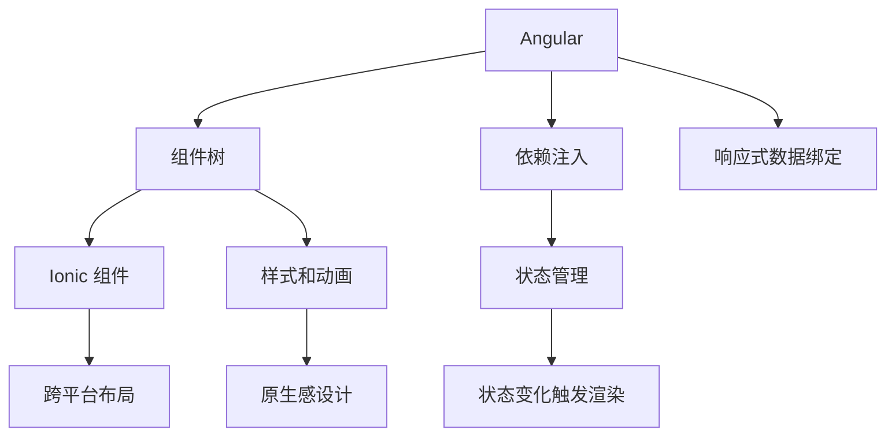

                 

# Ionic 框架和 Angular 的结合：构建动态的移动应用

## 1. 背景介绍

随着移动应用的快速发展，开发者需要更加灵活高效的工具来构建跨平台移动应用。Ionic 是一个开源的移动前端框架，基于 Web 技术栈（如 Angular），支持 iOS 和 Android 平台。Ionic 提供了丰富的组件和工具，使得开发者可以轻松构建高质量的移动应用。

然而，Ionic 的设计初衷更多是为 Web 应用优化，在处理复杂的交互逻辑和状态管理时，存在一定局限性。Angular 是一个领先的 Web 前端框架，具备强大的依赖注入和状态管理能力，能够更好地处理复杂的逻辑和数据流。

结合 Ionic 和 Angular 的优势，可以在移动应用开发中实现更高效、更动态的体验。本文将详细介绍如何将 Ionic 框架和 Angular 的代码和组件结合起来，以构建高质量的移动应用。

## 2. 核心概念与联系

### 2.1 核心概念概述

Ionic 和 Angular 都采用了组件化开发的方式，并基于 TypeScript 语言，使得开发者可以更好地进行模块化和类型化编程。Ionic 提供了大量预制的 UI 组件和动画效果，可以快速构建出具有原生感的移动应用界面。

Angular 提供了强大的依赖注入和状态管理能力，通过组件树和响应式数据绑定，可以实现复杂的数据和交互逻辑。通过将 Angular 与 Ionic 结合，可以在移动应用中实现更加灵活和动态的用户体验。

### 2.2 核心概念原理和架构的 Mermaid 流程图



## 3. 核心算法原理 & 具体操作步骤

### 3.1 算法原理概述

将 Ionic 和 Angular 结合的基本原理是通过 Angular 的状态管理机制和数据绑定，驱动 Ionic 组件的动态渲染。Angular 的状态管理组件和数据流可以通过服务、管道和组件属性等进行传递和更新。而 Ionic 则利用其预制的 UI 组件和布局机制，实现复杂界面的渲染和交互。

### 3.2 算法步骤详解

**Step 1: 项目搭建和配置**

1. 安装 Ionic 和 Angular CLI，创建新的 Ionic 项目。
2. 在项目中引入 Angular 的依赖，如 `@angular/core` 和 `@angular/platform-browser`。
3. 配置 Ionic 的路由和页面导航。

**Step 2: 组件开发和复用**

1. 在 Angular 中创建和定义组件，包含输入、处理和输出逻辑。
2. 将 Angular 组件嵌入 Ionic 页面中，利用 Ionic 的布局和样式机制进行美化。
3. 使用 Ionic 提供的导航和路由功能，实现组件之间的交互和页面跳转。

**Step 3: 状态管理与数据绑定**

1. 使用 Angular 的服务或状态管理器，管理应用程序的状态。
2. 通过 Angular 的响应式数据绑定，将状态变化触发 UI 组件的动态更新。
3. 利用 Ionic 的动态变量和模板语义，简化 UI 组件的状态管理。

**Step 4: 测试和调试**

1. 使用 Angular 和 Ionic 的内置工具进行单元测试和端到端测试。
2. 利用 Angular 的调试工具和 Ionic 的模拟器进行调试。

### 3.3 算法优缺点

**优点**：
1. 组件复用：Ionic 提供了大量预制的 UI 组件，可以方便地复用。
2. 跨平台支持：Angular 和 Ionic 都支持 iOS 和 Android 平台。
3. 丰富的组件库：Angular 的组件库非常丰富，可以满足各种需求。

**缺点**：
1. 性能开销：Angular 的依赖注入和数据绑定机制存在一定性能开销，可能影响应用的加载速度。
2. 学习曲线：Angular 的复杂度较高，需要一定的学习成本。
3. 兼容性问题：Ionic 和 Angular 的最新版本可能在某些功能上存在兼容性问题。

### 3.4 算法应用领域

Ionic 和 Angular 的结合主要应用于需要高度动态交互和复杂数据处理的移动应用场景，如社交媒体、电商应用、健康应用等。

## 4. 数学模型和公式 & 详细讲解

### 4.1 数学模型构建

假设我们有一个简单的 Ionic 页面，页面上包含一个 Angular 组件，用于显示用户的点赞数。我们可以用以下数学模型来表示：

设用户的点赞数为 $x$，页面上显示点赞数的组件为 $y$。

**模型假设**：
- 用户每增加一次点赞，$x$ 的值增加 $1$。
- 组件 $y$ 的显示值为 $x$。

**模型公式**：
$$
y = x
$$

### 4.2 公式推导过程

假设用户初始点赞数为 $0$，每次点赞后 $x$ 的值增加 $1$。组件 $y$ 的初始值为 $0$。

当用户第一次点赞时，$x=1$，组件 $y$ 的值更新为 $1$。

当用户第二次点赞时，$x=2$，组件 $y$ 的值更新为 $2$。

以此类推，当用户第 $n$ 次点赞时，$x=n$，组件 $y$ 的值更新为 $n$。

### 4.3 案例分析与讲解

以下是一个具体的示例，演示如何在一个 Ionic 页面中，通过 Angular 组件显示用户的点赞数。

**代码实现**：

```typescript
// app.module.ts
import { NgModule } from '@angular/core';
import { BrowserModule } from '@angular/platform-browser';
import { IonicApp, IonicModule } from 'ionic-angular';

@NgModule({
  imports: [
    BrowserModule,
    IonicModule.forRoot(IonicApp)
  ],
  declarations: [
    MyApp,
    HomePage
  ],
  bootstrap: [MyApp]
})
export class AppModule {}

// app.component.ts
import { Component } from '@angular/core';

@Component({
  selector: 'my-app',
  templateUrl: '../templates/app.html',
  styleUrls: ['../styles/app.css']
})
export class MyApp {}

// home-page.component.ts
import { Component } from '@angular/core';
import { IonicPage, NavController } from 'ionic-angular';
import { NgStyle } from '@angular/common';

@Component({
  selector: 'home-page',
  templateUrl: 'home-page.html',
  styleUrls: ['home-page.css']
})
export class HomePage {

  constructor(public navCtrl: NavController) {}

  // 初始点赞数
  likes = 0;

  // 增加点赞
  like() {
    this.likes++;
  }

  // 显示点赞数
  displayLikes() {
    return this.likes;
  }

  // 动态样式
  @NgStyle({ color: this.displayLikes() === 0 ? 'red' : 'green' })
  colorStyle;

  // 动态文本
  @NgStyle({ textDecoration: this.displayLikes() === 0 ? 'line-through' : 'none' })
  textStyle;
}
```

**代码解释**：

1. `IonicModule.forRoot`：在 Ionic 应用中初始化，并进行全局路由配置。
2. `MyApp`：应用程序入口。
3. `HomePage`：包含点赞数的动态更新。
4. `like()` 方法：增加点赞数。
5. `displayLikes()` 方法：显示点赞数。
6. `colorStyle` 和 `textStyle` 属性：通过 `@NgStyle` 进行动态样式设置。

通过 Angular 的状态管理机制和数据绑定，实现了点赞数的动态更新和组件的动态样式。

## 5. 项目实践：代码实例和详细解释说明

### 5.1 开发环境搭建

1. 安装 Node.js 和 npm。
2. 安装 Angular CLI：`npm install -g @angular/cli`。
3. 安装 Ionic CLI：`npm install -g ionic cordova`。
4. 创建一个新的 Ionic 项目：`ionic start my-app tab`。
5. 安装 Angular 依赖：`npm install @angular/core @angular/platform-browser --save`。

### 5.2 源代码详细实现

以下是一个示例 Ionic 页面的实现：

**home-page.html**

```html
<ion-card>
  <ion-card-header>
    ion-icon name="heart" style="color:{{colorStyle}}" />
    <span style="text-decoration:{{textStyle}}">{{likes}}</span>
  </ion-card-header>
  <ion-card-content>
    <p>Welcome to Ionic!</p>
    <button ion-button (click)="like()">
      Like
    </button>
  </ion-card-content>
</ion-card>
```

**home-page.css**

```css
ion-card-header {
  padding: 12px 16px;
}

ion-card {
  background-color: #fff;
  padding: 16px;
  text-align: center;
  border-radius: 6px;
}

ion-card-content {
  padding: 12px;
}
```

**home-page.ts**

```typescript
import { Component, OnInit } from '@angular/core';
import { IonPage } from 'ionic-angular';
import { NgStyle } from '@angular/common';

@Component({
  selector: 'home-page',
  templateUrl: 'home-page.html',
  styleUrls: ['home-page.css']
})
export class HomePage implements OnInit {

  constructor() {}

  likes = 0;

  like() {
    this.likes++;
  }

  displayLikes() {
    return this.likes;
  }

  @NgStyle({ color: this.displayLikes() === 0 ? 'red' : 'green' })
  colorStyle;

  @NgStyle({ textDecoration: this.displayLikes() === 0 ? 'line-through' : 'none' })
  textStyle;

  ngOnInit() {
    console.log('HomePage Init');
  }

}
```

### 5.3 代码解读与分析

1. `ion-card`：Ionic 提供的卡片组件，用于封装点赞组件。
2. `ion-card-header`：卡片头部，用于显示点赞数和样式。
3. `ion-card-content`：卡片主体，用于显示欢迎信息和点赞按钮。
4. `ion-icon`：用于显示点赞图标。
5. `like()` 方法：用于增加点赞数。
6. `displayLikes()` 方法：用于显示点赞数。
7. `colorStyle` 和 `textStyle` 属性：通过 `@NgStyle` 进行动态样式设置。

通过 Ionic 的预制组件和 Angular 的状态管理，实现了点赞数的动态更新和组件的动态样式。

### 5.4 运行结果展示

运行应用，点击点赞按钮，可以看到点赞数动态更新，同时文本样式和图标颜色也随之变化。

## 6. 实际应用场景

Ionic 和 Angular 的结合可以在多个场景中应用，如：

1. **电商应用**：用于商品列表展示、购物车管理等。
2. **社交媒体**：用于用户动态展示、消息推送等。
3. **健康应用**：用于患者记录、医生咨询等。

通过 Ionic 的 UI 组件和 Angular 的状态管理，可以快速构建出具有原生感的移动应用，并实现动态的用户交互和数据处理。

## 7. 工具和资源推荐

### 7.1 学习资源推荐

1. Ionic 官方文档：详细介绍了 Ionic 的组件和 API。
2. Angular 官方文档：提供了 Angular 的组件和状态管理机制。
3. Angular 学习路线图：提供了从入门到进阶的学习路线图，适合各个水平的学习者。

### 7.2 开发工具推荐

1. Visual Studio Code：Ionic 和 Angular 的最佳开发工具，提供了丰富的扩展和插件。
2. Chrome DevTools：用于调试和分析应用的性能和网络请求。
3. Ionic Lab：用于测试和模拟 Ionic 应用的本地和云端环境。

### 7.3 相关论文推荐

1. "Ionic: The Web’s Design System"：Ionic 的设计理念和组件库介绍。
2. "Angular Fundamentals"：Angular 的核心概念和开发实践。

## 8. 总结：未来发展趋势与挑战

### 8.1 研究成果总结

Ionic 和 Angular 的结合，为跨平台移动应用开发提供了全新的解决方案。通过 Angular 的状态管理和数据绑定，可以更灵活地处理复杂的应用逻辑和数据流。通过 Ionic 的预制组件和样式库，可以快速构建高质量的用户界面。

### 8.2 未来发展趋势

1. **组件和 API 丰富度**：随着 Ionic 和 Angular 社区的持续发展，更多的组件和 API 将被引入，使得开发者可以更方便地进行开发。
2. **跨平台性能优化**：未来的 Ionic 和 Angular 将进一步优化跨平台的性能，提升应用的加载速度和响应速度。
3. **新的开发工具**：将出现更多的开发工具和扩展，进一步提升开发效率和开发体验。

### 8.3 面临的挑战

1. **性能瓶颈**：Ionic 和 Angular 的复杂度可能导致应用的性能瓶颈，需要通过优化和优化策略进行解决。
2. **兼容性问题**：Ionic 和 Angular 的最新版本可能存在兼容性问题，需要进行全面的测试和兼容性优化。
3. **开发难度**：Angular 的复杂度可能增加开发难度，需要开发者具备一定的技术储备。

### 8.4 研究展望

未来的研究应关注以下几个方面：
1. **性能优化**：如何进一步优化 Ionic 和 Angular 应用的性能。
2. **用户体验**：如何提升跨平台应用的用户体验，包括界面设计、交互逻辑等。
3. **新技术应用**：如何将最新的前端技术和工具应用到 Ionic 和 Angular 的开发中。

通过不断的技术迭代和优化，Ionic 和 Angular 的结合将为移动应用开发提供更加高效、灵活和强大的解决方案。

## 9. 附录：常见问题与解答

**Q1: Ionic 和 Angular 的结合是否有性能上的瓶颈？**

A: 是的，由于 Ionic 和 Angular 的复杂度较高，应用在加载和渲染时可能会有一定的性能开销。可以考虑使用性能优化策略，如懒加载组件、使用缓存机制等。

**Q2: 如何在 Ionic 应用中引入自定义 Angular 组件？**

A: 在 Ionic 应用中，可以通过 `<IonModule>` 组件进行加载和配置自定义 Angular 组件。例如：

```typescript
import { NgModule } from '@angular/core';
import { IonicModule } from 'ionic-angular';

@NgModule({
  imports: [
    IonicModule.forRoot(MyApp),
    MyComponentModule
  ],
  declarations: [
    MyApp,
    MyComponent
  ],
  bootstrap: [MyApp]
})
export class AppModule {}

@Component({
  selector: 'my-component',
  template: '<p>Hello, Ionic!</p>'
})
export class MyComponent {}
```

**Q3: 如何在 Ionic 应用中实现状态管理？**

A: 可以使用 Angular 的 Service 或 Observables 来实现状态管理。例如：

```typescript
import { Injectable } from '@angular/core';
import { of } from 'rxjs';

@Injectable()
export class MyService {
  private likes = 0;

  constructor() {}

  like() {
    this.likes++;
  }

  displayLikes() {
    return this.likes;
  }

  getLikesObservable() {
    return of(this.likes);
  }
}
```

在组件中，可以通过 `onChanges` 或 `onInit` 方法订阅状态变化：

```typescript
import { Component, OnInit } from '@angular/core';
import { NgStyle } from '@angular/common';
import { MyService } from './my.service';

@Component({
  selector: 'home-page',
  templateUrl: 'home-page.html',
  styleUrls: ['home-page.css'],
  providers: [MyService]
})
export class HomePage implements OnInit {

  constructor(private myService: MyService) {}

  likes = this.myService.displayLikes();

  @NgStyle({ color: this.likes === 0 ? 'red' : 'green' })
  colorStyle;

  @NgStyle({ textDecoration: this.likes === 0 ? 'line-through' : 'none' })
  textStyle;

  ngOnInit() {
    console.log('HomePage Init');
  }

  getLikes() {
    return this.myService.getLikesObservable().subscribe(likes => this.likes = likes);
  }
}
```

通过将 Angular 的状态管理引入 Ionic 应用，可以实现更加动态和交互的应用逻辑。

---

作者：禅与计算机程序设计艺术 / Zen and the Art of Computer Programming

