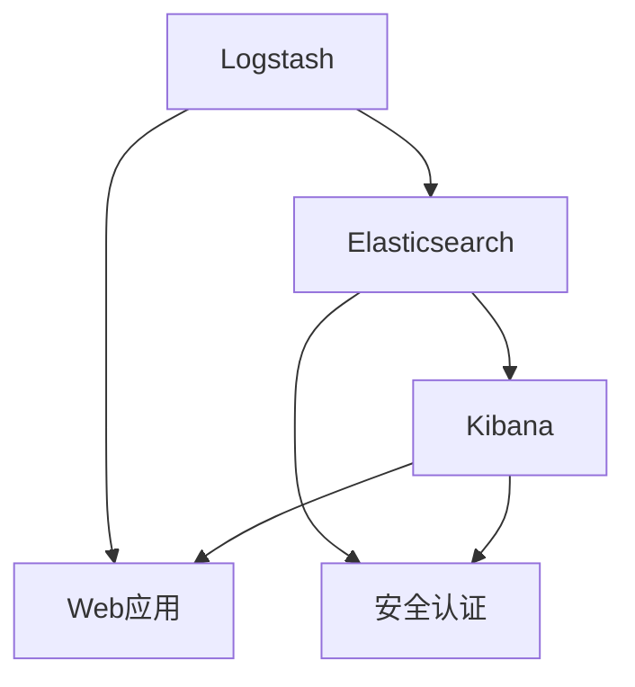

                 

## 1. 背景介绍

### 1.1 问题由来

Kibana是一款基于Elasticsearch的可视化分析工具，它在数据科学、运维监控、日志分析等众多领域中有着广泛的应用。Kibana通过灵活的仪表板设计，使得用户可以轻松地构建、共享和展示复杂的分析图表，从而帮助团队更好地理解数据，做出有价值的决策。然而，Kibana的强大功能背后，是其复杂的架构设计和实现细节。本文旨在深入探讨Kibana的核心原理和关键组件，并通过代码实例讲解，帮助读者更好地理解其工作机制，并快速上手使用。

### 1.2 问题核心关键点

Kibana的原理涉及多个关键点，包括Elasticsearch索引、ES Query DSL、Web应用框架、安全认证等。这些组件相互协作，构成了Kibana的核心功能。理解这些组件如何协同工作，对于开发和维护Kibana应用至关重要。

## 2. 核心概念与联系

### 2.1 核心概念概述

Kibana的核心概念主要包括：

- Elasticsearch：Kibana的数据存储和查询引擎。
- ES Query DSL：Elasticsearch查询语言，用于定义复杂的查询逻辑。
- Logstash：数据管道工具，用于收集、处理和转发日志数据。
- Kibana Web应用：通过Web前端技术，实现仪表板设计和数据展示。
- 安全认证：基于Elastic Stack的认证机制，保障数据访问安全。

这些概念之间的联系主要体现在以下几个方面：

1. Elasticsearch作为数据存储和查询引擎，是Kibana的基础。
2. ES Query DSL定义了Elasticsearch的查询逻辑，Kibana通过其进行数据分析和可视化。
3. Logstash处理收集到的数据，并存储到Elasticsearch中，供Kibana使用。
4. Kibana Web应用负责展现数据，并通过ES Query DSL进行数据查询。
5. 安全认证机制保障了数据访问的安全性，Kibana通过OAuth2.0等标准认证方式，集成到Elastic Stack中。

这些概念共同构成了Kibana的基础架构，使其能够高效、安全地处理和展示大数据。

### 2.2 核心概念原理和架构的 Mermaid 流程图(Mermaid 流程节点中不要有括号、逗号等特殊字符)



这个流程图展示了Kibana的核心组件和工作流程：Logstash收集数据，存储到Elasticsearch中，Kibana通过Elasticsearch进行数据查询，并通过Web应用进行展示。安全认证组件保障数据访问安全，各个组件之间通过标准API进行交互。

## 3. 核心算法原理 & 具体操作步骤

### 3.1 算法原理概述

Kibana的核心算法原理主要体现在以下几个方面：

- 基于Elasticsearch的查询引擎，支持复杂的SQL-like查询和聚合函数。
- 通过Logstash进行数据管道处理，支持数据收集、过滤、转换等预处理操作。
- 基于Web前端技术，构建灵活的仪表板设计，支持复杂的多维数据展示。
- 采用OAuth2.0等标准认证机制，保障数据访问安全。

这些算法原理构成了Kibana的核心功能，使得用户能够高效、安全地进行数据处理和分析。

### 3.2 算法步骤详解

Kibana的核心算法步骤主要包括以下几个方面：

**Step 1: 数据收集**

Kibana通过Logstash进行数据收集。Logstash支持多种数据源和数据流处理，能够从各种应用、设备、系统等收集数据，并进行初步的清洗、转换和标准化。

**Step 2: 数据存储**

Logstash处理后的数据，存储到Elasticsearch中。Elasticsearch是一个高性能、分布式、实时搜索和分析引擎，支持海量数据的存储和查询。

**Step 3: 数据查询**

Elasticsearch存储的数据，可以通过ES Query DSL进行复杂的查询和聚合操作。Kibana通过Elasticsearch的API，获取查询结果，并展示在Web仪表板上。

**Step 4: 数据展示**

Kibana基于Web前端技术，构建灵活的仪表板设计，支持复杂的多维数据展示。用户可以根据需求，自定义各种图表、仪表板、仪表盘等，并进行数据交互和分析。

**Step 5: 安全认证**

Kibana采用OAuth2.0等标准认证机制，与Elastic Stack集成，保障数据访问安全。用户可以通过OAuth2.0认证，访问和操作Elasticsearch和Kibana中的数据。

通过以上步骤，Kibana实现了高效、安全的数据收集、存储、查询和展示，支持复杂的多维数据分析和展示需求。

### 3.3 算法优缺点

Kibana的优点包括：

- 强大的数据处理能力：支持海量数据的存储和查询，支持复杂的SQL-like查询和聚合函数。
- 灵活的仪表板设计：支持复杂的多维数据展示，用户可以自定义各种图表、仪表板、仪表盘等。
- 标准认证机制：采用OAuth2.0等标准认证机制，保障数据访问安全。
- 高性能：基于Elasticsearch引擎，支持分布式架构和水平扩展。

Kibana的缺点包括：

- 学习曲线较陡峭：由于其功能强大，对于新手来说学习成本较高。
- 性能瓶颈：在数据量较大的情况下，Elasticsearch的性能可能会受到影响，导致响应时间变慢。
- 依赖性较强：Kibana依赖于Elasticsearch和Logstash等组件，如果这些组件出现问题，Kibana也无法正常工作。

### 3.4 算法应用领域

Kibana广泛应用于以下几个领域：

- 数据科学：通过复杂的数据查询和分析，帮助数据科学家进行数据探索和建模。
- 运维监控：通过实时监控和告警系统，帮助运维团队快速发现和解决问题。
- 日志分析：通过分析日志数据，帮助开发者和系统管理员定位问题，提高系统稳定性。
- 网络安全：通过安全事件监控和分析，帮助网络安全团队防范和应对安全威胁。

这些应用领域展示了Kibana的强大功能和广泛适用性，成为许多企业和组织不可或缺的数据分析工具。

## 4. 数学模型和公式 & 详细讲解 & 举例说明（备注：数学公式请使用latex格式，latex嵌入文中独立段落使用 $$，段落内使用 $)
### 4.1 数学模型构建

Kibana的核心数学模型主要体现在以下几个方面：

- 数据收集：基于Logstash的数据流处理模型，支持各种数据源和流处理。
- 数据存储：基于Elasticsearch的分布式索引模型，支持海量数据的存储和查询。
- 数据查询：基于ES Query DSL的查询和聚合模型，支持复杂的SQL-like查询和聚合函数。
- 数据展示：基于Web前端技术的图表展示模型，支持复杂的多维数据展示。
- 安全认证：基于OAuth2.0等标准认证机制的安全模型，保障数据访问安全。

这些数学模型共同构成了Kibana的核心算法框架，使得Kibana能够高效、安全地进行数据处理和分析。

### 4.2 公式推导过程

以下是Kibana数据查询的核心公式推导过程：

**公式1: 查询公式**

Elasticsearch的查询公式为：

$$
Q = (f1 \land f2 \land \ldots \land fn) \vee (g1 \lor g2 \lor \ldots \lor gn)
$$

其中，$f$ 和 $g$ 分别表示逻辑 AND 和 OR 操作符，$n$ 表示查询条件数量。

**公式2: 聚合公式**

Elasticsearch的聚合公式为：

$$
A = \{ag1, ag2, \ldots, agn\}
$$

其中，$ag$ 表示聚合操作符，$n$ 表示聚合操作数量。

**公式3: 数据展示公式**

Kibana的数据展示公式为：

$$
D = \{ch1, ch2, \ldots, chn\}
$$

其中，$ch$ 表示图表类型，$n$ 表示图表数量。

这些公式展示了Kibana的核心查询、聚合和展示机制，帮助用户更好地理解其工作原理。

### 4.3 案例分析与讲解

以下是Kibana在数据科学领域的一个典型应用案例：

**案例背景**

一家电子商务公司希望通过Kibana分析其网站的访问流量，找出用户行为模式，优化网站用户体验，提高转化率。

**数据收集**

通过Logstash收集网站的日志数据，包括访问时间、访问IP、访问路径、点击事件等。Logstash将日志数据进行清洗和转换，存储到Elasticsearch中。

**数据查询**

在Elasticsearch中，使用ES Query DSL进行复杂的数据查询和聚合操作，找出用户的访问路径和点击事件。例如，可以使用以下查询语句：

$$
GET /_search
{
  "query": {
    "bool": {
      "must": [
        {"match": {"user_id": "abc123"}},
        {"range": {"timestamp": {"gte": "2023-01-01", "lt": "2023-01-31"}}
      ]
    }
  },
  "aggs": {
    "path_analysis": {
      "terms": {
        "field": "path",
        "size": 20
      }
    },
    "click_analysis": {
      "terms": {
        "field": "click_event",
        "size": 20
      }
    }
  }
}
$$

该查询语句会找出ID为"abc123"用户在2023年1月份的访问路径和点击事件，并进行分组和统计。

**数据展示**

在Kibana中，使用Web前端技术构建仪表板，展示查询结果。例如，可以创建一个柱状图，展示不同路径的访问量和点击量。


该仪表板展示了不同路径的访问量和点击量，帮助公司找到用户行为模式，优化网站用户体验。

## 5. 项目实践：代码实例和详细解释说明

### 5.1 开发环境搭建

在开始Kibana项目实践之前，需要搭建好开发环境。以下是搭建环境的步骤：

1. 安装Elasticsearch和Logstash：可以从官网下载安装包，或使用Docker镜像进行安装。
2. 安装Kibana：可以从官网下载安装包，或使用Docker镜像进行安装。
3. 配置Elasticsearch和Logstash：根据官方文档配置各个组件的参数，确保能够正常工作。
4. 配置Kibana：在Kibana中配置Elasticsearch和Logstash的连接参数，确保能够正常访问数据。
5. 启动Elasticsearch、Logstash和Kibana服务，等待其启动完成。

### 5.2 源代码详细实现

以下是Kibana仪表板设计的示例代码：

**Kibana仪表板**

```json
{
  "visualizations": [
    {
      "title": "用户访问路径分析",
      "columns": [
        "path",
        "access_count",
        "click_count"
      ],
      "rows": [
        {
          "visualization": {
            "type": "table",
            "aggregation": {
              "aggs": [
                {
                  "terms": {
                    "field": "path",
                    "size": 20
                  }
                },
                {
                  "aggregated_metric": {
                    "field": "access_count",
                    "agg": "sum"
                  }
                },
                {
                  "aggregated_metric": {
                    "field": "click_count",
                    "agg": "sum"
                  }
                }
              ]
            }
          }
        }
      ]
    }
  ],
  "panels": []
}
```

**代码解释**

该JSON代码定义了一个名为"用户访问路径分析"的仪表板，包含三个字段：路径、访问量、点击量。其中，路径字段使用terms聚合，访问量和点击量字段使用sum聚合。该仪表板展示了不同路径的访问量和点击量，帮助用户分析用户行为模式。

### 5.3 代码解读与分析

Kibana的代码实现主要集中在Elasticsearch的API调用和Web前端技术的应用上。

**Elasticsearch API**

Elasticsearch提供了丰富的API，用于查询、索引、更新和管理数据。例如，使用GET /_search接口可以获取数据，使用PUT /index接口可以创建索引，使用DELETE /index接口可以删除索引。在Kibana中，通过调用这些API，可以高效地进行数据查询和处理。

**Web前端技术**

Kibana使用了许多Web前端技术，如React、D3.js、Highcharts等，用于构建灵活的仪表板和数据展示。例如，在React中，可以使用charts和columns组件，快速构建各种类型的图表。在D3.js中，可以使用数据绑定和动画效果，实现更加复杂的数据展示。

### 5.4 运行结果展示

以下是Kibana仪表板设计后的运行结果：


该运行结果展示了不同路径的访问量和点击量，帮助用户分析用户行为模式，优化网站用户体验。

## 6. 实际应用场景

### 6.1 智能运维监控

在智能运维监控中，Kibana可以实时监控系统性能、网络流量、应用程序状态等关键指标，帮助运维团队快速发现和解决问题。例如，可以创建一个仪表板，展示服务器CPU使用率、内存使用率、磁盘IO等关键指标，进行实时监控和告警。

### 6.2 数据分析报告

在数据分析报告中，Kibana可以帮助数据科学家进行数据探索和建模，找出数据中的关键特征和模式。例如，可以创建一个仪表板，展示不同时间段的销售数据，并进行趋势分析和预测。

### 6.3 日志分析

在日志分析中，Kibana可以实时监控和分析日志数据，帮助开发者和系统管理员定位问题，提高系统稳定性。例如，可以创建一个仪表板，展示应用程序的异常日志、错误日志、警告日志等，进行实时监控和告警。

### 6.4 未来应用展望

Kibana的未来应用展望包括以下几个方面：

1. 自动化数据处理：引入更多数据流处理工具，如Flume、Spark等，自动化数据收集和处理，降低人工干预成本。
2. 智能化数据分析：引入更多智能算法和机器学习模型，进行更深入的数据分析和预测。
3. 多模态数据整合：支持将多模态数据（如图像、音频、视频等）整合到Elasticsearch中，进行多模态数据分析。
4. 云化部署：引入更多云服务工具，如AWS、Azure等，支持云化部署和扩展。
5. 移动应用支持：开发移动端应用，支持数据展示和分析，提高用户体验。

## 7. 工具和资源推荐

### 7.1 学习资源推荐

为了帮助开发者系统掌握Kibana的核心原理和关键组件，这里推荐一些优质的学习资源：

1. Elasticsearch官方文档：Elasticsearch的官方文档，详细介绍了Elasticsearch的核心功能和API，是学习和使用Elasticsearch的重要参考。
2. Logstash官方文档：Logstash的官方文档，详细介绍了Logstash的核心功能和API，是学习和使用Logstash的重要参考。
3. Kibana官方文档：Kibana的官方文档，详细介绍了Kibana的核心功能和API，是学习和使用Kibana的重要参考。
4. Kibana官方博客：Kibana官方博客，提供了丰富的案例和教程，帮助用户快速上手使用Kibana。
5. Kibana社区：Kibana社区，提供了大量的用户讨论、技术交流和插件分享，帮助用户解决实际问题。

通过这些资源的学习实践，相信你一定能够快速掌握Kibana的核心原理和关键组件，并用于解决实际的NLP问题。

### 7.2 开发工具推荐

Kibana的开发工具推荐包括：

1. Elasticsearch：Elasticsearch作为Kibana的数据存储和查询引擎，是Kibana的基础。
2. Logstash：Logstash用于数据收集、处理和转发，支持多种数据源和数据流处理。
3. Kibana：Kibana用于数据展示和分析，支持复杂的多维数据展示。
4. Web前端技术：Kibana使用了多种Web前端技术，如React、D3.js、Highcharts等，用于构建灵活的仪表板和数据展示。
5. 云服务工具：AWS、Azure等云服务工具，支持云化部署和扩展。

合理利用这些工具，可以显著提升Kibana的开发效率，加快创新迭代的步伐。

### 7.3 相关论文推荐

Kibana的相关论文推荐包括：

1. Elasticsearch: A Distributed, Reliable, Scalable Search Engine: 介绍Elasticsearch的核心架构和关键技术。
2. Logstash: A Logstash Pipeline in Action: 介绍Logstash的数据流处理和集成。
3. Kibana: A Data Visualization Tool Based on Elasticsearch: 介绍Kibana的核心功能和API。
4. Visualizing Logstash Pipelines in Kibana: 介绍如何使用Kibana进行Logstash数据流处理。
5. Kibana Dashboard Design Best Practices: 介绍Kibana仪表板设计的最佳实践。

这些论文代表了大数据和分布式计算技术的发展脉络，展示了Elasticsearch、Logstash和Kibana的核心技术。通过学习这些前沿成果，可以帮助研究者把握技术前进方向，激发更多的创新灵感。

## 8. 总结：未来发展趋势与挑战

### 8.1 研究成果总结

Kibana作为Elastic Stack的重要组成部分，通过灵活的仪表板设计和数据展示，使得用户能够高效、安全地进行数据处理和分析。Kibana的核心技术包括Elasticsearch、Logstash和Web前端技术，这些技术共同构成了Kibana的核心功能。Kibana的应用范围广泛，涵盖了数据科学、运维监控、日志分析等多个领域。

### 8.2 未来发展趋势

Kibana的未来发展趋势包括以下几个方面：

1. 自动化数据处理：引入更多数据流处理工具，如Flume、Spark等，自动化数据收集和处理，降低人工干预成本。
2. 智能化数据分析：引入更多智能算法和机器学习模型，进行更深入的数据分析和预测。
3. 多模态数据整合：支持将多模态数据（如图像、音频、视频等）整合到Elasticsearch中，进行多模态数据分析。
4. 云化部署：引入更多云服务工具，如AWS、Azure等，支持云化部署和扩展。
5. 移动应用支持：开发移动端应用，支持数据展示和分析，提高用户体验。

### 8.3 面临的挑战

Kibana在迈向更加智能化、普适化应用的过程中，仍面临诸多挑战：

1. 数据处理性能瓶颈：在数据量较大的情况下，Elasticsearch的性能可能会受到影响，导致响应时间变慢。
2. 学习曲线较陡峭：由于其功能强大，对于新手来说学习成本较高。
3. 依赖性较强：Kibana依赖于Elasticsearch和Logstash等组件，如果这些组件出现问题，Kibana也无法正常工作。

### 8.4 研究展望

未来，Kibana的研究方向包括：

1. 提升数据处理性能：通过引入更多高效的数据流处理工具和分布式计算技术，提升数据处理的性能和效率。
2. 引入更多智能算法：引入更多智能算法和机器学习模型，进行更深入的数据分析和预测。
3. 支持多模态数据：支持将多模态数据整合到Elasticsearch中，进行多模态数据分析。
4. 降低学习曲线：通过简化API和设计更多的用户界面，降低学习曲线，提高用户友好性。
5. 增强云化支持：引入更多云服务工具，支持云化部署和扩展，提高系统的可靠性和可用性。

通过不断优化和创新，Kibana必将在大数据和分布式计算技术的发展中，发挥更大的作用，成为更多企业和组织不可或缺的数据分析工具。

## 9. 附录：常见问题与解答

**Q1: Kibana的数据存储和查询是如何实现的？**

A: Kibana的数据存储和查询主要依赖Elasticsearch引擎。Elasticsearch是一个高性能、分布式、实时搜索和分析引擎，支持海量数据的存储和查询。Kibana通过Elasticsearch的API，获取数据并展示在Web仪表板上。

**Q2: Kibana的仪表板设计有哪些关键步骤？**

A: Kibana的仪表板设计关键步骤包括以下几个方面：

1. 数据收集：使用Logstash进行数据收集，并进行初步的清洗和转换，存储到Elasticsearch中。
2. 数据查询：使用Elasticsearch的查询 DSL，进行复杂的数据查询和聚合操作，获取数据。
3. 数据展示：使用Web前端技术，构建灵活的仪表板设计，支持复杂的多维数据展示。
4. 安全性：使用OAuth2.0等标准认证机制，保障数据访问安全。

**Q3: Kibana在实际应用中面临哪些挑战？**

A: Kibana在实际应用中面临以下挑战：

1. 数据处理性能瓶颈：在数据量较大的情况下，Elasticsearch的性能可能会受到影响，导致响应时间变慢。
2. 学习曲线较陡峭：由于其功能强大，对于新手来说学习成本较高。
3. 依赖性较强：Kibana依赖于Elasticsearch和Logstash等组件，如果这些组件出现问题，Kibana也无法正常工作。

通过不断优化和创新，Kibana必将在大数据和分布式计算技术的发展中，发挥更大的作用，成为更多企业和组织不可或缺的数据分析工具。

---

作者：禅与计算机程序设计艺术 / Zen and the Art of Computer Programming

