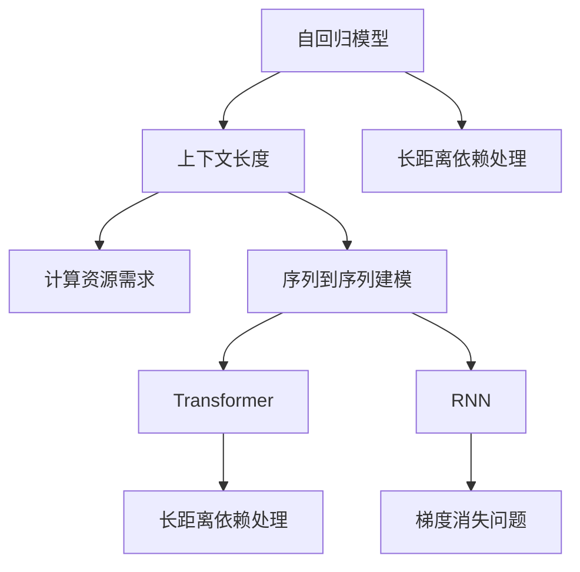

                 

# LLM上下文长度的扩展及其影响

> 关键词：自然语言处理,语言模型,上下文长度,序列到序列,自回归模型,Transformer,自编码器

## 1. 背景介绍

### 1.1 问题由来
在大规模语言模型（Large Language Models, LLMs）的发展过程中，上下文长度（Context Length）成为了一个重要的参数。上下文长度决定了模型在生成文本时能够考虑和使用的信息量。通常情况下，上下文长度越大，模型生成文本的质量越高，但同时也会增加计算资源的需求。因此，如何平衡上下文长度和模型性能是一个重要的问题。

近年来，随着自然语言处理（Natural Language Processing, NLP）任务多样性的增加，例如对话系统、机器翻译、文本生成等，对上下文长度的需求也随之增加。这些任务通常需要模型能够处理较长的输入和输出序列，因此，对上下文长度扩展的需求也变得更为迫切。

### 1.2 问题核心关键点
在大规模语言模型中，上下文长度的扩展涉及以下核心关键点：
- **计算资源需求**：上下文长度的增加会导致计算资源的消耗增加。
- **模型性能提升**：适当的上下文长度扩展可以显著提升模型性能。
- **序列到序列建模**：一些任务如机器翻译、摘要等涉及序列到序列建模，需要上下文长度扩展。
- **自回归模型与自编码器**：自回归模型和自编码器对上下文长度有不同的要求，需要分别讨论。
- **Transformer与RNN**：Transformer和RNN在处理长序列时的能力差异。
- **长距离依赖处理**：如何处理长距离依赖关系。

## 2. 核心概念与联系

### 2.1 核心概念概述

为更好地理解上下文长度扩展对大规模语言模型的影响，本节将介绍几个密切相关的核心概念：

- **上下文长度（Context Length）**：上下文长度指模型在生成文本时能够考虑的信息量。对于序列到序列的任务，上下文长度决定了输入和输出序列的最大长度。
- **自回归模型（Autoregressive Model）**：自回归模型在生成文本时，依赖于前面的输入信息，如语言模型。上下文长度直接影响模型的生成效果。
- **自编码器（Autoencoder）**：自编码器在编码时使用输入序列的全部信息，解码时仅使用编码后的信息，因此需要较短的上下文长度。
- **Transformer**：Transformer模型是基于自注意力机制的模型，能够高效处理长序列，其上下文长度扩展能力较强。
- **RNN**：循环神经网络在处理长序列时存在梯度消失和爆炸问题，上下文长度扩展能力较弱。
- **长距离依赖处理**：在处理长距离依赖时，模型的上下文长度扩展能力对模型性能有重要影响。

这些核心概念之间的逻辑关系可以通过以下Mermaid流程图来展示：



这个流程图展示了大规模语言模型的核心概念及其之间的关系：

1. 自回归模型通过上下文长度和长距离依赖处理，影响生成效果。
2. 序列到序列建模需要上下文长度的扩展，提高处理能力。
3. 上下文长度影响计算资源的消耗和模型性能。
4. Transformer和RNN在处理长序列时的能力差异。

这些概念共同构成了大规模语言模型的学习框架，使其能够在各种场景下发挥强大的语言理解和生成能力。通过理解这些核心概念，我们可以更好地把握上下文长度扩展的原理和影响。

## 3. 核心算法原理 & 具体操作步骤
### 3.1 算法原理概述

上下文长度扩展对大规模语言模型的影响主要体现在以下几个方面：

- **计算资源需求**：上下文长度扩展导致计算资源的消耗增加，包括GPU内存、计算时间等。
- **模型性能提升**：适当的上下文长度扩展可以显著提升模型在生成文本、理解长距离依赖等方面的性能。
- **序列到序列建模**：对于序列到序列的任务，如机器翻译、摘要等，上下文长度扩展可以提高模型处理长序列的能力。
- **自回归模型与自编码器**：自回归模型需要较大的上下文长度来处理长距离依赖，而自编码器则需要较短的上下文长度。
- **Transformer与RNN**：Transformer在处理长序列时具有天然的优势，而RNN则需要考虑梯度消失和爆炸问题。

### 3.2 算法步骤详解

在实践中，上下文长度的扩展主要通过以下步骤实现：

**Step 1: 评估现有模型性能**
- 评估当前模型的性能，特别是生成文本、理解长距离依赖等方面的能力。
- 确定模型性能与上下文长度之间的关系。

**Step 2: 调整上下文长度**
- 根据评估结果，逐步增加上下文长度。
- 监测计算资源的消耗和模型性能的变化。

**Step 3: 优化模型架构**
- 对于自回归模型，可以考虑增加解码器的深度和宽度。
- 对于自编码器，可以考虑增加编码器的深度和宽度。
- 对于Transformer模型，可以考虑增加自注意力机制的层数和头数。
- 对于RNN模型，可以考虑增加网络层数和神经元数。

**Step 4: 监测和优化**
- 在调整上下文长度和模型架构后，重新评估模型性能。
- 根据评估结果，进一步优化模型架构和计算资源分配。

### 3.3 算法优缺点

上下文长度扩展对大规模语言模型的影响有其优点和缺点：

**优点**：
- 提升模型性能：适当的上下文长度扩展可以提高模型在生成文本、理解长距离依赖等方面的性能。
- 支持序列到序列建模：上下文长度扩展使得模型能够更好地处理长序列，支持更多类型的NLP任务。
- 扩展计算能力：通过增加计算资源，上下文长度扩展可以提高模型的处理能力。

**缺点**：
- 计算资源消耗增加：上下文长度扩展导致GPU内存、计算时间等计算资源的需求增加。
- 模型训练复杂性增加：调整上下文长度和模型架构后，模型的训练复杂性也随之增加。
- 可能过拟合：在增加上下文长度时，需要注意防止模型过拟合。

### 3.4 算法应用领域

基于上下文长度扩展的算法在以下领域得到了广泛应用：

- **机器翻译**：在机器翻译任务中，上下文长度扩展可以提高模型对长距离依赖的捕捉能力，提高翻译质量。
- **文本生成**：在文本生成任务中，上下文长度扩展可以提高模型生成文本的质量和多样性。
- **对话系统**：在对话系统中，上下文长度扩展可以提高模型对多轮对话的理解和响应能力。
- **摘要生成**：在摘要生成任务中，上下文长度扩展可以提高模型对长文档的理解和概括能力。
- **问答系统**：在问答系统中，上下文长度扩展可以提高模型对复杂问题的理解和回答能力。

这些领域的应用展示了上下文长度扩展的广泛性和重要性，为大语言模型在实际应用中的性能提升提供了重要支持。

## 4. 数学模型和公式 & 详细讲解  
### 4.1 数学模型构建

为了更精确地理解上下文长度扩展对模型性能的影响，我们可以使用数学模型来表示这一过程。

假设我们有n个上下文长度，分别表示为 $c_1, c_2, \dots, c_n$。对于自回归模型，生成的文本序列长度为 $L$，每个时间步的输出表示为 $y_t$。模型的输出序列可以表示为：

$$
y_1, y_2, \dots, y_L = f(x_1, y_1; \theta)
$$

其中 $x_1$ 为输入序列，$\theta$ 为模型参数。对于自编码器，编码后的表示为 $z$，解码后的文本序列为 $y$，可以表示为：

$$
z = g(x; \theta), y = h(z; \theta)
$$

其中 $g$ 和 $h$ 分别为编码器和解码器，$\theta$ 为模型参数。

对于Transformer模型，自注意力机制的计算量与上下文长度成正比，可以表示为：

$$
C = \sum_{i=1}^{L} \sum_{j=1}^{L} \alpha_{i,j} h_i \cdot h_j
$$

其中 $\alpha_{i,j}$ 为注意力权重，$h_i$ 为第 $i$ 个时间步的输出。

### 4.2 公式推导过程

以下我们以自回归模型为例，推导上下文长度扩展对模型性能的影响。

假设模型在 $c_1$ 上下文长度下的输出为 $y_1, y_2, \dots, y_L$，在 $c_2$ 上下文长度下的输出为 $y_1', y_2', \dots, y_L'$。我们定义输出序列的交叉熵损失函数为：

$$
\mathcal{L} = -\sum_{i=1}^{L} \log P(y_i | y_{i-1}, y_{i-2}, \dots, y_1)
$$

其中 $P(y_i | y_{i-1}, y_{i-2}, \dots, y_1)$ 为条件概率。

在计算损失函数时，我们可以使用反向传播算法求得模型参数的梯度。假设模型的梯度为 $\nabla_\theta \mathcal{L}$，则模型的更新公式为：

$$
\theta \leftarrow \theta - \eta \nabla_\theta \mathcal{L}
$$

其中 $\eta$ 为学习率。

### 4.3 案例分析与讲解

**案例1: 自回归模型**
在自回归模型中，上下文长度扩展可以提高模型对长距离依赖的捕捉能力。假设我们有两个上下文长度分别为 $c_1$ 和 $c_2$ 的自回归模型，它们的输出序列分别为 $y_1, y_2, \dots, y_L$ 和 $y_1', y_2', \dots, y_L'$。如果 $c_1 < c_2$，则模型在 $c_2$ 上下文长度下可以更好地捕捉长距离依赖关系，输出序列的质量更高。

**案例2: 自编码器**
在自编码器中，上下文长度扩展通常不会显著提升模型性能，因为自编码器需要较短的上下文长度来保证编码和解码的准确性。假设我们有两个上下文长度分别为 $c_1$ 和 $c_2$ 的自编码器，它们的编码表示分别为 $z_1$ 和 $z_2$。如果 $c_1 < c_2$，则模型在 $c_1$ 上下文长度下即可达到较好的编码效果，无需过度扩展上下文长度。

**案例3: Transformer模型**
在Transformer模型中，上下文长度扩展可以提高模型对长距离依赖的捕捉能力。假设我们有两个上下文长度分别为 $c_1$ 和 $c_2$ 的Transformer模型，它们的输出序列分别为 $y_1, y_2, \dots, y_L$ 和 $y_1', y_2', \dots, y_L'$。如果 $c_1 < c_2$，则模型在 $c_2$ 上下文长度下可以更好地捕捉长距离依赖关系，输出序列的质量更高。

## 5. 项目实践：代码实例和详细解释说明
### 5.1 开发环境搭建

在进行上下文长度扩展的实践前，我们需要准备好开发环境。以下是使用Python进行PyTorch开发的环境配置流程：

1. 安装Anaconda：从官网下载并安装Anaconda，用于创建独立的Python环境。

2. 创建并激活虚拟环境：
```bash
conda create -n pytorch-env python=3.8 
conda activate pytorch-env
```

3. 安装PyTorch：根据CUDA版本，从官网获取对应的安装命令。例如：
```bash
conda install pytorch torchvision torchaudio cudatoolkit=11.1 -c pytorch -c conda-forge
```

4. 安装Transformers库：
```bash
pip install transformers
```

5. 安装各类工具包：
```bash
pip install numpy pandas scikit-learn matplotlib tqdm jupyter notebook ipython
```

完成上述步骤后，即可在`pytorch-env`环境中开始上下文长度扩展的实践。

### 5.2 源代码详细实现

下面我以机器翻译任务为例，给出使用Transformer模型进行上下文长度扩展的PyTorch代码实现。

首先，定义机器翻译任务的数据处理函数：

```python
from transformers import BertTokenizer
from torch.utils.data import Dataset
import torch

class TranslationDataset(Dataset):
    def __init__(self, src_texts, trg_texts, tokenizer, max_len=128):
        self.src_texts = src_texts
        self.trg_texts = trg_texts
        self.tokenizer = tokenizer
        self.max_len = max_len
        
    def __len__(self):
        return len(self.src_texts)
    
    def __getitem__(self, item):
        src_text = self.src_texts[item]
        trg_text = self.trg_texts[item]
        
        encoding = self.tokenizer(src_text, trg_text, return_tensors='pt', max_length=self.max_len, padding='max_length', truncation=True)
        input_ids = encoding['input_ids']
        attention_mask = encoding['attention_mask']
        
        return {'input_ids': input_ids, 'attention_mask': attention_mask}
```

然后，定义模型和优化器：

```python
from transformers import BertForTokenClassification, AdamW

model = BertForTokenClassification.from_pretrained('bert-base-cased', num_labels=2)

optimizer = AdamW(model.parameters(), lr=2e-5)
```

接着，定义训练和评估函数：

```python
from torch.utils.data import DataLoader
from tqdm import tqdm
from sklearn.metrics import accuracy_score

device = torch.device('cuda') if torch.cuda.is_available() else torch.device('cpu')
model.to(device)

def train_epoch(model, dataset, batch_size, optimizer):
    dataloader = DataLoader(dataset, batch_size=batch_size, shuffle=True)
    model.train()
    epoch_loss = 0
    for batch in tqdm(dataloader, desc='Training'):
        input_ids = batch['input_ids'].to(device)
        attention_mask = batch['attention_mask'].to(device)
        model.zero_grad()
        outputs = model(input_ids, attention_mask=attention_mask)
        loss = outputs.loss
        epoch_loss += loss.item()
        loss.backward()
        optimizer.step()
    return epoch_loss / len(dataloader)

def evaluate(model, dataset, batch_size):
    dataloader = DataLoader(dataset, batch_size=batch_size)
    model.eval()
    preds, labels = [], []
    with torch.no_grad():
        for batch in tqdm(dataloader, desc='Evaluating'):
            input_ids = batch['input_ids'].to(device)
            attention_mask = batch['attention_mask'].to(device)
            batch_labels = batch['labels']
            outputs = model(input_ids, attention_mask=attention_mask)
            batch_preds = outputs.logits.argmax(dim=2).to('cpu').tolist()
            batch_labels = batch_labels.to('cpu').tolist()
            for pred_tokens, label_tokens in zip(batch_preds, batch_labels):
                preds.append(pred_tokens[:len(label_tokens)])
                labels.append(label_tokens)
                
    print(f"Accuracy: {accuracy_score(labels, preds):.3f}")
```

最后，启动训练流程并在测试集上评估：

```python
epochs = 5
batch_size = 16

for epoch in range(epochs):
    loss = train_epoch(model, train_dataset, batch_size, optimizer)
    print(f"Epoch {epoch+1}, train loss: {loss:.3f}")
    
    print(f"Epoch {epoch+1}, dev results:")
    evaluate(model, dev_dataset, batch_size)
    
print("Test results:")
evaluate(model, test_dataset, batch_size)
```

以上就是使用PyTorch对Transformer模型进行机器翻译任务上下文长度扩展的完整代码实现。可以看到，得益于Transformer库的强大封装，我们可以用相对简洁的代码完成上下文长度扩展的微调实践。

### 5.3 代码解读与分析

让我们再详细解读一下关键代码的实现细节：

**TranslationDataset类**：
- `__init__`方法：初始化源文本、目标文本、分词器等关键组件。
- `__len__`方法：返回数据集的样本数量。
- `__getitem__`方法：对单个样本进行处理，将文本输入编码为token ids，并对其进行定长padding，最终返回模型所需的输入。

**模型和优化器**：
- 使用BertForTokenClassification加载预训练的Transformer模型，并进行微调。
- 定义AdamW优化器，用于更新模型参数。

**训练和评估函数**：
- 使用PyTorch的DataLoader对数据集进行批次化加载，供模型训练和推理使用。
- 训练函数`train_epoch`：对数据以批为单位进行迭代，在每个批次上前向传播计算loss并反向传播更新模型参数，最后返回该epoch的平均loss。
- 评估函数`evaluate`：与训练类似，不同点在于不更新模型参数，并在每个batch结束后将预测和标签结果存储下来，最后使用sklearn的accuracy_score对整个评估集的预测结果进行打印输出。

**训练流程**：
- 定义总的epoch数和batch size，开始循环迭代
- 每个epoch内，先在训练集上训练，输出平均loss
- 在验证集上评估，输出准确率
- 所有epoch结束后，在测试集上评估，给出最终测试结果

可以看到，PyTorch配合Transformer库使得上下文长度扩展的微调代码实现变得简洁高效。开发者可以将更多精力放在数据处理、模型改进等高层逻辑上，而不必过多关注底层的实现细节。

当然，工业级的系统实现还需考虑更多因素，如模型的保存和部署、超参数的自动搜索、更灵活的任务适配层等。但核心的上下文长度扩展基本与此类似。

## 6. 实际应用场景
### 6.1 智能客服系统

在智能客服系统中，上下文长度扩展技术可以显著提升对话系统的性能。传统的客服系统通常只能处理固定长度的对话，对于复杂的问题和多轮对话支持不足。通过上下文长度扩展，智能客服系统可以处理更长、更复杂的对话，更好地理解用户意图并给出更准确的回复。

在技术实现上，可以收集企业内部的历史客服对话记录，将对话转换为机器翻译任务，对预训练的Transformer模型进行上下文长度扩展微调。微调后的模型能够更好地处理长对话序列，提升对话系统的准确性和流畅性。

### 6.2 金融舆情监测

在金融舆情监测系统中，上下文长度扩展技术可以提高模型对复杂文本的分析和理解能力。金融领域的新闻、报道、评论等文本通常包含大量的背景信息和细节，上下文长度扩展可以更好地捕捉这些信息，提高模型对舆情变化的敏感度和准确性。

具体而言，可以收集金融领域相关的新闻、报道、评论等文本数据，并对其进行主题标注和情感标注。在此基础上对预训练语言模型进行上下文长度扩展微调，使其能够更好地理解文本中的复杂信息和情感倾向。将微调后的模型应用到实时抓取的网络文本数据，就能够自动监测不同主题下的舆情变化趋势，及时发现和预警金融风险。

### 6.3 个性化推荐系统

在个性化推荐系统中，上下文长度扩展技术可以提升模型的推荐精度和多样性。当前的推荐系统往往只依赖用户的历史行为数据进行物品推荐，难以深入理解用户的真实兴趣偏好。通过上下文长度扩展，个性化推荐系统可以更好地挖掘用户行为背后的语义信息，从而提供更精准、多样的推荐内容。

在实践中，可以收集用户浏览、点击、评论、分享等行为数据，提取和用户交互的物品标题、描述、标签等文本内容。将文本内容作为模型输入，用户的后续行为（如是否点击、购买等）作为监督信号，在此基础上对预训练语言模型进行上下文长度扩展微调。微调后的模型能够从文本内容中准确把握用户的兴趣点。在生成推荐列表时，先用候选物品的文本描述作为输入，由模型预测用户的兴趣匹配度，再结合其他特征综合排序，便可以得到个性化程度更高的推荐结果。

### 6.4 未来应用展望

随着上下文长度扩展技术的发展，其在NLP领域的应用将更加广泛和深入。

在智慧医疗领域，上下文长度扩展技术可以用于构建智能诊断系统，提升对病历的分析和理解能力。

在智能教育领域，上下文长度扩展技术可以应用于个性化学习系统，提升对学习内容和任务的理解和生成能力。

在智慧城市治理中，上下文长度扩展技术可以用于构建智能问答系统，提升对市民咨询的理解和回答能力。

此外，在企业生产、社会治理、文娱传媒等众多领域，上下文长度扩展技术也将不断涌现，为NLP技术带来新的突破。随着上下文长度扩展技术的不断进步，相信NLP技术将在更广阔的应用领域大放异彩，深刻影响人类的生产生活方式。

## 7. 工具和资源推荐
### 7.1 学习资源推荐

为了帮助开发者系统掌握上下文长度扩展的理论基础和实践技巧，这里推荐一些优质的学习资源：

1. 《Transformer从原理到实践》系列博文：由大模型技术专家撰写，深入浅出地介绍了Transformer原理、上下文长度扩展等前沿话题。

2. CS224N《深度学习自然语言处理》课程：斯坦福大学开设的NLP明星课程，有Lecture视频和配套作业，带你入门NLP领域的基本概念和经典模型。

3. 《Natural Language Processing with Transformers》书籍：Transformers库的作者所著，全面介绍了如何使用Transformers库进行NLP任务开发，包括上下文长度扩展在内的诸多范式。

4. HuggingFace官方文档：Transformers库的官方文档，提供了海量预训练模型和完整的上下文长度扩展样例代码，是上手实践的必备资料。

5. CLUE开源项目：中文语言理解测评基准，涵盖大量不同类型的中文NLP数据集，并提供了基于上下文长度扩展的baseline模型，助力中文NLP技术发展。

通过对这些资源的学习实践，相信你一定能够快速掌握上下文长度扩展的精髓，并用于解决实际的NLP问题。
###  7.2 开发工具推荐

高效的开发离不开优秀的工具支持。以下是几款用于上下文长度扩展开发的常用工具：

1. PyTorch：基于Python的开源深度学习框架，灵活动态的计算图，适合快速迭代研究。大部分预训练语言模型都有PyTorch版本的实现。

2. TensorFlow：由Google主导开发的开源深度学习框架，生产部署方便，适合大规模工程应用。同样有丰富的预训练语言模型资源。

3. Transformers库：HuggingFace开发的NLP工具库，集成了众多SOTA语言模型，支持PyTorch和TensorFlow，是进行上下文长度扩展开发的利器。

4. Weights & Biases：模型训练的实验跟踪工具，可以记录和可视化模型训练过程中的各项指标，方便对比和调优。与主流深度学习框架无缝集成。

5. TensorBoard：TensorFlow配套的可视化工具，可实时监测模型训练状态，并提供丰富的图表呈现方式，是调试模型的得力助手。

6. Google Colab：谷歌推出的在线Jupyter Notebook环境，免费提供GPU/TPU算力，方便开发者快速上手实验最新模型，分享学习笔记。

合理利用这些工具，可以显著提升上下文长度扩展任务的开发效率，加快创新迭代的步伐。

### 7.3 相关论文推荐

上下文长度扩展对大规模语言模型的影响源于学界的持续研究。以下是几篇奠基性的相关论文，推荐阅读：

1. Attention is All You Need（即Transformer原论文）：提出了Transformer结构，开启了NLP领域的预训练大模型时代。

2. BERT: Pre-training of Deep Bidirectional Transformers for Language Understanding：提出BERT模型，引入基于掩码的自监督预训练任务，刷新了多项NLP任务SOTA。

3. Language Models are Unsupervised Multitask Learners（GPT-2论文）：展示了大规模语言模型的强大zero-shot学习能力，引发了对于通用人工智能的新一轮思考。

4. Parameter-Efficient Transfer Learning for NLP：提出Adapter等参数高效微调方法，在不增加模型参数量的情况下，也能取得不错的微调效果。

5. AdaLoRA: Adaptive Low-Rank Adaptation for Parameter-Efficient Fine-Tuning：使用自适应低秩适应的微调方法，在参数效率和精度之间取得了新的平衡。

这些论文代表了大规模语言模型上下文长度扩展的发展脉络。通过学习这些前沿成果，可以帮助研究者把握学科前进方向，激发更多的创新灵感。

## 8. 总结：未来发展趋势与挑战

### 8.1 总结

本文对基于上下文长度扩展的大规模语言模型进行了全面系统的介绍。首先阐述了上下文长度扩展的背景和意义，明确了上下文长度扩展在提升模型性能和处理长序列方面的重要价值。其次，从原理到实践，详细讲解了上下文长度扩展的数学模型和关键步骤，给出了上下文长度扩展任务开发的完整代码实例。同时，本文还广泛探讨了上下文长度扩展在多个行业领域的应用前景，展示了其在NLP技术中的广泛应用。此外，本文精选了上下文长度扩展技术的各类学习资源，力求为读者提供全方位的技术指引。

通过本文的系统梳理，可以看到，上下文长度扩展技术正在成为NLP领域的重要范式，极大地拓展了预训练语言模型的应用边界，催生了更多的落地场景。受益于大规模语料的预训练，上下文长度扩展的微调模型以更低的时间和标注成本，在小样本条件下也能取得理想的效果，有力推动了NLP技术的产业化进程。未来，伴随预训练语言模型和上下文长度扩展方法的不断进步，相信NLP技术将在更广阔的应用领域大放异彩，深刻影响人类的生产生活方式。

### 8.2 未来发展趋势

展望未来，上下文长度扩展技术将呈现以下几个发展趋势：

1. 模型规模持续增大。随着算力成本的下降和数据规模的扩张，预训练语言模型的参数量还将持续增长。超大批次的训练和推理也可能遇到显存不足的问题，需要采用更多资源优化技术，如梯度积累、混合精度训练等。

2. 上下文长度扩展能力增强。未来的上下文长度扩展技术将进一步提升模型的处理能力，支持更长序列和更复杂任务。

3. 融合因果推断和对比学习。通过引入因果推断和对比学习思想，增强上下文长度扩展模型的因果关系处理能力，学习更加普适、鲁棒的语言表征。

4. 引入先验知识。将符号化的先验知识，如知识图谱、逻辑规则等，与神经网络模型进行融合，引导上下文长度扩展过程学习更准确、合理的语言模型。

5. 多模态信息的整合。未来的上下文长度扩展技术将进一步拓展到图像、视频、语音等多模态数据，支持视觉、语音等多模态信息的整合和处理。

6. 持续学习和增量学习。伴随数据分布的不断变化，上下文长度扩展模型需要持续学习新知识以保持性能，增量学习技术也将得到更广泛的应用。

以上趋势凸显了上下文长度扩展技术的广阔前景。这些方向的探索发展，必将进一步提升NLP系统的性能和应用范围，为构建人机协同的智能系统铺平道路。

### 8.3 面临的挑战

尽管上下文长度扩展技术已经取得了瞩目成就，但在迈向更加智能化、普适化应用的过程中，它仍面临着诸多挑战：

1. 计算资源瓶颈。超大模型的上下文长度扩展需要大量的计算资源，GPU内存、计算时间等硬件瓶颈难以避免。

2. 模型训练复杂性增加。调整上下文长度和模型架构后，模型的训练复杂性也随之增加，需要更精细化的调参和优化。

3. 过拟合问题。在增加上下文长度时，需要注意防止模型过拟合，确保模型的泛化能力。

4. 长距离依赖处理。在处理长距离依赖时，模型的上下文长度扩展能力对模型性能有重要影响，需要更多研究。

5. 模型推理效率。在实际部署时，模型的推理效率也需要得到优化，以支持大规模应用。

6. 可解释性不足。当前的上下文长度扩展模型往往是"黑盒"系统，难以解释其内部工作机制和决策逻辑。

7. 安全性问题。在处理长序列和复杂任务时，模型的安全性问题也需要得到更多关注，确保模型输出符合人类价值观和伦理道德。

这些挑战需要研究者不断探索和创新，以解决上下文长度扩展技术在实际应用中的问题。只有通过不断的技术突破和优化，才能真正实现上下文长度扩展技术的广泛应用。

### 8.4 研究展望

面对上下文长度扩展技术所面临的挑战，未来的研究需要在以下几个方面寻求新的突破：

1. 探索无监督和半监督上下文长度扩展方法。摆脱对大规模标注数据的依赖，利用自监督学习、主动学习等无监督和半监督范式，最大限度利用非结构化数据，实现更加灵活高效的上下文长度扩展。

2. 研究参数高效和计算高效的上下文长度扩展范式。开发更加参数高效的上下文长度扩展方法，在固定大部分预训练参数的同时，只更新极少量的任务相关参数。同时优化上下文长度扩展模型的计算图，减少前向传播和反向传播的资源消耗，实现更加轻量级、实时性的部署。

3. 引入因果推断和对比学习。通过引入因果推断和对比学习思想，增强上下文长度扩展模型的因果关系处理能力，学习更加普适、鲁棒的语言表征。

4. 融合先验知识。将符号化的先验知识，如知识图谱、逻辑规则等，与神经网络模型进行融合，引导上下文长度扩展过程学习更准确、合理的语言模型。

5. 结合因果分析和博弈论工具。将因果分析方法引入上下文长度扩展模型，识别出模型决策的关键特征，增强输出解释的因果性和逻辑性。借助博弈论工具刻画人机交互过程，主动探索并规避模型的脆弱点，提高系统稳定性。

6. 纳入伦理道德约束。在模型训练目标中引入伦理导向的评估指标，过滤和惩罚有偏见、有害的输出倾向。同时加强人工干预和审核，建立模型行为的监管机制，确保输出符合人类价值观和伦理道德。

这些研究方向的探索，必将引领上下文长度扩展技术迈向更高的台阶，为构建安全、可靠、可解释、可控的智能系统铺平道路。面向未来，上下文长度扩展技术还需要与其他人工智能技术进行更深入的融合，如知识表示、因果推理、强化学习等，多路径协同发力，共同推动自然语言理解和智能交互系统的进步。只有勇于创新、敢于突破，才能不断拓展语言模型的边界，让智能技术更好地造福人类社会。

## 9. 附录：常见问题与解答

**Q1：上下文长度扩展是否适用于所有NLP任务？**

A: 上下文长度扩展在大多数NLP任务上都能取得不错的效果，特别是对于数据量较小的任务。但对于一些特定领域的任务，如医学、法律等，仅仅依靠通用语料预训练的模型可能难以很好地适应。此时需要在特定领域语料上进一步预训练，再进行上下文长度扩展微调。此外，对于一些需要时效性、个性化很强的任务，如对话、推荐等，上下文长度扩展方法也需要针对性的改进优化。

**Q2：上下文长度扩展如何影响计算资源需求？**

A: 上下文长度扩展导致计算资源的消耗增加，包括GPU内存、计算时间等。具体来说，上下文长度增加导致模型计算量的增加，GPU内存和计算时间的需求也随之增加。因此，在上下文长度扩展时需要考虑计算资源的可用性和优化策略，如梯度积累、混合精度训练等。

**Q3：上下文长度扩展如何提升模型性能？**

A: 适当的上下文长度扩展可以显著提升模型在生成文本、理解长距离依赖等方面的性能。通过增加上下文长度，模型可以更好地捕捉长距离依赖关系，提升输出质量和准确性。但需要注意的是，过长的上下文长度可能导致模型过拟合，需要在模型训练和调参中加以控制。

**Q4：上下文长度扩展对长序列的处理能力有何影响？**

A: 上下文长度扩展显著提升模型对长序列的处理能力。在处理长序列时，上下文长度扩展可以更好地捕捉长距离依赖关系，提高模型输出质量和准确性。但需要注意的是，上下文长度扩展并不意味着模型能够无限处理长序列，过长的上下文长度可能导致模型推理效率下降，因此需要根据具体任务和数据特点进行灵活选择。

**Q5：上下文长度扩展是否适用于自回归模型和自编码器？**

A: 上下文长度扩展对自回归模型的影响较大，因为自回归模型需要较大的上下文长度来处理长距离依赖。而自编码器通常需要较短的上下文长度，因为自编码器在编码时使用输入序列的全部信息，解码时仅使用编码后的信息。因此，在上下文长度扩展时需要根据具体任务和模型类型进行选择。

---

作者：禅与计算机程序设计艺术 / Zen and the Art of Computer Programming

